<!-- readme.md of 2016-book-1 -->


# Web Developer&apos;s Reference Guide

#### A one-stop guide to the essentials of web development including popular
frameworks such as jQuery,

### Bootstrap, AngularJS, and Node.js

#### **Joshua Johanan Talha Khan Ricardo Zea**

BIRMINGHAM - MUMBAI
Web Developer&apos;s Reference Guide
Copyright © 2016 Packt Publishing

All rights reserved. No part of this book may be reproduced, stored in a
retrieval system, or transmitted in any form or by any means, without
the prior written permission of the publisher, except in the case of
brief quotations embedded in critical articles or reviews.

Every effort has been made in the preparation of this book to ensure the
accuracy of the information presented. However, the information
contained in this book is sold without warranty, either express or
implied. Neither the authors, nor Packt Publishing, and its dealers and
distributors will be held liable for any damages caused or alleged to be
caused directly or indirectly by this book.

Packt Publishing has endeavored to provide trademark information about
all of the companies and products mentioned in this book by the
appropriate use of capitals. However, Packt Publishing cannot guarantee
the accuracy of this information.

First published: March 2016 Production reference: 1180316

Published by Packt Publishing Ltd.
Livery Place
35 Livery Street
Birmingham B3 2PB, UK.

ISBN 978-1-78355-213-9 [**www.packtpub.com**](http://www.packtpub.com/)

### Credits

| <b>Authors</b>                          | <b>Technical Editor</b>    |
| --------------------------------------- | -------------------------- |
| Joshua Johanan                          | Abhishek R. Kotian         |
|                                         |                            |
| Talha Khan                              | <b>Copy Editor</b>         |
|                                         |                            |
| Ricardo Zea                             | Pranjali Chury             |
|                                         |                            |
| <b>Reviewers</b>                        | <b>Project Coordinator</b> |
|                                         |                            |
| Chetankumar Akarte                      | Kinjal Bari                |
|                                         |                            |
| Gergo Bogdan                            | <b>Proofreader</b>         |
|                                         |                            |
| Rahul Devaskar                          | Safis Editing              |
|                                         |                            |
| David Ellenwood                         | <b>Indexer</b>             |
|                                         |                            |
| Philippe Reneiver Gonin                 | Monica Ajmera Mehta        |
|                                         |                            |
| Robert Mion                             | <b>Graphics</b>            |
|                                         |                            |
| Natalie Olivo                           | Disha Haria                |
|                                         |                            |
| Mateus Ortiz                            | <b>Production Coordinator</b> |
|                                         | Conidon Miranda            |
| <b>Commissioning Editor</b>             |                            |
|                                         | <b>Cover Work</b>          |
| Edward Gordon                           |                            |
|                                         | Conidon Miranda            |
| <b>Acquisition Editor</b>               |                            |
|                                         |                            |
| Meeta Rajani                            |                            |
|                                         |                            |
| <b>Content Development Editor</b>       |                            |

> Samantha Gonsalves

### About the Authors

<b>Joshua Johanan</b> is a web developer who currently lives in South Bend,
Indiana. He has been a web developer for five years. He has built sites
using many different languages, including PHP, Python, JavaScript, and
C#; although if asked, he would prefer using Python and JavaScript.
These languages have led him to use different MVC frameworks, such as
Zend Framework, Django, and .Net&apos;s MVC.

As you can see from this book, Joshua has also used JavaScript on both
the backend with Node.js and frontend using many different libraries.
These include Backbone, React, jQuery, and plain old JavaScript.

He currently works for a healthcare organization, writing websites in
C#. This does not allow him to utilize the latest flashy browser
technologies, but it does enforce good development skills, such as
maintainability and scalability.

This is his first book, but he does post somewhat regularly on his blog
at [<b>http://</b> <b>ejosh.co/de/</b>.](http://ejosh.co/de/)

> I would like to thank my wife, Liz, for her support through the
> writing of this book. I would also like to thank Dexter and Gizmo, who
> hung out by my feet as I wrote most of this book.

<b>Talha Khan</b> is a passionate web developer, JavaScript enthusiast,
software consultant, and coffee freak from Pakistan who is currently
residing in UAE. He has more than five years of experience in this
field. Despite graduating in mathematics and statistics, his love for
web technologies pushed him toward the field of web technologies. He is
experienced in developing interactive websites and web applications
using PHP, MYSQL, and Dot Net Suite along with HTML, CSS, and JavaScript
libraries. He has been teaching web development as well and is an active
contributor on programming forums such as StackOverflow. Occasionally,
he tweets at <b>&commat;alphaprofile</b>.

Talha has worked and consulted on various projects for several major
brands and companies. <b>Tossdown.com</b>, a leading restaurants and food
search engine of Pakistan, is among one of his major achievements. He is
also running his own start-up while educating newbies on technology. He
is currently working as a software architect for UAE&apos;s biggest swimming
academy, Hamilton Aquatics.

> I want to thank my parents for keeping me motivated and my friends who
> supported me in writing, as I could count on them anytime if I had to
> use their laptop. I am also grateful to Tahir Ali Khan, who helped me
> at every step throughout my career and was like a guiding light.
>
> I would like to take this opportunity to thank all the teachers and
> mentors who helped me shape my career and helped me whenever I needed
> it. These people were my source of inspiration. A special thanks to
> Omair Bangash, who took the risk of employing someone from a non-IT
> background and taught me to a level where I am now teaching others.
> His confidence in me was enough to push me to reach to my goals. I
> worked under many projects of various scales and technologies under
> his supervision. He helped me at every step to hone my skills. I
> don&apos;t think I would be have been able to write this book had it not
> been for his constant support and motivation. Without learning from
> these teachers, there is not a chance I could be doing what I do
> today, and it is because of them and others who I may not have listed
> here that I feel compelled to pass my knowledge on to those willing to
> learn.

<b>Ricardo Zea</b> hails originally from Medellín, Colombia. He is a
passionate and seasoned full-stack designer who is now located in
Dayton, Ohio, USA. He is always looking for ways to level up his skills
and those around him. Constantly wondering how things are made on the
Web, how they work, and why, have made Ricardo a very technical
designer, allowing him to explain to others the intricacies of design
and the technicalities of the Web in ways that are very easy to
understand and assimilate.

Ricardo has a master&apos;s degree in publicity and advertising and has deep
passion for understanding human behavior. He also has a fiercely
competitive PC gaming hunger. Together, all this has allowed him to
switch from the creative side of the brain to the rational side very
easily, allowing him to visualize and create technically sound web and
mobile designs that are responsive, perform well, and convey the proper
message through design.

Ricardo is the author of *Mastering Responsive Web Design*, *Packt
Publishing*. He&apos;s also the organizer of the CodePen Dayton meetup
group. He&apos;s a member of the Dayton web developers and UX Dayton meetup
groups. He&apos;s also one of the first members of SitePoint&apos;s Ambassadors
program. He&apos;s also the author of the monthly web design and development
newletter Level Up!. He was also a technical reviewer for *Sass and
Compass, Designers Cookbook*, and *Sass Essentials*, all by Packt
Publishing. For several years, he was also a Flash and CorelDRAW
professor at different universities in his home country, Colombia.

Ricardo has 15 years of experience in web design and 20 years of
experience in visual and graphic design.

> A huge and infinite thanks to my wife, Heather, and my beautiful son,
> Ricardo. They are my inspiration to be a better professional, a better
> person, a better husband, and a better dad.
>
> To my mom, Socorro, who showed me the values that made me the man I am
> today. To my dad, Ricardo &quot;Pinta&quot; Zea, for teaching me to be
> determined to not only be good at what I do but to be the best I can
> be.
>
> To God, for allowing me to share with everyone my knowledge of CSS.
>
> And to you, the readers, for giving me the chance to help you be
> better web professionals.

### About the Reviewers

<b>Chetankumar Akarte</b> is the CEO of Renuka Technologies Private
Limited, Nagpur, located in central India. He is an engineer
(electronics) from Nagpur University with more than 10 years of
experience in the design, development, and deployment of web-based,
Windows-based, and mobile-based applications with expertise in PHP,
.NET, JavaScript, Java, Android, and more.

Chetankumar likes to contribute to newsgroups and forums. He has written
articles for Electronics For You, DeveloperIQ, and Flash and Flex
Developer&apos;s Magazine. In his spare time, he likes to maintain his
technical blog ([<b>http://www.tipsntracks.</b>
<b>com</b>)](http://www.tipsntracks.com/) to get in touch with the
developer community. He has been the technical reviewer for four books
published by Packt Publishing. He has released more than 96 applications
on the Android market! One of his applications, an English to Hindi
Dictionary, is like a pocket dictionary for students, which has more
than a hundred thousand downloads. You can find it at
[<b>https://play.google.com/store/apps/</b>
<b>details?id=com.sachi.hindi.dictionary</b>](https://play.google.com/store/apps/details?id=com.sachi.hindi.dictionary).

Chetankumar lives in Nagpur with wife, Shraddha, and his two children,
Kaiwalya and Hrutvij. You can visit his websites,
[<b>http://www.sahityachintan.com</b>](http://www.sahityachintan.com/) and
<b>http://www.tipsntracks.com</b>, or get in touch with him at
<b>chetan.akarte@gmail.</b> <b>com</b>.

> I&apos;d like to thank my wife, Shraddha, and my parents for their
> consistent support and encouragement. I&apos;d also like to thank my
> lovely children, Kaiwalya and Hrutvij, who allowed me to dedicate all
> of their playtime with me to this book. I&apos;d also like to thank Packt
> Publishing for this opportunity to do something useful, especially the
> project coordinator, Kinjal Bari, for all the valuable support.

<b>Gergo Bogdan</b> is a software engineer with over eight years of
experience in the IT industry. During this time, he worked at small
companies as well as multinational organizations. He has vast expertise
in multiple technologies, starting from .NET and Python to JavaScript
and Java. He loves to create technical articles and tutorials for fellow
developers, and he is a passionate blogger
([http://grelution.com)](http://grelution.com/). He is the author of
the *Web API Development with Flask* video course, *Packt Publishing*.

<b>Rahul Devaskar</b> is a software engineer with experience of building
real-time event-driven applications, context-aware applications, and web
applications. His expertise includes web apps development, mobile apps
development, API server development, and real-time analytics. He has
built apps using AngularJS, Node.js, MongoDB, and Ionic.

> I&apos;d like to thank my wife, Niyati, for her constant support and
> encouragement.

<b>David Ellenwood</b> is a frontend developer and WordPress expert with
more than 15 years of experience on the Web. As the owner and solo
developer at DPE Websmithing and Design, LLC, he enjoys providing
consulting services to midsize customers looking to update or extend
their existing websites beyond traditional brochureware. He lives with
his beautiful wife and two amazing boys at the westernmost tip of Lake
Superior in Superior, Wisconsin.

<b>Philippe Renevier Gonin</b> has been an assistant professor at the
University Nice Sophia Antipolis (UNS), France, since 2005. He teaches
web technologies, software engineering (architecture and development),
and HCI (Human Computer Interaction). On the research front, Philippe
works on connections between usercentered design (for example, user and
tasks models) and software engineering (for example, component
architecture and UI development).

<b>Robert Mion</b> takes every effort to design experiences that
continually delight, empower, and inspire people, often by repeatedly
triggering that magical moment when your brain makes your mouth go A ha!
or Of course!. This passion was ignited when watching Pixar&apos;s Toy Story
at the age of eight. The fire has only grown since then.

Robert continues to use his amassed knowledge of storytelling, color,
typography, layout, design, human psychology, and web technologies as an
excuse to have fun every day by crafting experiences designed to go
beyond solving problems---to emotionally connect with users and to help
them become more awesome.

Robert and his wife, Laura, currently live in Fort Mill, SC---minutes
south of the Queen City---with their two pugs (one, a pug-boxer mix).

<b>Natalie Olivo</b> has worked with web-based technologies for almost a
decade and began her career in coding when the majority of HTML pages
were tabular and inflexible. She remembers the excitement and
satisfaction in the creative process of building her first prototype for
a messaging application while she was employed at one of the first
popular social networks in the age before Facebook. Natalie&apos;s wide
ranging experience include key development roles in companies such as
Godiva, Barnes and Noble, and The Daily Beast. She has spent the last
year building out the mobile web experience at The Daily Beast, and
enjoys the challenges of building applications that are performant for
mobile web. She is currently a senior frontend engineer at Business
Insider.

<b>Mateus Ortiz</b> is the creator of some cool open source projects such
as Web

Components Weekly
([<b>webcomponentsweekly.me</b>)](http://webcomponentsweekly.me/), the
first weekly World of Web Components, and web components the right way,
and other projects. He is only 17 years old and spends his days helping
and creating new open source projects. Mateus lives in Brazil where he
makes several talks on the frontend. You can find him on Twitter at
<b>twitter.com/mteusortiz</b>.

> First of all, I&apos;d like to thank God. I&apos;d like to thank my mother,
> who always supports me and helps me in everything, my father, and all
> my family and friends. I&apos;d also like to thank Packt Publishing for
> the opportunity to assist in the review of this book.

## www.PacktPub.com

### eBooks, discount offers, and more

Did you know that Packt offers eBook versions of every book published,
with PDF and ePub files available? You can upgrade to the eBook version
at [<b>www.PacktPub.</b> <b>com</b>](http://www.PacktPub.com/) and as a print
book customer, you are entitled to a discount on the eBook copy. Get in
touch with us at <b>customercare@packtpub.com</b> for more details.

At [<b>www.PacktPub.com</b>,](http://www.PacktPub.com/) you can also read a
collection of free technical articles, sign up for a range of free
newsletters and receive exclusive discounts and offers on Packt books
and eBooks.


[<b>https://www2.packtpub.com/books/subscription/packtlib</b>](https://www2.packtpub.com/books/subscription/packtlib)

Do you need instant solutions to your IT questions? PacktLib is Packt&apos;s
online digital book library. Here, you can search, access, and read
Packt&apos;s entire library of books.

<b>Why subscribe?</b>

-   Fully searchable across every book published by Packt

-   Copy and paste, print, and bookmark content

-   On demand and accessible via a web browser

## Table of Contents

<b>[Preface xxi]</b>

<b>[Chapter 1: HTML Elements 1]</b>

<b>DOCTYPE 1</b>
Attributes 2
Description 2

<b>html 2</b>
Attributes 2
Description 2

<b>Document metadata 3</b>
head 3

<b>Semantic content sections 9</b>
body 9
section 9
nav 10
Headings 11
header 12
footer 13
address 13
aside 14
p 14

<b>Content sections 14</b>
hr 15
pre 15
blockquote 15
ol 16
ul 17
li 17
dl 18
dt 19
dd 19
figure 20
figcaption 20
div 21

<b>Inline elements 22</b>
a 22
abbr 23
bdo 23
br 24
cite 24
code 25
dfn 25
em 25
kbd 26
mark 26
q 26
s 27
samp 27 small 27 span 28 strong 28 sub 28 sup 29 time 29 var 30 wbr 30

<b>Embedded content 30</b> img 30 embed 33 object 34 param 35 video 35
audio 36 source 37 track 38 <b>Tables 39</b> table 39 caption 39 colgroup
40 tbody 40
thead 41
tfoot 41
tr 42
td 43
th 43

<b>Forms 44</b>
Form 44
fieldset 45
legend 46
label 46
input 47
button 49
select 50
optgroup 51
option 52
textarea 53

<b>Drawing elements 54</b>
canvas 54
svg 55

<b>[Chapter 2: HTML Attributes 57]</b>

<b>Global attributes 57</b>
accesskey 57
class 58
contenteditable 58
data-&ast; 58
dir 59
draggable 59
id 60
lang 60
spellcheck 61
style 61
tabindex 61
title 62

<b>Miscellaneous 62</b>
accept 62
accept-charset 63
action 63
alt 64
async 64
autocomplete 65
autofocus 65
autoplay 66
autosave 66
cite 66
cols 67
colspan 67
datetime 68
disabled 68
download 69
content 69
controls 70
for 70
form 71
formaction 71
height 72
href 72
hreflang 73
label 73
list 74
loop 74
max 75
maxlength 75
media 76
method 76
min 76
multiple 77
name 77
novalidate 78
pattern 78
placeholder 79
poster 79
readonly 79
rel 80
required 80
reversed 81
rows 81
rowspan 82
scope 82
selected 83
size 83
src 84
start 84
step 85
type 85
value 86
width 87
wrap 87

<b>[Chapter 3: CSS Concepts and Applications 89]</b>

<b>Basic selectors 90</b>
The simple selector 90
The type selectors 90
The universal selector 91
The attribute selectors 92
The class selectors 93
The ID selectors 94

<b>Combinators 94</b>
Descendant combinator 95
The child combinator 96
The adjacent sibling combinator 97
The general sibling combinator 97
The selector specificity 98

<b>Pseudo-classes 99</b>
The link pseudo-classes 99
User action pseudo-classes 100
The structural selectors 101
:first-child 102
:first-of-type 102
:last-child 103
:last-of-type 103
:nth-child() 104
:nth-last-child 104
:nth-last-of-type and :nth-of-type 105
:only-child 106
:only-of-type 106

<b>Validation 107</b>
:checked 107
:default 107
:disabled and :enabled 108
:empty 108
:in-range and :out-of-range 109
:invalid and :valid 110
:not or negation 110
:optional and :required 111
:lang() 111
<b>Pseudo-elements 112</b>
::before and ::after 112
::first-letter 113
::first-line 113
::selection 114

<b>Generated content 114</b>
content 115
Quotation marks 116

<b>[Chapter 4: CSS Properties -- Part 1 117]</b>

<b>Animation 118</b>

Base markup and CSS 118

Final CSS code 130

<b>Background 131</b>
background-attachment 131
background-blend-mode 132
background-clip 134
background-color 135
background-image 136
background-origin 138

<b>Box model 143</b>
width 143
height 144
padding 145
margin 146
border 148
box-sizing 150
max-height 150
max-width 151
min-height 152
min-width 153
object-fit 154
object-position 155

<b>Border radius 156</b>
border-radius 156

<b>Unit 158</b>
Relative length units 158
Viewport-relative length units 161
Absolute length units 162
Angle data types 164
Resolution units 165
Duration units 165
Column 166

<b>Flexible box (flexbox) 172</b>
flex-grow 173
flex-shrink 173
flex-basis 174
flex-direction 175
flex-wrap 176
flex-flow 177
align-content 178
align-items 179
align-self 180
order 181
justify-content 182
flex 183

<b>Summary 183</b>
<b>[Chapter 5: CSS Properties -- Part 2 185]</b>
<b>Fonts 185</b>
font-family 185
font-feature-settings 186
font-size 188
font-size-adjust 189
font-stretch 190
font-style 191
font-variant 192
font-variant-ligatures 192
font-weight 193
font 194

<b>Transform 195</b>
transform 195
transform-origin 197
transform-style 198
Transition 199

<b>Positioning 202</b>
position 202
top 203

```
> bottom 204
> left 205
> right 206
> vertical-align 207
> <b>Text 207</b>
> color 208
> text-align 208
> text-decoration 209
> text-decoration-line 210
> text-decoration-color 210
> text-decoration-style 211
> text-indent 211
> text-overflow 211
> text-rendering 212
> text-shadow 214
> text-transform 214
> text-underline-position 215
> direction 216
> <b>Tables 217</b>
> table-layout 217
> border-collapse 218
> border-spacing 218
> empty-cells 219
> caption-side 219
> <b>Words and paragraphs 220</b>
> hyphens 220
> word-break 221
> word-spacing 222
> word-wrap 223
> line-height 223
> orphans 224
> quotes 225
> widows 226
> writing-mode 226
> letter-spacing 227
> white-space 228
> tab-size 229
> <b>Paging 229</b> page-break-after 230 page-break-before 230
> page-break-inside 231
> <b>&lbrack;</b>
```

<b>[Chapter 6: CSS Properties -- Part 3 233]</b>
<b>Page box 233</b>
bleed 233
marks 234
<b>List 234</b>
list-style 235
list-style-type 235
list-style-position 236
list-style-image 237
<b>Counter 237</b>
counter-reset 238
counter-increment 239
<b>Drop shadows 240</b>
box-shadow 240

<b>Display and visibility 242</b>
all 242
clear 243
display 245
opacity 247
filter 248
overflow 252
overflow-x 253
overflow-y 253
visibility 254
z-index 255

<b>Masking and clipping 255</b>
mask 256
mask-clip 257
mask-composite 258
mask-image 259
mask-mode 260
mask-origin 260
mask-position 261
mask-repeat 262
mask-size 263
mask-type 264
mask-border 264
mask-border-source 264
mask-border-mode 265
mask-border-slice 265
mask-border-width 266
mask-border-outset 267
mask-border-repeat 268
clip-path 268

<b>Image rendering and orientation 271</b>
image-orientation 272
image-rendering 272
<b>User interface 273</b>
cursor 273
pointer-events 276
outline 277
<b>3-Dimensional 278</b>
perspective 278
perspective-origin 279
backface-visibility 280

**Summary 280**
**[Chapter 7: CSS Functions 283]**
**Filter 283**
brightness() 283
contrast() 284
grayscale() 284
invert() 285
hue-rotate() 285
blur() 286
saturate() 286
sepia() 286
Transforms 287
matrix() 287
matrix3d() 288
rotate() 288
rotate3d() 289
rotateX() 289
rotateY() 290
rotateZ() 291
scale() 291
scale3d() 292
scaleX() 292
scaleY() 293
scaleZ() 293
skew() 294
skewX() 294
skewY() 295
steps() 295
translate() 296
translate3d() 297
translateX() 297
translateY() 298
translateZ() 298

**Colors 299**
hsl() and hsla() 299
rgb() and rgba() 300

**Gradients 300**
linear-gradient() 301
radial-gradient() 302
repeating-linear-gradient() 304
repeating-radial-gradient() 305

**Values 306**
attr() 306
Responsive Table 307
calc() 308
url() 309
cubic-bezier() 310

**Miscellaneous 312**
drop-shadow() 312
element() 312
image() 313
opacity() 313
perspective() 314
rect() 314

**At-rules 315**
&commat;charset 315
&commat;document() 316
&commat;font-face 317
&commat;import 320
&commat;keyframes 321
&commat;media 323
&commat;namespace 324
&commat;page 325
&commat;supports 326

**Global CSS keyword values 328**
**Summary 331**

**Chapter 8: JavaScript Implementations, Syntax Basics,**
**[and Variable Types 333]**
**History of JavaScript 334**
Evolution of JavaScript 335
**JavaScript implementations 335**
Core JavaScript (ECMAScript) 336
Document object model (DOM) 336
Browser object model (BOM) 337
Client-side JavaScript 337
Loading external JavaScript files 339
Server-side JavaScript 341
**The language syntax 344**
Language 345
Type 345
**The character set 345**
Identifiers 351
Reserved keywords 351
Comments 353
Literals 354
Statements 356
Optional semicolon 359
**Data type 360**
The typeof operator 361
The undefined type 362
The null type 363
The number type 364
The Boolean type 366
The string type 367
The object type 368
**Variable, scope, and memory 369**
Variable declaration 371
The variable scope 372
Primitive and reference values 373
The execution context and scope 374
Garbage collection 375
**Chapter 9: JavaScript Expressions, Operators, Statements,**
**[and Arrays 377]**
**Expressions 377**
Primary expressions 378
Object initializer 379
The function definition expression 380
The property access expression 381
The invocation expression 382
The object creation expression 383
Evaluation expression 383
**Operators 384**
Overview 384
Arithmetic operators 385
Logical operators 390
Assignment operators 393
Exponentiation assignment (&ast;&ast;=) 396
Relational operators 396
**Statements 400**
Expression statements 401
Compound empty statements 401
Declaration statements 402
Conditional statements 403
Loops 407
Jumps and labeled statements 411
**Arrays 414**
Array types 414
Array type object 415
Creating arrays 415
Reading and writing array elements 417
Multidimensional arrays in JavaScript 417
Properties in an array 418
Array methods 419
ECMA5 Array methods 426
**[Chapter 10: JavaScript Object-Oriented Programming 433]**
**Polymorphism 433**
Encapsulation 433
Inheritance 434
Abstraction 434
**Objects 434**
Creating objects 435
Design patterns 436
Property getter and setter 449
Deleting properties 450
Testing properties 450
Enumerating properties 451
**&lbrack; &rbrack;**
Property attributes 452
Serializing objects 454
Objects methods 454
**Functions and methods 455**
Invoking functions 455
Defining functions 455
Function arguments and parameters 456
Parameters and return values 456
Functions as namespace 457
Closure 457
Function properties 458
Methods 458
Function constructor 458
**Classes and modules 459**
Classes and prototypes 459
Constructors 460
Defining a class 461
Classes in the ECMA5 script 462
Modules 462
**Inheritance 463**
Prototype chaining 463
Constructor stealing 464
Combination inheritance 465
Prototypal inheritance 466
Parasitic inheritance 467
Parasitic combination inheritance 468
Subclasses 469
**Built-in objects 470**
Global objects 470
Date object 471
Math object 475
The RegExp object 478
String object 480
Array objects 484
**[Chapter 11: Extending JavaScript and ECMAScript 6 491]**
**Compatibility and goals 491**
**JavaScript subset and extensions 493**
JavaScript subsets 493
JavaScript extensions 496
Const 496
Let 497
Destructuring assignment 498
For each 498
Iterator 498
Generators 498
Array 498
Generator expression 498
**Scoped variables and constants 499**
**Shorthand functions 500**
**Multiple catch clauses 500**
The try clause 500
The catch clause 501
The finally clause 502
**E4X -- ECMAScript for XML 504**
**ECMAScript 6 features 504**
Arrow functions 505
Classes 506
Enhanced object literals 507
Template strings 509
Destructuring assignment 510
Extended parameter handling 512
Bindings 514
Iterators and the for&period;..of operator 515
Generators 516
Better Unicode support 516
Modules 517
Module loaders 518
Collections 519
Proxies 532
Symbols 532
Subclassable built-ins 534
Promises 534
Core math library APIs 539
Binary and octal literals 540
Reflect API 540
Tail calls 551

**[Chapter 12: Server-side JavaScript -- NodeJS 553]**

**File and process management 555**

Modules 555
The OS module 558
The process module 559
File functions 564
The path module 571
REPL 574
Handling errors 575

```
> **Utilities 577** Events 577
```

Crypto 580

```
> Buffer 584 Console 589 npm (Node Package Manager) 591
```

Stream 593

```
> **The net module 598** createServer 598 net.Server 599
> **The HTTP module 604** createServer 604 http.Server 605
> IncomingMessage 607 ServerResponse 609 http.request 611 http.get 612
> http.clientRequest 613
```

**[Chapter 13: Bootstrap -- The Stylish CSS Frontend Framework
615]**

**Introduction to Bootstrap foundations 615**
**Getting started 617**
**Layouts 617**
**The grid system 620**
**Typography 624**

```
> **Tables 627 Lists 629**
```

**Forms in Bootstrap 630**
**Images 634**
**Navigation elements 636**
**The navigation bar 637**
**Panels 638**
**Breadcrumbs 639**
**Labels and badges 640**
**Pagination 640**
**Progress bars 641**
**Advanced Bootstrap/JavaScript plugins 642**
**Customizing Bootstrap 652**
**Websites built with Bootstrap 652**
**Bootstrap resources 653**
**[Chapter 14: jQuery -- The Popular JavaScript Library 655]**
**The evolution of JQuery 655**
**Getting started 656**
Installing JQuery 656
**Using jQuery 656**
**Selectors 657**
Element selectors 658
ID selectors 658
Class selectors 659
**Events 659**
Mouse events 659
Keyboard events 667
Form events 669
Document events 674
**Effects and animations 676**
Hide, show, and toggle 678
Fade 681
Sliding 685
**Callback 688**
callbacks.add() 688
callbacks.fire() 689
callbacks.remove() 690
callbacks.disable() 690
**Chaining 691**
**jQuery and the document object model 691**
**jQuery traversing 692**
Ancestors 693
Descendants 694
Siblings 695
Filtering 699
**Using AJAX in jQuery 701**
The jQuery Ajax load 701
jQuery Ajax Get 702
jQuery Ajax Post 703

```
> **&rbrack;**
```

**Miscellaneous jQuery functions 704**

noConflict() 704
param() 704
index() 705
each() 706
data() 707
removeData() 707
**jQuery plugins 708**
**jQuery resources 709**
**[Chapter 15: AngularJS -- Google&apos;s In-Demand Framework
711]**
**Modules (ngApp) 712**
module 712
config 713
run 714

**Routing (ngRoute) 715**
ngView 715
&dollar;routeProvider 715
&dollar;route 716
&dollar;routeParams 717
**Dependency injection 718**
Dependency injection in Angular 718
injector 719
&dollar;injector 719
**Controllers 720**
ngController 721
&dollar;scope 721
Data binding and templates 722
Event binding 722
**Scope 722**
Digest cycle 722
&dollar;digest 723
&dollar;watch 723
&dollar;apply 724
Hierarchies 725
**Services 725**
Factory 726
Service 727
Provider 728
Value 729

```
> **&rbrack;**
```

Constant 730
&dollar;http 730
Convenience methods 731
Notable services 733
**Promises 733**
&dollar;q 734
**Expressions 735**
Expressions in JavaScript 735
**Directives 736**
Normalization 736
Scope 736
Modifying DOM 739
Event binding 740
Directive definition object 741
Key directives 742
**Globals 754**
Extend 754
noop 755
isUndefined 756
Copy 756
Bind 757
**Forms 757**
ngModel 758
CSS classes 758
Validation 758
**Testing 760**
Unit testing with Jasmine and Karma 760
ngMock 761
Unit testing controllers 763
Unit testing directives 763
Unit testing services 764
**[Index 767]**
**&lbrack; xix &rbrack;**

```
> [www.allitebooks.com](http://www.allitebooks.org/)
```

### Preface

This book covers many concepts that any web developer may need to know.
These concepts may be new or known, but forgotten. The first two
chapters in this book will cover the basic elements and attributes of
HTML. The next four chapters will cover the concepts and syntax of CSS.
JavaScript will be the focus of the next five chapters. Finally, we will
cover external libraries. These include Bootstrap, jQuery, and Angular.
Because this is a reference guide, it is not set up as a read-through
tutorial. Each section and concept is written to stand on its own so
that you can find the piece of information that you need quickly.

### What this book covers

*Chapter 1*, *HTML Elements*, covers all the elements that you will need
when building a web page. This is focused on HTML5.

*Chapter 2*, *HTML Attributes*, focuses on any the attributes that can
be used with HTML elements.

*Chapter 3*, *CSS Concepts and Applications,* focuses on selectors.
Selectors are core to determining which elements the CSS attributes
apply to.

*Chapter 4*, *CSS Properties -- Part I*, covers properties for
animation, background, the box model, CSS units, columns, and the mighty
Flexbox.

*Chapter 5*, *CSS Properties -- Part II*, covers properties for fonts,
transforms, transitions, positions, text, tables, words and paragraphs,
and paging.

*Chapter 6*, *CSS Properties -- Part III*, covers properties for the
page box, lists, counters, drop shadows, display and visibility,
clipping and masking, user interface, and 3D.

*Preface*

*Chapter 7*, *CSS Functions*, covers functions for filters, transforms,
colors, gradients, and values. It covers a few extra concepts like
at-rules, global keyword values, and miscellaneous.

*Chapter 8*, *JavaScript Implementations, Syntax Basics, and Variable
Types*, talks about JavaScript implementations and language basics,
including syntax and variables and their types. This chapter will enable
us to understand and get started with basic scripting.

*Chapter 9*, *JavaScript Expressions, Operators, Statements, and
Arrays*, enables us to advance with our basic JavaScript language
understanding and introduces JavaScript expressions, basic operators,
statements, loops, conditions, and arrays. This also covers examples for
better understanding.

*Chapter 10*, *JavaScript Object-Orientated Programming*, explains the
basic concepts of object-oriented programming, that is, inheritance,
polymorphism, abstraction, and encapsulation. You will also learn the
usage of objects, classes, and related methods. We will cover examples
for better understanding.

*Chapter 11*, *Extending JavaScript and ECMA Script 6*, covers all the
newly introduced features of ECMAScript 6, which was released in 2015,
such as new objects, patterns, syntax changes, and new methods on
existing objects. This chapter covers all these features in detail.

*Chapter 12*, *Server-side JavaScript -- NodeJS*, continues to focus on
JavaScript. The difference is that we will now write JavaScript on the
server side instead of the client side. We can use the concepts covered
in the other JavaScript chapters in addition to learning specific NodeJS
objects and paradigms.

*Chapter 13*, *Bootstrap -- The Stylish CSS Frontend Framework*, talks
about Bootstrap, which is an intuitive framework for creating responsive
websites. It uses JavaScript, HTML, and CSS. This chapter will give you
a detailed look at the Bootstrap framework and will enable you to create
responsive layouts and web pages. Each topic in this chapter has a
relevant example.

*Chapter 14*, *jQuery -- The Popular JavaScript Library*, focuses on
jQuery, which is a JavaScript library that simplifies dealing with
various aspects of an HTML document. In this chapter, you will learn to
traverse elements of an HTML document, methods, event handling,
animations, and AJAX for rapid development.

*Chapter 15*, *AngularJS -- Google&apos;s In-Demand Framework*, is where we
conclude this book by finishing the external library section. Angular
has been one of the most popular frameworks since it was introduced by
Google. We will look at all the main concepts that you will need to
begin writing applications with Angular.

*Preface*

### What you need for this book

Most likely, for this book, you will need nothing that you are not
already using! You will need a computer, a browser, and a text editor.
Each chapter will cover different concepts and languages, so there may
be differences between each chapter.

Here is a summary of the various things you will need throughout the
chapters:

-   For Chapters 1-5, you will only need a text editor and a browser.

-   For Chapters 6-11, you will need the same text editor and browser,
    but with JavaScript being a programming language, I would recommend
    an integrated development environment (IDE). JetBrains makes a great
    IDE called WebStorm for web development. However, this is not
    necessarily needed for these chapters.

-   For Chapters 12-14, you will again need a text editor and browser.
    An IDE would also be very helpful for this section. Anytime you are
    dealing with complex frameworks, an IDE will make your life easier.

Although you can just use a notepad and a browser to do any sort of
development, an IDE is always preferred and suggested for development in
any specific language. I would suggest using Adobe Dreamweaver for
beginners. The intellisense of IDE makes it a lot easier to code as it
auto-suggests various methods, names, and variables, so you don&apos;t have
to remember everything. As we will be dealing with the elements and
document nodes in the JQuery section, you should have extensions enabled
in your browser. ECMA Script 6 is very recent and not fully supported by
all browsers. In some examples, you might have to load ES6 compilers to
enable that feature in your browser. However, I would highly recommend
that you use the latest version of Google Chrome as a client, as it
covers most of the sections in ES6.

### Who this book is for

This book is intended for beginners as well as advanced web developers.
This book will be a valuable resource for anyone who is a web developer.
You can look up any concept that deals with HTML, CSS, JavaScript,
NodeJS, Bootstrap, jQuery, or Angular in this book.

### Conventions

In this book, you will find a number of text styles that distinguish
between different kinds of information. Here are some examples of these
styles and an explanation of their meaning.

*Preface*

Code words in text, database table names, folder names, filenames, file
extensions, pathnames, dummy URLs, user input, and Twitter handles are
shown as follows:

&quot;HTML5 has a simple document type declaration, **&lt;!DOCTYPE html&gt;**.&quot;

A block of code is set as follows:

> **&lt;div class=&quot;example&quot;&gt;**
>
> **This is an example HTML element**
>
> **&lt;/div&gt;**

When we wish to draw your attention to a particular part of a code
block, the relevant lines or items are set in bold:

> **try{**
>
> **JSON.parse(jsonObject);**
>
> **} catch (ex) {**
>
> **//do something with this error**
>
> **}**

Any command-line input or output is written as follows:

**&num; cp /usr/src/asterisk-addons/configs/cdr_mysql.conf.sample**

**/etc/asterisk/cdr_mysql.conf**

**New terms** and **important words** are shown in bold. Words that you
see on the screen, for example, in menus or dialog boxes, appear in the
text like this: &quot;Clicking the **Next** button moves you to the next
screen.&quot;

> Warnings or important notes appear in a box like this.
>
> Tips and tricks appear like this.

*Preface*

### Reader feedback

Feedback from our readers is always welcome. Let us know what you think
about this book---what you liked or disliked. Reader feedback is
important for us as it helps us develop titles that you will really get
the most out of.

To send us general feedback, simply e-mail **feedback@packtpub.com**,
and mention the book&apos;s title in the subject of your message.

If there is a topic that you have expertise in and you are interested in
either writing or contributing to a book, see our author guide at
[**www.packtpub.com/authors**.](http://www.packtpub.com/authors)

### Customer support

Now that you are the proud owner of a Packt book, we have a number of
things to help you to get the most from your purchase.

#### Downloading the example code

You can download the example code files for this book from your account
at [**http://** **www.packtpub.com**](http://www.packtpub.com/). If you
purchased this book elsewhere, you can visit [**http://www.**
**packtpub.com/support**](http://www.packtpub.com/support) and register
to have the files e-mailed directly to you.

You can download the code files by following these steps:

1.  Log in or register to our website using your e-mail address and
    password.

2.  Hover the mouse pointer on the **SUPPORT** tab at the top.

3.  Click on **Code Downloads & Errata**.

4.  Enter the name of the book in the **Search** box.

5.  Select the book for which you&apos;re looking to download the code
    files.

6.  Choose from the drop-down menu where you purchased this book from.

7.  Click on **Code Download**.

Once the file is downloaded, please make sure that you unzip or extract
the folder using the latest version of:

-   WinRAR / 7-Zip for Windows

-   Zipeg / iZip / UnRarX for Mac

-   7-Zip / PeaZip for Linux

#### Errata

Although we have taken every care to ensure the accuracy of our content,
mistakes do happen. If you find a mistake in one of our books---maybe a
mistake in the text or the code---we would be grateful if you could
report this to us. By doing so, you can save other readers from
frustration and help us improve subsequent versions of this book. If you
find any errata, please report them by visiting
[**http://www.packtpub.**
**com/submit-errata**](http://www.packtpub.com/submit-errata), selecting
your book, clicking on the **Errata Submission Form** link, and entering
the details of your errata. Once your errata are verified, your
submission will be accepted and the errata will be uploaded to our
website or added to any list of existing errata under the Errata section
of that title.

To view the previously submitted errata, go to
[**https://www.packtpub.com/books/**
**content/support**](https://www.packtpub.com/books/content/support) and
enter the name of the book in the search field. The required information
will appear under the **Errata** section.

#### Piracy

Piracy of copyrighted material on the Internet is an ongoing problem
across all media. At Packt, we take the protection of our copyright and
licenses very seriously. If you come across any illegal copies of our
works in any form on the Internet, please provide us with the location
address or website name immediately so that we can pursue a remedy.

Please contact us at **copyright@packtpub.com** with a link to the
suspected pirated material.

We appreciate your help in protecting our authors and our ability to
bring you valuable content.

#### Questions

If you have a problem with any aspect of this book, you can contact us
at **questions@packtpub.com**, and we will do our best to address the
problem.

### HTML Elements

**HyperText Markup Language** (**HTML**) is a language that annotates
text. Annotation of text is done using elements. Using the following
**p** element, as an example, we will see how to use HTML:

> **&lt;p&gt;This is an example&lt;/p&gt;**

HTML elements also have attributes that will modify how they are
rendered or interpreted. Attributes are added inside of the starting
tag. Here is the **class** attribute in a **div** element:

> **&lt;div class=&quot;example&quot;&gt;This is an example&lt;/div&gt;**

There have been multiple specifications of HTML so far, but we will just
look at the most commonly used and important elements of HTML5. HTML5 is
the latest official specification, so we will be as future-proof as
possible at the time of writing this book. You will want to follow the
specifications of HTML as closely as possible. Most browsers are very
forgiving and will render your HTML, but when you go beyond the
specifications, you can and will run into strange rendering issues.

> All HTML elements will have global attributes. The attributes listed
> for each element in the sections that follow are the attributes beyond
> the global attributes.

### DOCTYPE

The DOCTYPE element defines the document type of the file, as follows:

> **&lt;!DOCTYPE documentType&gt;**

#### Attributes

The **documentType** attribute that you can see in the preceding code
lets the browser know the type of document you will use.

#### Description

HTML5 has a simple document type declaration, **&lt;!DOCTYPE html&gt;**.
This lets the browser know that the document is HTML5. The previous
versions of HTML needed a formal definition of the version being used,
but HTML5 has removed this for simplicity.

Most browsers will enforce strict adherence to the document type
declared and try and figure out what it is based on looking at the
document. This can lead to rendering issues, so it is recommended that
you do follow the standards.

Here is an HTML5 declaration:

> **&lt;!DOCTYPE html&gt;**

### html

The **html** element is the root element of the HTML document:

> **&lt;html manifest&gt;&lt;/html&gt;**

#### Attributes

The **manifest** attribute links to a resource manifest that lists which
files should be cached.

#### Description

The **html** element must directly follow the **DOCTYPE** element. This
is the root element that all other elements must be descendants of.

The **html** element must have one **head** element and one **body**
element as its children. All other elements will be inside these tags.

Here is what a simple HTML page looks like:

```
> **&lt;!DOCTYPE html&gt;**
> **&lt;html manifest=&quot;offline.appcache&quot;&gt;&lt;head&gt;**
> **&lt;/head&gt;**
> **&lt;body&gt;**
> **Hey**
> **&lt;/body&gt;**
> **&lt;/html&gt;**
```

### Document metadata

The next elements will give metadata about the document. In addition to
this, you can also include links to resources, such as CSS and
JavaScript.

### head

The **head** element is the metadata parent element. All other metadata
elements will be children of this element:

```
<b>&lt;head&gt;&lt;/head&gt;</b>
```

**Description**

The **head** element usually must have a **title** element inside it.
The elements that can go in **head** are **title**, **link**, **meta**,
**style**, **script**, **noscript**, and **base**. These elements are
explained next.

Here is an example of the **head** element that defines a **title** and
**stylesheet** element:

```
> **&lt;head&gt;**
>
> **&lt;title&gt;Title that appears as the tab name&lt;/title&gt;**
```

**&lt;link href=&quot;style.css&quot; rel=&quot;stylesheet&quot; type=&quot;text/css&quot;
media=&quot;all&quot; /&gt; &lt;/head&gt; title**

The **title** element displays the title of the document. This is what
is displayed in the browser&apos;s tab or the browser window:

> **&lt;title&gt;&lt;/title&gt;**

#### Description

The **title** element is an aptly named element. This is a required
element in **head**, and there should only be one **title** element for
a document. Here is a simple example of **title** element:

> **&lt;head&gt;**
>
> **&lt;title&gt;Example&lt;/title&gt; &lt;/head&gt;**

**link**

The **link** element links a resource to the current document:

> **&lt;link crossorigin href media rel sizes type&gt;&lt;/link&gt;**

#### Attributes

The attributes that are used in the **link** element are as follows:

-   **crossorigin**: This tells the browser whether to make the
    **Cross-Origin Resource Sharing** (**CORS**) request or not

-   **href**: This indicates the URL of the resource

-   **media**: This selects the media that this resource applies to

-   **rel**: This indicates the relationship of this resource to the
    document

-   **sizes**: This is used with **rel** when it is set to **icons**

-   **type**: This indicates the type of content of the resource

#### Description

The **link** element has a lot of attributes, but most of the time, it
is used for loading the CSS resources. This means that you will want to
use the attributes **href**, **rel**, **type**, and **media** at least.

You can have multiple **link** elements in a **head** element. Here is a
simple example of how to load CSS:

> **&lt;link href=&quot;style.css&quot; rel=&quot;stylesheet&quot; type=&quot;text/css&quot;
> media=&quot;all&quot; /&gt;**
>
> **&lt;link href=&quot;style.css&quot; media=&quot;screen&quot; rel=&quot;styleshhet&quot; sizes
> type=&quot;text/css&quot;&gt;&lt;/link&gt;**

#### See also

You can also refer to the **crossorigin**, **href**, **media**, **rel**,
**sizes**, and **type** attributes to find out more details about the
**title** element.

**meta**

The **meta** element contains metadata about the document. The syntax is
as follows:

> **&lt;meta content http-equiv name&gt;&lt;/meta&gt;**

#### Attributes

The attributes that are used in the **meta** element are as follows:

-   **content**: This states the value of either the **name** or
    **http-equiv** attribute.

-   **http-equiv**: This attribute, in the case of HTML5, can be set to
    **defaultstyle**, which sets the default style. Alternatively, it
    can be set to **refresh**, which can specify the number of seconds
    taken to refresh the page and a different URL for the new page if
    needed, for example, **httpequiv=&quot;1;url=http://www.google.com&quot;**.

-   **name**: This states the name of the metadata.

#### Description

The **meta** tag has many nonstandard applications. The standardized
applications can be viewed in *Chapter 2*, *HTML Attributes*.

> Apple has many **meta** tags that will pass information to an iOS
> device. You can set a reference to an App Store application, set an
> icon, or display the page in the full screen mode, as just a few
> examples. All of these tags are nonstandard, but useful when targeting
> iOS devices. This is true for many other sites and companies.

You can use multiple **meta** tags in a **head** element. Here are two
examples. The first example will refresh the page every 5 seconds and
the other will define the **author** metadata:

> **&lt;meta http-equiv=&quot;refresh&quot; content=&quot;5&quot; /&gt;**
>
> **&lt;meta name=&quot;author&quot; content=&quot;Joshua&quot; /&gt;**

#### See also

You can also refer to the **name** attribute to find out more details
about the **meta** element.

**style**

The **style** element contains the style information.

<h4>CSS</h4>:

> **&lt;style media scoped type&gt;&lt;/style&gt;**

#### Attributes

The attributes that are used in the **style** element are as follows:

-   **media**: This is a media query

-   **scoped**: The styles contained in this element only apply to the
    parent element

-   **type**: This sets the type of document; the default value is
    **text**/<h4>CSS</h4>

#### Description

The **style** element is usually in the **head** element. This allows
you to define CSS styles for the current document.

The preferred method of using CSS is to create a separate resource and
use the **link** element. This allows styles to be defined once and used
everywhere on a website instead of defining them on every page. This is
a best practice as it allows us to define the styles in one spot. We can
then easily find and change styles.

Here is a simple inline stylesheet that sets the font color to blue:

> **&lt;style media=&quot;screen&quot; scoped type=&quot;text/css&quot;&gt; body{**
>
> **color: #0000FF;**
>
> **}**
>
> **&lt;/style&gt;**

#### See also

You can also refer to the global attributes and Chapters 3-7 to know
more details about the style element.

**base**

The **base** element is the base URL for the document. The syntax is as
follows:

> **&lt;base href target&gt;**

#### Attributes

The attributes that are used in the **base** element are as follows:

-   **href**: This indicates the URL to be used as the base URL

-   **target**: This indicates the default target to be used with the
    URL

#### Description

The base URL is used whenever a relative path or URL is used on a page.
If this is not set, the browser will use the current URL as the base
URL.

Here is an example of how to set the base URL:

> **&lt;base href=&quot;http://www.packtpub.com/&quot;&gt;**

#### See also

You can also refer to the **target** attribute to find out more details
about the **base** element.

**script**

The **script** element allows you to reference or create a script for
the document:

> **&lt;script async crossorigin defer src type&gt;&lt;script&gt;**

#### Attributes

The attributes that are used in the **script** element are as follows:

-   **async**: This is a Boolean attribute that tells the browser to
    process this script asynchronously. This only applies to the
    referenced scripts.

-   **crossorigin**: This tells the browser whether to make a CORS
    request or not.

-   **defer**: This is a Boolean attribute that tells the browser to
    execute the script after the document has been parsed.

-   **src**: This distinguishes the URL of the script.

-   **type**: This defines the type of the script that defaults to
    JavaScript if the attribute is omitted.

#### Description

The **script** element is the way to get JavaScript into your document
and add enhanced interactivity. This can be done using a bare **script**
tag and adding JavaScript into the element. Also, you can use the
**src** attribute to reference an external script. It is considered a
best practice to reference a script file as it can be reused here.

This element can be a child of **head** or can be placed anywhere in the
body of the document. Depending on where the **script** element is
located, you may or may not have access to the DOM.

Here are two examples of using a **script** element. The first example
will reference an external script, the second will be an inline
**script** element, and the last will show how to use the
**crossorigin** attribute:

> **&lt;script src=&quot;example.js&quot; type=&quot;text/javascript&quot;&gt;&lt;/script&gt;**
>
> **&lt;script&gt; var a = 123;**
>
> **&lt;/script&gt;**
>
> **&lt;script async crossorigin=&quot;anonymous&quot; defer
> src=&quot;application.js&quot; type=&quot;text/javascript&quot;&gt;&lt;script&gt;**

**noscript**

The **noscript** element will be parsed if scripting is turned off in
the browser. The syntax is as follows:

> **&lt;noscript&gt;&lt;/noscript&gt;**

#### Description

If scripting is enabled, the content inside of this element will not
appear on the page and the code inside it will run. If scripting is
disabled, it will be parsed.

This element is mainly used to let the user know that the site may not
work with JavaScript. Almost every website today not only uses
JavaScript, but requires it.

Here is an example of the **noscript** element:

> **&lt;noscript&gt; Please enable JavaScript.**
>
> **&lt;/noscript&gt;**

## Semantic content sections

The next elements are the main elements to use when adding content to
the document. For example, using the **article** element instead of an
arbitrary **div** element allows the browser to infer that this is the
main content of the page. These elements should be used to give
structure to a document and not be used for styling purposes. Semantic
elements make our HTML document more accessible using an ever-increasing
amount of different devices.

**body**

The **body** element is the main content section of the document. There
must be only one main element, its syntax is as follows:

> **&lt;body&gt;&lt;/body&gt;**

**Attributes**

The attributes of the **body** element include the **inline** event
attributes.

**Description**

The **body** element is the main content section of most documents. It
must be the second child element of **html**, and there should only be
one **body** element in a document.

Here is an example of the **body** element:

> **&lt;body&gt;**
>
> **&lt;span&gt;Example Body&lt;/span&gt; &lt;/body&gt;**

### section

The **section** element describes the content section of a document. For
example, this can be a chapter of a book:

> **&lt;section&gt;&lt;/section&gt;**

**Description**

The **section** element is a new element that was introduced in HTML5. A
**section** element should group the content together. While not a
requirement, using a **heading** element as the first element in the
code is a best practice. The section should be viewed as another part of
the outline of the document. It groups related items into an easily
targeted area. You can use this element multiple times in a document.

Here is an example of the **section** element:

> **&lt;section&gt;**
>
> **&lt;h2&gt;Section Heading&lt;/h2&gt;**

**&lt;p&gt;Section content.&lt;/p&gt; &lt;/section&gt;**

**nav**

The **nav** element is the navigation element:

> **&lt;nav&gt;&lt;/nav&gt;**

**Description**

The **nav** element is another semantic element introduced with HTML5.
This lets the browser know that the content of this element is the
parent and is for navigation. The **nav** element enhances accessibility
by giving screen readers a landmark for navigation. This element should
wrap any site navigation or other links that are grouped together for
ease of navigation. You can use this multiple times.

Here is an example of using the **nav** element:

> **&lt;nav&gt;**
>
> **&lt;ul&gt;**
>
> **&lt;li&gt;&lt;a href=&quot;#&quot;&gt;Home&lt;/a&gt;&lt;/li&gt;**
>
> **&lt;/ul&gt;**
>
> **&lt;/nav&gt;**

**article**

The **article** element is designed to wrap content that can stand on
its own:

> **&lt;article&gt;&lt;/article&gt;**

**Description**

The **article** element is a new element introduced in HTML5. The
**article** element is similar to the **section** element; in that, it
denotes that the content in the element is the core part of the page.
The **article** element should be a complete composition that can stand
on its own. For example, in a blog, the actual blog post should be
wrapped with an **article** element.

Content can then be further broken down using either an **article**
element or a **section** element. There is no standard rule for when to
use either. However, both should be related to the content in the outer
**article** element.

Here is an example of the **article** element being used:

> **&lt;article&gt;**
>
> **&lt;header&gt;**
>
> **&lt;h1&gt;Blog Post&lt;/h1&gt;**
>
> **&lt;/header&gt;**
>
> **&lt;p&gt;This post covers how to use an article element&period;..&lt;/p&gt;**
>
> **&lt;footer&gt;**
>
> **&lt;address&gt;**
>
> **Contact the author, Joshua**
>
> **&lt;/address&gt;**
>
> **&lt;footer&gt;**
>
> **&lt;/article&gt;**

### Headings

The **heading** elements are the elements that specify different levels
of headings according to their importance:

> **&lt;h1&gt;&lt;/h1&gt;**
>
> **&lt;h2&gt;&lt;/h2&gt;**
>
> **&lt;h3&gt;&lt;/h3&gt;**
>
> **&lt;h4&gt;&lt;/h4&gt;**
>
> **&lt;h5&gt;&lt;/h5&gt;**
>
> **&lt;h6&gt;&lt;/h6&gt;**

**Description**

These should be used to give relative importance to different headings.
For example, **h1** should be used for the title of the document. The
importance of a heading goes down as the heading value goes up, that is,
**h6** is the least important level of heading in the example that
follows.

Here is an example using all the headings:

> **&lt;h1&gt;Heading Importance 1&lt;/h1&gt;**
>
> **&lt;h2&gt;Heading Importance 2&lt;/h2&gt;**
>
> **&lt;h3&gt;Heading Importance 3&lt;/h3&gt;**
>
> **&lt;h4&gt;Heading Importance 4&lt;/h4&gt;**
>
> **&lt;h5&gt;Heading Importance 5&lt;/h5&gt;**
>
> **&lt;h6&gt;Heading Importance 6&lt;/h6&gt;**

**See also**

You can also refer to the global attributes to learn the **heading**
element in more detail.

### header

The **header** element groups the content that is considered to be the
header for a particular group of content, its syntax is as follows:

> **&lt;header&gt;&lt;/header&gt;**

**Description**

The **header** element is usually one of the first content elements on
the page. It will most likely contain navigation options, a logo, and/or
a search box. The header is usually repeated on multiple pages of a
website. Each section or article can also contain a header. This is a
new element introduced in HTML5.

Here is an example of the **header** element:

> **&lt;header&gt;**
>
> **&lt;img src=&quot;logo.png&quot; /&gt;**
>
> **&lt;/header&gt;**

**See also**

You can also refer to the global attributes to find out about the
**header** element in more detail.

### footer

The **footer** element provides a footer of a particular group of
content, its syntax is as follows:

> **&lt;footer&gt;&lt;/footer&gt;**

**Description**

The **footer** element wraps all the content that is considered to be
the footer of the document. Usually, this will include copyright,
author, and/or social media links. Of course, what you decide to put
into a footer is arbitrary. Each section or article can also contain a
footer.

Here is an example of the **footer** element:

> **&lt;footer&gt;**

**Written by: Joshua Johanan**

**&lt;/footer&gt;**

**address**

The **address** element is used for the contact address of the author or
organization, its syntax is as follows:

> **&lt;address&gt;&lt;/address&gt;**

**Description**

Use the **address** element when you have the contact information of the
user. The **address** element will add semantic value to the content,
contrary to a regular **div** element.

Usually, this will be placed in the footer, but it can be used in an
article or body section. It will apply to the nearest **article**
element or to the entire document. Do not use any of the content section
elements in an **address** element.

Here is the **address** element in use:

> **&lt;footer&gt;**
>
> **&lt;address&gt;**
>
> **Please contact me at my &lt;a href=&quot;#&quot;&gt;website&lt;/a&gt;**
>
> **&lt;/address&gt;**
>
> **&lt;/footer&gt;**
>
> [www.allitebooks.com](http://www.allitebooks.org/)

### aside

The **aside** element is for supplemental content:

> **&lt;aside&gt;&lt;/aside&gt;**

**Description**

Use the **aside** element to highlight the content that is tied to the
main article. Some examples in the context of the blog would be the
author&apos;s profile, other posts by this author, or even related
advertisements.

Here is an example of **aside**:

> **&lt;aside&gt;**
>
> **Peyton Manning is a 5-time MVP (2003, 2004, 2008, 2009, 2013)**
>
> **&lt;/aside&gt;**

**p**

The **p** element is known as the paragraph element. This is a block
element, its syntax is as follows:

> **&lt;p&gt;&lt;/p&gt;**

**Description**

The **p** element should be used to distinguish between separate
paragraphs in a document. This element is associated with the **text**
and **inline** elements. You will not want to use a **div** element, for
example. If you find yourself wanting to do this, you may want to build
your document differently.

Here are a couple of paragraphs:

> **&lt;p&gt;This is an intro paragraph.&lt;/p&gt;**
>
> **&lt;p&gt;This paragraph will build upon the opening.&lt;/p&gt;**

## Content sections

The **content** sections are quite similar to the semantic content
sections. The main difference is that the use of all the given elements
are not driven by the outline or purpose of the document like the
semantic sections are.

### hr

The **hr** element is the horizontal rule element, its syntax is as
follows:

> **&lt;hr&gt;**

**Description**

By default, the **hr** element will draw a horizontal line in the
content. You can change the look of this element through CSS.

This element should never have any content inside of it:

> **&lt;p&gt;This is a paragraph.&lt;/p&gt;**

**&lt;hr/&gt; &lt;p&gt;This paragraph goes in another direction.&lt;/p&gt;**

**pre**

The **pre** element is the preformatted text:

> **&lt;pre&gt;&lt;/pre&gt;**

**Description**

The text in an HTML document is usually not shown in the browser with
the same whitespace or line breaks as it is in a text document. The
**pre** element allows you to display text in the same way as it is in
the document. Whitespace and line breaks will be preserved.

Here is an example of using line breaks:

**&lt;pre&gt;This text has some line breaks.&lt;/pre&gt; blockquote**

The syntax of a **blockquote** element is as follows:

> **&lt;blockquote cite&gt;&lt;/blockquote&gt;**

**Attributes**

The **cite** attribute is used in the **blockquote** element to point to
the URL of the cited document.

**Description**

The **blockquote** element is used when pulling a quotation out of a
document or text.

Here is an example:

> **&lt;blockquote cite=&quot;https://www.packtpub.com/&quot;&gt;**
>
> **&lt;p&gt;Contact Us&lt;/p&gt;**
>
> **&lt;/blockquote&gt;**

### ol

The **ol** element is the ordered list element, which has the following
syntax:

> **&lt;ol reversed start type&gt;&lt;/ol&gt;**

**Attributes**

The attributes that are used in the **ol** element are as follows:

-   **reversed**: This is a Boolean value. It denotes that the list is
    in a reverse order.

-   **start**: This accepts a value as a number to start with.

-   **type**: This will change the type of the numbered elements. By
    default, we can have a numbered list (**1**), but we can change to
    other types, such as lowercase letters (**a**), uppercase letters
    (**A**), lowercase Roman numerals (**i**), and uppercase Roman
    numerals (**I**).

**Description**

The **ol** element can be used in the same situations as a **ul**
element, except that an **ol** element is numbered instead of bulleted.
For example, you would use a **ul** element for a grocery list and an
**ol** element for a numbered set of instructions. You can have multiple
**ul** or **ol** elements nested within each other.

The items in the list will be the **li** elements.

Here is an example of a list that uses Roman numerals and starts at
**10**.

> **&lt;ol start=&quot;10&quot; type=&quot;i&quot;&gt;**
>
> **&lt;li&gt;Roman numeral 10&lt;/li&gt;**
>
> **&lt;li&gt;Roman numeral 11&lt;/li&gt;**
>
> **&lt;/ol&gt;**

**See also**

You can also refer to the **ul** and **li** elements to find out more
about the **ol** element. **ul**

The **ul** element is an unordered list element:

> **&lt;ul&gt;&lt;/ul&gt;**

**Description**

The **ul** element can be used in the same situations as an **ol**
element, but a **ul** element will be bulleted and an **ol** element
will be numbered.

When you style this list, you should use CSS and not the older HTML 4
attributes.

You can nest the **ul** and **ol** elements multiple times.

Here is an example of the **ul** element:

> **&lt;ul&gt;**
>
> **&lt;li&gt;Items in&lt;/li&gt;**
>
> **&lt;li&gt;no particular&lt;/li&gt;**
>
> **&lt;li&gt;order&lt;/li&gt;**
>
> **&lt;/ul&gt;**

**See also**

You can also refer to the **ol** and **li** elements to learn more about
the **ul** element. **li**

The **li** element is the list item element:

> **&lt;li value&gt;&lt;/li&gt;**

**Attributes**

The **value** attribute is used in the **li** element with the **ol**
element and it is the value of the item in the ordered list.

**Description**

You will use the **li** element for each item in a list.

Here is an example:

> **&lt;ul&gt;**
>
> **&lt;li&gt;Item 1&lt;/li&gt;**
>
> **&lt;li&gt;Item 2&lt;/li&gt;**
>
> **&lt;li&gt;Item 3&lt;/li&gt;**
>
> **&lt;/ul&gt;**

**See also**

You can also refer to the **ol** and **ul** elements to know more
details about the **li** element. **dl**

The **dl** element is the definition list element:

> **&lt;dl&gt;&lt;/dl&gt;**

**Description**

The **dl** element is a list where the items have a term and definition;
however, the **dl** element can be used for more than just terms and
definitions.

You must use the **dt** element followed by the **dd** element when
building the list for the **dl** element. Each **dt** element can have
multiple **dd** elements after it.

Here is an example:

> **&lt;dl&gt;**
>
> **&lt;dt&gt;PactPub&lt;/dt&gt;**
>
> **&lt;dd&gt;Packt Publishing&lt;/dd&gt;**
>
> **&lt;/dl&gt;**

**See also**

You can also refer to the **dt** and **dd** elements to find out more
about the **dl** element.

### dt

The **dt** element is the definition term element:

> **&lt;dt&gt;&lt;/dt&gt;**

**Description**

The **dt** element is the first item in a definition list, the **dd**
element being the other item.

Here is an example:

> **&lt;dl&gt;**
>
> **&lt;dt&gt;PactPub&lt;/dt&gt;**
>
> **&lt;dd&gt;Packt Publishing&lt;/dd&gt;**
>
> **&lt;/dl&gt;**

**See also**

You can also refer to the **dl** and **dd** elements to find out more
about the **dt** element. **dd**

The **dd** element is the definition description element:

> **&lt;dd&gt;&lt;/dd&gt;**

**Description**

The **dd** element is the second item in a definition list, the other
one being the **dt** element.

Here is an example:

> **&lt;dl&gt;**
>
> **&lt;dt&gt;PactPub&lt;/dt&gt;**
>
> **&lt;dd&gt;Packt Publishing&lt;/dd&gt;**
>
> **&lt;/dl&gt;**

**See also**

You can also refer to the **dl** and **dd** elements to find out more
about the **dd** element.

### figure

The syntax of the **figure** element is as follows:

> **&lt;figure&gt;&lt;/figure&gt;**

**Description**

The **figure** element is a new element introduced with HTML5. In much
the same way as an article adds some meaning where there was none, a
figure adds meaning too. A figure is an image or any other item of
information that is related to the document. This has more meaning than
just using an **img** element.

Here is an example:

> **&lt;figure&gt;**
>
> **&lt;img src=&quot;figure1.jpg&quot; title=&quot;Figure 1&quot; /&gt;**
>
> **&lt;figcaption&gt;Figure One&lt;/figcaption&gt;**
>
> **&lt;/figure&gt;**

**See also**

You can also refer to the **figcaption** element to find out more about
the **figure** element.

### figcaption

The **figcaption** element is the figure caption element:

> **&lt;figcaption&gt;&lt;/figcaption&gt;**

**Description**

The **figcaption** element was introduced in HTML5 along with the
figure. This element provides the caption for a figure. This element
must be inside a **figure** element and it must be either the first or
last child of the **figure** element.

Here is a simple example of the **figcaption** element:

> **&lt;figure&gt;**
>
> **&lt;img src=&quot;figure1.jpg&quot; title=&quot;Figure 1&quot; /&gt;**
>
> **&lt;figcaption&gt;Figure One&lt;/figcaption&gt;**
>
> **&lt;/figure&gt;**

**See also**

You can also refer to the **figure** element to find out more about the
**figcaption** element. **div**

The **div** element is the division element:

> **&lt;div&gt;&lt;/div&gt;**

**Description**

The **div** element is one of the most used elements in HTML today. It
is the element used to split up your document into arbitrary divisions.
The **div** element has no default styling. These divisions could be for
placement, styling, or any other reason. A **div** element does not
affect the semantic meaning of the document. It should only be used when
no other element suits your requirements.

Here is an example:

> **&lt;div&gt; You can put whatever you want in here!**
>
> **&lt;div&gt; More elements.**
>
> **&lt;/div&gt;**
>
> **&lt;/div&gt;**

**main**

The syntax of the **main** element is as follows:

> **&lt;main&gt;&lt;/main&gt;**

**Description**

The **main** element should have the main content of the document inside
it. You cannot have this element as a descendant of the **article**,
**aside**, **footer**, **header**, or **nav** elements. This differs
from an article, in that, an article should be a selfcontained element.

Here is an example of the **main** element in use:

> **&lt;main&gt; This is the main content of the document.**
>
> **&lt;article&gt; Here is the article of the document.**
>
> **&lt;/article&gt;**
>
> **&lt;/main&gt;**

## Inline elements

The following elements can all wrap text- and block-level elements to
give them functionality, style, and meaning.

**a**

The **a** element is the anchor element. This is where HTML gets the
**HyperText** (**HT**), the syntax is as follows:

> **&lt;a download href media ping rel target type&gt;&lt;/a&gt;**

**Attributes**

Here are the attributes that are used in the **a** element:

-   **download**: This attribute lets the browser know that the item
    should be downloaded. The dialog will default to the filename in
    this attribute.

-   **href**: This is the link target.

-   **media**: This states the media that the stylesheet should apply to
    based on a media query.

-   **ping**: This makes a URL to ping and notify if the link is
    followed.

-   **rel**: This states the relationship of the document being linked
    to.

-   **target**: This states where the target link is to be displayed.

-   **type**: This states the MIME type of the linked resource.

**Description**

The **a** element is one of the most important and useful elements. It
allows you to link documents together and you can easily jump between
elements. We can say that the Web would not be as popular as it is now
without this very easy-to-use element.

The link can be that of an **anchor** tag in the document, a relative
URL, or any external resource. When linking to an **anchor** tag in the
current document, use the **a** tag and the **id** attribute.

The content you put inside the **a** element will become part of what
the user can click on to follow the link. This includes the **text**,
**img**, and **div** elements, to name a few.

Here is an example of an **img** element with an image:

> **&lt;a href=&quot;http://www.packtpub.com&quot;&gt;**
>
> **&lt;img src=&quot;packt_logo.png&quot; /&gt;**
>
> **&lt;/a&gt;**

Here is an example of a PDF document that will be downloaded; this will
track each click:

**&lt;a download=&quot;report.pdf&quot; href=&quot;assests/report.pdf&quot;
media=&quot;min-width: 1024px&quot; ping=&quot;track/click&quot; rel=&quot;alternate&quot;
target=&quot;&lowbar;blank&quot; type=&quot; application/pdf&quot;&gt;&lt;/a&gt; abbr**

The **abbr** element is the abbreviation element:

> **&lt;abbr&gt;&lt;/abbr&gt;**

**Description**

The **abbr** element is used to show what an abbreviation stands for.
You should put the full word in the **title** attribute. Most browsers
will display this as a tooltip when you hover over this element.

Here is an example:

**&lt;abbr title=&quot;abbreviation&quot;&gt;abbr&lt;/abbr&gt; bdo**

The **bdo** element is the bi-direction override element:

> **&lt;bdo dir&gt;&lt;/bdo&gt;**

**Attributes**

The **dir** attribute is used in the **bdo** element, which gives the
direction of the text. Its values can be **ltr**, **rtl**, and **auto**.

**Description**

The **bdo** element will override the current direction of the text for
the direction defined in the element.

Here is an example:

**&lt;bdo dir=&quot;rtl&quot;&gt;Right to Left.&lt;/bdo&gt; br**

The **br** element is the line break element:

> **&lt;br&gt;**

**Description**

The **br** element adds a line break. This is needed as line breaks in
text are ignored when rendered in the browser. This should not be used
to help place elements, as that is the job of CSS.

Here is an example:

> **First Name&lt;br&gt;**

**LastName cite**

The **cite** element is the citation element:

> **&lt;cite&gt;&lt;/cite&gt;**

**Description**

The **cite** element is used to cite another source. Most browsers will
render this in italics.

Here is an example:

> **This quote is from &lt;cite&gt;Web Developer&apos;s Reference&lt;/cite&gt;**

### code

The syntax of the **code** element is as follows:

> **&lt;code&gt;&lt;/code&gt;**

**Description**

The **code** element is used to display the programming code in a
document. The browser will use a monospace font for it.

Here is an example:

**Here is some JavaScript: &lt;code&gt;var a = &apos;test&apos;&lt;/code&gt; dfn**

The **dfn** element is the defining instance element:

> **&lt;dfn&gt;&lt;/dfn&gt;**

**Description**

The **dfn** element is used to create a defining instance or the first
time a specific word is introduced and explained.

Here is an example of the **dfn** element:

**&lt;dfn&gt;HTML&lt;/dfn&gt;, or HyperText Markup Language. em**

The **em** element is the emphasis element:

> **&lt;em&gt;&lt;/em&gt;**

**Description**

The **em** element is used to add more emphasis to a specific word or
phrase. By default, browsers will render this in italic font, but it
should not just be used for italics.

### kbd

The **kbd** element is the keyboard input element:

> **&lt;kbd&gt;&lt;/kbd&gt;**

**Description**

The **kbd** element is used for text that the user should input. This
does not mean that the user inputs data into the element, rather they
will enter it into a window, console, or some application on their
computer.

Here is an example:

**Press &lt;kbd&gt;Win + R&lt;/kbd&gt; to open the Run dialog. mark**

The syntax of the **mark** element is as follows:

> **&lt;mark&gt;&lt;/mark&gt;**

**Description**

The **mark** element is used to highlight text.

Here is an example:

**&lt;mark&gt;This&lt;/mark&gt; will be highlighted q**

The **q** element is the quote element:

> **&lt;q cite&gt;&lt;/q&gt;**

**Attributes**

The **cite** attribute used in the **q** element states the URL of the
source of the quote.

> **q** element is used for short quotes. For longer quotes, use
> **blockquote**.

Here is an example:

> **&lt;q cite=&quot;http://en.wikiquote.org/&quot;&gt;Don&apos;t quote me on
> this.&lt;/q&gt;**

**See also**

You can also refer to the **blockquote** attribute to learn more about
the **q** element. **s**

The **s** element is the strikethrough element:

> **&lt;s&gt;&lt;/s&gt;**

**Description**

The **s** element should be used when a piece of information in the
document is no longer accurate. This is different than a revision made
to the document.

Here is an example:

**Today is the &lt;s&gt;twenty-fifth&lt;s&gt; twenty-sixth. samp**

The **samp** element is the sample output element:

> **&lt;samp&gt;&lt;/samp&gt;**

**Description**

The **samp** element is used to show the sample output from a command or
program.

Here is an example:

**The command should output &lt;samp&gt;Done!&lt;/samp&gt; small**

The syntax of the **small** element is as follows:

> **&lt;small&gt;&lt;/small&gt;**
>
> **small** element is used to make the text smaller. This is usually
> done with text

such as the copyright or legal text.

Here is an example:

**&lt;small&gt;Copyright 2014&lt;/small&gt; span**

The syntax of the **span** element is as follows:

> **&lt;span&gt;&lt;/span&gt;**

**Description**

The **span** element is much like the **div** element; in that, it is
just an arbitrary container. The **div** element is a block-level
element, and the **span** element is an inline element. The element does
not add any semantic meaning to the text or document. Often, it is used
to add a CSS style to the text:

**&lt;span&gt;This text is in the span element.&lt;/span&gt; strong**

The syntax of the **strong** element is as follows:

> **&lt;strong&gt;&lt;/strong&gt;**

**Description**

The **strong** element should be used when certain text needs more
importance. This carries some semantic meaning. The **strong**
element&apos;s default style in most browsers is bold. This should not then
be interchangeable with the **b** element, as that does not carry any
semantic meaning.

Here is an example:

**&lt;strong&gt;Warning!&lt;/strong&gt; JavaScript must be enabled. sub**

The **sub** element is the subscript element:

> **&lt;sub&gt;&lt;/sub&gt;**
>
> **sub** element will render the text as a subscript.

Here is an example:

**H&lt;sub&gt;2&lt;/sub&gt;O sup**

The **sup** element is the superscript element:

> **&lt;sup&gt;&lt;/sup&gt;**

**Description**

The **sup** element will render the text as a superscript.

Here is an example:

**x&lt;sup&gt;2&lt;/sup&gt; is what x squared should look like time**

The syntax of the **time** element is as follows:

> **&lt;time datetime&gt;&lt;/time&gt;**

**Attributes**

The **datetime** attribute used in the **time** element gives a string
that is the date and time value.

**Description**

The **datetime** element allows browsers to easily parse dates out of a
document. You can wrap a date or the description of a date (tomorrow or
July 4, for example) and still have an exact date for the browser to
read.

Here is an example:

> **The party is on &lt;time datetime=&quot;2014-11-27 14:00&quot;&gt;**
>
> **Thanksgiving @ 2PM&lt;/time&gt;**

### var

The **var** element is the variable element:

> **&lt;var&gt;&lt;/var&gt;**

**Description**

The **var** element is used for variables in a mathematical expression
or for programming.

Here is an example:

**The variable &lt;var&gt;x&lt;/var&gt; is equal to the string test in this
example. wbr**

The **wbr** element is the word break opportunity element:

> **&lt;wbr&gt;**

**Description**

The **wbr** element is a new element that was introduced with HTML5. We
use this element to let the browser know of a good spot to break between
words. This does not force a break, but if a break is needed, then the
browser will respect the element.

It is an empty tag, meaning that it should not have an ending tag.

Here is an example:

> **If you have a really short width &lt;wbr&gt;then you &lt;wbr&gt; could have
> breaks.**

## Embedded content

The following elements are used to embed media or other objects into the
document. **img**

The **img** element is the image element:

> **&lt;img alt crossorigin height ismap sizes src srcset width /&gt;**

**Attributes**

The attributes that are used in the **img** element are as follows:

-   **alt**: This is the alternate text for the image. Use this to
    describe the image. This is used to enhance accessibility.

-   **crossorigin**: This lets the browser know whether this image
    should be fetched with a CORS request. If the image will be modified
    in a canvas element and not from the same domain name, then a CORS
    request must be used.

-   **height**: This is an attribute to set the height of the image.

-   **ismap**: This lets the browser know whether the image is used in a
    server-side map.

-   **sizes**: This is a list of media conditions that will map to a
    size. This is used to help the browser determine which image to use.
    By default, this will be 100 VW, which is 100% of the view width.

-   **src**: This is the most important attribute, it is the image URL.

-   **srcset**: This is a list of multiple images that can be used for
    display on our web page. This is used to target different screen
    sizes or pixel densities.

-   **width**: This is an attribute to set the width of the image.

**Description**

The **img** element is used if you want an image in the document. This
element has many attributes, but the **src** and **alt** attributes are
the only required attributes. The **alt** attribute should be used to
describe the image in almost 100% of the cases. The main exception is
when the image is only used as a decorative image, for example, when an
image is used instead of a horizontal rule. The width and height can be
used if the image is of a different size than what is needed on the
page; otherwise, it defaults to the size of the image.

The **crossorigin** element can be confusing. It is used to ensure that
you have ownership of an image before you modify the image in a canvas
element. The image needs to either be from the same fully qualified
domain name or the server&apos;s response must let the browser know whether
the current domain can use the image.

Finally, **srcset** is used to give the browser a list of images that it
can use. This is done with a comma-separated list of URLs and a
descriptor. A descriptor can either be a width descriptor, which would
be a number followed by **w**, or a pixel descriptor, which is a number
followed by **x**. The width descriptor tells the browser the width of
the image. The pixel descriptor tells the browser the pixel density it
should use for the image.

> The width descriptor can also be used by the browser when the pixel
> density changes. For example, if you have an image that is double the
> resolution and the pixel density doubles as well, the browser will
> choose the larger resolution.

The **sizes** element is used along with **srcset** to help the browser
identify a break point. This is done using a media condition, for
example, **&quot;(min-width: 1600px) 25vw, 100vw&quot;**. This states that if
the width of the page is at least **1600** pixels, the images will be
25% of the view width, otherwise the view width is 100%. This helps the
browser know where you want a break point and how large you want the
image to be.

> The best way to think about **srcset** is that you are letting the
> browser know about all the images that can be used in a specific
> **img** element. You include the information that the browser is most
> concerned about---width and pixel density---and let the browser
> choose.

Here are a few examples. The first example is a simple **img** tag and
the next one uses **crossorigin**:

> **&lt;img src=&quot;example.png&quot; alt=&quot;This is an example image&quot;/&gt;**
>
> **&lt;img src=&quot;example.png&quot; crossorigin=&quot;anonymous&quot; alt=&quot;This is an
> example image&quot;/&gt;**

Here is a **srcset** example that lets the browser choose the image
based on pixel density:

**&lt;img src=&quot;normal.jpg&quot; srcset=&quot;normal.jpg 1x, retina.jpg 2x&quot;
alt=&quot;Image of Person in article&quot; /&gt;** The following is an example
using **srcset** and widths:

> **&lt;img src=&quot;regular.jpg&quot; srcset=&quot;double_size.jpg 1000w,
> regular.jpg 500w&quot; sizes=&quot;100vw&quot; alt=&quot;A bird&quot;/&gt;**

**iframe**

The **iframe** element is the inline frame element:

> **&lt;iframe height name seamless src width&gt;&lt;/iframe&gt;**

**Attributes**

The attributes that are used in the **iframe** element are as follows:

-   **height**: This is the attribute to set the height.

-   **name**: This states a name that can be used in the target
    attribute.

-   **seamless**: This makes **iframe** appear as part of the content of
    the document. This will apply the outer context CSS and enables us
    to open links in the outer context.

-   **src**: This is the URL of the embedded document.

-   **width**: This is the attribute to set the width.

**Description**

The **iframe** element is used to embed another full HTML document
inside the current document.

Here is an example that loads the Google homepage and another that loads
Packt Publishing&apos;s page:

> **&lt;iframe src=&quot;http://www.google.com&quot;&gt;&lt;/iframe&gt;**
>
> **&lt;iframe height=&quot;100px&quot; name=&quot;remote-document&quot;**

**seamless src=&quot;https://www.packtpub.com/&quot;
width=&quot;100px&quot;&gt;&lt;/iframe&gt; embed**

The syntax of the **embed** element is as follows:

> **&lt;embed height src type width/&gt;**

**Attributes**

The attributes that are used in the **embed** element are as follows:

-   **height**: This is the attribute to set the height

-   **src**: This is the URL of the object to be embedded

-   **type**: This is the MIME type of the object

-   **width**: This is an attribute to set the width

**Description**

The **embed** element is used to embed other objects in the document.
There are other elements for embedding objects as well, depending on
their type. For example, you can embed a video using the video element,
as follows:

> **&lt;embed src=&quot;example.mp4&quot; type=&quot;video/mp4&quot;/&gt;**

**See also**

You can also refer to the **audio**, **video**, and **object** elements
to learn more about the **embed** element. **object**

The syntax of the **object** element is as follows:

> **&lt;object data height type width&gt;&lt;/object&gt;**

**Attributes**

Here are the attributes that are used in the **object** element:

-   **data**: This is the URL of the object to be embedded

-   **height**: This is the attribute to set the height

-   **type**: This is the MIME type of the object

-   **width**: This is the attribute to set the width

**Description**

The **object** element can be used very much like the **embed** element.
This has historically been used for the **Flash** objects.

Here is an example:

> **&lt;object data=&quot;example.swf&quot;
> type=&quot;application/x-shockwave-flash&quot;&gt;**
>
> **&lt;/object&gt;**

**See also**

You can also refer to the **audio**, **video**, **embed**, and **param**
attributes to find out more about the **object** element.

### param

The **param** element is the parameter element:

> **&lt;param name=&quot;movie&quot; value=&quot;video.swf&quot;/&gt;**

**Attributes**

The attributes that are used in the **param** element are as follows:

-   **name**: This is the name of the parameter

-   **value**: This is the value of the parameter

**Description**

The **param** element defines a parameter for the object element. The
parent of this element should be an **object** element.

Here is an example. This example is useful when using objects on older
browsers:

> **&lt;object data=&quot;example.swf&quot;
> type=&quot;application/x-shockwave-flash&quot;&gt;**

**&lt;param name=&quot;movie&quot; value=&quot;example.swf&quot; /&gt; &lt;/object&gt; video**

The syntax of the **video** element is as follows:

> **&lt;video autoplay buffered controls crossorigin height loop muted
> played poster src width&gt;&lt;/video&gt;**

**Attributes**

The attributes that are used in the **video** element are as follows:

-   **autoplay**: This is a Boolean attribute that tells the browser to
    start playing the video as soon as it can play after the loading has
    stopped

-   **buffered**: This is a **read** object that tells how much of the
    video has buffered

-   **controls**: This is a Boolean attribute to decide whether to
    display the controls

-   **crossorigin**: This attribute is used make a CORS request if you
    plan on modifying the video in a canvas and the video is not hosted
    at the same fully qualified domain name

-   **height**: This is the attribute to set the height

-   **loop**: This states whether or not to loop the video

-   **muted**: This states whether or not to mute the audio

-   **played**: This is a **read** object, which reads how much of the
    video has been played

-   **poster**: This is a URL of an image that will be displayed until
    the video can played

-   **src**: This is the URL of the video

-   **width**: This is the attribute to set the width

**Description**

The **video** element is a new element introduced in HTML5. You can use
this to play a video directly in the browser. This is very useful as the
user does not need a plugin or special player to view the video. In
addition to this, you can use the **video** element as a source for the
**canvas** element.

You can also use the **source** element to include multiple sources in
case the browser can only play a certain type of file. If the browser
does not support the **video** element or the file type, you can put the
fallback content into the element.

Here is an example using the **video** element and another that
demonstrates possible values for all of the attributes:

> **&lt;video src=&quot;example.mp4&quot; autoplay poster=**
>
> **&quot;example-poster.png&quot;&gt;&lt;/video&gt;**
>
> **&lt;video autoplay buffered controls crossorigin=&quot;anonymous&quot;
> height=&quot;100px&quot; loop muted played poster=&quot;cover.jpg&quot;
> src=&quot;video.ogg&quot; width=&quot;100px&quot;&gt;&lt;/video&gt;**

**See also**

You can also refer to the **source** and **track** attributes to find
out more about the **video** element. **audio**

The syntax of the **audio** element is as follows:

> **&lt;audio autoplay buffered controls loop muted played**
>
> **src volume&gt;&lt;/audio&gt;**

**Attributes**

The attributes that are used in the **audio** element are as follows:

-   **autoplay**: This is the attribute in which the browser will start
    playing the audio as soon as it can without loading

-   **buffered**: This is the attribute that has the buffered time
    ranges

-   **controls**: This is the attribute that has the browser display
    controls

-   **loop**: This is the attribute that decides whether or not to loop
    the audio

-   **muted**: This is the attribute that decides whether or not to mute
    the audio

-   **played**: This is the attribute that has the time ranges of the
    audio played

-   **src**: This is the attribute that gives the URL of the audio

-   **volume**: This is the attribute that ranges the volume from 0.0 to
    1.0

**Description**

The **audio** element was introduced in HTML5. You can add an audio to
your page and make the browser play it.

You can also use the **source** element to include multiple sources in
case the browser can play a certain type of file. If the browser does
not support the audio element or the file type, you can put fallback
content into the element.

Here is an example using the **audio** element:

> **&lt;audio src=&quot;test.mp3&quot; autoplay loop&gt; Your browsers does not
> support the audio element.**
>
> **&lt;/audio&gt;**

**See also**

You can also refer to the **source** and **track** attributes to find
out more about the **audio** element. **source**

The syntax of the **source** element is as follows:

> **&lt;source src type /&gt;**

**Attributes**

The attributes that are used in the **source** element are as follows:

-   **src**: This is the URL of the resource

-   **type**: This is the MIME type of the resource

**Description**

The **source** element is used to add multiple sources to the **audio**,
**picture**, and **video** elements. It must be a child of one of these
elements. You can use this to specify multiple formats of the same
resource. For example, you can have two different video encodings for a
video. If the browser cannot play the first, it will fall back to the
other.

Here is an example with an **audio** element:

> **&lt;audio autoplay controls&gt;**
>
> **&lt;source src=&quot;test.ogg&quot; type=&quot;audio/ogg&quot; /&gt;**
>
> **&lt;source src=&quot;test.mp3&quot; type=&quot;audio/mpeg&quot;&gt;**
>
> **&lt;/audio&gt;**

**See also**

You can also refer to the **audio** and **video** attributes to find out
more about the **audio** element. **track**

The syntax of the **track** element is as follows:

> **&lt;track default kind label src /&gt;**

**Attributes**

Here are the attributes that are used in the **track** element:

-   **default**: This states whether the chosen track is the default
    track or not.

-   **kind**: This states the different kinds of tracks that can be
    loaded. Here are the values: **subtitles**, **captions**,
    **descriptions**, **chapters**, or **metadata**.

-   **label**: This is the title of the track.

-   **src**: This is the URL of the resource.

**Description**

You will mainly use the **track** element to add captions or subtitles
to videos.

Here is an example video with captions:

> **&lt;video src=&quot;test.mp4&quot;&gt;**
>
> **&lt;track label=&quot;English&quot; kind=&quot;captions&quot; src=&quot;en.vtt&quot;
> default&gt;**
>
> **&lt;track label=&quot;Spanish&quot; kind=&quot;captions&quot; src=&quot;sp.vtt&quot;&gt;**
>
> **&lt;/video&gt;**

## Tables

Tables are useful for showing data. They make defining rows and columns
very easy. In the past, tables were used to create layouts, but today,
that is done with CSS. They should be used to only display the tabular
data. **table**

The syntax of the **table** element is as follows:

> **&lt;table&gt;&lt;/table&gt;**

**Description**

The **table** element is the root element for creating a table. All the
other elements in this section must be children of this element.

Here is a simple example of the **table** element:

> **&lt;table&gt;**
>
> **&lt;tr&gt;**
>
> **&lt;td&gt;Column in Row 1&lt;/td&gt;**
>
> **&lt;/tr&gt;**

**&lt;/table&gt; caption**

The syntax of the **caption** element is as follows:

> **&lt;caption&gt;&lt;/caption&gt;**
>
> **caption** element will be the title of the table. This element must
> be the first child

of the **table** element.

Here is a simple example:

> **&lt;table&gt;**
>
> **&lt;caption&gt;Caption for the table&lt;/caption&gt;**
>
> **&lt;tr&gt;**
>
> **&lt;td&gt;Column in Row 1&lt;/td&gt;**
>
> **&lt;/tr&gt;**
>
> **&lt;/table&gt;**

### colgroup

The **colgroup** element is the column group element:

> **&lt;colgroup span&gt;&lt;/colgroup&gt;**

**Attributes**

The **span** attribute states the number of columns the group spans.

**Description**

The **colgroup** element is used to define styles that are common to all
columns or groups of columns. This element is not as useful as it once
was as the new CSS selectors can target all the columns and even some
specific columns. **tbody**

The **tbody** attribute is the table body element:

> **&lt;tbody&gt;&lt;/tbody&gt;**

**Description**

The **tbody** attribute is the main part of a table. All of the data
rows and columns should go in this element. This element should have one
or more **tr** elements as its children.

Here is an example:

> **&lt;table&gt;**
>
> **&lt;tbody&gt;**
>
> **&lt;tr&gt;**
>
> **&lt;td&gt;Column in Row 1&lt;/td&gt;**
>
> **&lt;/tr&gt;**
>
> **&lt;/tbody&gt;**

**&lt;/table&gt; thead**

The **thead** element is the table head element:

> **&lt;thead&gt;&lt;/thead&gt;**

**Description**

The **thead** element is the row that has all of the column headings. It
must appear before the **tbody** or **tfoot** elements.

Here is an example:

> **&lt;table&gt;**
>
> **&lt;thead&gt;**
>
> **&lt;tr&gt;**
>
> **&lt;th&gt;Heading 1&lt;/th&gt;**
>
> **&lt;/tr&gt;**
>
> **&lt;/thead&gt;**
>
> **&lt;tbody&gt;**
>
> **&lt;tr&gt;**
>
> **&lt;td&gt;Column in Row 1&lt;/td&gt;**
>
> **&lt;/tr&gt;**
>
> **&lt;/tbody&gt;**

**&lt;/table&gt; tfoot**

The **tfoot** element is the table footer element:

> **&lt;tfoot&gt;&lt;/tfoot&gt;**
>
> **tfoot** element is the footer for the table. It must be used after
> any **thead**

elements, but can be either before or after **tbody**. The placement of
the **tfoot** element does not affect where it is rendered, which is
always at the bottom.

Here is an example:

> **&lt;table&gt;**
>
> **&lt;tbody&gt;**
>
> **&lt;tr&gt;**
>
> **&lt;td&gt;Column in Row 1&lt;/td&gt;**
>
> **&lt;/tr&gt;**
>
> **&lt;/tbody&gt;**
>
> **&lt;tfoot&gt;**
>
> **&lt;tr&gt;**
>
> **&lt;td&gt;Footer 1&lt;/td&gt;**
>
> **&lt;/tr&gt;**
>
> **&lt;/tfoot&gt;**

**&lt;/table&gt; tr**

The **tr** element is the table row element:

> **&lt;tr&gt;&lt;/tr&gt;**

**Description**

The **tr** element is the row element. Every time you need another row
in a table, use this element. This element can be the child of a
**table**, **tbody**, **thead**, or **tfoot** element. You must use
either a **td** or **th** as its child.

Here is an example:

> **&lt;table&gt;**
>
> **&lt;tbody&gt;**
>
> **&lt;tr&gt;**
>
> **&lt;td&gt;Column in Row 1&lt;/td&gt;**
>
> **&lt;/tr&gt;**
>
> **&lt;/tbody&gt;**
>
> **&lt;/table&gt;**

### td

The **td** element is the table cell element:

> **&lt;td colspan headers rowspan&gt;&lt;/td&gt;**

**Attributes**

The attributes that are used in the **td** element are as follows:

-   **colspan**: This tells how many columns it will span as an integer

-   **rowspan**: This tells how many rows the **rowspan** attribute will
    span as an integer

-   **headers**: This is a space-separated list of strings that match
    the ID of any **th** element

**Description**

The **td** element is the basic table column element. The **colspan**
and **rowspan** attributes allow you to make the column wider and
taller, respectively.

Here is an example:

> **&lt;table&gt;**
>
> **&lt;tbody&gt;**
>
> **&lt;tr&gt;**
>
> **&lt;td&gt;Column in Row 1&lt;/td&gt;**
>
> **&lt;/tr&gt;**
>
> **&lt;/tbody&gt;**
>
> **&lt;/table&gt;**

### th

The **th** element is the table header cell element:

> **&lt;th colspan rowspan&gt;&lt;/th&gt;**

**Attributes**

The attributes that are used in the **th** element are as follows:

-   **colspan**: This states the number of columns the **colspan**
    attribute will span as an integer

-   **rowspan**: This states the number of rows the **rowspan**
    attribute will span as an integer

> **th** element is used when we add a column to the **thead** element.

Here is an example:

> **&lt;table&gt;**
>
> **&lt;thead&gt;**
>
> **&lt;tr&gt;**
>
> **&lt;th&gt;Header&lt;/th&gt;**
>
> **&lt;/tr&gt;**
>
> **&lt;/thead&gt;**
>
> **&lt;/table&gt;**

## Forms

Forms are great for getting information from the user. They usually have
multiple elements inside them that accept input from the user. The data
acquired from the input of the user is then sent to the server to
process.

### Form

The syntax of the **form** element is as follows:

> **&lt;form accept-charset action autocomplete enctype method name
> novalidate target&gt;&lt;/form&gt;**

**Attributes**

The attributes that are used in the **form** element are as follows:

-   **accept-charset**: This is a list of character encodings that the
    server accepts. This can be a space- or comma-delimited list.

-   **action**: This is the URL that will process the form.

-   **autocomplete**: This lets the browser know whether it can
    autocomplete this form with previous values.

-   **enctype**: This sets the MIME type for the content being sent to
    the server.

-   **method**: This is the HTTP method that will be used to submit the
    form. It can be **Post** or **Get**.

-   **name**: This is the name of the form.

-   **novalidate**: This tells the browser not to validate the form.

-   **target**: This states where the response will be displayed. This
    can be: **&lowbar;self**, **&lowbar;blank**, **&lowbar;parent**, or **&lowbar;top**.

**Description**

The **form** element is the root element of a form in a document. When
submitted, the form will contain all the data that is entered into the
different elements inside of the form.

Here is a simple form of the syntax:

> **&lt;form action=&quot;processForm&quot; method=&quot;post&quot;&gt;**
>
> **&lt;input type=&quot;text&quot; name=&quot;text-input&quot;/&gt;**
>
> **&lt;button type=&quot;submit&quot;&gt;Submit!&lt;/button&gt; &lt;/form&gt;**

### fieldset

The syntax of the **fieldset** element is as follows:

> **&lt;fieldset disabled form name&gt;&lt;/fieldset&gt;**

**Attributes**

The attributes that are used in the **fieldset** element are as follows:

-   **disabled**: This disables all the elements in the fieldset

-   **form**: This is the ID of the form the **form** attribute belongs
    to

-   **name**: This is the name of fieldset

**Description**

The **fieldset** element allows us to group related inputs together. The
default style of most browsers is to put a border around the fieldset.

If the first element is a **legend** element, then the fieldset will use
that as its label.

Here is an example of using the **fieldset** element:

> **&lt;form action=&quot;processForm&quot; method=&quot;post&quot;&gt;**
>
> **&lt;fieldset&gt;**
>
> **&lt;legend&gt;This is a fieldset&lt;/legend&gt;**
>
> **&lt;input type=&quot;text&quot; name=&quot;text-input&quot; /&gt;**
>
> **&lt;/fieldset&gt;**
>
> **&lt;/form&gt;**

**See also**

You can also refer to the **legend** attribute to find out more about
the **fieldset** element.

### legend

The syntax of the **legend** element is as follows:

> **&lt;legend&gt;&lt;/legend&gt;**

**Description**

The **legend** element will become the label of the **fieldset** element
that it is a child of.

**See also**

You can also refer to the **fieldset** element to find out more about
the **legend** element. **label**

The syntax of the **label** element is as follows:

> **&lt;label accesskey for form&gt;&lt;/label&gt;**

**Attributes**

The attributes that are used in the **label** element are as follows:

-   **accesskey**: This is a shortcut for the **accesskey** element

-   **for**: This is the ID of a form element that this is the label for

-   **form**: This is the ID of the form the **form** attribute is
    associated with

**Description**

The **label** element is for labeling inputs. You can either put the
element in the label or use the **for** attribute. When the label is
correctly linked to an input, you can click the label and the cursor
will be in the input.

Here is an example that covers each different way of labeling an
element:

> **&lt;form action=&quot;processForm&quot; method=&quot;post&quot;&gt;**
>
> **&lt;label&gt;First name: &lt;input type=&quot;text&quot; name=&quot;firstName&quot;
> /&gt;&lt;/label&gt;**
>
> **&lt;label for=&quot;lastNameInput&quot;&gt;Last name:**

**&lt;/label&gt;&lt;input id=&quot;lastNameInput&quot; type=&quot;text&quot; name=&quot;lastName&quot;
/&gt; &lt;/form&gt; input**

The syntax of the **input** element is as shown:

> **&lt;input accept autocomplete autofocus checked disabled form
> formaction formenctype formmethod formnovalidate formtarget height
> inputmode max maxlength min minlength multiple name placeholder
> readonly required size spellcheck src step tabindex type value
> width&gt;&lt;/input&gt;**

**Attributes**

The attributes that are used in the **input** element are as follows:

-   **accept**: This is used to specify which file types are accepted
    for the web page.

-   **autocomplete**: This says whether the browser can autocomplete
    this input based on previous values.

-   **autofocus**: This lets the browser automatically focus on the
    element. This should only be used on one element.

-   **checked**: This is used with the radio or checkbox. This will
    select the value on page load.

-   **disabled**: This says whether or not to disable the element.

-   **form**: This states the ID of the form.

-   **formaction**, **formenctype**, **formmethod**, **formnovalidate**,
    and **formtarget**: These will override the form&apos;s value if these
    attributes are associated with a button or image.

-   **height**: This is used to set the height of the image.

-   **inputmode**: This gives a hint to the browser of what keyboard to
    display. For example, you can use numeric to specify only the
    keypad.

-   **max**: This is the maximum number or date-time of the system.

-   **maxlength**: This is the maximum number of characters that can be
    accepted in the web page.

-   **min**: This is the minimum number or date-time of the system.

-   **minlength**: This is the minimum number of characters.

-   **multiple**: This says whether there can be multiple values or not.
    This is used with **email** or **file**.

-   **placeholder**: This is the text that is displayed in the element
    when there is no value assigned to this attribute.

-   **readonly**: This makes the element of the read-only format.

-   **required**: This is the element that is required to be assigned a
    value and cannot be blank.

-   **size**: This is the size of the element.

-   **src**: This will be the URL of the image if it is of the **img**
    type.

-   **step**: This is used with the **min** and **max** attributes to
    determine the incremental steps.

-   **tabindex**: This is the order of the elements when using tab.

-   **type**: Refer to the next section for the description.

-   **value**: This is the initial value of the element.

-   **width**: This is the attribute to set the width.

**Description**

The **input** element is the main way to get data from the user. This
element can vary quite a bit based on the type that is used. HTML5 has
added a few inputs that also give you validation. For example, the
**email** type will also validate that the e-mail is a valid **email**.
In addition to this, the type can give hints to the browser about what
keyboard to display. This is important for mobiles, which have many
different virtual keyboards. For example, the **tel** type will show a
number pad instead of the regular keyboard. Here is a rundown of the
different types of keyboards and their description:

-   **button**: This is a button.

-   **checkbox**: This is a checkbox.

-   **color**: For most browsers, this will create a color picker;
    however, it is not required by HTML5.

-   **date**: This creates a date picker.

-   **datetime**: This creates a date and time picker using a time zone.

-   **datetime-local**: This creates a date and time picker without a
    time zone.

-   **email**: This is a text input for e-mail addresses. This type
    validates e-mails.

-   **file**: This selects a file.

-   **hidden**: This attribute will not be displayed, but the value will
    still be part of the form.

-   **image**: This essentially creates an image button.

-   **month**: This can enter the month and year.

-   **number**: This is used for a floating point number.

-   **password**: This is a text input where the text is not shown.

-   **radio**: This is a control to group multiple elements using the
    same name attribute. Only one from the provided list can be
    selected.

-   **range**: This a way to select a range of numbers.

-   **reset**: This resets the form. • **search**: This is a text input.

-   **submit**: This is a button that will submit the form.

-   **tel**: This is an input to enter a phone number.

-   **text**: This is your basic text input.

-   **time**: This is the time without a time zone.

-   **url**: This an input to enter a URL. This will do validation as
    well.

-   **week**: This is to enter the week number.

Here is an example of the **text**, **e-mail**, and **tel** inputs:

> **&lt;input type=&quot;text&quot; name=&quot;name&quot; placeholder=&quot;enter email&quot;/&gt;**
>
> **&lt;input type=&quot;email&quot; /&gt;**

**&lt;input type=&quot;tel&quot; /&gt; button**

The syntax of the **button** element is as follows:

> **&lt;button autofocus disabled form formaction formenctype formmethod
> formnovalidate formtarget name type value&gt;&lt;/button&gt;**

**Attributes**

The attributes that are used in the **button** element are as follows:

-   **autofocus**: This lets the browser automatically focus on the
    element that this is an attribute of. This should only be used on
    one element.

-   **disabled**: This states whether or not to disable the element.

-   **form**: This is the ID of the form.

-   **formaction**, **formenctype**, **formmethod**, **formnovalidate**,
    and **formtarget**: These will override the form&apos;s value if this is
    a button or image.

-   **name**: This is the name of the button for the form.

-   **type**: This changes what the button does. The values are
    **submit**---which submits the form, **reset**--- which resets the
    form, **button**---which is the default that does nothing.

-   **value**: This is the initial value of the element.

**Description**

The **button** element creates a button that can be clicked on. Changing
the **type** attribute will change its behavior.

Here is an example of the **reset** and **submit** buttons:

> **&lt;button type=&quot;reset&quot;&gt;Reset&lt;/button&gt;**

**&lt;button type=&quot;submit&quot;&gt;Submit&lt;/button&gt; select**

The syntax of the **select** element is as follows:

> **&lt;select autofocus disabled form multiple name required size
> &gt;&lt;/select&gt;**

**Attributes**

The attributes that are used in the **button** element are as follows:

-   **autofocus**: This lets the browser automatically focus on this
    element. This should only be used on one element.

-   **disabled**: This states whether or not to disable the element.

-   **form**: This is the ID of the form.

-   **multiple**: This states whether or not multiple items can be
    selected.

-   **name**: This is the name of the element.

-   **required**: This checks whether the option needs a value.

-   **size**: This determines the number of rows for the element.

**Description**

The **button** element is used with the **option** element. Multiple
**option** elements can be added to the list to select or choose from.
The value of the selected option is used when the form is submitted.

Here is an example:

> **&lt;select name=&quot;select&quot;&gt;**
>
> **&lt;option value=&quot;1&quot;&gt;One&lt;/option&gt;**
>
> **&lt;option value=&quot;2&quot;&gt;Two&lt;/option&gt;**
>
> **&lt;/select&gt;**

**See also**

You can also refer to the **optgroup** and **option** attributes to find
out more about the **button** element. **optgroup**

The **optgroup** element is the option group element:

> **&lt;optgroup disabled label&gt;&lt;/optgroup&gt;**

**Attributes**

The attributes that are used in the **optgroup** element are as follows:

-   **disabled**: This disables the group

-   **label**: This is the heading in the drop-down menu

**Description**

The **optgroup** element allows you to group options together. The
children of this element need to be the **option** elements. They are
not selectable and do not have a value.

Here is an example of the **outgroup** element with car makes and
models:

> **&lt;select name=&quot;cars&quot;&gt;**
>
> **&lt;optgroup label=&quot;Ford&quot;&gt;**
>
> **&lt;option value=&quot;Fiesta&quot;&gt;Fiesta&lt;/option&gt;**
>
> **&lt;option value=&quot;Taurus&quot;&gt;Taurus&lt;/option&gt;**
>
> **&lt;/optgroup&gt;**
>
> **&lt;optgroup label=&quot;Honda&quot;&gt;**
>
> **&lt;option value=&quot;Accord&quot;&gt;Accord&lt;/option&gt;**
>
> **&lt;option value=&quot;Fit&quot;&gt;Fit&lt;/option&gt;**
>
> **&lt;/optgroup&gt;**
>
> **&lt;/select&gt;**

**See also**

You can also refer to the **option** and **select** elements to learn
more about the **optgroup** element. **option**

The syntax of the **option** element is as shown:

> **&lt;option disabled selected value&gt;&lt;/option&gt;**

**Attributes**

The attributes that are used in the **option** element are as follows:

-   **disabled**: This states whether or not the element is disabled.

-   **selected**: This states whether or not the option is selected. We
    can set only one option per selected element.

-   **value**: This states the value of the **option**.

**Description**

The **option** elements are the actual items in the **select** element.
They can either be the child of a **select** or **optgroup** element.

Here is an example:

> **&lt;select name=&quot;select&quot;&gt;**
>
> **&lt;option value=&quot;1&quot;&gt;One&lt;/option&gt;**
>
> **&lt;option value=&quot;2&quot;&gt;Two&lt;/option&gt;**
>
> **&lt;/select&gt;**

**See also**

You can also refer to the **select** and **optgroup** elements to find
out more about the **option** element. **textarea**

The syntax of the **textarea** element is as follows:

> **&lt;textarea autocomplete autofocus cols disabled form maxlength
> minlength name placeholder readonly required rows spellcheck
> wrap&gt;&lt;/textarea&gt;**

**Attributes**

The attributes that are used in the **textarea** element are as follows:

-   **autocomplete**: This states whether the browser can autocomplete
    this input based on previous values or not.

-   **autofocus**: This lets the browser automatically focus on this
    element. This should only be used on one element.

-   **cols**: This states the width of the **textarea** element in
    characters.

-   **disabled**: This states whether or not to disable the element.

-   **form**: This is the ID of the form.

-   **maxlength**: This is the maximum number of characters.

-   **minlength**: This is the minimum number of characters.

-   **name**: This is the name of the element.

-   **placeholder**: This is the text that is displayed in the element
    when there is no value.

-   **readonly**: This makes the element read-only.

-   **required**: This states that the element is required and cannot be
    blank.

-   **rows**: This states the number of rows for **textarea**.

-   **spellcheck**: This states whether or not the element should have
    the spelling checked.

-   **wrap**: This states how the lines are wrapped.

**Description**

You will use this when you need more text than just a single line.

Here is an example:

> **&lt;textarea cols=&quot;20&quot; rows=&quot;10&quot; placeholder=&quot;Input text
> here&quot;&gt;&lt;/textarea&gt;**

## Drawing elements

In previous versions of HTML, if you wanted a graphic or image, you had
to create it in another application and use the **img** element to pull
it into your document. HTML5 has brought some new elements and features
to replace the old elements that allow you to draw your own images in
the browser. **canvas**

The syntax of the **canvas** element is as follows:

> **&lt;canvas height width&gt;&lt;/canvas&gt;**

**Attributes**

The attributes that are used in the **canvas** element are as follows:

-   **height**: This is an attribute to set the height

-   **width**: This is an attribute to set the width

**Description**

The **canvas** element is used for drawing. You can use JavaScript to
draw lines, shapes, and images; pull frames from videos; and use WebGL,
to name just a few features. The HTML element is just the canvas (aptly
named!) that you use to make a drawing. All of the interaction happens
in JavaScript.

Here is an example of a small **canvas** element:

> **&lt;canvas height=&quot;400&quot; width=&quot;400&quot;&gt; Your browser does not
> support the canvas element.**
>
> **&lt;/canvas&gt;**

### svg

The **svg** element is the **Scalable Vector Graphics** (**SVG**)
element:

> **&lt;svg height viewbox width &gt;&lt;/svg&gt;**

**Attributes**

The attributes that are used in the **svg** element are as follows:

-   **height**: This is the attribute that sets the height.

-   **viewbox**: This sets the bounds for the element. It takes four
    numbers that map to **min-x**, **min-y**, **width**, and **height**.

-   **width**: This is the attribute that sets the width.

**Description**

SVG is not a true HTML element. It is its own specification with many
elements and attributes. There are books written entirely about SVG.
This element is here because you can now create inline SVG in an HTML
document. This gives you a lot of flexibility with two-dimensional
drawings that images do not give you.

Here is an example that demonstrates the difference between height,
width, and viewport. The viewport takes up the bounds of the element,
and height and width give the element its size:

> **&lt;svg xmlns=&quot;http://www.w3.org/2000/svg&quot;
> preserveAspectRatio=&quot;&quot;**
>
> **width=&quot;200&quot; height=&quot;100&quot; viewBox=&quot;0 0 400 200&quot;&gt;**
>
> **&lt;rect x=&quot;0&quot; y=&quot;0&quot; width=&quot;400&quot; height=&quot;200&quot; fill=&quot;yellow&quot;
> stroke=&quot;black&quot; stroke-width=&quot;3&quot; /&gt;**
>
> **&lt;/svg&gt;**

# HTML Attributes

HTML is built using elements. Each of these elements will have
attributes. The attributes can change how the browser renders the
element, configures it, and the behavior involving the element.

The focus of the chapter will be entirely on attributes. If you are
unsure about which attributes apply to which elements, the previous
chapter goes over almost all the elements and the attributes that apply
to them.

## Global attributes

These are attributes that are available for every HTML element. However,
you should note that just because the attribute is available, it does
not mean that it will actually do anything. **accesskey**

The **accesskey** attribute creates a keyboard shortcut to activate or
focus on the element:

> **&lt;element accesskey&gt;&lt;/element&gt;**

**Description**

The **accesskey** attribute allows you to create a keyboard shortcut.
This can be a space-delimited list of characters. Most browsers on
Windows will use *Alt* + accesskey and most browsers on Mac use *Ctrl* +
*Option* + accesskey.

Here is an example using a textbox that can be focused on with the
character **q**:

> **&lt;input type=&quot;search&quot; name=&quot;q&quot; accesskey=&quot;q&quot;/&gt;**

### class

The **class** attribute is often used to help group similar elements for
CSS selectors:

> **&lt;element class&gt;&lt;/element&gt;**

**Description**

The **class** attribute is one of the most used attributes. The
**class** attribute allows CSS to target multiple elements and apply a
style to them. In addition to this, many people also use the **class**
attribute to help target elements in JavaScript.

Class takes a space-delimited list of class names.

Here is an example that applies the **search-box** class to an element:

**&lt;input type=&quot;search&quot; name=&quot;q&quot; class=&quot;search-box&quot;/&gt;
contenteditable**

The **contenteditable** attribute sets the element&apos;s content as
editable:

> **&lt;element contenteditable&gt;&lt;/element&gt;**

**Description**

The **contenteditable** attribute tells the browser that the user can
edit the content in the element. The **contenteditable** attribute
should have a value of **true** or **false**, where **true** means that
the element is editable.

Here is an example with a **div** element:

> **&lt;div contenteditable=&quot;true&quot;&gt;**
>
> **Click here and edit this sentence!&lt;/div&gt;**

### data-&ast;

The **data-&ast;** attribute is the custom attribute for elements:

> **&lt;element data-&ast;&gt;&lt;/-&gt;&lt;/element&gt;**

**Description**

You can name the data attribute whatever you want as long as the name
does not start with XML, does not use any semicolons, and does not have
any uppercase letters. The value can be anything.

Here is a list of items with the **data-id** attributes. Note that the
attribute name **dataid** is arbitrary. You can use any valid name here:

> **&lt;li data-id=&quot;1&quot;&gt;First Row&lt;/li&gt;**
>
> **&lt;li data-id=&quot;2&quot;&gt;Second Row&lt;/li&gt;**
>
> **&lt;li data-id=&quot;3&quot;&gt;Third Row&lt;/li&gt;**

### dir

The **dir** attribute defines the text direction:

> **&lt;element dir&gt;&lt;/element&gt;**

**Description**

The **dir** attribute is the direction attribute. It specifies the text
direction. The following are its possible values:

-   **auto**: This lets the browser choose the direction automatically

-   **ltr**: This lets the browser choose the left to right direction

-   **rtl**: The browser chooses the right to left direction

Here is an example for the **ltr** and **rtl** attributes.

> **&lt;div dir=&quot;ltr&quot;&gt;Left to Right&lt;/div&gt;**
>
> **&lt;div dir=&quot;rtl&quot;&gt;Right to Left&lt;/div&gt;**

### draggable

The **draggable** attribute defines whether the element is draggable:

> **&lt;element draggable-&gt;&lt;/element&gt;**

**Description**

The **draggable** attribute allows the element to be dragged around.
Note that most elements require JavaScript as well for this to work
fully:

Here is an example:

> **&lt;div draggable=&quot;true&quot;&gt;You can drag me.&lt;/div&gt;**

**hidden**

The **hidden** attribute prevents the rendering of the element:

> **&lt;element hidden&gt;&lt;/element&gt;**

**Description**

The **hidden** attribute is used to hide elements. However, a hidden
element can be overridden and displayed through CSS or JavaScript. This
is a Boolean attribute so including this attribute sets the value to
**true** and excluding it sets the value to **false**.

Here is an example:

> **&lt;div hidden&gt;This should not show&lt;/div&gt;**

### id

The **id** attribute is a unique identifier of the element:

> **&lt;element id&gt;&lt;/element&gt;**

**Description**

The **id** attribute is a unique identifier of the element. This is used
for fragment linking and easily accessing the element in JavaScript and
CSS.

Here is an example using a **div** element:

> **&lt;div id=&quot;the-first-div&quot;&gt;This is the first div.&lt;/div&gt;**

### lang

The **lang** attribute defines the language used in the element:

> **&lt;element lang&gt;&lt;/element&gt;**

**Description**

The **lang** attribute sets the language for the element. The acceptable
value should be a BCP47 language. There are too many to list here, but
you can read the standard at
[**http://www.ietf.org/rfc/bcp/bcp47.txt**](http://www.ietf.org/rfc/bcp/bcp47.txt).
The language is important for things such as screen readers to use
correct pronunciation.

Here is a simple example using English:

> **&lt;div lang=&quot;en&quot;&gt;The language of this element is
> English.&lt;/div&gt;**

### spellcheck

The **spellcheck** attribute specifies whether spell check can be used:

> **&lt;element spellcheck&gt;&lt;/element&gt;**

**Description**

The **spellcheck** attribute was introduced in HTML5. It will tell the
browser whether to spellcheck this element or not. The value should
either be **true** or **false**.

Here is an example using textarea:

> **&lt;textarea spellcheck=&quot;false&quot;&gt;**
>
> **Moste fo teh worsd r mispeld.&lt;/textarea&gt;**

### style

The **style** attribute is used to set the inline style:

> **&lt;element style&gt;&lt;/element&gt;**

**Description**

You can add CSS styles directly to an element with the **style**
attribute. Any style rule that you can use in CSS, you can use here.
Remember that this will take precedence over any other styles defined in
CSS.

Here is an example that sets the background to red and text to white:

**&lt;div style=&quot;background: #ff0000; color: #ffffff&quot;&gt; This has inline
styles.&lt;/div&gt; tabindex**

The **tabindex** attribute sets the tab order:

> **&lt;element tabindex&gt;&lt;/element&gt;**

**Description**

The **tabindex** attribute element defines the order in which elements
will focus when the *Tab* key is used. There are three different types
of values you can use. The first is a negative number. This defines that
it is not in the list of elements for tab order. A **zero** value means
that the browser should determine the order of this element. This is
usually the order in which the elements occur in the document. This is a
positive number and it will set the tab order.

The following example demonstrates that you can set **tabindex** in a
different order to where the elements are in the document:

> **&lt;input type=&quot;text&quot; tabindex=&quot;1&quot; /&gt;**
>
> **&lt;input type=&quot;text&quot; tabindex=&quot;3&quot; /&gt;**

**&lt;input type=&quot;text&quot; tabindex=&quot;2&quot; /&gt; title**

The **title** attribute is the text for a tooltip:

> **&lt;element title&gt;&lt;/element&gt;**

**Description**

The **title** attribute gives extra information about the element.
Usually, the title is shown as a tooltip for the element. For example,
when using an image, this could be the name of the image or a photo
credit:

> **&lt;p title=&quot;Some extra information.&quot;&gt;**
>
> **This is a paragraph of text.&lt;/p&gt;**

## Miscellaneous

The miscellaneous grouping of attributes will have no hierarchy as they
can be used on many different elements. **accept**

The **accept** attribute gives the list of types for the server:

> **&lt;element accept&gt;&lt;/element&gt;**

**Elements**

The elements used in the **accept** attribute are **form** and
**input**.

**Description**

The **accept** attribute allows you to suggest the file type that this
form or input should accept. You can use **audio/&ast;**, **video/&ast;**,
**image/&ast;**, a MIME type, or the extension.

Here is an example looking for PNG files:

**&lt;input type=&quot;file&quot; accept=&quot;.png, image/png&quot;/&gt; accept-charset**

The **accept-charset** attribute gives the list of support charsets:

> **&lt;element accept-charset&gt;&lt;/element&gt;**

**Elements**

The **form** element is used in the **accept-charset** attribute.

**Description**

The **accept-charset** attribute sets the charset that the form will
accept. UTF-8 is most commonly used as it accepts many characters from
many languages.

Here is an example of using the **charset** attribute:

> **&lt;form accept-charset=&quot;UTF-8&quot;&gt;&lt;/form&gt;**

### action

The **action** attribute is where the form is processed, the syntax is
as follows:

> **&lt;element action &gt;&lt;/element&gt;**

**Elements**

The **form** element is used in the **action** element.

**Description**

The **action** attribute consists of the URL that will process the
form&apos;s data.

Here is an example:

> **&lt;form action=&quot;form-process.php&quot;&gt;&lt;/form&gt;**
>
> [www.allitebooks.com](http://www.allitebooks.org/)

### alt

The **alt** attribute is an alternative text for the element:

> **&lt;element alt &gt;&lt;/element&gt;**

**Elements**

The elements that are used in the **alt** attribute are **applet**,
**area**, **img**, and **input**.

**Description**

The **alt** attribute is an alternate text in case the element cannot
render the code. The text should pass the same information to the user
that the image would have.

Some browsers (Chrome being the most commonly used) will not display the
text, and you may need to use the **title** attribute. This is not the
standardized behavior.

Here is an example using an image:

> **&lt;img alt=&quot;Login button.&quot; src=&quot;non-loading-image.png&quot;/&gt;**

### async

The **async** attribute is used for the asynchronous execution of the
script:

> **&lt;element async &gt;&lt;/element&gt;**

**Elements**

The **script** element is used in the **async** attribute.

**Description**

The **async** attribute tells the browser to load and execute the script
asynchronously. By default, the browser will load scripts synchronously.
An asynchronous load will immediately download and parse the script
without blocking the rendering of the page.

Here is an example:

> **&lt;script src=&quot;application.js&quot; async&gt;&lt;/script&gt;**

### autocomplete

The **autocomplete** attribute defines whether the element can be
autocompleted:

> **&lt;element autocomplete &gt;&lt;/element&gt;**

**Elements**

The **form** and **input** elements are used in the **autocomplete**
attribute.

**Description**

The **autocomplete** attribute lets the browser know whether or not it
can autocomplete the form or input from the previous values. This can
have **on** and **off** as the values.

Here is an example:

> **&lt;input type=&quot;text&quot; autocomplete=&quot;off&quot; placeholder=&quot;Will not
> autocomplete&quot;/&gt;**

### autofocus

The **autofocus** attribute defines whether the element would be focused
automatically on the elements:

> **&lt;element autofocus &gt;&lt;/element&gt;**

**Elements**

The **button**, **input**, **select**, and **textarea** elements are
used in the **autofocus** attribute.

**Description**

The **autofocus** attribute will set the focus to the element. This
should only be used on one element.

Here is an example of the **autofocus** attribute with a text input:

> **&lt;input type=&quot;text&quot; autofocus/&gt;**

### autoplay

The **autoplay** attribute defines whether the audio or video track
should play as soon as possible:

> **&lt;element autoplay &gt;&lt;/element&gt;**

**Elements**

The **audio** and **video** elements are used in the **autoplay**
attribute.

**Description**

The **autoplay** attribute will make the element play as soon as it can,
without having to stop to load.

Here is an example with an audio file:

> **&lt;audio autoplay src=&quot;audio.mps&quot;&gt;&lt;/audio&gt;**

### autosave

The **autosave** attribute defines whether the previous values should be
saved:

> **&lt;element autosave &gt;&lt;/element&gt;**

**Elements**

The **input** element is used in the **autosave** attribute.

**Description**

The **autosave** attribute tells the browser to save values entered into
this input. This means that on the next page load, the values will be
persisted. It should have a unique name that the browser can associate
the saved values to. This attribute may or may not work in some browsers
as it is not fully standardized.

Here is an example:

> **&lt;input type=&quot;text&quot; autosave=&quot;textautosave&quot; /&gt;**

### cite

The **cite** attribute has the source of the quote:

> **&lt;element cite &gt;&lt;/element&gt;**

**Elements**

The **blockquote**, **del**, **ins**, and **q** elements are used in the
**cite** attribute.

**Description**

The **cite** attribute points to the source of a quote by providing a
URL.

Here is an example:

> **&lt;blockquote cite=**

**&quot;http://en.wikiquote.org/wiki/The_Good,&lowbar;the_Bad_and_the_Ugly&quot;&gt;
After a meal there&apos;s nothing like a good cigar. &lt;/blockquote&gt; cols**

The **cols** attribute gives the number of columns:

> **&lt;element cols &gt;&lt;/element&gt;**

**Elements**

The **textarea** element is used with the **cols** attribute.

**Description**

The **cols** attribute gives the number of columns in a **textarea**
element.

Here is an example of it in use:

> **&lt;textarea cols=&quot;30&quot;&gt;&lt;/textarea&gt;**

### colspan

The **colspan** attribute gives the number of columns a cell should
span:

> **&lt;element colspan &gt;&lt;/element&gt;**

**Elements**

The **td** and **th** elements are used in the **colspan** attribute.

> **colspan** attribute gives the number of columns a table cell should
> span.

Here is an example using a table element:

> **&lt;table&gt;**
>
> **&lt;tr&gt;&lt;td colspan=&quot;2&quot;&gt;1 and 2&lt;/td&gt;&lt;/tr&gt;**
>
> **&lt;tr&gt;&lt;td&gt;1&lt;/td&gt;&lt;td&gt;2&lt;/td&gt;&lt;/tr&gt; &lt;/table&gt;**

### datetime

The **datetime** attribute gives the date and time associated with this
element:

> **&lt;element datetime &gt;&lt;/element&gt;**

**Elements**

The **del**, **ins**, and **time** elements are used with the
**datetime** attribute.

**Description**

The **datetime** attribute should be the time that the action implied by
the element was taken. This attribute is mainly used with the **del**
and **ins** elements to show when the deletion or insertion occurred.

Here is an example using **del**:

> **My name is &lt;del
> datetime=&quot;2014-12-16T23:59:60Z&quot;&gt;John&lt;/del&gt;Josh.**

### disabled

The **disabled** attribute defines whether the element can be used or
not:

> **&lt;element disabled &gt;&lt;/element&gt;**

**Elements**

The **button**, **fieldset**, **input**, **optgroup**, **option**,
**select**, and **textarea** elements are used in the **disabled**
attribute.

> **disabled** attribute makes the element unusable. If the element is
> disabled, it

cannot be used. This means that buttons cannot be clicked, text areas
and text inputs cannot have text entered, dropdowns cannot be changed,
and so on.

Here is an example with a **button** element:

**&lt;button disabled&gt;This is a disabled button&lt;/button&gt; download**

The **download** attribute sets a link to download a resource:

> **&lt;element download &gt;&lt;/element&gt;**

**Elements**

The **a** element is used in the **download** attribute.

**Description**

The **download** attribute tells the browser to download the resource
when clicked on. This means that when the **a** element is clicked, a
save dialog will appear with the value of the attribute as the default
name.

Here is an example:

> **&lt;a href=&quot;example.pdf&quot; download=&quot;example.pdf&quot;&gt;Save the
> PDF&lt;/a&gt;**

### content

The **content** attribute gives a value to go with the name attribute:

> **&lt;element content &gt;&lt;/element&gt;**

**Elements**

The **meta** element is used in the content attribute.

> **content** attribute is an attribute for the **meta** tag. It is used
> as the value of the

**name** attribute.

Here is an example:

> **&lt;meta name=&quot;example&quot; content=&quot;value for example&quot; /&gt;**

### controls

The **controls** attribute defines whether the controls should be
displayed:

> **&lt;element controls &gt;&lt;/element&gt;**

**Elements**

The **audio** and **video** elements are used in the **controls**
attribute.

**Description**

The **controls** attribute tells the browser to display controls for a
media file. This is a Boolean attribute.

Here is an audio example:

> **&lt;audio controls src=&quot;example.mp3&quot;&gt;&lt;/audio&gt;**

### for

The **for** attribute sets the element this attribute is associated
with:

> **&lt;element for &gt;&lt;/element&gt;**

**Elements**

The **label** element is used with the **for** attribute.

**Description**

The **for** attribute specifies which form input the label is associated
with. This is specified using the ID of the input element. The label
will also allow the user to click on it and focus on the input.

Here is an example with a text input:

> **&lt;label for=&quot;username&quot;&gt;Username&lt;/label&gt;**
>
> **&lt;input type=&quot;text&quot; id=&quot;username&quot; name=&quot;username&quot; /&gt;**

### form

The **form** attribute sets the form with which this input is
associated:

> **&lt;element form &gt;&lt;/element&gt;**

**Elements**

The **button**, **fieldset**, **input**, **labellable**, **object**,
**output**, **select**, and **textarea** elements are used in the
**form** attribute.

**Description**

The **form** attribute references the form that these controls are in:

> **&lt;form method=&quot;get&quot; id=&quot;example-form&quot;&gt;**

**&lt;/form&gt; &lt;input type=&quot;text&quot; form=&quot;example-form&quot; /&gt; formaction**

The **formaction** attribute sets the form action for the element:

> **&lt;element formaction &gt;&lt;/element&gt;**

**Elements**

The **button** and **input** elements are used in the **formaction**
attribute.

**Description**

The **formaction** attribute will override the action of the form for
this element. This should be a URL. If used on the form element itself,
this attribute specifies the target for the form data. If used on an
element within the form (for example, button), this overrides the
declared value on the form itself.

Here is an example with a button:

> **&lt;form method=&quot;get&quot; action=&quot;formaction.php&quot;&gt;**

**&lt;button formaction=&quot;buttonaction.php&quot;&gt;Press me&lt;/button&gt;
&lt;/form&gt; height**

The **height** attribute sets the height of an element:

> **&lt;element height &gt;&lt;/element&gt;**

**Elements**

The **canvas**, **embed**, **iframe**, **img**, **input**, **object**,
and **video** elements are used in the **height** attribute.

**Description**

The **height** attribute sets the height of the element. Only the
elements listed in the previous section should use this attribute and
all other elements should use CSS to set their height.

> You may see many HTML documents that use **height** on many elements.
> This is not valid anymore and CSS should be used to set the height on
> any other elements.

Here is an example with a canvas:

> **&lt;canvas height=&quot;400&quot; width=&quot;400&quot;&gt;&lt;/canvas&gt;**

### href

The **href** attribute gives the URL of the resource:

> **&lt;element href &gt;&lt;/element&gt;**

**Elements**

The **a**, **base**, and **link** elements are used in the **href**
attribute.

The URL for the element is given by the **href** attribute.

Here is an example with an anchor element:

> **&lt;a href=&quot;http://www.google.com&quot;&gt;Google&lt;/a&gt;**

### hreflang

The **hreflang** attribute states the language of the resource:

> **&lt;element hreflang &gt;&lt;/element&gt;**

**Elements**

The **a** and **link** elements are used in the **hreflang** attribute.

**Description**

The **hreflang** attribute is the language of the linked document. The
acceptable values should be in the BCP47 language. There are too many to
list here, but you can read the standard at
[**http://www.ietf.org/rfc/bcp/bcp47.txt**.](http://www.ietf.org/rfc/bcp/bcp47.txt)

Here is an example:

**&lt;a href=&quot;http://www.google.com&quot; hreflang=&quot;en&quot;&gt;Google&lt;/a&gt;
label**

The **label** attribute states the title of the track:

> **&lt;element label &gt;&lt;/element&gt;**

**Elements**

The **track** element is used in the **label** attribute.

The **label** attribute is used with the **track** element to give a
title to the track.

Here is an example with subtitles for a video:

> **&lt;video src=&quot;sample.mp4&quot;&gt;**

**&lt;track kind=&quot;subtitles&quot; label=&quot;English Subtitles&quot; src=&quot;en.vtt&quot;
/&gt; &lt;/video&gt; list**

The **list** attribute gives the list of options:

> **&lt;element list &gt;&lt;/element&gt;**

**Elements**

The **input** element is used in the **list** attribute.

**Description**

The **list** attribute ties to a **datalist** attribute with a list of
options for **input**.

This example has a list of fruits for a text input:

> **&lt;input type=&quot;text&quot; list=&quot;fruit&quot; /&gt;**
>
> **&lt;datalist id=&quot;fruit&quot;&gt;**
>
> **&lt;option&gt;Apple&lt;/option&gt;**
>
> **&lt;option&gt;Banana&lt;/option&gt; &lt;/datalist&gt;**

### loop

The **loop** attribute defines whether the element should loop the
media:

> **&lt;element loop &gt;&lt;/element&gt;**

**Elements**

The **audio** and **video** elements are used in the **loop** attribute.

The **loop** attribute is a Boolean attribute which will play the media
on a loop.

Here is an example with an **audio** element:

**&lt;audio src=&quot;example.mp3&quot; loop&gt;&lt;/audio&gt; max**

The **max** attribute defines the maximum value:

> **&lt;element max &gt;&lt;/element&gt;**

**Elements**

The **input** and **progress** elements are used in the **max**
attribute.

**Description**

The **max** attribute sets the maximum numeric or date-time value
allowed.

Here is an example with an input:

**&lt;input type=&quot;number&quot; min=&quot;0&quot; max=&quot;5&quot; &gt; maxlength**

The **maxlength** attribute defines the maximum number of characters:

> **&lt;element maxlength &gt;&lt;/element&gt;**

**Elements**

The **input** and **textarea** elements are used in the **maxlength**
attributes.

**Description**

The **maxlength** attribute sets the maximum number of characters.

Here is an example with an input:

> **&lt;input type=&quot;text&quot; maxlength=&quot;5&quot;&gt;**

### media

The **media** attribute sets the media for the linked resource:

> **&lt;element media &gt;&lt;/element&gt;**

**Elements**

The **a**, **area**, **link**, **source**, and **style** elements are
used in the **media** attribute.

**Description**

The **media** attribute specifies which media this resource is for.
Usually, this attribute is used with link and the CSS. The standardized
values are **screen**, **print**, and **all**. The **screen** value is
for displaying on a monitor, the **print** value is when printing, and
the **all** value is both. Different browsers do have a few other
values, but nothing that works across all.

Here is an example with CSS to create a print stylesheet:

**&lt;link rel=&quot;stylesheet&quot; href=&quot;print.css&quot; media=&quot;print&quot;/&gt;
method**

The **method** attribute defines the HTTP method of form:

> **&lt;element method &gt;&lt;/element&gt;**

**Elements**

The **form** element is used in the **method** attribute.

**Description**

The **method** attribute sets the HTTP method of the form. The two
values are **GET**, which is the default, and **POST**.

Here is an example of a form that submits using the **POST** HTTP
method:

**&lt;form method=&quot;post&quot; action=&quot;formaction.php&quot;&gt;&lt;/form&gt; min**

The **min** attribute defines the minimum value:

> **&lt;element min &gt;&lt;/element&gt;**

**Elements**

The **input** element is used in the **min** attribute.

**Description**

The **min** attribute is the opposite of **max**. It sets the minimum
value for an input.

Here is an example:

> **&lt;input type=&quot;number&quot; min=&quot;2&quot;&gt;**

### multiple

The **multiple** attribute defines whether multiple values can be
selected:

> **&lt;element multiple &gt;&lt;/element&gt;**

**Elements**

The **select** element is used in the **multiple** attribute.

**Description**

The **multiple** attribute allows you to select multiple values. This is
a Boolean attribute.

Here is an example:

> **&lt;select multiple&gt;**
>
> **&lt;option&gt;First&lt;/option&gt;**

**&lt;option&gt;Second&lt;/option&gt; &lt;/select&gt; name**

The **name** attribute is the name of the element:

> **&lt;element name &gt;&lt;/element&gt;**

**Elements**

The **button**, **form**, **fieldset**, **iframe**, **input**,
**object**, **select**, **textarea**, and **meta** elements are used in
the **name** attribute.

**Description**

The **name** attribute names an element. This allows you to get the
value of the element in a submitted form.

Here is an example with an input:

> **&lt;input type=&quot;text&quot; id=&quot;username&quot; name=&quot;username&quot; /&gt;**

### novalidate

The **novalidate** attribute defines whether the validation should be
skipped:

> **&lt;element novalidate &gt;&lt;/element&gt;**

**Elements**

The **form** element is used in the **novalidate** attribute.

**Description**

The **novalidate** attribute sets the form to not validate when
submitted. The browser will validate the input without adding any
client-side code. This is a Boolean attribute.

Here is an example:

**&lt;form method=&quot;post&quot; action=&quot;formaction.php&quot; novalidate&gt;&lt;/form&gt;
pattern**

The **pattern** attribute defines a regular expression:

> **&lt;element pattern &gt;&lt;/element&gt;**

**Elements**

The **input** element is used in the **pattern** attribute.

**Description**

You can use a regular expression in this attribute to validate the
input.

Here is an example that will only be valid with numbers:

> **&lt;input pattern=&quot;&lbrack;0-9&rbrack;.+&quot; type=&quot;text&quot; /&gt;**

### placeholder

The **placeholder** attribute gives a hint for the user in the element:

> **&lt;element placeholder &gt;&lt;/element&gt;**

**Elements**

The **input** and **textarea** elements are used in the **placeholder**
attribute.

**Description**

When the element has not been interacted with (no value and is not in
focus), it will display the text in this attribute. The value will
disappear once the element is interacted with.

Here is an example with **input**:

**&lt;input type=&quot;text&quot; name=&quot;username&quot; placeholder=&quot;Please enter
username&quot;/&gt; poster**

The **poster** attribute gives an image for a video:

> **&lt;element poster &gt;&lt;/element&gt;**

**Elements**

The **video** element is used in the **poster** attribute.

**Description**

The **poster** attribute should point to an image that will be the
poster (or placeholder) for a video element until the video is loaded.

Here is an example:

> **&lt;video src=&quot;video-about-dogs.mp4&quot;
> poster=&quot;images/image-of-dog.png&quot;&gt;&lt;/video&gt;**

### readonly

The **readonly** attribute defines whether the element is editable:

> **&lt;element readonly &gt;&lt;/element&gt;**

**Elements**

The **input** and **textarea** elements are used in the **readonly**
attribute.

**Description**

The **readonly** attribute makes the element readonly or not editable.
This is a Boolean attribute.

Here is an example with a text input:

> **&lt;input type=&quot;text&quot; readonly /&gt;**

### rel

The **rel** attribute defines the relationship of the element:

> **&lt;element rel &gt;&lt;/element&gt;**

**Elements**

The **a** and **link** elements are used in the **rel** attribute.

**Description**

The **rel** attribute is the relationship between the linked resource
and the document. Usually, you will see this used with the **link**
element and CSS or with the **a** element and the value of **nofollow**.

Here is a CSS example:

> **&lt;link rel=&quot;stylesheet&quot; href=&quot;style.css&quot; type=&quot;text/css&quot;
> media=&quot;screen&quot; /&gt;**

### required

The **required** attribute defines whether the element is required when
submitting a form:

> **&lt;element required &gt;&lt;/element&gt;**

**Elements**

The **input**, **select**, and **textarea** elements are used in the
**required** attribute.

**Description**

The **required** attribute makes the element required in the form. The
form will not get submitted until the element is filled out. This is a
Boolean attribute.

Here is an example with a text input:

**&lt;input required type=&quot;text&quot; /&gt; reversed**

The **reversed** attribute changes the list order display:

> **&lt;element reversed &gt;&lt;/element&gt;**

**Elements**

The **ol** element is used in the **reversed** attribute.

**Description**

The **reversed** attribute is only an attribute of an ordered list, and
it will render the list in the reverse order. The items are not in
reverse, but rather the numbered list indicators are. This is a Boolean
attribute.

Here is an example:

> **&lt;ol reversed&gt;**
>
> **&lt;li&gt;1&lt;/li&gt;**
>
> **&lt;li&gt;2&lt;/li&gt;**
>
> **&lt;li&gt;3&lt;/li&gt;**

**&lt;/ol&gt; rows**

The **rows** attribute sets rows in a text area:

> **&lt;element rows &gt;&lt;/element&gt;**

**Elements**

The **textarea** element is used in the **rows** attribute.

**Description**

The **rows** attribute sets the number of rows in **textarea**.

Here is an example:

> **&lt;textarea rows=&quot;30&quot;&gt;&lt;/textarea&gt;**

### rowspan

The **rowspan** attribute sets the number of rows that a cell will span:

> **&lt;element rowspan &gt;&lt;/element&gt;**

**Elements**

The **td** and **th** elements are used in the **rowspan** attribute.

**Description**

The **rowspan** attribute is used on the table cell elements. It will
make the cell span the number of rows in the value.

Here is an example:

> **&lt;table&gt;**
>
> **&lt;tr&gt;&lt;td rowspan=&quot;2&quot;&gt;Pets&lt;/td&gt;&lt;td&gt;Dogs&lt;/td&gt;&lt;/tr&gt;**
>
> **&lt;tr&gt;&lt;td&gt;Cats&lt;/td&gt;&lt;/tr&gt; &lt;/table&gt;**

### scope

The **scope** attribute defines the cell with which the element is
associated:

> **&lt;element scope &gt;&lt;/element&gt;**

**Elements**

The **td** and **th** elements are used in the **scope** attribute.

**Description**

The **scope** attribute indicates what the cell is associated with. For
example, this could be **row** or **col**. This is a great benefit for
accessibility. It helps to convey the relationship of the rows and
columns in the table when a screen reader is used.

Here is an example with a table cell:

> **&lt;table&gt;**
>
> **&lt;tr&gt;&lt;th&gt;Name&lt;/th&gt;&lt;th&gt;Age&lt;/th&gt;&lt;/tr&gt;**
>
> **&lt;tr&gt;&lt;td scope=&quot;row&quot;&gt;Gizmo&lt;/td&gt;&lt;td&gt;4&lt;/td&gt;&lt;/tr&gt;
> &lt;/table&gt;**

### selected

The **selected** attribute sets the default selection:

> **&lt;element selected &gt;&lt;/element&gt;**

**Elements**

The **option** element is used in the **selected** attribute.

**Description**

The **selected** attribute will set the option to be selected when the
page loads. This should only be set on one **option** element per
**select** element. This is a Boolean attribute.

Here is an example:

> **&lt;select&gt;**
>
> **&lt;option&gt;Cats&lt;/option&gt;**

**&lt;option selected&gt;Dogs&lt;/option&gt; &lt;/select&gt; size**

The **size** attribute sets the width of element:

> **&lt;element size &gt;&lt;/element&gt;**

**Elements**

The **input** and **select** elements are used in the **size**
attribute.

**Description**

The **size** attribute determines the width of the element unless the
element is an input and text or password. It will then determine the
number of characters the element can display. This is specified as the
number of characters in the integer form. The default for this is
**20**.

Here is an example with a text input:

> **&lt;input type=&quot;text&quot; size=&quot;100&quot; /&gt;**

### src

The **src** attribute gives the URL for the element:

> **&lt;element src &gt;&lt;/element&gt;**

**Elements**

The **audio**, **embed**, **iframe**, **img**, **input**, **script**,
**source**, **track**, and **video** elements are used in the **src**
attribute.

**Description**

The **src** attribute gives the URL of the resource for the element.

Here is an example with an **image** element:

> **&lt;img src=&quot;dogs.png&quot; /&gt;**

### start

The **start** attribute sets the starting number:

> **&lt;element start &gt;&lt;/element&gt;**

**Elements**

The **ol** element is used in the **start** attribute.

**Description**

The **start** attribute will change the starting number for an ordered
list.

Here is an example:

> **&lt;ol start=&quot;10&quot;&gt;**
>
> **&lt;li&gt;1&lt;/li&gt;**
>
> **&lt;li&gt;2&lt;/li&gt;**
>
> **&lt;/ol&gt;**

### step

The **step** attribute determines the jump between each number:

> **&lt;element step &gt;&lt;/element&gt;**

**Elements**

The **input** element is used in the **step** attribute.

**Description**

The **step** attribute is used with an **input** element and the
**type** attribute of number or date-time. It determines how far to step
for each increment.

Here is an example with a number input. You will only be able to
increment by **5** four times before reaching the max:

**&lt;input type=&quot;number&quot; min=&quot;0&quot; max=&quot;20&quot; step=&quot;5&quot; /&gt; type**

The **type** attribute defines the type of the element:

> **&lt;element type &gt;&lt;/element&gt;**

**Elements**

The **button**, **input**, **embed**, **object**, **script**,
**source**, and **style** elements are used in the **type** attribute.

**Description**

The **type** attribute is one of the most complex attributes. It can
completely change the look and behavior of an element. For example,
**input**.

Here is a list for each element:

-   **button**: Following are the values of the **button** attribute:

> ° **button**: This is the default value
>
> ° **reset**: This resets the form
>
> ° **submit**: This submits the form

-   **input**: Please view the input element section from the previous
    chapter.

-   **embed**: This will be the MIME type of the embedded resource.

-   **object**: This will be the MIME type of the object.

-   **script**: This will be the MIME type. Usually
    **text**/**javascript** are used.

-   **source**: This will be the MIME type.

-   **style**: This will be MIME type. Usually **text**/<h4>CSS</h4> are
    used.

Here is an example with an input:

**&lt;input type=&quot;password&quot; /&gt; value**

The **value** attribute sets the value of the element:

> **&lt;element value &gt;&lt;/element&gt;**

**Elements**

The **button**, **input**, **li**, **option**, **progress**, and
**param** elements are used in the **value** attribute.

**Description**

The **value** attribute will set the value of the element at page load.

Here is an example with a text input:

**&lt;input type=&quot;text&quot; value=&quot;Hey!&quot;/&gt; width**

The **width** attribute sets the width of the element:

> **&lt;element width &gt;&lt;/element&gt;**

**Elements**

The **canvas**, **embed**, **iframe**, **img**, **input**, **object**,
and **video** elements are used in the **width** attribute.

**Description**

The **width** attribute sets the width of the element.

> You may see many HTML documents that use width on many elements. This
> is not valid any more; CSS should be used to set the width on any
> other elements.

Here is an example with a **canvas** element:

**&lt;canvas width=&quot;200&quot; height=&quot;200&quot;&gt;&lt;/canvas&gt; wrap**

The **wrap** attribute sets how the text is wrapped:

> **&lt;element wrap &gt;&lt;/element&gt;**

**Elements**

The **textarea** element is used in the **wrap** attribute.

**Description**

The **wrap** attribute decides whether or not text can be wrapped in
**textarea**. The values can be hard or soft. A hard value will insert
line breaks into the text. It must also be used with the **cols**
attribute, so it knows where the end of the line is. A soft value will
not insert any line breaks.

Here is an example:

> **&lt;textarea cols=&quot;10&quot; wrap=&quot;hard&quot;&gt;&lt;/textarea&gt;**

# CSS Concepts and Applications

**Cascading Style Sheet** (<h4>CSS</h4>) is the preferred way to style HTML.
HTML has a style element and a global style attribute. These make it
very easy to write unmaintainable HTML. For example, let&apos;s imagine that
we have 10 elements on an HTML page for which we want the font color to
be red. We create a **span** element to wrap the text that has the font
color red, as follows:

> **&lt;span style=&quot;color: #ff0000;&quot;&gt;&lt;/span&gt;**

Later, if we decide to change the color to blue, we will have to change
10 instances of that element and then multiply this by the number of
pages we have used the **span** element on. This is completely
unmaintainable.

This is where CSS comes in. We can target specific elements/groups of
elements to which we wish to apply a specific style. CSS allows us to
define these styles, easily update them, and change them from one place
to another.

This book will focus on the most used CSS selectors, units, rules,
functions, and properties from CSS1, CSS2.1, and CSS3. For the most
part, these should all work in any browser, but there are exceptions. A
great rule of thumb is that newer browsers will have fewer issues.

We will get started with a quick overview of the different types of
basic selectors.

### Basic selectors

A selector represents a structure. This representation is then used in a
CSS rule to determine what elements are selected to be styled by this
rule. CSS style rules apply in the form of a waterfall effect. Each rule
that is matched is also passed on to each of its children, matched and
applied based on the weight of the selector. This section will only
focus on the most basic of selectors.

The basic selectors are either type selectors, universal selectors,
attribute selectors, class selectors, ID selectors, or pseudo-classes.

```
> All CSS selectors are case-insensitive. Selectors can also be grouped
> together to share rules. To group selectors, you just have to split
> them with commas. Consider the following example:
>
> **p { color: #ffffff; } article { color: #ffffff }**
>
> Here, the following is the same as the preceding declaration **p,
> article { color: #ffffff }**
```

**The simple selector**

The following selectors are all the simple selectors for CSS.

### The type selectors

The **type** selectors selects based on the element name:

```
> **E ns&vert;lE**
```

Here, **E** is the element name and **ns** is a namespace.

**Description**

This is the simplest way to select elements---using their name. For the
most part, when using just HTML, you not need to worry about the
namespace, as all of the HTML elements are in the default namespace. An
asterisk can be used to specify all namespaces, for example,
**&ast;&vert;lElement**.

When this selector is used, it will match all of the elements in the
document. For example, if you have fifteen **h2** elements and use a
single **h2** element, then this rule will match all fifteen.

Here are a few examples of the **type** selector. The first code sets
all the **h1** elements&apos; font color to red. The next code applies red
as the background color for all **p** elements:

```
> **h1 { color: #ff0000; } p { background: #ff0000; }**
```

#### The universal selector

The asterisk (**&ast;**) represents any and all qualified elements:

> **&ast; ns&vert;l&ast; &ast;&vert;l&ast;**

Here, **ns** is a namespace.

**Description**

This is essentially a wildcard selector. It will match every element.
This is **true** even when used with other selectors. For example,
**&ast;.my-class** and **.my-class** are the same.

While you can use it as a single selector to match every element, it is
most useful when used with other selectors. Following along with our
preceding example, we may want to select any element that is a
descendant of an **article** element. This selector is very explicit and
easy to read, take a look at the following syntax:

```
> **article &ast;**
```

Here is an example. The first example uses attribute selectors to select
any elements with **hreflang** in English, and the second example will
select all elements in the document:

```
> **&ast;&lbrack;hreflang=&quot;en&quot;&rbrack; { display: block;
> background:url(flag_of_the_UK); }**
>
> **&ast; { padding: 0; }**
```

#### The attribute selectors

These selectors will match against attributes of an element. There are
seven different types of attribute selector and they are as follows:

```
> **&lbrack;attribute&rbrack;**
> **&lbrack;attribute=value&rbrack;**
> **&lbrack;attribute\~=value&rbrack;**
> **&lbrack;attribute&vert;l=value&rbrack;**
> **&lbrack;attribute\^=value&rbrack;**
> **&lbrack;attribute&dollar;=value&rbrack;**
> **&lbrack;attribute&ast;=value&rbrack;**
```

These selectors are usually preceded by a type selector or universal
selector.

**Description**

This selector is a way to use a regular expression syntax in a selector
rule. Each of the selectors will act differently based on the use, so
they are listed with the differences here:

-   **&lbrack;attribute&rbrack;**: This matches an element that has the
    **&lbrack;attribute&rbrack;** attribute, irrespective of the value of the
    attribute.

-   **&lbrack;=&rbrack;**: The value has to be an exact match.

-   **&lbrack;\~=&rbrack;**: This is used when the attribute takes a list of values.
    One of the values in the list must match.

-   **&lbrack;&vert;l=&rbrack;**: This attribute must either be an exact match or the
    value must begin with the value followed immediately by a **-**.

-   **&lbrack;\^=&rbrack;**: This attribute matches the value that has this prefix.

-   **&lbrack;&dollar;=&rbrack;**: This attribute matches the value that has this suffix.

-   **&lbrack;&ast;=&rbrack;**: This attribute matches any substring of the value.

The best way to really show the difference between these is to use some
examples. We will look at the **lang** and **href** attributes. The
examples will be in the same order in which they were introduced.

Here is the HTML file that the examples will be selecting.

```
> **&lt;span lang=&quot;en-us en-gb&quot;&gt;Attribute Selector&lt;/span&gt;**
> **&lt;span lang=&quot;es&quot;&gt;selector de atributo&lt;/span&gt;**
> **&lt;span lang=&quot;de-at de&quot;&gt;German (Austria)&lt;/span&gt;**
> **&lt;a href=&quot;https://example.com&quot;&gt;HTTPS&lt;/a&gt;**
> **&lt;a href=&quot;http://google.com&quot;&gt;Google&lt;/a&gt;**
> **&lt;a href=&quot;http://example.com/example.pdf&quot;&gt;Example PDF&lt;/a&gt;**
```

Using the following, we should have all the spans with a **lang**
attribute with a black background, Spanish will be grey, German will be
red, English will be blue, anchor elements that have **https** attribute
will be yellow, any PDFs will be red, and any anchor to Google will be
green. Here are the preceding styles described:

```
> **span&lbrack;lang&rbrack; { background-color: #000000; color: #ffffff; }
> span&lbrack;lang=&quot;es&quot;&rbrack; { color: #808080; } span&lbrack;lang\~=&quot;de-at&quot;&rbrack; {
> color: #ff0000; } span&lbrack;lang&vert;l=&quot;en&quot;&rbrack; { color: #0000ff; }
> a&lbrack;href\^=&quot;https&quot;&rbrack; { color: #ffff00; } a&lbrack;href&dollar;=&quot;pdf&quot;&rbrack; { color:
> #ff0000; } a&lbrack;href&ast;=&quot;google&quot;&rbrack; { color: #00ff00; }**
```

#### The class selectors

This selector will match the HTML elements based on the class attribute
of the element.

```
> **element.class**
> **.class or &ast;.class element.class.another-class**
```

**Description**

This is the most commonly used selector. Selecting based on the
**class** attribute allows you to style elements in an orthogonal
manner. Classes can be applied to many different elements and we can
style each of those elements in the same manner.

The **class** selector can be stacked so that both classes will have to
be present.

Here is some HTML with different elements that have a class attribute:

```
> **&lt;h1 class=&quot;red&quot;&gt;Red Text&lt;/h1&gt;**
> **&lt;span class=&quot;red&quot;&gt;Red Text&lt;/span&gt;**
> **&lt;span class=&quot;green black&quot;&gt;Green text, black
> background&lt;/span&gt;**
> **&lt;span class=&quot;green&quot;&gt;Normal text&lt;/span&gt;**
```

Here is the CSS to style the HTML:

```
> **.red { color: #ff0000; }**
> **.green.black { color: #00ff00; background-color: #000000; }**
```

When the **red** class is applied to an element, it will change the
color of the text to red. The compound green and black will only select
elements that have both classes defined.

#### The ID selectors

This selector will match based on the **ID** attribute of the element:

```
> **#id element#id or &ast;#id**
```

**Description**

The **ID** attribute should be unique for the document, so the **ID**
selector should only ever target one element. This is in contrast to the
**class** selector, which can be used to select multiple elements. As an
example, you can use a **class** selector to make every image on your
page have a certain amount of margin and have a rule that specifically
targets just your logo to have a different amount of margin.

Here is an example CSS rule that targets an ID of a logo:

```
> **#logo { margin: 10px; }**
```

## Combinators

Combinators are used to select more complex structures. They can help
target specific elements or groups of elements that would be difficult
to target otherwise.

#### Descendant combinator

This selector specifies that an element must be contained by another
element.

The combinator is the whitespace character. We are explicitly defining
it here so that it is clear:

```
> **selector-a selector-b**
```

**Description**

The two or more statements used in this selector can be any valid
selector statement. For example, the first could be a **class** selector
followed by a **type** selector. The distance between the selectors does
not matter. Each intermediate element will not have to be listed for the
selector to work.

The combinator can be stacked. Each statement will have a whitespace
character around it. This list of selectors does not need to be all
inclusive, but for the selector to match the hierarchy, it does need to
exist.

This selector is best used when you only want to style elements in
certain situations. The following example highlights this.

In this first example, we will target images that are in an ordered list
with the ID of presidents and give them a red border. Here is its HTML
code:

```
> **&lt;ol id=&quot;presidents&quot;&gt;**
> **&lt;li&gt;&lt;img src=&quot;pres01.png&quot; alt=&quot;PortraitProtrait of George**
> **Washington&quot; /&gt;George Washington&lt;/li&gt;**
> **&lt;li&gt;&lt;img src=&quot;pres02.png&quot; alt=&quot;PortraitProtrait of John
> Adams&quot;**
> **/&gt;John Adams&lt;/li&gt;**
> **&lt;/ol&gt;**
> **&lt;img src=&quot;not_pres.png&quot; alt=&quot;not a President - no border&quot; /&gt;**
```

Here is the CSS rule:

```
> **ol#presidents img { border: 1px solid #ff0000; }**
```

Here is an example that demonstrates that there can be many elements
between selectors. Here is the very arbitrary HTML.

```
> **&lt;div class=&quot;example&quot;&gt; I am normal.**
> **&lt;div&gt;**
> **&lt;div class=&quot;select-me&quot;&gt; I am red.**
> **&lt;span class=&quot;select-me&quot;&gt;I am red as well.&lt;/span&gt;**
> **&lt;/div&gt;**
> **&lt;/div&gt;**
> **&lt;/div&gt;**
```

Here is the CSS rule:

```
> **.example .select-me { color: #ff0000; }**
```

Finally, here is an example of a multiple selector hierarchy, which has
the following HTML:

```
> **&lt;div class=&quot;first&quot;&gt;Not the target**
> **&lt;div class=&quot;second&quot;&gt;Not the target**
> **&lt;div class=&quot;third&quot;&gt;I am the target.&lt;/div&gt;**
> **&lt;/div&gt;**
> **&lt;/div&gt;**
```

The CSS rule:

```
> **.first .second .third { color: #ff0000; }**
```

#### The child combinator

This selector targets a specific child:

```
> **element-a &gt; element-b**
```

**Description**

This is very similar to the descendant combinatory except for the fact
that this only targets a child relationship. The second selector must be
a direct descendant of the parent directly contained by the first.

Here is an example that will only target the first span in this HTML:

```
> **&lt;div&gt;Here is an &lt;span&gt;arbitrary&lt;/span&gt;**
>
> **&lt;p&gt;&lt;span&gt;structure.&lt;/span&gt;&lt;/p&gt;&lt;/div&gt;**
```

Here is the CSS rule that only sets the first span&apos;s color to red:
**div &gt; span { color: #ff0000; }**

#### The adjacent sibling combinator

This selector targets elements that are next to each other in the
hierarchy:

```
> **element-a + element-b**
```

**Description**

The two elements must have the same parent, and the first element must
be immediately followed by the second.

Here is an example that highlights how the selector works. Only the
second span will have the rule applied. The final span&apos;s preceding
sibling is not another span so it is not matched by the selector. Here
is the HTML.

```
> **&lt;p&gt;Here are a few spans in a row: &lt;span&gt;1&lt;/span&gt;
> &lt;span&gt;2&lt;/span&gt;**
>
> **&lt;em&gt;3&lt;/em&gt; &lt;span&gt;4&lt;/span&gt;&lt;/p&gt;**
```

<h4>CSS</h4>: **span + span { color: #ff0000; }**

#### The general sibling combinator

This selector targets any element that has the same parent and follows
the first:

```
> **element-a \~ element-b**
```

**Description**

This is similar to the adjacent sibling combinatory; in that, both
elements need the same parent. The difference is that the two elements
can be separated by other elements.

Here is an example that shows that both the second and third spans will
be targeted even though there is an **em** element between them. Here is
the HTML:

```
> **&lt;p&gt;Here are a few spans in a row: &lt;span&gt;1&lt;/span&gt;
> &lt;span&gt;2&lt;/span&gt;**
>
> **&lt;em&gt;3&lt;/em&gt; &lt;span&gt;4&lt;/span&gt;&lt;/p&gt;**
```

Here is the CSS rule:

```
> **span \~ span { color: #ff0000; }**
```

#### The selector specificity

This is not a selector rule like the others in this section. An element
can be targeted by multiple rules, so how do you know which rule takes
precedence? This is where specificity comes in. You can calculate which
rule will be applied. Here is how it is calculated. Keep in mind that an
inline style will trump any selector specificity:

-   The number of **ID** selectors in the selector is denoted by **a**

-   The number of **class** selectors, **attribute** selectors, and
    pseudo-classes in the selector is denoted by **b**

-   The number of **type** selectors and pseudo-elements in the selector
    is denoted by **c**

-   Any **universal** selectors are ignored

The numbers are then concatenated together. The larger the value, the
more precedence the rule has. Let&apos;s look at some selector examples. The
examples will be composed of the selector and then the calculated value:

-   **h1**: **a=0** **b=0** **c=1**, **001** or **1**

-   **h1 span**: **a=0** **b=0** **c=2**, **002** or **2**

-   **h1 p &gt; span**: **a=0** **b=0** **c=3**, **003** or **3**

-   **h1 &ast;&lbrack;lang=&quot;en&quot;&rbrack;**: **a=0** **b=1** **c=1**, **011** or **11**

-   **h1 p span.green**: **a=0** **b=1** **c=3**, **013** or **13**

-   **h1 p.example span.green**: **a=0** **b=2** **c=3**, **023** or
    **23**

-   **#title**: **a=1** **b=0** **c=0**, **100**

-   **h1#title**: **a=1** **b=0** **c=1**, **101**

The easiest way to think about this is that each grouping (**a**, **b**,
or **c**) should be a smaller group of elements to choose from. This
means that each step has more weight. For example, there can be many
instances of **h1** on a page. So, just selecting **h1** is a little
ambiguous. Next, we can add a **class**, **attribute**, or pseudo-class
selector. This should be a subset of the instances of **h1**. Next, we
can search by ID. This carries the most weight because there should only
be one in the entire document.

Here is an example HTML that has three headings:

```
> **&lt;h1&gt;First Heading&lt;/h1&gt;**
> **&lt;h1 class=&quot;headings&quot;&gt;&lt;span&gt;Second Heading&lt;/span&gt;&lt;/h1&gt;**
> **&lt;h1 class=&quot;headings&quot; id=&quot;third&quot;&gt;Third Heading&lt;/h1&gt;**
```

Here is the CSS rule that will target each heading differently. The
first rule targets all the elements, but it has the lowest specificity,
the next rule is in the middle, and the last rule only targets one
element. In the following example, **/&ast; &ast;/** denotes text that is a
comment:

```
> **h1 { color: #ff0000; } /&ast; 001 &ast;/ h1.headings span { color:
> #00ff00; } /&ast; 012 &ast;/ h1#third { color: #0000ff; } /&ast; 101 &ast;/**
```

## Pseudo-classes

Pseudo-classes are selectors that use information that is outside of the
document tree. The information that is not in the attributes of the
element. This information can change between visits or even during the
visit. Pseudo-classes always have a colon followed by the name of the
pseudo-class.

#### The link pseudo-classes

There are two mutually exclusive link pseudo-classes, namely, **:link**
and **:visited**.

**:link**

This selects links that have not been visited. The syntax is as follows:

```
> **:link**
```

#### Description

This pseudo-class exists on any anchor element that has not been
visited. The browser may decide to switch a link back after some time.

Here is an example along with the **:visited** pseudo-class. Here is its
HTML:

```
> **&lt;a href=&quot;#test&quot;&gt;Probably not visited&lt;/a&gt;**
> **&lt;a href=&quot;https://www.google.com&quot;&gt;Probably visited&lt;/a&gt;**
```

Here is the CSS. We can make an assumption that you have visited Google,
so the link would likely be green in color:

```
> **a:link { color: #ff0000; } a:visited { color: #00ff00; }**
```

**:visited**

This selects links that have been visited. The syntax is as follows:

```
> **:visited**
```

#### Description

This pseudo-class exists on any anchor element that has been visited.

Here is an example along with the **:link** pseudo-class. Here is its
HTML:

```
> **&lt;a href=&quot;#test&quot;&gt;Probably not visited&lt;/a&gt;**
>
> **&lt;a href=&quot;https://www.google.com&quot;&gt;Probably visited&lt;/a&gt;**
```

Here is the CSS. We can make the same assumption that you have visited
Google, so the first link should be red and the second link will be
green in color:

```
> **a:link { color: #ff0000; } a:visited { color: #00ff00; }**
```

### User action pseudo-classes

These classes take effect based on actions of the user. These selectors
are not mutually exclusive, and an element can have several matches at
once.

**:active**

This is used when the element is being activated:

```
> **:active**
```

#### Description

The :**active** selector is most commonly used when the mouse button is
pressed but not released. This style can be superseded by the other user
actions or link pseudo-classes.

Here is an example:

```
> **&lt;a href=&quot;https://www.google.com&quot;&gt;Google&lt;/a&gt;**
```

The link will turn green while you are clicking on it. Here is its CSS:

```
> **a:active { color: #00ff00; }**
```

**:focus**

This selector targets the element that has to be focused on. The syntax
is as follows:

> **:focus**

#### Description

An element is considered to have focus when it accepts keyboard input.
For example, a text input element that you have either tabbed to or have
clicked inside.

Here is a text input example:

```
> **&lt;input type=&quot;text&quot; value=&quot;Red when focused&quot;&gt;**
```

Here is the CSS. This also highlights the fact that you can use a
pseudo-class, which allows use of more complex selectors:

```
**input&lbrack;type=&quot;text&quot;&rbrack;:focus { color: #ff0000; }**
**:hover**
```

This selector targets the elements when a user hovers their mouse over
an element:

```
> **:hover**
```

#### Description

This is used when a user has their cursor hovering over an element. Some
browsers (a great example being mobile touch devices, such as mobile
phones) may not implement this pseudo-class, as there is no way to
determine whether a user is hovering over an element.

Here is an example:

> **&lt;span&gt;Hover over me!&lt;/span&gt;**

The text in the span will be red in color when hovered over. Here is its
CSS: **span:hover { color: #ff0000; }**

#### The structural selectors

These selectors allow you to select elements based on the document tree;
this is very difficult or impossible to do with other selectors. This
only selects nodes that are elements and does not include text that is
not inside an element. The numbering is **1-**based indexing.

#### :first-child

This targets an element that is the first child of another element:

```
> **:first-child**
```

**Description**

This is the same as **:nth-child(1)**. This selector is straightforward,
the first child of the element type this is applied to will be selected.

Here is an example that will only select the first paragraph element.
Here is the HTML:

```
> **&lt;p&gt;First paragraph.&lt;/p&gt;**
>
> **&lt;p&gt;Second paragraph.&lt;/p&gt;**
```

Here is the CSS. This will change the text of the first paragraph red:

```
> **p:first-child { color: #ff0000; }**
```

#### :first-of-type

This targets the first element type that is a child of another element:

```
> **:first-of-type**
```

**Description**

The **:first-of-type** attribute is different from **:first-child**
because it will not select the element unless it is the first child.
This is the same as **:nth-of-type(1)**.

Here is an example that will target the first paragraph element even
though it is not the first child. Here is the HTML:

```
> **&lt;article&gt;**
> **&lt;h1&gt;Title of Article&lt;/h1&gt;**
> **&lt;p&gt;First paragraph.&lt;/p&gt;**
> **&lt;p&gt;Second paragraph.&lt;/p&gt;**
> **&lt;/article&gt;**
```

Here is the CSS:

```
> **p:first-of-type { color: #ff0000; }**
```

#### :last-child

This targets an element that is the last child of another element:

```
> **:last-child**
```

**Description**

This is the same as **:nth-last-child(1)**. This selector is
straightforward, the last child of the element type this is applied to
will be selected.

Here is an example that will only select the last paragraph element.
Here is the HTML:

```
> **&lt;p&gt;First paragraph.&lt;/p&gt;**
> **&lt;p&gt;Second paragraph.&lt;/p&gt;**
```
 
Here is the CSS. This will change the color of the second and first
paragraph red. This selector works because even on the most basic of
pages, the **p** element is a child of the **body** element:

```
> **p:last-child { color: #ff0000; }**
```

#### :last-of-type

This targets the last element type that is a child of another element:

```
> **:last-of-type**
```

**Description**

The **:last-of-type** attribute is different from **:last-child**
because it will not select the element unless it is the first
**last-child** attribute. This is the same as **:nthlast-of-type(1)**.

Here is an example that will target the last paragraph element. Here is
its HTML:

```
> **&lt;article&gt;**
>
> **&lt;p&gt;First paragraph.&lt;/p&gt;**
>
> **&lt;p&gt;Second paragraph.&lt;/p&gt;**
>
> **&lt;a href=&quot;#&quot;&gt;A link&lt;/a&gt;**
>
> **&lt;/article&gt;**
```

Here is the CSS:

```
> **p:last-of-type { color: #ff0000; }**
```

#### :nth-child()

This will divide all of the child elements and select them based on
where they exist:

```
> **:nth-child(an+b)**
```

**Description**

This selector has a parameter that is very expressive in what you can
select. This also means that it is more complex than most other CSS
rules. Here is the technical specification of the parameter. This
selects elements based on its preceding elements.

The parameter can be split into two parts: part **a** Part **b**. The
part **a** is an integer that is followed by the character **n**. Part
**b** has an optional plus or minus sign followed by an integer. The
parameter also accepts two keywords: even and odd. Consider *2n+1* for
example.

This is much easier to understand when you look at it this way. The
first part, **an**, is what the children are divided by. The **2n**
value would make groups of two elements and **3n** value would make
groups of three elements, and so on. The next part **+1** will then
select that element in the grouping. *2n+1* would select every odd item
row because it is targeting the first element in every grouping of two
elements. *2n+0* or *2n+2* would select every even item row. The first
part, part **a**, can be omitted, and then it would just select the
*n*th child out of the entire group. For example, *:nthchild(5)* would
only select the fifth child and no other.

Table rows are a great example of using this selector, so we will target
every odd row. Here is the HTML:

```
> **&lt;table&gt;**
> **&lt;tr&gt;&lt;td&gt;First (will be red)&lt;/td&gt;&lt;/tr&gt;**
> **&lt;tr&gt;&lt;td&gt;Second&lt;/td&gt;&lt;/tr&gt;**
> **&lt;tr&gt;&lt;td&gt;Third (will be red)&lt;/td&gt;&lt;/tr&gt;**
> **&lt;/table&gt;**
```

Here is the CSS:

```
> **tr:nth-child(2n+1) { color: #ff0000; }**
```

### :nth-last-child

This will target the nth element from the end:

```
> **:nth-last-child(an+b)**
```

**Description**

This selector counts the succeeding elements. The counting logic is the
same as it is for **:nth-child**.

Here is an example using a table. Here is the HTML:

```
> **&lt;table&gt;**
> **&lt;tr&gt;&lt;td&gt;First&lt;/td&gt;&lt;/tr&gt;**
> **&lt;tr&gt;&lt;td&gt;Second&lt;/td&gt;&lt;/tr&gt;**
> **&lt;tr&gt;&lt;td&gt;Third&lt;/td&gt;&lt;/tr&gt;**
> **&lt;tr&gt;&lt;td&gt;Fourth&lt;/td&gt;&lt;/tr&gt;**
> **&lt;/table&gt;**
```

The first CSS rule will change the color of every other row to red, but
because it counts from the end, the first and third row will be
selected. The second CSS rule will only target the last row:

```
> **tr:nth-last-child(even) { color: #ff0000; } tr:nth-last-child(-n+1)
> { color: #ff0000; }**
```

**See also**

The previous section **:nth-child**.

#### :nth-last-of-type and :nth-of-type

This selects elements based on their type and where they exist in the
document:

```
> **:nth-last-of-type(an+b)**
> **:nth-of-type(an+b)**
```

**Description**

Like all the other *n*th selectors, this one uses the same logic as
**:nth-child**. The difference nth-of-type being that
**:nth-last-of-type** only groups by elements of the same type.

Here is an example that uses paragraphs and spans:

```
> **&lt;p&gt;First&lt;/p&gt;**
> **&lt;span&gt;First Span&lt;/span&gt;**
> **&lt;span&gt;Second Span&lt;/span&gt;**
> **&lt;p&gt;Second&lt;/p&gt;**
> **&lt;p&gt;Third&lt;/p&gt;**
```

Here is the CSS. This rule will only target the paragraphs and make the
odd ones red:

```
> **p:nth-of-type(2n+1) { color: #ff0000; }**
```

**See also**

The previous section **:nth-child**.

#### :only-child

This targets an element that has no siblings:

```
> **:only-child**
```

**Description**

This will match when the **:only-child** attribute is the only child of
an element.

Here is an example with two tables, where one has multiple rows and the
other has only one:

```
> **&lt;table&gt;**
> **&lt;tr&gt;&lt;td&gt;First&lt;/td&gt;&lt;/tr&gt;**
> **&lt;tr&gt;&lt;td&gt;Second&lt;/td&gt;&lt;/tr&gt;**
> **&lt;tr&gt;&lt;td&gt;Third&lt;/td&gt;&lt;/tr&gt;**
> **&lt;/table&gt;**
> **&lt;table&gt;**
> **&lt;tr&gt;&lt;td&gt;Only&lt;/td&gt;&lt;/tr&gt;**
> **&lt;/table&gt;**
```

Here is the CSS to target the only row in the second table:

```
> **tr:only-child { color: #ff0000; }**
```

#### :only-of-type

This targets when there is only one of this element:

```
> **:only-of-type**
```

**Description**

This will only match when there are no other siblings of the same type
under a parent element.

Here is an example that uses arbitrary divisions to create a structure
where one paragraph element is the only one of its type. Here is the
HTML:

```
> **&lt;div&gt;**
> **&lt;p&gt;Only p.&lt;/p&gt;**
> **&lt;div&gt;**
> **&lt;p&gt;Not the &lt;/p&gt;**
> **&lt;p&gt;only one.&lt;/p&gt;**
> **&lt;/div&gt;**
> **&lt;/div&gt;**
```

Here is the CSS rule that will only target the first paragraph&apos;s
element:

```
> **p:only-of-type { color: #ff0000; }**
```

### Validation

These are pseudo-classes that can be used to target the state of input
elements and more.

#### :checked

This attribute targets the checked radio button or checkbox:

```
> **:checked**
```

**Description**

Any element that can be toggled on or off can use this selector. As of
now, these are radio buttons, checkboxes, and options in a selective
list.

Here is an example with a **checkbox** and a **label** value:

```
> **&lt;input type=&quot;checkbox&quot; checked value=&quot;check-value&quot;
> name=&quot;test&quot; /&gt;**
>
> **&lt;label for=&quot;test&quot;&gt;Check me out&lt;/label&gt;**
```

Here is a CSS rule that will target the label only when the checkbox is
checked:

```
> **input:checked + label { color: #ff0000; }**
```

#### :default

This targets the default element from many similar elements:

```
> **:default**
```

**Description**

Use this selector to help define the default element from a group of
elements. In a form, this would be the default button or the initially
selected option from a **select** element.

Here is an example using a form:

```
> **&lt;form method=&quot;post&quot;&gt;**
>
> **&lt;input type=&quot;submit&quot; value=&quot;Submit&quot; /&gt;**
>
> **&lt;input type=&quot;reset&quot; value=&quot;Reset&quot; /&gt;**
>
> **&lt;/form&gt;**
```

Here is the CSS. This will only target the submit input as it is the
default:

```
> **:default { color: #ff0000; }**
```

### :disabled and :enabled

These will target elements based on their enabled state:

```
> **:disabled**
>
> **:enabled**
```

**Description**

There is a disabled attribute that is available on interactive elements.
Using **:disabled** will target elements where the **:disabled**
attribute is present and **:enabled** will do the opposite.

Here is some HTML with two inputs out of which one is disabled:

```
> **&lt;input type=&quot;submit&quot; value=&quot;Submit&quot; disabled/&gt;**
>
> **&lt;input type=&quot;reset&quot; value=&quot;Reset&quot; /&gt;**
```

Here is the CSS. The disabled input will have its text color set as red
and the other as green:

```
> **input:disabled { color: #ff0000; } input:enabled { color: #00ff00;
> }**
```

### :empty

This targets elements that have no children:

```
> **:empty**
```

**Description**

This targets nodes without any children. Children can be any other
element including text nodes. This means that even one space will count
as a child. However, comments will not count as children.

Here is an example with three **div** tags. The first is empty, the next
has text, and the final one has one space in it. Here is the HTML:

```
> **&lt;div&gt;&lt;/div&gt;**
>
> **&lt;div&gt;Not Empty&lt;/div&gt;**
>
> **&lt;div&gt; &lt;/div&gt;**
```

Here is the CSS. Only the first div will have a red background:

```
> **div { height: 100px; width: 100px; background-color: #00ff00; }
> div:empty { background-color: #ff0000; }**
```

#### :in-range and :out-of-range

These selectors target elements that have a range limitation:

```
> **:in-range**
>
> **:out-of-range**
```

**Description**

Some elements now have range limitations that can be applied. When the
value is outside of this range, the **:out-of-range** selector will
target it, and when the value is within the range, **:in-range** will
target it.

Here is an example that uses an input that is the number type:

> **&lt;input type=&quot;number&quot; min=&quot;1&quot; max=&quot;10&quot; value=&quot;11&quot; /&gt;**
>
> **&lt;input type=&quot;number&quot; min=&quot;1&quot; max=&quot;10&quot; value=&quot;5&quot; /&gt;**

Here is the CSS. The first input will have red text because it is beyond
the maximum range and the second will have green text:

```
> **:in-range {color: #00ff00; }**
>
> **:out-of-range { color: #ff0000; }**
```

### :invalid and :valid

The **:invalid** and **:valid** attribute targets an element based on
the validity of the data:

```
> **:invalid**
>
> **:valid**
```

**Description**

Certain input elements have data validity, a great example being the
e-mail element. The selectors select based on whether the data is valid
or not. You should note that some elements are always valid, for
example, a text input, and some elements will never be targeted by these
selectors, for example, a **div** tag.

Here is an example with an e-mail input:

```
> **&lt;input type=&quot;email&quot; value=&quot;test@test.com&quot; /&gt;**
>
> **&lt;input type=&quot;email&quot; value=&quot;not a valid email&quot; /&gt;**
```

Here is the CSS. The first input will be green as it is valid and the
other will be red:

```
> **:valid {color: #00ff00; }**
>
> **:invalid { color: #ff0000; }**
```

### :not or negation

The **:not** attribute negates a selector:

```
> **:not(selector)**
```

**Description**

The **:not** parameter must be a simple selector and will target the
elements where the **:not** parameter is not **true**. This selector
does not add to specificity of the rule.

Here is an example using paragraphs:

```
> **&lt;p&gt;Targeted Element&lt;/p&gt;**
>
> **&lt;p class=&quot;not-me&quot;&gt;Non targeted element&lt;/p&gt;**
```

Here is the CSS. Only the first paragraph will be targeted:

```
> **p:not(.not-me) {color: #ff0000; }**
```

### :optional and :required

The **:optional** and **:required** attributes target elements that are
either optional or required, respectively.

```
> **:optional**
>
> **:required**
```

**Description**

This is used for any input element that is required or optional.

Here is an example that has two inputs---one that is required and one
that is not:

```
> **&lt;input type=&quot;text&quot; value=&quot;Required&quot; required /&gt;**
>
> **&lt;input type=&quot;text&quot; value=&quot;Optional&quot; /&gt;**
```

Here is the CSS. The required input will have red text and the optional
input will have green text:

```
> **:required { color: #ff0000; }**
>
> **:optional { color: #00ff00; }**
```

### :lang()

The **:lang()** attribute targets based on the language:

```
> **:lang(language)**
```

**Description**

This selector works differently to the attribute selector; in that, this
will target all elements that are in a specific language even if they
are not explicitly defined. The attribute selector will only target
elements that have a **lang** attribute.

Here is an example with a **span** element that does not have a **lang**
attribute, but it is the child of the body which does:

```
> **&lt;body lang=&quot;en-us&quot;&gt;**
>
> **&lt;span&gt;This is English.&lt;/span&gt;**
>
> **&lt;/body&gt;**
```

Here is the CSS. The first rule will match the element, but the second
will not match anything:

```
> **:lang(en) { color: #ff0000; } span&lbrack;lang&vert;l=en&rbrack; { color: #00ff00;
> }**
```

## Pseudo-elements

These are selectors that go beyond what is specified in the document.
The selectors select things that may not even be elements in the
document. Pseudo-elements are not considered part of a simple selector.
This means that you cannot use a pseudo-element as part of the
**:not()** selector. Finally, only one pseudo-element can be present per
selector.

> Note that all of the pseudo-elements start with a double colon
> (**::**). This was introduced in CSS3 to help differentiate between
> pseudo-classes that have a single colon (**:**). This is important
> because in CSS2, pseudoelements only had the single colon. For the
> most part, you should use the double colon.

### ::before and ::after

These are used to insert generated content before or after the selected
element:

```
> **::before**
>
> **::after e**
```

**Description**

This will insert content into the document based on the selector.
Whether the content is placed before or after the element targeted
depends on the pseudo-element used. Refer to the *Generated content*
section to see what you can insert.

Here is an example that uses both **::before** and **::after**. This
will create a turkey sandwich. Here is the HTML.

```
> **&lt;p class=&quot;sandwich&quot;&gt;Turkey&lt;/p&gt;**
```

Here is the CSS that will put a slice of bread before and after the
turkey:

```
> **p.sandwich::before, p.sandwich::after**
>
> **{ content: &quot;:Slice of Bread:&quot;; }**
```

**See also**

*Generated content*

### ::first-letter

This targets the first letter of an element:

```
> **::first-letter**
```

**Description**

This will select the first letter of an element as long as it does not
have any other content before it, for example an **img** element before
a character would make **::first-letter** not select the first
character. Any punctuation that either precedes or follows the first
letter would be included with the first letter. This will select any
character, including not just letters but also numbers.

This only applies to block-like containers such as block, **list-item**,
**table-cell**, **table-caption**, and **inline-block** elements.

```
> The **::first-letter** pseudo-element will only match if the first
> letter is on the first formatted line. If there is a line break before
> the first letter appears, it will not be selected.
>
> Here is an example, which will not select the first letter:
>
> **&lt;p&gt;&lt;br /&gt;First letter&lt;/p&gt;**
>
> Here is the CSS:
>
> **p::first-letter { font-size: 2em; }**
```

Here is an example:

```
> **&lt;p&gt;This is a long line of text that may or may not be broken up
> across lines.&lt;/p&gt;**
```

Here is the CSS. The T in This will be two times the font size of all
the other characters: **p::first-letter { font-size: 2em; }**

### ::first-line

The **::first-line** attribute targets the first line of an element:

```
> **::first-line**
```

**Description**

This will target the first formatted line of a block-like container such
as a **block box**, **inline-block**, **table-caption**, or
**table-cell**.

Here is an example, with the following HTML:

```
> **&lt;p&gt;This is a long line of text that may or may not be broken up
> across lines based on the width of the page and the width of the
> element it is in.&lt;/p&gt; &lt;p&gt;This is the entire first line.&lt;/p&gt;**
```

Here is the CSS. This will make the first line, whatever it may be, red:

```
> **p::first-line { color: #ff0000; }**
```

### ::selection

This targets text highlighted by the user:

```
> **::selection**
```

**Description**

This pseudo-element allows you to style any text that is highlighted by
the user. This pseudo-element does not exist in CSS3, but it is part of
the next version. Most browsers will still honor this pseudo-element.

Here is an example:

```
> **&lt;p&gt;Highlight this to text.&lt;/p&gt;**
```

Here is the CSS. When the text is selected, the text will be white on a
red background:

```
> **::selection { color: #ffffff; background: #ff0000; }**
```

### Generated content

This is not a selector, but is used with the pseudo-elements
**::before** and **::after**. There are only certain types of content
that you can generate. Here is a rundown.

### content

This is the content that will be placed either before or after elements:

```
> **content(none, &lt;string&gt;, &lt;uri&gt;, &lt;counter&gt;, open-quote,
> close-quote, no-open-quote, no-close-quote, attr(x))**
```

**Parameters**

Following are the parameters and their description:

-   **none**: This parameter does not generate any content

-   **normal**: This is the default parameter and is the same as none

-   **&lt;string&gt;**: This is any string text content

-   **&lt;uri&gt;**: This will map to a resource, for example, an image

-   **&lt;counter&gt;**: This can be used as either the **counter()** or
    **counters()** function to put a counter before or after each
    element

-   **open-quote** and **close-quote**: This is used with the quotes
    generated content property

-   **no-open-quote** and **no-close-quote**: This does not add content,
    but increments or decrements the nesting level of quotes

-   **attr(x)**:This returns the value of the attribute of the element
    this is targeting

**Description**

This property is used to add content to the document. The output is
controlled by the value used. The values can be combined to create more
complex content.

A new line can be inserted with the characters **\&bsol;A**. Just remember
that HTML will ignore a line break by default.

Here are some examples. These will demonstrate how to use many of the
content values:

```
> **&lt;h1&gt;First&lt;/h1&gt;**
>
> **&lt;h1&gt;Second&lt;/h1&gt;**
>
> **&lt;h1 class=&quot;test&quot;&gt;Attribute&lt;/h1&gt;**
>
> **&lt;h2&gt;Line Break&lt;/h2&gt;**
>
> **&lt;blockquote&gt;Don&apos;t quote me on this.&lt;/blockquote&gt;**
```

Here is the CSS. The **h1** elements will have the word &quot;**chapter**&quot;
along with a number before each. The **h2** element will have a line
break in its content. Finally, the **blockquote** will have an opening
quote and a closing quote:

```
> **h1 { counter-increment: chapter; }**
>
> **h1::before { content: &quot;Chapter&quot; counter(chapter) &quot;: &quot;
> attr(class)**
>
> **; }**
>
> **h2::before { content: &quot;New&bsol;\A Line&quot;; white-space: pre; }
> blockquote::before { content: open-quote; } blockquote::after {
> content: close-quote; }**
```

### Quotation marks

Quotation marks specify which characters are used as open and close
quotes:

```
> **quotes: &lbrack;&lt;string&gt; &lt;string&gt;&rbrack;+**
```

**Parameters**

**&lt;string&gt; &lt;string&gt;**: These are pairs of characters that will
represent an open and close quote. You can use this multiple times to
create levels of quotes.

**Description**

We can use this property to set which quotation marks are used.

Here is an example that has a nested quote:

```
<b>&lt;blockquote&gt;Don&apos;t quote me &lt;blockquote&gt;on&lt;/blockquote&gt;
this.&lt;/blockquote&gt;</b>
```

The quotation marks are completely arbitrary. Here is the CSS:

```
<b>blockquote { quotes: &quot;:&quot; &quot;!&quot; &quot;&&quot; &quot;&ast;&quot;; }</b>
```

### CSS Properties -- Part 1

CSS properties are characteristics of an element in a markup language
(HTML, SVG, XML, and so on) that control their style and/or
presentation. These characteristics are part of a constantly evolving
standard from the W3C.

A basic example of a CSS property is **border-radius**:

```
**input {**
**border-radius: 100px; }**
```

There is an incredible number of CSS properties, and learning them all
is virtually impossible. Adding more into this mix, there are CSS
properties that need to be vendor prefixed (**-webkit-**, **-moz-**,
**-ms-**, and so on), making this equation even more complex.

Vendor prefixes are short pieces of CSS that are added to the beginning
of the CSS property (and sometimes CSS values too). These pieces of code
are directly related to either the company that makes the browser (the
&quot;vendor&quot;) or to the CSS engine of the browser.

There are four major CSS prefixes: **-webkit-**, **-moz-**, **-ms-** and
**-o-**. They are explained here:

-   **-webkit-**: This references Safari&apos;s engine, Webkit (Google
    Chrome and Opera used this engine in the past as well)

-   **-moz-**: This stands for Mozilla, who creates Firefox

-   **-ms-**: This stands for Microsoft, who creates Internet Explorer

-   **-o-**: This stands for Opera, but only targets old versions of the
    browser

Google Chrome and Opera both support the **-webkit-** prefix. However,
these two browsers do not use the Webkit engine anymore. Their engine is
called Blink and is developed by Google.

A basic example of a prefixed CSS property is **column-gap**:

```
**.column {**
**-webkit-column-gap: 5px;**
**-moz-column-gap: 5px; column-gap: 5px; }**
```

Knowing which CSS properties need to be prefixed is futile. That&apos;s why
it&apos;s important to keep a constant eye on **CanIUse.com**. However,
it&apos;s also important to automate the prefixing process with tools such
as **Autoprefixer** or **-prefix-free**, or mixins in preprocessors, and
so on.

However, vendor prefixing isn&apos;t in the scope of the book, so the
properties we&apos;ll discuss are absent of any vendor prefixes. If you want
to learn more about vendor prefixes, you can visit **Mozilla Developer
Network** (**MDN**) at [**http://tiny.cc/**
**mdn-vendor-prefixes**](http://tiny.cc/mdn-vendor-prefixes).

Let&apos;s get the CSS properties reference rolling.

## Animation

Unlike the old days of Flash, where creating animations required
third-party applications and plugins, today we can accomplish
practically the same things with a lot less overhead, better
performance, and greater scalability all through CSS only.

Forget plugins and third-party software! All we need is a text editor,
some imagination, and a bit of patience to wrap our heads around some of
the animation concepts CSS brings to our plate.

### Base markup and CSS

Before we dive into all the animation properties, we will use the
following markup and animation structure as our base:

**HTML**:

```
**&lt;div class=&quot;element&quot;&gt;&lt;/div&gt;**
```

<h4>CSS</h4>:

```
> **.element { width: 300px; height: 300px;**
> **}**
> **&commat;keyframes fadingColors {**
> **0% {**
> **background: red;**
> **}**
> **100% {**
> **background: black;**
> **}**
> **}**
``

In the examples, we will only see the **.element** rule since the HTML
and **&commat;keyframes fadingColors** will remain the same.

> The **&commat;keyframes** declaration block is a custom animation that can
> be applied to any element. When applied, the element&apos;s background
> will go from red to black.

Ok, let&apos;s do this.

**animation-name**

The **animation-name** CSS property is the name of the **&commat;keyframes**
at-rule that we want to execute, and it looks like this:
**animation-name: fadingColors;**

#### Description

In the HTML and CSS base example, our **&commat;keyframes** at-rule had an
animation where the background color went from red to black. The name of
that animation is **fadingColors**.

So, we can call the animation like this:

<h4>CSS</h4>:

```
**.element { width: 300px; height: 300px;**
**animation-name: fadingColors; }**
```

This is a valid rule using the longhand. There are clearly no issues
with it at all. The thing is that the animation won&apos;t run unless we add
**animation-duration** to it.

**animation-duration**

The **animation-duration** CSS property defines the amount of time the
animation will take to complete a cycle, and it looks like this:
**animation-duration: 2s;**

#### Description

We can specify the units either in seconds using **s** or in
milliseconds using **ms**. Specifying a unit is required. Specifying a
value of **0s** means that the animation should actually never run.

However, since we do want our animation to run, we do the following:

<h4>CSS</h4>:

```
**.element { width: 300px; height: 300px; animation-name:
fadingColors; animation-duration: 2s; }**
```

As mentioned earlier, this will make a box go from its red background to
black in **2** seconds and then stop.

**animation-iteration-count**

The **animation-iteration-count** CSS property defines the number of
times the animation should be played, and it looks like this:
**animation-iteration-count: infinite;**

#### Description

Here are two values: **infinite** and a *number*, such as **1**, **3**,
or **0.5**. Negative numbers are not allowed.

Add the following code to the prior example:

<h4>CSS</h4>:

```
> **.element { width: 300px; height: 300px; animation-name:
> fadingColors; animation-duration: 2s;**
>
> **animation-iteration-count: infinite;**
>
> **}**
```

This will make a box go from its red background to black, start over
again with the red background and go to black, infinitely.

**animation-direction**

The **animation-direction** CSS property defines the direction in which
the animation should play after the cycle, and it looks like this:
**animation-direction: alternate;**

#### Description

There are four values: **normal**, **reverse**, **alternate**, and
**alternate-reverse**.

-   **normal**: This makes the animation play forward. This is the
    default value.

-   **reverse**: This makes the animation play backward.

-   **alternate**: This makes the animation play forward in the first
    cycle, then backward in the next cycle, then forward again, and so
    on. In addition, timing functions are affected, so if we have
    **ease-out**, it gets replaced by **ease-in** when played in
    reverse.

> We&apos;ll look at these timing functions in a minute.

-   **alternate-reverse**: This is the same thing as **alternate**, but
    the animation starts backward, from the end.

In our current example, we have a continuous animation. However, the
background color has a &quot;hard stop&quot; when going from black (end of the
animation) to red (start of the animation).

Let&apos;s create a more &quot;fluid&quot; animation by making the black background
fade into red and then red into black without any hard stops. Basically,
we are trying to create a &quot;pulse-like&quot; effect:

<h4>CSS</h4>:

```
**.element { width: 300px; height: 300px; animation-name:
fadingColors; animation-duration: 2s; animation-iteration-count:
infinite; animation-direction: alternate;**
**}**
```

**animation-delay**

The **animation-delay** CSS property allows us to define when exactly an
animation should start. This means that as soon as the animation has
been applied to an element, it will obey the delay before it starts
running.

It looks like this:

```
**animation-delay: 3s;**
```

#### Description

We can specify the units either in seconds using **s** or in
milliseconds using **ms**. Specifying a unit is required.

Negative values are allowed. Take into consideration that using negative
values means that the animation should start right away, but it will
start midway into the animation for the opposite amount of time as the
negative value.

Use negative values with caution.

<h4>CSS</h4>:

```
**.element { width: 300px; height: 300px; animation-name:
fadingColors; animation-duration: 2s; animation-iteration-count:
infinite; animation-direction: alternate; animation-delay: 3s; }**
```

This will make the animation start after 3 seconds have passed.

#### animation-fill-mode

The **animation-fill-mode** CSS property defines which values are
applied to an element before and after the animation. Basically, outside
the time the animation is being executed.

It looks like this:

```
> **animation-fill-mode: none;**
```

##### Description

There are four values: **none**, **forwards**, **backwards**, and
**both**.

-   **none**: No styles are applied before or after the animation.

-   **forwards**: The animated element will retain the styles of the
    last keyframe. This the most used value.

-   **backwards**: The animated element will retain the styles of the
    first keyframe, and these styles will remain during the
    **animation-delay** period. This is very likely the least used
    value.

-   **both**: The animated element will retain the styles of the first
    keyframe before starting the animation and the styles of the last
    keyframe after the animation has finished. In many cases, this is
    almost the same as using **forwards**.

The prior properties are better used in animations that have an end and
stop. In our example, we&apos;re using a fading/pulsating animation, so the
best property to use is **none**.

<h4>CSS</h4>:

```
**.element { width: 300px; height: 300px; animation-name:
fadingColors; animation-duration: 2s; animation-iteration-count:
infinite; animation-direction: alternate; animation-delay: 3s;
animation-fill-mode: none; }**
```

**animation-play-state**

The **animation-play-state** CSS property defines whether an animation
is running or paused, and it looks like this: **animation-play-state:
running;**

##### Description

There are two values: **running** and **paused**. These values are
self-explanatory.

<h4>CSS</h4>:

```
**.element { width: 300px; height: 300px; animation-name:
fadingColors; animation-duration: 2s; animation-iteration-count:
infinite; animation-direction: alternate; animation-delay: 3s;
animation-fill-mode: none; animation-play-state: running; }**
```

In this case, defining **animation-play-state** as **running** is
redundant, but I&apos;m listing it for purposes of the example.

**animation-timing-function**

The **animation-timing-function** CSS property defines how an
animation&apos;s speed should progress throughout its cycles, and it looks
like this:

```
**animation-timing-function: ease-out;**
```

There are five predefined values, also known as easing functions, for
the **Bézier** curve (we&apos;ll see what the Bézier curve is in a minute):
**ease**, **ease-in**, **ease-out**, **ease-in-out**, and **linear**.

##### ease

The **ease** function sharply accelerates at the beginning and starts
slowing down towards the middle of the cycle, and it looks like this:
**animation-timing-function: ease;**

##### ease-in

The **ease-in** function starts slowly accelerating until the animation
sharply ends, and it looks like this:

```
**animation-timing-function: ease-in;**
```

##### ease-out

The **ease-out** function starts quickly and gradually slows down
towards the end and it looks like this:

```
**animation-timing-function: ease-out;**
```

##### ease-in-out

The **ease-in-out** function starts slowly and it gets fast in the
middle of the cycle. It then starts slowing down towards the end. And it
looks like this: **animation-timing-function:ease-in-out;**

##### linear

The **linear** function has constant speed. No accelerations of any kind
happen. It looks like this:

```
**animation-timing-function: linear;**
```

Now, the easing functions are built on a curve named the Bézier curve
and can be called using the **cubic-bezier()** function or the
**steps()** function.

##### cubic-bezier()

The **cubic-bezier()** function allows us to create custom acceleration
curves. Most use cases can benefit from the already defined easing
functions we just mentioned (**ease**, **ease-in**, **ease-out**,
**ease-in-out** and **linear**), but if you&apos;re feeling adventurous,
**cubic-bezier()** is your best bet.

Here&apos;s what a Bézier curve looks like:

```
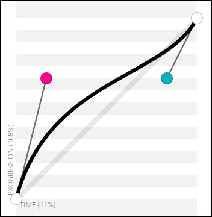
```

###### Parameters

The **cubic-bezier()** function takes four parameters as follows:
**animation-timing-function: cubic-bezier(x1, y1, x2, y2);**

X and Y represent the *x* and *y* axes. The numbers **1** and **2**
after each axis represent the control points. **1** represents the
control point starting on the lower left, and **2** represents the
control point on the upper right.

###### Description

Let&apos;s represent all five predefined easing functions with the
**cubic-bezier()** function:

-   ease: **animation-timing-function: cubic-bezier(.25, .1, .25, 1);**

-   ease-in: **animation-timing-function: cubic-bezier(.42, 0, 1, 1);**

-   ease-out: **animation-timing-function: cubic-bezier(0, 0, .58, 1);**

-   ease-in-out: **animation-timing-function: cubic-bezier(.42, 0, .58,
    1);**

-   linear: **animation-timing-function: cubic-bezier(0, 0, 1, 1);**

I&apos;m not sure about you, but I prefer to use the predefined values.

Now, we can start tweaking and testing each value to the decimal, save
it, and wait for the live refresh to do its thing. However, that&apos;s too
much time wasted testing if you ask me.

> The amazing Lea Verou created the best web app to work with Bézier
> curves. You can find it at **cubic-bezier.com**. This is by far the
> easiest way to work with Bézier curves. I highly recommend this tool.

The Bézier curve image showed earlier was taken from the
**cubic-bezier.com** website.

Let&apos;s add **animation-timing-function** to our example:

<h4>CSS</h4>:

```
**.element { width: 300px; height: 300px; animation-name: fadingColors;
animation-duration: 2s; animation-iteration-count: infinite;
animation-direction: alternate; animation-delay: 3s;
animation-fill-mode: none; animation-play-state: running;
animation-timing-function: ease-out; } steps()**
```

The **steps()** timing function isn&apos;t very widely used, but knowing how
it works is a must if you&apos;re into CSS animations.

It looks like this:

```
**animation-timing-function: steps(6);**
```

This function is very helpful when we want our animation to take a
defined number of steps.

After adding a **steps()** function to our current example, it looks
like this:

<h4>CSS</h4>:

```
**.element { width: 300px; height: 300px; animation-name:
fadingColors; animation-duration: 2s; animation-iteration-count:
infinite; animation-direction: alternate; animation-delay: 3s;
animation-fill-mode: none; animation-play-state: running;
animation-timing-function: steps(6); }**
```

This makes the box take six steps to fade from red to black and vice
versa.

###### Parameters

There are two optional parameters that we can use with the **steps()**
function: **start** and **end**.

-   **start**: This will make the animation run at the beginning of each
    step. This will make the animation start right away.

-   **end**: This will make the animation run at the end of each step.
    This is the default value if nothing is declared. This will give the
    animation a short delay before it starts.

###### Description

After adding a **steps()** function to our current example, it looks
like this:

<h4>CSS</h4>:

```
**.element { width: 300px; height: 300px; animation-name:
fadingColors; animation-duration: 2s; animation-iteration-count:
infinite; animation-direction: alternate; animation-delay: 3s;
animation-fill-mode: none; animation-play-state: running;**
**animation-timing-function: steps(6, start); }**
```

Granted, the pulsating effect in our example isn&apos;t quite noticeable
when we add the **steps()** function. However, you can see it more
clearly in this pen from Louis Lazarus when hovering over the boxes, at
[**http://tiny.cc/steps-timingfunction**](http://tiny.cc/steps-timing-function)

Here&apos;s an image taken from Stephen Greig&apos;s article in *Smashing
Magazine*, *Understanding CSS Timing Functions*, that explains **start**
and **end** from the **steps()** function:

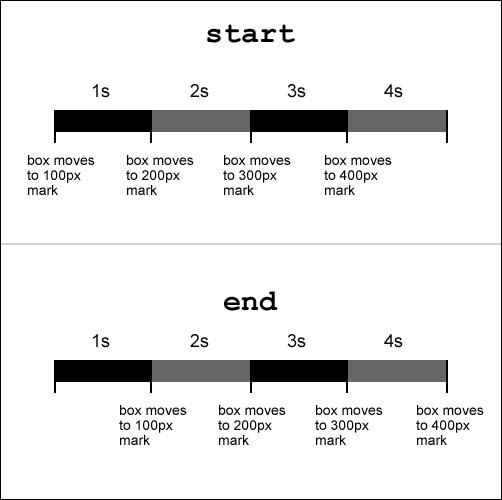

Also, there are two predefined values for the **steps()** function:
**step-start** and **step-end**.

-   **step-start**: This is the same thing as **steps(1, start)**. It
    means that every change happens at the beginning of each interval.

-   **step-end**: This is the same thing as **steps(1, end)**. It means
    that every change happens at the end of each interval.

<h4>CSS</h4>:

```
> **.element { width: 300px; height: 300px; animation-name:
> fadingColors; animation-duration: 2s; animation-iteration-count:
> infinite; animation-direction: alternate; animation-delay: 3s;
> animation-fill-mode: none; animation-play-state: running;
> animation-timing-function: step-end;**
>
> **}**
```

**animation**

The **animation** CSS property is the shorthand for **animation-name**,
**animationduration**, **animation-timing-function**,
**animation-delay**, **animationiteration-count**,
**animation-direction**, **animation-fill-mode**, and
**animationplay-state**.

It looks like this:

> **animation: fadingColors 2s;**

##### Description

For a simple animation to work, we need at least two properties:
**animation-name** and **animation-duration**.

If you feel overwhelmed by all these properties, relax. Let me break
them down for you in simple bits.

Using the **animation** longhand, the code would look like this:

<h4>CSS</h4>:

```
> **.element { width: 300px; height: 300px; animation-name:
> fadingColors; animation-duration: 2s; }**
```

Using the **animation** shorthand, which is the recommended syntax, the
code would look like this:

<h4>CSS</h4>:

```
> **.element { width: 300px; height: 300px;**
>
> **animation: fadingColors 2s; }**
```

This will make a box go from its red background to black in 2 seconds,
and then stop.

### Final CSS code

Let&apos;s see how all the animation properties look in one final example
showing both the longhand and shorthand styles.

**Longhand style**

```
> **.element { width: 300px; height: 300px; animation-name:
> fadingColors; animation-duration: 2s; animation-iteration-count:
> infinite; animation-direction: alternate; animation-delay: 3s;
> animation-fill-mode: none; animation-play-state: running;
> animation-timing-function: ease-out; }**
```

**Shorthand style**

```
> **.element { width: 300px; height: 300px;**
>
> **animation: fadingColors 2s infinite alternate 3s none running
> ease-out; }**
>
> The **animation-duration** property will always be considered first
> rather than **animation-delay**. All other properties can appear in
> any order within the declaration.
```

Here is a demo in **CodePen**: **http://tiny.cc/animation**

### Background

The CSS background properties handle the display of background effects
on HTML elements.

#### background-attachment

The **background-attachment** CSS property defines how the background of
an element scrolls relative to its containing parent, and it looks like
this:

```
**background-attachment: fixed;**
```

**Description**

There are three values: **scroll**, **fixed**, and **local**.

-   **scroll**: The background does not move within its container

-   **fixed**: The background stays fixed to the viewport, no matter
    what

-   **local**: The background scrolls within its container and the
    viewport

<h4>CSS</h4>:

```
**.scroll {**
**background-attachment: scroll;**
**}**
**.fixed {**
**background-attachment: fixed;**
**}**
**.local {**
**background-attachment: local; }**
```

Here is a demo in CodePen:
[**http://tiny.cc/css-background**](http://tiny.cc/css-background)
**background-blend-mode**

The **background-blend-mode** CSS property specifies how the background
image of an element should blend with its background color, and it looks
like this: **background-blend-mode: multiply;**

**Description**

There are 18 possible blend mode values:

-   **color**: Hue and saturation from the top color prevail, but the
    luminosity of the bottom color is added. Gray levels are preserved.

-   **color-burn**: The final color is the result of taking the bottom
    color and inverting it, dividing the value by the top color, and
    then inverting that value.

-   **color-dodge**: The final color is the result of dividing the
    bottom color with the inverse of the top one.

-   **darken**: The final color is the result of taking the darkest
    value per color in each channel.

-   **difference**: The final color is the result of taking the lighter
    color and subtracting the darker color of the background image and
    background color.

-   **exclusion**: The result is similar to the **difference**, but with
    lower contrast.

-   **hard-light**: If the bottom color is darker, then the result is
    **multiply**. However, if the bottom color is lighter, the result is
    **screen**.

-   **hue**: Takes the hue of the top color, and the saturation and
    luminosity of the bottom color.

-   **inherit**: The final color inherits the blend mode of its parent
    container.

-   **initial**: This is the default value without any blending.

-   **lighten**: The result is the lightest values per color from each
    channel.

-   **luminosity**: The result is the luminosity of the top color, and
    the hue and saturation of the bottom one.

-   **multiply**: Multiply the top and bottom colors. This is the same
    effect as printing the colors on a translucent film and laying them
    one on top of the other.

-   **normal**: The final color is the color on top, regardless of the
    color underneath it.

-   **overlay**: The final color is **multiply** if the bottom color is
    darker. And it would be **screen** if the bottom color is lighter.

-   **saturation**: The final color is the saturation of the top color
    plus the hue and luminosity of the bottom one.

-   **screen**: Invert both the top and bottom colors, multiply them,
    and then invert that final color.

-   **soft-light**: Same as **hard-light** attribute but softer, like
    pointing a diffused light on the final color.

In the following example, we will declare two backgrounds, an image and
a color, and then apply a blend mode to them:

**CSS with longhand**:

```
> **.element { width: 500px; height: 500px;**
>
> **background-image: url(&apos;../images/image.jpg&apos;); background-color:
> red; background-blend-mode: multiply;**
>
> **}**
```

**CSS with shorthand**:

```
> **.element { width: 500px; height: 500px;**
>
> **background-image: url(../images/image.jpg) red;
> background-blend-mode: multiply; }**
>
> Notice that in the second example, the path to the image is not inside
> quotes. The quotes, single &lbrack;**&apos;&apos;**&rbrack; or double &lbrack;**&quot;&quot;**&rbrack;, are
> optional.
```

CSS-Tricks has a great Pen showing all these blend modes. However, I
forked it to improve a few things on it.

So, check out the CodePen demo with all the blend modes at
[**http://tiny.cc/**
**background-blend-mode**](http://tiny.cc/background-blend-mode)

### background-clip

The **background-clip** CSS property helps define whether an element&apos;s
background extends below its border or not, and it looks like this:
**background-clip: border-box;**

**Description**

There are four values: **inherit**, **border-box**, **padding-box**, and
**content-box**. **inherit**

This takes the value from its parent element.

**border-box**

This makes the background cover the entire container, including the
border.

**padding-box**

This makes the background extend only up to where the border starts.

#### content-box

This works like **border-box**, but it will take into consideration any
padding, thus creating a gap between the border and the background.

<h4>CSS</h4>:

```
**.element {**
**background-clip: border-box; }**
```

Here is a demo in CodePen:
[**http://tiny.cc/background-clip**](http://tiny.cc/background-clip)
**background-color**

The **background-color** CSS property defines the solid background color
of an element, and it looks like this: **background-color: red;**

**Description**

Also, **transparent** is actually a color in CSS.

> If we wanted to set a gradient background color, we&apos;d have to use the
> **background-image** property instead. This is because gradients are
> actually images.

The color value can be defined using any of the following methods:

-   Named color

-   Hexadecimal

-   RGB and RGBa

-   HSL and HSLa

<h4>CSS</h4>:

> **/&ast;Named Color&ast;/**
>
> **.element {**
>
> **background-color: red;**
>
> **}**
>
> **/&ast;HEX&ast;/**
>
> **.element {**
>
> **background-color: #f00;**
>
> **}**
>
> **/&ast;RGB&ast;/**
>
> **.element {**
>
> **background-color: rgb(255,0,0);**
>
> **}**
>
> **/&ast;RGBa&ast;/**
>
> **.element {**
>
> **/&ast;Background has 50% opacity&ast;/ background-color: rgba(255, 0, 0,
> .5);**
>
> **}**
>
> **/&ast;HSL&ast;/**
>
> **.element {**
>
> **background-color: hsl(0, 100%, 50%);**
>
> **}**
>
> **/&ast;HSLa&ast;/**
>
> **.element {**
>
> **/&ast;Background has 50% opacity&ast;/ background-color: hsla(0, 100%,
> 50%, .5); }**

### background-image

The **background-image** CSS property sets an image or gradient in the
background of an element, and it looks like this:

> **background-image: url(../images/background.jpg);**

Alternatively, it could also look like this:

> **background-image: linear-gradient(red, orange);**

**Description**

This property supports the JPG, PNG, GIF, SVG, and WebP image formats.

We can also use the **none** value to declare the absence of an image.

An element can also have several background images in a single
declaration.

When it comes to gradients, there are two styles: **Linear** and
**Radial**.

#### Linear

Its syntax is **linear-gradient**. These gradients can go vertical,
horizontal, or diagonal.

#### Radial

Its syntax is **radial-gradient**. These gradients are circular in
nature, and by default, they will adapt to an element&apos;s dimension. For
example, if the element is a perfect square, it would make a perfect
circular radial gradient. However, if the element is a rectangle, then
the radial gradient would look like an oval.

We can add as many colors in a gradient as we want or need to. Unless it
is strictly necessary, I recommend that you steer away from doing so, as
it can have a negative impact on browser performance.

Additionally, in order to give us more control over the gradients, we
can define where a gradient color stops so that the following one can
start. This is called **color stops**. Color stops can be defined in
pixels or percentages. Percentages are more commonly used because of
their relative nature, which helps maintain the integrity and
proportions of the gradients.

<h4>CSS</h4>:

> **/&ast;Graphic file&ast;/**
>
> **.element {**
>
> **background-image: url(../images/bg-texture.jpg);**
>
> **}**
>
> **/&ast;Multiple images&ast;/**
>
> **.element { background-image:**
>
> **url(../images/bg-icon.svg), url(../images/bg-texture.jpg);**
>
> **}**
>
> **/&ast;Linear gradient&ast;/**
>
> **.element {**
>
> **background-image: linear-gradient(red, orange);**
>
> **}**
>
> **/&ast;Linear Gradient with color stops&ast;/**
>
> **.element {**
>
> **background-image: linear-gradient(red 40px, orange 25%, green);**
>
> **}**
>
> **/&ast;Radial gradient&ast;/**
>
> **.element {**
>
> **background-image: radial-gradient(red, orange);**
>
> **}**
>
> **/&ast;Radial gradient with color stops&ast;/**
>
> **.element {**
>
> **background-image: radial-gradient(red 40px, orange 25%, green);**
>
> **}**

### background-origin

The **background-origin** CSS property defines how the background gets
rendered inside an element, and it looks like this: **background-origin:
border-box;**

**Description**

This property works similarly to the **background-clip** CSS property,
except that with **background-origin**, the background is resized
instead of clipped.

There are four values: **border-box**, **padding-box**, **content-box**,
and **inherit**.

-   **border-box**: The background extends all the way to the edge of
    the container, but under the border

-   **padding-box**: The background extends to meet the border edge to
    edge

-   **content-box**: The background is rendered inside the content box

-   **inherit**: This is the default value

<h4>CSS</h4>:

```
> **.element {**
>
> **background-origin: border-box; }**
```

Here is a demo in CodePen:
[**http://tiny.cc/background-origin**](http://tiny.cc/background-origin)

**background-position**

The **background-position** CSS property allows us to place the
background (image or gradient) anywhere within its parent container, and
it looks like this: **background-position: 10px 50%;**

#### Description

We can use three different types of values: predefined *keywords*,
*percentage*, and *length*.

**Predefined keywords**

Values such as **left**, **right**, **top**, and **bottom** are the
predefined keywords.

**Percentages**

Values such as **5%** and **80%**.

#### Length

Values such as **15px** **130px**.

This property requires you to declare two values: the first value
relates to the *x* axis (horizontal) and the second value to the *y*
axis (vertical).

The default value is **0 0**; which is exactly the same as **left top**.

<h4>CSS</h4>:

```
> **/&ast;Default values&ast;/**
>
> **.element {**
>
> **background-position: 0 0;**
>
> **}**
>
> **/&ast;Keyword values&ast;/**
>
> **.element {**
>
> **background-position: right bottom;**
>
> **}**
>
> **/&ast;Percentages values&ast;/**
>
> **.element {**
>
> **background-position: 5% 80%;**
>
> **}**
>
> **/&ast;Length values&ast;/**
>
> **.element {**
>
> **background-position: 15px 130px; }**
```

Here is a demo in CodePen:
[**http://tiny.cc/background-position**](http://tiny.cc/background-position)

**background-repeat**

The **background-repeat** CSS property has two functions:

1.  To define whether a background image is repeated or not

2.  To determine how the background image is repeated

It looks like this:

> **background-repeat: no-repeat;**

Alternatively, it could also look like this:

> **background-repeat-x: repeat;**

#### Description

This property only works if **background-image** has been declared.

There are four values: **repeat**, **repeat-x**, **repeat-y**, and
**no-repeat**.

-   **repeat**: The background image will repeat in both *x* and *y*
    axes. This will completely fill the container. This is the default
    value.

-   **repeat-x**: The background image will only repeat in the *x* axis,
    hence, horizontally.

-   **repeat-y**: The background image will only repeat in the *y* axis,
    hence, vertically.

-   **no-repeat**: The background image will not be repeated and will
    only display one instance of it.

<h4>CSS</h4>:

```
> **/&ast;Default value&ast;/**
>
> **.repeat { background-repeat: repeat; }**
>
> **/&ast;Repeat horizontally&ast;/**
>
> **.repeat-x { background-repeat: repeat-x; }**
>
> **/&ast;Repeat vertically&ast;/**
>
> **.repeat-y { background-repeat: repeat-y; }**
>
> **/&ast;No repeat&ast;/**
>
> **.no-repeat { background-repeat: no-repeat; }**
```

Here is a demo in CodePen:
[**http://tiny.cc/background-repeat**](http://tiny.cc/background-repeat)

**background-size**

The **background-size** CSS property defines the size of the background
image, and it looks like this:

> **background-size: contain;**

**Description**

There are five values: a *length* value, a *percentage* value, **auto**,
**contain**, and **cover**.

**Length value**

This is when we use one of the following units: **px**, **em**, **in**,
**mm**, **cm**, **vw**, and so on.

**Percentage value**

This is when we use percentages such as **50%**, **85%**, and so on.

#### auto

This value scales the image in the corresponding direction (horizontal
or vertical) in order to maintain its aspect ratio and not deform it.

#### contain

This value makes sure the image can be seen completely within its parent
container. The image does not bleed on the edges; it&apos;s &quot;contained&quot;.
**cover**

This value scales the image and takes the longest dimension (horizontal
or vertical). It makes sure that the image completely covers that
dimension. Bleeding can occur if the container and the image have
different aspect ratios.

When declaring the size of the background, we can use either one or two
values. The first value is the *width*, and the second is the *height*
of the background image.

Using one value means that the second value is set to **auto**. When
using two values, we are then defining the **width** and **height**
values of the background image.

We can use any measurement unit we want. Pixels, percentages, and the
**auto** value are the most commonly used though.

We can even combine multiple images in the same container. The
background shorthand property is the best way to handle this situation.

<h4>CSS</h4>:

```
> **.contain {**
>
> **background-size: contain;**
>
> **}**
>
> **.cover {**
>
> **background-size: cover;**
>
> **}**
>
> **.auto {**
>
> **background-size: auto;**
>
> **}**
>
> **.multiple { background-image:**
>
> **url(../images/image-1.jpg), url(../images/image-2.jpg);
> background-size: 150px 100px, cover; }**
```

Here is a demo in CodePen:
[**http://tiny.cc/background-size**](http://tiny.cc/background-size)

**background**

The **background** CSS property is the shorthand in which we can list
all background values.

I often see many developers write the longhand version of the property
to declare a single value, such as a color. Here is an example:

> **background-color: red;**

Although this is totally fine, I prefer to use the shorthand version for
practically everything:

> **background: red;**

This is a bit more scalable because if we need to add any other values,
all we need to do is add the new value to this declaration rather than
writing a separate one.

However, at the end, it&apos;s all a matter of personal style.

<h4>CSS</h4>:

```
> **/&ast;BG color&ast;/**
>
> **.element { background: red; }**
>
> **/&ast;BG color and image&ast;/**
>
> **.element { background: url(../images/bg.png) red; }**
>
> **/&ast;BG color, image and position&ast;/**
>
> **.element { background: url(../images/bg.png) 50% 50% red; }**
>
> **/&ast;BG color, image, position and do not repeat&ast;/**
>
> **.element { background: url(../images/bg.png) 50% 50% red no- repeat;
> }**
>
> **/&ast;BG color, image, position, do not repeat and size&ast;/**
>
> **.element { background: url(../images/bg.png) 50% 50% / contain red
> no-repeat; }**
>
> **/&ast;BG color, image, position, do not repeat, size and clip&ast;/**
>
> **.element { background: url(../images/bg.png) 50% 50% / contain red**
>
> **no-repeat content-box; }**
>
> **/&ast;BG color, image, position, do not repeat, size, clip and
> attachment&ast;/**
>
> **.element { background: url(../images/bg.png) 50% 50% / contain red
> no-repeat content-box fixed; }**
```

## Box model

Every element in the web is a square, and as such, it has intrinsic
characteristics: width, height, padding, border, and margin. All these
characteristics, put together, make the box model.

The almighty box model is one of the most talked about subjects in the
CSS industry due to IE6 and IE7 being the most popular browsers back in
the day. However, they had major issues interpreting this simple CSS
concept. This meant the web designers and developers had to come up with
all sorts of tricks to get around such a problem. Those days are now
gone, for the most part at least.

Let&apos;s move on to the box model properties.

### width

The **width** CSS property specifies the width of an element&apos;s content
area, and it looks like this:

> **width: 10px;**

Alternatively, it could also look like this:

> **width: 10px 50px;**

**Description**

The content area is inside the padding, border, and margin of the
element.

Let&apos;s talk about the most used values and keywords: the *length* value,
*percentage* value, **auto**, **max-content**, **min-content**, and
**fit-content**.

#### Length value

This is basically when we use one of the following units: **px**,
**em**, **in**, **mm**, **cm**, **vw**, and so on.

**Percentage value**

This is when we use percentages such as **50%**, **85%**, and so on.

#### auto

This is a keyword value that allows the browser to choose the width of
the element. **max-content**

This is a keyword value that makes the container take the width of its
content.

#### min-content

This is a keyword value that makes the container as small as possible
depending on its content.

#### fit-content

This is a keyword value that makes the container match the width of its
content. This works great on containers with unknown or variable width.

You can find more information on MDN at
[**http://tiny.cc/mdn-width**](http://tiny.cc/mdn-width)

<h4>CSS</h4>:

```
> **/&ast;max-content&ast;/**
>
> **.element { width: max-content;**
>
> **}**
>
> **/&ast;min-content&ast;/**
>
> **.element { width: min-content;**
>
> **}**
>
> **/&ast;fit-content&ast;/**
>
> **.element { width: fit-content; }**
```

Here is a demo in CodePen:
[**http://tiny.cc/width**](http://tiny.cc/width)

### height

The **height** CSS property specifies the height of an element&apos;s
*content area*, and it looks like this:

> **height: 200px;**

**Description**

The *content area* is inside the padding, border, and margin of the
element.

The most used values are a *length* value, a *percentage* value, and
**inherit**.

#### Length value

This is basically when we use one of the following units: **px**,
**em**, **in**, **mm**, **cm**, **vw**, and so on.

**Percentage value**

This is when we use percentages such as **50%**, **85%**, and so on.

#### inherit

With this keyword, the element will inherit its parent container&apos;s
height. You can find more information on MDN a[t
**http://tiny.cc/mdn-height**](http://tiny.cc/mdn-height)

<h4>CSS</h4>:

```
> **/&ast;Length value&ast;/**
>
> **.element { height: 200px;**
>
> **}**
>
> **/&ast;Percentage value&ast;/**
>
> **.element { height: 50%;**
>
> **}**
>
> **/&ast;Inherit value&ast;/**
>
> **.element { height: inherit; }**
```

### padding

The **padding** CSS property creates a space on all four sides of an
element on the inside, between its content and the edges, and it looks
like this:

> **padding: 10px;**

Alternatively, it could also look like this:

> **padding: 10px 15px;**

**Description**

Borders and margins are outside of the content area and do not get
affected by the padding.

The **padding** property is the shorthand for **padding-top**,
**padding-right**, **paddingbottom**, and **padding-left**. We can use
one, two, three, or all four values.

-   **One value**: This means that all four sides have the same value.

-   **Two values**: The first value is for Top and Bottom. The second
    value is for Left and Right.

-   **Three values**: The first value is for Top. The second value is
    for Left and Right. The third value is for Bottom.

-   **Four values**: The first value is for Top. The second is for
    Right. The third is for Bottom. The fourth is for Left.

Negative values are not allowed.

<h4>CSS</h4>:

```
> **/&ast;Shorthand, ONE value: all four sides have the same padding&ast;/**
>
> **.element { padding: 10px; }**
>
> **/&ast;Shorthand, TWO values: Top & Bottom - Left & Right&ast;/**
>
> **.element { padding: 10px 15px; }**
>
> **/&ast;Shorthand, THREE values: Top - Left & Right - Bottom&ast;/**
>
> **.element { padding: 10px 15px 20px; }**
>
> **/&ast;Shorthand, FOUR values: Top - Right - Bottom - Left&ast;/**
>
> **.element { padding: 10px 15px 20px 25px; }**
>
> **/&ast;Longhand, all values. They can go in any order&ast;/**
>
> **.element { padding-top: 10px; padding-right: 15px; padding-bottom:
> 20px; padding-left: 25px; }**
```

### margin

The **margin** CSS property defines an outside space on one, two, three
or all four sides of an element, and it looks like this:

> **margin: 10px;**

Alternatively, it could also look like this:

> **margin: 10px 15px;**

**Description**

The **margin** property is the shorthand for **margin-top**,
**margin-right**, **marginbottom**, and **margin-left**. Just like with
**padding**, we can use one, two, three, or all four values.

-   **One value**: This means that all four sides have the same padding.

-   **Two values**: The first value is for Top and Bottom. The second
    value is for Left and Right.

-   **Three values**: The first value is for Top. The second value is
    for Left and Right. The third value is for Bottom.

-   **Four values**: The first value is for Top. The second is for
    Right. The third is for Bottom. The fourth value is for Left.

Negative values are allowed.

<h4>CSS</h4>:

```
> **/&ast;Shorthand, ONE value: all four sides have the same padding&ast;/**
>
> **.element { margin: 10px; }**
>
> **/&ast;Shorthand, TWO values: Top & Bottom - Left & Right&ast;/**
>
> **.element { margin: 10px 15px; }**
>
> **/&ast;Shorthand, THREE values: Top - Left & Right - Bottom&ast;/**
>
> **.element { margin: 10px 15px 20px; }**
>
> **/&ast;Shorthand, FOUR values: Top - Right - Bottom - Left&ast;/**
>
> **.element { margin: 10px 15px 20px 25px; }**
>
> **/&ast;Longhand, all values. They 1can go in any order&ast;/**
>
> **.element { margin-top: 10px; margin-right: 15px; margin-bottom:
> 20px; margin-left: 25px; }**
```

**Collapsing margins**

There is a particular behavior with the margins. If two stacked elements
have top and bottom margins, the margins are not added. Instead, the
larger value is the only one taken into account.

For example, we have an **&lt;h1&gt;** heading and a **&lt;p&gt;** paragraph.
The heading has a bottom margin of **20px**, and the paragraph has a top
margin of **10px**.

Our senses immediately tell us that the total margin is **30px**, but in
reality, because vertical margins collapse, only the largest value is
considered, in this case, **20px**.

The reason for this is that many elements, such as headings and
paragraphs in our example, have both top and bottom margins. So, having
the margins collapse allows the content and layout to maintain
consistency and avoid creating undesired extra spacing between stacked
elements.

This is also good because it saves us the effort of having to &quot;negate&quot;
margins on every stacked element that has top and bottom margins, again,
to avoid creating those extra spaces.

The way I see it, is that collapsing margins is an editorial feature of
the CSS margin property. I hope that the prior explanations help embrace
this behavior. Here is a demo in CodePen:
[**http://tiny.cc/collapsing-margins**](http://tiny.cc/collapsing-margins)

### border

The **border** CSS property is the shorthand that defines an element&apos;s
border thickness, style, and color.

The **border** property and all its sister properties (**border-width**,
**border-style**, and **border-color**) and variations are
self-explanatory, so there&apos;s no need for a *Description* section like
in prior properties.

The CSS example ahead will help clarify the use of these properties.

**border-width**

This is the thickness of the border. It can be declared using **px** or
**em**, but **px** yields more controllable results.

**border-style**

This defines the type of line or no line at all. It supports the
following values: **dashed**, **dotted**, **double**, **groove**,
**hidden**, **inset**, **none**, **outset**, **ridge**, and **solid**.

**border-color**

This defines the color of the line. It supports all color modes: HEX,
RGB, RGBa, HSL, HSLs, and color name.

Keep in mind that all HTML elements are squares, so we can target any
side of an element with **border-top-color**, **border-right-color**,
**border-bottom-color**, or **border-left-color**.

The order of the values in the shorthand does not affect the output.

In the following example, the top rule in *shorthand syntax*
accomplishes exactly the same accomplishment as the bottom rule with the
*longhand syntax*:

<h4>CSS</h4>:

```
> **/&ast;Shorthand&ast;/**
>
> **.element-shorthand { border: 10px solid green;**
>
> **}**
>
> **/&ast;Longhand&ast;/**
>
> **.element-longhand {**
>
> **/&ast;Width&ast;/ border-top-width: 10px; border-right-width: 10px;
> border-bottom-width: 10px; border-left-width: 10px;**
>
> **/&ast;Style&ast;/ border-top-style: solid; border-right-style: solid;
> border-bottom-style: solid; border-left-style: solid;**
>
> **/&ast;Color&ast;/ border-top-color: green; border-right-color: green;
> border-bottom-color: green; border-left-color: green;**
>
> **}**
```

### box-sizing

The **box-sizing** CSS property allows us to change the way browsers
understand the box model by default, and it looks like this:
**box-sizing: border-box;**

**Description**

There are two values: **content-box** and **border-box**.

#### content-box

This is the default value. The padding, border, and margin values are
added to the final width and height of the element. This value is rarely
used exactly because of the behavior I just described.

#### border-box

On the other hand, since this value changes the box model, the padding
and border are not added to the final width and height of the element
but only to the margin.

<h4>CSS</h4>:

```
> **/&ast;Padding, border and margin are added to the element&apos;s
> dimensions&ast;/**
>
> **.element {**
>
> **box-sizing: content-box;**
>
> **}**
>
> **/&ast;Padding and border are not added to the element&apos;s dimensions,
> only margin&ast;/ .element {**
>
> **box-sizing: border-box;**
>
> **}**
>
> **/&ast;Always start your CSS with this rule&ast;/**
>
> **&ast;, &ast;:before, &ast;:after { box-sizing: border-box; }**
```

Here is a demo in CodePen: **http://tiny.cc/box-sizing**

### max-height

The **max-height** CSS property defines the maximum height of an
element, and it looks like this:

```
> **max-height: 150px;**
```

**Description**

The **max-height** attribute overrides the **height** property. Negative
values are not allowed.

The most used values are a *length* value and a *percentage* value.

**Length value**

This is when we use one of the following units: **px**, **em**, **in**,
**mm**, **cm**, **vw**, and so on.

#### Percentage value

This is when we use percentages such as **50%**, **85%**, and so on.

You can find more information on MDN at
[**http://tiny.cc/mdn-max-height**](http://tiny.cc/mdn-max-height)

<h4>CSS</h4>:

```
> **/&ast;Length value&ast;/**
>
> **.element { height: 75px;**
>
> **/&ast;This property overrides height&ast;/ max-height: 150px;**
>
> **}**
>
> **/&ast;Percentage value&ast;/**
>
> **.element { max-height: 65%; }**
```

### max-width

The **max-width** CSS property defines the maximum width of an element,
and it looks like this:

```
> **max-width: 75px;**
```

**Description**

The **max-width** attribute overrides the **width** property. Negative
values are not allowed.

The most used values are a *length* value and a *percentage* value.

**Length value**

This is when we use one of the following units: **px**, **em**, **in**,
**mm**, **cm**, **vw**, and so on.

#### Percentage value

This is when we use percentages such as **50%**, **85%**, and so on.

You can find more information on MDN at
[**http://tiny.cc/mdn-max-width**](http://tiny.cc/mdn-max-width)

<h4>CSS</h4>:

```
> **/&ast;Length value&ast;/**
>
> **.element { width: 150px;**
>
> **/&ast;This property overrides width&ast;/ max-width: 75px;**
>
> **}**
>
> **/&ast;Percentage value&ast;/**
>
> **.element { max-width: 65%; }**
```

### min-height

The **min-height** CSS property defines the minimum height of an
element, and it looks like this:

```
> **min-height: 300px;**
```

**Description**

The **min-height** attribute overrides the **height** and **max-height**
properties. Negative values are not allowed.

The most used values are a *length* value and a *percentage* value.

**Length value**

This is when we use one of the following units: **px**, **em**, **in**,
**mm**, **cm**, **vw**, and so on.

#### Percentage value

This is when we use percentages such as **50%**, **85%**, and so on.

You can find more information on MDN at
[**http://tiny.cc/mdn-min-height**](http://tiny.cc/mdn-min-height)

<h4>CSS</h4>:

```
> **/&ast;Length value&ast;/**
>
> **.element { height: 75px; max-height: 150px;**
>
> **/&ast;This property overrides height and max-height&ast;/ min-height:
> 300px;**
>
> **}**
>
> **/&ast;Percentage value&ast;/**
>
> **.element { min-height: 65%; }**
```

### min-width

The **min-width** CSS property defines the minimum width of an element,
and it looks like this:

> **min-widht: 300px;**

**Description**

The **min-width** attribute overrides the **width** and **max-width**
properties.

Negative values are not allowed.

The most used values are a *length* value and a *percentage* value.

**Length value**

This is when we use one of the following units: **px**, **em**, **in**,
**mm**, **cm**, **vw**, and so on.

#### Percentage value

This is when we use percentages such as **50%**, **85%**, and so on.

You can find more information on MDN at
[**http://tiny.cc/mdn-min-width**](http://tiny.cc/mdn-min-width)

<h4>CSS</h4>:

```
> **/&ast;Length value&ast;/**
>
> **.element { width: 150px; max-width: 75px; /&ast;This property overrides
> width and max-width&ast;/ min-width: 300px;**
>
> **}**
>
> **/&ast;Percentage value&ast;/**
>
> **.element { min-width: 65%; }**
```

### object-fit

The **object-fit** CSS property defines how a *replaced element* fits
inside its content box, and it looks like this: **object-fit: cover;**

**Description**

A *replaced element* is an HTML element whose content and dimensions are
intrinsic (defined by the element itself) and are not defined by CSS or
by its context or surroundings.

Examples of *replaced elements* are **&lt;img&gt;**, **&lt;video&gt;**,
**&lt;audio&gt;**, **&lt;canvas&gt;**, **&lt;iframe&gt;**, **&lt;textarea&gt;**,
**&lt;object&gt;**, **&lt;input&gt;**, **&lt;button&gt;**, **&lt;br&gt;**, and
**&lt;hr&gt;**.

Now, the most important characteristic of replaced elements is that we
cannot apply generated content to them via CSS using the **:before** or
**:after** pseudo-element selectors.

This property can come in handy when we want a group of thumbnails to
have the same width and height, but without distorting the images.
However, the images for the thumbnails are uploaded by users, which
means that the uploaded images can be of all sizes and different aspect
ratios. The **object-fit** CSS property can help us have control of the
thumbnails in such a situation.

> The content inside the replaced element is centered vertically and
> horizontally by default. However, the content can be repositioned
> using the **object-position** property.

There are four keyword values: **contain**, **cover**, **fill**,
**none**, and **scale-down**. **contain**

The aspect ratio of the content inside the replaced element is
preserved. This content is enlarged as much as possible until it reaches
its maximum size defined by its width and height. It&apos;s possible to see
some &quot;unfilled&quot; areas of the element due to preservation of the aspect
ratio.

#### cover

The aspect ratio of the content inside the replaced element is
preserved. This content is enlarged as much as possible until it
completely fills or &quot;covers&quot; the entire content box. **fill**

The aspect ratio of the content inside the replaced element is not
necessarily preserved. This means that when filling the entire content
box, the content of the replaced element can be stretched or shrunk
during the scaling up or scaling down of the content. **none**

No resizing is done.

#### scale-down

This acts as if **none** or **contain** were declared. The idea here is
that the browser will try to figure out the smallest concrete size of
the content inside the replaced element in order to make it fit in its
content box while preserving the aspect ratio of the content inside the
replaced element.

<h4>CSS</h4>:

```
> **img { width: 15em; height: 25em; object-fit: contain; }**
```

Here is a demo in CodePen:
[**http://tiny.cc/object-fit-position**](http://tiny.cc/object-fit-position)

### object-position

The **object-position** CSS property defines the location of the content
of the replaced element, and it looks like this: **object-position:
right bottom;**

**Description**

As described in the Tip of the object-fit CSS property, by default, the
content of the replaced element is placed in the center of the content
box, which is 50% 50%.

Now, this property behaves similarly to the **background-position** CSS
property. This means, we can declare either *one* or *two* values.

The values are either *length* or *percentages* of *keyword* values
**top**, **right**, **bottom**, or **left**. Negative values are
allowed.

<h4>CSS</h4>:

```
> **img { width: 15em; height: 25em; object-fit: contain;
> object-position: right bottom; }**
```

Here is a demo in CodePen: **http://tiny.cc/object-fit-position**

## Border radius

With this property, we can not only make rounded corners but also
circles, ellipses, and other interesting shapes.

I admit that the term &quot;rounded corners&quot; is far less obscure than
&quot;border radius&quot;. **border-radius**

The **border-radius** CSS property allows us to make rounded corners on
almost any HTML element, and it looks like this:

```
> **border-radius: 20px;**
```

**Description**

The **border-radius** attribute is also the shorthand syntax for the
**border-top-leftradius**, **border-top-right-radius**,
**border-bottom-right-radius**, and **borderbottom-left-radius**
properties.

Using either a circle or an ellipse, we can create rounded corners:

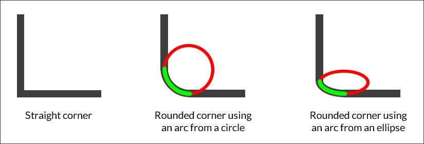{width="5.5in" height="1.8729166666666666in"}

There are two values: a *length* value and a *percentage* value.

**Length value**

This is when we use one of the following units: **px**, **em**, **in**,
**mm**, **cm**, **vw**, and so on.

### Percentage value

This is when we use percentages such as **50%**, **85%**, and so on.

We can use, one, two, three, or four values in the same declaration. We
can also use a slash symbol, &quot;**/**&quot;, to separate groups of values.

> Sometimes, the background color or texture &quot;bleeds&quot; over the rounded
> corners in some browsers. Use **background-clip** to fix this issue.

<h4>CSS</h4>:

```
> **/&ast;Longhand&ast;/**
>
> **.element {**
>
> **border-top-left-radius: 20px; border-top-right-radius: 20px;
> border-bottom-right-radius: 20px; border-bottom-left-radius: 20px;**
>
> **}**
>
> **/&ast;Shorthand&ast;/**
>
> **.element { border-radius: 20px; }**
>
> **/&ast;Two values: top-left-and-bottom-right - top-right-and-bottom-**
>
> **left&ast;/**
>
> **.element-1 { border-radius: 70px 7px; }**
>
> **/&ast;Three values: top-left - top-right-and-bottom-left - bottom-
> right&ast;/**
>
> **.element-2 { border-radius: 70px 7px 20px; }**
>
> **/&ast;Four values: top-left - top-right - bottom-right -
> bottom-left&ast;/**
>
> **.element-3 { border-radius: 70px 7px 20px 150px; }**
>
> **/&ast;Values divided with a slash &quot;/&quot; symbol &ast;/**
>
> **.element-4 { border-radius: 70px 7px/20px 30px; }**
>
> **/&ast;Circle&ast;/**
>
> **.element-5 { border-radius: 200px; }**
>
> **/&ast;Ellipse&ast;/**
>
> **.element-6 { height: 100px; border-radius: 100%; }**
>
> **/&ast;Pill&ast;/**
>
> **.element-7 { height: 100px; border-radius: 100px; }**
>
> **/&ast;Half Pill: top-left - top-right - bottom-right - bottom-left&ast;/**
>
> **.element-8 { height: 100px; border-radius: 100px 0 0 100px; }**
```

Here is a demo in CodePen: **http://tiny.cc/css-border-radius**

## Unit

CSS unit is a type of data with which we can define measurements, and it
looks like this:

```
> **max-height: 150px;**
```

Alternatively, it could also look like this:

```
> **transform: rotate(45deg);**
```

There is no space between the number and the unit.

In most cases, the unit isn&apos;t required after the number **0** (zero).

There are several types of length units, such as described in the
following explanations.

### Relative length units

They are dependent on another element&apos;s length (usually, a parent
element in the DOM) that relates directly to the element in question.
When the other element&apos;s length changes, the length of the element in
question maintains the defined proportion. In other words, there is no
need to declare the length of the child element again.

**Description**

Relative units are always the best way to go if we want to build
scalable systems. Setting values in a single element and then modifying
that single element to affect the whole system saves a lot of time and
many headaches.

#### ex

The **ex** suffix stands for an element&apos;s x-height. The **ex** CSS unit
refers to the height of lowercase *x*. This height is dependent on the
font. In other words, the heights can be different if we are using Arial
than if we are using Verdana, even if the value is the same.

<h4>CSS</h4>:

```
> **.element { padding: 2ex; }**
```

#### ch

The **ch** suffix stands for character. The **ch** CSS unit refers to
the width of the character **0** (zero). This width is dependent on the
font. In other words, the widths can be different if we are using Arial
than if we are using Verdana, even if the value is the same.

<h4>CSS</h4>:

```
> **.element { padding: 2ch; }**
```

#### em

The **em** suffix stands for the pronunciation of the letter *m*, and it
represented the width of the lower case *m* in the print and typography
industries. In CSS, the **em** unit represents a calculation of an
element&apos;s **font-size** property.

This unit can be used together with many CSS properties, but the most
common use is to define **font-size** elements.

However, many web designers and developers prefer to use **rem** units
to avoid the inheritance issue **em** units have in nested elements (3-4
or more levels deep).

<h4>CSS</h4>:

```
> **.element {**
```

**font: 1.5em Arial, Helvetica, san-serif; } rem**

The **rem** suffix stands for the abbreviation of the term *root
element*. The **rem** CSS unit represents the font size of the root
element in a markup document. A markup document is not only an HTML
document; it can also be an XML, SVG, or other markup-based document.

Granted that in this guide, we are referring to an HTML document, and
since this is the case, the root element is the **&lt;html&gt;** element.

A very common practice is to set the font size on the **&lt;html&gt;**
element to **62.5%**. This way, when we&apos;re setting our font sizes for
other elements, we can still think in pixels, but write in **rem** units
to maintain the relative font size when scaling up or down our document
in our responsive projects.

<h4>CSS</h4>:

```
> **html {**
>
> **font-size: 62.5%;**
>
> **} h1 {**
>
> **/&ast;It&apos;s the same as 22px&ast;/ font-size: 2.2rem; }**
```

#### The % sign

The **%** sign is what it implies, percentage. In CSS **em** units and
percentage units yield the same result. Percentage values, such as any
of the other relative units, are dependent on another value, usually
that of the parent element.

Like all other relative units, percentages and responsive web design go
hand in hand.

<h4>CSS</h4>:

```
> **.element { margin: 0 1%;**
>
> **}**
```

### Viewport-relative length units

These units relate to the viewport. If the viewport&apos;s dimensions
change, the properties using viewport-relative length values adapt to
the new dimensions of the view window.

**Description**

These units are a godsend in my book. They do what we would expect of
fonts in a responsive world: enlarge or shrink according to the width or
height of the viewport.

Let&apos;s check them out.

#### vh

The **vh** suffix stands for *viewport height*. The **vh** CSS unit
relates to the height of the viewport. The value of **vh** is 1/100th of
the height of the viewport.

For example, if we declare the **font-size** of an element as **1vh**,
and the browser window is **500px**, the font size is then **5px**.

<h4>CSS</h4>:

```
> **.element { font-size: 1vh; }**
```

#### vw

The **vw** suffix stands for *viewport width*. The **vw** CSS unit
relates to the width of the viewport. The value of **vw** is 1/100th of
the width of the viewport.

For example, if we declare the **font-size** of an element as **1vh**,
and the browser window is **1400px**, the font size is then **14px**.

<h4>CSS</h4>:

```
> **.element { font-size: 1vw; }**
```

#### vmin

The **vmin** suffix stands for *viewport minimum*. The **vmin** CSS unit
relates to the smallest value of the viewport, of either its height or
its width. The value of **vmin** is 1/100th of the side with the
smallest length of the viewport.

For example, if we declare the **font-size** of an element as **1vmin**
and the browser&apos;s viewport is 600 × 800, the font size is then **6px**.

<h4>CSS</h4>:

```
> **.element { font-size: 1vmin; }**
```

#### vmax

The **vmax** suffix stands for viewport maximum. The **vmax** CSS unit
relates to the largest value of the viewport, of either its height or
its width. The value of **vmax** is 1/100th of the side with the largest
length of the viewport.

For example, if we declare the **font-size** of an element as **1vmax**,
and the browser&apos;s viewport is 600 × 800, the font size is then **8px**.

<h4>CSS</h4>:

```
> **.element { font-size: 1vmax; }**
```

### Absolute length units

These units represent a physical dimension of an element. Some units in
CSS come from the printing world, and although it&apos;s not common to use
them, it&apos;s important to know as much as we can about them.

**Description**

These types of units relate directly to a physical measurement. They
work best when the output environment is known, like in print.

The most used absolute unit is the pixel (**px**). A pixel is known to
be a single dot on a screen. The thing is that there is no industry
standard for the size of that dot.

In other words, a pixel in a standard LED/LCD display (for example, a
monitor or a TV) has different sizes than a pixel in a high-density
screen. Even the pixel sizes between high-density screens are different.

Let&apos;s see what each abbreviation means, and at the end of the section,
we&apos;ll be able to see a single example with all the units.

#### cm

The **cm** suffix stands for *centimeter*. **mm**

The **mm** suffix stands for *millimeter*. **in**

The **in** suffix stands for *inch*. **pc**

The **pc** suffix stands for *pica*. **pt**

The **pt** suffix stands for *point*. **px**

The **px** suffix stands for *pixel*.

<h4>CSS</h4>:

All the following values represent units that resemble **16px** font
size, but in different length units.

```
> **/&ast;Centimeter&ast;/**
>
> **.element { font-size: .43cm; }**
>
> **/&ast;Millimeter&ast;/**
>
> **.element { font-size: 4.3mm; }**
>
> **/&ast;Inch&ast;/**
>
> **.element { font-size: .17in; }**
>
> **/&ast;Pica&ast;/**
>
> **.element { font-size: 1pc; }**
>
> **/&ast;Point&ast;/**
>
> **.element { font-size: 12pt; }**
>
> **/&ast;Pixel&ast;/**
>
> **.element { font-size: 16px; }**
```

### Angle data types

These units represent angle values.

**Description**

These units are used whenever we want to rotate an element via the
**transform** property.

Aside from the **deg** data type, the other angle data type units
aren&apos;t really that common.

Let&apos;s check them out though. **deg**

The **deg** suffix stands for *degrees*. **grad**

The **grad** suffix stands for *gradients*. **rad**

The **rad** suffix stands for *radians*.

#### turn

The **turn** suffix is not an abbreviation; it&apos;s the actual word
*turn*. There is one turn in a full circle, so if we&apos;re going to make a
horizontal rectangle rotate 90 degrees to make it vertical, we would
define it as **.25turn**, because it&apos;s ¼th of the complete turn.

<h4>CSS</h4>:

All the following values represent units that resemble a 90-degree turn
of an element but in different angle data types:

```
> **/&ast;Degrees&ast;/**
>
> **.element { transform: rotate(90deg); }**
>
> **/&ast;Gradians&ast;/**
>
> **.element { transform: rotate(100grad); }**
>
> **/&ast;Radians&ast;/**
>
> **.element { transform: rotate(89.535rad); }**
>
> **/&ast;Turn&ast;/**
>
> **.element { transform: rotate(.25turn); }**
```

### Resolution units

These units represent the screen density of pixels on any given output
or device.

Unlike relative and absolute units, it&apos;s necessary to add the unit to
the value **0** (zero).

**Description**

Whenever we need to consider density screens, resolution units will do
the heavy lifting for us. They are used in media queries.

Let&apos;s see how they work.

#### dpi

The **dpi** suffix stands for *dots per inch*. Screens contain 72 or 96
dpi, whereas a printed document has much larger dpi. 1 inch = 2.54 cm,
so **1dpi**≈ **0.39dpcm**.

#### dpcm

The **dpcm** suffix stands for *dots per centimeter*. 1 inch = 2.54 cm,
so **1dpcm**≈ **2.54dpi**. **dppx**

The **dppx** suffix stands for *dots per pixel*. **1dppx** = **96dpi**
due to the 1:96 fixed ratio of CSS pixels.

<h4>CSS</h4>:

```
> **/&ast;&ast;@2x pixel ratio&ast;&ast;/**
>
> **/&ast;Dots per inch&ast;/**
>
> **&commat;media (min-resolution: 192dpi) { &period;.. }**
>
> **/&ast;Dots per centimeter&ast;/**
>
> **&commat;media (min-resolution: 75.5906dpcm) { &period;.. }**
>
> **/&ast;Dots per pixel&ast;/**
>
> **&commat;media (min-resolution: 2dppx) { &period;.. }**
```

### Duration units

These units represent the duration of an animation in either seconds or
milliseconds.

**Description**

These units are quite straightforward and are only used in CSS
animations.

> You may think that because all other units use two, three, or four
> letters in their abbreviation (**px**, **dip**, **dpcm**, and so on).
> Always remember: when declaring the seconds unit only one **s** is
> used. Using **sec** or **secs** is incorrect.

#### ms

The **ms** suffix stands for *milliseconds*. **1000ms**= 1 second.

**s**

The **s** suffix stands for *seconds*. **1s** = 1000 milliseconds.

<h4>CSS</h4>:

```
> **/&ast;Milliseconds&ast;/**
>
> **.element { animation-duration: 3ms; }**
>
> **.element { transition: .003s; }**
>
> **/&ast;Seconds&ast;/**
>
> **.element { animation-duration: 3s; }**
>
> **.element { transition: 3000ms; }**
```

### Column

CSS columns is the most versatile way to fluidly distribute long strings
of content while retaining scalability. If the content grows or is
reduced, it would automatically reflow in the available space of the
declared columns.

Although not necessarily ideal, actual elements such as DIVs can also be
distributed in columns with the CSS **columns** property.

Let&apos;s dive in.

**column-count**

The **column-count** CSS property defines the number of columns of an
element, and it looks like this:

```
> **column-count:3;**
```

#### Description

We can use either a *number* value or the keyword **auto**.

When we use the **auto** keyword, we&apos;re letting the browser decide how
many columns can fit within the available space. This is a very powerful
and robust solution for responsive layouts. However, it is required that
we declare **columnwidth** for this to work.

<h4>CSS</h4>:

```
> **/&ast;Let the browser decide&ast;/**
>
> **.element { column-count: auto; column-width: 200px;**
>
> **}**
>
> **/&ast;Specific number of columns&ast;/**
>
> **.element { column-count: 3; }**
```

#### column-fill

The **column-fill** CSS property controls how the content is assigned
across columns, and it looks like this:

> **column-fill: balance;**

##### Description

There are two keywords: **auto** and **balance**.

-   **auto**: This means that the content is filled sequentially.
    Basically, as space becomes available, the content will start
    filling it. This makes the parent container grow vertically by
    making the columns taller in order to fit the content.

-   **balance**: This means that the content will be equally distributed
    in the available columns. For this to work, we need to declare a
    height on the parent container. This will make sure that the columns
    are of the specific height as well. The problem with this is that
    the content will just keep flowing outside the parent container if
    the parent container becomes too small.

<h4>CSS</h4>:

```
> **/&ast;Balance&ast;/**
>
> **.element { column-fill: balance; column-count: 4; height: 400px;**
>
> **}**
>
> **/&ast;Auto&ast;/**
>
> **.element { column-fill: auto; column-count: 4; }**
```

**column-gap**

The **column-gap** CSS property defines the space between columns. In
editorial terms, this space is the &quot;gutter&quot;, and it looks like this:

> **column-gap: 50px;**

##### Description

There are two values: the **auto** keyword and a *length* value.

-   **auto**: This is the default value defined by the spec, which is
    **1em**.

-   **Length value**: We define this using **px** or **em**.

<h4>CSS</h4>:

```
> **/&ast;Auto = 1em&ast;/**
>
> **.element { column-gap: auto; column-count: 4;**
>
> **}**
>
> **/&ast;Length value: px or em&ast;/**
>
> **.element { column-gap: 50px; column-count: 4;**
>
> **}**
```

**column-rule**

The **column-rule** CSS property creates or draws a vertical line that
&quot;separates&quot; the columns, and it looks like this: **column-rule: 2px
solid black;**

##### Description

We can define three aspects of the **column-rule** CSS property: the
thickness or **width**; the **style**, which are the same styles of the
**border-style** property; and **color**.

The **column-rule** CSS property is the shorthand of the following
properties:

-   **column-rule-width**: This can be just a length value (a number),
    or we can use any of these keywords: **thin**, **medium**, or
    **thick**.

-   **column-rule-style**: This can be any of the **border-style**
    values, such as **dotted**, **dashed**, **inset**, and so on.

-   **column-rule-color**: This is a color defined in any format:
    **HEX**, **RGB**, or **HSL**. It also supports alpha channel, so
    **RGBa** and **HSLa** are allowed.

<h4>CSS</h4>:

```
> **/&ast;Length, solid line and RGBa&ast;/**
>
> **.element { column-gap: auto; column-count: 4; column-rule: 2px solid
> rgba(0, 0, 0, .3);**
>
> **}**
>
> **/&ast;Keyword, dotted and color name&ast;/**
>
> **.element { column-gap: 50px; column-count: 4;**
>
> **column-rule: thick dotted black; }**
```

**column-rule-color**

The **column-rule-color** CSS property defines the color of the dividing
line between columns.

Colors can be defined in any format: **HEX**, **RGB**, or **HSL**. It
also supports alpha channel, so **RGBa** and **HSLa** are allowed.

<h4>CSS</h4>:

```
> **.element {**
>
> **column-rule-color: red; }**
```

**column-rule-style**

The **column-rule-style** CSS property defines the style of the dividing
line between columns.

It can be any of the **border-style** values, for example, **dotted**,
**dashed**, **inset**, and so on.

<h4>CSS</h4>:

```
> **.element {**
>
> **column-rule-style: dotted; }**
```

**column-rule-width**

The **column-rule-width** CSS property defines the thickness (width) of
the dividing line between columns.

It can be just a length value (a number), or we can use any of these
keywords: **thin**, **medium**, or **thick**.

<h4>CSS</h4>:

```
> **.element {**
>
> **column-rule-width: 5px; }**
```

**column-span**

The **column-span** CSS property makes an element that&apos;s supposed to
behave like a column into an element that spans across all columns. The
element is still a &quot;column&quot;, but it now expands the full width of the
columns, like a block element.

There are two values, **none** and **all**, which are self-explanatory.

<h4>CSS</h4>:

```
> **.element { column-span: all; }**
```

Here is a demo in CodePen:
[**http://tiny.cc/column-span**](http://tiny.cc/column-span)

**column-width**

The **column-width** CSS property defines the width of the columns.

When we define the width of the columns, the browser will automatically
add or remove columns depending on the available space.

For example, if we say our columns are **200px** wide and the parent
container is **800px**, then the browser will include three columns
(taking into account the default **column-gap** of **1em**). However, if
the container is at least **450px** wide, the browser will fit two
columns.

<h4>CSS</h4>:

```
> **/&ast;em value&ast;/**
>
> **.element { column-width: 10em;**
>
> **}**
>
> **/&ast;px value&ast;/**
>
> **.element {**
>
> **column-width: 200px; }**
```

**columns**

The **columns** CSS property is the shorthand that we can use to set
**column-width** and **column-count**.

It can accept either one or two values in the same declaration. The
order of the values doesn&apos;t matter, but it&apos;s a good measure to declare
**column-width** first and **columncount** second.

<h4>CSS</h4>:

```
> **/&ast;column-width and then column-count&ast;/**
>
> **.element { columns: 300px 2;**
>
> **}**
```

## Flexible box (flexbox)

Flexbox is one of the most useful CSS modules when it comes to arranging
elements in a container. Flexbox allows elements to grow or shrink,
depending on the available space in order to maintain the integrity of
layouts.

Using Flexbox is the next step after using float-based layouts, not only
because it can be easier to work with and wrap our heads around its
concepts, but also because it may result in less markup and CSS.

> A powerful partner to Flexbox is the Grid Layout, which is still in
> its early stages of development, and browser support is scarce. Since
> Grid Layout is out of the scope of this section, you can read more on
> Rachel Andrew&apos;s project site, Grid By Example, at
> **http://gridbyexample.com/**

Before we dive into the Flexbox properties, the following diagram will
help us understand the terminology and orientations:

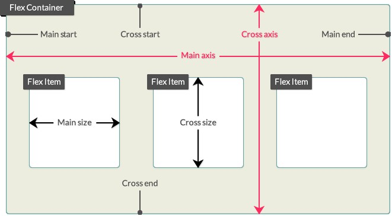{width="5.5in" height="3.0284722222222222in"}

Let&apos;s dive into Flexbox properties.

### flex-grow

This property defines how much a flex item should grow relative to other
flex items via a flex grow factor, and it looks like this:

```
> **flex&hyphen;-grow: 2;**
```

**Description**

The flex grow factor is a *number* without a unit. Negative values are
invalid.

The flex item will grow by the defined grow factor as long as there is
space to do so. It can grow on both the main or cross axes, depending on
the direction defined by the **flex-direction** property, which we&apos;ll
talk about in a minute.

<h4>CSS</h4>:

```
> **/&ast;First flex item will take 1 unit of the available space&ast;/**
>
> **.element-1 { flex-grow: 1; }**
>
> **/&ast;Second and third flex items will take 2 units of the available
> space&ast;/**
>
> **.element-2 { flex-grow: 2; }**
>
> **.element-3 { flex-grow: 2; }**
>
> **/&ast;Fourth flex item will take 1 unit of the available space&ast;/
> .element-4 { flex-grow: 1; }**
```

### flex-shrink

This property defines how much a flex item should shrink relative to
other flex items via a flex shrink factor, and it looks like this:

```
> **flex-shrink: 1;**
```

**Description**

The flex shrink factor is a *number* without a unit. Negative values are
invalid.

This is used when the sum of all flex items exceeds the size of the flex
container. This could be horizontally or vertically (main axis or cross
axis). By assigning flex shrink factors to one or multiple flex items,
we can make them fit the size of the flex container.

<h4>CSS</h4>:

> **/&ast;First flex item will take 1 unit of the available space&ast;/**
>
> **.element-1 { flex-shrink: 1; }**
>
> **/&ast;Second and third flex items will take 2 units of the available
> space&ast;/**
>
> **.element-2 { flex-shrink: 2; }**
>
> **.element-3 { flex-shrink: 2; }**
>
> **/&ast;Fourth flex item will take 1 unit of the available space&ast;/
> .element-4 { flex-shrink: 1; }**

### flex-basis

This property defines the initial width of a flex item, and it looks
like this:

```
> **flex-basis: 200px;**
```

**Description**

flex-basis accepts a *length* value with either an absolute or a
relative length unit (**px**, **em**, **%**, and so on) or the
**content** keyword.

When using **content**, the container will adapt to the content inside
of it. Negative values are invalid.

<h4>CSS</h4>:

```
> **/&ast;Both elements will be 50% wide&ast;/**
>
> **/&ast;Both elements will be 50% wide&ast;/**
>
> **.a { flex-grow: 1; }**
>
> **.b { flex-grow: 1; }**
>
> **/&ast;First element WILL NOT grow and has a fixed width of 200px if
> there&apos;s enough space&ast;/**
>
> **.a { flex-grow: 0; flex-basis: 200px;**
>
> **}**
>
> **/&ast;Second element WILL grow and has a minimum width of 200px if
> there&apos;s enough space&ast;/**
>
> **.b { flex-grow: 1; flex-basis: 200px;**
>
> **}**
>
> **/&ast;First element WILL grow and has a minimum width of 200px if
> there&apos;s enough space&ast;/**
>
> **.a { flex-grow: 1; flex-basis: 200px; } /&ast;Second element:**
```

-   **WILL NOT grow**

-   **WILL shrink if the container is smaller than 400px**

-   **It has a minimum width of 200px if there&apos;s enough space&ast;/**

> **.b { flex-grow: 0; flex-shrink: 1; flex-basis: 200px; }**

### flex-direction

The **flex-direction** CSS property defines the direction of the flex
items inside a flex container, and it looks like this:

> **flex-direction: column;**

**Description**

This property sets the direction in which flex items can be laid out,
either horizontal with **row** or vertical with **column**.

There are four values: two for horizontal and two for vertical: **row**

This lays out the flex items on a horizontal axis. This is the default
value.

When flex items are laid out with **row**, they stack side by side from
left to right.

#### row-reverse

This is the same as **row** but in reverse. When flex items are laid out
with **rowreverse**, they stack side by side from right to left.
**column**

This lays out the flex items on a vertical axis.

When flex items are laid out with **column**, they stack one on top of
the other, starting from top to bottom.

#### column-reverse

This is the same as **column** but in reverse.

When flex items are laid out with **column-reverse**, they stack one on
top of the other, starting from bottom to top.

> The **flex-direction** property is applied to the flex container, not
> the flex items.

<h4>CSS</h4>:

> **/&ast;Horizontal axis: row&ast;/**
>
> **.flex-container { flex-direction: row; }**
>
> **/&ast;Horizontal axis: row-reverse&ast;/**
>
> **.flex-container { flex-direction: row-reverse; }**
>
> **/&ast;Vertical axis: column&ast;/**
>
> **.flex-container { flex-direction: column; }**
>
> **/&ast;Vertical axis: column&ast;/ .flex-container { flex-direction:
> column-reverse; }**

### flex-wrap

The **flex-wrap** CSS property defines whether a flex item should wrap
or not when the container becomes too small, and it looks like this:
**flex-wrap: wrap;**

**Description**

This property accepts one of three keyword values: **nowrap**, **wrap**
and **wrap-reverse**. **nowrap**

This is the default value. It tells the flex item to not wrap. **wrap**

This tells the flex element to wrap. **wrap-reverse**

This tells the flex element to wrap but in reverse.

> The **flex-wrap** property is applied to the flex container, not the
> flex items.

<h4>CSS</h4>:

> **.flex-container { flex-wrap: wrap; }**

### flex-flow

The **flex-flow** CSS property is the shorthand for the
**flex-direction** and **flexwrap** properties, and it looks like this:
**flex-flow: row wrap-reverse;**

**Description**

We now know that the **flex-direction** property defines the direction
of the flex items in either columns or rows.

The **flex-wrap** attribute, on the other hand, defines whether the flex
items should wrap or not when the container becomes too small.

We can specify either one or two values. The order doesn&apos;t affect the
result.

The **flex-direction** attribute can take any of its available values:
**row : (default value)**, **row-reverse**, **column**, or
**column-reverse**.

The **flex-wrap** attribute can take any of its available values as
well: **nowrap** (default value),**wrap**, or **wrap-reverse**.

> The **flex-flow** property is applied to the flex container, not the
> flex items.

<h4>CSS</h4>:

> **/&ast;Main axis and elements will wrap from bottom to top&ast;/**
>
> **.flex-container { flex-direction: row; flex-wrap: wrap-reverse;**
>
> **}**
>
> **/&ast;Above rule is the same as this rule&ast;/**
>
> **.flex-container { flex-flow: row wrap-reverse; }**
>
> **/&ast;Main axis and flex items will wrap from top to bottom&ast;/**
>
> **.flex-container { flex-flow: row-reverse wrap; }**
>
> **/&ast;Cross axis, wrapping doesn&apos;t happen on column layout&ast;/
> .flex-container { flex-flow: column; }**

### align-content

The **align-content** CSS property aligns lines inside a flex container
as long as there is extra space on the cross axis, and it looks like
this:

> **align-content: center;**

**Description**

There are six values: **flex-start**, **flex-end**, **center**,
**space-around**, **spacebetween**, and **stretch**. **flex-start**

This groups the lines to the start of the container.

**flex-end**

This groups the lines to the end of the container.

**center**

This groups the lines to the center of the container.

#### space-around

This distributes the lines evenly in the container, but the first line
is placed at the start of the container and the last line at the end.

#### space-between

This distributes the lines evenly in the container with an even amount
of space between each line.

#### stretch

This is the default value. The lines will evenly stretch to fill the
whole container.

> The **align-content** property is applied to the flex container, not
> the flex items.

<h4>CSS</h4>:

> **/&ast;All lines at the top&ast;/**
>
> **.flex-container { align-content: flex-start; }**
>
> **/&ast;All lines at the bottom&ast;/**
>
> **.flex-container { align-content: flex-end; }**
>
> **/&ast;All lines at the center&ast;/**
>
> **.flex-container { align-content: center; }**
>
> **/&ast;Evenly spaced lines. The top one touches the top edge; the bottom
> one touches the bottom edge&ast;/**
>
> **.flex-container { align-content: space-around; }**
>
> **/&ast;Evenly spaced lines, even the top and bottom ones&ast;/**
>
> **.flex-container { align-content: space-between; }**
>
> **/&ast;Lines will stretch to fill all the available space&ast;/**
>
> **.flex-container { align-content: stretch; }**

### align-items

The **align-items** CSS property sets the default alignment of the flex
elements inside the flex container, and it looks like this:

> **align-items: center;**

**Description**

This property accepts five values: **flex-start**, **flex-end**,
**center**, **baseline**, and **stretch**. **flex-start**

This aligns the flex elements to the beginning of the container.

**flex-end**

This aligns the flex elements to the end of the container.

#### center

This aligns the flex elements to the center of the container and and at
the same time, it aligns them to their center.

#### baseline

This aligns the flex elements to the text baseline inside each flex
element. **stretch**

This stretches the flex elements to fill the entire parent container.

> The **align-items** property is applied to the flex container, not the
> flex items.

<h4>CSS</h4>:

> **/&ast;Align items to the beginning&ast;/**
>
> **.flex-container { align-items: flex-start; }**
>
> **/&ast;Align items to the end&ast;/**
>
> **.flex-container { align-items: flex-end; }**
>
> **/&ast;Align items to the center&ast;/**
>
> **.flex-container { align-items: center; }**
>
> **/&ast;Align items to their text baseline&ast;/**
>
> **.flex-container { align-items: baseline; }**
>
> **/&ast;Make items stretch and fill the parent container&ast;/**
>
> **.flex-container { align-items: stretch; }**

### align-self

The **align-self** CSS property aligns a specific flex item within its
parent container, and it looks like this:

> **align-self: flex-start;**

**Description**

This property accepts the exact values as **align-items**, and the
results are the same as well: **flex-start**, **flex-end**, **center**,
**baseline**, and **stretch**. **flex-start**

This aligns the flex element to the beginning of the container.

**flex-end**

This aligns the flex element to the end of the container.

**center**

This aligns the flex element to the center of the container.

#### baseline

This aligns the flex element to the text baseline inside each flex
element. **stretch**

This stretches the flex elements to fill the entire parent container.

<h4>CSS</h4>:

> **/&ast;Align the flex item to the top&ast;/**
>
> **.element { align-self: flex-start; }**
>
> **/&ast;Align the flex item to the bottom&ast;/**
>
> **.element { align-self: flex-end; }**
>
> **/&ast;Align the flex item to the center&ast;/**
>
> **.element { align-self: center; }**
>
> **/&ast;Align the flex items to their text baseline&ast;/**
>
> **.element { align-self: baseline; }**
>
> **/&ast;Make the flex item stretch&ast;/**
>
> **.element { align-self: stretch; }**

### order

The **order** CSS property is used to alter the default order of flex
items within the same parent container, and it looks like this: **order:
3;**

**Description**

By default, flex items appear in the same order they appear in the
source (HTML). The **order** property allows us to alter the display
order while maintaining their source order. This property accepts a
*number* value without a unit.

The order is defined in a logical way: The lower the number, the more
ahead it is in the order. Items that have the same number are laid out
according to the source document.

The starting number is **0** (zero), not 1. Negative values are allowed.

<h4>CSS</h4>:

> **/&ast;The default order of all elements has been altered, however,
> their source order remains the same.&ast;/**
>
> **.element-1 { order: 3; }**
>
> **.element-2 { order: 0; }**
>
> **.element-3 { order: -1; }**
>
> **.element-4 { order: 2; }**

### justify-content

The **justify-content** CSS property works only on flex items. It allows
the browser to distribute the space in between and around the flex items
based on their main axes.

**Description**

This property supports five keyword values: **flex-start**,
**flex-end**, **center**, **space-between**, and **space-around**.
**flex-start**

This is the default value. It groups and positions the elements to the
beginning of the container.

**flex-end**

This groups and positions the elements to the end of the container.

**center**

This groups and positions the elements to the center of the container.

#### space-between

This spreads and positions the elements along the container and spaces
them evenly.

The first and last flex items are flushed against the left-hand and
right-hand sides respectively. In other words, the first and last flex
items touch the left and right edges.

#### space-around

Similar to the **space-between** property, this spreads and positions
the elements along the container and spaces them evenly.

However, the first and last flex items do not touch the left and right
edges.

<h4>CSS</h4>:

> **.flex-container { display: flex; justify-content: space-between; }**

### flex

The **flex** CSS property is the shorthand in which we can declare the
values for **flex-grow**, **flex-shrink**, and **flex-basis**. It&apos;s
recommended that you follow this order when declaring the values.

<h4>CSS</h4>:

> **/&ast;Apply flexbox to the parent container&ast;/**
>
> **.flex-container { display: flex; } /&ast;Flex items create 4
> containers, each of different size.**
>
> **Each container grows/shrinks proportional to the flex growth/shrink
> factorsand the browser automatically calculates the flex-basis&ast;/
> .element-1 { flex: 1 4 auto; }**
>
> **.element-2 { flex: 2 3 auto; }**
>
> **.element-3 { flex: 3 2 auto; }**
>
> **.element-4 { flex: 4 1 auto; }**

## Summary

And this is how you start the first chapter about CSS Properties! We
learned what CSS properties and vendor prefixes are.

Now, with the animation properties clear we can start working on great
interactions for our sites and applications. We can also handle all
background features, be positioning or even blend modes to create nice
visual effects without having to depend on image editors of any kind.

The Box Model concept is something we can tackle easier especially
knowing that legacy IE&apos;s have less and less impact than before. This is
greatly impacted by how we work with CSS units since we need to
understand which units work best with different use cases and
requirements.

We learned that CSS columns are a great tool to distribute long strings
of text. And that the mighty Flexbox is the go-to feature to arrange
elements in containers.

Improving our typography and transformations are part of the next
chapter, amongst other interesting properties.

Buckle up!

# CSS Properties -- Part 2

Ok, we&apos;re through Part 1 of the CSS properties. Indeed, there are many,
many more properties to talk about.

Let&apos;s now move on to Part 2.

## Fonts

In the world of design, fonts are one of the most powerful assets we
have, and at the same time, they are one of the most underappreciated
ones.

Typography is so powerful that when we use it correctly, we may even get
away with not using a single image in our project.

Let&apos;s take a look at the CSS font properties, shall we?

### font-family

The **font-family** CSS property defines the font we want an element to
use, and looks like this:

> **font-family: &quot;Times New Roman&quot;, Times, Baskerville, Georgia,
> serif;**

**Description**

This property can hold one or multiple font names in its declaration.
There is no limit as to how many font names it can hold; however, it is
not only very unlikely to list more than four or five fonts, but it&apos;s
also unnecessary.

The font family names are separated by commas. We call this the *font
stack*. The browser will read the font stack and use the first one in
the stack, if it can&apos;t find it or download it, it will move on to the
next font family name and so on until it&apos;s able to use one from the
stack.

There are two types of font family names: family name and generic family
name.

#### Family name

Family names are actually names that represent real fonts, such as
**Times**, **Arial**, **Verdana**, **Monaco**, and so on. They should
always be listed before generic family names in the font stack.

#### Generic family names

These are the only keywords that represent a system font. They are
called **fallback** fonts. They should always be listed after the family
names in the font stack. Generic family names can be **monospace**,
**san-serif**, **serif**, **cursive**, and **fantasy**.

> It is not mandatory to use quotes (single or double) when a font
> family name has multiple words. For example, writing **font-family:
> &quot;Times New Roman&quot;, serif;** is the same as writing **font-family:
> Times New Roman, serif;**. Note that **Times New Roman** is not quoted
> in the second example.

<h4>CSS</h4>:

> **.element {**
>
> **font-family: &quot;Times New Roman&quot;, Times, Baskerville, Georgia,
> serif; }**

### font-feature-settings

The **font-feature-settings** CSS property provides control over
typographic properties in OpenType fonts, and looks like this:

> **font-feature-settings: &quot;smcp&quot;;**

**Description**

The font-feature-settings CSS property allows us to control and use
other alternative glyphs that come included in some font files.

An example of an alternate glyph is for example when we type the
fractions 1/2 or 1/4 the font actually includes the &quot;small
superscript&quot; version like ½ and ¼. Or if we type H~2~O it turns into
H~2~O.

Remember, not all fonts contain special glyphs (font features).

To find out what font features a font file has, you can use any of these
two tools:

1.  Fontdeck.com (text has link <http://fontdeck.com/>) - Find the font
    you want and on the About this typeface, look for the OPENTYPE line,
    there all the font features will be listed for that specific font.

2.  Test OpenType features (text has link [http://www.impallari.com/
    testing/index.php)](http://www.impallari.com/testing/index.php) -
    Just drag and drop your font file(s) and click on the OpenType
    Features link on the top left, a large panel will slide where you
    can select which features to see.

Here are some of the most common feature tags:

-   **dlig**: Discretionary ligatures

-   **kern**: Kerning

-   **liga**: Standard ligatures

-   **lnum**: Lining figures

-   **onum**: Old style figures

-   **tnum**: Tabular figures

-   **smcp**: Small capitals

-   **ss01, ss02, ss03, ss04... ss20**: Stylistic sets (font-dependent)

-   **swsh**: Swash

For more information, check out the MDN website:
[**http://tiny.cc/mdn-fontfeature-settings**](http://tiny.cc/mdn-font-feature-settings)

For a complete list of all font features, check the Microsoft site at
[**http://tiny.cc/**
**msn-font-features-list**](http://tiny.cc/msn-font-features-list)

<h4>CSS</h4>:

> **/&ast;Small capitals&ast;/**
>
> **.element {**
>
> **font-feature-settings: &quot;smcp&quot;; }**

### font-size

The **font-size** CSS property defines the size of the text of an
element, and it looks like this:

> **font-size-settings: &quot;smcp&quot;;**

**Description**

This property can also be used to change the size of other elements
since we can compute the value of **em**, **rem**, and **ex** length
units as well.

There are a few different value types that we can use with the
**font-size** CSS property: absolute keywords/size, relative size,
length, and percentage.

#### Absolute keywords/size

The sizes defined relate directly to specific font sizes. They can also
be used to set a font size of an element based on the parent element&apos;s
font size. Values are as follows:

-   **xx-small**

-   **x-small**

-   **small**

-   **medium** (default value)

-   **large**

-   **x-large**

-   **xx-large**

#### Relative size keywords

These sizes increase or reduce the font size of an element based on the
font size of its parent container. The values are:

-   **smaller**

-   **larger**

#### Length

Negative values are invalid. When using **px**, the font size is
absolute; it&apos;s not relative to the font size of the parent container.
When using **em**, **ex**, and **ch**, the font size is relative to the
font size of the element&apos;s parent container. When using **rem**, the
font size is relative to the root element, that is, the **&lt;html&gt;**
element. When using **vw**, **vh**, **vmax**, and **vmin** the font size
is relative to the viewport.

To see all the available values of this attribute, refer to the
*Absolute Length Units* section.

The most popular units are:

-   **px**

-   **em**

-   **rem**

#### Percentage

The **percentage** attribute refers to the percentage of the parent
element&apos;s font size.

Its unit is **%**.

<h4>CSS</h4>:

> **/&ast;Absolute keywords/size&ast;/**
>
> **.element { font-size: x-small; }**
>
> **/&ast;Relative size&ast;/**
>
> **.element { font-size: smaller; }**
>
> **/&ast;Length value&ast;/**
>
> **.element { font-size: 18px; }**
>
> **/&ast;Percentage value&ast;/**
>
> **.element { font-size: 62.5%; }**

### font-size-adjust

The **font-size-adjust** CSS property helps us define the aspect ratio
of the fonts based on the size difference of the lowercase letter *x*
and upper case letter *X*, and it looks like this:

> **font-size-adjust: .5&quot;;**

**Description**

In the font stack, the font sizes can be different from one font to the
other, thus the styling of the text can considerably vary from the
intended design. With the **font-size-adjust** CSS property, we can
solidly predict that the font sizes are consistent when the browser uses
any font from the font stack.

This property accepts a *numeric* value without a unit. It can also
accept decimal values.

A great online tool that can do this for us is Fontdeck&apos;s
font-size-adjust web app:
**http://fontdeck.com/support/fontsizeadjust**.

> Although Firefox is the only one that supports the **font-sizeadjust**
> property at the time of writing this section, I decided to still
> include it because it will be of great value once other browsers start
> supporting it.

<h4>CSS</h4>:

> **.element {**
>
> **font-size-adjust: .5; }**

### font-stretch

The **font-stretch** CSS property allows us to select a **condensed**,
**normal**, or **expanded** face from the font family in question, and
it looks like this: **font-stretch: condensed;**

**Description**

The **font-stretch** property doesn&apos;t just *stretch* the font to
whatever we tell it to. It looks for an actual face inside the font file
that matches the declared style; or at that is as close as possible.

This property supports the following values:

-   **ultra-condensed**

-   **extra-condensed**

-   **condensed**

-   **semi-condensed**

-   **normal**

-   **semi-expanded**

-   **expanded**

-   **extra-expanded**

-   **ultra-expanded**

<h4>CSS</h4>:

> **.element {**
>
> **font-stretch: condensed; }**

### font-style

The **font-style** CSS property specifies the font style of an element,
and it looks like this:

> **font-style: italic;**

**Description**

The **font-style** property accepts the following values: **normal**,
**italic**, and **oblique**.

Let&apos;s clear up the difference between **italic** and **oblique**.

According to the spec:

> *&quot;Italic forms are generally cursive in nature, while oblique faces
> are typically sloped versions of the regular face.&quot;*

This means that when we declare the font style **italic**, the browser
will look for the italic face of the font and use that face. A good
example of this is the typeface *Georgia*; when we use the **italic**
property, we can clearly see that it&apos;s an actual italicized face rather
than making the normal face oblique.

Oblique makes the Normal face slanted or inclined in order to *simulate*
italics.

<h4>CSS</h4>:

> **.element { font-style: italic;**
>
> **}**

### font-variant

The **font-variant** CSS property turns the targeted text into small
caps and it looks like this:

> **font-variant: small-caps;**

**Description**

The **font-variant** property is considered a shorthand in CSS3 and has
been extended with new values, which developers rarely use.

One thing to note is that if the text is already in all caps and we
apply the **small-caps** property to it, the text will not change; it
will continue to be in all caps.

The most used values are: **normal** and **small-caps**. Some of the
additional values in CSS3 are **small-caps**, **all-small-caps**,
**petite-caps**, **all-petite-caps**, **unicase**, and **titling-caps**.

For more information, check out the MDN website:
**http://tiny.cc/mdn-fontvariant**

<h4>CSS</h4>:

> **.element {**
>
> **font-variant: small-caps; }**

### font-variant-ligatures

The **font-variant-ligatures** CSS property defines ligatures in text,
which specify how glyphs are combined in order to produce a more
harmonic text, and it looks like this:

> **font-variantligatures: discretionary-ligatures;**

**Description**

The **font-variant-ligatures** are common in OpenType fonts.

The **font-variant-ligatures** property uses the following values:

**common-ligatures**, **no-common-ligatures**,
**discretionary-ligatures**, **no-discretionary-ligatures**,
**historical-ligatures**, **no-historical-ligatures**, **contextual**,
**no-contextual**, and **contextual**.

For more information, check out the MDN website:
[**http://tiny.cc/mdnfontvariant-ligatures**](http://tiny.cc/mdnfont-variant-ligatures)

<h4>CSS</h4>:

> **.element {**
>
> **font-variant-ligatures: discretionary-ligatures; }**

### font-weight

The **font-weight** CSS property defines the thickness (weight) of the
font, and it looks like this:

> **font-weight: bold;**

**Description**

This property accepts two types of values: a *numeric* value and a
*keyword* value.

#### Numeric values

This property accepts numeric values such as **100**, **200**, **300**,
**400**, **500**, **600**, **700**, **800** and **900**.

#### Keyword values

This property also accepts keyword values such as **normal**, **bold**,
**bolder**, and **lighter**.

> The **normal** keyword is the same as **400** numeric value and the
> **bold** keyword is the same as **700**.

One thing to note is that the keywords **bolder** and **lighter** are
dependent on the parent element&apos;s font weight.

<h4>CSS</h4>:

> **/&ast;Numeric value&ast;/**
>
> **.element { font-weight: 200; }**
>
> **/&ast;Keyword value&ast;/**
>
> **.element { font-weight: bold; }**

### font

The **font** CSS property is the shorthand for the **font-style**,
**font-variant**, **font-weight**, **font-size**, **line-height**, and
**font-family** properties, and it looks like this:

> **font: italic small-caps bold 18px/2 &quot;Times New Roman&quot;, Times,
> Baskerville, Georgia, serif;**

**Description**

There are a few things to consider when using the **font** shorthand in
order for it to work:

-   At least the **font-size** and **font-family** properties need to be
    declared

-   If any of the preceding two properties are omitted, the declaration
    will be ignored

-   If any more than these two properties are going to be declared,
    it&apos;s mandatory to adhere to the following order:

> ° **font-style**
>
> ° **font-variant**
>
> ° **font-weight**
>
> ° **font-size**
>
> ° **line-height**
>
> ° **font-family**
>
> When declaring the **line-height** value in the shorthand, it always
> has to go after the **font-size** property separated with a slash
> &quot;**/**&quot; character, for example, **.element { font: 12px/1.6 Arial;
> }**.

-   <h4>CSS</h4>:

> **/&ast;All font properties in a single declaration&ast;/**
>
> **.element { font: italic small-caps bold 18px/2 &quot;Times New
> Roman&quot;,**
>
> **Times, Baskerville, Georgia, serif; }**
>
> **/&ast;font-style&ast;/**
>
> **.element { font-style: italic; }**
>
> **/&ast;font-variant&ast;/**
>
> **.element { font-variant: small-caps; }**
>
> **/&ast;font-weight&ast;/**
>
> **.element { font-weight: bold; }**
>
> **/&ast;font-size&ast;/**
>
> **.element { font-size: 18px; }**
>
> **/&ast;line-height&ast;/**
>
> **.element { line-height: 2; }**
>
> **/&ast;font-family&ast;/**
>
> **.element { font-family: &quot;Times New Roman&quot;, Times, Baskerville,**
>
> **Georgia, serif; }**

## Transform

CSS transforms have gained such popularity that it&apos;s rare not to see
some sort of transformation in a website nowadays---from button shapes
and animations to layouts.

Let&apos;s dig in.

### transform

The **transform** CSS property allows us to scale, rotate, skew, and
translate elements in 2D and 3D spaces, and it looks like this:
**transform: translate(-10px, 10%);**

**Description**

This property supports the following values: **scale()**, **skewX()**
and **skewY()**, **translate()**, **rotate()**, **matrix()**, and
**perspective()**.

Note that X-axis equals *horizontal* and Y-axis equals *vertical*.

> An easy way to remember which axis is which is by saying this: &quot;*x is
> a cross so the x-axis is across*&quot;. **http://tiny.cc/xy-axis**

#### scale()

The **scale()** function scales an element. It&apos;s also the shorthand for
**scaleX()** and **scaleY()** functions. It accepts a *numeric* value
without a unit. The *numeric* value represents the proportion in which
the element will be scaled. For example, **2** means that the element
will be scaled to twice its size. Negative values are valid.

#### skew()

The **skew()** function tilts the element. If a single value is
declared, then it will only tilt the element on the *x* axis. If two
values are declared, then the element is tilted on both the *x* and *y*
axes. The **skew()** function accepts a *numeric* value followed by the
**deg**, **grad**, **rad**, or **turn** units. However, the **deg** unit
is the most commonly used unit. Negative values are valid. skewX() and
skewY()

The **skewX()** and **skewY()** functions tilts the element only
horizontally or vertically.

#### translate()

The **translate()** function alters the location of an element. If a
single value is declared, then it will only translate the element on the
X-axis. If two values are declared, then the element is translated in
both the X and Y-axis. Negative values are valid.

##### translateX() and translateY()

The **translateX()** and **translateY()** functions alters the location
either horizontally or vertically.

#### rotate()

The **rotate()** function rotates an element around a fixed point in a
2D space. It accepts a *numeric* value followed by the **deg**,
**grad**, **rad**, or **turn** units. The **deg** unit is the most
common though. Negative values are valid. **matrix()**

The **matrix()** function is shorthand for all transformation values
since they can be combined here. Granted the complexity of the
**matrix()** function, this requires a solid understanding of math.

#### perspective()

This value gives a 3D perspective to the element; once the perspective
is set, we can then use any of the other values. The element in question
will react in a 3D plane. It accepts a *numeric* value with a *length*
unit.

The explanation of the advanced mathematics of the **matrix()** function
are out of scope of this book. However, for very detailed explanations,
you can refer to either of these two articles:

-   *Understanding the CSS Transforms Matrix* by Tiffany Brown at
    **http://tiny.cc/css-matrix-1**

-   *The CSS3 matrix() Transform for the Mathematically Challenged* by
    Zoltan Hawryluk at **http://tiny.cc/css-matrix-2 CSS**:

> **/&ast;Scale the same value in both X an Y-axis&ast;/**
>
> **.element { transform: scale(1.1); }**
>
> **/&ast;Scale different values for X and Y-axis&ast;/**
>
> **.element { transform: scale(1.1, 1.5); }**
>
> **/&ast;Tilt the element on X-axis only&ast;/**
>
> **.element { transform: skew(10deg); }**
>
> **/&ast;Tilt the element on both X and Y-axis&ast;/**
>
> **.element { transform: skew(10deg, -20deg); }**
>
> **/&ast;Move the element 10px to the right&ast;/**
>
> **.element { transform: translate(10px); }**
>
> **/&ast;Move the element 10px to the right and 10% down&ast;/**
>
> **.element { transform: translate(-10px, 10%); }**
>
> **/&ast;Rotate in a 2D plane&ast;/**
>
> **.element { transform: rotate(10deg); }**
>
> **/&ast;Matrix&ast;/**
>
> **.element { transform: matrix(2, 2, 1, 2, 0, 0); }**
>
> **/&ast;Add perspective to the element to make it rotate in a 3D
> plane&ast;/**
>
> **.element { transform: perspective(100px) rotateX(40deg); }**

### transform-origin

The **transform-origin** CSS property allows us to change the point of
origin of the transformed element, and it looks like this:
**transform-origin: 50px;**

**Description**

The **transform-origin** property only works if the **transform**
property is declared.

2D transformations can affect the *x* and *y* axes. 3D transformations
can change these two as well as the *z* axis.

For a 2D transformation, up to two values can be declared; the first one
is the X axis (horizontal) and the second the Y axis (vertical).

3D transformations can take up to three values that represent the X, Y,
and Z axes.

The keywords that are accepted in this property are: **top**, **right**,
**bottom**, **left**, and **center**.

<h4>CSS</h4>:

> **/&ast;Single value affects both X and Y-axis&ast;/**
>
> **.element { transform: scale(2, 4); transform-origin: 50px;**
>
> **}**
>
> **/&ast;Two values one for each axis&ast;/**
>
> **.element { transform: scale(2, 4); transform-origin: 50px -100px;**
>
> **}**
>
> **/&ast;Keyword value&ast;/**
>
> **.element { transform: scale(2, 4); transform-origin: bottom;**
>
> **}**
>
> **/&ast;Length and keyword values&ast;/**
>
> **.element { transform: scale(2, 4); transform-origin: 50px bottom;**
>
> **}**
>
> **/&ast;Both keyword values&ast;/**
>
> **.element { transform: scale(2, 4); transform-origin: right bottom;
> }**

### transform-style

The **transform-style** CSS property defines whether an element is
positioned in a 3D space or 2D space (flat), and it looks like this:

> **transform-style: preserve-3d;**

**Description**

This property takes only two values: **flat** and **preserve-3d**.

When the **preserve-3d** property is applied, the elements&apos; stack on
the *z* axis can be altered via the **translate()** function, thus the
elements can appear in different planes regardless of the order in which
they appear in the source HTML.

When the **flat** property is applied, the elements obey the order in
which they appear in the source HTML.

> Note that this property is applied to the parent element, not the
> child elements.

<h4>CSS</h4>:

> **/&ast;Perspective&ast;/**
>
> **.parent-container { transform-style: preserve-3d; perspective:
> 500px;**
>
> **}**
>
> **.element-1 {**
>
> **transform: translateZ(1px) rotateX(60deg);**
>
> **}**
>
> **.element-2 {**
>
> **transform: translateZ(-2px); }**

### Transition

CSS transitions allow us to have very granular control over our
animations.

Let&apos;s take a look at these properties.

**transition**

The **transition** CSS property is the shorthand for all transition
properties: **transition-delay**, **transition-duration**,
**transition-property**, and **transition-timing-function**. It looks
like this: **transition: width 400ms ease-out 1s;**

#### Description

This property lets us define the transition between two states of an
element via the **:hover** or **:active** pseudo-classes.

One thing to consider is that the order in which these properties appear
doesn&apos;t matter. However, since **transition-delay** and
**transition-duration** use the same value unit, **transition-delay**
will always be considered first, followed by **transition-duration**.

<h4>CSS</h4>:

```
/* Shorthand with all properties in a single declaration */
 .element { width: 100px;

/* property - duration - timing function - delay */
transition:
  width 400ms ease-out 1s;
}

 /* Longhand. Each property is declared separately */
.element {
  transition-property: width; transition-duration: 400ms;
  transition-timing-function: ease-out; transition-delay: 1s;
}

.element:hover { width: 300px; }
```

<h4>transition-delay</h4>

The **transition-delay** CSS property allows us to set a *timer*. When
the timer reaches zero, the transition begins. It looks like this:

```
transition-delay: 1s;
```

<h4>Description</h4>

This property accepts a *numeric* value followed by either **s** or
**ms**, which stand for *seconds* and *milliseconds*, respectively.

<h4>CSS</h4>:

```
.element {
  transition-delay: 1s;
}
```

<h4>transition-duration</h4>

The **transition-duration** CSS property allows us to define how long a
transition should take from start to end. This is also called a
**cycle,** and it looks like this: **transition-duration: 400ms;**

<h4>Description</h4>

The **transition-duration** property accepts a *numeric* value followed
by either **s** or **ms**, which stand for seconds and milliseconds,
respectively.

<h4>CSS</h4>:

```
.element {
  transition-duration: 400ms; 
}
```

**transition-property**

The **transition-property** CSS property specifies which CSS property or
properties will be transitioned.

Not all properties are animatable though. The W3C has a nice list of
animatable CSS properties, which can be found at
**http://tiny.cc/w3c-animatable-css-props**

#### Description

The **transition-property** CSS property accepts the following values:

-   **none**: This means that no transitions will take place

-   **all**: This means that all properties will be transitioned

-   **Property name**: This means that the specified property or
    properties will be transitioned

<h4>CSS</h4>:

> **.element {**
>
> **transition-property: width;**
>
> **}**

**transition-timing-function**

The **transition-timing-function** CSS property defines how an
animation&apos;s speed should progress throughout its cycles.

Both the **transition-timing-function** and
**animation-timing-function** properties accept the same five predefined
values, which are also known as easing functions for the **Bézier**
curve: **ease**, **ease-in**, **ease-out**, **ease-in-out**, and
**linear**.

Refer to the *animation-timing-function* section for a detailed
explanation of all the values.

<h4>CSS</h4>:

> **.element {**
>
> **transition-timing-function: ease-out; }**

## Positioning

Positioning elements is something we spend a lot of our time on when
building sites and applications, so having a good understanding of how
to place an element on a layout is crucial, especially when an element
can have different positions depending on the available space.

Let&apos;s see what positioning is all about.

### position

The **position** CSS property defines the location of an element.

**Description**

There are five keyword values for the **position** property: **static**,
**absolute**, **relative**, **fixed**, and **sticky**. **static**

This is the default value of the **position** property. The element
stays in the flow of the document and appears in the actual location
where it&apos;s located in the markup. **absolute**

The element is removed from the document flow and it&apos;s positioned in
relation to its closest relative positioned ancestor element.

#### relative

The element does not change positions unless one or several properties
of **top**, **right**, **bottom**, or **left** are declared. It also
creates a *reference position* for **absolute** positioned child
elements. **fixed**

The element is removed from the document flow just like the **absolute**
positioned elements. However, unlike the **absolute** positioned
elements, which are relative to an ancestor element, the **fixed**
elements are always relative to the document. **sticky**

This value is a mix between the **relative** and **fixed** positions.
The element is treated as **relative** until a specific point or
threshold is met, at which point the element is then treated as
**fixed**. At the time of writing this, only Firefox supports this
property.

<h4>CSS</h4>:

> **/&ast;Position relative&ast;/**
>
> **.element { position: relative;**
>
> **}**
>
> **/&ast;When the element hits the top of the viewport, it will stay fixed
> at**
>
> **20px from the top&ast;/**
>
> **.element { position: sticky; top: 20px; }**

### top

The **top** CSS property is closely tied to the **position** property.

This property specifies the distance of an element from the top of its
current location if the element has **position: relative;** declared or
from the top of its nearest ancestor when the ancestor has **position:
relative;** and the element has **position: absolute;** declared.

If none of the ancestors have **position: relative;** declared, the
absolute positioned element will traverse the DOM until it reaches the
**&lt;body&gt;** tag, at which point it will position itself at the top of
the page regardless of its location in the source HTML.

Negative values are valid.

**Description**

It supports the following values:

-   **auto**: The **auto** keyword is the default value. The browser
    calculates the top position.

-   **Length value**: For the length value, we use one of the following
    units: **px**, **em**, **in**, **mm**, **cm**, **vw**, and so on.

-   **Percentage value**: For the percentage value, we use percentages
    like **50%**, **85%**, and so on.

<h4>CSS</h4>:

> **/&ast;auto&ast;/**
>
> **.element { top: auto; }**
>
> **/&ast;Length value&ast;/**
>
> **.element { top: 20px; }**
>
> **/&ast;Percentage value&ast;/**
>
> **.element { top: 15%; }**

### bottom

The **bottom** CSS property is closely tied to the **position**
property.

This property specifies the distance of an element from the bottom of
its current location if the element itself has **position: relative;**
declared or from the bottom of its nearest ancestor when the ancestor
has **position: relative;** and the element has **position: absolute;**
declared.

If none of the ancestors have **position: relative;** declared, the
absolute positioned element will traverse the DOM until it reaches the
**&lt;body&gt;** tag, at which point it will position itself at the bottom
of the page regardless of its location in the source HTML.

Negative values are valid.

**Description**

It supports the following values:

-   **auto**: The auto keyword is the default value for the **bottom**
    property. The browser calculates the top position.

-   **Length value**: For the length value, we use one of the following
    units: **px**, **em**, **in**, **mm**, **cm**, **vw**, and so on.

-   **Percentage value**: For the percentage value, we use percentages
    like **50%**, **85%**, and so on.

<h4>CSS</h4>:

> **/&ast;auto&ast;/**
>
> **.element { bottom: auto; }**
>
> **/&ast;Length value&ast;/**
>
> **.element { bottom: 20px; }**
>
> **/&ast;Percentage value&ast;/**

**.element { bottom: 15%; } left**

The **left** CSS property is closely tied to the **position** property.

This property specifies the distance of an element from the left of its
current location if the element has **position: relative;** declared or
from the left of its nearest ancestor when the ancestor has **position:
relative;** and the element has **position: absolute;** declared.

If none of the ancestors have **position: relative;** declared, the
absolute positioned element will traverse the DOM until it reaches the
**&lt;body&gt;** tag, at which point it will position itself at the left of
the page regardless of its location in the source HTML.

Negative values are valid.

**Description**

The **left** property supports the following values:

-   **auto**: The **auto** keyword is the default value for the **left**
    property. The browser calculates the top position.

-   **Length value**: For the length value, we use one of the following
    units: **px**, **em**, **in**, **mm**, **cm**, **vw**, and so on.

-   **Percentage value**: For the percentage value, we use percentages
    like **50%**, **85%**, and so on.

<h4>CSS</h4>:

> **/&ast;auto&ast;/**
>
> **.element { left: auto; }**
>
> **/&ast;Length value&ast;/**
>
> **.element { left: 20px; }**
>
> **/&ast;Percentage value&ast;/**
>
> **.element { left: 15%; }**

### right

The **right** CSS property is closely tied to the **position** property.

This property specifies the distance of an element from the right of its
current location if the element has **position: relative;** declared or
from the right of its nearest ancestor when the ancestor has **position:
relative;** and the element has **position: absolute;** declared.

If none of the ancestors have **position: relative;** declared, the
absolute positioned element will traverse the DOM until it reaches the
**&lt;body&gt;** tag, at which point it will position itself at the right of
the page regardless of its location in the source HTML.

Negative values are valid.

**Description**

It supports the following values:

-   **auto**: The **auto** keyword is the default value for the
    **right** property. The browser calculates the top position.

-   **Length value**: For the length value, we use one of the following
    units: **px**, **em**, **in**, **mm**, **cm**, **vw**, and so on.

-   **Percentage value**: For the percentage value, we use percentages
    like **50%**, **85%**, and so on.

<h4>CSS</h4>:

> **/&ast;auto&ast;/**
>
> **.element { right: auto; }**
>
> **/&ast;Length value&ast;/**
>
> **.element { right: 20px; }**
>
> **/&ast;Percentage value&ast;/**
>
> **.element { right: 15%; }**

### vertical-align

The **vertical-align** CSS property controls the vertical positioning of
an element in order to align it to another element(s) next to it.

**Description**

It accepts the following values:

-   **baseline**: This is the default value. It aligns the elements to
    the bottom, exactly at the last line of text regardless of the
    elements&apos; line height. In other words, it aligns the last line of
    text to baselines of the elements.

-   **bottom**: This aligns the elements&apos; containers to the bottom. The
    text and line height of the elements are not considered, only the
    elements&apos; containers to the bottom.

-   **Length value**: For the length value, we use one of the following
    units: **px**, **em**, **in**, **mm**, **cm**, **vw**, and so on.
    Negative values are valid.

-   **middle**: This aligns the elements to their horizontal center
    based on their vertical midpoint.

-   **Percentage value**: For the percentage value, we use percentages
    like **50%**, **85%**, and so on. Negative values are valid.

-   **sub**: This aligns the element to the subscript baseline of the
    parent container.

-   **super**: This aligns the element to the superscript baseline of
    the parent container.

-   **top**: This aligns the elements&apos; containers to the top. The text
    and line height of the elements are not considered.

-   **text-bottom**: This aligns the elements to the bottom based on the
    parent&apos;s text baseline. The line height of the elements is not
    considered, only the bottom of their containers is considered.

-   **text-top**: This aligns the elements to the top based on the
    parent&apos;s text baseline. The line height of the elements is not
    considered, but the top of their containers is.

## Text

Typography is an incredibly powerful design feature and, in reality,
styling text with CSS is actually simple.

Let&apos;s see how.

### color

The **color** CSS property defines the color of the text and looks like
this:

> **color: red;**

Alternatively, it can look like this:

> **color: #f00;**

**Description**

The **color** property supports all color modes, **HEX**, **RGB**,
**RGBa**, **HSL**, **HSLs**, and *color name*.

<h4>CSS</h4>:

> **/&ast;Color Name&ast;/**
>
> **.element { color: red; }**
>
> **/&ast;HEX&ast;/**
>
> **.element { color: #f00; }**
>
> **/&ast;RGB&ast;/**
>
> **.element { color: rgb(255, 0, 0); }**
>
> **/&ast;RGBa - Color has 50% opacity&ast;/**
>
> **.element { color: rgba(255, 0, 0, .5); }**
>
> **/&ast;HSL&ast;/**
>
> **.element { color: hsl(0, 100%, 50%); }**
>
> **/&ast;HSLa - Color has 50% opacity&ast;/**
>
> **.element { color: hsla(0, 100%, 50%, .5); }**

### text-align

The **text-align** CSS property defines the alignment of the text, and
it looks like this:

> **text-align: center;**

**Description**

The text can be centered, left-aligned, right-aligned, and
fully-justified.

The **text-align** property only works on inline elements. If this
property is applied to a block-level element, it will not work on the
element itself, but it will work on its content.

<h4>CSS</h4>:

> **/&ast;Centered text&ast;/**
>
> **.element { text-align: center; }**
>
> **/&ast;Left aligned text&ast;/**
>
> **.element { text-align: left; }**
>
> **/&ast;Right aligned text&ast;/**
>
> **.element { text-align: right; }**
>
> **/&ast;Fully justified text&ast;/**
>
> **.element { text-align: justify; }**

### text-decoration

The **text-decoration** CSS property defines several formatting features
for the text, and it looks like this:

> **text-decoration: underline;**

**Description**

The **text-decoration** property accepts the following keyword values:
**underline**, **overline**, **line-through**, **none**, and **blink**.

This property is also the shorthand for the **text-decoration-line**,
**text-decoration-color**, and **text-decoration-style** properties.

It can accept one, two, or three values in the same declaration if used
as a shorthand.

<h4>CSS</h4>:

> **/&ast;Line above the text&ast;/**
>
> **.element { text-decoration: overline; }**
>
> **/&ast;Line under the text&ast;/**
>
> **.element { text-decoration: underline; }**
>
> **/&ast;Line across the text&ast;/**
>
> **.element { text-decoration: line-through; }**
>
> **/&ast;No underline&ast;/**
>
> **.element { text-decoration: none; }**
>
> **/&ast;Blinking text&ast;/**
>
> **.element { text-decoration: blink; }**
>
> **/&ast;Shorthand&ast;/**
>
> **/&ast;Two values&ast;/**
>
> **.element { text-decoration: underline wavy; }**
>
> **/&ast;Three values&ast;/**
>
> **.element { text-decoration: overline dashed yellow; }**

### text-decoration-line

The **text-decoration-line** CSS property defines the type of decoration
line that a text can have, and it looks like this:

> **text-decoration-line: overline;**

**Description**

The **text-decoration-line** property accepts one, two, or three values
in a single declaration. The keyword values are the same as in the
**text-decoration** property: **underline**, **overline**,
**line-through**, **none,** and **blink**.

<h4>CSS</h4>:

> **/&ast;One value&ast;/**
>
> **.element { text-decoration-line: overline; }**
>
> **/&ast;Two values&ast;/**
>
> **.element { text-decoration-line: overline underline; }**

**/&ast;Three values&ast;/ .element { text-decoration-line: overline underline
blink; } text-decoration-color**

The **text-decoration-color** CSS property defines the type of color the
**text-decoration** property can have, and it looks like this:
**text-decoration-color: red;**

**Description**

It supports all color modes: **HEX**, **RGB**, **RGBa**, **HSL**,
**HSLs**, and *color name*.

<h4>CSS</h4>:

> **/&ast;Color Name&ast;/**
>
> **.element { text-decoration-color: red; } /&ast;HEX&ast;/**
>
> **.element { text-decoration-color: #f00; } /&ast;RGB&ast;/**
>
> **.element { text-decoration-color: rgb(255, 0, 0); } /&ast;RGBa - Color
> has 50% opacity&ast;/**
>
> **.element { text-decoration-color: rgba(255, 0, 0, .5); } /&ast;HSL&ast;/**
>
> **.element { text-decoration-color: hsl(0, 100%, 50%); } /&ast;HSLa -
> Color has 50% opacity&ast;/**
>
> **.element { text-decoration-color: hsla(0, 100%, 50%, .5); }**

### text-decoration-style

The **text-decoration-style** CSS property defines the type of line the
**text-decoration** property can have, and it looks like this:
**text-decoration-style: dotted;**

**Description**

The **text-decoration-style** property supports the following keyword
values: **dashed**, **dotted**, **double**, **solid**, and **wavy**.

<h4>CSS</h4>:

> **.element {**
>
> **text-decoration-style: wavy; }**

### text-indent

The **text-indent** CSS property defines the space to the left
(indentation) of the first line of text in an element, and it looks like
this:

> **text-indent: red;**

**Description**

It accepts **length** and **percentage** values. Negative values are
valid.

<h4>CSS</h4>:

> **.element { text-indent: 50px; }**

### text-overflow

The **text-overflow** CSS property defines how text that is *bleeding*
outside of a container should be clipped, and it looks like this:

> **text-overflow: ellipsis;**

**Description**

For this property to work, two other properties should have to be
declared: **overflow: hidden;** and **white-space: nowrap;**.

There are two keyword values: **clip** and **ellipsis**. **clip**

This cuts the text exactly at the edge of its parent container. This may
cause the last character to be clipped at any point showing only a
portion of it.

#### ellipsis

This adds an ellipsis character &quot;...&quot; at the end of the line of text.

CSS:

> **.element { white-space: nowrap; overflow: hidden; text-overflow:
> ellipsis; }**

### text-rendering

The **text-rendering** CSS property allows us to define the quality of
the text over speed/performance and it looks like this:
**text-rendering: optimizeLegibility;**

**Description**

Depending on the font, when this property is applied, we can see
benefits like better kerning and better ligatures.

However, since this CSS property is actually an SVG property and is not
part of any CSS standard, browsers and operating systems apply this
property at their own discretion, which in turn may not yield the
desired improvements from one browser and/or platform to another.

In addition to this, some small screen devices have serious performance
issues when they encounter the **text-rendering** CSS property,
especially older iOS and Android devices.

> Use the **text-rendering** CSS property with extreme caution and make
> sure you run all pertinent tests.

This property supports four values: **auto**, **optimizeSpeed**,
**optimizeLegibility**, and **geometricPrecision**.

#### auto

This is the default value. The browser tries to make the best educated
guess as to how to render the text in order to optimize for speed,
legibility, and geometric precision.

Remember, each browser interprets this property differently.

#### optimizeSpeed

The browser favors rendering speed over legibility and geometric detail.
It disables kerning and ligatures.

#### optimizeLegibility

The browser favors legibility over rendering speed and geometric detail.
It enables kerning and some optional ligatures. Keep in mind that if the
browser tries to use any kerning and ligatures, this information needs
to be contained in the font file, otherwise we won&apos;t see the effects of
such features.

#### geometricPrecision

The browser favors geometric detail over legibility and rendering speed.
This property helps when scaling fonts.

For example, the kerning in some fonts does not scale correctly, so when
we apply this value, the browser is capable of keeping the text looking
nice.

<h4>CSS</h4>:

> **.element {**
>
> **text-rendering: geometricPrecision;**
>
> **}**

### text-shadow

The **text-shadow** CSS property applies a drop shadow to the text, and
it looks like this:

> **text-shadow: 5px -2vw .2cm black;**

**Description**

This property can accept two, three, or four values in the same
declaration. The first length value in the declaration will always be
for the **x-offset** value and the second length value for the
**y-offset** value.

These are the four values it supports: **x-offset**, **y-offset**,
**color**, and **blur**.

-   **x-offset**: This sets the horizontal distance of the shadow from
    the text. It&apos;s declared as a length value (**px**, **em**, **in**,
    **mm**, **cm**, **vw**, and so on). Negative values are valid. This
    value is mandatory.

-   **y-offset**: This sets the vertical distance of the shadow from the
    text. It&apos;s declared as a length value (**px**, **em**, **in**,
    **mm**, **cm**, **vw**, and so on). Negative values are valid. This
    value is mandatory.

-   **color**: This is the color of the text shadow. It supports all
    color modes: **HEX**, **RGB**, **RGBa**, **HSL**, **HSLs**, and
    *color name*. This value is optional. If it is not specified, the
    default color will be the same color as the text itself.

-   **blur**: This is the **smudge** effect. It&apos;s declared as a length
    value (**px**, **em**, **in**, **mm**, **cm**, **vw**, and so on).
    It supports all color modes: **HEX**, **RGB**, **RGBa**, **HSL**,
    **HSLs**, and *color name*. This value is optional. If it is not
    specified, the default value is zero (**0**).

<h4>CSS</h4>:

> **/&ast;2 values: x-offset and y-offset&ast;/**
>
> **.element { text-shadow: 5px 10px; }**
>
> **/&ast;3 values: x-offset, y-offset and blur. Color value defaults to
> the font color&ast;/**
>
> **.element { text-shadow: 5px 2vw 5px; }**
>
> **/&ast;4 values: x-offset, y-offset, blur and color name&ast;/**
>
> **.element { text-shadow: 5px -2vw .2cm black; }**

### text-transform

The **text-transform** CSS property controls the capitalization of text,
and it looks like this:

> **text-transform: capitalize;**

**Description**

The **text-transform** property supports the following four keyword
values: **none**, **capitalize**, **uppercase**, and **lowercase**.

-   **none**: This is the default value. No capitalization should be
    applied to the element.

-   **capitalize**: This capitalizes the first letter of each word. This
    property is smart enough to ignore any special characters or symbols
    at the beginning of the line and capitalize the first letter of the
    first word.

-   **uppercase**: This changes all the text to upper case/capitals.
    This property can also ignore special characters or symbols at the
    beginning of the line.

-   **lowercase**: This makes all the text lowercase. This property can
    also ignore special characters or symbols at the beginning of the
    line.

### text-underline-position

The **text-underline-position** CSS property defines the location of the
underline on elements that have the **text-decoration** property
declared, and it looks like this: **text-underline-position: left;**

**Description**

The **text-underline-position** property supports four keyword values:
**auto**, **left**, **right**, and **under**.

#### auto

This is the default value. This property allows the browser to decide
where to place the underline, whether at the base line of the text or
below it. **left**

This is only for vertical writing modes. It places the underline to the
left of the text. **right**

This is only for vertical writing modes. It places the underline to the
right of the text.

#### under

This value places the underline below the base line of the text, so it
won&apos;t cross any descender (it supports values like **q**, **p**, **y**,
and so on). This is helpful in text that has mathematical and chemical
formulas that use a lot of subscripts, so the underline doesn&apos;t
interfere with certain characters and make such formulas confusing or
difficult to read.

<h4>CSS</h4>:

> **.element {**
>
> **text-underline-position: left; }**

### direction

The **direction** CSS property sets the direction of the text. Left to
right for western languages and other similar languages and right to
left for languages like Arabic or Hebrew. It looks like this:
**direction: rtl;**

**Description**

The text direction is typically defined in the HTML via the **dir**
attribute rather than via CSS.

The **direction** CSS property is not inherited by table cells. So, in
addition to this, it&apos;s recommended to set the direction of the text via
the **dir** attribute in the HTML document to maintain complete
cascading support if the CSS files do not load.

This property accepts two keyword values, **ltr** and **rtl**, which
mean *left to right* and *right to left*.

<h4>CSS</h4>:

> **.element { direction: rtl;**
>
> **}**

## Tables

Tables, tables, tables! Together with images, HTML tables are the black
sheep of web design.

Regardless of being the black sheep, the power of tables is amazing. And
if there&apos;s an HTML element that does its job well, very well, it&apos;s
tables.

Let&apos;s dig in.

### table-layout

The **table-layout** CSS property allows us to define the how HTML
tables are laid out on the document, and it looks like this:
**table-layout: fixed;**

**Description**

There are two keyword values: **auto** and **fixed**.

-   **auto**: This is the default value. Tables are automatically laid
    out by the browser this way without declaring anything in the CSS.
    The table cells adapt to the content inside of them; the behavior of
    table can sometimes be unpredictable.

-   **fixed**: By declaring the width of the table cells from the first
    row, the rendering of the entire table can be actually faster;
    anything we do to improve performance is big win for everyone.

Since the table cells have a fixed width, depending on the data in the
cells, some information can overflow the cells. Using a combination of
the **overflow** properties and **text-overflow: ellipsis;** we can fix
the issue.

<h4>CSS</h4>:

> **table {**
>
> **table-layout: fixed;**
>
> **}**

### border-collapse

The **border-collapse** CSS property tells the table cells to stay
separated or get close together (collapse), and it looks like this:

> **border-collapse: collapse;**

**Description**

This property supports two keyword values: **separate** and
**collapse**.

-   **separate**: This is the default value. There is a space between
    the table cells, and each cell has its own border.

-   **collapse**: This value brings the cells together, thus the space
    is lost and the cells share borders.

<h4>CSS</h4>:

> **table {**
>
> **border-collapse: collapse; }**

### border-spacing

The **border-spacing** CSS property creates a space between the table
cells, and it looks like this:

> **border-spacing: 10px;**

**Description**

The **border-spacing** property only works when the **border-collapse:
separate;** declaration is present.

<h4>CSS</h4>:

> **table {**
>
> **border-collapse: separate; border-spacing: 10px;**
>
> **}**

### empty-cells

The **empty-cells** CSS property allows us to define how browsers should
render borders and backgrounds on cells that have no content in them,
and it looks like this: **empty-cells: hide;**

**Description**

The **empty-cells** property supports two keyword values: **show** and
**hide**, which determine whether the borders and background should, or
should not, be rendered.

<h4>CSS</h4>:

> **table {**
>
> **empty-cells: hide; }**

### caption-side

The **caption-side** CSS property defines the location of the table
caption, and it looks like this:

> **caption-side: bottom;**

**Description**

It supports two keyword values: **top** and **bottom**.

In CSS 2, other keyword values, such as **left** and **right**, were
supported, but they were dropped in CSS 2.1.

<h4>CSS</h4>:

> **caption {**
>
> **caption-side: bottom;**
>
> **}**

## Words and paragraphs

Continuing with typography features, we now enter the **word** and
**paragraph** properties.

Let&apos;s get going. **hyphens**

The **hyphens** CSS property tells the browser how to handle hyphenation
when text lines wrap, and it looks like this: **hyphens: auto;**

**Description**

We can control when to hyphenate and whether to allow it or let it
happen under certain conditions.

Hyphenation is language dependent. The language in a document is defined
by the **lang** attribute; browsers will hyphenate if they support the
language and a proper hyphenation dictionary is available. Each browser
supports hyphenation differently.

> Ensure that the **lang** attribute is declared either globally on the
> **&lt;html&gt;** tag or on the specific element whose content should be
> hyphenated.

This property supports three keyword values: **none**, **manual**, and
**auto**.

-   **none**: Text lines are not broken at line breaks even if there are
    characters suggesting where a line break should be introduced. Lines
    will only break on whitespace.

-   **manual**: Text lines are broken at line breaks where there are
    characters that suggest a line break.

-   **auto**: The browser makes the decision to introduce line breaks as
    it seem necessary. It bases its decisions on either the presence of
    hyphenation characters or by language-specific information.

### Unicode characters to suggest line break opportunities

There are two Unicode characters that we can use to manually set a
potential line break in the text:

> **U+2010 (HYPHEN)**

This character is called a **hard** hyphen. It&apos;s an actual hyphen &quot;-&quot;
and it&apos;s visible in the text. The browser may or may not break the line
on that specific character.

> **U+00AD (SHY)**

This character is called a **soft** hyphen. Although it is present in
the markup, it is not rendered in the text. However, the browser *sees*
this character and, if it can use it to create a line break, it will. To
insert a soft hyphen, we use **&shy;**.

<h4>CSS</h4>:

> **.element { hyphens: auto; }**

### word-break

The **word-break** CSS property is used to specify whether line breaks
should happen within words instead of breaking the lines on a hyphen or
a space between words, and it looks like this:

> **word-break: break-all;**

**Description**

The **word-break** property is very helpful in situations where a long
string, such as a URL, is wider than its parent container, thus
disrupting the layout or bleeding off the side. Applying the
**word-break** property makes the URL break somewhere along the string.

This property supports three keyword values: **normal**, **break-all**,
and **keep-all**. **normal**

This is the default value. Line breaks will happen based on default line
breaking rules.

#### break-all

This allows line breaks to happen anywhere, including between two
letters. **keep-all**

This affects CJK (Chinese, Japanese, and Korean) text only. Here, text
words are not broken.

<h4>CSS</h4>:

> **.element {**
>
> **word-break: break-all; }**

### word-spacing

The **word-spacing** CSS property controls the space between words, and
it looks like this:

> **word-spacing: .2em;**

**Description**

It supports the following values: a **normal** value, a **length** value
and a **percentage** value.

#### normal

This is the default value. It&apos;s defined by the current font or the
browser itself, and it resets to the default spacing.

#### Length value

We use one of the following units when we use a length value: **px**,
**em**, **in**, **mm**, **cm**, **vw**, and so on

#### Percentage value

For a percentage value, we use percentages like **50%**, **85%**, and so
on.

<h4>CSS</h4>:

> **.element { word-spacing: .2em;**
>
> **}**

### word-wrap 

The **word-wrap** CSS property allows long words to break at an
arbitrary point if there are no suggested break points in the long word
in question, and it looks like this:

> **empty-cells: hide;**

**Description**

This property supports two keyword values: **normal** and
**break-word**.

-   **normal**: It makes long words break at normal break points

-   **break-word**: It indicates that otherwise unbreakable words can
    now break at an arbitrary point

<h4>CSS</h4>:

> **.element {**
>
> **word-wrap: break-word; }**

### line-height

The **line-height** CSS property defines the distance between lines of
text. In typography, the line height is called **leading**.

**Description**

It supports the following values: a **normal** value, a **number**
value, a **length** value, and a **percentage** value.

-   **normal**: This is the default value. The line height is defined by
    the browser.

-   **Number value**: This is a number without any unit. This is the
    recommended method. The reason a unitless value is recommended is
    because this value can cascade into child elements. Child elements
    can then scale their line height based on their font size.

-   **Length value**: We use one of the following units when we use the
    length value: **px**, **em**, **in**, **mm**, **cm**, **vw**, and so
    on. We can use decimals as well.

-   **Percentage value**: For the percentage value, we use percentages
    like **50%**, **85%**, and so on.

<h4>CSS</h4>:

> **.element { line-height: 1.6; }**

### orphans

Let&apos;s understand the term **orphans** first. Orphans are the lines of a
paragraph left in the previous page when a block of text is split over
two pages. In the Web world, this is seen in text that spans several
columns, where the first line of a paragraph is left on the previous
column.

From an editorial standpoint, this is very bad. The recommended
treatment of orphans is to leave at least three lines on the previous
page or column. The more lines, the better.

The **orphans** CSS property controls the number of lines left on the
previous page, and it looks like this:

> **orphans: 3;**

**Description**

This property is very useful in print stylesheets, but it can also work
when using CSS columns.

It supports a *numeric* value without a unit. This numeric value defines
the number of lines left on the previous page or column.

<h4>CSS</h4>:

> **/&ast;Print stylesheet&ast;/**
>
> **&commat;media print {**
>
> **.element { orphans: 3;**
>
> **}**
>
> **}**
>
> **/&ast;Screen stylesheet&ast;/**
>
> **.element { orphans: 4;**
>
> **}**

### quotes

The **quotes** CSS property controls the types of quotation marks to
use, and it looks like this:

> **quotes: &quot;&quot;&quot; &quot;&quot;&quot; &quot;&apos;&quot; &quot;&apos;&quot;;**

**Description**

Quotation marks are added via the **:before** and **:after**
pseudo-elements.

The simplest way to add quotation marks is to let the browser do it
using the **content** property and the **open-quote** and
**close-quote** values: **content: open-quote;** and **content:
close-quote;**.

We can also declare the types of quotes we want to use and not let the
browser decide. We&apos;ll see this in the following CSS example.

Quotes always start and end with a double-character symbol, either **&quot;
&quot;** or, for example, **« »** in French. But, if there&apos;s a nested
quote, this nested quote uses a singlecharacter symbol, either **&apos; &apos;**
or, for example, **‹ ›** in French.

This property supports two values: **none** and a **&lbrack;string string&rbrack;**
value.

**none**

No quotation marks are generated when using the **content** property.

#### &lbrack;string string +&rbrack; value

Each **string** represents a pair of quotes. The first **string**
represents the outer level quotation marks and the second **string**
represents the nested level quotation marks.

The **+** sign means that we can add deeper levels of nested quotation
marks, but it&apos;s not really necessary, two levels should work for most
cases.

Taking into account these considerations, we can then create the
following quotation marks with the **quotes** property:

> **CSS:/&ast;Quotation marks inserted by the browser &quot; &quot; and &apos; &apos;&ast;/
> p:before { content: open-quote; } p:after { content: close-quote; }
> /&ast;Custom declared quotation marks&ast;/ p { quotes: &quot;&quot;&quot; &quot;&quot;&quot; &quot;&apos;&quot;
> &quot;&apos;&quot;; }**
>
> **/&ast;French quotation marks&ast;/ p { quotes: &quot;«&quot; &quot;»&quot; &quot;‹&quot; &quot;›&quot;;
> }**

### widows

Let&apos;s clarify the term **widows** first. Widows are the lines of a
paragraph that appear on the next page when a block of text is split
over two pages. In the Web world, this is seen in text that spans
several columns, where the last line of a paragraph appears on the next
column.

From an editorial standpoint, this is very bad. The recommended
treatment of widows is to leave at least three lines on the next page or
column. The more lines, the better.

The **widows** CSS property controls the number of lines that will
appear on the next page, and it looks like this:

> **widows: 3;**

**Description**

The **widows** property is very useful in print stylesheets, but it can
also work when using CSS columns.

It supports a *numeric* value without a unit. This numeric value defines
the amount of lines that will appear on the next page or column.

<h4>CSS</h4>:

> **/&ast;Print stylesheet&ast;/**
>
> **&commat;media print {**
>
> **.element { widows: 3;**
>
> **}**
>
> **}**
>
> **/&ast;Screen stylesheet&ast;/**
>
> **.element { widows: 4; }**

### writing-mode

The **writing-mode** CSS property defines the direction in which lines
of text or even block-level elements are laid out, either vertically or
horizontally, and it looks like this:

> **writing-mode: vertical-rl;**

**Description**

This property supports three keyword values: **horizontal-tb**,
**vertical-rl**, and **vertical-lr**. **horizontal-tb**

This means *horizontal*, *from top to bottom*. The content flows from
left to right, top to bottom. **vertical-rl**

This means *vertical*, *from right to left*. The content is turned 90
degrees and flows vertically.

To understand this better, think of this: tilt your head to the right
shoulder, at this point, you will be able to read the text flow from top
(which was to the right before tilting your head) to bottom (which was
to the left before tilting your head). **vertical-lr**

This means *vertical*, *from left to right*. The content is turned 90
degrees and flows vertically.

However, unlike **vertical-rl**, when you tilt your head over your right
shoulder, the content flows from bottom (which was to the left before
tilting your head) to top (which was to the right before tilting your
head), and the text lines are inverted.

<h4>CSS</h4>:

> **.element {**
>
> **writing-mode: vertical-rl; }**

### letter-spacing

The **letter-spacing** CSS property defines the space between the
characters in a line of text, and it looks like this:

> **letter-spacing: 5px;**

**Description**

The **letter-spacing** property supports the keyword values: **normal**
and **length**.

Negative values are valid.

> Unless you understand the legibility and design implications, the
> default letter spacing in most fonts is ideal and should rarely be
> changed.

<h4>CSS</h4>:

> **.element {**
>
> **letter-spacing: 5px; }**

### white-space

The **white-space** CSS property defines how the whitespace inside an
element is going to be treated, and it looks like this: **white-space:
pre-wrap;**

**Description**

This property supports five keyword values: **normal**, **nowrap**,
**pre**, **pre-wrap**, and **pre-line**.

#### normal

This is the default value. If we have two or more spaces together, they
will collapse into a single space. This is the normal behavior of HTML
documents. It will wrap the text where necessary.

#### nowrap

Multiple spaces will collapse into a single space, and the line will
never wrap except if there&apos;s a **&lt;br&gt;** tag in the markup.

#### pre

It&apos;s the same as the HTML element **&lt;pre&gt;**, which means
**preformatted**. This value will honor all spaces in the text, but will
not wrap it unless there&apos;s a **&lt;br&gt;** tag in the markup, just like
**nowrap** does. This value is great to display short chunks of code.
**pre-wrap**

This value honors all the spaces and will wrap the text where necessary.
This value is great to display long chunks of code.

#### pre-line

This value collapses multiple spaces into a single space and will wrap
the text where necessary.

### tab-size

The **tab-size** CSS property allows us to define the number of spaces
the tab character can have.

As we saw in the prior **white-space** property description, multiple
spaces are collapsed into a single space by default. Therefore, this
property will only work on elements that are inside a **&lt;pre&gt;** tag
or, have one of the **white-space** properties that honor multiple
spaces, **pre** and **pre-wrap**.

This property is great for displaying code.

The default number of spaces the tab character has is 8. But we, web
designers and developers, are picky and like either four spaces or
sometimes two. With the **tab-size** property, we can modify that
default value to anything we want.

**Description**

The **tab-size** property supports two values: A **numeric** value and a
**length** value.

-   **Numeric value**: It&apos;s just a number without a unit. Negative
    values are not valid.

-   **Length value**: We use one of the following units when we use the
    length value: **px**, **em**, **in**, **mm**, **cm**, **vw**, and so
    on.

<h4>CSS</h4>:

> **pre {**
>
> **white-space: pre-wrap; tab-size: 4; }**

## Paging

Although we build sites and applications for the Web, sometimes what we
make is also printed.

The following properties will help us make our content more presentable
and better handled across pages when printed.

Let&apos;s check out these paging properties.

### page-break-after

The **page-break-after** CSS property defines where the page breaks
after a specific element, and it looks like this: **page-break-after:
always;**

**Description**

What this means is that when a new page break is created, a new page
will be printed.

It works only on block-level elements. Also, since this property is used
for printing, it&apos;s common to see it inside an **&commat;print** media query.

This property supports five keyword values: **always**, **auto**,
**avoid**, **left**, and **right**.

-   **always**: This value will force a page break after the element.

-   **auto**: This is the default value. It creates automatic page
    breaks.

-   **avoid**: This will not allow any page breaks after the element, if
    possible.

-   **left**: This will force one or two page breaks after the element
    in order to make the following page a left-side page.

-   **right**: This will force one or two page breaks after the element
    in order to make the following page a right-side page.

<h4>CSS</h4>:

> **&commat;media print {**
>
> **.element {**
>
> **page-break-after: always;**
>
> **}**
>
> **}**

### page-break-before

The **page-break-before** CSS property works similar to the
**page-break-after** CSS property. However, it defines where the page
breaks before a specific element, and it looks like this:

> **page-break-before: always;**

**Description**

When a new page break is created, a new page will be printed.

It works only on block-level elements. Also, since this property is used
for printing, it&apos;s common to see it inside an **&commat;print** media query.

This property supports the same five keyword values as the
**page-break-before** property: **always**, **auto**, **avoid**,
**left**, and **right**.

Refer to the **page-break-before** CSS property section for the
description of each keyword value.

<h4>CSS</h4>:

> **&commat;media print {**
>
> **.element {**
>
> **page-break-before: always;**
>
> **}**
>
> **}**

### page-break-inside

The **page-break-inside** CSS property also works similar to the
**page-break-before** and **page-break-after** properties. However, it
defines where the page breaks inside a specific element, and it looks
like this: **page-break-inside: avoid;**

**Description**

What this means is that when a new page break is created, a new page
will be printed.

This property supports only two keyword values, though: **auto** and
**avoid**.

-   **auto**: This is the default value. It creates automatic page
    breaks.

-   **avoid**: This will not allow any page breaks inside the element,
    if possible.

<h4>CSS</h4>:

> **&commat;media print {**
>
> **.element {wdwqd page-break-before: avoid;**
>
> **}**
>
> **}**

# CSS Properties -- Part 3

Now that we&apos;re done with Part 2 of the CSS properties, let&apos;s end
strongly with Part 3.

Let&apos;s do this.

## Page box

The page box is a square/rectangular area built out of two parts: the
*page area* and the *margin area*.

The page area is where the content sits and all elements are laid out.
The margin area sits around the page area and is transparent. If we add
a background color to the page area, it will cover the page area and the
margin area.

The size of the page box cannot be modified. But if we plan to modify
some of the page box properties, we need to include them in an
**&commat;page** rule.

Let&apos;s check it out. **bleed**

The **bleed** CSS property is also called the *CSS at-rule descriptor*.
It defines how much a page should &quot;*overflow*&quot; or bleed outside the
page box. This property only works if marks have been enabled using the
**marks** property, which we&apos;ll see next.

**Description**

The **bleed** property only supports a length value: **px**, **em**,
**in**, **mm**, **cm**, **vw**, and so on.

<h4>CSS</h4>:

> **&commat;page { bleed: 5mm; }**

### marks

The **marks** CSS property, also called a *CSS at-rule descriptor*,
defines the types of mark that should be rendered and printed outside
the page box.

Since the marks are printed outside the page box, the pages need to be a
bit larger in order to have the space to print the marks.

**Description**

The **marks** property supports three keyword values: **crop**,
**cross**, and **none**.

-   **crop**: Crop marks define where the page should be cut

-   **cross**: Cross marks are used to align the pages

-   **none**: Marks will not be displayed

<h4>CSS</h4>:

> **&commat;page {**
>
> **marks: crop cross; }**

## List

CSS lists are one of the most versatile elements of web design. Aside
from being used for making, well, lists, they are also used for
navigation, layouts, slideshows, carousels, and so on.

Let&apos;s see some of their properties.

### list-style

The **list-style** CSS property is shorthand for the
**list-style-type**, **list-styleimage**, and **list-style-position**
properties. These properties are actually the values that the
**list-style** CSS property supports. We&apos;ll see all these properties
next.

**Description**

The **list-style** property supports one, two, or three values, in any
order. If a value isn&apos;t declared, it will use its default value.

<h4>CSS</h4>:

> **/&ast;Default values&ast;/**
>
> **ul { list-style: disc outside none; } /&ast;One value, the other two
> are default&ast;/ ul { list-style: circle; }**
>
> **/&ast;Two values, the other one is defaults&ast;/ ul { list-style:
> lower-roman inside; }**
>
> **/&ast;Three values&ast;/**
>
> **ul { list-style: decimal outside url(../images/list-bullet.png); }**

### list-style-type

The **list-style-type** CSS property defines the type of graphic or
marker (also called **bullet**) the list will use. The color of the
marker is determined by the color of the text of the element it&apos;s
applied to.

**Description**

The **list-style-type** property supports many values, but we&apos;ll list
15 of the most commonly used ones: **armenian**, **circle**,
**decimal**, **decimal-leading-zero**, **disc**, **georgian**,
**lower-alpha**, **lower-greek**, **lower-latin**, **lower-roman**,
**none**, **square**, **upper-alpha**, **upper-latin**, and
**upper-roman**.

Here&apos;s a screenshot with all values except the **none** value:

> 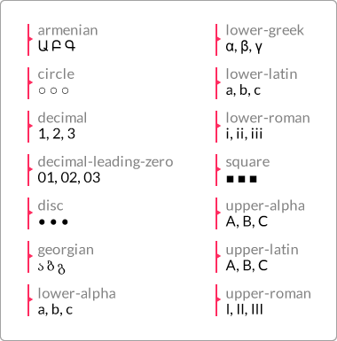{width="2.563888888888889in"
> height="2.5972222222222223in"}

<h4>CSS</h4>:

> **/&ast;Style: 01, 02, 03&period;..&ast;/**
>
> **ul { list-style-type: decimal-leading-zero; }**
>
> **/&ast;Style: α,** β**,** γ**&period;..&ast;/**
>
> **ul { list-style-type: lower-greek; }**
>
> **/&ast;Style: A, B, C&period;..&ast;/ ul { list-style-type: upper-latin; }**

### list-style-position

The **list-style-position** CSS property defines the location of the
marker.

**Description**

The **list-style-position** property supports two keyword values:
**inside** and **outside**.

#### inside

When the **inside** value is applied, the marker will appear inside the
text. If there&apos;s a line that wraps, the marker will be flushed to the
left and not &quot;*sticking out*&quot; like in traditional lists.

#### outside

The default value is **outside**. When this value is applied (or not,
since it&apos;s the default), the marker will appear outside the text. If
there&apos;s a line that wraps, the marker will be outside the text block.
It will &quot;*stick out*&quot; just like in traditional lists.

<h4>CSS</h4>:

> **ul {**
>
> **list-style-position: inside; }**

### list-style-image

The **list-style-image** CSS property allows us to replace the default
markers with a custom image.

**Description**

The **list-style-image** property supports one keyword value and one
function:

**none** and **url()**.

-   **none**: No image is used to replace the marker

-   **url()**: It&apos;s used to define the path to the image that will
    replace the marker

<h4>CSS</h4>:

> **ul {**
>
> **list-style-image: url(../images/list-bullet.png); }**

Here&apos;s a demo in CodePen with all HTML lists:
**http://tiny.cc/html-lists**

## Counter

Traditional lists via the **&lt;ul&gt;**, **&lt;ol&gt;**, **&lt;dl&gt;** tags
aren&apos;t too versatile when it comes to styling the markers. Sometimes,
we have to rely on extra markup to accomplish some minimal custom
styling.

CSS counters, on the other hand, take styling lists (or any element for
that matter) to a whole new level of customization and styling.

Granted, CSS counters rely not only on the properties we&apos;re going to
see next, but also on the **content** property and the **:before**
pseudo-element.

Let&apos;s check out the properties that make CSS counters so great.

### counter-reset

The **counter-reset** CSS property resets the counter by giving it a
name, and it looks like this:

> **counter-reset: basic-counter;**

**Description**

The **counter-reset** property serves two purposes: resets the counter
and defines a name for the counter. The name is later used by the
**counter-increment** and **counter()**/**counters()** functions that
we&apos;ll see later.

I have to admit that the term &quot;**counter-reset**&quot; isn&apos;t as intuitive
as it should be if it&apos;s used to set a name for the counter. Something
like &quot;**counter-name**&quot; would be more suitable if you ask me.

This property supports two values: a *name* and a *number*.

We can reference multiple counter resets in the same declaration.

#### name

We need to give the reset counter a name. This value is required. It can
be any name but it needs to adhere to the following conditions:

-   It can start with a letter, an underscore &quot;**&lowbar;**&quot;, or a hyphen
    &quot;**-**&quot;

-   It can start with a hyphen &quot;**-**&quot; character but cannot have two
    consecutive hyphens at the beginning of the name

-   The name cannot be just a hyphen&quot;**-**&quot;; at least one more
    character is required, but it can&apos;t be a number since it would be
    interpreted as &quot;**minus 1**&quot; (**-1**)

-   It cannot start with a number or a special character like **&num;**,
    **&dollar;**, **!**, and so on

#### number

It&apos;s the number that the counter is reset to. The default value is
**0** (zero) if no value is declared.

This value is optional unless we want to start the list from a number
different than **1**. Pay close attention to this value, because the
first number in the list is not the number declared in this value.

If we set the value to **1**, the list starts at **2**. If we leave the
value empty, it defaults to **0** (zero) and the list starts at **1**.
Negative values are valid.

<h4>CSS</h4>:

> **/&ast;Define a name and counter reset to 0&ast;/ ul { counter-reset:
> basic-counter; }**
>
> **/&ast;The counter will start at 3&ast;/ ul { counter-reset: basic-counter
> 2; }**

**/&ast;Multiple counters in a single declaration&ast;/ ul { counter-reset:
basic-counter-A, basic-counter-B 2; } counter-increment**

The **counter-increment** CSS property increments the value of one or
more counters, and it looks like this: **counter-increment:
basic-counter 2;**

**Description**

This property is used with the **counter-reset** CSS property. This is
because the name specified in the **counter-reset** property is used in
the **counter-increment** CSS property.

As a refresher, remember that the counter name will also be used by the
**counter()**/ **counters()** function.

We can declare multiple counter increments in the same declaration.
Multiple counters are separated by a space. This property supports two
values: A *name* and a *number*. **name**

It can be any name but it needs to adhere to the following conditions:

-   It can start with a letter, an underscore &quot;**&lowbar;**&quot;, or a hyphen
    &quot;**-**&quot;

-   It can start with a hyphen &quot;**-**&quot; character but not have two
    consecutive hyphens at the beginning of the name

-   The name cannot be just the hyphen&quot;**-**&quot;; at least one more
    character is required, but it can&apos;t be a number since it would be
    interpreted as &quot;**minus 1**&quot; (**-1**).

-   It cannot start with a number or a special character like **&num;**,
    **&dollar;**, **!**, and so on.

#### number

This is the number that the counter is reset to. The default value is
**0** (zero) if no value is declared. This value is optional unless we
want to start the list from a number different than **1**.

Now, the **number** value defines the amount of increments each counter
will have. For example, if we declare **2**, then the counter will be
**2**, **4**, **6**, and so on. If we declare **3**, then the counter
will be **3**, **6**, **9**, and so on.

If we do not declare a value, the default increment will be by **1**, as
in **1**, **2**, **3**, and so on.

Negative values are valid. If we declare **-2**, then the counter will
be **-2**, **-4**, **-6**, and so on.

<h4>CSS</h4>:

> **/&ast;First, define a name and counter reset to 0 with counter-reset&ast;/
> ul { counter-reset: basic-counter; }**
>
> **/&ast;Then, invoque the counter name and increment every element by 2
> (2,**
>
> **4, 6, and so on.)&ast;/**
>
> **ul li { counter-increment: basic-counter 2; }**
>
> **/&ast;Multiple counters&ast;/**
>
> **ul li { counter-increment: basic-counter 2 roman-numeral-counter;
> }**

Here is a demo in CodePen: **http://tiny.cc/css-counters**

## Drop shadows

There are three ways to create the effect of depth: using lights,
shadows, or both.

Let&apos;s see how we create box shadows for our containers.

### box-shadow

The **box-shadow** CSS property creates one or several shadows on an
element, and it looks like this:

> **box-shadow: 10px 10px 13px 5px rgba(0, 0, 0, .5) inset;**

**Description**

The **box-shadow** property supports three, four, five, or six values in
the same declaration: four *length* values, one *color* value, and the
*keyword* **inset**.

#### Length values

We use one of the following units when we use the length values: **px**,
**em**, **in**, **mm**, **cm**, **vw**, and so on.

The four length values are as follows:

-   The first value is for the horizontal offset of the shadow. Negative
    values are valid. This value is required.

-   The second value is for the vertical offset of the shadow. Negative
    values are valid. This value is required.

-   The third value is for the blur radius of the shadow. The larger the
    value, the more spread the shadow becomes, but also more
    translucent. Negative values are not valid. This value is required.

-   The fourth value is for the size of the shadow (or &quot;spread
    radius&quot;). Negative values are valid. This value is optional.

#### Color value

This is the fifth value in the list. It supports all color modes:
**HEX**, **RGB**, **RGBa**, **HSL**, **HSLs**, and *color name*.

This value is optional. If no color is specified, it&apos;s up to the
browser to decide which color to use. Some browsers may not even display
a shadow at all without a color value.

The *color* value can go either at the beginning or at the end of the
declaration but never between the length values; otherwise, the
**box-shadow** property won&apos;t work.

#### inset

The sixth value in the list is **inset**. It creates the shadow inside
the container, like a background. However, if there is actually a
background color or image, the **inset** shadow will sit on top of it
but under the content without affecting the layout of the child elements
of the container.

This value is optional. If this value is not declared, the shadow
defaults to displaying the shadow outside the element.

This value can go either at the beginning or at the end of the
declaration but never between the length values; otherwise, the
**box-shadow** property won&apos;t work.

<h4>CSS</h4>:

> **/&ast;Left 10px, top 10px, blur 13px, spread 5px, RGBa mode, inside the
> element&ast;/ .element {**
>
> **box-shadow: 10px 10px 13px 5px rgba(0, 0, 0, .5) inset; }**

## Display and visibility

Display properties are some of the most widely used CSS features in web
design and development. Let&apos;s check them out.

### all

The **all** CSS property resets an element&apos;s properties to its default
values, and it looks like this:

> **all: initial;**

**Description**

The only properties that are not reset are the **direction** and
**unicode-bidi** properties, which control text direction. This is
important because text direction is required to understand the content.
If these properties were reset by the **all** property, then text would
run the opposite way it&apos;s supposed to, disrupting the message
completely.

This property supports three keyword values: **initial**, **inherit**,
and **unset**.

-   **initial**: This changes all the properties of the element or the
    element&apos;s parent to their initial values.

-   **inherit**: This changes all the properties of the element or the
    element&apos;s parent to their parent values.

-   **unset**: This changes all the properties of the element or the
    element&apos;s parent to their parent values if those properties are
    inheritable, otherwise it will change them to their initial value.

<h4>CSS</h4>:

> **/&ast;Change an element&apos;s properties to their initial value&ast;/**
>
> **.element { all: initial; }**
>
> **/&ast;Inherit all the initial properties of the parent container&ast;/**
>
> **.element { all: inherit; }**
>
> **/&ast;Change the parent&apos;s properties to its parent values if
> inheritable&ast;/ .parent-container { all: unset; }**

### clear

The **clear** CSS property specifies which side of an element, or both,
should not *float*, and it looks like this:

> **clear: both;**

**Description**

When the **clear** property is used, it clears the specific box in
question, not its child elements. If we wanted to clear its child
elements, we&apos;d have to declare the **clear** property on them.

When dealing with float-based grids, this property is crucial to the
layout. That is because floated elements are taken out of the document
flow. Thus, their parent container will not take them into account and
its height isn&apos;t determined by those floated elements anymore.

So, adding a clearing declaration (with the **display** and **content**
properties) to the parent&apos;s **:after** pseudo element &quot;*tells*&quot; the
parent element to consider the floated elements and thus the parent
container&apos;s height is now determined by the tallest floating child
element. Let&apos;s take a look at the following image:

> 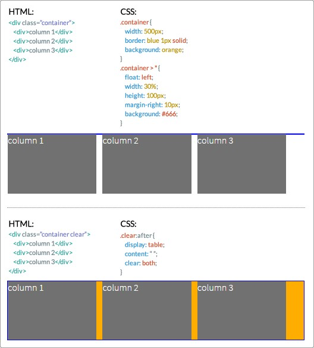{width="3.8673611111111112in"
> height="4.277083333333334in"}

Here is a demo in CodePen: **http://tiny.cc/clearing-floats** The
**clear** CSS property supports four values: **left**, **right**,
**both**, and **none**.

-   **left**: It means that floated elements to the left are not
    allowed.

-   **right**: It means that floated elements to the right are not
    allowed.

-   **both**: It means that floated elements, both left and right, are
    not allowed.

-   **none**: This is the default value. No clearing is performed and
    floating elements to both sides are allowed.

<h4>CSS</h4>:

> **/&ast;Float an element to the left&ast;/**
>
> **.element-a { float: left; }**
>
> **/&ast;Float an element to the right&ast;/**
>
> **.element-b { float: right; }**
>
> **/&ast;Clear the floats on the parent container&ast;/**
>
> **.parent-container:after { content: &apos;&apos;; display: table; clear:
> both; }**

### display

The **display** CSS property defines how an element (box) should be or
should not be displayed on a page. It looks like this: **display:
block;**

**Description**

This property accepts about 25 keyword values; some of them are very
obscure and rarely used. Let&apos;s focus on the 15 most relevant ones:

-   **block**

-   **flex**

-   **grid**

-   **inline**

-   **inline-block**

-   **inline-flex**

-   **none**

-   **table**

-   **table-cell**

-   **table-column**

-   **table-column-group**

-   **table-footer-group**

-   **table-header-group**

-   **table-row**

-   **table-row-group**

-   **block**: Makes an element be displayed as a block-level element,
    like a **&lt;div&gt;** tag or an **&lt;h1&gt;** element.

-   **flex**: Makes an element be displayed as a block-level element and
    lays out its content based on the **Flexbox** model.

-   **grid**: Makes an element be displayed as a block-level element and
    lays out its content based on the **Grid** model.

-   **inline**: Makes an element be displayed as an inline-level
    element, like a link **&lt;a&gt;** element.

-   **inline-block**: Makes an element be displayed as an
    **inline-block** element, like a list **&lt;li&gt;** element.

-   **inline-flex**: Makes an element be displayed as an inline element
    and lays out its content based on the **Flexbox** model.

-   **none**: Hides the element from rendering in the browser. The
    element still exists in the markup though. When this value is
    applied to an element, the browser does not render the element and
    all its children.

#### Table-related values

In the following list, all the **table-related** values are mapped to an
HTML element. So when any of those values are applied to an element,
they make that element behave as a **table-related** element. Let&apos;s
take a look at the attributes:

-   table = **&lt;table&gt;**

-   table-cell = **&lt;td&gt;**

-   table-column = **&lt;col&gt;**

-   table-column-group = **&lt;colgroup&gt;**

-   table-footer-group = **&lt;tfoot&gt;**

-   table-header-group = **&lt;thead&gt;**

-   table-row = **&lt;tr&gt;**

-   table-row-group = **&lt;tbody&gt;**

Visit MDN for a list of all the display values:
**http://tiny.cc/mdn-display**

<h4>CSS</h4>:

> **/&ast;Make an element display like a block level element&ast;/**
>
> **.element { display: block; }**
>
> **/&ast;Make an element display like a &lt;table&gt; element&ast;/**
>
> **.element { display: table; }**
>
> **/&ast;Make an element display like an inline-block element -
> &lt;li&gt;&ast;/**
>
> **.element { display: inline-block; }**
>
> **/&ast;Hide an element an its children&ast;/**
>
> **.element { display: none; }**

### opacity

The **opacity** CSS property defines the transparency (opacity) of an
element, and it looks like this:

> **opacity: .55;**

**Description**

When the **opacity** property is applied to an element, the element
itself and its children are affected.

This property supports a *numeric* value ranging from 0.0 (zero) to 1.0,
which is the default value. A value of 0 is completely transparent, as
in 0 percent opaque, and 1 is 100 percent opaque, no transparency
whatsoever. Decimal numbers are allowed.

This property behaves the same as the alpha channel value used in the
RGBa and HSLa color modes.

<h4>CSS</h4>:

> **/&ast;Make an element 55% opaque. This affects its children as
> well&ast;/**
>
> **.element { opacity: .55; }**
>
> **/&ast;Makes shadow 20% opaque. Same effect as in RGBa and HSLa color
> modes.&ast;/**
>
> **.element { box-shadow: 0 0 5px rgba(0, 0, 0, .2); }**

### filter

The **filter** CSS property allows us to apply visual effects to an
**img** element or to the **background** or **border** properties, and
it looks like this: **filter: blur(10px);**

**Description**

A few examples of CSS filters are blur, turning a color image into
grayscale or sepia, or changing its opacity.

> This **filter** property is not the same as Microsoft&apos;s proprietary
> **filter** property that only IE supports. Unlike Microsoft&apos;s
> proprietary filters, which are not part of a standard, this CSS
> **filter** property is part of a work in progress of the W3C.

This property supports 11 values. These values are called CSS functions.
Multiple functions can be declared in the same selector, separated by a
space.

Let&apos;s see the list:

-   **blur()**

-   **brightness()**

-   **contrast()**

-   **drop-shadow()**

-   **grayscale()**

-   **hue-rotate()**

-   **invert()**

-   **opacity()**

-   **saturate()**

-   **sepia()**

-   **url()**

#### blur()

This gives a **smudge** effect. Values are declared as *length* values
(**px**, **em**, **in**, **mm**, **cm**, **vw** and so on). The higher
the value, the more intense the blur effect is (and vice versa).

Percentage and negative values are not allowed, but decimal values are
allowed.

#### brightness()

This modifies the illumination of an image. Values are declared as
either a *percentage* or a *number* without a unit, for example, 10% and
0.5%.

A value of 100% leaves the element unchanged, and a value of 0% makes
the element completely black. Values over 100% are allowed and create a
more intense effect. There is no limit to the value.

Then, a value of 1 leaves the element unchanged; a value of 0 makes the
element completely black. Values over 1 are allowed and create a more
intense effect. There is no limit to the value. Negative values are not
valid.

#### contrast()

This modifies the contrast of an element. Values are declared as either
a *percentage* or a *number* without a unit, for example, 10% and 0.5%.

A value of 100% leaves the element unchanged, and a value of 0% makes
the element completely black. Values over 100% are allowed and create a
more intense effect. There is no limit to the value.

Then, a value of 1 leaves the element unchanged; a value of 0 makes the
element completely black. Values over 1 are allowed and create a more
intense effect. There is no limit to the value. Negative values are not
valid, and decimal values are allowed. **drop-shadow()**

This adds a shadow under the element.

This function works almost exactly the same way as the **box-shadow**
property with two differences: the **drop-shadow()** function doesn&apos;t
support the **spread-radius** attribute or the **inset** values.

Please refer to the **box-shadow** property for a detailed description
of all the values.

Additionally, some browsers actually provide hardware acceleration when
using this function, which eventually improves performance. You know how
it goes, anything we can do to improve performance is always a+1.
**grayscale()**

This converts an element to grayscale. Values are declared as either a
*percentage* or a *number* without a unit, for example, 10% and 0.5%.

A value of 0% leaves the element unchanged; a value of 100% makes the
element grayscale. Values over 100% are not allowed.

A value of 0 leaves the element unchanged, and a value of 1 makes the
element grayscale. Values over 1 are not allowed. Negative values are
not valid, and decimal values are allowed.

#### hue-rotate()

This applies a hue rotation to the element. It accepts an *angle* value.

The angle value defines the degrees around the color wheel the element
sample will be modified to. There isn&apos;t a maximum value, however, if
the value is larger than **360deg**, the rotation will just go around.
For example, if we declare **380deg**, that would the same as **20deg**.
**invert()**

The **invert()** function inverts the color of the element. If used in
an image, it makes the image look like a film negative.

A value of 100% completely inverts the element&apos;s color; a value of 0%
leaves the element unchanged. Values over 100% are not allowed.

A value of 1 completely inverts the element&apos;s color, and a value of 0
leaves the element unchanged. Values over 1 are not allowed.

Negative values are not valid, and decimal values are allowed.
**opacity()**

It defines the transparency (opacity) of an element. When this function
is applied to an element, the element itself and its children are
affected.

This function supports a numeric value ranging from 0 (zero) to 1, which
is the default value. A value of 0 is completely transparent, as in 0%
opaque, and 1 is 100% opaque, no transparency whatsoever.

Negative values are not valid, and decimal values are allowed.

#### saturate()

It affects the saturation levels of an element. Values are declared as
either a *percentage* or a *number* without a unit, for example, 10% and
0.5%.

The default saturation value of an element is 100%, or 1 if using a
unitless number.

A value of 0% completely desaturates the element (it removes all color
leaving the element in grayscale); a value of 100% leaves the element
unchanged. Values over 100% are allowed, creating a more intense effect.

A value of 0 completely desaturates the element (it removes all color
leaving the element in grayscale), and a value of 1 leaves the element
unchanged. Values over 1 are allowed, creating a more intense effect.

#### sepia()

This converts an element to sepia---think of a grayscale image but in
shades of brown.

A value of 100% completely turns the element to sepia; a value of 0%
leaves the element unchanged. Values over 100% are not allowed.

A value of 1 completely turns the element to sepia; a value of 0 leaves
the element unchanged. Values over 1 are not allowed. Negative values
are not valid. **url()**

It takes the location of an XML file with an SVG filter to be applied to
the element. The URL may include an anchor to a specific filter element
in the SVG.

<h4>CSS</h4>:

> **/&ast;Blur&ast;/**
>
> **.element { filter: blur(10px); }**
>
> **/&ast;Brightness&ast;/**
>
> **.element { filter: brightness(20%); }**
>
> **/&ast;Contrast&ast;/**
>
> **.element { filter: contrast(10); }**
>
> **/&ast;Drop shadow&ast;/**
>
> **.element { filter: drop-shadow(5px 5px 3px rgba(0, 0, 0, .5)); }**
>
> **/&ast;Grayscale&ast;/**
>
> **.element { filter: grayscale(.8); }**
>
> **/&ast;Hue rotation&ast;/**
>
> **.element { filter: hue-rotate(80deg); }**
>
> **/&ast;Invert&ast;/**
>
> **.element { filter: invert(1); }**
>
> **/&ast;Opacity&ast;/**
>
> **.element { filter: opacity(.2); }**
>
> **/&ast;Saturation&ast;/**
>
> **.element { filter: saturate(300%); }**
>
> **/&ast;Sepia&ast;/**
>
> **.element { filter: sepia(100%); }**
>
> **/&ast;URL&ast;/**
>
> **.element { filter: url(/images/file.svg#blur); }**
>
> **/&ast;Multiple filters for a single element&ast;/**
>
> **.element { filter: sepia(100%) saturate(200%) hue-rotate(50deg); }**

### overflow

The **overflow** CSS property defines how a block level element should
handle content that &quot;*bleeds*&quot; (overflows) outside its boundaries, and
it looks like this: **overflow: auto;**

**Description**

A peculiarity of the **overflow** property is that it is used to clear
floats and make the parent container expand vertically to wrap the
floating elements. This is accomplished by using any of the following
values except **visible**.

However, a word of caution. When using the prior technique since it can
have unforeseen effects. For example, if a child element has a
**box-shadow**, the shadow could be clipped/hidden.

In order for content to overflow, the parent container needs to have a
fixed height or the content needs to have a **white-space: nowrap;**
declaration applied to it.

This property supports four keyword values: **auto**, **hidden**,
**scroll**, and **visible**.

-   **auto**: This creates horizontal and vertical scrollbars only if
    necessary. In other words, if the content overflows the container in
    any direction, the browser will create scrollbars in one or both
    axes.

-   **hidden**: This will clip/hide the content that&apos;s outside of the
    element. No scrollbars are generated. This value is very popular
    when clearing floats. Again, be careful when using this value.

-   **scroll**: This creates horizontal and vertical scrollbars even if
    the content isn&apos;t overflowing the container.

-   **visible**: This is the default value. No content is clipped/hidden
    and no scrollbars are generated.

<h4>CSS</h4>:

> **/&ast;Scroll bars are generated if the content needs them&ast;/**
>
> **.element { white-space: nowrap; overflow: auto;**
>
> **}**
>
> **/&ast;Clearing floats. Be careful with this technique&ast;/**
>
> **.parent-container { overflow: hidden; }**

### overflow-x

The **overflow-x** CSS property behaves the same as the **overflow**
property, and it looks like this:

> **overflow-x: auto;**

**Description**

The difference is that the **overflow-x** property handles the overflow
on the *X* axis (horizontally). Please refer to the description of
**overflow**, since the values are the same.

<h4>CSS</h4>:

> **.element { white-space: nowrap; overflow-x: auto; }**

### overflow-y

The **overflow-y** CSS property behaves like the **overflow** property,
and it looks like this:

> **overflow-y: auto;**

**Description**

The difference is that the **overflow-y** property handles the overflow
on the *Y* axis (vertically). Please refer to the prior description of
**overflow**, since the values are the same.

<h4>CSS</h4>:

> **.element { height: 100px; overflow-y: auto;**
>
> **}**

### visibility

The **visibility** CSS property defines whether an element is visible or
not, and it looks like this:

> **visibility: hidden;**

**Description**

The **visibility** property is similar to **display: none;** in terms of
hiding an element; the difference is that when hiding an element with
the **visibility** property, the space the element occupies still
affects the layout. It&apos;s just &quot;*invisible*&quot;. With **display: none;**,
it&apos;s like the element doesn&apos;t even exist.

The **visibility** CSS property is not inheritable; in other words, we
can still make the child elements visible even if their parent container
is not. It can also be used to hide rows and columns in tables.

This property supports three different keyword values: **collapse**,
**hidden**, and **visible**.

-   **collapse**: This is used only on table elements to remove rows or
    columns. However, the collapsed/hidden elements still affect the
    layout since they are still taking up their space. If this value is
    used in other elements than a table elements, they will be treated
    as if the value **hidden** is being used.

-   **hidden**: This is used to visually hide an element. However, any
    hidden elements still affect the layout because they are still
    taking up their space.

-   **visible**: This is the default value. It makes an element visible.

<h4>CSS</h4>:

> **/&ast;Hide an element&ast;/**
>
> **.element { visibility: hidden; }**
>
> **/&ast;Parent container visible while child heading is visible&ast;/**
>
> **.parent-container { visibility: hidden; }**
>
> **.parent-container h1 { visibility: visible; }**
>
> **/&ast;Hide table elements&ast;/ tr { visibility: collapse; } tfoot {
> visibility: collapse; }**

### z-index

The **z-index** CSS property defines the stacking order of elements.
Think of it in this way: elements sometimes overlap, like a stack of
poker cards on a table. The card sitting at the top of the stack has the
highest **z-index**, the card sitting at the bottom has the lowest
**z-index**.

For this property to work, the element has to have a position
**property** declared with any value different from **static**.

**Description**

The **z-index** property accepts two values: a *number* and a *keyword*
value.

-   **Number value**: This is also called an &quot;**integer**&quot;. It&apos;s just
    a number without a unit.

-   **auto**: This is the default value. The stacking order of elements
    is the same as their parent.

<h4>CSS</h4>:

> **/&ast;Set all cards to relative position so z-index can work&ast;/**
>
> **.card { position: relative; }**
>
> **/&ast;The Ace card sits on top of the pile&ast;/**
>
> **.card.ace { z-index: 2; }**
>
> **/&ast;The Five card sits at the bottom of the pile&ast;/**
>
> **.card.five { z-index: 0; }**
>
> **/&ast;The Queen card sits in between the Ace and the Five&ast;/**
>
> **.card.queen { z-index: 1; }**

## Masking and clipping

These two features allow us to hide parts of an element in order to show
a background image or color, or to give an element a special shape. Both
terms can be a bit confusing, so let&apos;s see a brief description of each:

-   **Clipping** is done with vectors or paths since this CSS feature
    was taken from the SVG specification. It creates a solid edge
    between the element and its background.

-   **Masking**, on the other hand, uses images/bitmaps. With images, we
    can have &quot;*feathered*&quot; or blurred edges, whereas with clipping we
    have straight edges.

Let&apos;s check these properties out.

### mask

The **mask** CSS property is the shorthand for the **mask-clip**,
**mask-composite**, **maskimage**, **mask-mode**, **mask-origin**,
**mask-position**, **mask-repeat**, and **mask-size** properties. We&apos;ll
see each of these in more detail later. The **mask** property looks like
this:

> **mask: url(../images/mask.png) 50% 50% / contain no-repeat border-
> box;**

**Description**

A group of all the prior properties is called a &quot;*mask layer*&quot;.

It&apos;s recommended to use the shorthand syntax over individual specific
properties, since the shorthand resets undeclared properties to their
initial values. This is helpful because it makes it easier to override
values later in the cascade, thus avoiding specificity issues and
potential use of the **!important** directive.

Additionally, **mask-clip** and **mask-origin** use a **geometry**
value. If we declare only one value, then both properties will use that
value. With two values, **mask-clip** will use the first one and
**mask-origin** will use the second one.

As I mentioned before, CSS masks use images, which means that we can
reference a bitmap/raster file with a transparency or a background
gradient with the **lineargradient()** CSS function. We can even create
a mask by referencing several images in the same declaration.

There are two types of mask: *alpha* masks and *luminance* masks. We&apos;ll
see what each of these types of mask are later.

<h4>CSS</h4>:

> **/&ast;Mask referencing a bitmap file.**
>
> **We are specifying: mask-image mask-position / mask-size mask- repeat
> mask-clip**
>
> **&ast;/**
>
> **.element {**
>
> **mask: url(../images/mask.png) 50% 50% / contain no-repeat
> border-box;**
>
> **}**
>
> **/&ast;Mask using the CSS linear-gradient property&ast;/**
>
> **.element {**
>
> **mask: linear-gradient(black 5%, transparent);**
>
> **}**
>
> **/&ast;Mask created by declaring multiple masks&ast;/**
>
> **.element { mask: url(../images/mask.png) 50% 50% / contain no-repeat
> border- box,**
>
> **linear-gradient(white 5%, transparent); }**

### mask-clip

The **mask-clip** CSS property determines the area of the element that
will be affected by the mask, and it looks like this: **mask-clip:
padding-box;**

**Description**

This property is similar to the **background-clip** CSS property. Refer
to *Chapter 4*, *CSS Properties -- Part 1*, for more information.

Multiple comma-separated keyword values can be present in the same
declaration. Each value represents its corresponding image in the
comma-separated values of the **mask-image** property.

It supports four keyword values: **border-box**, **content-box**,
**padding-box**, and **noclip**.

-   **border-box**: This is the default value. If the element has any
    borders, they are seen through the mask.

-   **content-box**: Only the parts of the element that are inside its
    *content* area are visible through the mask.

-   **padding-box**: If the element has any padding, it will be seen
    through the mask.

-   **no-clip**: The content is not *clipped*.

<h4>CSS</h4>:

> **/&ast;Padding box clipping&ast;/**
>
> **.element { mask-clip: padding-box; }**
>
> **/&ast;Multiple values&ast;/**
>
> **.element { mask-clip: padding-box, border-box; }**

### mask-composite

The **mask-composite** CSS property defines how multiple masks with
different shapes are combined or *composited* to form a single mask, and
it looks like this: **mask-composite: intersect;**

**Description**

The **mask-composite** property works when **mask-image** is used and at
least two mask images are declared. Multiple comma-separated keyword
values can be present in the same declaration. Each value represents its
corresponding image in the comma-separates values of the **mask-image**
property.

The **mask-composite** CSS property supports four keyword values:
**add**, **subtract**, **exclude**, and **intersect**.

For example, picture part of triangle over part of a circle, where the
triangle is on top and the circle below; the different types of
*composite* make different shapes of masks:

> 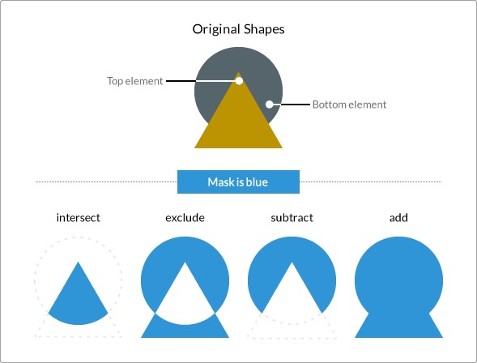{width="4.84in" height="3.681333114610674in"}

-   **intersect**: The shape of the mask is where the triangle and the
    circle overlap, or *intersect*. The rest of the shape is discarded.

-   **exclude**: The part where the triangle and the circle intersect is
    discarded, and the rest of the elements is what makes the mask.

-   **subtract**: Since the triangle is on top, it will *trim* or *crop*
    the circle, thus leaving a **Pac-Man** shape mask.

-   **add**: The triangle is fused to the circle creating a single shape
    that will be used as the mask.

<h4>CSS</h4>:

> **/&ast;Intersect the masks&ast;/**
>
> **.element { mask-composite: intersect; }**
>
> **/&ast;Multiple values&ast;/ .element { mask-composite: intersect, exclude;
> }**

### mask-image

The **mask-image** CSS property defines the image or images to be used
as mask layers on any given element, and it looks like this:
**mask-composite: intersect;**

**Description**

The **mask-image** property may also refer to **&lt;mask&gt;** elements in
an SVG file. Multiple values are comma-separated. The images can be
bitmap files, SVGs, and even CSS gradients that are images as well.

<h4>CSS</h4>:

> **/&ast;Mask referencing a bitmap&ast;/**
>
> **.element { mask-image: url(../images/mask.png); }**
>
> **/&ast;Mask using a CSS gradient&ast;/**
>
> **.element { mask-image: linear-gradient(black 5%, transparent); }**
>
> **/&ast;Mask referencing an SVG &lt;mask&gt;&ast;/**
>
> **.element { mask-image: url(../images/file.svg#mask); }**
>
> **/&ast;Multiple values&ast;/**
>
> **.element { mask-image: url(../images/mask.png), linear-**
>
> **gradient(black 5%, transparent); }**

### mask-mode

The **mask-mode** CSS property defines whether the mask layer is an
**alpha** mask or a **luminance** mask. These terms are the actual
keyword values, and it looks like this: **mask-mode: alpha;**

**Description**

Multiple comma-separated keyword values can be present in the same
declaration. Each value represents its corresponding image in the
comma-separates values of the **mask-image** property.

#### Alpha masks

Alpha masks use the *alpha channel* of the image. Whatever is
transparent will be covered; whatever is opaque will show. Of course, a
semi-transparent area on the image is partially covered.

#### Luminance masks

Luminance masks uses the *luminance values* of the image. Whatever is
*white* on the image being used as mask will show. Whatever is black is
hidden. Gray areas partially cover the image.

<h4>CSS</h4>:

> **/&ast;Alpha mask&ast;/**
>
> **.element { mask-mode: alpha; }**
>
> **/&ast;Multiple values&ast;/ .element { mask-mode: alpha, luminance; }**

### mask-origin

The **mask-origin** CSS property defines the location or position of the
mask layer in relation to the element&apos;s box starting at the top left
corner, and it looks like this:

> **mask-mode: alpha;**

**Description**

The **mask-origin** property works in a similar way to the
**background-origin** property. Refer to *Chapter 4*, *CSS Properties --
Part 1*, for more information.

Now, this property can be used in both HTML and SVG elements. However,
there are some keyword values that apply to one that won&apos;t work on the
other.

Multiple comma-separated keyword values can be present in the same
declaration. Each value represents its corresponding image in the
comma-separates values of the **mask-image** property.

The HTML keyword values are **border-box**, **padding-box**,
**margin-box**, and **content-box**.

The SVG keyword values are **view-box**, **fill-box**, and
**stroke-box**.

-   **border-box**: The origin starts at the top left corner of the
    border box. It will include the border and any padding (if any is
    declared) when applying the mask, but it will not go beyond that
    border.

-   **padding-box**: The origin starts at the top-left corner of the
    padding box. It will include the padding when applying the mask, but
    it will not include any borders if any are declared.

-   **margin-box**: The origin starts at the top-left corner of the
    margin box. It will include the margin, the border, and the padding
    when applying the mask.

-   **content-box**: The origin starts at the top-left corner of the
    content box. It will include only the *content* area. No margins,
    padding, or borders are taken into consideration.

-   **view-box**: It uses the closest SVG viewport as a reference box.

-   **fill-box**: The position of the mask is relative to the *object
    bounding box*.

-   **stroke-box**: The position of the mask is relative to the *stroke
    bounding box*.

<h4>CSS</h4>:

> **/&ast;Content box origin; the mask will exclude borders and
> paddings&ast;/**
>
> **.element { mask-origin: content-box; }**
>
> **/&ast;Multiple values&ast;/ .element { mask-origin: border-box,
> padding-box; }**

### mask-position

The **mask-position** CSS property defines the starting position of the
mask, and it looks like this:

> **mask-position: right top;**

**Description**

This property works similar to the **background-position** property.
Refer to *Chapter 4*, *CSS Properties -- Part 1*, for more information.

Multiple comma-separated keyword values can be present in the same
declaration. Each value represents its corresponding image in the
comma-separates values of the **mask-image** property.

The **mask-position** CSS property supports several types of values:
four *keyword* values, **top**, **right**, **bottom**, and **left**; a
*length* value, **px**, **em**, **in**, **mm**, **cm**, **vw**, and so
on; and a *percentage* value such as 50%, 85%, and so on.

<h4>CSS</h4>:

> **/&ast;Keyword values&ast;/**
>
> **.element { mask-position: right top; }**
>
> **/&ast;Length and Percentage values&ast;/**
>
> **.element { mask-position: 50px 25%; }**
>
> **/&ast;Multiple values&ast;/ .element { mask-position: right top, 50% 50%;
> }**

### mask-repeat

The **mask-repeat** CSS property defines whether a mask layer is
repeated or not, and it looks like this:

> **mask-repeat: space;**

**Description**

This property works in a similar way to the **background-repeat**
property. Refer to *Chapter 4*, *CSS Properties -- Part 1*, for more
information.

Multiple comma-separated keyword values can be present in the same
declaration. Each value represents its corresponding image in the
comma-separates values of the **mask-image** property.

It supports six keyword values: **repeat**, **no-repeat**, **repeat-x**,
**repeat-y**, **space**, and **round**.

-   **repeat**: The mask will be repeated on both the *X* and *Y* axes.
    This is the default value.

-   **no-repeat**: The mask is not repeated on any axis. The mask image
    is displayed only once.

-   **repeat-x**: The mask is repeated on the *X* axis (horizontally).

-   **repeat-y**: The mask is repeated on the *Y* axis (vertically).

-   **space**: The mask is repeated as many times as possible without
    being clipped or cut in both the *X* and *Y* axes.

-   **round**: Similar to the space value, the difference is that the
    mask images are rescaled in order to fit the specified direction.

<h4>CSS</h4>:

> **/&ast;Space out the mask without clipping it&ast;/**
>
> **.element { mask-repeat: space; }**
>
> **/&ast;Repeat the mask in the X-axis (horizontally)&ast;/**
>
> **.element { mask-repeat: repeat-x; }**
>
> **/&ast;Multiple values&ast;/ .element { mask-repeat: space, repeat-x; }**

### mask-size

The **mask-size** CSS property defines the dimensions or size of a mask
image, and it looks like this:

> **mask-size: contain;**

**Description**

The **mask-size** property works similar to the **background-size**
property. Refer to *Chapter 4*, *CSS Properties -- Part 1*, for more
information.

Multiple comma-separated keyword values can be present in the same
declaration. Each value represents its corresponding image in the
comma-separates values of the **mask-image** property.

The **mask-position** CSS property supports several types of value: a
*length* value, a *percentage* value, and three *keyword* values.

-   **Length value**: This is when we use one of the following units:
    **px**, **em**, **in**, **mm**, **cm**, **vw**, and so on.

-   **Percentage value**: This is when we use percentages such as 50%,
    85%, and so on.

-   **contain**: This scales the image mask without distorting its
    aspect ratio to fit the maximum width or height of the element.

-   **cover**: This scales the image mask and distorts it if necessary
    in order to fit the maximum width or height of the element. If the
    image mask is larger on its width or height, it will get clipped.

-   **auto**: This scales the image mask to the actual size of the
    image&apos;s intrinsic proportions without distorting it.

<h4>CSS</h4>:

> **.element { mask-size: contain; }**

### mask-type

The **mask-type** CSS property is specifically for SVG files. It
specifies if an SVG **&lt;mask&gt;** element is an *alpha* or a *luminance*
mask.

For the definitions of *alpha* and *luminance* masks, refer to the
**mask-mode** property.

### mask-border

The **mask-border** CSS property is the shorthand for the
**mask-border-source**, **mask-border-mode**, **mask-border-slice**,
**mask-border-width**, **mask-borderoutset**, and **mask-border-repeat**
properties. It looks like this:

> **mask-border: url(../images/border-image-mask.png) 15 / 15px stretch
> and so on;**

**Description**

Using the shorthand is recommended because any values that are not
declared are set to their initial values, thus making it easier to
override down the road, minimizing the use of the **!important**
directive.

<h4>CSS</h4>:

> **.element {**
>
> **mask-border: url(../images/border-image-mask.png) 15 / 15px stretch;
> }**

### mask-border-source

The **mask-border-source** CSS property defines an image that is to be
used in the **border-image** declaration.

<h4>CSS</h4>:

> **/&ast;Border image referencing a bitmap file&ast;/**
>
> **.element { mask-border-image: url(../images/border-image- mask.png);
> }**
>
> **/&ast;Border image using a CSS gradient&ast;/ .element {
> mask-border-image: linear-gradient(red, transparent); }**

### mask-border-mode

The **mask-border-mode** CSS property defines whether the image used for
the mask is an *alpha* mask or a *luminance* mask.

For the definitions of *alpha* and *luminance* masks, refer to the
**mask-mode** property.

<h4>CSS</h4>:

> **.element {**
>
> **mask-border-mode: luminance; }**

### mask-border-slice

The **mask-border-slice** CSS property is used to **slice** the image
into nine parts, and it looks like this:

> **mask-border-slice: 40;**

**Description**

Think of this example: take a square image and trace two vertical lines
and then two horizontal lines. We end up with nine parts, like
**Tic-Tac-Toe**, on top of the image.

This property supports one, two, three, or four keyword offset values:
**top**, **right**, **bottom**, **left**, and **fill**. These values,
except **fill**, can be declared using either a *number* value without a
unit or a *percentage* value using 50%, 85%, and so on.

If one value is declared, all four sides take that value. If two values
are declared, the first value is for the top and bottom sides, and the
second value for the left and right sides. If three values are declared,
then the first value is for the top side, the second value is for the
left and right sides, and the third for the bottom side. If four values
are declared, they correspond to top, right, bottom, and left sides.

> When declaring a unitless value with a bitmap image mask, the value is
> interpreted as if it were pixels.

#### fill

By default, the center of the image mask is discarded and treated as
empty. If this value is present, the center will be taken into account
and will become part of the mask.

<h4>CSS</h4>:

> **/&ast;All sides are offset by 40&ast;/**
>
> **.element { mask-border-slice: 40; }**
>
> **/&ast;Top & bottom and left & right values&ast;/**
>
> **.element { mask-border-slice: 20% 30%; }**
>
> **/&ast;Make the center of the image part of the mask with top & bottom,
> and left & right offsets&ast;/ .element { mask-border-slice: fill 40 25;
> }**

### mask-border-width

The **mask-border-width** CSS property scales the mask image slices
created by the **mask-border-slices** property, and it looks like this:
**mask-border-width: auto;**

**Description**

This **mask-border-width** property supports one, two, three, or four
keyword offset values: **top**, **right**, **bottom**, **left**, and
**auto**. These values, except **auto**, can be declared using either a
*number* value without a unit, or a *percentage* value such as 50%, 85%,
and so on.

If one value is declared, all four sides take that value. If two values
are declared, the first value is for the top and bottom sides, and the
second value for the left and right sides. If three values are declared,
then the first value is for the top side, the second value is for the
left and right sides, and the third for the bottom side. If four values
are declared, they correspond to top, right, bottom and left sides.

#### auto

It makes the mask border use the intrinsic width or height of the image
slice. The browser is the one that decides if it needs to use this
intrinsic width or height or not.

<h4>CSS</h4>:

> **.element {**
>
> **mask-border-width: auto; }**

### mask-border-outset

The **mask-border-outset** CSS property defines the amount the border
mask image area extends beyond its border box, and it looks like this:
**mask-border-outset: 10px;**

**Description**

This property supports one, two, three, or four keyword outset values:
**top**, **right**, **bottom**, and **left**. These values can be
declared using either a *number* value without a unit, or a *length*
value using **px**, **em**, **in**, **mm**, **cm**, **vw**, and so on.
The *number* value without a unit is a multiplier of the
**border-width** property of the element.

If one value is declared, all four sides take that value. If two values
are declared, the first value is for the top and bottom sides, and the
second value for the left and right sides. If three values are declared,
then the first value is for the top side, the second value is for the
left and right sides, and the third for the bottom side. If four values
are declared, they correspond to the top, right, bottom and left sides.

<h4>CSS</h4>:

> **/&ast;All four sides have the same value&ast;/**
>
> **.element { mask-border-outset: 10px; }**
>
> **/&ast;Top & bottom and left & right values&ast;/**
>
> **.element { mask-border-outset: 2 6; }**
>
> **/&ast;Top, left & right, and bottom values&ast;/**
>
> **.element { mask-border-outset: 5 20px 2; }**

### mask-border-repeat

The **mask-border-repeat** CSS property defines how the image mask for
all four sides and the center are scaled and tiled (repeated) around the
element, and it looks like this:

> **mask-border-repeat: repeat;**

**Description**

The **mask-border-repeat** property supports one or two keyword values.
The values are: **repeat**, **round**, **stretch** and **space**.

#### repeat

The mask border image is tiled (repeated). Under certain circumstances,
the image mask can be clipped on the edges showing only part of it.

#### round

This works in a similar way to **repeat**; the difference is that the
image mask is scaled to fit exactly in the allotted distance without
clipping the image mask. **stretch**

This is the default value. The image mask is stretched to completely
fill the area. **space**

Similar to **repeat**, but the difference is that if the area isn&apos;t
filled with complete image masks, it will distribute the space around
the tiles.

<h4>CSS</h4>:

> **.element {**
>
> **mask-border-repeat: repeat; }**

### clip-path 

The **clip-path** CSS property is used to partially or fully hide parts
of an element and it looks like this:

> **clip-path: url(..images/file.svg#clipping-path);**

**Description**

We can say that **clip-path** is a form of *masking*. The difference is
that clipping uses a vector graphic to do the clipping, rather than a
bitmap/raster image.

This vector graphic can be a *basic shape* or an *SVG path*.

> Note: The **clip** CSS property is now deprecated due to poor features
> and limitations with SVGs. The current and widely supported
> **clip-path** property is part of the SVG specification, and it&apos;s
> been adopted by the CSS masking module.

The **clip-path** CSS property combined with the **shape-outside**
property can create amazing layouts. With this combination, we can make
a paragraph &quot;*curve*&quot; around a clipped element whose basic shape is
also a curve or circle.

This property supports four values: three *functions*: **url()**, a
*shape*, a *geometry box*, and one *keyword* value **none**. **url()**

This CSS function points to an SVG **clipPath** element that will be
used as the clipping path.

<h4>CSS</h4>:

> **/&ast;Clipping path referenced from an external SVG file&ast;/**
>
> **.element { clip-path: url(..images/file.svg#clipping-path); }**
>
> **/&ast;Clipping path referenced from an embedded SVG&ast;/**

**.element { clip-path: url(#clipping-path); } circle()**

This CSS function declares a circle as a clipping path. This function
accepts two arguments: a *shape radius* and a *position*.

-   **Shape radius**: It defines the radius of the circle. It supports a
    *length*, a *percentage*, and two *keyword* values. Negative values
    are not allowed.

> The two keyword values are: **closest-side** or **farthest-side**.
>
> ° **closest-side**: This is the default value. If this value is not
> declared, the browser will take the length from the center of the
> circle to its closest side, and create a circle based on that
> distance. With this, the circle never bleeds or overflows the content,
> it&apos;s always complete.
>
> ° **farthest-side**: This value will create a circle by taking the
> length from the center to the farthest side. This means that if the
> element has a side that is longer than the other, the circle will
> bleed or overflow on the opposite sides.

-   **Position**: It defines the location of the circle. The position
    value is preceded by the **at** word. If this value is not declared,
    the circle will be positioned at the center of the element. The
    values for this argument are the same as those of the
    **background-position** property.

<h4>CSS</h4>:

> **/&ast;Circle 150px wide and tall with location&ast;/**
>
> **.element { clip-path: circle(150px at 0 50%); }**
>
> **/&ast;Circle without location is centered on the element&ast;/**
>
> **.element { clip-path: circle(150px); }**
>
> **/&ast;Circle defaults to closest-side and is centered on the
> element&ast;/**

**.element { clip-path: circle(); } ellipse()**

This CSS function declares an ellipse as a clipping path. It takes the
same arguments as the **circle()** function; the only difference is that
it accepts two radii values, **rx** and **ry**, for the shape radius
instead of one. **rx** represents the *X* axis and **ry** the *Y* axis.

<h4>CSS</h4>:

> **/&ast;Ellipse with location&ast;/**
>
> **.element { clip-path: ellipse(200px 100px at 0 50%); }**
>
> **/&ast;Ellipse without location is centered&ast;/**
>
> **.element { clip-path: ellipse(200px 100px); }**

**/&ast;No value makes an ellipse that is as wide an tall as the element&ast;/
.element { clip-path: ellipse(); } inset()**

This CSS function defines a rectangle shape inside the element. It can
take one, two, three, or four offset values. The syntax is the same as
the syntax of the **margin** property.

It supports a *length* and a *percentage* value.

Additionally, the **inset()** function also supports a **border-radius**
value, which is optional. This value must be preceded by the term
**round** before any *length* or *percentages* are declared.

<h4>CSS</h4>:

> **/&ast;Inset clip path where all four offset sides have the same
> distance&ast;/**
>
> **.element { clip-path: inset(20px); }**
>
> **/&ast;Inset clip path with border-radius declared&ast;/**
>
> **.element { clip-path: inset(5% 20px 10% 40px round 20px); }**

#### polygon()

This CSS function is used to declare more various types of shapes,
usually irregular ones that are different from a square, a circle or an
ellipse.

*Coordinate pairs* are used to declare the points of the polygon; each
pair specifies the position of a point. The first argument represents
the X-position and the second argument, the Y-position coordinates. The
first and last coordinate points are closed automatically by the
browser. The coordinate values are comma-separated and support a
*length* or a *percentage* value.

Now, creating polygons by hand is not only a major undertaking but it
could be very time consuming. The best solution is to use a tool for the
creation process:

-   Bennet Feely&apos;s *Clippy* (**http://bennettfeely.com/clippy/**)

-   *Clip Path Generator* (**http://cssplant.com/clip-path-generator**)

<h4>CSS</h4>:

> **/&ast;This polygon has 3 pairs of coordinates so it creates a
> triangle-shaped clipping path&ast;/**
>
> **.element { clip-path: polygon(0 0, 0 100%, 100% 0); }**
>
> **/&ast;Custom polygon (a star) from Bennett Feely&apos;s, Clippy tool&ast;/**
>
> **.element { clip-path: polygon(50% 0%, 63% 38%, 100% 38%, 69% 59%,**

**82% 100%, 50% 75%, 18% 100%, 31% 59%, 0% 38%, 37% 38%); } none**

There is no clipping path that gets created.

## Image rendering and orientation

Making sure images display correctly is not only a designer&apos;s
responsibility, we as web designers and developers also have a say in
how images behave and display under particular circumstances.

Let&apos;s see how to change the orientation and rendering quality of images
with CSS.

### image-orientation

The **image-orientation** CSS property defines the rotation that we can
apply to an image, and it looks like this: **image-orientation: flip;**

**Description**

Many images contain information about the settings used to take a
picture, such as ISO speed, aperture, shutter speed, camera model, white
balance, date and time, and so on. This information is called **EXIF
Data**, and CSS uses this data for image orientation purposes. It also
supports one or two values in a single declaration.

The **image-orientation** property supports two keyword values and an
*angle* value:

**from-image**, **flip**, and an *angle* value.

-   **from-image**: The image is rotated using the EXIF Data contained
    in the image.

-   **flip**: The image is flipped horizontally; it&apos;s reflected. This
    value should go after the *angle* value.

-   **Angle value**: This defines the rotation applied to the image. It
    uses a number followed by the **deg** unit. This value should go
    before the **flip** keyword value.

<h4>CSS</h4>:

> **/&ast;Flip the image horizontally&ast;/ img { image-orientation: flip; }**
>
> **/&ast;Rotate the image 180 degrees and flip it horizontally&ast;/ img {
> image-orientation: 180deg flip; }**
>
> **/&ast;Follow the orientation from the EXIF information in the image&ast;/
> img { image-orientation: from-image; }**

### image-rendering

The **image-rendering** CSS property defines what type of algorithm the
browser should use to render scaled images, and it looks like this:

> **image-rendering: pixelated;**

**Description**

The **image-rendering** CSS property works for either downscaled or
upscaled images. This property supports three keyword values: **auto**,
**crisp-edges**, and **pixelated**.

-   **auto**: This is the default value. When an image is either scaled
    up or down, this property *smooths* or blurs the image in order to
    preserve the best appearance possible. However, sometimes this may
    produce undesired results, depending on the type of image.

-   **crisp-edges**: This property does not apply any smoothing or
    blurring to the image. It preservers its contrast, edges, and color.
    This property was exclusively created for pixel art.

-   **pixelated**: This property only works on images that have been
    scaled up via the **nearest neighbor** algorithm, which makes the
    image look like it was made with large pixels. This is useful when
    scaling up *checkered* patterns like a chessboard, a checkerboard,
    or QR codes.

<h4>CSS</h4>:

> **/&ast;Good for checkered patterns or QR codes&ast;/ img { image-rendering:
> pixelated; }**
>
> **/&ast;Exclusively for pixel art&ast;/ img { image-rendering: crisp-edges;
> }**

## User interface

The following properties are directly tied to UX Design but on the
frontend. Addressing the following properties from the beginning of any
build can go a long way.

Let&apos;s check them out.

### cursor

The **cursor** CSS property defines the style of the pointer, and it
looks like this:

> **cursor: pointer;**

**Description**

The **cursor** property is meant to work only in the hover state; this
property is not meant to replace the styling of the pointer in its
*normal* state.

All operating system have many types of cursors for all types of
behaviors, so whenever we need a certain action a cursor for it may
already exist.

We can also use custom cursors. Keep in mind the following notes:

-   It&apos;s recommended that the image of the cursor is 32 x 32 pixels.

-   It&apos;s required to declare a built-in cursor to act as a fallback in
    case the custom image(s) doesn&apos;t load.

-   Legacy versions of IE require an absolute path to the image of the
    custom cursor.

-   We can use **.cur** or **.png** files for custom cursors. However,
    legacy IEs only support the **.cur** extension.

The **cursor** CSS property can accept one or multiple values in the
same declaration.

This property supports the following values: a **URL**, **X** and **Y**
coordinates, and 32 keyword values.

#### A URL (or URI)

The URL is used for custom cursors. It&apos;s the path to the image. Several
URLs can be defined in the same declaration. Thus, several custom
cursors can be used. If declaring more than one URL, the values are
comma-separated.

It&apos;s mandatory that after the declaration of the URL, a native non-URL
value should be declared. This is so if everything else fails, the user
can still use the pointer. This value is optional.

##### X and Y coordinates

The **X** and **Y** coordinates are used to align the custom cursor with
the right hotspot. These coordinates are just two numbers without a unit
and separated only by a space.

Negative numbers are not allowed and the values range from **0** to
**32**.

##### 32 keyword values

The keyword values use the operating system or browser native cursors.
There&apos;s practically a cursor for any pointer action.

Here&apos;s a list of the 32 keyword values:

-   **alias**

-   **all-scroll**

-   **auto**

-   **cell**

-   **col-resize**

-   **context-menu**

-   **copy**

-   **crosshair**

-   **default**

-   **e-resize**

-   **ew-resize**

-   **help**

-   **move**

-   **n-resize**

-   **ne-resize**

-   **nesw-resize**

-   **no-drop**

-   **none**

-   **not-allowed**

-   **ns-resize**

-   **nw-resize**

-   **nwse-resize**

-   **pointer**

-   **progress**

-   **row-resize**

-   **s-resize**

-   **se-resize**

-   **sw-resize**

-   **text**

-   **vertical-text**

-   **w-resize**

-   **wait**

Some of the most commonly used values are **default**, **move**,
**pointer**, and **text**:

-   **default**: This sets the default pointer. This is the arrow
    pointer we all know.

-   **move**: This sets the *move* pointer. It looks like a large plus
    sign with arrows on all four ends.

-   **pointer**: This sets the pointer to the &quot;hand&quot; icon.

-   **text**: This sets the *text* pointer. It usually looks like a
    serif capital &quot;**I**&quot; but taller.

See all cursors in action here:
[**http://tiny.cc/cursor**](http://tiny.cc/cursor)

<h4>CSS</h4>:

> **/&ast;Custom cursor with absolute path and coordinates&ast;/**
>
> **.element { cursor: url(/images/cursor.cur) 10 10, default; }**
>
> **/&ast;Multiple custom cursors with coordinates&ast;/**
>
> **.element { cursor: url(/images/cursor-1.png) 5 5, url(/images/
> cursor-2.png) 0 0, default; }**
>
> **/&ast;Assign a pointer on the &lt;button&gt; and &lt;select&gt; elements&ast;/
> button,**
>
> **select { cursor: pointer; }**

### pointer-events

The **pointer-events** CSS property controls when an element in the
document can become a target of mouse/touch events, and it looks like
this: **pointer-events: none;**

**Description**

One particularity of **pointer-events** is as shown in the following
example: say we have two containers where they considerably overlap. If
we apply **pointer-events: none;** to the element on top, the
clicking/tapping goes through that element and targets the content in
the bottom one. Basically, we can select the content on the bottom
element even if we&apos;re clicking/tapping on the element on top.

This property supports ten keyword values. However, only two are related
to HTML; all the rest are part of the SVG specification, which is out of
the scope of this guide.

Those HTML-related values are **none** and **auto**.

#### none

No mouse/touch events will act on the element. However, if the element
has descendants with **pointer-events** set to a different value, those
descendent elements will trigger mouse events. **auto**

This is the default value. This acts as if no **pointer-events** were
declared. More info on MDN can be found here:
**http://tiny.cc/mdn-pointer-events**

<h4>CSS</h4>:

> **/&ast;Clicking/tapping on the element won&apos;t work&ast;/**
>
> **.element { pointer-events: none; }**
>
> **/&ast;Restore the default clicking/tapping behavior to the element&ast;/
> .element { pointer-events: auto; }**

### outline

The **outline** CSS property creates a border around an element to
provide a visual cue that it&apos;s active or has gained focus.

This property is the shorthand for the **outline-color**,
**outline-width** **and outline-style** properties. For convenience,
it&apos;s recommended to always use this shorthand rather than separate
properties when declaring **outline**.

The difference between **outline** and **border** is that **outline**
doesn&apos;t take up space; it&apos;s created on top of the content, so the
layout is never affected by it.

However, declaring the **outline** values is exactly the same as
declaring the **border** values.

**Description**

The **outline** CSS property supports three values represented in
longhand properties: the *color*, the *width*, and the *style*. All
three values are required and can appear in any order in the
declaration.

-   **color**: This is mapped to the **outline-color** property. It&apos;s
    the color of the outline. It supports all color modes: **HEX**,
    **RGB**, **RGBa**, **HSL**, **HSLs**, and color name.

-   **width**: This is mapped to the **outline-width** property. It&apos;s
    the thickness of the outline. It supports any length value, such as
    **px**, **em**, **in**, **mm**, **cm**, **vw**, and so on.
    Percentage values are not valid.

-   **style**: This is mapped to the **outline-style** property. It&apos;s
    the type of line to be used. It takes the same values as border:
    **dashed**, **dotted**, **double**, **groove**, **hidden**,
    **inset**, **none**, **outset**, **ridge**, and **solid**.

<h4>CSS</h4>:

> **.element {**
>
> **outline: dotted 2px rgba(0, 0, 0, .5); }**

## 3-Dimensional

The power of CSS is mind-boggling; not only can we do amazing animations
just with CSS, but CSS can also handle three-dimensional designs.

Let&apos;s check out the properties that allows us to do so.

### perspective

The **perspective** CSS property defines the distance between the screen
and the user in the *Z* axis, and it looks like this:

> **perspective: 300px;**

**Description**

Keep in mind that the **perspective** property is applied to the parent
element in order to enable a 3D canvas or space in which its child
elements will move.

This property accepts a keyword value, **normal**, and a *length* value.
**normal**

No perspective is defined on the parent element.

#### Length value

This is when we use one of the following units: **px**, **em**, **in**,
**mm**, **cm**, **vw**, and so on.

The lower the value, the closer the elements will move in the *Z* axis.
Thus, the perspective is more pronounced. With higher values, the
perspective effect is less intense.

<h4>CSS</h4>:

> **/&ast;Enable perspective for child elements by applying it on the
> parent container&ast;/**
>
> **.parent-container { perspective: 300px; }**
>
> **/&ast;Child element will move in a 3D plane&ast;/ .parent-container
> .element { transform: rotateX(170deg); }**

### perspective-origin

The **perspective-origin** CSS property defines the origin of the *X*
and *Y* axis of an element in a 3D space, and it looks like this:

> **Perspective-origin: 24% center;**

**Description**

This is what is known as the **vanishing point** used by the
**perspective** property. The **perspective-origin** property supports a
combination of three types of value: a *length* value, a *percentage*
value, and five keyword values in both *X* and *Y* axes.

**Length value**

This is when we use one of the following units: **px**, **em**, **in**,
**mm**, **cm**, **vw**, and so on.

**Percentage value**

This is when we use percentages like 50%, 85%, and so on.

#### Keyword values

The five keyword values are **top**, **right**, **bottom**, **left**,
and **center**.

<h4>CSS</h4>:

Adding to the prior CSS from the **perspective** example:

> **/&ast;Enable perspective for child elements by applying it on the
> parent container&ast;/**
>
> **/&ast;The origin of the perspective X and Y-axis&ast;/**
>
> **.parent-container { perspective: 300px; perspective-origin: 24%
> center;**
>
> **}**
>
> **/&ast;Child element will move in a 3D plane&ast;/**
>
> **.parent-container .element { transform: rotateX(170deg); }**

### backface-visibility

The **backface-visibility** CSS property defines whether the rear face
of an element that&apos;s facing the viewer is visible or not, and it looks
like this:

> **backface-visibility: hidden;**

**Description**

The **backface-visibility** property supports two self-explanatory
keyword values: **visible** and **hidden**.

<h4>CSS</h4>:

> **And finalizing the prior example from the perspective-origin
> example:**
>
> **/&ast;Enable perspective for child elements by applying it on the
> parent container&ast;/**
>
> **/&ast;The origin of the perspective X and Y-axis&ast;/**
>
> **.parent-container { perspective: 300px;**
>
> **perspective-origin: 24% center;**
>
> **}**
>
> **/&ast;Child element will move in a 3D plane&ast;/ /&ast;The backside of the
> element will not be visible&ast;/**
>
> **.parent-container .element { transform: rotateX(170deg);
> backface-visibility: hidden; }**

## Summary

And this is it for the CSS Properties chapters, quite a ride eh?

In this final chapter we learned how to work with the Page Box&apos;s
properties like bleed and marks for printing. We also learned that HTML
lists are used for many other things like menus, navigation, slideshow,
and so on, amongst other things like CSS counters and how to create
custom styles for list marks.

Creating the effect of depth with drop shadows is quite easy with the
**box-shadow** property. Just don&apos;t overdo it. Then we learned about
display and visibility, one of the most important features of CSS. In
this section we learned how to clear floating elements as well in
addition to applying filters to images and elements alike.

Masking and clipping elements isn&apos;t so difficult after all, we can use
either bitmaps or vectors depending on our specific circumstances. This
led us to understand better how to work with images and their
orientation.

Then we talked about some User Interface features like creating custom
cursors or adapting the default cursor to change depending on its
context.

And finally we learned about the 3D properties like **perspective** and
**backfacevisiblity** that allow us to do pretty cool things with CSS
only.

The following chapter about CSS functions is going to take what we&apos;ve
seen so far to a new level of possibilities.

Let&apos;s fly.

# CSS Functions

CSS functions are used for many things in CSS. They can be used to
create special types of processes such as creating animations or use
custom fonts, or create visual effects like transparencies or
transforming elements in both two-dimensional and three-dimensional
planes.

Let&apos;s see what CSS functions are all about.

## Filter

CSS filters allow us to manipulate the color of an element in different
ways.

### brightness()

The **brightness()** CSS function is used with the **filter** property,
and it looks like this:

> **filter: brightness(20%);**

**Description**

The **brightness()** function modifies the illumination of an image.
Values are declared as either a *percentage* or a *number* without a
unit, for example, **10%** and

**0.5**%

A value of **100%** leaves the element unchanged; a value of **0%**
makes the element completely black. Values over **100%** are allowed and
create a more intense effect. There is no limit to the value.

A value of **1** leaves the element unchanged; a value of **0** makes
the element completely black. Values over **1** are allowed and create a
more intense effect. There is no limit to the value. Also, negative
values are not valid for either the percentage of the number.

<h4>CSS</h4>:

> **.element {**
>
> **filter: brightness(20%); }**

### contrast()

The **contrast()** CSS function is used with the **filter** property,
and it looks like this:

> **filter: contrast(10);**

**Description**

The **contrast()** function modifies the contrast of an element. Values
are declared as either a *percentage* or a *number* without a unit, for
example, **10%** and **0.5**%.

A value of **100%** leaves the element unchanged; a value of **0%**
makes the element completely black. Values over **100%** are allowed and
create a more intense effect. There is no limit to the value.

A value of **1** leaves the element unchanged; a value of **0** makes
the element completely black. Values over **1** are allowed and create a
more intense effect. There is no limit to the value. Also, negative
values are not valid and decimal values are allowed for both.

<h4>CSS</h4>:

> **.element {**
>
> **filter: contrast(10); }**

### grayscale()

The **grayscale()** CSS function is used with the **filter** property,
and it looks like this:

> **filter: grayscale(.8);**

**Description**

The **grayscale()** function converts an element to shades of black.
Values are declared as either a *percentage* or a *number* without a
unit, for example, **10%** and **0.5**%.

A value of **0%** leaves the element unchanged; a value of **100%**
makes the element grayscale. Values over **100%** are not allowed.

A value of **0** leaves the element unchanged; a value of **1** makes
the element grayscale. Values over **1** are not allowed. Also, negative
values are not valid for either. Decimal values are allowed **invert()**

The **invert()** CSS function is used with the **filter** property, and
it looks like this:

> **filter: invert(1);**

**Description**

The **invert()** function inverts the color of the element. If used in
an image, it makes the image look like a film negative.

A value of **100%** completely inverts the element&apos;s color; a value of
**0%** leaves the element unchanged. Values over **100%** are not
allowed.

A value of **1** completely inverts the element&apos;s color; a value of
**0** leaves the element unchanged. Values over **1** are not allowed.
Also, negative values are not valid. Decimal values are allowed for
both. **hue-rotate()**

The **hue-rotate()** CSS function is used with the **filter** property,
and it looks like this:

> **filter: hue-rotate(80deg);**

**Description**

The **hue-rotate()** function applies a hue rotation to the element. It
accepts an *angle* value.

The angle value defines the degrees around the color wheel that the
element sample will be modified to.

There is no maximum value. However, if the value is larger than
**360deg**, the rotation will just go around. For example, if we declare
**380deg**, that would the same as **20deg**.

### blur()

The **blur()** CSS function is used with the **filter** property, and it
looks like this:

> **filter: blur(10px);**

**Description**

The **blur()** function gives the *smudge* effect. Values are declared
as *length* values (**px**, **em**, **in**, **mm**, **cm**, **vw** and
so on). The higher the value, the more intense the blur effect is, and
vice versa.

Percentage and negative values are not allowed, but decimal values are.

### saturate()

The **saturate()** CSS function is used with the **filter** property,
and it looks like this:

> **filter: saturate(300%);**

**Description**

It affects the saturation levels of an element. Values are declared as
either a *percentage* or a *number* without a unit, for example, **10%**
and **0.5**%

The default saturation value of an element is **100%**, or **1** if
using a unitless number.

A value of **0%** completely desaturates the element (it removes all
color leaving the element in grayscale); a value of **100%** leaves the
element unchanged. Values over **100%** are allowed creating a more
intense effect.

A value of **0** completely desaturates the element (it removes all
color leaving the element in grayscale); a value of **1** leaves the
element unchanged. Values over **1** are allowed creating a more intense
effect. **sepia()**

The **sepia()** CSS function is used with the **filter** property, and
it looks like this:

> **filter: sepia(100%);**

**Description**

The **sepia()** function converts an element to sepia. Think of a
grayscale image but in shades of brown.

A value of **100%** completely turns the element to sepia; a value of
**0%** leaves the element unchanged. Values over **100%** are not
allowed.

A value of **1** completely turns the element to sepia; a value of **0**
leaves the element unchanged. Values over **1** are not allowed.

Also, for both, negative values are not valid.

### Transforms

CSS transforms have gained such popularity that it&apos;s rare not to see
some sort of transformation in a website nowadays, for example, button
shapes, animations, and layouts.

Let&apos;s see the transformation CSS functions. **matrix()**

The **matrix()** CSS function is used with the **transform** property,
and it looks like this:

> **matrix(0.5, 0, 0.0881635, 0.5, 0, 0);**

**Description**

The **matrix()** function is the shorthand for all transformation
properties, since they can be combined here. This function is used to
define a two-dimensional transformation matrix.

This function requires a solid understanding of math, but in reality
this function isn&apos;t something to be done by hand. Instead, we can use a
tool like Eric Meyer&apos;s and Aaron Gustafson&apos;s *The Matrix Resolutions*
([**http://tiny.cc/eric-meyer-matrix**](http://tiny.cc/eric-meyer-matrix)).

The explanation of the advanced mathematics of the **matrix()** function
are beyond the scope of this book. However, for very detailed
explanations you can refer to any of these two articles:

-   *Understanding the CSS Transforms Matrix* by Tiffany Brown

> ([**http://tiny.cc/css-matrix-1**](http://tiny.cc/css-matrix-1))

-   *The CSS3 matrix() Transform for the Mathematically Challenged* by
    Zoltan

> Hawryluk
> ([**http://tiny.cc/css-matrix-2**)](http://tiny.cc/css-matrix-2)

<h4>CSS</h4>:

> **/&ast;This&ast;/**
>
> **.element { transform: skew(10deg) scale(.5); }**
>
> **/&ast;Is the same as this&ast;/ .element { transform: matrix(0.5, 0,
> 0.0881635, 0.5, 0, 0); }**

### matrix3d()

The **matrix3d()** CSS function is used with the **transform** property,
and it looks like this:

> **matrix3d(0.852825, 0.195593, -0.484183, 0, 0.0958426, 0.852825,
> 0.513326, 0, 0.513326, -0.484183, 0.708564, 0, 0.948667, 1.04842,**
>
> **0.0291436, 1);**

**Description**

Just like the two-dimensional **matrix()** function, the **matrix3d()**
function is a shorthand, but this one is for all transform 3D properties
in a 4 x 4 grid.

This function requires a solid understanding of math, but in reality
this function isn&apos;t something to be done by hand. Instead, we can use a
tool like Eric Meyer and Aaron Gustafson&apos;s *The Matrix Resolutions*
([**http://tiny.cc/eric-meyer-matrix**)](http://tiny.cc/eric-meyer-matrix).

<h4>CSS</h4>:

> **/&ast;This&ast;/**
>
> **.element { transform: rotate3d(10, 10, 1, 45deg) translate3d(1px,**
>
> **1px, 0); }**
>
> **/&ast;Is the same as this&ast;/**
>
> **.element { transform: matrix3d(0.852825, 0.195593, -0.484183, 0,**
>
> **0.0958426, 0.852825, 0.513326, 0, 0.513326, -0.484183, 0.708564,**
>
> **0, 0.948667, 1.04842, 0.0291436, 1); }**

### rotate()

The **rotate()** CSS function is used with the **transform** property,
and it looks like this:

> **rotate(10deg);**

**Description**

The **rotate()** function rotates an element around a fixed point in a
two-dimensional space. It accepts an *angle* value using the **deg**,
**grad**, **rad**, or **turn** units. The **deg** unit is most commonly
used. Negative values are valid.

<h4>CSS</h4>:

> **.element {**
>
> **transform: rotate(10deg); }**

### rotate3d()

The **rotate3d()** CSS function is used with the **transform** property,
and it looks like this:

> **rotate3d(1, 2, 1, 10deg);**

**Description**

The **rotate3d()** function rotates an element around a fixed position
in a three-dimensional plane via the *X*, *Y*, and *Z* axes. It accepts
four values: three unitless *number* values that correspond to the *X*,
*Y*, and *Z* axes, and an *angle* value that defines the amount of
rotation.

Positive values rotate the element clockwise in the corresponding axis.
Negative values rotate the element counter-clockwise.

<h4>CSS</h4>:

> **.element {**
>
> **transform: rotate3d(1, 2, .5, 10deg); }**

### rotateX()

The **rotateX()** CSS function is used with the **transform** property,
and it looks like this:

> **transform: rotateX(25deg);**

The previous code is similar to the following code: **transform:
rotate3d(1, 0, 0, 25deg);**

**Description**

The **rotateX()** function rotates an element on the *X* axes in a
three-dimensional plane. It accepts an *angle* value.

Positive values rotate the element clockwise. Negative values rotate the
element counter-clockwise.

<h4>CSS</h4>:

> **/&ast;This&ast;/**
>
> **.element { transform: rotateX(25deg); }**
>
> **/&ast;Is the same as this&ast;/ .element { transform: rotate3d(1, 0, 0,
> 25deg); }**

### rotateY()

The **rotateY()** CSS function is used with the **transform** property,
and it looks like this:

> **transform: rotateY(75deg);**

The previous line is the same as this:

> **transform: rotate3d(0, 1, 0, 75deg);**

**Description**

The **rotateY()** function rotates an element on the *Y* axes in a
three-dimensional plane. It accepts an *angle* value.

Positive values rotate the element clockwise. Negative values rotate the
element counter-clockwise.

<h4>CSS</h4>:

> **/&ast;This&ast;/**
>
> **.element { transform: rotateY(75deg); }**
>
> **/&ast;Is the same as this&ast;/**
>
> **.element { transform: rotate3d(0, 1, 0, 75deg); }**

### rotateZ()

The **rotateY()** CSS function is used with the **transform** property,
and it looks like this:

> **transform: rotateZ(33deg);**

Which is the same as this:

> **transform: rotate3d(0, 0, 1, 33deg);**

**Description**

The **rotateY()** function rotates an element on the *Z* axes in a
three-dimensional plane. It accepts an *angle* value.

Positive values rotate the element clockwise. Negative values rotate the
element counter-clockwise.

<h4>CSS</h4>:

> **/&ast;This&ast;/**
>
> **.element { transform: rotateZ(33deg); }**
>
> **/&ast;Is the same as this&ast;/ .element { transform: rotate3d(0, 0, 1,
> 33deg); }**

### scale()

The **scale()** CSS function is used with the **transform** property,
and it looks like this:

> **.element { transform: scale(2); }**

Or:

> **.element { transform: scale(2, 3); }**

**Description**

The **scale()** function changes the size of an element in a
two-dimensional plane to make it larger or smaller. It supports one or
two unitless *number* values, where the second value is optional. The
number indicates the number of times the element should be scaled. For
example, a value of **2** means the element is scaled (enlarged)
**200%**; a value of **0.5** means the element should be scaled
(reduced) to **50%**.

The first value represents a horizontal scale and the second a vertical
scale. If a single value is declared, it means that both orientations
will use the same value.

Negative values are allowed. However, when negative values are used, the
element is flipped.

> When an element is scaled, it *does not* affect the layout; it will
> simply overlap or appear below other elements depending on the source
> order.

<h4>CSS</h4>:

> **/&ast;Element is flipped in both directions and scaled to 200% its
> size&ast;/**
>
> **.element { transform: scale(-2); }**
>
> **/&ast;Element is scaled to 200% horizontally and 300% vertically&ast;/
> .element { transform: scale(2, 3); }**

### scale3d()

The **scaled3d()** CSS function is used with the **transform** property,
and it looks like this:

> **transform: scale3d(2, 2, 2);**

**Description**

The **scaled3d()** function changes the size of an element in a
three-dimensional plane via the *X*, *Y*, and *Z* axes to make it larger
or smaller.

It supports three unitless *number* values which are required. Negative
values are allowed. However, when negative values are used, the element
is flipped.

<h4>CSS</h4>:

> **/&ast;The element is twice the size&ast;/**
>
> **.element { transform: scale3d(2, 2, 2); }**
>
> **/&ast;Flipped element in both X and Y-axis while scaled to 300%, and**
>
> **200% on the Z-axis&ast;/ .element { transform: scale3d(-3, -3, 2); }**

### scaleX()

The **scaleX()** CSS function is used with the **transform** property,
and it looks like this:

> **transform: scaleX(-2);**

**Description**

The **scaleX()** function changes the size of an element on the *X* axes
in a twodimensional plane. It supports a unitless *number* value.

Negative values are allowed. However, the element is flipped when
negative values are used.

<h4>CSS</h4>:

> **.element {**
>
> **transform: scaleX(-2); }**

### scaleY()

The **scaleY()** CSS function is used with the **transform** property,
and it looks like this:

> **transform: scaleY(4);**

**Description**

The **scaleY()** function changes the size of an element on the *Y* axes
in a twodimensional plane. It supports a unitless *number* value.

Negative values are allowed. However, the element is flipped when
negative values are used.

<h4>CSS</h4>:

> **.element {**
>
> **transform: scaleY(4); }**

### scaleZ()

The **scaleZ()** CSS function is used with the **transform** property,
and it looks like this:

> **transform: scaleZ(3);**

**Description**

The **scaleZ()** function changes the size of an element on the *Y* axes
in a twodimensional plane. It supports a unitless *number* value.

Negative values are allowed. However, the element is flipped when
negative values are used.

<h4>CSS</h4>:

> **.element {**
>
> **transform: scaleY(4); }**

### skew()

The **skew()** CSS function is used with the **transform** property, and
it looks like this:

> **transform: skew(20deg);**

Or you can also use the following code: **transform: skew(20deg,
25deg);**

**Description**

The **skew()** function skews or *tilts* an element on the *X* axes or
both the *X* and the *Y* axes on a two-dimensional plane. For example, a
parallelogram is a skewed rectangle.

It supports one or two *angle* values: the first one corresponds to the
*X* axes and the second one to the *Y* axes. If only one value is
declared, the element is skewed only on the *X* axes. Negative values
are allowed.

It&apos;s recommended that you use either the **skewX()** or **skewY()**
functions rather than **skew()**, because **skew()** has been removed
from the spec (although most browsers still support it).

<h4>CSS</h4>:

> **/&ast;One value only affects the element on the X-axis&ast;/**
>
> **.element { transform: skew(20deg); }**
>
> **/&ast;Two values affects the element on both X and Y-axis&ast;/**
>
> **.element { transform: skew(20deg, 25deg); }**

### skewX()

The **&commat;skewX()** CSS function is used with the **transform** property,
and it looks like this:

> **transform: skewX(40deg);**

**Description**

The **&commat;skewX()** function skews or *tilts* an element on the *X* axes
on a two-dimensional plane.

It supports one *angle* value. Negative values are allowed.

<h4>CSS</h4>:

> **.element {**
>
> **transform: skewX(40deg); }**

### skewY()

The **&commat;skewY()** CSS function is used with the **transform** property,
and it looks like this:

> **transform: skewY(36deg);**

**Description**

The **&commat;skewY()** function skews or *tilts* an element on the *Y* axes
in a two-dimensional plane.

It supports one *angle* value. Negative values are allowed.

<h4>CSS</h4>:

> **.element {**
>
> **transform: skewY(36deg); }**

### steps()

The **steps()** timing function is used with the
**transition-timing-function** or the **animation-timing-function**
properties, and it looks like this:

> **transition-timing-function: steps(3); animation-timing-function:
> steps(3);**

**Description**

The **steps()** timing function divides the transition or the animation
into intervals of equal sizes. We can also specify if the steps of
transition or animation happen at the **start** or the **end** of the
interval. The **end** value is the default in case no argument is
declared.

It supports one *numeric* value, or one *numeric* value and an optional
value of either **start** or **end**.

The best way to understand how **start** or **end** works is with an
example: the animation will begin right away when using **start**, and
it will be delayed a bit when using **end**.

<h4>CSS</h4>:

> **/&ast;The transition is divided in 3 equal size intervals&ast;/**
>
> **.element { transition-timing-function: steps(3); }**
>
> **/&ast;The transition is divided in 3 equal size intervals but it will
> delay a bit before it starts&ast;/ .element { transition-timing-function:
> steps(3, end); }**

### translate()

The **translate()** CSS function is used with the **transform**
property, and it looks like this:

> **transform: translate(20px);**

Or like this:

> **transform: translate(20px, -50%);**

**Description**

The **translate()** function affects the position of an element on the
*X* axes or both the *X* and the *Y* axes on a two-dimensional plane.

It supports both *length* and *percentage* values. Negative values are
allowed. It supports one or two *length* and *percentage* values; the
first one corresponds to the X-axis and the second one to the Y-axis. If
only one value is declared, the element is moved only on the X-axis.
Negative values are allowed.

**CSS:**

> **/&ast;One value, the element is moved on the X-axis only&ast;/**
>
> **.element { transform: translate(20px); }**
>
> **/&ast;Two values, the element is moved on the X and Y-axis&ast;/**
>
> **.element { transform: translate(20px, -50%); }**

### translate3d()

The **translate3d()** CSS function is used with the **transform**
property and the **perspective** function, and it looks like this:
**transform: perspective(100px) translate3d(75px, 75px, -200px);**

**Description**

The **translate3d()** function is used to move an element on the *X*,
*Y*, and *Z* axes on a three-dimensional plane.

It supports both *length* and *percentage* values. Negative values are
allowed.

In order to be able to see this function work, we need to give the
element in question a three-dimensional plane with the **perspective**
function, otherwise the **translate3d()** declaration will have no
effect.

<h4>CSS</h4>:

> **.element {**
>
> **transform: perspective(100px) translate3d(75px, 75px, -200px); }**

### translateX()

The **translateX()** CSS function is used with the **transform**
property, and it looks like this:

> **transform: translateX(99%);**

**Description**

The **translateX()** function is used to move an element on the *X* axes
in a two-dimensional plane.

It supports both *length* and *percentage* values. Negative values are
allowed.

<h4>CSS</h4>:

> **.element {**
>
> **transform: translateX(99%); }**

### translateY()

The **translateY()** CSS function is used with the **transform**
property, and it looks like this:

> **transform: translateY(55px);**

**Description**

This is used to move an element on the *Y* axes in a two-dimensional
plane. It supports both *length* and *percentage* values. Negative
values are allowed.

<h4>CSS</h4>:

> **.element {**
>
> **transform: translateY(55px); }**

### translateZ()

The **translateZ()** CSS function is used with the **transform**
property and with the **perspective** function, and it looks like this:
**transform: perspective(100px) translateZ(77px);**

**Description**

This is used to move an element on the *Z* axes on a three-dimensional
plane. It supports both *length* and *percentage* values. Negative
values are allowed.

In order to be able to see this function work, we need to give the
element in question a three-dimensional plane with the **perspective**
function; otherwise, the **translateZ()** declaration will have no
effect.

<h4>CSS</h4>:

> **.element {**
>
> **transform: perspective(100px) translateZ(77px);**
>
> **}**

## Colors

Colors can make or break a design, there are many ways to go about
creating palettes and all that good stuff.

Let&apos;s take a look at *HSL(a)* and *RGB(a)*.

### hsl() and hsla()

The **hsl()** and **hsla()** CSS functional notations set the color in
HSL/HSLa formats, and they look like this:

> **background-color: hsl(10, 20%, 30%); background-color: hsla(10, 20%,
> 30%, .5);**

**Description**

**HSL** stands for **Hue, Saturation, and Lightness** (or Luminance).
The **a** stands for **Alpha**, which is the alpha channel, with which
we declare the transparency of the color.

The **hsl()** function supports three or four values separated by
commas. The first value is the hue, which is the base color. This is
declared with a unitless *number*. This number represents an angle in
degrees (*10 = 10º*) in the color wheel from 0 to 360. So, 0 and 360 are
Red, 90 is Yellow-Green, 180 is Cyan, and 270 is Blue-Magenta.

The second value is the saturation, which is basically the amount of the
base color. This is declared with a *percentage* value. **0%** means
there is no base color at all and it shows gray. **100%** means the base
color is full.

The third value is the lightness, also known as luminance. This is
basically the brightness of the base color. **0%** means there is no
lightness, hence it&apos;s black. **100%** is full lightness, hence it looks
white. **50%** means the base color is full.

The fourth value is the alpha channel. This is the transparency of the
color. It&apos;s declared with a unitless *numeric* decimal value from **0**
to **1**. Complete transparent is **0**, and **1** is fully opaque.

The great advantage that HSL color naming system has over RGB is that it
is more intuitive. Once we choose a base color, we can easily create a
palette based on that color by only changing the saturation and
lightness values.

You can see the HSL color wheel in CodePen:
[**http://tiny.cc/hsl-color-wheel**](http://tiny.cc/hsl-color-wheel)
<h4>CSS</h4>:

> **/&ast;HSL&ast;/**
>
> **.element { background-color: hsl(240, 100%, 50%); }**
>
> **/&ast;HSLa&ast;/ .element { background-color: hsla(10, 20%, 30%, .5); }**

### rgb() and rgba()

The **rgb()** and **rgba()** CSS functional notations set the color in
RGB/RGBa formats, and they look like this:

> **background-color: rgb(240, 100, 50); background-color: rgba(10, 20,
> 30, .5);**

**Description**

**RGB** stands for **Red, Green and Blue**. The *a* stands for
**Alpha**, which is the alpha channel with which we declare the
transparency of the color.

This supports three or four unitless *numeric* values separated by
commas, or three *percentage* values and one unitless *numeric* value.
The last value is for the alpha channel.

The *numeric* values range from 0 to 255. The *percentage* values range
from 0% to 100%. For example, we can represent the color green as
**rgb(0, 255, 0)** or **rgb(0, 100%, 0)**.

As I just mentioned, the fourth value is the alpha channel. This is the
transparency of the color. It&apos;s declared with a unitless *numeric*
decimal value from **0** to **1**. Complete transparent is **0**, and
**1** is fully opaque.

<h4>CSS</h4>:

> **/&ast;RGB&ast;/**
>
> **.element { background-color: rgb(240, 100, 50); }**
>
> **/&ast;RGBa&ast;/**
>
> **.element { background-color: rgba(10, 20, 30, .5); }**

## Gradients

For those who didn&apos;t know, CSS gradients are actually images. But these
images are created by the browser the moment it sees a gradient color
declared. The thing with these images is that they are created on the
fly and do not cause any HTTP requests.

CSS gradients are so powerful that we can not only create gradients in
any direction and various shapes, but we can also create amazing
patterns.

With this being said, Lea Verou has an amazing library of CSS patterns
created with gradients everyone reading this book should bookmark. Check
it out here:
[**http://tiny.cc/leave-verou-css3-patterns**](http://tiny.cc/leave-verou-css3-patterns)

Let&apos;s see how to create gradients in CSS.

### linear-gradient()

The **linear-gradient()** CSS function creates a gradient that
transitions from one color to another in a *line*. It looks like this in
its simplest form:

> **background-image: linear-gradient(red, blue);**

**Description**

We can create linear gradients that obey practically any direction
called the *gradient line*: left to right, right to left, top to bottom,
bottom to top, diagonal, and at any degree in a 360º radius.

If no direction for the gradient line is specified, the default value is
from top to bottom.

Any amount of colors can be declared in the gradient line. Technically
speaking, there&apos;s no limit, but from a design standpoint we should
always try to keep it simple. At least two color values are required.

The **linear-gradient()** function supports all color modes: **HEX**,
**RGB**, **RGBa**, **HSL**, **HSLa**, and *color name*.

#### Direction

We can also declare the direction of the gradient line via an *angle*
value or four *keyword* values: **to top**, **to** **bottom**, **to
left**, and **to right**.

-   **to top**: The gradient will start at the bottom and end at the top

-   **to bottom**: The gradient will start at the top and end at the
    bottom

-   **to left**: The gradient will start at the right and end at the
    left

-   **to right**: The gradient will start at the left and end at the
    right

The *angle* value is defined at the beginning of the declaration and can
range from 0 to 360. Larger values wrap around the circumference.

#### Color stops

We can also define where a color *stops* in the gradient. A color stop
is a combination of a *color* value followed by a *stop position*, which
is optional.

Stop positions can be declared in any *length* value or a *percentage*
value and go after the color value.

> Percentage values are more commonly used due to the fact that they can
> scale with the element. Pixel values are fine too, but they just
> don&apos;t have the same versatility as relative units.

Color stops are very flexible because they allow us to make solid
transitions between colors. This is great for making patterns or other
types of graphics that require solid color transitions, like country
flags.

When the *stop positions* aren&apos;t declared, the browser distributes the
gradient colors evenly along the gradient line.

<h4>CSS</h4>:

> **/&ast;Basic gradient. Colors are distributed evenly along the gradient
> line&ast;/**
>
> **.element { background-image: linear-gradient(red, blue); }**
>
> **/&ast;Gradient goes from right to left and starts with color red&ast;/**
>
> **.element { background-image: linear-gradient(to left, red, blue);
> }**
>
> **/&ast;Gradient line is diagonal; inclined 170 degrees&ast;/**
>
> **.element { background-image: linear-gradient(170deg, red, blue); }**
>
> **/&ast;Gradient with stop positions in percentages&ast;/**
>
> **.element { background-image: linear-gradient(red 50%, blue 75%); }**
>
> **/&ast;Gradient with stop positions in pixels&ast;/**
>
> **.element { background-image: linear-gradient(red 100px, blue**
>
> **150px); }**
>
> **/&ast;Colombian flag (yellow, blue and red bands) made with solid color
> transitions using stop positions&ast;/**
>
> **.element { background-image: linear-gradient(#fcd116 50%, #003893
> 50%, #003893 75%, #ce1126 75%); }**

### radial-gradient()

The **radial-gradient()** CSS function creates a gradient that
transitions from one color to another but in circular or elliptical
form, and it looks like this in its simplest form:

> **background-image: radial-gradient(orange, green);**

**Description**

There are three parts to a radial gradient: its *center*, its *ending
shape*, and *color stops*.

The *center* defines the location in the element from which the radial
gradient will start; a radial gradient doesn&apos;t have to start at the
center of an element. The *ending shape* defines if the radial gradient
is going to be a circle or an ellipse. The ellipse shape is the default
shape if the **circle** keyword isn&apos;t declared. The *color stops* are
the colors that make the gradient and, if declared, any *stop positions*
which are optional. Remember that stop positions can be declared in any
*length* value or a *percentage* value and go after the color value.

At least two colors are required to make a radial gradient, or *any*
gradient for that matter.

#### Position

We can define where the center of the radial gradient is located within
the element. As I mentioned before, the default position is at the
center of the element.

To declare a specific position we use the keyword **at** and define the
*X* and *Y* axes coordinates. This value should go before any color
value is declared but after the *ending shape*.

The *X* and *Y* axes coordinates can be declared in any *length* value,
a *percentage* value or any of the keyword values, **top**, **right**,
**bottom**, and **left**. This is pretty much the same way we declare
the **background-position** on an element.

The position requires an *ending shape* to be declared, either
**circle** or **ellipse**; otherwise, the declaration is invalid.

#### Sizing

We can also change the size of the radial gradient. The *size* of the
gradient is declared before the *position* but it can go before or after
the *ending shape*. It can take one or two values for *width* and
*height*. If one value is declared it will be used for both.

The size can be defined with a *length* value, a *percentage* value, or
one of four *keyword* *values*: **closest-corner**, **farthest-corner**,
**closest-side**, and **farthest-side**.

-   **closest-corner**: The size of the gradient depends on the corner
    that is closest to the center.

-   **farthest-corner**: The size of the gradient depends on the corner
    that is farthest from the center.

-   **closest-side**: The size of the gradient depends on the side that
    is closest to the center.

-   **farthest-side**: The size of the gradient depends on the side that
    is farthest from the center.

<h4>CSS</h4>:

> **/&ast;Basic gradient. Colors are distributed evenly in the ellipse&ast;/**
>
> **.element { background-image: radial-gradient(red, blue); }**
>
> **/&ast;Ending shape declared as circle&ast;/**
>
> **.element { background-image: radial-gradient(circle, red, blue); }**
>
> **/&ast;Position declared (only one value). Gradient will start at the
> left and center&ast;/**
>
> **.element { background-image: radial-gradient(circle at left, red,
> blue); }**
>
> **/&ast;Position declared (two values)&ast;/**
>
> **.element { background-image: radial-gradient(circle at left top,
> red, blue); }**
>
> **/&ast;Position declared with percentages. An ending shape value is
> required&ast;/**
>
> **.element { background-image: radial-gradient(circle at 25% 75%, red,
> blue); }**
>
> **/&ast;Size of the gradient declared in pixels&ast;/**
>
> **.element { background-image: radial-gradient(100px 50px ellipse at**
>
> **25% 75%, red, blue); }**
>
> **/&ast;Size of the gradient relative to the farthest side of the
> element. Ending shape can be after or before size&ast;/**
>
> **.element { background-image: radial-gradient(circle farthest-side at
> 25% 75%, red, blue); }**

### repeating-linear-gradient()

The **repeating-linear-gradient()** CSS function is used to repeat a
gradient image, and it looks like this:

> **background-image: repeating-linear-gradient(orange 50px, green
> 75px);**

**Description**

The **repeating-linear-gradient()** function uses the same syntax and
values as the **linear-gradient()** CSS function, so please refer to
that function for a detailed explanation of all the available values.

In order for the **repeating-linear-gradient()** function to work, we
need to define *stop positions* on the colors. Otherwise, the repeated
gradient will look as if we&apos;re just using **linear-gradient()**.

<h4>CSS</h4>:

> **/&ast;Basic repeating linear gradient&ast;/**
>
> **.element { background-image: repeating-linear-gradient(orange**
>
> **50px, green 75px); }**
>
> **/&ast;Repeating gradient goes from right to left and starts with color
> orange&ast;/**
>
> **.element { background-image: repeating-linear-gradient(to left,
> orange 50px, green 75px); }**
>
> **/&ast;Repeating gradient line is diagonal; inclined 170 degrees&ast;/**
>
> **.element { background-image: repeating-linear-gradient(170deg,
> orange 50px, green 75px); }**
>
> **/&ast;Repeating gradient with stop positions in percentages&ast;/**
>
> **.element { background-image: repeating-linear-gradient(orange 25%,
> green 50%); }**

### repeating-radial-gradient()

The **repeating-radial-gradient()** CSS function is used to repeat a
gradient image, and it looks like this: **background-image:
repeating-radial-gradient(navy 50px, gray 75px);**

**Description**

The **repeating-radial-gradient()** function uses the same syntax and
values as the **radial-gradient()** CSS function, so please refer to
that function for a detailed explanation of all the available values.

In order for the **repeating-radial-gradient()** function to work, we
need to define *stop positions* on the colors. Otherwise, the repeated
gradient will look as if we&apos;re just using **radial-gradient()**.

<h4>CSS</h4>:

> **/&ast;Basic repeating linear gradient&ast;/**
>
> **.element { background-image: repeating-radial-gradient(navy 50px,
> gray 75px); }**
>
> **/&ast;Ending shape declared as circle&ast;/**
>
> **.element { background-image: repeating-radial-gradient(circle,**
>
> **navy 50px, gray 75px); }**
>
> **/&ast;Position declared (only one value). Gradient will start at the
> left and center&ast;/**
>
> **.element { background-image: repeating-radial-gradient(circle at
> left, navy 50px, gray 75px); }**
>
> **/&ast;Position declared (two values)&ast;/**
>
> **.element { background-image: repeating-radial-gradient(circle at
> left top, navy 50px, gray 75px); }**
>
> **/&ast;Position declared with percentages. Defaults to ellipse shape
> unless &apos;circle&apos; is specified&ast;/**
>
> **.element { background-image: repeating-radial-gradient(at 25% 75%,
> navy 50px, gray 75px); }**
>
> **/&ast;Size of the gradient declared in pixels&ast;/**
>
> **.element { background-image: repeating-radial-gradient(200px 25px at
> 25% 75%, navy 50px, gray 75px); }**
>
> **/&ast;Size of the gradient relative to the farthest side of the
> element. Ending shape can be after or before size&ast;/**
>
> **.element { background-image: repeating-radial-gradient(circle
> farthest-side at 25% 75%, navy 50px, gray 75px); }**

## Values

The following CSS functions allow us to declare many custom values for
various results. Let&apos;s check them out.

### attr()

The **attr()** CSS function allows us to target the value of any HTML
attribute and use in CSS, and it looks like this: **attr(href);**

**Description**

The term **attr** is the abbreviation of the word **attribute**. This
CSS function targets an *HTML attribute* and uses its value to
accomplish different things via CSS.

In CSS, the **attr()** function is most commonly used with the
**content** property together with the **:after** CSS pseudo-element to
inject content into the document, but in reality the **attr()** function
can be used with *any* other CSS property.

In HTML, it&apos;s very common to use the **attr()** CSS function to target
the HTML5 **data-** or the **href** attributes. The **attr()** function
can be used to target *any* HTML attribute.

In CSS3 the syntax of the **attr()** CSS function is a bit different. It
accepts not only an attribute value but it also accepts two more
arguments, a *type-or-unit* argument and an *attribute fallback*
argument. The *type-or-unit* argument is optional. It tells the browser
which type of attribute is in order to interpret its value. The
*attribute fallback* argument defines a fallback value in case something
goes wrong during the parsing of the main attribute of the element.

> The new CSS3 syntax that includes the *type-or-unit* and the
> *attribute fallback* arguments is not stable and it may potentially be
> dropped from the spec. Do your research before deciding to use the new
> syntax.

A good practice for printing web documents is to print the URL next to
the linked element. Another common practice is to use a combination of
the **attr()** CSS function with the **content** property and the HTML5
**data-** attribute in responsive tables to inject the content of a cell
(usually a heading) next to their corresponding value via CSS, thus
saving space.

<h4>CSS</h4>:

> **/&ast;Print the links from the content&ast;/**
>
> **&commat;media print { main a&lbrack;href&rbrack;:after { content: attr(href);**
>
> **}**
>
> **}**

### Responsive Table

When the viewport width is 640px or less, the table will become
responsive. This is accomplished by combining the use of the **attr()**
CSS function with the **content** property and the HTML5 **data-**
attribute.

**HTML**:

> **&lt;table&gt;**
>
> **&lt;tr class=&quot;headings&quot;&gt;**
>
> **&lt;th&gt;Plan&lt;/th&gt;**
>
> **&lt;th&gt;Price&lt;/th&gt;**
>
> **&lt;th&gt;Duration&lt;/th&gt;**
>
> **&lt;/tr&gt;**
>
> **&lt;tr&gt;**
>
> **&lt;td data-label=&quot;Plan:&quot;&gt;Silver&lt;/td&gt;**
>
> **&lt;td data-label=&quot;Price:&quot;&gt;&dollar;50&lt;/td&gt;**
>
> **&lt;td data-label=&quot;Duration:&quot;&gt;3 months&lt;/td&gt;**
>
> **&lt;/tr&gt;**
>
> **&lt;/table&gt;**

<h4>CSS</h4>:

> **/&ast;40em = 640÷16&ast;/**
>
> **&commat;media (max-width:40em) { /&ast;Behave like a &quot;row&quot;&ast;/ td, tr {
> display: block;**
>
> **}**
>
> **/&ast;Hide the headings but not with display: none; for
> accessibility&ast;/**
>
> **.headings { position: absolute; top: -100%; left: -100%; overflow:
> hidden;**
>
> **}**
>
> **/&ast;Inject the content from the data-label attribute&ast;/ td:before {
> content: attr(data-label); display: inline-block; width: 70px;
> padding-right: 5px; white-space: nowrap; text-align: right;
> font-weight: bold;**
>
> **}**
>
> **}**

### calc()

The **calc()** CSS function allows us to perform mathematical
calculations, and it looks like this:

> **width: calc(100% / 2 + 25px);**

Or like this:

> **padding: calc(5 &ast; 2px - .25em);**

**Description**

We can perform those calculations with addition (**+**), subtraction
(**-**), division (**/**), and multiplication (**&ast;**). It&apos;s commonly
used to calculate relative values for **width** and **height**, but as
you saw, we can use this function with any CSS property.

A few things to consider are that a space is required before and after
the addition (**+**) and subtraction (**-**) operators, otherwise a
subtraction, for example, can be considered to have a negative value,
for example, **calc(2.5em -5px)**. This **calc()** function is invalid
since the second value is considered a negative value. Space is required
after the subtraction (**-**) operator. However, the division (**/**)
and multiplication (**&ast;**) operators don&apos;t require the spaces.

Now, when doing a division (**/**), the value on the right *must* be a
*number* value. For a multiplication (**&ast;**) operation, at least one of
the values *must* be *number* value as well.

<h4>CSS</h4>:

> **/&ast; The element&apos;s width is half its intrinsic width plus 25px&ast;/**
>
> **.element { width: calc(100% / 2 + 25px); }**
>
> **/&ast;The element&apos;s padding is 10px minus .25em of the result&ast;/
> .element { padding: calc(5 &ast; 2px - .25em); }**

### url()

The **url()** CSS function is used to point to an external resource, and
it looks like this:

> **background-image: url(..images/sprite.png);**

**Description**

The **url()** function uses the URL value to point or link to a
resource. **URL** stands for **Uniform Resource Locator**.

This function is commonly used with the **background** or
**background-image** properties, but it can be used with any of the
properties that take a URL as a value, like **&commat;font-face**,
**list-style**, **cursor**, and so on.

The URL can be quoted using single (**&apos;** **&apos;**) or double quotes
(**&quot;** **&quot;**), or not quoted at all. However, there can&apos;t be any
combinations of quote styles such as starting with a single quote and
ending with a double quote.

Also, double quotes inside a URL that uses single quotes and single
quotes inside a URL that uses double quotes *must* be escaped with a
backslash (**\&ast;*). Otherwise, it will break the URL.

The URL pointing to the resource can be either absolute or relative. If
it&apos;s relative, it&apos;s relative to the location of the style sheet in the
folder structure, not the webpage itself.

The **url()** CSS function also supports Data URI&apos;s, which is basically
the code of an image. So instead of pointing the selector to download an
image in the **/images** folder, we can embed the actual image in the
CSS.

Be careful with this because although we are reducing an HTTP request
(and that&apos;s a *huge* win), we might be making the CSS file larger and a
bit harder to maintain if the image changes. There can also be potential
performance and render-blocking issues.

For more information about Data URIs, you can read this great article by
Nicholas Zakas: *Data URIs Explained*
([**https://www.nczonline.net/blog/2009/10/27/**
**data-uris-explained/**](https://www.nczonline.net/blog/2009/10/27/data-uris-explained/)).

<h4>CSS</h4>:

> **/&ast;Colombian flag icon as Data URI. No quotes in URL&ast;/**
>
> **.element { background:
> url(data:image/png;base64,iVBORw0KGgoAAAANSUhEUgAAABAAAAALCAYAAAB2
> 4g05AAAABHNCSVQICAgIfAhkiAAAAAlwSFlzAAALEgAACxIB0t1+/AAAABx0RVh0U2
> 9mdHdhcmUAQWRvYmUgRmlyZXdvcmtzIENTNui8sowAAAAkSURBVCiRY3y7leE/AwWA
> iRLNw8QARgbO40M8EBnvMgz1dAAAkeoGYBluZXgAAAAASUVORK5CYII=) #ccc no-
> repeat center; }**
>
> **/&ast;Custom cursor. Single quotes in URL&ast;/**
>
> **.element { cursor: url(&apos;../images/cursor.cur&apos;) 10 10, default; }**
>
> **/&ast;Web font. Double quotes in URL&ast;/**
>
> **&commat;font-face { font-family: Franchise;**
>
> **src: url(&quot;../fonts/franchise.woff&quot;) format(&quot;woff&quot;); }**

### cubic-bezier()

The **cubic-bezier()** function allows us to create custom acceleration
curves, and it looks like this:

> **animation-timing-function: cubic-bezier(.42, 0, 1, 1);**

**Description**

The **cubic-bezier()** function is used with the
**animation-timing-function** and the **transition-timing-function** CSS
properties. Most use cases can benefit from the already defined easing
functions we mentioned in *Chapter 4*, *CSS Properties -- Part 1*,
(**ease**, **ease-in**, **ease-out**, **ease-in-out**, and **linear**);
if you&apos;re feeling adventurous, **cubic-bezier()** is your best bet.

Refer to the **animation-timing-function** CSS property in *Chapter 4*,
*CSS Properties -- Part 1*, to see what a **Bézier** curve looks like.
The **cubic-bezier()** function takes four parameters in the form of:

> **animation-timing-function: cubic-bezier(a, b, a, b);**

Let&apos;s represent all five predefined easing functions with the
**cubic-bezier()** function:

-   **ease**: **animation-timing-function: cubic-bezier(.25, .1, .25,
    1);**

-   **ease-in**: **animation-timing-function: cubic-bezier(.42, 0, 1,
    1);**

-   **ease-out**: **animation-timing-function: cubic-bezier(0, 0, .58,
    1);**

-   **ease-in-out**: **animation-timing-function: cubic-bezier(.42, 0,
    .58, 1);**

-   **linear**: **animation-timing-function: cubic-bezier(0, 0, 1, 1);**

I&apos;m not sure about you, but I prefer to use the predefined values.

Now, we can start tweaking and testing each value to the decimal, save,
and wait for the live refresh to do its thing. But that&apos;s too much
wasted time testing if you ask me.

The amazing Lea Verou created the best web app to work with Bézier
curves: [**www.** **cubic-bezier.com**](http://www.cubic-bezier.com/).
This is by far the easiest way to work with Bézier curves. I highly
recommend this tool.

The Bézier curve image showed previously was taken from the
[**www.cubic-bezier.** **com**](http://www.cubic-bezier.com/) website.

<h4>CSS</h4>:

> **.element { width: 300px; height: 300px;**
>
> **animation: fadingColors 2s infinite alternate 3s none running
> cubic-bezier(.42, 0, 1, 1);**
>
> **}**

## Miscellaneous

The following CSS functions have no specific category, so we grouped
them here in a miscellaneous section.

Let&apos;s see what we have.

### drop-shadow()

The **drop-shadow()** CSS function works with the **filter** property
adds a shadow under the element, and it looks like this:
**drop-shadow(5px 5px 3px rgba(0, 0, 0, .5));**

**Description**

The **drop-shadow()** function works almost exactly the same way as the
**box-shadow** property with two differences: the **drop-shadow()**
function doesn&apos;t support the **spread-radius** or the **inset** values.

Please refer to the **box-shadow** property for a detailed description
of all the values. Additionally, some browsers actually provide hardware
acceleration when using this function, which eventually improves
performance. You know how it goes; anything we can do to improve
performance is always a +1.

<h4>CSS</h4>:

> **.element {**
>
> **filter: drop-shadow(5px 5px 3px rgba(0, 0, 0, .5)); }**

### element()

The **element()** CSS function allows us to use any HTML element as a
background for another HTML element, and it looks like this:
**background: element(#other-element);**

**Description**

Use cases for the **element()** function are rare, but nonetheless it is
available to us (granted, browser support isn&apos;t ideal yet).

<h4>CSS</h4>:

> **.element {**
>
> **background: element(#other-element); }**

### image()

The **image()** CSS function allows us to target an image file to be
used as background, and it looks like this:

> **image(../images/sprite.png);**

**Description**

The **image()** function is practically the same as the **url()**
function and it&apos;s considered to be more flexible and ideal to declare
background images rather than using the commonly known **url()**
function. However, the **image()** CSS function is at risk from being
dropped from the spec due to lack of browser support.

<h4>CSS</h4>:

> **.element {**
>
> **background-image: image(../images/sprite.png); }**

### opacity()

The **opacity()** CSS function works with the **filter** property. It
defines the transparency (opacity) of an element, and it looks like
this: **filter: opacity(.2);**

**Description**

When this function is applied to an element, the element itself and its
children are affected. This function supports a numeric value ranging
from **0** (zero) to **1** which is the default value. A value of **0**
is completely transparent, as in **0%** opaque, and **1** is **100%**
opaque, no transparency whatsoever. Decimal numbers are allowed but
negative values are not.

<h4>CSS</h4>:

> **.element {**
>
> **filter: opacity(.2);**
>
> **}**

### perspective()

The **perspective()** CSS function is used with the **transform** CSS
property, and it looks like this:

> **perspective(300px);**

**Description**

This value gives three-dimensional perspective to the element. The
element in question will react in a three-dimensional plane.

This function works similarly to the **perspective** property, and the
difference is that the **perspective()** function is used to give
perspective to a single element. Hence, it&apos;s applied to the *element
itself*. The **perspective** property is good for giving perspective to
several elements at once, hence it is applied to the parent element
instead.

For example, if we apply the **perspective()** function to every element
on a list, each element will have its own vanishing point. But if we
apply the **perspective** property to the parent container of that list,
all elements will share the same vanishing point.

The **perspective()** function on its own doesn&apos;t do much, so in order
to see it in action we must combine it with any of the other transform
functions like **rotate()**, **rotateX()**, or **rotateY()**.

It accepts a *numeric* value with a *length* unit. Negative values are
not allowed. The value defines the distance of the *Z* axes from the
user.

The higher the value, the less intense the perspective. This is because
the element is farther away from us. However, the lower the value, the
more pronounced the perspective looks. This is because the element is
closer to us.

<h4>CSS</h4>:

> **.element {**
>
> **transform: perspective(300px) rotateY(45deg); }**

### rect()

The **rect()** CSS function is used to create a rectangle-shaped
clipping mask with the **clip** property, and it looks like this:
**clip: rect(0, 100px, 200px, 0);**

> The **clip** CSS property is now deprecated due to poor features and
> limitations with SVGs. The current and widely supported **clip-path**
> property is part of the SVG specification and it has been adopted by
> the CSS Masking module.

**Description**

This function *only* works with the **clip** property, and as I
mentioned, this property is now deprecated. Also, this CSS function
*does not* work with the more modern **clip-path** CSS property, so the
recommendation is to use the **inset()** CSS function instead.

Refer to the **inset()** CSS function in *Chapter 6*, *CSS Properties --
Part 3*.

## At-rules

CSS *at-rules* start with the **@** character and are followed by a
keyword or identifier. They always have to end with a semicolon (**;**)
character.

Some of the most popular at-rules are **&commat;font-face**, which is used to
declare custom fonts; **&commat;import** that is used to import external CSS
files (not recommended by the way for performance reasons), and it is
also used in some CSS preprocessors to bring external partial files that
will eventually get compiled into a single CSS file (recommended
method); **&commat;media** is used to declare media queries in our responsive
projects or print style sheets and so on; **&commat;keyframes** is used to
create animations and so on.

At-rules, let&apos;s see where they&apos;re *at*.

### &commat;charset

The **&commat;charset()** at-rule defines the character encoding to be used by
a style sheet, and it looks like this:

> **&commat;charset &quot;UTF-8&quot;;**

**Description**

We rarely need to define the character encoding in a style sheet as long
as it&apos;s defined in the HTML. When the browser detects the character
encoding in the HTML, it implies that it&apos;s the same character encoding
for the CSS file(s).

If you like to declare the character encoding in your CSS files, that&apos;s
fine too. If you plan to use this in a style sheet, it should be the
first thing at the top of the file. It cannot have a space character
before the **@** symbol, or a blank line above it. The *character
encoding name* should always be inside quotes, either single (**&apos;**
**&apos;**) or double quotes (**&quot;** **&quot;**).

<h4>CSS</h4>:

> **/&ast;Correct character encoding directive&ast;/**
>
> **&commat;charset &quot;UTF-8&quot;;**
>
> **/&ast;Character encoding of the CSS is set to Latin-9 (Western**
>
> **European languages, with Euro sign)&ast;/**
>
> **&commat;charset &apos;iso-8859-15&apos;;**
>
> **/&ast;This is invalid, there is a space before the @ symbol&ast;/**
>
> **&commat;charset &quot;UTF-8&quot;;**
>
> **/&ast;This is invalid, character encoding name should be inside
> single**
>
> **&lbrack;&apos;&apos;&rbrack; or double quotes &lbrack;&quot;&quot;&rbrack;&ast;/**
>
> **&commat;charset UTF-8;**

### &commat;document()

The **&commat;document()** at-rule allows to define styles that only apply to
a certain pages of a site, and it looks like this in one of its forms:

> **&commat;document url(&apos;http://website.com/page.html&apos;) { &period;.. }**

**Description**

There are four CSS functions that are exclusive to the **&commat;document()**
at-rule: **url()**, **url-prefix()**, **domain()**, and **regexp(&quot;**
**&quot;)**. Multiple functions can be defined in a single declaration.

The values inside the functions can either be declared without quotation
marks, or use single (**&apos;** **&apos;**) or double quotes (**&quot;** **&quot;**).
Only the **regexp(&quot;&quot;)** function requires the use of double quotes
(**&quot;** **&quot;**).

-   **url()**: This restricts the styles to a document that matches the
    URL

-   **url-prefix()**: This restricts the styles to a document that start
    with the specified URL

-   **domain()**: This restricts the styles to a document&apos;s specific
    domain

-   **regexp(&quot;&quot;)**: This restricts the styles to a document that match
    the regular expression

<h4>CSS</h4>:

> **/&ast;url() function&ast;/**
>
> **&commat;document url(&apos;http://website.com/page.html&apos;) { &period;.. }**
>
> **/&ast;url-prefix() function&ast;/**
>
> **&commat;document url-prefix(&quot;http://website.com/about/&quot;) { &period;.. }**
>
> **/&ast;domain() function&ast;/**
>
> **&commat;document domain(website.com) { &period;.. }**
>
> **/&ast;regexp() function&ast;/**
>
> **&commat;document regexp(&quot;https:.&ast;&quot;)**
>
> **/&ast;Multiple functions in a single declaration&ast;/**
>
> **&commat;document url(&apos;http://website.com/page.html&apos;) { &period;.. },
> url-prefix(&quot;http://website.com/about/&quot;) { &period;.. },
> domain(website.com) { &period;.. }, regexp(&quot;https:.&ast;&quot;) { &period;.. }**

### &commat;font-face

The **&commat;font-face()** at-rule is used to define custom fonts to use on a
document, and it looks like this in its simplest form:

> **&commat;font-face { font-family: Franchise;**
>
> **src: url(&quot;../fonts/franchise.woff&quot;) format(&quot;woff&quot;); }**

**Description**

The **&commat;font-face()** at-rule has been around for actually more years
than many believe, so our buddy IE6 supports this function. With the
**&commat;font-face()** at-rule, we can target custom font files to use on a
website/webapp and extend the design and branding possibilities way
beyond system fonts.

One peculiarity of custom fonts is that different versions of each
browser support one format but not another or even has its own
proprietary font format.

Paul Irish&apos;s article *Bulletproof &commat;font-face Syntax*, where the
*smiley face* technique originated, is a must-read **&commat;font-face**
article for all web designers and developers
[(**http://tiny.cc/paul-irish-font-face**](http://tiny.cc/paul-irish-font-face)).

The five font formats we need to account for are: WOFF/WOFF2, EOT, TTF,
OTF, and SVG.

#### WOFF/WOFF2

**WOFF** stands for **Web Open Font Format** and was created by Mozilla.
The WOFF format is a *wrapper* for OTF/TTF font formats and it provides
better font data compression than any other format, thus making the
file(s) smaller.

**WOFF2** is basically WOFF on steroids. It provides even more
compression, about 30 percent in average and in some cases up to 50
percent more.

All modern browsers support these two formats.

#### EOT

**EOT** stands for **Embedded Open Type** and was created by Microsoft.
Only old versions of IE (IE6 to IE8) require the use of this font
format. No other browsers support this format, so if we don&apos;t need to
support legacy browsers, we do not need to declare a link to this font
format in the **&commat;font-face()** at-rule declaration.

#### OTF and TTF

**OTF** and **TTF** stand for **OpenType Font** and **TrueType Font**.
These font formats are cross-platform compatible and include advanced
layout features and information for expert typographic control. OTF is a
newer format and has a few more features than TTF, such as small caps,
ligatures, fractions, and so on.

#### SVG

**SVG** stands for **Scalable Vector Graphic**. An SVG *font file*
doesn&apos;t really have a font; it has vector representations of the font.
This type of font file is used when old iOS devices need to be
supported. However, if this type of font is not declared, the old iOS
device will simply use a system font instead, which if you ask me, I&apos;m
totally fine with.

The values inside the **&commat;font-face** brackets are called the **font
descriptors**. In it, we can declare several values: **font-family**,
**src**, **font-variant**, **font-stretch**, **fontstyle**,
**font-weight**, and **unicode-range**. **font-family**

This is a required value. It defines the name of the font to be used in
the style sheet. **src**

This is a required value. It defines the location or URL of the font
file(s). Multiple URLs can be defined in the same **src** declaration
block to account for the different types of fonts that each browser
supports. However, legacy IEs choke when it finds multiple URLs in the
same **src** declaration block, so an independent **src** declaration
block needs to be declared if support for legacy IEs is required.

In addition to targeting external files with URLs, we can also target
locally installed files with the **local()** function.

#### font-variant

The **font-variant** CSS property turns the targeted text into small
caps. In CSS3, it&apos;s considered a shorthand and has been extended with
new values, which developers rarely use. Refer to *Chapter 5*, *CSS
Properties -- Part 2*, for more information. **font-stretch**

The **font-stretch** CSS property allows us to select a *condensed*,
*normal*, or *expanded* face from the font family in question. Refer to
*Chapter 5*, *CSS Properties -- Part 2*, for more information.

#### font-weight

The **font-weight** CSS property defines the thickness (weight) of the
font. Refer to *Chapter 5*, *CSS Properties -- Part 2*, for more
information.

#### unicode-range

The **unicode-range** CSS property descriptor defines a specific range
of characters or glyphs that should be downloaded from a font declared
in a **&commat;font-face** declaration. This is helpful, for example, when
working on a site with different languages. By declaring
**unicode-range**, the browser only downloads the specific characters of
that language for that page, thus saving bandwidth and optimizing
performance.

This property is rarely used.

**Google fonts**

We can&apos;t talk about **&commat;font-face** without talking about **Google
Fonts**. Google Fonts is a free web font service that allows us to
practically skip all the manual work of creating **&commat;font-face**
declaration block in our CSS files by giving us an HTML **&lt;link&gt;**
that points to the font(s) we selected.

Check out Google Fonts at
[**http://tiny.cc/google-fonts**](http://tiny.cc/google-fonts)

**HTML**:

> **&lt;!&hyphen;- Google Fonts link snippet &hyphen;-&gt;**
>
> **&lt;link href=&apos;https://fonts.googleapis.com/css?family=Roboto&apos;**
>
> **rel=&apos;stylesheet&apos; type=&apos;text/css&apos;&gt;**

<h4>CSS</h4>:

> **/&ast;Full descriptive &commat;font-face declaration&ast;/**
>
> **&commat;font-face { font-family: Roboto; /&ast;IE9 Compat Modes&ast;/ src:
> url(&quot;../fonts/roboto.eot&quot;); /&ast;Locally installed font file&ast;/ src:
> local(&quot;roboto&quot;),**
>
> **/&ast;IE6-IE8&ast;/**
>
> **url(&quot;../fonts/roboto.eot?#iefix&quot;) format(&quot;embedded-
> opentype&quot;),**
>
> **/&ast;Modern Browsers&ast;/**
>
> **url(&quot;../fonts/roboto.woff2&quot;) format(&quot;woff2&quot;),
> url(&quot;../fonts/roboto.woff&quot;) format(&quot;woff&quot;),**
>
> **/&ast;Safari, Android, iOS&ast;/**
>
> **url(&quot;../fonts/roboto.ttf&quot;) format(&quot;truetype&quot;),**
>
> **/&ast;Old iOS devices&ast;/**
>
> **url(&quot;../fonts/roboto.svg#roboto&quot;) format(&quot;svg&quot;);**
>
> **/&ast;Unicode range&ast;/**
>
> **unicode-range: U+0400-045F, U+0490-0491, U+04B0-04B1, U+2116;**
>
> **/&ast;Font properties&ast;/ font-weight: normal; font-style: normal; }**
>
> **/&ast;Recommended &commat;font-face syntax&ast;/**
>
> **&commat;font-face { font-family: Roboto;**
>
> **src: url(&quot;../fonts/roboto.woff2&quot;) format(&quot;woff2&quot;),
> url(&quot;../fonts/roboto.woff&quot;) format(&quot;woff&quot;);**
>
> **font-weight: normal; font-style: normal; }**
>
> **/&ast;Usage&ast;/**
>
> **.element {**
>
> **font-family: Roboto, Arial, Helvetica, san-serif; }**

### &commat;import

The **&commat;import()** at-rule is used to import a style sheet into another,
and it looks like this:

> **&commat;import &quot;other-style-sheet.css&quot;;**

**Description**

The previous example targets another style sheet with a **string**
value. But style sheets can also be imported using the **url()**
function.

The **&commat;import** rules should always precede any other rules except the
**&commat;charset** rule, otherwise, it will be ignored by the browser.

One thing to take into consideration is cascading. Imported style sheets
cascade in the order they are imported. There is also a way to specify
the media a specific imported style sheet is for via media queries. If
more than one media query is declared, it needs to be separated by
commas.

> It&apos;s a known fact that using **&commat;import** has a negative impact on
> performance due to sequential downloading instead of parallel
> downloads and multiple HTTP requests. Read more about this issue on
> Steve Souders&apos; article *Don&apos;t Use &commat;import* at
>
> [**http://tiny.cc/steve-souders-avoidimport**](http://tiny.cc/steve-souders-avoidimport)

<h4>CSS</h4>:

> **/&ast;Import a style sheet in the same directory&ast;/**
>
> **&commat;import &quot;other-style-sheet.css&quot;;**
>
> **/&ast;Import a style sheet from a relative path&ast;/**
>
> **&commat;import url(../other-stylesheets/other-style-sheet.css);**
>
> **/&ast;Import a style sheet with an absolute path&ast;/**
>
> **&commat;import url(http://website.com/other-stylesheets/other-style-
> sheet.css);**
>
> **/&ast;Define a print style sheet with the &apos;print&apos; media query&ast;/**
>
> **&commat;import &quot;print.css&quot; print;**
>
> **/&ast;Declare multiple media queries&ast;/**
>
> **&commat;import &quot;screen.css&quot; screen, projection;**
>
> **/&ast;Use more a commonly known media query&ast;/**
>
> **&commat;import url(&quot;portrait.css&quot;) screen and (orientation: portrait);**

### &commat;keyframes

The **&commat;keyframes()** at-rule is used to list CSS properties to be
animated, and it looks like this:

> **&commat;keyframes animationName { from {**
>
> **/&ast;Animation properties START here&ast;/**
>
> **} to { /&ast;Animation properties END here&ast;/**
>
> **}**
>
> **}**

**Description**

The animation created with the **&commat;keyframes** at-rule only runs for one
cycle. If we want the animation to play over and over, ease-in,
ease-out, or show other behavior, we need to declare those properties in
the element itself, outside the **&commat;keyframes** at-rule.

Please refer to the Animation section in *Chapter 4*, *CSS Properties --
Part 1*, for detailed explanations of those CSS properties.

The animation&apos;s name (also called an **identifier**) always comes after
the **&commat;keyframes** keyword separated by a space. This animation name
will later be referenced with the **animation-name** or **animation**
shorthand CSS properties.

The beginning and end of an animation can be declared with the two
*selector keywords* **from** and **to**, or with two *keyframe
selectors* **0%** and **100%**. Negative values are not allowed.

Obviously, we can declare intermediate waypoints but we can only do this
using *keyframe selectors*. There is no limit to the amount of
properties that can be declared in the **&commat;keyframes** at-rule. However,
some browsers animate properties that the spec says can&apos;t be animated,
while others follow the spec correctly. Granted, the spec is unclear
about some of the definitions, so make sure to run proper tests.

Now the difference between using **&commat;keyframes** at-rule and the
**transition** property is that with the **&commat;keyframes** at-rule we have
the power of defining what happens in the middle waypoints rather than
letting the browser figure it out for us.

Basically, if we have a simple animation, we can just use the
**transition** property. If we have somewhat more complex and elaborate
animations, use **&commat;keyframes**.

<h4>CSS</h4>:

> **&commat;keyframes diamond { from { top: 0; left: 0;**
>
> **}**
>
> **25% { top: 200px; left: -200px;**
>
> **}**
>
> **50% {**
>
> **top: 400px; left: 0;**
>
> **}**
>
> **75% { top: 200px; left: 200px;**
>
> **} to { top: 0; left: 0;**
>
> **}**
>
> **}**
>
> **.element { position: relative;**
>
> **animation: diamond 3s infinite ease-in-out; }**

### &commat;media

The **&commat;media()** at-rule allows us to define a set of CSS styles that
apply to a certain media type, and it looks like this:

> **&commat;media (min-width: 40em) { &period;.. }**

You can use the preceding code or the following code as well:

> **&commat;media print { &period;.. }**

**Description**

This piece of CSS allows us to declare any set of styles to a specific
media type.

The two types of directives that come after the **&commat;media()** at-rule,
for example, **print** and **screen** and even **(min-width: 40em)** or
**(max-width: 40em)**, and they are called **media queries**.

The keywords (**print** and **screen**) are called **media types**. And
the ones that test specific features of a **User Agent** (**UA**) or
display are called **media features**.

#### Media types

Media types are case-sensitive. There are 10 media types that we can use
with the **&commat;media()** at-rule:

-   **all**: This is meant to work on all devices

-   **braille**: This is meant to work with braille tactile-feedback
    devices

-   **embossed**: This is meant to work on braille printers

-   **handheld**: This is meant to work with handled &quot;mobile&quot; devices

-   **print**: This is meant to work for printing documents

-   **projection**: This is meant to work with projectors

-   **screen**: This is meant to work with computer screens of all sizes

-   **speech**: This is meant to work with speech synthesizers

-   **tty**: This is meant to work with teletypes

-   **tv**: This is meant to work with televisions

<h4>CSS</h4>:

> **/&ast;Viewport width media query&ast;/**
>
> **&commat;media (min-width: 40em) { header { background: red; }**
>
> **}**
>
> **/&ast;Print media query&ast;/**
>
> **&commat;media print {**
>
> **&ast;, &ast;:before, &ast;:after { background-image: none; }**
>
> **}**

### &commat;namespace

The **&commat;namespace()** at-rule is used to define the XML namespaces in a
style sheet, and it looks like this:

> **&commat;namespace url(http://www.w3.org/1999/xhtml);**

You can use the preceding code or the following code as well:

> **&commat;namespace svg url(http://www.w3.org/2000/svg);**

**Description**

We use the **&commat;namespace()** at-rule in a CSS document when we need to
use selectors that apply or target certain elements in a specific
namespace. For example, we can have an embedded SVG file in our HTML
document. The thing is that SVGs share common elements with HTML and
XML, such as the **&lt;a&gt;** element. So instead of creating a separate
style sheet to target the SVG elements, we can declare an SVG namespace
with the **&commat;namespace()** at-rule to target the **&lt;a&gt;** elements
within the same HTML document, thus we only have to work in one style
sheet rather than two (or more).

Now, the **&commat;namespace()** at-rule is mostly used for legacy XHTML
documents where it&apos;s necessary to declare a namespace in the
**&lt;html&gt;** element:

> **&lt;html xmlns=&quot;http://www.w3.org/1999/xhtml&quot; xml:lang=&quot;en&quot;
> lang=&quot;en&quot;&gt;**

With the **xmlns** directive in place, we can now declare the namespaces
in our CSS. Finally, we can then target the **&lt;a&gt;** elements in the
SVG block without affecting the HTML **&lt;a&gt;** elements.

The URLs are merely to make the markup more readable and easier to
understand when someone is reading through it.

**XHTML**:

> **&lt;!DOCTYPE html PUBLIC &quot;-//W3C//DTD XHTML 1.0 Strict//EN&quot;**
>
> **&quot;http://www.w3.org/TR/xhtml1/DTD/xhtml1-strict.dtd&quot;&gt;**
>
> **&lt;html xmlns=&quot;http://www.w3.org/1999/xhtml&quot; xml:lang=&quot;en&quot;
> lang=&quot;en&quot;&gt;**

<h4>CSS</h4>:

> **&commat;namespace &quot;http://www.w3.org/1999/xhtml&quot;;**
>
> **&commat;namespace svg &quot;http://www.w3.org/2000/svg&quot;;**
>
> **svg&vert;la {**
>
> **background: orange; }**

### &commat;page

The **&commat;page()** at-rule is used to modify certain properties of a page
to get it ready for printing, and it looks like this:

> **&commat;page { margin: 2cm;**
>
> **}**

**Description**

When using the **&commat;page()** at-rule, only a few properties of the page
can be changed: **margins**, **widows**, **orphans**, and *page breaks*.
Declaring any other types of properties will be ignored.

We can also declare if we want to target *only the first page*, *all the
left pages only*, or *all the right pages only* with the **:first**,
**:left** and **:right** pseudo-classes. The **&commat;page()** at-rule is
most commonly used to change the margins.

<h4>CSS</h4>:

> **/&ast;Affects all pages&ast;/**
>
> **&commat;page { margin: 2cm;**
>
> **}**
>
> **/&ast;Affects all left pages only&ast;/**
>
> **&commat;page :left { margin: .8in; orphans: 3;**
>
> **}**
>
> **/&ast;Affects all right pages only&ast;/**
>
> **&commat;page :right { margin: 15mm; }**

### &commat;supports

The **&commat;supports()** at-rule is used to detect a *feature* on a browser,
and it looks like this:

> **&commat;supports (display: flex) { &period;.. }**

**Description**

*Feature detection* is something that&apos;s usually done with polyfills
like **Modernizr**. With the **&commat;supports()** at-rule, we can accomplish
similar results via CSS only.

In order for this function to work properly, we need to specify a
*property* and a *value*.

There are three keyword operators that we can use with the
**&commat;supports()** at-rule: **not**, **and** and **or**.

#### The not operator

Just like we can check for features that the browser supports, we can
also check for features that the browser *does not* support using the
**not** operator.

#### The and operator

The **and** operator allows us to check for multiple CSS properties in
the same declaration.

#### The or operator

A good example of this operator is when we need to check for a
vendor-prefixed CSS property in case we need to support legacy browsers.
When using this operator, if one of the expressions is **true**, it will
make all other expressions valid as well.

Additionally, we can also combine operators when necessary.

<h4>CSS</h4>:

> **/&ast;Detect a feature that is supported&ast;/**
>
> **&commat;supports (transform: translateX(-50%)) {**
>
> **.element {**
>
> **transform: translateY(-50%)**
>
> **} }**
>
> **/&ast;Detect a feature that is NOT supported&ast;/**
>
> **&commat;supports not (transform: translateX(-50%)) {**
>
> **.element { margin-left: 120px;**
>
> **} }**
>
> **/&ast;Detect multiple features&ast;/**
>
> **&commat;supports (transform: translateX(-50%)) and (display: flex) {**
>
> **.element {**
>
> **transform: translateY(-50%); justify-content: space-between;**
>
> **} }**
>
> **/&ast;Detect at least one feature&ast;/**
>
> **&commat;supports (-webkit-box-pack: justify) or (-webkit-justify-content:
> space-between) or (-ms-flex-pack: justify) or (justify-content:
> space-between) {**
>
> **.element {**
>
> **justify-content: space-between;**
>
> **} }**
>
> **/&ast;Combining conditions&ast;/**
>
> **&commat;supports (transform: translateX(-50%)) and ( (-webkit-justify-
> content: space-between) or (justify-content: space-between) ) {**
>
> **transform: translateY(-50%); justify-content: space-between;**
>
> **}**

## Global CSS keyword values

The following list of keyword values is ubiquitous to web designers and
developers, but have you ever wondered what exactly they mean and do?

**auto**

The **auto** CSS keyword value tells the browser to automatically
compute the CSS property&apos;s value, and it looks like this:

> **margin: auto;**

The term **auto** is short for **automatic**. It&apos;s not the same as
saying 100% because 100% is an actual defined value; **auto** is
calculated by the browser.

One of the most common locations to see the keyword **auto** applied is
when centering an element horizontally with the **margin** CSS property.

<h4>CSS</h4>:

> **.element { margin: auto; }**
>
> I&apos;ve seen most people use **margin: 0 auto;** to center an element.
> This is fine, but the value zero (**0**) can be omitted. **margin:
> auto;** is enough and yields the same result.

**inherit**

The **inherit** CSS keyword value makes an element derive/inherit the
values of its parent container.

<h4>CSS</h4>:

> **/&ast;All &lt;h1&gt;&apos;s are red&ast;/ h1 { color: red; }**
>
> **/&ast;All text in .element is blue&ast;/ .element { color: blue; }**
>
> **/&ast;Make all &lt;h1&gt;&apos;s inside .element blue&ast;/ .element h1 { color:
> inherit; }**

**initial**

The **initial** CSS keyword value sets the CSS property to its default
value as per the CSS spec.

<h4>CSS</h4>:

> **/&ast;All &lt;h1&gt;&apos;s are red&ast;/ h1 { color: red; }**
>
> **/&ast;Set the color of all &lt;h1&gt;&apos;s inside .element to the default**
>
> **(black)&ast;/ .element h1 { color: initial; }**

**none**

The **none** CSS keyword value defines the lack of a specific styling.

<h4>CSS</h4>:

> **.element { border: none; }**

**normal**

The **normal** CSS keyword value defines a *standard* value.

<h4>CSS</h4>:

> **.element { font-weight: normal; }**

**unset**

The **unset** CSS keyword is the combination of the **inherit** and
**initial** keywords, and it looks like this:

> **color: unset;**

By combining the **inherit** and **initial** keywords, the **unset** CSS
keyword value resets the value of a property.

If an element is inheriting values from its parent container and the
**unset** keyword is declared, then the property&apos;s value is reset to
the parent container&apos;s value (since it&apos;s inheriting). But if an
element has no parent container and the **unset** keyword is declared,
then its property&apos;s value is reset to the default value as per the spec
(since it&apos;s not inheriting).

<h4>CSS</h4>:

> **/&ast;All &lt;h1&gt;&apos;s are set to the default color per the spec&ast;/ h1 {
> color: unset; }**
>
> **/&ast;All &lt;h1&gt;&apos;s are set to the default color of the parent&ast;/**
>
> **.element { color: green; }**
>
> **.element h1 { color: unset; }**

**revert**

The **revert** CSS keyword value is like an *undo* in CSS as it returns
the cascade to a previous state and resets the property to the default
value defined by the *user agent*. It looks like this:

> **display: revert;**

This is different from the **initial** CSS keyword because **revert**
rolls back the cascade and resets the value as per the user agent&apos;s
*style sheet* value. With **initial** the value is reset to its default
value as per the specification.

For example, the spec says that the default value of **display** is
**inline**. However, most UAs assign a default value of **display:
block;** to **&lt;div&gt;**, or **display: table;** to **&lt;table&gt;**.

<h4>CSS</h4>:

> **/&ast;Default value per the spec&ast;/ display: inline;**
>
> **/&ast;Default value per the UA style sheet&ast;/ div { display: block; }**
>
> **/&ast;Style defined by the developer/designer&ast;/**
>
> **.element { display: inline-block; }**
>
> **/&ast;Style sheet is rolled back and DIV behaves as display: block;&ast;/
> div.element { display: revert; }**

## Summary

This conclude the chapters about CSS, pretty interesting stuff eh?

We learned about CSS Filters and how we can modify elements&apos; colors
without having to rely on image editing tools. This also applies to CSS
Transforms because we can modify the shape and orientation of
elements&apos;, at least to some extent, quite easily with CSS only.

At the same time we learned about the different ways we can create
colors in CSS, and that HSL mode is more intuitive and versatile than
any other color mode.

Calculating and declaring different values with the **attr()** or
**calc()** functions opens new possibilities in our CSS toolbox, for
example, how to make responsive tables.

We now know that to improve performance with drop shadows we can use the
**drop-shadow()** function; or to modify the transparency of an element
we can use the **opacity()** function; or the perspective of an element
with the **perspective()** function.

At-rules now make more sense I&apos;m sure. Additionally, we addressed the
different font formats and learned that if we don&apos;t need to support
legacy IEs we can just use

WOFF and WOFF2.

And finally, we got clarification on the all the global CSS keyword
values like auto or inherit that we use all the time and never really
question what they are and how they work.

Note that you don&apos;t have to know and remember all the CSS functions,
you need to know where to look---this book.

> JavaScript Implementations,
>
> Syntax Basics, and Variable Types

JavaScript (JS) is a programming language mostly used to produce dynamic
and user-interactive webpages. A huge number of websites and all the
latest Internet browsers (clients) use and support JavaScript. It is a
part of the stack of technologies that every web developer must learn;
these include HTML (the content), CSS (the presentation of content), and
JS (behavior of the content when a user interacts with the webpage).

Previously, the use of JavaScript was just limited to input validations.
For example, it can produce an error message if the user enters invalid
information or tries to submit a form with missing information. Now, JS
is acknowledged as a fully-fledged programming language that is capable
of manipulating with complex calculations and deals with all aspects of
a client window. JS enhances the webpage by making it more interactive.
For instance, a page with scattered thumbnails can be converted into a
pretty stylish image gallery, content of the website can be loaded
without forcing the client to reload it over and over, different sorts
of error handling can be done in a nice way, user polls can be created
and their results can be viewed on a website, and playing with HTML
elements on the go and much more is made possible by the power of
JavaScript.

JavaScript is quick---real quick. It responds instantly to user actions,
such as clicking, double-clicking, resizing, dragging, scrolling, and so
on. JavaScript has a syntax that is similar to that of the Java
language. The name *JavaScript* causes confusion for many people. Only
the syntax of JS resembles the syntax of the Java language. Otherwise,
it has nothing to do with the Java programming language at all.

The following are some of the key differences between Java (programming
language) and JS (scripting language):

-   JavaScript is embedded into HTML and runs in a browser, while Java
    requires a **Java Virtual Machine** (**JVM**) for its execution;
    however, Java applets can run in browsers.

-   JavaScript is known as a client-side language as it runs in the
    browser on the client end, but now, Node.js is the gateway of JS to
    the server end. On the other hand, Java runs on the web server, for
    example, **Apache Tomcat**.

-   JavaScript is usually interpreted by the client, while Java is
    compiled and then executed by a JVM.

-   JavaScript was created by **Netscape** (now Mozilla) while Java was
    developed by **Sun Microsystems** (now Oracle).

## History of JavaScript

Brendan Eich of Netscape (now Mozilla) developed JavaScript in 1995.
Originally, it was named as **Mocha**, later its name was changed to
**Livescript**, and finally it was renamed to JavaScript. After its
launch, Microsoft introduced **Jscript**--- their own version of
JavaScript that was included in Internet Explorer. Netscape submitted
JavaScript to **European Computer Manufacturers Association**(**ECMA**)
for standardization and specification. The standardized version was
named **ECMAScript**. ECMAScript is a trademarked scripting language
specification standardized by ECMA International.

The ECMAScript V5 introduced a new mode called the **strict mode**; this
brought forward better and thorough error checking to avoid constructs
that cause errors. Many ambiguities from the third version were removed
and real-world implementations were added.

The ECMAScriptV6 added plenty of new syntax for writing complex
programs. It introduced classes and modules extending the semantics from
V5. Iterators were also added in this version along with many
Python-styled semantics, including proxies, arrow functions, generators
and generator expressions, maps, sets, and so on.

### Evolution of JavaScript

After the standardization of JavaScript as ECMAScript, the next step was
to have complete control over **Document Object Model** (**DOM**).

The HTML is parsed into DOM by the web browser&apos;s DOM API. DOM is the
client understanding of the webpage. All the elements/nodes are
converted into a tree-like structure known as **DOM Tree**. The members
of this tree can be manipulated on the fly using different methods such
as **getElementById()**and **getElementsByName()**. The HTML source we
see in developer tools, such as **Inspect Element**, **Fire Bug**, and
so on are DOM View. These development tools also help a lot to modify
our DOM instantly.

Later, **Asynchronous JavaScript and XML** (**AJAX**) was introduced to
make asynchronous applications. The data was sent to and received from
the web server without reloading or refreshing the whole DOM Tree
(asynchronously).

As JavaScript advanced, different JS libraries were developed to ease
DOM manipulation. Some of the popular libraries are jQuery, Prototype,
and Mootools. The primary feature of these libraries is to handle DOM
manipulations, animations, and AJAX. The most famous and widely used JS
library is jQuery. Furthermore, a server-side version of JavaScript was
developed and named **Node.js**.

In this book, you will learn about JavaScript, its history, and its
evolution. You will learn about its implementations and syntax. Function
references and complete examples for how to use it in different cases
are also provided.

## JavaScript implementations

As JavaScript and ECMA Script are used in similar context, JavaScript
has much more to offer than ECMAScript. It is implemented in the
following three parts:

-   Core JavaScript (ECMAScript)

-   Document Object Model (DOM)

-   Browser Object Model (BOM)

### Core JavaScript (ECMAScript)

JavaScript supports mobile devices as well as desktop computers; this
feature makes it a cross-platform scripting language. However, it is not
much useful if used alone, which is why it is used along with
server-side languages to make powerful and interactive applications. It
can be easily integrated within a web browser environment, enabling
users to have complete control over the browser&apos;s objects and events.

The core capabilities of JavaScript are also called ECMAScript.
ECMAScript is not actually browser-dependent or environment-dependent.
It is a set of core language elements that are used in different
environments such as **ScriptEase** and **Flash Action Script**. Hence,
we can say that ECMA Script contains definitions for the following:

-   Language syntax

-   Keywords/reserved words

-   Data types

-   Statements

-   Operators

-   Control structures

-   Objects (for example, array, date, math and so on)

Therefore, ECMAScript defines all of the functions, methods, properties,
and objects of a scripting language. Other scripting languages such as
JavaScript are implementations of ECMAScript.

ECMAScript is implemented differently in various browsers, after which
DOM and BOM are included.

### Document object model (DOM)

DOM is an **Application Programming Interface**(**API**) for HTML and
XML documents. It is a logical structure of the web document. It is a
hierarchical tree view of the nodes that are present in the document.
The browser translates the document into DOM and only understands it.
DOM enables developers to take control over the nodes and to make
changes to the document on the fly.

For instance, this is a simple webpage:

> **&lt;html&gt;**
>
> **&lt;head&gt;**
>
> **&lt;title&gt;My Web Document&lt;/title&gt;**
>
> **&lt;/head&gt;**
>
> **&lt;body&gt;**
>
> **&lt;p&gt;Javascript Reference!&lt;p&gt;**
>
> **&lt;/body&gt;**
>
> **&lt;/html&gt;**

### Browser object model (BOM)

While DOM deals with the document, **Browser Object Model** (**BOM**)
deals with the browser window. BOM enables programmers to perform
several actions on the browser window, which is not directly related to
and has no impact on the HTML document itself. BOM also deals with the
browser objects, such as history, screen, navigator, and location.

BOM is implemented differently in different clients.

### Client-side JavaScript

JavaScript is primarily known as a client-side scripting language. Any
language that is used to write programs or scripts that are executed in
a client (any web browser such as Internet Explorer, Safari, Google
Chrome, Mozilla Firefox, Opera, and so on) is called a **client-side
scripting language**. These scripts make your HTML look interactive and
dynamic. JavaScript enables user to interact with the web page&apos;s
content and the client window itself.

**Adding JavaScript into a web page**

Mostly, JavaScript code is embedded into the HTML within the
**&lt;script&gt;** tags and can be viewed by viewing the source of the page.
A good practice to embed JavaScript into your page is to place all the
scripts in a separate file (a JavaScript file having the **.js** file
extension). Then, this file can be included on the page. When the page
is interpreted, it will be treated the same as if it was embedded on the
same page.

The JavaScript files must be of a **.js** extension.

Since, the client is expecting HTML all the time, anything else such as
styles or scripts have to be enclosed in their specific tags; for
example:

> **&lt;style&gt;**
>
> **/&ast; all css code &ast;/**
>
> **&lt;/style&gt;**
>
> **&lt;script&gt;**
>
> **//all scripts**
>
> **&lt;/script&gt;**

The JavaScript interpreter is evoked as soon as the browser&apos;s rendering
engine discovers any **&lt;script&gt;** tag.

Most of the time, JavaScript lies within the **&lt;head&gt;** tags of the
web document:

> **&lt;html&gt;**
>
> **&lt;head&gt;**
>
> **&lt;title&gt;My First JavaScript Example&lt;/title&gt;**
>
> **&lt;script type=&quot;text/javascript&quot;&gt; alert(&quot;Hello earthlings!&quot;);**
>
> **&lt;/script&gt;**
>
> **&lt;/head&gt;**
>
> **&lt;body&gt;**
>
> **&lt;/body&gt;**
>
> **&lt;/html&gt;**

The **type** attribute specifies that the code enclosed within these
**&lt;script&gt;** tags is plain code written in JavaScript. It is not
compulsory to mention the **type** attribute. The preceding code can be
written without it as well and will work exactly the same.

Although **&lt;script&gt;**tags can be placed anywhere within an HTML
document, another good practice is to place it at the end of the
document before closing the **&lt;/body&gt;** tag so that all the pages are
loaded before any script executes.

### Loading external JavaScript files

Just like external CSS files are included into the web page, JavaScript
can also be included into the webpage from external JavaScript files.
Let&apos;s take a look at the following HTML code:

> **&lt;html&gt;**
>
> **&lt;head&gt;**
>
> **&lt;title&gt; My First JavaScript Example &lt;/title&gt;**
>
> **&lt;script src=&quot;external_javascript_Planets.js&quot;&gt;&lt;/script&gt;**
>
> **&lt;/head&gt;**
>
> **&lt;body&gt;**
>
> **&lt;/body&gt;**
>
> **&lt;/html&gt;**

The **src** attribute is very similar to that used in the image
**&lt;img&gt;** tags. It just mentions the reference path to the external
JavaScript files, which are later included into the page. Do not add any
other JavaScript code into the **&lt;script&gt;** tags, which import
external JS files. If needed, place another **&lt;script&gt;** tag.

Multiple external JS files can also be included, as follows:

> **&lt;html&gt;**
>
> **&lt;head&gt;**
>
> **&lt;title&gt; My First JavaScript Example &lt;/title&gt;**
>
> **&lt;script src=&quot;external_javascript_Moon.js&quot;&gt;&lt;/script&gt;**
>
> **&lt;script src=&quot;external_javascript_Sun.js&quot;&gt;&lt;/script&gt;**
>
> **&lt;script src=&quot;external_javascript)Stars.js&quot;&gt;&lt;/script&gt;**
>
> **&lt;/head&gt;**
>
> **&lt;body&gt;**
>
> **&lt;/body&gt;**
>
> **&lt;/html&gt;**
>
> In cases where external JavaScript libraries, such as jQuery and
> MooTools are used, the order in which the files are included has to be
> taken care of.

#### Writing our first program in JavaScript

Don&apos;t worry; it is not at all an alien language. It is a high-level
language and can be understood very easily as its statements, keywords,
and other syntax is based on basic English. The simplest way to learn
any programming language is to jump into it and play with its code. To
get your feet wet in JavaScript, we will write a very basic JavaScript
program.

##### Prerequisites

The following are the prerequisites that are required to write our first
JavaScript program:

-   A web browser

-   A text/code editor

-   A web document

##### How to do it

1.  Create a **index.html** file in any code editor you are comfortable
    with. Copy and paste the following code into your document. It is a
    simple HTML code:

> **&lt;html&gt;**
>
> **&lt;head&gt;**
>
> **&lt;title&gt; My First JavaScript Example &lt;/title&gt;**
>
> **&lt;/head&gt;**
>
> **&lt;body&gt;**
>
> **&lt;h1&gt;The Planetary System&lt;/h1&gt;**
>
> **&lt;/body&gt;**
>
> **&lt;/html&gt;**

2.  Create a **&lt;script&gt;** tag after a **&lt;title&gt;** tag before closing
    the **&lt;/head&gt;** tag in the head section:

> **&lt;html&gt;**
>
> **&lt;head&gt;**
>
> **&lt;title&gt; My First JavaScript Example &lt;/title&gt;**
>
> **&lt;script type=&quot;text/javascript&quot;&gt;&lt;/script&gt;**
>
> **&lt;/head&gt;**
>
> **&lt;body&gt;**
>
> **&lt;h1&gt;The Planetary System&lt;/h1&gt;**
>
> **&lt;/body&gt;**
>
> **&lt;/html&gt;**

3.  Insert **alert(&quot;hello world&quot;); document.write(&apos;&lt;h2&gt;This text
    has been added by JavaScript!&lt;/h2&gt;&apos;);** within the script tags.

4.  The **alert** attribute is a JavaScript function that creates a
    popup with the message written inside the quotes and parentheses.
    The message is treated as a string passed to the alert function.
    Similarly, **document.write** is a JavaScript function that outputs
    the given string on the webpage.

> **&lt;html&gt;**
>
> **&lt;head&gt;**
>
> **&lt;title&gt; My First JavaScript Example &lt;/title&gt;**
>
> **&lt;script type=&quot;text/javascript&quot;&gt; alert(&quot;Hello Earthlings&quot;);**
>
> **document.write(&apos;&lt;h2&gt;Greetings from Mars!&lt;/h2&gt;&apos;);**
>
> **&lt;/script&gt;**
>
> **&lt;/head&gt;**
>
> **&lt;body&gt;**
>
> **&lt;h1&gt;The Planetary System&lt;/h1&gt;**
>
> **&lt;/body&gt;**
>
> **&lt;/html&gt;**
>
> 5&period; Double-click on the **index.html** file to execute and open it in
> the browser. A popup will appear with an alert message.

Click on **OK** to close the alert box and the webpage will be
displayed.

This was your first step into the world of JavaScript, although it was
very basic and did not show the real power of JavaScript. We will be
practicing advanced JavaScript code in the chapters that follow.

### Server-side JavaScript

The server is responsible for serving web pages in programming
languages. The client sends a request to the server with a command, and
the server responds to that client request. Server-side programming is
the name given to programs that run on the server. We will study this in
further detail in *Chapter 11*, *Extending JavaScript and ECMA Script
6*.

The term *server-side* means that the control over webpages is handled
by web servers rather than web pages. Web crossing runs that script and
sends information in the form of HTML to each user&apos;s browsers.

**Rhino** and **Node** are both commonly used to create servers.
Server-side scripting is not downloaded to client&apos;s browser.

**Server side**

Server side refers to operations that are performed by the server in a
client--server relationship in a computer networking. The term *server
side* can also be understood as anything outside of the browser.

**Client side**

Anything that is at *client side* means that it is running inside the
web browser.

**Scripting with Rhino**

Rhino is a JavaScript engine/interpreter developed and written in the
Java language and managed by the Mozilla foundation
([**http://www.mozilla.org/rhino**](http://www.mozilla.org/rhino)) as
open source software. It enables and allows JavaScript program elements
to access the complete Java API.

#### Description

Rhino is a JavaScript open source implementation written in pure Java.
Rhino is used to provide scripting to end users. Basically, Rhino
converts JavaScript scripts into classes. It is used for server-side
programming in JavaScript.

MDN mentions the following: &quot;Scripting Java has many uses. It allows us
to write powerful scripts quickly by making use of the many Java
libraries available.&quot; More information on things such as the **this**
statement would extend the general statement and give some insight into
the **this** statement&apos;s implementation and its purpose.

We can use Rhino scripting as a shell for acting like a debugger. This
shell runs code in a batch mode. Batch mode refers to batch processing,
which means automated processing without human intervention. Batch is
the opposite of interactive.

> Being open source, Rhino is a free program provided by Mozilla and can
> be downloaded from
> [**http://www.mozilla.org/rhino**](http://www.mozilla.org/rhino).
> Rhino is
>
> distributed as a JAR file. To start it with a command line, you can
> execute the Rhino JAR on a file from the command-line interface:
> **java -jar rhino1_7R3/js.jar programfiles.js**
>
> The 1.7R2 version of Rhino uses ECMAScript 3, while the 1.7R3 version
> of Rhino partially uses ECMAScript 5. The latest stable release of
> Rhino is 1.7R5, which was released on January 29, 2015.

Here are a few functions with their usage and description:

  ------------------------------------------------------------------------------
  **Function**     **Usage**                        **Description**
  ---------------- -------------------------------- ----------------------------
  **print**        **print(x)**                     This is a global print
                                                    function that prints to the
                                                    console

  **version**      **version(170)**                 This is used to tell Rhino
                                                    that we want the JS 1.7
                                                    features

  **load**         **load(file1,file2...)**         This loads and executes one
                                                    or more files of JavaScript
                                                    code

  **readFile**     **readFile(file)**               This reads a text file and
                                                    returns its contents as a
                                                    string

  **readUrl**      **readUrl(url)**                 This reads the textual
                                                    contents of a URL and
                                                    returns the output as a
                                                    string

  **spawn**        **spawn(f)**                     This runs **f()** or
                                                    **load** and executes the
                                                    **f** file in a new thread

  **runCommand**   **runCommand(cmd,&lbrack;args..&rbrack;)**   This runs a system command
                                                    with zero or more
                                                    command-line args

  **quit**         **quit()**                       This makes Rhino exit
  ------------------------------------------------------------------------------

Here is a simple example that displays the message in the **strNote**
string:

> **Dim strNote**
>
> **strNote = &quot;Welcome to Rhino&quot; Rhino.printstrNote**

You can find some more useful scripts at
[**http://www.rhinoscript.org/**](http://www.rhinoscript.org/).

**Node.js**

Node.js is an implementation of JavaScript that allows JavaScript to run
outside the browser and perform OS-based and network-based tasks. It is
a runtime interface for JavaScript.

Node uses Google V8, which implements ECMAScript 5 standards, meaning
that there is not much difference between the syntax of JavaScript and
Node. For example, if you want to print out &quot;Hello World&quot; in the
console, you will write the following:

> **console.log(&quot;Hello from Mars!&quot;); //This is same for JavaScript as
> well.**

#### Description

Node.js is a super fast interface that runs on the Google Chrome V8
engine.

Node.js is easy to use, fast, and scalable. Like JavaScript client-side
programming, Node.js provides abstraction. So, by this abstraction,
Node.js can handle a huge amount of code.

Here is an example or server-side coding in Node.js:

> **var http=require(&quot;http&quot;);**
>
> **http.createServer(function(request,response){
> response.writeHead(200,{&quot;content-type&quot;:&quot; text/plain&quot;});
> response.write(&quot;Hello from Mars!&quot;); response.end();
> }).listen(8080)**

## The language syntax

The language syntax is basically a means of communication. In a
programming language, it&apos;s a formal way of communicating with
algorithms, from both algorithms to programmer and programmer to
machine. This is because a machine works on given instructions.

These instructions are meant to be written in a specific format, so that
a machine could understand and compile it properly. That specific format
is defined by some general rules of a programming language, known as
language syntax.

A computer contains a list of instructions to be executed. Every
computer language has different syntax and rules. To use different
languages, we must have knowledge of their language syntax, such as the
following:

-   Syntax (a set of symbols and rules)

-   Semantics (for transforming term to term)

-   Pragmatics (the particular construct of a language)

Similarly, other languages in JavaScript have a unique syntax.
JavaScript is not a language of Java; these are two different languages
and the syntaxes for both languages are different. JavaScript is a
powerful and expressive language. JavaScript&apos;s statements are separated
by a semicolon at the end.

The JavaScript language syntax is much easy for beginners who have an
idea of object-oriented programming. JavaScript is contained between the
**&lt;scripts&gt;...&lt;/ script&gt;** tags. These are treated as HTML tags in
any web browser.

You can place your JavaScript code anywhere on your webpage, but I
prefer the way of defining your script using the **&lt;head&gt;** tag. So,
the structure of your script will be as follows:

> **&lt;head&gt;**
>
> **&lt;script&gt; .................**
>
> **&lt;/script&gt;**
>
> **&lt;/head&gt;**

Basically, the **&lt;script&gt;** tag when written writing **&lt;head&gt;** tag,
tells the browser that this scripts need to be executed first when the
web page loads. Although, its a good practice to include javaScript is
to place it at the bottom of a web page. There are two important
attributes of this **script** tag.

### Language

The **language** attribute will tell which language attribute you are
using; typically, it&apos;s JavaScript. It is the default value if the
attribute is absent.

### Type

The **type** attribute is the same as the preceding explanation. This is
not a required attribute. Its value is set as **text/javascript**, which
shows that this scripting language is in use.

> **&lt;script language=&quot; javascript&quot; type=&quot;text/javascript&quot;&gt; .Script
> code.**
>
> **&lt;/script&gt;**

## The character set

A character set is basically a list of characters recognized by computer
hardware and software. It is represented by a number. Earlier ASCII was
used as standard character set encoding for web pages. There were lots
of character encoding problems that were almost solved after the arrival
of HTML5 and XML. JavaScript provides support for different types of
languages and their characters. The character set attribute shows the
character encoding in external files. For HTML5, there is a default
character set encoding is UTF-8.

There are some common values of character set encoding such as the
following:

-   **ISO-8859-1**: This is used to encode the Latin alphabet

-   **UTF-8**: This is used for Unicode encoding that is compatible with
    ASCII

For example, if your frontend page is in Spanish, and you do not use the
character set property in your page, then it will not show some special
characters in Spanish clearly. For this, you must declare a character
set property in the top **&lt;head&gt;** tag of your page, as follows:

> **&lt;meta charset=&quot;utf-8&quot;&gt;?**
>
> For this, you can also change your web server&apos;s configuration to
> serve as UTF-8. Alternatively, we can send a content-type header to
> our server-side script.

In JavaScript, the **charset** property returns the character encoding
of the current document. The syntax for reading the **characterSet**
property from the document is **document.characterSet;**.

We can define the **characterSet** attribute in the **&lt;script&gt;** tag
in the parent page of our website, as follows:

> **&lt;script type=&quot;text/javascript&quot;charset=&quot;utf-8&quot;&gt;&lt;/script&gt;**
>
> Another way is to add the UTF-8 character set into the server
> configuration file (**.htaccess**), as follows:
>
> **AddCharset UTF-8**
>
> So, character set encoding will apply to all JavaScript pages in your
> application.

**Case sensitivity**

HTML is not a case-sensitive language, but XML and JavaScript are case
sensitive languages.

### Description

JavaScript is a case-sensitive language. Case sensitivity in JavaScript
does not only apply to variable names but also to JavaScript keywords
and JavaScript&apos;s event handlers. For example, if you have the
**firstname** and **firstName** variables, then these will be two
different variables. In JavaScript, while calling a function, you must
write its name exactly the same way as it was defined, matching the
letter case.

A popular convention also used in JavaScript&apos;s primitive methods is to
use camel case, in which a phrase is written with the first letter of
the first word in lowercase and every successive word has an uppercase
first letter, which makes it easier to read.

Examples of some functions are as follows:

-   **toUpper();** • **toArray();**

> Keywords in JavaScript are all in lowercase such as **while**,
> **for**, **if**, and so on.

JavaScript has functions that are built into the language; they take
strings and transform them to the uppercase or lowercase. This can make
handling strings easier to manipulate when the input has varying cases.
The following are the two parameters the functions can take:

-   **.toUpperCase()**

-   **.toLowerCase()**

The **.toUppercase()** function will convert letters into uppercase and
the **.toLowerCase()** function will convert letters into lowercase.
These are the built-in and case-sensitive functions of JavaScript.

**Whitespaces and line breaks**

Whitespaces and line breaks are used to format and indent code in a neat
and consistent manner so that the code becomes readable and easy to
understand.

### Description

Spaces, Tabs, New lines which are not a part of a string are called
whitespaces.

JavaScript removes whitespaces and line breaks between tokens in the
programs, Spaces and Line breaks that are a part of a string are not
removed when script is executed.

In any text, there are three types of line breaks:**&bsol;r&bsol;n** or as
**&bsol;r** or **&bsol;n**.

These line breaks occur in different types of operating systems:

-   **&bsol;r&bsol;n** is usually created on Windows

-   **&bsol;n** is usually created on OS X

If you want to remove line breaks from any text, then we must deal with
all types of line breaks because the text could be from these three
sources Windows, Linux, and Mac.

We have several methods to remove line breaks from any text. For
example, we have the following:

> **varabc = abc.replace(/(&bsol;r&bsol;n&vert;l&bsol;n&vert;l&bsol;r)/gm,&quot;&quot;);**

In this code, we have used a regular expression for removing line breaks
from our text. This will remove line breaks **&bsol;r&bsol;n**, then **&bsol;n**,
and finally **&bsol;r**. We used the suffix **gm** at the end of the regular
expression because **m** shows that line breaks should be removed from
all the text and **g** shows that it should be done more than once.

Regular expressions are discussed in detail in *Chapter 8*, *JavaScript
Expressions, Operators, Statements, and Arrays*.

Now, there are some spaces between texts; you can remove these
whitespaces using JavaScript. There are different functions of
JavaScript for removing all leading spaces from a string; you can use
the following: **str = str.replace(/\^&bsol;s+&vert;l&bsol;s+&dollar;/g,&apos;&apos;);**

This piece of code uses a regular expression, which checks multiple
occurrences of white spaces at beginning and end of string.

The **g** in this regular expression shows that the global search should
be performed while checking the text. There are more methods, such as
the following:

-   The **string.replace()** function is used to replace all leading
    whitespaces with an empty string

-   The **str.trim()** function is used to remove spaces from both sides
    of a string

**The Unicode escape sequence**

Every Unicode escape sequence consists of six characters with a much
defined syntax: four characters following **&bsol;u**. Smaller code is
accompanied by leading zeroes but the length of the sequence is
maintained. For example, **&bsol;u00a9** has two leading zeros. Similarly,
the copyright symbol can be represented as **&bsol;u00A9**.

Any character with a code point that is less than 65536 can be escaped
using the hexadecimal value of its code point, prefixed with **&bsol;u**.

> A code point (also known as **character code**) is a numerical
> representation of a specific Unicode character.

### Description

The JavaScript Unicode escape sequence allows you to place special
characters in a string. Browsers that support JavaScript can use the
escape function.

To add the next line within the same string, we can use **&bsol;n**. Let&apos;s
take a look at the following code:

> **alert(&quot;Welcome to JavaScript. &bsol;n We hope you love it!&quot;)**

To add quotes within a string, we can use something like this:

> **var myquote=&quot;Jinnah said &bsol;&quot;Impossible is a word unknown to
> me.&bsol;&quot;&quot;**

This Unicode escape sequence starts with a backslash (**\&ast;*) followed
by characters. This backslash is the escape sequence character. To
insert a backslash itself, just add another backslash &quot;**\&ast;*&quot; before
the next one. Also called double backslash (**&bsol;\&ast;*).

You can specify a Unicode character by **&bsol;uaaaa**, where **aaaa** is a
hexadecimal number. So a Unicode escape character can represent a 16-bit
character.

A Unicode escape sequence represents a Unicode sequence, as follows:

-   A backslash (**\&ast;*)

-   A character (**u**)

-   A hexadecimal number (**0-9**)(**a-f**)

For example, the word cat will be represented as **&bsol;u732b**.

A Unicode escape sequence can also be used in comments and literals.
Consider the following example: **var x =
&quot;http&bsol;&bsol;u00253A&bsol;&bsol;u00252F&bsol;&bsol;u00252Fexample.com&quot;;**

> The hexadecimal part of this kind of a character escape is
> case-insensitive, which means **&bsol;u041a** and **&bsol;u041A** are
> equivalent.

You can also represent an escape sequence to represent a Unicode
character &lbrack;&quot;**&bsol; u03b1**&quot;&rbrack; as &lbrack;&quot;**a**&quot;&rbrack;.The Unicode escape for
the character **é**, for example, is **&bsol;u00E9**, and the following two
JavaScript strings are identical:

> **&quot;cafn&quot; === &quot;caf&bsol;u00e9&quot; // =&gt; true**

The **==** operator tries to convert the values to the same type before
testing if they&apos;re the same; whereas, **===** does not do this. It
requires objects to be of the same type to be equal.

Here are some examples of the escape sequence for some characters:

  ------------------------------------------------------------------------
  **Unicode**      **Escape sequence** **Meaning**
  ---------------- ------------------- -----------------------------------
  **&bsol;u000B**      **&bsol;v**             Vertical tab

  **&bsol;u000A**      **&bsol;n**             New line

  **&bsol;u0009**      **&bsol;t**             White spaces

  **&bsol;u000C**      **&bsol;f**             Form field

  **&bsol;u000D**      **&bsol;r**             Line terminator

  **&bsol;u0020**                          Whitespace
  ------------------------------------------------------------------------

**Normalization**

The Unicode standard (which can be found at
[**http://unicode.org/standard/**
**standard.html**)](http://unicode.org/standard/standard.html) defines
the most acceptable pattern of encoding characters and the normalization
method. Javascript presupposes that the code it is reading and
interpreting has all the Unicode representations normalized. ECMAScript
V6 has a string prototype function (**string.prototype.normalize()**) to
fix any unaddressed encodings.

> ECMAScript 6 introduces **String.prototype.normalize()**, which takes
> care of Unicode normalization.

### Identifiers

Identifiers are used to give names to functions and variables. There are
certain rules for these identifiers and these rules are the same for all
programming languages.

Identifiers can contain letters and a digest of the complete Unicode
character set. These JavaScript identifiers include variables, objects,
functions, properties, methods, events, and so on.

Here are the rules for identifiers:

-   Identifiers cannot start with a number

-   Identifiers can contain numbers, letters, underscore, and the dollar
    sign (**&dollar;**)

-   It can be of any length

-   These are case-sensitive

-   We must not use reserved words for identifiers

> We can also use Unicode characters as identifiers. Unicode escape
> sequences such as **&bsol;uaaaa**, can also be used as identifiers. We
> must avoid using global methods or properties as identifiers.
>
> A best practice while writing identifiers is to use one word and use
> camel case. Consider the following example:

-   myNote

-   myNewNotebook

-   &dollar;sum

The **var** variable is a valid identifier name, but it is an invalid
identifier because of the reserved word. If you use a valid identifier,
then your browser will handle it correctly; however, if you use an
invalid identifier, your browser will show a warning recognizing it as a
bug.

### Reserved keywords

Reserved words are keywords in JavaScript. There are some words that
cannot be used as a function or a variable name. These reserved words
are also identifiers. These reserved words are reserved for JavaScript
engine. If you use these reserved words as a function, variable, or a
method name, then your browser will show a warning and your script may
fail.

Reserved words are basically keywords that have special meaning in
JavaScript, for example, **break**, **case**, **do**, **delete**,
**else**, and so on.

There are three types of reserved words:

-   Protected reserved words

-   New reserved word

-   Future reserved words

**Protected reserved words**

Protected reserved words cannot be used as a variable or a function
name. If we use these, then there will be a compilation error in it.
Here are a few protected reserved words:

  -----------------------------------------------------------------------
  **Break**                 **case**                **catch**
  ------------------------- ----------------------- ---------------------
  **class**                 **const**               **Continue**

  **Debugger**              **Default**             **Delete**

  **do**                    **Else**                **Export**

  **Extends**               **False**               **If**

  **Import**                **in**                  **var**
  -----------------------------------------------------------------------

**New reserved words**

JavaScript also released new keywords, and these reserved words have a
special meaning for the current version of JavaScript. These reserved
keywords can also be used as identifiers. Once you declare it as an
identifier, then it will forget that it was a keyword. Here are some
examples of new reserved keywords:

  ------------------------------------------------------------------------
  **Abstract**             **Boolean**                **byte**
  ------------------------ -------------------------- --------------------
  **char**                 **enum**                   **final**

  **doubke**               **implements**             **int**

  **interface**            **internal**               **long**

  **set**                  **short**                  **static**

  **uint**                 **ulong**                  **ushort**
  ------------------------------------------------------------------------

**Future reserved words**

Future reserved words are proposed for future extensions of JavaScript.
These are also used as an identifier in the current version of
JavaScript. When you choose a word as an identifier, it is also
important to note whether it is already the name of JavaScript reserved
keyword. Here are some examples of future reserved words:

  -----------------------------------------------------------------------
  **asset**                          **event**
  ---------------------------------- ------------------------------------
  **namespace**                      **require**

  **transient**                      **violate**

  **ensure**                         **goto**

  **native**                         **synchronized**

  **use**                            **Invariant**
  -----------------------------------------------------------------------

### Comments

In any programming language, comments are used to make your code
readable. In JavaScript, comments are used to explain JavaScript code.

Another use of comments is to write them to add hints, suggestions, and
warnings into our JavaScript code, so if someone other than the
developer wants to change or modify your script, they can easily modify
it. Use of comments in a script is considered as a best practice.
Comments are also used to disable the execution of some parts of code.
In debugging, comments are very helpful, so it is a valuable debugging
tool for developers.

There are three different types of comments you can put into your
JavaScript script:

-   Multiple-line comments

-   One-line comments

-   The HTML comment opening sequence

**Multiple-line comments**

We can write multiple lines between the comment boundaries; this block
of code will not be executed:

> **/&ast; this is a comment &ast;/**

**One-line comments**

Adding two forward slashes in the beginning of the line comments it. The
text between **//** and the end of the line is commented and will not be
compiled. Double forward slash is used to comment one line at a time:

> **// this is comment**

**The HTML comment opening sequence**

JavaScript treats the HTML comment&apos;s opening sequence, that is,
**&lt;!&hyphen;- as // comment**. It does not recognize the closing sequence of
HTML comment, that is, **&hyphen;-&gt;** HTML styled comments are not usually
used within JavaScript code blocks as **//** is much handy. It is
recommended not to use HTML comments in JS as that was an old practice.
They were used to hide incompatible JavaScript code from old browsers.

### Literals

Literals are used to represent values for the different data structures
in JavaScript; for example:

-   **3.14**

-   **to be or not to be**

In the following sections, we will cover the literal types for
JavaScript.

**Object literals**

An object literal is used to hold values in an object.

#### Description

An object literal holds pairs of comma-separated lists of property names
and associated values, and they are enclosed within **{}**. It is
possible for an object literal to have no values as well. In an object
literal, each **name:value** pair is separated by a comma.

Here is an example of an object literal:

> **varbookObj={**
>
> **bookName=&quot;The Kite Runner&quot;, CoverImage=&quot;KiteRunner1.png&quot;,**
>
> **Author=&quot;KhaledHoesenni&quot;, bookCategory =&quot;Bestseller&quot;**
>
> **};**

**Array literals**

An array literal contains a list of expressions that represent an array
element.

#### Description

Array literals contain values inside an array. They are placed inside
array brackets **&lbrack;&rbrack;** and each element is separated by a comma
(**,**). Just like an object literal, an array can be empty and contain
**0** elements. When you create an array literal it is specified values
as its element and its length is specified as a number of arguments of
this array. Here is an example of an array literal: **var Planets=
&lbrack;&quot;Earth&quot;, &quot;Neptune&quot;, &quot;Saturn&quot;, &quot;Mars&quot;&rbrack;;**

**Boolean literals**

As the name suggests, a Boolean literal has Boolean values, so its value
is either **true** or **false**.

**Integers**

Integer literals must contain values that are only integers.

#### Description

In JavaScript, an integer literal must contain a digit from 0 to 9.
Commas and brackets are not allowed in integer literals. Integers can be
negative or positive. If there is no sign present then it is consider as
positive.

**Floating point literals**

A floating point literal is used to contain floating numbers---numbers
that have a decimal point, fraction, or exponent.

#### Description

Examples of floating point literals are as follows:

> **22.56 -26.35689**
>
> **18.4e2 //Equivalent to &lbrack;18.4 x 10\^2&rbrack;**
>
> **-17.22E3 //Equivalent to &lbrack;17.22 x 10\^-3&rbrack;**

**String literals**

String literals, as the name suggests, hold only string values, that is,
values placed inside a pair of quotation marks.

#### Description

A string literal contains characters placed inside quotation marks. You
can also create a null string to not contain anything. Two or more
strings can be joined together using the **+** sign. Special characters
can be inserted in the string. A few special characters are **&bsol;n**,
**&bsol;r**, **&bsol;b**, **&bsol;t**, to name a few.

A few examples of string examples are as follows:

> **strFirstName= &quot;Jamie&quot;; strLastName=&quot;Down&quot;;
> strMarksObtained=&quot;200&quot;;**
>
> **strClassesJoined=&quot;Microprocessors, &quot;+ &quot;Microcontrollers&quot;;
> strAddress= &quot;Michigan University &bsol;n United States&quot;;**

### Statements

JavaScript also supports a set of statements used to identify a set of
instructions and carry out tasks. There are different types of
statements in JavaScript such as **if**, **for**, **while**, and so on.
The basic purpose of using these statements is to evaluate or check
whether certain conditions are being met. These statements are common
for all programming languages.

**Conditional statements**

As the name suggests, conditional statements are based on conditions and
the **if** and **then** rule. For example, &quot;if you work hard, you will
get rewarded&quot;. Here, working hard is the condition of getting rewarded.

Consider the following example:

> **if (age &lt; 20 && age &gt; 12) { person = &quot;Teen ager&quot;;**
>
> **} else {**
>
> **person = &quot;Not a Teenager&quot;;**
>
> **}**

**The loop statement**

In a loop statement, a condition is provided within a set of
parentheses. If the condition evaluates to **true**, then the loop will
continue working, and if the condition equates to **false**, the program
will jump to the next line after the loop. An exception is the **do
while** loop, which will always execute at least once. There are
different types of loops in programming languages; they are as follows:

-   The for loops

-   The **for**/**in** loops

-   The **while** loops

-   The **do/while** loops

Here is an example that shows how the **while** loop is used:

> **var number = &quot;&quot;; var n = 0; while (n &lt; 10) {**
>
> **number += &quot;&bsol;nThe number is &quot; + n; n++;**
>
> **} console.log(number);**

Loops are covered in more detail in *Chapter 8*, *JavaScript
Expressions, Operators, Statements, and Arrays*.

**Object manipulation statements**

Object manipulation statements in JavaScript are used to access the
object&apos;s properties and methods at runtime to perform certain
functions. JavaScript uses the **for...in** and **with** statements to
manipulate objects.

Here is an example that shows how the object car can be manipulated:

> **&lt;script type=&quot;text/javascript&quot;&gt; var x;**
>
> **var car = new Object(); car.brand = &quot;Porche&quot;; car.model =
> &quot;2014&quot;; car.colour = &quot;Black&quot;; for (x in car) {**
>
> **console,log(x + &quot; &hyphen;&hyphen;- &quot; + car&lbrack;x&rbrack; + &quot;&lt;br /&gt;&quot;);**
>
> **}**
>
> **&lt;/script&gt;**

Output:

> **brand --- Porche model --- 2014 color --- Black**

**Exception handling statements**

The **try**, **catch**, **throw**, and **finally** statements are used
in JavaScript exception handling. Let&apos;s take a look at the following
description:

-   The **try** statement tests code for errors.

-   The **catch** statement usually follows the **try** statement and
    catches and handles the error found in the **try** block.

-   The **throw** statement creates custom errors or alerts.

-   The **finally** statement executes code after **try** and **catch**,
    regardless of the result. Usually, this block of code is used to
    clean up and release resources.

Here is an example showing how exceptions are handled using the **try**
and **catch** block:

> **&lt;!DOCTYPE html&gt;**
>
> **&lt;html&gt;**
>
> **&lt;head&gt;**
>
> **&lt;script type=&quot;text/javascript&quot;&gt;**
>
> **&lt;!&hyphen;-**
>
> **function Calculate() {**
>
> **x = document.getElementById(&quot;Val1&quot;).value; y =
> document.getElementById(&quot;Val2&quot;).value;**
>
> **try{**
>
> **if ( x == 0 &vert;l&vert;ly==0 ) { throw(&quot;Divide by zero error.&quot; );**
>
> **} else { var a = x / y;**
>
> **alert(&quot;The answer is: &quot; + a ); } catch ( err ) {**
>
> **alert(&quot;Error: &quot; + err );**
>
> **}**
>
> **}**
>
> **//&hyphen;-&gt;**
>
> **&lt;/script&gt;**
>
> **&lt;/head&gt;**
>
> **&lt;body&gt;**
>
> **&lt;form&gt;**
>
> **&lt;p&gt;Enter first value&lt;/p&gt;**
>
> **&lt;input id=&quot;Val1&quot; type=&quot;text&quot;&gt;**
>
> **&lt;p&gt;Enter second value&lt;/p&gt;**
>
> **&lt;input id=&quot;Val2&quot; type=&quot;text&quot;&gt;**
>
> **&lt;p&gt;&lt;input type=&quot;button&quot; value=&quot;Calculate&quot;
> onclick=&quot;Calculate();&quot; /&gt;&lt;/p&gt; &lt;/form&gt;**
>
> **&lt;/body&gt;**
>
> **&lt;/html&gt;**

### Optional semicolon

Semicolons in JavaScript are used to separate statements from each
other. Let&apos;s say, if you have two different statements and you just
write them, then it will not be understandable. So, JavaScript uses
semicolons to separate statements. It will make your code clear and
meaningful. If you do not use semicolon in JavaScript, then it will make
your statements complex, meaning that the end of one of your statements
could be the start of your statement.

> Placing semicolons in your code can help you prevent a lot of errors.
> Absence of semicolons, from your code block will treat it as a single
> line of code when compiled resulting in several errors.

JavaScript does not consider a line break as a semicolon. Here is an
example of the use of semicolons in JavaScript:

> **a=10; b=20; a=10; b=20;**
>
> A semicolon in JavaScript is not a terminator; these are just
> separators used to separate statements.

JavaScript automatically inserts a semicolon at the end of your
statement. You should not put a semicolon after the closing curly
bracket. Similarly, at times, putting a semicolon after round brackets
**()**is also a bad idea, and importantly, the code will not run.

If there is a **for** loop in your script, then put a semicolon after
the first and second statements and don&apos;t put a semicolon after third
statement. It will produce a syntax error. For example, if you have a
**for** loop like this:

> **for(i=0;i&lt;5;i++;){}**

The preceding code will give you a syntax error. The right way of doing
this is as follows:

> **for(i=0;i&lt;5;i++){}**

Here are some rules for semicolons:

-   Insert a semicolon when an assignment operator is used

-   Insert a semicolon after rite operand of assignment operator

-   Insert a semicolon after a closing round bracket of a function

-   Insert a semicolon after keywords

-   When you declare a variable insert a semicolon

## Data type

A computer works on a set of given instructions; it cannot differentiate
between a number and a character. For example, if you write some
numbers, such as **12345**, and some character, **abcsd**, it cannot
tell integers from characters. So, data types are used for this. The
datatype tells which type of data is being used or referenced in a
statement.

In all programming languages (C, C++, Java, JavaScript), data types are
used. Every data type has a specific function of storing data. Many
classical computer programming languages require you to specify the data
type when you declare a data object. JavaScript does not have this
requirement. Similarly, some databases require declaration of the data
types for storing data.

JavaScript is a dynamic language. This means that if you declare an
object, then its data type can be changed dynamically, for example:

> **var a=16; a=&quot;abc&quot;; a=true;**

In the first statement, the data type is an integer; in the second
statement, the data type is a character; and in third statement, the
data type is a Boolean. So, in JavaScript, the data type dynamically
changes while the program is being processed.

There are six major data types defined in ECMAScript standard.

-   **Null**

-   **Undefined**

-   **Boolean**

-   **String**

-   **Symbol**

-   **Number**

> JavaScript considers integer values and floating point values to be
> the same. It doesn&apos;t distinguish between the two. All numbers in
> JavaScript are represented as floating point type values.

Here, **Null** and **undefined** are trivial data types in JavaScript
because each of these defines single values. JavaScript also supports a
composite data type, which is known as the object. Objects in JavaScript
are treated as an associative array.

Functions in JavaScript are also treated as objects. So, functions can
also be stored as a variable.

### The typeof operator

Operators are used to find the type of a JavaScript variable. For
example, you have two numbers variables, as follows:

> **5+1=6**

Here, **5** and **1** **are** operands and **+** is an operator.

The syntax of this operator is as follows:

> **Typeof(operand)**

**Description**

The **Typeof** operator is a unary operator; it returns a string that
indicates the typeof expressions. The **typeof** operator returns
information as a string. There are six possible values that can be
returned as a string. They are **string**, **number**, **object**,
**function**, **Boolean**, and **undefined**.

Here are some examples of the **typeof** operator:

-   **typeof(&quot;5&quot;+&quot;1&quot;)**: This will return a string

-   **typeof(5+1)**: This will return a number

-   **typeof(5+&quot;1&quot;)**: This will return a string

-   **typeof(5&ast;&quot;1&quot;)**: This will return a number

> The **typeof** operator is not a function. Operands are written in
> round brackets, so it looks like a function, but these are not
> functions. When you use the **typeofnull** operator, it returns an
> object.

### The undefined type

In JavaScript, an empty variable or a variable without values has an
undefined value. And, **typeof** is also undefined. If you want to empty
a variable, you can assign it an undefined value; for example: **var
employee = undefined;**

**Description**

In JavaScript, **undefined** is a property of the **global** object.
This means that the value is undefined and we declare it in the global
scope of the browser.

There are basically three **property** attributes of **undefined**:

-   **Writeable**

-   **Enumerable**

-   **Configurable**

These three **property** attributes show that, for modern browsers,
these properties are not writeable, enumerable, and configurable. And,
we should avoid overriding these properties. The **undefined** type is a
primitive type in JavaScript.

> The **Undefined** type shows that a variable has not been assigned a
> value. All browsers, such as Firefox, Google Chrome, Opera, and
> Safari, support the **undefined** property according to ECMAScript.

Undefined is a built-in type in the JavaScript library. Every type of
function for which the value is not defined is consider as an
**undefined** type. For example, if you have a function without the
**return** statement, the result of that function will be considered as
undefined.

Being a property of a global object, its value is initially undefined.
We can access it as a global variable, although it&apos;s a global property.
A simple idea of an undefined type is when a variable is not defined in
your script, but it does exist and you are considering it as a global
variable.

Whenever a function executes in a script, and it finishes executing
without returning a value, then it returns the **undefined** type, for
example:

> **var abc, f1=function(){} f2=function() { var hello; return hello;**
>
> **}**
>
> **typeof(abc) ; // undefined typeof(f1); // function typeof(f2); //
> function**

Here, in this example, the variable **abc** is defined but no value has
been assigned to it. Notice that **undefined** type is a primitive
property of a object declared in a global scope. Here, defining it as a
global object does not mean that it cannot be redefined. It can be
redefined according to ECMAScript. So, **undefined** is not a reserved
word; it can be used as a variable name in other scopes outside of its
global scope.

When you use comparison operators, you can also declare the
**undefined** type there to know whether a variable has a value or not.

### The null type

In JavaScript, **null** shows an empty value.

Here is the syntax:

> **varabc; // Here abc does not exist and it has been not initialized**
>
> **varabc=null; // Here abc exist but it does not has a value or a**
>
> **type**

**Description**

The data type of **null** is an object in JavaScript. **Null** shows
that value does not exist in the script. When you want to empty a value,
you declare it as a **null**. **Null** can be expected in places where
we are expecting some values, but we find nothing.

> There is a big difference between the **null** and **undefined** type.
> The data type of **null** is an object and the data type of
> **undefined** is undefined. In the **identity** operator, **null**
> cannot be undefined, but in the **equality** operator, **null** can be
> undefined. This is because the **equality** operator will cast the
> value on the left to the same type before making a comparison.

Undefined means a variable is declared but values is not assigned. For
instance, **var abc**:

> **console.log(abc); //undefined**
>
> **console.log(typeof abc); //undefinednull is an empty value. It can
> be assigned to a variable which means variable is defined and an
> empty**
>
> **value has been assigned to it. For instance,var abc = null;**
>
> **console.log(abc); //null console.log(typeof abc); //returns object**

Consider the following example:

> **Null===undefined;**
>
> **//It&apos;s a false because identity operator always verify data type**
>
> **//equality**
>
> **Null==undefined; //It&apos;s true because of equality operator**
>
> *&quot;You may wonder why the typeof operator returns object for a value
> that is null. This was actually an error in the original JavaScript
> implementation that was then copied in ECMAScript. Today, it is
> rationalized that null is considered a placeholder for an object, even
> though, technically, it is a primitive value.&quot;*
>
> *- Professional JS For Web Developers, Wrox Press*

### The number type

There is only one type of number in JavaScript. Numbers can be written
with or without decimals. Much larger or smaller numbers can be written
with scientific notation.

**Description**

Unlike other programming languages where we have several numeric data
types like integer, float, double, and so on. JavaScript has a Number
data type for all numeric values. JavaScript has three symbolic values
for this type: infinity, and NaN (not a valid number). NaN defined in
the number type in JavaScript shows that it is a reserved word, and its
value is not a number in reality.

> There is no difference between an integer and a floating point value
> in JavaScript.

Integer values can be positive numbers, 0, or negative numbers. They can
be of any base number like base 10, 16, or 8. But mostly, in JavaScript,
numbers are written to base 10. To check the largest or smallest number
representable or available in JavaScript, you can use constants of
maximum and minimum values:

> **Number.maxValue**
>
> **Number.minValue**

In Firefox or Chrome, it is **Number.MAX_VALUE**.

In the number type, you only check a number that has two
representations, for example, if you have the number 0, then it has two
representations---one is -0 and the other is +0. JavaScript numbers can
be written with or without a decimal point; for example:

> **A non- decimal number var a=10**
>
> **A number with decimal var b=10.0123**

If the number is too large or too short, then we use a scientific
notation&apos;s exponent for it. Consider the following example:

> **If we have a number 100000000 var a=1000e5 And 0.00111 var
> b=111e-5**

The limit is **1e+21** (the console displays a scientific notation from
the power of 10).

> In other programming languages, we can define numbers as **float**,
> **integer**, **long**, and **short**. But, in JavaScript, there is
> only one data type for numbers, that is, **numbers**. These numbers
> follow the IEEE standard and also these numbers are double-point
> precision.

### The Boolean type

In programming languages, the **Boolean** type works on the Boolean
logic in which variables return results as **true** or **false**. These
**true** and **false** are basically literals. The Boolean logic is used
usually in comparison operators, for example, lesser or greater than,
and so on.

Any variable can be assigned a **Boolean** value written as **true** or
**false** in lower case.

**Description**

In JavaScript, when you declare a **Boolean** data type to a variable,
then the variable should not have any quote. Here is how you should use
boolean assignment: **var abc = &quot;true&quot;; //string assignment** and
**var abc = true; //boolean assignment**. The **Boolean** variables are
also used in the **if**, **if** then **else**, and **while** loop.

Here is an example showing how Boolean variables are used:

> **var x=true; if(x==true) {**
>
> **document.write(&quot;this true&quot;); }**

The **Boolean** operators are also used when there is a lack of or
presence of a value. For example, if we have a checkbox in our script,
then its value is present or not depending on whether it is checked or
not.

In other data types, there is an unlimited number of values a variable
can take, but for the **Boolean** data types, there are only
two---**true** and **false**. This data type is usually used when we
have a controlled structure such as a comparison, the **if else** loop,
and the **while** loop. These are controlled structures. The **If** and
**else** statement performs one action if the value is **true**;
otherwise, it will perform another action, that is, **false**.

You can also use the **Boolean** data type as a comparative expression.
A comparative expression is an expression that evaluates **0**,
**null**, and **undefined** as **false** and other values as **true**.
Consider the following example:

> **C=A+B**

In this example, the result of **A+B** is stored in **C** first and then
this expression is evaluated. If you want to check that the **C** value
is equal to **A+B**, then you must use the comparison operator for this,
as follows:

> **C==A+B**

### The string type

In JavaScript, anything that is written between quotes is treated as a
string. Double or single quotes can be used.

Strings literals can be defined in two ways. One way is to write a
string in double quotes and the other way is to write a string in single
quotes.

> There is no special type of representation of a single character in
> JavaScript. If you want to represent a single character in JavaScript,
> then you must define a single character string, for example, the
> character **a**.
>
> An empty string is a zero length string, for example &quot;&quot;.

**Description**

In JavaScript, the text data is represented in the form of the
**string** data type. In programming languages, string is a combination
of characters and numbers. A JavaScript string is an ordered sequence of
zero or more characters.

The restriction for writing these strings is that you must use the same
quotation mark at the beginning and end. This means that a string that
starts with a single quote must end with a single quote, and the same
rule applies for double quotation marks. Consider the following example:

> **var x=&quot;xyz&quot; //double quotes var y=&apos;xyz&apos; //single quotes var
> z=&quot;&quot; //empty string**

If there is a problem in a string and it cannot show some characters.
For a representation of these characters, there is a technique in
JavaScript---we define the escape sequence for this. This means that the
character which we cannot write directly is written using an escape
sequence. For example, if we want to insert a quotation mark within a
string, we can do it by preceding quotation mark with a backslash. It is
known as escaping the quotation mark. Similarly, string literals are
unable to represent nonprinting characters such as tab, new line, and so
on.

An escape sequence is a combination of characters starting with a
backslash. Some escape sequences are as follows:

-   &bsol;b: BackspaceDeletes the previous character and moves cursor one
    space backwards.

-   &bsol;n: New lineEnds the current line and moves the cursor to a new
    line. If used in the middle of a string it will move the text after
    **&bsol;n** to new line.

-   &bsol;f: Form feedIt is a page-break ASCII control character. It tells
    printer to continue printing on new page.

-   &bsol;v: Vertical tabIt was used to control the vertical movement on
    page. It is rarely used now.

-   &bsol;t: Horizontal tab control the insertion of text horizontally on
    page. It is inserted usually using the *Tab* key on the keyboard.

-   &bsol;&quot; : Double QuotesA double quotes is preceded with a backslash to
    insert it within a string.

-   &bsol;&apos; : Single QuotesA single quotes is preceded with a backslash to
    insert it within a string.

-   &bsol;&bsol;: Backslash to insert a backslash within a string we escape it
    with another backslash.

Here is an example of this: **var abc = &quot;hello &bsol;n Morning&quot;**

Its output will be as follows:

> **Hello**
>
> **Morning**

### The object type

Object is a sequence of primitive and, sometimes, reference data types
stored as name-value pairs.

The syntax is as follows:

> **varsomeObj= {property:value};**

**Description**

In JavaScript, objects are written into curly brackets. Each item of an
object is called a **property**. Property values can be defined as any
valid data type as well as functions or methods. Consider the following
example: **varobj= {book_name:&quot;xyz&quot;, Author:&quot;abc&quot;};**

We can say that the object is a list of items, and each item in the list
has some method and function stored as its name-value pair:

In JavaScript, everything is like an object, for example:

-   Regular expressions are objects

-   Numbers are objects

-   Strings are objects

-   Mathematical notations are objects

-   Arrays and functions are objects

-   Objects are objects

The property name of any item can be a string or number. When a property
is a number, then the way of writing this property is different; we will
write it as follows:

> **var age = {&quot;30&quot;: &quot;abc&quot;};**

In JavaScript, objects are used to store data and for writing your own
custom methods and functions. Primitive values are, for example,
**null**, **undefined**, **true**, and **false else**.

Object properties are basically variables that are used in methods and
function internally. They can also be global variables for the whole
page. There is a difference between a method and a function. A function
is a standalone unit of an object, but a method is attached to an object
and it is used with **this** keyword:

> **Document.write (&quot;hello world&quot;);**

## Variable, scope, and memory

When we describe a variable in JavaScript, there is no limit to how much
data this variable holds. The maximum is described by the browser&apos;s
capacity depending on how much data it can hold. Let&apos;s take a look the
following code:

> **var abc=&quot;xyz&quot;;**

We can define a variable in JavaScript using the **var** keyword. We can
define the value of a variable immediately or later. A variable that we
define outside the boundary of a function is a global variable.

> Creating too many global variables in JavaScript is a very bad
> approach. The major reason why global variables are discouraged in
> JavaScript is because in JavaScript, all the code shares a single
> global namespace, also JavaScript has implied global variables, that
> is, variables that are not explicitly declared in local scope are
> automatically included with global namespaces. Relying too much on
> global variables can result in conflicts between various scripts on
> the same page.

Every function in a script can access a global variable. When you define
a variable in a function, then its scope is inside that function. Let&apos;s
take a look at the following code snippet:

> **Function abc() { var xyz=&quot;abc&quot;; }**
>
> The scope of a global variable never stops during the execution of the
> whole page even it is not needed.

If you fail to write **var** inside the function, then this variable is
considered as a global variable. If you define a variable with the same
global variable name, then it will be considered as a global variable.

JavaScript dynamically allocates memory to variables. When the scope of
these variables is dereferenced or finished, it is automatically removed
from the memory by the garbage collector. So, its disadvantage is that
the unwanted variables remain in the memory.

There are two ways to save memory:

-   Using the function scope

-   Dereferencing these variables manually

The use of the function scope is more appropriate as variables get
dereferenced when the function ends, thus saving memory:

> **(Function (window, document, undefined) { varabc=&quot;abc&quot;;**
>
> **}**
>
> **(window, document);**

### Variable declaration

JavaScript variables can be identified by unique names. These unique
names are known as **identifiers**. Variables in JavaScript are used to
store information. Identifiers can be of any length and size, for
example, **a**, **b**, **myName**.

When you declare a variable in JavaScript, the machine will save it in
the memory so that you can store or retrieve data from memory when
needed. Variable names should be unique in the script.

The rules to declare variable names in JavaScript are the same as those
for identifiers, as discussed previously.

When a code starts its execution, it first processes the variable
declaration. These variables can be declared globally as well as within
a function. We can declare multiple comma-separated variables, for
example:

> **var myName,myAddress,myContact;**

When we store data into a variable, this process is called **variable
initialization**. We can initialize a variable at the time of its
creation or later when we want to use it, for example:

> **var a=1; var b=2; var c; c=a+b;**

Here, in this example, the variable **a** stores the value **1**, and
**b** stores **2**, and then we create the variable **c** and define its
value later.

### The variable scope

A variable scope is a frame where a variable exists in a program. We can
define a scope of a variable in a program. Basically, the scope is a set
of methods, functions, and objects that we have access to.

There are two scopes of variables in JavaScript:

-   Local scope variables

-   Global scope variables

**Local scope variables**

A variable when defined inside a function is called a local scope
variable, as this variable can only be accessed into this function.
Function variables will be local to this variable.

#### Description

For a variable, which is defined in the local scope, a variable of the
same name can be used in a different function. When a function starts,
the local variable is created and when the function ends, the local
variable is deleted. In JavaScript, always declare variables before
using them; failing to do this will throw some exceptions. In a
function, if you have a local and a global variable with the same name,
then the local variable will get priority over the global variable. So,
avoid using the same variable name. Let&apos;s take a look at the following
code snippet:

> **function xyz() { varabc=&quot;xyz&quot;; document.write(abc); }**

**Global scope variables**

A global variable can be declared anywhere in a JavaScript program. They
can be accessed from everywhere. A global scope variable remains in the
memory throughout the execution of scripts on the page. This results in
memory depletion.

#### Description

Basically, global variables are window objects. Global variables are
generally defined outside of the function and all functions in a webpage
can access this global variable. If you give some value to a variable
which is not declared, then this variable will be considered as a global
variable. When you close a web page, the global variable will be
deleted. For frontend developers in HTML, the window object is a global
variable.

> **var abc=&quot;xyx&quot;; functionmy Function() {**
>
> **//some code**
>
> **}**

### Primitive and reference values

There are two types of values a variable can have:

-   Primitive type values

-   Reference type values

**Primitive type values**

Generally objects are aggregated from properties and those properties
can be used to reference the object. Primitive (value, data type) is not
an object and has no methods associated to it.

#### Description

In JavaScript, there are five types of the primitive type: **string**,
**number**, **null**, **undefined**, and **Boolean**. A primitive value
is stored directly in the stack. These values are stored in the same
location from which they are accessed. Because of its fixed size, it can
be easily manipulated.

**Reference type values**

Reference type values are specialized objects similar to arrays and
functions stored in a heap. A pointer is used to locate their location
into the memory.

#### Description

In JavaScript, a variable holding a reference type value is stored in
the heap memory. These objects cannot be easily manipulated because they
contain arbitrary elements and properties. When a reference value is
passed to a function, the function modifies its values or contents, and
that change can be seen by the object, which calls the function and
other functions that have references to the object.

### The execution context and scope

The scope and context are not the same things. Every function in
JavaScript has a scope and a context. When we declare a function in
JavaScript, this function can be accessed in different and various
contexts and scopes. JavaScript follows design patterns for scopes and
context.

The main difference between a scope and context is that scope is
function based and context is object based. The scope is used to access
a function when it is invoked.

Whereas the context is used with the **this** keyword, so it is
basically a reference type.

The scope is associated with the execution context when the execution
context starts. There is a chain of scope with it, for example:

> **function first() { second(); function second() { third(); function
> third() { fourth(); function fourth() { // do something**
>
> **}**
>
> **}**
>
> **}**
>
> **} first();**

In JavaScript, the environment in which the code is executed is
classified into the following:

-   Global code

-   Function code

-   Eval code

**The global code**

The global code is a default environment where the code is executed for
the first time, that is, the external **.js** files and local inline
code are loaded.

**The function code**

The function code is the environment in which flow control enters the
function body during the code execution. Every return from the function
exits the current execution context.

**The eval code**

The code is supplied to built-in **eval** functions. The **eval** code
calls the context and creates an execution context.

For example:

> **var eval_context = { a: 10, b: 20, c: 30 }; function test() {
> console.log(this);**
>
> **}**
>
> **function evalInContext() {**
>
> **console.log(this); // { a: 10, b: 20, c: 30 } eval(&quot;test()&quot;); // {
> a: 10, b: 20, c: 30 } inside test()**
>
> **} evalInContext.call(eval_context);**

In this example you call the function with the context you want and run
**eval** within that function.

### Garbage collection

There is no separate memory management in JavaScript. A browser decides
when a cleanup is needed. Garbage collection is basically knowing if the
variables are still being used or will be used in future throughout the
program execution and if not collect and remove them. In simple words,
the track of reference made to an object is kept in background. once it
becomes idle or reaches zero it can be collected by the GC.

We can clean memory manually, but in some cases, there is no need for
manual memory cleaning. We cannot force JavaScript to clean memory
because this task is done on runtime by the garbage collector. Some
heavy applications, such as computer games, require a lot of memory and
slowdown your system; so, in this case, it only depends on your code and
how you structured your application code for use of computer memory.

You can structure your code by following these steps:

**Objects**

When you declare an object, try to reuse that object by deleting its
properties and restoring it to an empty object such as **{}**. This
process is known as recycling the objects. When an object is created for
the first time (**new foo();**), memory is allocated to it. So, if an
object is already declared, we can reuse it in our script.

**Arrays**

When you use an array in your script, clear that array after using it.
Assigning **&lbrack;&rbrack;** to an array is often used as a shorthand to clear it,
but it actually creates a new empty array and garbages the old one. You
can set the array length to **0**, (**arr.length = 0;**); this will also
clear the array but while reusing the same array object.

**Functions**

When you need to call a function more than one time, then you can
optimize our code by assigning a permanent variable to the function
rather than calling it again and again.

# JavaScript Expressions, Operators, Statements, and Arrays

JavaScript is the most commonly used web programming language and is
very popular among developers around the world. This chapter will cover
most of the expressions, operators, statements, and arrays used in this
language.

## Expressions

A valid unit of code required to resolve a value is known as an
**expression**. It is a set of literals, operators, variables, and
expressions required to evaluate a value. This value can be a string or
any logical value. An expression results in a value that can be written
wherever a value is expected. There are two types of expressions:

-   An expression that assigns a value to a variable

-   An expression that has a value

Consider the following example:

> **var A = 2;**

In the preceding example, a value is assigned to variable **A**, and for
assigning that value to the variable, we use an assignment operator. Now
consider another example:

> **2+3;**

In this example, no value is assigned to a variable; however, it
evaluates the result of **2+3** as **5**. The operator used in this
expression is known as an **addition operator**. Expressions in
JavaScript can be broadly classified into three types:

-   **Arithmetic**: These evaluate numbers. This means that these
    expressions perform mathematical calculations between values.

-   **Logical**: These are used to evaluate and give the result in the
    form of **true** or **false**.

-   **String**: These are used to evaluate strings.

> There is another type of expression known as a **conditional
> expression**. These expressions are usually used in the **if-else**
> and **loop** conditions. These conditional expressions evaluate the
> result in the form of **true** or **false** and have only two values
> **True** and **False**. If the first condition is **true**, then it
> will evaluate first, otherwise it will evaluate second, for example:
> **int age = 20; var flag; if (age&lt;18) { flag=true;**
>
> **} else { flag=false; }**

### Primary expressions

In JavaScript, primary expressions are basic keywords and they are
special objects, identifiers, and literals, which do not need any
further evaluation to resolve their value. They may also be the result
of another expression that is surrounded by brackets.

For example, **this** and **function** are keywords and these are
primary expressions in JavaScript. The **this** keyword always returns a
value whenever it enters an execution context. Identifiers are also
primary expressions, and they refer to a function or an object.

There are four types of literals, as primary expressions:

-   **Boolean literals**: These contain **1**/**0** or
    **true**/**false**

-   **Null literals**: These contain a **null** value

-   **Undefined literals**: These contain any type of data type

-   **String literals**: These contain a string of characters

### Object initializer

In JavaScript, an object initializer is used to initialize an object. It
is an expression known as an **object initializer**. Every object in
JavaScript is an entity that has a type. Every object has some property
associated with it. There are functions associated with objects and
these functions are called **methods**. Objects properties are basically
JavaScript variables. A property associated with an object tells you
about the object&apos;s characteristics.

Object properties can belong to primitive data types such as **int** or
other data types such as **char**. An object can have an empty property
as well. We can create an object with an empty property, as follows:

> **var xyz={};**

In these curly brackets, you can easily and quickly create objects.
These are commaseparated name-value pairs. The object initializer is
basically used to create a new object. These object initializers are
called **object literals**.

> In JavaScript, the property name and object name are case sensitive,
> so when you create an object, this should be kept in mind.

An object initializer creates an object with a literal notation, for
example:

> **var studentInfo = { age:24, Name:&quot;Ali&quot; };**

This is covered in more detail in *Chapter 8*, *JavaScript
Object-Oriented Programming*.

### The function definition expression

Functions in JavaScript are defined with a function keyword. Expressions
are defined on these functions. They are used to declare a function or
function expression. You can define a function anywhere in your script.
Functions use expressions to define their prototype.

There are many ways to define a function in JavaScript, for example, we
have the following:

-   The function declaration

-   The function expression

**The function declaration**

When a browser thinks of executing a script, a function declaration is a
pre-executed stage. A function can be declared anywhere in your code:

> **function greetings() { alert(&quot;Happy New Year&quot;);**
>
> **} greetings();**

**The function expression**

When a function takes the form of an expression, it is called a
**function expression**. This expression can be a large expression,
meaning that the function declaration requires several expressions. The
function that is assigned with a function expression can be named or can
be without a name. This is commonly referred to as an anonymous
function. It is a first-class value, which means that it allows passing
values in the function as parameters.

Consider the following example:

> **var abc=function() { return 1; };**
>
> **var xyz=function foo() { return 2;**
>
> **};**

A function value can also be assigned to another function parameter. In
this way, a function value is passed to another function parameter as a
pass-by-value.

> **var f = function f ( function foo() );**

A function in JavaScript is also a regular value. If you do not want
your variables to be set in the global scope, then put these variables
into a function. We do this because it&apos;s not always a good choice to
set a global variable, as it can be accessed by any function anywhere in
the program, which may alter the value of the variable and overwrite the
original value that was supposed to be used. Functions are generally
written inside brackets because JavaScript allows expressions to be all
in the same space.

### The property access expression

In JavaScript, to access a value of an object or value of an array
element, we use the property access operation. There are two ways of
writing the property access expression to access values from these
expressions:

-   Bracket notation

-   Dot notation

**The bracket notation**

A bracket notation is also known as an array notation. The syntax for
writing a bracket notation is as follows:

> **get=abc&lbrack;xyz&rbrack;; abc&lbrack;xyz&rbrack;=set; get = abc &lbrack;1&rbrack;; // get value at
> array abc index 1**

**The dot notation**

A dot notation is also known as an object notation. The syntax for
writing a dot notation is as follows:

> **document.write (&quot;hello world&quot;);**

### The invocation expression

In JavaScript, an invocation expression is used to execute or invoke a
function or an expression. When a function invocation starts, it first
evaluates its expression and then its arguments. Here are the two
targets on an invocation expression:

-   The invocation target

-   The optional argument list

**Invocation target**

An invocation target followed by an open bracket then a target list and
then a closing bracket target list must be classified as a method or
object. There are two types of argument lists:

-   Positional arguments

-   Named arguments

Positional arguments are expressions and named arguments are
identifiers. Here is an example of an invocation expression:

> **Function.getvalue(5);**
>
> **Math.max(2,3);**

Named arguments are the arguments that are passed with its name.

**The optional argument list**

Variable is assigned a value that is passed as a parameter to the
function. If the value is not passed, a default value is assigned to the
variable:

> **function add(a, b) {**
>
> **b = typeof b !== &apos;undefined&apos; ? b : 0; // if b not defined set it
> to 0 return a+b; } add(10); // returns 10**

### The object creation expression

In JavaScript, this expression is used to create an object using the
constructor method. This method is used to initialize an object&apos;s
properties. This method first creates new objects and then initializes
the objects using object initializer methods in JavaScript. The
constructors that are used to initialize the object do not return any
value, and this value becomes the value of the object. Consider the
following example:

> **New myObj();**

### Evaluation expression

The evaluation expression is used to evaluate a string. This is a
property of the global object in JavaScript. When it evaluates a string,
it gives a value as the output.

The **Eval()** function is used in JavaScript to get a value. In this
function, we do the following:

-   As the input, we pass one argument

-   If it does not return a value, then it means that there is an error
    in the code, and it will send an exception

> **var x = 10; console.log(eval(&quot;x &ast; 5&quot;)); //50**

There are two ways you can invoke an eval() function:

-   Direct: Calls a function directly named &apos;eval&apos;. Direct eval()
    executes code in its local scope. For example:

> **var abc = &apos;global scope&apos;; function directEval() {**
>
> **&apos;use strict&apos;; var abc = &apos;local scope&apos;;**
>
> **console.log(eval(&apos;abc&apos;)); // local scope }**

-   Indirect: By calling it through call() function, method of window or
    by storing it with a different name and calling from there, etc.
    Indirect eval() executes code in its global scope. For example:

> **var abc = &apos;global scope&apos;; function indirectEval() {**
>
> **&apos;use strict&apos;; var abc = &apos;local scope&apos;;**
>
> **// eval via call()**
>
> **console.log(eval.call(null, &apos;abc&apos;)); // global scope
> console.log(window.eval(&apos;abc&apos;)); // global scope console.log((1,
> eval)(&apos;abc&apos;)); // global scope**
>
> **// eval with a different name var abceval = eval;**
>
> **console.log(abceval(&apos;abc&apos;)); // global scope var obj = { eval:
> eval };**
>
> **console.log(obj.eval(&apos;abc&apos;)); // global scope }**

## Operators

In programming languages, operators are operations to be performed on
operands. Basically, operators are symbols used to perform various
operations. Consider the following example:

> **9 + 11 = 20**

In the preceding example, **9** and **11** are operands and **+** is the
additional operator.

### Overview

Like other languages, in JavaScript, there are several operators to
perform an operation, such as addition, multiplication, subtraction, and
so on.

In JavaScript, there are different operators such as:

-   The logical operator

-   The bitwise operator

-   The conditional operator • The arithmetic operator

-   The assignment operator

**Binary operator**

As the name suggests, binary operators require two operands; for
example:

> **A + B**

Here, **A** and **B** are operands and **+** is the operator to perform
addition between them.

**Unary operator**

In programming languages, unary operators have just one operand and
operator with them, for example:

> **A++;**

This can also be written as:

> **++A;**
>
> **A++** is a post increment operator. It will first evaluate **A** and
> then increment it; whereas,**++A** is a pre-increment operator. It
> increments the value of **A** and then evaluates the expression.

**Ternary operator**

The ternary operators require three operands to perform different
operations; for example:

> **&lt;condition&gt; ? &lt;true&gt;: &lt;false&gt;;**

In the preceding statement, **?** is the ternary operator.

### Arithmetic operators

In programming languages, arithmetic operators are use to perform
arithmetic operations on values and variables. The basic arithmetic
operations are as follows:

-   **+**: Addition

-   **-**: Subtraction

-   **&ast;**: Multiplication

-   **/**: Division

-   **%**: Modulus operator

-   **++**: Increment operator

-   **&hyphen;-**: Decrement operator

These operators perform operations on numeric operands and return a
result as a numeric value.

In JavaScript, operators are the same as those in other programming
languages; for example, if you want to perform division between
variables, then you will write the expression as follows:

> **var a=2; a=(2+a)&ast;1/a;// a=2 console.log(a); // prints 2**
>
> In JavaScript, arithmetic operators are the most useful and powerful
> operators.

**The + operator**

The **+** operator performs an addition of two or more numbers.

**Returns**

The **+** operator returns the addition of the numbers.

**Parameter**

The **+** operator does not have any parameters.

#### Description

The **+** operator is used to add two numbers or two variables in which
numbers are stored.

For example:

> **var a = 3; var b = 4; var c = a + b;**
>
> **Document.Write(&quot;The value of c is &quot; + c);**
>
> **Document.Write(3+1);**

The output of this will be:

> **The value of c is 7**
>
> **4**
>
> This operator can also be used to append or concat two strings; for
> example: **document.write(&quot;Apple &quot;+&quot;Banana&quot;);**
>
> The output will be as follows:
>
> **Apple Banana**

**The - operator**

The **-** operator performs a subtraction between two numbers.

**Returns**

The result of the **-** operator returns subtraction between two
numbers.

**Parameter**

The **-** operator has no parameters.

#### Description

The **-** operator is used to subtract two numbers or two variables in
which numbers are stored.

Consider the following example:

> **var a = 6; var b = 4; var c = a - b;**
>
> **Document.Write(&quot;The value of c is &quot; + c);**
>
> **Document.Write(3-1);**

The output of this will be as follows:

> **The value of c is 2**
>
> **2**

**The &ast; operator**

The **&ast;** operator performs a multiplication between two or more
numbers.

**Returns**

The result of the multiplication between the numbers.

**Parameter**

There are no parameters.

#### Description

This operator is used to multiply two or more numbers or two or more
variables in which numbers are stored.

Consider the following example:

> **var a = 3; var b = 4; var c = a &ast; b;**
>
> **Document.Write(&quot;The value of c is &quot; + c);**
>
> **Document.Write(3&ast;1);**

The output of this will be as follows:

> **The value of c is 12**
>
> **3**

**The / operator**

The **/** operator performs a division between two numbers.

**Returns**

The result of the division between the numbers.

**Parameter**

There are no parameters.

#### Description

This is also called the **remainder operator**, since the value returned
is not an absolute value (in that, it retains the sign of the first
operand, not the second).

Consider the following example:

> **var a = 5; var b = 2; var c = a % b;**
>
> **Document.Write(&quot;The value of c is &quot; + c);**
>
> **Document.Write(10%3);**

The output will be as follows:

> **The value of c is 1**
>
> **1**

**The % operator**

The **%** modulus operator is used to calculate the remainder.

**Returns**

The result of the multiplication between the numbers.

**Parameter**

There are no parameters.

#### Description

This operator is used to multiply two or more numbers or two or more
variables in which numbers are stored.

Consider the following example:

> **var a = 3; var b = 4; var c = a &ast; b;**
>
> **Document.Write(&quot;The value of c is &quot; + c);**
>
> **Document.Write(3&ast;1);**

The output will be as follows:

> **The value of c is 12**
>
> **3**

**The ++ Operator**

The **++** operator is used to increment a value.

**Returns**

The result is the incremented value.

**Parameter**

There are no parameters.

#### Description

Increment. the value and stores the value in itself.

Consider the following example:

> **I = 0; // I contains 0**
>
> **I++; // this line is equivalent to I = I + 1**

The output of this will be:

> **I = 1**

**The &hyphen;- Operator**

The **&hyphen;-** operator is used to decrement a value.

**Returns**

The result is the decremented value.

**Parameter**

There are no parameters.

#### Description

The **&hyphen;-** operator decrements the value and stores the value in
itself.

For example:

> **I = 0; // I contains 0**
>
> **I&hyphen;-; // this line is equivalent to I = I - 1**

The output will be as follows:

> **I = - 1**

### Logical operators

In programming languages, logical operators are Boolean operators. These
operators work on Boolean logic. Like other languages, JavaScript works
on Boolean evaluation. These Boolean operators always return a Boolean
value. There are two possible results of any logical operator:

-   **True**

-   **False**

The following are the logical operators used in programming languages as
well as JavaScript:

-   Logical AND (**&&**)

-   Logical OR(**&vert;l&vert;l**)

-   Logical NOT(**!**)

Arithmetic operators get priority over logical operators.

Let&apos;s say, if there is an expression and there are logical and
arithmetic operators in it, then the arithmetic operators will be
evaluated first because of their higher priority. Logical operators work
from left to right.

Logical operations are applicable on everything. A non-Boolean value can
result in a Boolean value after evaluation.

**The && Operator**

The **&&** operator is the translation of the English word &quot;and&quot;. For
example, if we have to write apples and oranges, we write *apples &&
oranges*.

#### Returns

This returns the most specific value on an operand; if a non-Boolean
value is used, then a non-Boolean value is returned.

#### Parameter

We normally write an expression or a condition that is to be evaluated
separated by the &apos;**&&&apos;** sign.

#### Description

This is called the **AND** operator.

Here is an example of the **&&** operator:

> **var a= true && true; // it will be true var b=true && false;//it
> will be false**

**The &vert;l&vert;l Operator**

This operator is the translation of the English word &quot;or&quot;. For
example, if we have to write apples or oranges, we write *apples &vert;l&vert;l
oranges*.

#### Returns

This returns the most specific value on an operand; if a non-Boolean
value is used, then a non-Boolean value is returned.

#### Parameter

We normally write an expression or a condition that is to be evaluated
separated by the &apos;**&vert;l&vert;l&apos;** sign.

#### Description

This is called the **OR** operator.

Here is an example of the **&vert;l&vert;l** operator:

> **var a= true &vert;l&vert;l true; // it will be true var b=true &vert;l&vert;l false;//
> it will be true**

**The ! Operator**

This is the **NOT** operator. NOT operator evaluates if the values are
not equal to each other. For instance:

> **if(abc != 0){**
>
> **//if abc is not equal to 0 run this block**
>
> **}else{**
>
> **//if abc = 0 then run this block**
>
> **}**

**Returns**

Boolean value.

**Parameter null**

#### Description

This is called as the **NOT** operator.

Here is an example of the **!** operator:

> **var a=!false //it will print true var b=!true //it will print
> false**
>
> In JavaScript, these logical operators are used in conditional
> statements and in the **while** loop.

### Assignment operators

In JavaScript, assignment operators are used to assign values to
variables. The assignment operator **=** assigns the value of the
operand on it right to the operand on its left. For instance, **abc =
xyz**, here **xyz** is right operand whose value is being assigned to
**abc**, which is the left operand. An assignment operator can assign
the value of a single variable to multiple variables. In the following
sections, we will discuss the assignment operators in JavaScript.

**The = operator**

The **=** operator is used to assign the value to a variable.

**Returns**

There are no parameters but it is used between two or more operands.

**Parameters**

There are no parameters.

#### Description

This is the simplest of all assignment operators and is used commonly.
It assigns the value of the right side operand to the left side operand.

Consider the following example:

> **var x=2; console.log(&quot;The value of x is &quot; + x);**

The output of this will be: **The value of x is 2**

**The += operator**

This operator is known as addition assignment operator.

**Returns**

This adds the value to the variable and returns the result of the
addition.

**Parameters**

There are no parameters.

#### Description

The addition assignment operator is used to add a value to a variable
and assign the value to another or the same variable in the same
operation.

Consider the following example:

> **var abc = 2; abc += 10; console.log(abc); //12**

This is short hand of writing **abc = abc + 10**.

**The -= operator**

This operator is known as subtraction assignment operator.

#### Returns

This operator subtracts the given value from the variable and returns
the result of the subtraction.

**Parameters**

There are no parameters.

#### Description

The **-=** operator is used to subtract a value from a variable and
assign the given value to another or the same variable in the same
operation.

Consider the following example:

> **var abc = 10; abc -= 2; console.log(abc); //8**

This is short hand of writing **abc = abc - 2**.

**The &ast;= Operator**

This operator is known as multiplication assignment operator.

**Returns**

This multiplies the variable and the value and returns the result of the
multiplication.

**Parameters**

There are no parameters.

#### Description

This operator is used to multiply a value with a variable and assign the
value to another or the same variable in the same operation.

Consider the following example:

> **var abc = 5; abc &ast;= 5; console.log(abc); //25**

This is short hand of writing **abc = abc &ast; 5**.

**The /= Operator**

This operator is known as division assignment operator.

**Returns**

It divides the variable with the value of right operand and assign it to
the variable.

**Parameters**

There are no parameters.

#### Description

This operator is used to divide a variable with the value and assign the
result to the variable.

Consider the following example:

> **var abc = 5; abc /= 5; console.log(abc); //1**

This is short hand of writing **abc = abc / 5**.

**The %= Operator**

The **%=** operator is also called remainder assignment operator.

**Parameters**

The **%=** operator takes a null parameter.

**Returns**

The **%=** operator returns the remainder.

#### Description

It divides the variable with the value of right operand and assigns the
remainder value it to the variable. For example:

> **var abc = 10; abc %= 3; console.log(abc); //1**

This is short hand of writing **abc = abc % 3**.

> This is an experimental technology, part of the ECMAScript 2016 (ES7)
> proposal.

### Exponentiation assignment (&ast;&ast;=)

This operator returns the result of raising power of left operand to the
value of second operand.

> **var abc = 5; abc &ast;&ast;= 2; console.log(abc); //25**

This is short hand of writing **abc = abc &ast;&ast; 2**.

### Relational operators

In programming languages, relational operators are also known as
comparison operators. These operators show the relative order of two
values. These comparison operators are covered in the following
sections.

**The &lt; operator**

The **&lt;** (Less Than) operator operator is used to compare the values
on both sides of the expression and check whether the value of the
left-hand side is less than the value on the right-hand side of the
operator.

**Returns**

If the preceding condition is true, then expression returns **true**
else **false**.

**Parameter**

Here, both the operands must be numbers or both must be strings.

#### Description

This is also known as the **less than** operator.

A simple example of the usage of this operator is as follows:

> **if(2&lt;3) { //returns true**
>
> **//block of code**
>
> **}**

**The &lt;= Operator**

The **&lt;=** operator is used to compare the values on both sides of the
expression and check whether the value on the left-hand side is less
than or equal to the value on the right-hand side of the operator.

#### Returns

If the preceding condition is true, then it returns the Boolean value
**true**, otherwise it returns **false**.

**Parameter**

Here, both the operands must be numbers or both must be strings.

#### Description

This is also known as the **less than or equal to** operator.

A simple example of the usage of this is as follows:

> **if(2 &lt;= 3) { //returns true**
>
> **//block of code }**

**The &gt; Operator**

The **&gt;** operator is used to compare the values on both sides of the
expression and check whether the value on the left-hand side is greater
than the value on the right-hand side of the operator.

#### Returns

If the preceding condition is true, then it returns the Boolean value
**true**, otherwise it returns **false**.

**Parameter**

Here, both the operands must be numbers or both must be strings.

#### Description

This is also known as the **greater than** operator.

A simple example of the usage of this is as follows:

> **if(2&gt;3) { //returns false**
>
> **//block of code }**

**The &gt;= Operator**

The **&gt;=** operator is used to compare the values on both the sides of
the expression and check whether the value on the left-hand side is
greater than or equal to the value on the right-hand side of the
operator.

#### Returns

If the preceding condition is true, then it returns the Boolean value
**true**, otherwise it returns **false**.

**Parameter**

Here, both the operands must be numbers or both must be strings.

#### Description

This is also known as the **greater than or equal to** operator.

A simple example of the usage of this is as follows:

> **if(3 &gt;= 3) { //returns true**
>
> **//block of code**
>
> **}**

**The != Operator**

The **!=** operator is used to compare the values on both the sides of
the expression and check whether the value on the left-hand side is not
equal to the value on the right-hand side of the operator.

#### Returns

If the preceding condition is true, then it returns the Boolean value
**true**, otherwise it returns **false**.

**Parameter**

Here, both the operands must be numbers or both must be strings.

#### Description

This is also known as the **not equal to** operator.

A simple example of the usage of this is as follows:

> **if(2!=3) { //returns true**
>
> **//block of code**
>
> **}**

**The == Operator**

The **==** operator is used to compare the values on both sides of the
expression and check whether the value of the left-hand side is equal to
the value on the right-hand side of the operator.

#### Returns

If the preceding condition is true, then it returns the Boolean value
**true**, otherwise it returns **false**.

**Parameter**

Here, both the operands must be numbers or both must be strings.

#### Description

This is also known as the **Equal To** operator.

A simple example of the usage of this is as follows:

> **if(2==3) { //returns false**
>
> **//block of code**
>
> **}**

**The === Operator**

The **===** operator is used to compare the values on both sides of the
expression and see if the value of the left is equal to the value on the
right of the operator and to also check if both the operands are of the
same datatype.

#### Returns

If the preceding condition is true, then it returns the Boolean value
**true**, otherwise it returns **false**.

**Parameter**

The **===** operator takes parameter **null**.

#### Description

This is also known as the **equal value and equal type** operator.

A simple example of the usage of this is as follows:

> **if(3 === 3) { //returns true**
>
> **//block of code**
>
> **}**
>
> **if(3 === &quot;3&quot;) { //returns false**
>
> **//block of code**
>
> **}**

## Statements

JavaScript works on sets of statements. These statements have an
appropriate syntax where the syntax depends on what the statements
contain. A statement can have multiple lines in it. Basically, a
statement is a set of instructions given to a computer browser to
execute JavaScript code. A statement can return a value that is
terminated with a semicolon. A statement can be a call for a certain
action, for example:

> **Document.Write(&quot;hello world&quot;);**

The preceding statement calls the in-built **Write()** function and
prints the message **hello world** on the screen.

We can write multiple statements in one line separated by a semicolon;
for example:

> **var a=20; var b=2;var c=a&ast;b; document.write(c);**

A statement can also be terminated with a line break, for example:

> **var a=20; Document.Write(a);**

Each statement in JavaScript runs one by one in order of the given
instructions in the JavaScript program.

### Expression statements

In JavaScript, there is a difference between a statement and an
expression. Whenever a value is expected in your script or code, an
expression produces that value using a statement.

An expression is made of literals, variables, operators, and methods.
The data type of the returned value depends on the variable used in the
expression. We can create a compound expression from a smaller
expression&apos;s group depending on their data type.

> **x = Math.PI; cx = Math.cos(x); alert(&quot;cos(&quot; + x + &quot;) = &quot; +
> cx);**

Statements are basically actions performed in scripts, for example,
loops and **if-else** are statements in JavaScript. Wherever JavaScript
expects a statement and you can also write an expression, is called an
expression statement. It fulfills purpose of both statement and
expression. But this can not be reversed. We can not write a statement
where JavaScript is expecting an expression. For instance, if statement
can not be used as an argument to a function.

To prevent this from happening JavaScript doesn&apos;t allow us to use
function expressions and object literals as statements, that is,
**expression statement** should not start with:

-   Curly brace

-   Keyword function

### Compound empty statements

A compound statement is a set of statements written in curly brackets
and all these statements are separated by a semicolon. It combines
multiple statements in a program into a single statement. A compound
statement is also known as a **block statement**.

This type of statement is usually used with conditional statements such
as **if**, **else**, **for**, **while** loop, and so on. Consider the
following example:

> **if(x&lt;10) // if x is less than 10 then x is incremented { x++; }**

An empty statement is the opposite of a compound statement. There is no
statement in an empty statement but just a semicolon. This semicolon
means that no statement will be executed. Usually, empty statements are
used when you need to put comments in your code. Consider the following
example:

> **for(i=0; i&lt;10; i++) {} /&ast; Empty &ast;/**

### Declaration statements

This statement is use to declare a variable or a function in JavaScript.

**function**

In JavaScript, the **function** keyword is used to declare a function in
a program.

Here is a simple example where the **myFunction** function is declared:

> **function myFunction() {**
>
> **//block of code }**

**var**

In JavaScript, to declare a variable, we use the **var** keyword. We
need to declare a variable before using it.

Consider the following example:

> **var a =5; var b = 23.5; var c = &quot;Good morning&quot;;**

Here is an example of both **var** and **function**:

> **var a=2; var b=3; function Addition(x,y) { return x+y;**
>
> **}**
>
> **var c= Addition(a,b) Document.Write(&quot;The value of c is &quot; + c)**

The output of the preceding code will be as follows:

> **The value of c is 5**

### Conditional statements

In JavaScript, when we want to perform different actions for different
statements, we use a conditional statement. These are a set of commands
to perform different actions on different conditions. In JavaScript,
there are three types of conditional statements, which are as follows:

-   **if**

-   **else**

-   **switch**

Basically, these statements show the flow of your code. Conditional
statements control the flow of your program, that is, which action will
be perform on which condition.

Consider an example where you have an e-commerce website and you want to
display an offer label on a product when there is special offer on it.
In such a scenario, you can place the appropriate code inside
conditional statements.

**If statements**

In programming languages, the **if** statement is a control statement.
An **if** statement has two important parts:

-   A condition

-   A code to perform the action

In JavaScript and other languages, the **if** statement makes decisions
based on the variable and type of data. For example, if you write a
script asking to be notified on your birthday, then when the time
arrives, the message &quot;**It&apos;s your birthday today**&quot; will be
displayed.

The **if** statement is only executed when the condition is **true**. If
the expression is **false**, then it will not execute.

#### Syntax

Here is the syntax for an **if** statement in JavaScript:

> **if(condition) { // block of code**
>
> **}**

#### Example

For example, in JavaScript, we can write an **if** statement code as
follows:

> **var cAge=25; If (cAge&gt;18) {**
>
> **document.write (&quot;You must have CNIC&quot;); }// if age is above 18 it
> displays that you must have a CNIC**

**Else if statements**

In JavaScript, there may be some situations when we require to make a
decision based on different possibilities. The **else if** statement
will only be executed when the previous statement is **false** and its
condition is **true**. There are two major points of the **else if**
statement, they are as follows:

-   There should be an **if** statement before any **else if** statement

-   You may use as many **else if** statements as desired, but at the
    end, you must have an **else** statement.

#### Syntax

Here is the syntax for a simple **if** statement in JavaScript:

> **if(condition 1) { // block of code**
>
> **}**
>
> **else if(condition 2) {**
>
> **//block of code**
>
> **} else {**
>
> **// block of code**
>
> **}**

In the preceding syntax, two conditions can be checked for their
validity.

Here is the syntax for a slightly more complex **else if** statement in
JavaScript:

> **if(condition 1) { // block of code**
>
> **}**
>
> **else if(condition 2) {**
>
> **// block of code**
>
> **}**
>
> **else if(condition 3) {**
>
> **// block of code**
>
> **} else {**
>
> **// block of code**
>
> **}**

In the preceding syntax, three conditions can be checked for their
validity.

#### Example

For example, if you have a web page and you want to check who is
accessing that web page. You will put two custom messages in your script
inside the **Else if** statement. You will write these as follows:

> **var person=&quot;Manager&quot;; If(person==&quot;Admin&quot;) {**
>
> **Document.Write(&quot;I am visiting it&quot;);**
>
> **}**
>
> **Else if(person==&quot;Manager&quot;) {**
>
> **Document.Write(&quot;I am accessing it&quot;);**
>
> **}**
>
> **Else {**
>
> **document.write(&quot;hello kitty&quot;); }**

The **Else if** statement is one of the most advanced forms of
statements in JavaScript. It makes a decision after checking all the
**if** conditions. It is just a type of complex statement where every
**if** is a part of an **else** statement. All conditions must be
**true** within the parenthesis following the **else if** keyword. If
any of the conditions are **false**, then the **else** part will be
executed.

**Switch statement**

In programming languages, the **switch** statement execution depends
only on the value of the expression. There are lists of cases against
which checks are done. The checks are done sequentially; JavaScript
interpreter checks the first case and its condition to check whether it
is **true** or not. Similarly, checks are done for all case statements
to check whether their conditions are **true** and to find a break
statement. When the interpreter encounters the break statement, it exits
the **switch** loop. The break statement is meant to ensure that the
**switch** statement returns control to the calling function once one
case is executed, interpreter does not forward the control to the next
applicable case.

#### Syntax

Here is the syntax for a simple **switch** statement in JavaScript:

> **switch(condition/expression) case expression 1: //block of code
> break; case expression 2: //block of code break;**
>
> **case expression 3: //block of code break;**
>
> **default:**
>
> **//block of code break;**

#### Example

Following is an example of a valid **switch** statement:

> **Switch (personName) case &quot;Jack&quot;:**
>
> **alert(&quot;my name is Jack&quot;); Break; case &quot;Ahmed&quot;:**
>
> **alert(&quot;my name is Ahmed&quot;); break; default: alert(&quot;my name is
> Talha&quot;); break;**

If the preceding code does not find a matching case then it executes the
default statement. Basically a **switch** statement is an expression
which evaluates different statements in order to execute some code based
on some conditions.

### Loops

In programming languages, loops are used to execute a block of code a
number of times, depending on a condition. For example, if you have a
statement and you want to execute it over and over, you just put it in a
loop. Loops are basically used for repetitive tasks.

Another specific example of a loop is that if you want to traverse an
array to find a specific number, you have to iterate through array
elements. Each iteration will get the next array index.

There are four types of loops in JavaScript, they are as follows:

-   **for**

-   **while**

-   **do-WHILE**

-   **for-in**

For repetitive tasks we put a set of instructions in a loop. To control
the number of times a loop executes, we use control variables in a loop
for incrementing or decrementing value of an iterator or counter
variable, which will repeat the block of code. You can also use the
**break** and **continuous** statements in a loop.

**For loop**

The **for** loops are used to loop through or execute a block of code,
until a condition returns a **false** result. In a **for** loop, we
mention how many times the script should perform. For example, you might
want to execute your script 12 times.

#### Syntax

A **for** loop in JavaScript is the same as in other languages, such as
C, C++, and Python. The **for** loop syntax has three important parts:

-   **Initialization**: This is where loop initializes the counter
    variable. This is the first statement when a loop starts its
    execution.

-   **Condition**: This is an expression to be evaluated before every
    loop iteration. If the condition is satisfied and is **true**, we
    enter the loop; otherwise, if the condition is not satisfied and the
    condition returns **false**, then we exit the **for** loop.

-   **Increment/Decrement**: This is used for iteration and for
    increasing or decreasing the counter variable value. This is an
    update statement where increment or decrement is executed.

> **for (initialization; condition; increment / decrement) {**
>
> **//code block**
>
> **}**

#### Example

Consider the following example of a basic counter code in JavaScript:

> **var i; // declares the variable i for(i=1; i &lt; 5 ; i++) {**
>
> **Document.Write(&quot;basic counter:&quot;+i);**
>
> **Document.Write(&quot;&lt;br/&gt;&quot;);**
>
> **}**

The output will be as follows:

> **Basic counter:1**
>
> **Basic counter:2**
>
> **Basic counter:3**
>
> **Basic counter:4**

**While loop**

This is also a commonly used loop in JavaScript. The **while** loop
executes a block of statements repeatedly as long as its condition is
**true**. The loop exits when the condition becomes **false**.

#### Syntax

Here is the syntax for a **while** loop in JavaScript:

> **while (condition expression) {**
>
> **// code block**
>
> **}**

There are two parts of a **while** loop:

-   The condition statement

-   The **while** loop code written in curly brackets

The **while** loop conditions have to be met in order for the loop to
work. If the condition breaks, then the loop breaks.

#### Example

Here is an example of the **while** loop, which will print numbers from
**1** to **4**:

> **var count= 0; While(count&lt;5) {**
>
> **Document.Write(&quot;count&quot;); Document.Write(&quot;&lt;br/&gt;&quot;); count++; }**

The output will be as follows:

> **1**
>
> **2**
>
> **3**
>
> **4**

**Do while loop**

The **do while** loop is also known as a **post-test loop** because it
first executes the statement and then checks the condition. If the
condition is **true**, then it will enter the loop, and if the condition
is **false**, it will break out from the loop.

#### Syntax

Here is the syntax for the **do** **while** loop in JavaScript:

> **Do {**
>
> **//statement**
>
> **}**
>
> **While(condition);**

There are two important parts of the **do while** loop:

-   A statement

-   A condition

The **do while** loop is similar to the **while** loop, but it checks
the condition at the end of the loop. The **do while** loop executes the
specified statement at least once before checking the condition.

#### Example

Here is an example of the **do while** loop that prints the values **1**
to **5**:

> **var i=1;**
>
> **Do {**
>
> **document.write(&quot;The value of i is &quot; + i + &quot;&lt;/br&gt;&quot;); i++;**
>
> **}**
>
> **While(i&lt;6);**

The output will be as follows:

> **The value of i is 1**
>
> **The value of i is 2**
>
> **The value of i is 3**
>
> **The value of i is 4**
>
> **The value of i is 5**
>
> The **do while** loop can be used where we need to execute the loop at
> least once, irrespective of whether or not the condition is met.

**For in loop**

There is another type on loop used in JavaScript that is known as the
**for in** loop. This loop is used for object properties in JavaScript.
In this loop, one property of the object is assigned to a variable name.

#### Syntax

Here is a syntax for the **for in** loop in JavaScript:

> **For (property in object) {**
>
> **//code block**
>
> **}**

#### Example

Here is an example of the **for in** loop:

> **var I;**
>
> **For (I is navigator) {**
>
> **Document.Write(i);**
>
> **}**
>
> **Document.Write(&quot;The loop ends here&quot;);**

### Jumps and labeled statements

In JavaScript, the **jump** statements are used to force the flow of
execution to jump to another condition in the script. Basically, it is
used to terminate iterative statements. There are two types of **jump**
statements in JavaScript:

-   **Break**

-   **Continue**

These statements are used when you immediately leave a loop or when you
want to jump to another condition due to a condition in a code.

**Break statement**

In JavaScript, a **break** statement is used with a **switch**
statement. It is used to exit a loop or a condition earlier than
planned. Break statements are also used in the **for** loop and the
**while** loop.

#### Syntax

Here is the syntax for the **break** statement in JavaScript:

> **Any loop(condition) {**
>
> **//block of code that will be executed break;**
>
> **//block of code that won&apos;t get executed**
>
> **}**

#### Example

Consider the following simple example:

> **var i=1;**
>
> **While(i&lt;10) { if(i==3) {**
>
> **Document.Write(&quot;Breaking from if loop&quot;);**
>
> **Break;**
>
> **}**
>
> **Document.Write(&quot;The value of i is &quot; + i); i+=2; }**

The output will be as follows:

> **The value of i is 1**
>
> **Breaking from if loop**
>
> **The value of i is 3**

**Continue statement**

The keyword **continue** will skip the current iteration.

#### Syntax

Here is the syntax for the **continue** statement in JavaScript:

> **Any loop(condition) {**
>
> **//block of code that will be executed**
>
> **Any loop (condition) {**
>
> **//block of code that will be executed continue;**
>
> **block of code that wont be executed**
>
> **}**
>
> **//block of code that will be executed**
>
> **}**

#### Example

Consider the following simple example:

> **var i=1;**
>
> **While(i&lt;5) {**
>
> **if(i==3) //skip the iteration {**
>
> **Document.Write(&quot;Continue statement encountered&quot;); continue;**
>
> **}**
>
> **Document.Write(&quot;The value of i is &quot; + i); i=i+2; }**

The output will be as follows:

> **The value of i is 1**
>
> **Continue statement encountered**

**Return statement**

In JavaScript, a **return** statement is used to return a value from a
function. After returning the value, it stops the function execution.
Every function and statement returns a value. If no return statement is
provided, undefined value is returned instead.

#### Syntax

Here is the syntax for the **return** statement in JavaScript:

> **function myfunc(x, y) { //some block of code return x;**
>
> **}**
>
> **Document.Write(&quot;The result is &quot; + myfunc(2, 3));**

#### Example

Consider the following simple example showing the working of a
**return** statement:

> **Function multiply(a,b) { return a&ast;B;**
>
> **}**
>
> **var mul=multiply(2,3); Document.Write(&quot;The result is &quot;+ mul);**

The output will be as follows:

> **The result is 6**

**Throw statement**

A **throw** statement is used to create a user-defined error condition
for the **try** and **catch** block. These errors are also called
**exceptions**. We can create our own exceptions in a code script.

#### Syntax

Here is the syntax for the **throw** statement in JavaScript:

> **try {**
>
> **//block of code throw &quot;error&quot;; //block of code**
>
> **} catch(error) { //block of code**
>
> **}**

#### Example

Let&apos;s take a look at the following code snippet:

> **Try {**
>
> **document.write( &quot;hello world);//the code will throw an error due to
> the missing &quot;**
>
> **}**
>
> **Catch(error) {**
>
> **Error.messageTxt;**
>
> **}**

#### Try catch finally statement

In a **try** statement we write the code that needs error testing when
it is being executed. In a **catch** block, you write code to handle
errors occurring in the **try** block. When you write code inside the
**try** block, you must write a **catch** block to handle any error that
might occur in the the **try** block. The **finally** statement executes
when the **try** and **catch** statements are executed successfully.

##### Syntax

The syntax for a **try**, **catch**, and **finally** block is as shown
in the following code snippet:

> **Try {//generate exception}**
>
> **Catch {//error handling code}**
>
> **Finally {//block of code which runs after try and catch}**

## Arrays

Arrays are use to store ordered collections of data. If we have multiple
items, then we can use arrays to store these values. Array prototype
methods are used to perform mutation operations in JavaScript. There is
no fixed length of an array. An array can contain multiple value types
and the number of items can be mutated at any point after
initialization.

### Array types

There are two array types in JavaScript:

-   **Nominal type**: This type of array has a unique identity.

-   **Structure type**: This array type looks like an interface; it is
    also known as duck type. It uses a specific implementation of a
    behavior.

> **Sparse array**
>
> In programming languages, a sparse array denotes an array that has the
> same values such as **0** or **null**. There is a large number of
> zeroes in an array storage, which occurs in a sparse array. In a
> sparse array, indexes do not start from **0**. In a sparse array,
> lengths of the elements are less than the length of the property.
>
> In JavaScript, the length property is not the actual amount of
> elements in the array, it is last *index+1*. So, in case of a sparse
> array, this is crucial to deal with the blank indexes. Consider the
> following example: **var person=&lbrack;&rbrack;; Person&lbrack;1&rbrack;=&quot;Ali&quot;;**
>
> **Person&lbrack;20&rbrack;=&quot;Ahmed&quot;;**
>
> **Alert(person.length);// it will be 21 length**

### Array type object

Some objects in JavaScript look like an array, but in reality, they are
not arrays. They are known as **array-like** objects.

An array-like object:

-   **Has**: This tells you the number of elements an object has

-   **Does not have**: These are array methods such as **indexOf**,
    **push**, and **forEach**

> **Strings as an array**
>
> There are some strings in JavaScript that behave like an array. If we
> make a string like an array, then it will only be treated as an array.
> There are some methods in arrays such as **push()**, **reverse()**,
> and so on, which do not work on strings.

### Creating arrays

In JavaScript, there are two ways to create arrays:

-   Using an array initializer

-   Using an array constructor

You can use either of these two methods.

We have a comma-separated string in brackets in an array initializer;
for example: **var students= &lbrack;&quot;Ali&quot;,&quot;Ahmed&quot;,&quot;Amina&quot;&rbrack;;**

In JavaScript, you can also create an array using an array constructor
using a new keyword, which creates an array and assigns values to it;
for example: **var students=new Array (&quot;Ali,&quot;Ahmed&quot;,&quot;Amina&quot;);**

> The array initializer method is a quick and good way of initializing
> an array because its execution speed is higher than that of the
> constructor method. If you do not pass any argument in an array
> constructor, then it will set its length to zero.

**Array initializer**

Arrays are used to store ordered collections of data in a single
variable. It means that when you want to store a list of items then you
should use an array. Before using an array in your program you need to
first initialize it.

In an array initializer, there are comma separated lists of items stored
in a variable, for example:

> **var a1=&lbrack;&rbrack;; var a2=&lbrack;2&rbrack;; var a3=&lbrack;1,2,3&rbrack;; var a4=&lbrack;&apos;hi&apos;,
> &lbrack;2&rbrack;&rbrack;;**
>
> When you initialize an array using an array initializer, the type does
> not have to be the same for all items. Also, arrays can have zero
> length.

**Array constructor**

There are three different ways in which you can use an array
constructor. Their syntax is as follows:

> **var a1=new array(); // new empty array var a2=new array(2); // new
> array of size 2 var a3= new array(1,2,3); // new array containing 1,
> 2, 3**

If you call an array constructor without argument it will set its length
to zero.

If an array constructor has only one argument then this argument will
initialize its new length.

If you call an array with two or more elements, the the argument will
initialize an array with size equal to the number of parameters.

### Reading and writing array elements

To read and write elements from an array we use square brackets
**&lbrack;&rbrack;**. It works as accessing object properties. Inside the brackets
there should be a non-negative number. The syntax for both reading and
writing in an array is the same. Values are also indexed in an array.
You read values index by index. The array&apos;s reference should be on left
side of bracket.

Consider the following example:

> **var obj=&lbrack;&quot;abc&quot;&rbrack;; var start=obj&lbrack;0&rbrack;; //its is for reading
> Document.Write(start);**
>
> **var obj&lbrack;1&rbrack;=&quot;hello&quot;; i=&quot;world&quot;;**
>
> **Obj&lbrack;i&rbrack;=&quot;hello world&quot;;//writing**
>
> **Document.Write(obj&lbrack;i&rbrack;);**

The output of this would be as follows:

> **Hello world**

### Multidimensional arrays in JavaScript

Like other programming languages, you can also create multidimensional
arrays in JavaScript. Their syntax is same as in other languages. In
multidimensional arrays you create arrays within arrays of nested array
loops.

You can create an array by adding more arrays for each dimension you
need. Creating a multidimensional array is useful when you need to cover
the whole storage with information. If most of your data is sparse,
meaning if array is empty, then a better technique to store the
information is using an associative array. Here is an example of
creating a multidimensional array in JavaScript:

> **var a=5; var b=2; var c=new array(); For(i=0;i&lt;5;i++) {**
>
> **C&lbrack;i&rbrack;=new array(); for For(j=0;j&lt;5;j++) c&lbrack;i&rbrack;&lbrack;j&rbrack;; }}**
>
> **}**

### Properties in an array

An array has a prototype, length, and a constructor as its properties.

**Length**

In JavaScript, the array length property returns the number of elements
in an array.

**Returns**

This returns an integer value of 32 bit.

#### Description

We can also use an array length property when we want to empty an array
at any time. When you increase the length of any array, it will not
increase the number of elements in it. We can set or return the length
of any array using the array length property.

Consider the following example:

> **var num=new Array&lbrack;1,2,3&rbrack;; Document. write (num.length);**

The output will be as follows:

> **3**

**Constructor**

An array contractor is used to initialize an array. An array can contain
zero or more elements and has the following syntax where array elements
are separated by a comma inside square brackets. **var fruits =
&lbrack;&quot;Apple&quot;, &quot;Banana&quot;&rbrack;;**

**Prototype**

All array instances inherit from **Array.prototype**. The prototype
constructor of an array allows to add new methods and properties to the
**Array()** object.

> **Array.prototype is an array itself.**
>
> **Array.isArray(Array.prototype); // true**

You can find detailed information on how to make these changes at MDN
([**https://developer.mozilla.org/en-US/docs/Web/JavaScript/Reference/**
**Global_Objects/Array/prototype**](https://developer.mozilla.org/en-US/docs/Web/JavaScript/Reference/Global_Objects/Array/prototype)).

### Array methods

There are several methods that can be performed on arrays to obtain
different results. Some of these methods are defined in the following
sections.

#### concat()

The **concat()** method performs concatenation between two arrays.

**Returns**

The **concat()** method returns the concatenated array.

**Parameter**

The **concat()** method takes a string to concatenate with.

##### Description

This takes two arrays and joins them.

> **var alpha = &lbrack;&apos;a&apos;, &apos;b&apos;, &apos;c&apos;&rbrack;, var numeric = &lbrack;1, 2, 3&rbrack;; var
> alphaNumeric = alpha.concat(numeric);**
>
> **console.log(alphaNumeric); // Result: &lbrack;&apos;a&apos;, &apos;b&apos;, &apos;c&apos;, 1, 2,
> 3&rbrack;**

#### every()

The **every()** method tests a function for every array element.

**Returns**

The **every()** method returns a Boolean **true** or **false**.

**Parameter**

A call back function to be applied on every element of the array.

##### Description

If every element in an array provides the testing function, then it
returns **true**.

> **function isBigEnough(element, index, array) { return element &gt;=
> 10;**
>
> **}**
>
> **&lbrack;12, 5, 8, 130, 44&rbrack;.every(isBigEnough); // false**
>
> **&lbrack;12, 54, 18, 130, 44&rbrack;.every(isBigEnough); // true**

#### foreach()

The **foreach()** method executes a function passed as a parameter for
every element of the array.

**Returns**

The output of each function.

**Parameter**

A call back function to be called for every element of the array.

##### Description

The **foreach()** method calls the functions of each element:

> **function logArrayElements(element, index, array) {
> console.log(&apos;a&lbrack;&apos; + index + &apos;&rbrack; = &apos; + element); }**
>
> **// Note elision, there is no member at 2 so it isn&apos;t visited**
>
> **&lbrack;2, 5, , 9&rbrack;.forEach(logArrayElements); // logs:**
>
> **// a&lbrack;0&rbrack; = 2 // a&lbrack;1&rbrack; = 5**
>
> **// a&lbrack;3&rbrack; = 9**

#### join()

This joins all elements into a string.

**Returns**

A joined string.

**Parameter**

**Null** or a separator to place between array elements.

##### Description

It joins all elements into a string.

> **var a = &lbrack;&apos;One&apos;, &apos;Two&apos;, &apos;Three&apos;&rbrack;;**
>
> **var var1 = a.join(); // assigns &apos;One,Two,Three&apos; to var1 var var2 =
> a.join(&apos;, &apos;); // assigns &apos;One, Two, Three&apos; to var2 var var3 =
> a.join(&apos; + &apos;); // assigns &apos;One + Two + Three&apos; to var3 var var4 =
> a.join(&apos;&apos;); // assigns &apos;OneTwoThree&apos; to var4**

#### pop()

The **pop()** method removes the last element of an array, just like a
stack.

**Returns**

The **pop()** method returns a **null** parameter.

**Parameter**

The **pop()** method takes the **null** parameter.

##### Description

It removes the last element of an array, just like a stack.

> **var myColours = &lbrack;&apos;Yellow&apos;, &apos;Black&apos;, &apos;Blue&apos;, &apos;Green&apos;&rbrack;;
> console.log(myColours); // &lbrack;&apos;Yellow&apos;, &apos;Black&apos;, &apos;Blue&apos;,
> &apos;Green&apos;&rbrack; var popped = myColours.pop();**
>
> **console.log(myColours); // &lbrack;&apos;Yellow&apos;, &apos;Black&apos;, &apos;Blue&apos; &rbrack;
> console.log(popped); // &apos;Green&apos;**

#### push()

It adds elements on the last index on an array.

**Returns null**.

**Parameter null**.

##### Description

This adds elements at the last index on an array.

> **var sports = &lbrack;&apos;cricket&apos;, &apos;baseball&apos;&rbrack;; var total =
> sports.push(&apos;football&apos;);**
>
> **console.log(sports); // &lbrack;&apos;cricket&apos;, &apos;baseball&apos;, &apos;football&apos;&rbrack;
> console.log(total); // 3**

#### indexOf()

The **indexOf()** method returns the first index of an array.

**Returns**

The **indexOf()**method returns an index.

**Parameter**

The **indexOf()** method takes an array element as a parameter.

##### Description

It returns the first index of an array.

> **var array = &lbrack;2, 5, 9&rbrack;; array.indexOf(9); // 2 array.indexOf(7); //
> -1 if not found**

#### lastIndexOf()

The **lastIndexOf()** method returns the last index at which a given
element is found inside an array.

**Returns**

It returns the last index of an array.

**Parameter**

An array element.

##### Description

> **var array = &lbrack;2, 5, 9, 2&rbrack;; array.indexOf(2); // 3 array.indexOf(7);
> // -1 if not found**

#### reverse()

The **reverse()** method reverses the order of all the elements in an
array.

##### Returns

The array.

**Parameter null**.

The **reverse()** method reverses the order of the elements in an array.
The first element becomes the last element and so on.

> **var myArray = &lbrack;&apos;one&apos;, &apos;two&apos;, &apos;three&apos;&rbrack;; myArray.reverse();
> console.log(myArray) // &lbrack;&apos;three&apos;, &apos;two&apos;, &apos;one&apos;&rbrack;**

#### shift()

In an array, the **shift()** method removes the very first element and
returns that element.

**Returns null**.

**Parameter null**.

##### Description

In an array, it removes the very first element and returns the removed
element.

> **var myColours = &lbrack;&apos;Yellow&apos;, &apos;Black&apos;, &apos;Blue&apos;, &apos;Green&apos;&rbrack;;
> console.log(myColours); // &lbrack;&apos;Yellow&apos;, &apos;Black&apos;, &apos;Blue&apos;,
> &apos;Green&apos;&rbrack; var shifted = myColours.shift();**
>
> **console.log(myColours); // &lbrack;&apos;Black&apos;, &apos;Blue&apos;, &apos;Green&apos;&rbrack;
> console.log(shifted); // &apos;Green&apos;**

#### unshift()

This method adds a new element at the beginning of the array and returns
the new array length.

**Returns**

The new length of the array.

##### Parameter

The element(s) to add in the array.

This method adds a new element at the beginning of the array and returns
the new array length:

> **var arr = &lbrack;1, 2, 3&rbrack;;**
>
> **arr.unshift(0); // arr is &lbrack;0, 1, 2, 3&rbrack;**

#### slice()

The **slice()** method slices an array into a new array.

**Returns**

The new sliced array.

**Parameter**

The indices of elements to slice.

##### Description

This method slices an array into a new array:

> **var fruits = &lbrack;&apos;Banana&apos;, &apos;Orange&apos;, &apos;Lemon&apos;, &apos;Apple&apos;,
> &apos;Mango&apos;&rbrack;; var citrus = fruits.slice(1, 3); // citrus contains
> &lbrack;&apos;Orange&apos;,&apos;Lemon&apos;&rbrack;**

#### splice()

The **splice()** method is also used to add new elements to an array by
removing existing elements.

**Returns**

The new spliced array.

##### Parameter

The indices of elements to remove and the elements to add.

This method is also used to add new elements to an array by removing
existing elements: **var myCars = &lbrack;&apos;Audi&apos;, &apos;BMW&apos;, &apos;Ferrari&apos;,
&apos;Volkswagen&apos;&rbrack;;**

> **// removes 0 elements from index 2, and inserts &apos;Toyota&apos; var
> removed = myCars.splice(2, 0, &apos;Toyota&apos;);**
>
> **// myCars is &lbrack;&apos;Audi&apos;, &apos;BMW&apos;, &apos;Toyota&apos;, &apos;Volkswagen&apos;&rbrack; //
> removed is &lbrack;&rbrack;, no elements removed**

#### sort()

This sorts an array alphabetically.

**Returns null**.

**Parameter null**.

##### Description

Called as an array method, this sorts an array alphabetically (unicode
characters) and will not work well with numbers:

> **var fruit = &lbrack;&apos;cherries&apos;, &apos;apples&apos;, &apos;bananas&apos;&rbrack;; fruit.sort();
> // &lbrack;&apos;apples&apos;, &apos;bananas&apos;, &apos;cherries&apos;&rbrack;**

#### toString()

The **toString()** method converts the object into a string.

**Returns**

The **toString()** method returns a **string**.

##### Parameter

The **toString()** method takes a **null** parameter.

Converts the array object into a string with its elements separated by
commas character.

> **var monthNames = &lbrack;&apos;Jan&apos;, &apos;Feb&apos;, &apos;Mar&apos;, &apos;Apr&apos;&rbrack;; var myVar =
> monthNames.toString(); // &apos;Jan,Feb,Mar,Apr&apos; to myVar.**

### ECMA5 Array methods

New array methods were added into the ECMA5 script, which is also known
as **arrays extras**. These are nine new methods. These methods perform
common operations working with arrays. These new methods are covered in
the following sections.

#### array.prototype.map()

The **map()** method creates a new array on the result values from each
iteration.

**Returns**

A modified array.

**Parameters**

A callback function.

##### Description

It loops through an array, running a function, and creates a new array
based on the return values from each iteration. It takes the same
arguments as the **forEach()** method.

Here is a simple example:

> **var numbers = &lbrack;1, 4, 9&rbrack;; var roots = numbers.map(Math.sqrt);**

The roots are now as follows:

> **&lbrack;1, 2, 3&rbrack;**

#### array.prototype.filter()

The **filter()** function creates a new or modified array that consist
of values that are processed by the function.

A modified array.

**Parameters**

A callback function.

##### Description

It creates a new array of only those elements that returned **true** to
their callbacks.

Here is a simple example:

> **function isBigEnough(value) { return value &gt;= 10;**
>
> **} var filtered = &lbrack;12, 5, 8, 130, 44&rbrack;.filter(isBigEnough);**

The output is as follows:

> **&lbrack;12, 130, 44&rbrack;**

#### array.prototype.reduce()

The **reduce()** function simultaneously applies a function to two
values of the array to reduce them to a single value. The direction of
selection of values is from left to right.

**Returns**

A modified array.

**Parameters**

A callback function.

##### Description

The **array.prototype.reduce()** method is used to accumulate all values
in an array to a single value by the operations performed in the
callback function.

Here is a simple example:

> **&lbrack;0, 1, 2, 3, 4&rbrack;.reduce(function(previousValue, currentValue,
> index, array) {**
>
> **return previousValue + currentValue;**
>
> **});**

The callbacks are executed as follows:

  --------------------------------------------------------------------------------------------
              **previousValue**   **currentValue**   **index**   **array**          **return
                                                                                    value**
  ----------- ------------------- ------------------ ----------- ------------------ ----------
  **First     **0**               **1**              **1**       **&lbrack;0, 1, 2, 3,    **1**
  call**                                                         4&rbrack;**              

  **Second    **1**               **2**              **2**       **&lbrack;0, 1, 2, 3,    **3**
  call**                                                         4&rbrack;**              

  **Third     **3**               **3**              **3**       **&lbrack;0, 1, 2, 3,    **6**
  call**                                                         4&rbrack;**              

  **Fourth    **6**               **4**              **4**       **&lbrack;0, 1, 2, 3,    **10**
  call**                                                         4&rbrack;**              
  --------------------------------------------------------------------------------------------

#### array.prototype.forEach()

The **array.prototype.forEach()** method executes a function passed as a
parameter for every element of the array.

**Returns**

The output of each function.

**Parameter**

A callback function to be called for every element of the array.

##### Description

The **array.prototype.forEach()** method calls functions of each
element. Here is a simple example:

> **function logArrayElements(element, index, array) {
> console.log(&apos;a&lbrack;&apos; + index + &apos;&rbrack; = &apos; + element); }**
>
> **// Note elision, there is no member at 2 so it isn&apos;t visited**
>
> **&lbrack;2, 5, , 9&rbrack;.forEach(logArrayElements); // logs:**
>
> **// a&lbrack;0&rbrack; = 2**
>
> **// a&lbrack;1&rbrack; = 5**
>
> **// a&lbrack;3&rbrack; = 9**

#### array.prototype.indexOf()

The **array.prototype.indexOf()** method returns the first index of an
array.

An index.

**Parameter**

An array element.

##### Description

The **array.prototype.indexOf()** method returns the first index of an
array. Here is a simple example:

> **var array = &lbrack;2, 5, 9&rbrack;; array.indexOf(9); // 2 array.indexOf(7); //
> -1 if not found**

#### array.prototype.lastIndexOf()

The **array.prototype.lastIndexOf()** method returns the last index at
which a given element is found inside an array.

**Returns**

It returns the last index of an array.

**Parameter**

An array element.

##### Description

As stated in the preceding descriptions, the
**array.prototype.lastIndexOf()** function will return the last index of
the specified element if found within the array. Here is a simple
example:

> **var array = &lbrack;2, 5, 9, 2&rbrack;; array.indexOf(2); // 3 array.indexOf(7);
> // -1 if not found**

#### array.prototype.every()

The **array.prototype.every()** method tests a function for every array
element.

**Returns**

A Boolean **true** or **false**.

**Parameter**

A callback function to be applied on every element of the array.

##### Description

If every element in an array provides the testing function, then it
returns **true**. Here is a simple example:

> **function isBigEnough(element, index, array) { return element &gt;=
> 10;**
>
> **}**
>
> **&lbrack;12, 5, 8, 130, 44&rbrack;.every(isBigEnough); // false**
>
> **&lbrack;12, 54, 18, 130, 44&rbrack;.every(isBigEnough); // true**

#### array.prototype.some()

This method tests if any element passes the test implemented by the
provided function.

**Returns**

A Boolean **True** or **False**.

**Parameters**

A callback function.

##### Description

The **array.prototype.some()** method is similar to
**Array.prototype.every()**, but here the condition is that at least one
callback should return **true**.

A simple example is as follows:

> **function isBiggerThan10(element, index, array) { return element &gt;
> 10;**
>
> **}**
>
> **&lbrack;2, 5, 8, 1, 4&rbrack;.some(isBiggerThan10); // false**
>
> **&lbrack;12, 5, 8, 1, 4&rbrack;.some(isBiggerThan10); // true**

#### array.prototype.reduceRight()

The **array.prototype.reduceRight()** method applies a function
simultaneously against two values of the array (from right to left) so
as to reduce them to a single value.

A modified array.

**Parameters**

A callback function.

##### Description

This is exactly the same as reduce, but it starts from right and moves
toward the left while accumulating the values.

Here is a simple example:

> **var total = &lbrack;0, 1, 2, 3&rbrack;.reduceRight(function(a, b) { return a +
> b; });**

This returns the sum as **6**.

# JavaScript Object-Oriented Programming

JavaScript is an object-oriented programming language. In
**object-oriented programming** (**OOP**) languages, we use the concept
of objects rather than actions to develop applications. In the past,
JavaScript had no real foundation and was just a basic language.
JavaScript is not a fully OOP-based language like JAVA, C#, and other
programming languages, but it still has many OOP features.

There are many features in JavaScript where code is reused. So, rather
than using procedural concepts in JavaScript, we use object-oriented
programming techniques. There are four basic principles of
object-oriented programming.

## Polymorphism

Since JavaScript is a dynamic language, it supports **polymorphism**.
Polymorphism can be understood as the ability of an object to be
different at different times. For example, a shape can be a square, a
rectangle, or a circle.

### Encapsulation

This feature is also supported in JavaScript. It means protecting parts
of code from external use. It protects part of the code that does not
concern the end user but is important for running an application, such
as in an application that stores passwords. Users don&apos;t have to know
how their passwords are encrypted. Hence, this code is encapsulated.

### Inheritance

In JavaScript, inheritance can be used to derive properties of parent
objects to their child objects and have some unique attributes for
themselves as well. For example, a square and a triangle may inherit
their stroke or fill from a **shape** object and, at the same time, have
a number of vertices unique to themselves.

### Abstraction

Abstraction is not natively supported in JavaScript, but there are
methods through which this can be achieved, using a combination of
polymorphism and inheritance.

## Objects

Objects are the basic key to understand object-oriented programming.
Programming objects are just like real-world objects. Look around,
you&apos;ll see many objects. Your car, mobile phone, desk, laptop, pet dog,
and DVD player are all objects.

All objects have two characteristics: properties and methods.

A mobile has properties (color, screen size, height, and weight) and
methods (make calls, send SMSs, receive calls, and transfer files).

A car has properties (color, height, gearbox, wheels, engine, brakes,
and steering) and methods (start engine, steer, change gear, apply
brake, stop, and crash).

Just like these real-world examples, the objects in OOP have the same
characteristics. So, an object, in terms of programming, can have
properties (variables in any programming language) and methods
(functions in any programming language). Hence, we can define an object
as &quot;*an entity or a thing that has some properties and methods
associated with it. An object can be individually selected and
manipulated*&quot;.

All generic properties and methods are combined into a template called a
**class**. A class is then used as a template to instantiate single or
multiple objects. In JavaScript, there are many built-in objects, such
as Maths, Dates, Regular Expressions, Arrays, and so on.

### Creating objects

In JavaScript, we can create objects in three different ways:

-   Using object literals

-   Using new keywords

-   Using the **object.create()** method (ECMAScript 5)

**Object literals**

This is the simplest way to create an object. An object can be both
created and defined in one statement using an object literal. An object
literal is a commaseparated list of **name:value** (like year:1990,
age:25) pairs enclosed within curly brackets.

Here is an example:

> **var car= { model:&quot;2014&quot;, company:&quot;Honda&quot;, color:&quot;White&quot; };**

In the preceding example, we have created a **car** object with four
properties or attributes.

> **var empty = {}**

On the other hand, this piece of code creates an object with no
properties.

**The new keyword**

The **new** keyword is used to create and initialize a new object. The
**new** keyword is always followed by a function call. This function is
known as a constructor, which initializes the newly created object.
JavaScript contains built-in constructors for the native types.

Here is an example:

> **var car = new Object(); car.model = &quot;2014&quot;; car.company =
> &quot;Honda&quot;; car.colour = &quot;White&quot;;**

The preceding example also creates a new **car** object with four
properties:

> **varempty = new Object(); // An empty object, same as {}. vararr =
> new Array(); // An empty array, same as &lbrack;&rbrack;. varcurrdate = new
> Date(); // Current Date. varregex = new RegExp(&quot;JavaScript&quot;); // A
> pattern matching object.**

#### The object.create() method

The **object.create()** method was originally defined in ECMAScript 5.
It is also used to create an object. The first argument passed to this
method is the prototype of that object. The second argument is optional.
It describes the object&apos;s properties.

Here is an example:

> **// obj1 inherits properties model, company and colour. varcar =
> Object.create({model:&quot;2014&quot;,company:&quot;Honda&quot;,colour:&quot;White&quot;});**
>
> **// car inherits no properties or methods. varcar =
> Object.create(null);**

**Null** can be passed if the object does not have any prototype.
However, this object will not inherit anything:

> **// car is same as {} or new Object(). varcar =
> Object.create(Object.prototype);**

### Design patterns

To write scalable code, we need to track down the recurring sections in
our code and to optimize them in a way that it&apos;s easy to maintain the
code. Design patterns help us in doing this.

In a book, *Addison-Wesley Professional* by *Erich Gamma*, *John
Vlissides*, *Ralph Johnson*, and *Richard Helm*; First edition (November
10, 1994), Design Patterns are defined as:

> *A design pattern names, abstracts, and identifies the key aspects of
> a common design structure that make it useful for creating a reusable
> object-oriented design. The design pattern identifies the
> participating classes and their instances, their roles and
> collaborations, and the distribution of responsibilities.*
>
> *Each design pattern focuses on a particular object-oriented design
> problem or issue. It describes when it applies, whether or not it can
> be applied in view of other design constraints, and the consequences
> and trade-offs of its use. Since we must eventually implement our
> designs, a design pattern also provides sample code to illustrate an
> implementation.*
>
> *Although design patterns describe object-oriented designs, they are
> based on practical solutions that have been implemented in mainstream
> object-oriented programming languages.*

Developers usually question whether there is any best design pattern to
implement in their workflow.

Actually, no single design pattern is perfect for all scenarios. Each
and every web application that is developed has its own needs. We have
to see which pattern will add value to our application if implemented,
because all design patterns serve different solutions.

So, once we have a good understanding of design patterns, it will be
easier for us to integrate a pattern into our application architecture.
Design patterns are classified into three categories: creational,
structural, and behavioral.

-   **Creational design patterns**: Constructor, factory, prototype, and
    singleton are examples of creational design patterns

-   **Structural design patterns**: Decorator, façade, and flyweight are
    example of structural design patterns

-   **Behavioral design patterns**: Observer and mediator are examples
    of such patterns

**Constructor pattern**

Constructors are special methods used to initialize objects. They may
accept arguments, which are then used to set values to member properties
and methods when the object is created. Native constructors, such as
arrays and objects, are present inside JavaScript as native functions.
We can also create custom constructors that define properties and
methods for our custom object.

#### Description

In the **constructor** method, we create an object using the **new**
keyword. In this method, we define properties and methods with the
**this** keyword. Properties are defined after the **=** sign. When you
define each property, you must place a semicolon at the end. When you
use the **this** method in your script, you need to first initialize the
object and then use it in your code:

##### Simple constructors

A constructor is considered to be the most suitable way to implement an
instance. The **new** keyword tells JavaScript that we would like that
function to act like a constructor and to create an instance also called
**object**. Within a constructor, the **this** keyword is used to
reference the new object.

##### Prototype constructors

Prototype is a property of functions in JavaScript. Whenever a
**constructor** function is invoked to create a new object, all of the
characteristics of that constructor&apos;s prototype are then associated to
the new object.

##### Module pattern

Modules are an essential part of any well-constructed web application.
They are independent blocks linked with each other in a neat,
understandable and wellorganized way. In other words, they give the
program a structure and also provide encapsulation.

#### Description

Modules can be implemented in several ways in JavaScript. We will be
discussing two of them here:

-   Object literal notation

-   The module pattern

##### Object literal notation

As we have read earlier, object literals are a list of **name:value**
pairs separated by commas enclosed inside curly braces **{}**. Names can
be identifiers or strings followed by a colon. Make sure there is no
comma after the last **name:value** pair; otherwise, it may result in
some unexpected errors:

> **varObjectLiteral = { variableKey: Value, functionKey: function() {**
>
> **//&period;..**
>
> **}**
>
> **};**

We do not have to instantiate object literals with the **new** keyword.

Care should be taken to see that the keyword **new** is not used at the
start of the statement. This is because the opening curly bracket could
be interpreted as the start of a code block.

We can add new members from the outside object as follows:

> **myModule.property = &apos;someValue&apos;;**

Using modules can help in hiding data members (encapsulation) and
managing code in an organized way.

##### The module pattern

In conventional software engineering, the module pattern provides public
and private access to classes, methods, and variables. The focus of the
module pattern is to reduce the use of global variables, minimizing the
conflicts inside the code throughout the application.

This is the most famous and commonly used design pattern that is
implemented in large JavaScript frameworks and extension libraries such
as **jQuery**, **ExtJS**, **YUI**, and **DoJo**.

Here is an example of the module pattern that makes use of a shared
private cache. This method enables us to create objects using shared
storage that will, in return, optimize performance because the functions
are only created one time in the start. The mixin uses the function
reference to call them rather than creating a new instance of that
function every time it needs them.

Here are a few advantages and disadvantages of the module pattern:

**Advantages**:

-   This pattern has a cleaner approach for developers

-   It supports encapsulation

-   There is less global namespace cluttering

-   This supports localized functions and variables with closures

**Disadvantages**:

-   As the public and private members are accessed in a different
    manner, when there is a need to change visibility of a specific
    member we would have to change it everywhere the object was being
    used

-   Private members cannot be accessed from new methods that are added
    to objects afterwards

-   Private members cannot be extended easily

**The revealing module pattern**

This pattern is almost identical to the module pattern. The only
difference is that, in this pattern, all members are kept private until
they are explicitly called, usually by an object literal returned by the
closure from which it is defined.

#### Description

Christian Heilmann engineered this pattern. He disliked the fact that we
had to switch to object literal notation for the objects that we want to
keep public. There was another drawback: we had to repeat the name of
main object if we had to access public variables from one method into an
other or call public methods.

In this pattern, we define all functions and variables as private and,
at the end of module, return an anonymous object along with the pointers
to the private functions and variables we would like to expose as
public.

Here are a few advantages and disadvantages of the revealing module
pattern:

**Advantages**:

-   Cleaner approach for developers

-   Supports encapsulation

-   Less global namespace cluttering

-   Localized functions and variables with closures

-   More consist script syntax

-   Explicit definition of public functions and variables

-   Increased readability

**Disadvantages:**

-   Private members are inaccessible

-   It&apos;s difficult to patch public functions and variables that are
    referred to by some private members

**The singleton pattern**

This pattern ensures that only one instance of a class is created and
provides a global access point to the object.

#### Description

The singleton pattern is implemented by creating a class with a method
whose object can only be created if it doesn&apos;t exist already. If the
object already existed, the reference will be returned to that object.

It is recommended to delay the initialization of singletons in cases
where they require some information that might not be available at the
time of initialization. Hence, they are different from static classes or
objects.

Here are a few advantages and disadvantages of the singleton pattern:

**Advantages**:

-   Optimized memory usage

-   Single global point of access

-   Delayed initialization, which prevents instantiation until it is
    required

**Disadvantages**:

-   There is no reset option once it is instantiated.

-   Unit testing is difficult because when we reference a singleton
    class that exists outside of the class under test, then we do not
    have a true unit test. Instead of what should have been a single
    unit test of the target class, we end up testing the target class
    and the singleton together.

-   It may introduce hidden dependencies.

**The observer pattern**

The observer pattern is such that if one object changes state all others
are notified and can update automatically. Thus this pattern defines a
one-to-many dependency relationship between objects.

In the observer pattern, an object (also called a subject/publisher) is
connected to multiple other objects that are dependent on our subject.
These depending objects are called **observers**/**subscribers**.

The subject broadcasts a notification whenever a change in state occurs.
All observers receive the notification and update them accordingly.

The book, *Design Patterns: Elements of Reusable Object-Oriented
Software*, describes the observer pattern as follows:

> *&quot;One or more observers are interested in the state of a subject and
> register their interest with the subject by attaching themselves. When
> something changes in our subject that the observer may be interested
> in, a notify message is sent which calls the update method in each
> observer. When the observer is no longer interested in the subject&apos;s
> state, they can simply detach themselves.&quot;*

Here are a few advantages and disadvantages of the observer pattern:

**Advantages**:

-   Requires a deeper understanding of various components in the system
    and their relationship with each other

-   Helps in pointing out dependencies

-   Helps in disintegrating objects into smaller reusable components

**Disadvantages**:

-   Application integrity check can become difficult

-   Switching an observer from one subject to another can be tough

**The mediator pattern**

As the name suggests, a mediator is a person who assists in negotiations
between two or more conflicting parties.

In terms of software engineering, mediator comes under the behavioral
design pattern category. The pattern enables us to implement a single
object through which different components of an application communicate.

The mediator pattern promotes loose coupling by ensuring that, instead
of objects interacting with each other directly, they communicate across
a central point.

Let&apos;s take a real-world example to understand it in a better way.
Consider an airport traffic-control system. The control tower acts as a
mediator, while all other planes are communicating with the control
tower and waiting for the notifications to land or to take off. They do
not contact each other but just with the control tower. The role of the
control tower is very essential and central. Hence, it an important key
for this system.

Similarly, the mediator is as important in this pattern.

When we call mediator&apos;s subscribe method, we pass in a callback, and
the mediator queues up these callbacks for when the given event is fired
and subsequently the decoupled object&apos;s callback is fired. Mediator
triggers the signal for the object to fire, allowing the object to be
decoupled from any others.

Here are a few advantages and disadvantages of the mediator pattern:

**Advantages**:

-   Removes many-to-many relationships

-   Establishes many-to-one relationship

-   Help us to figure out dependencies

-   Helps in disintegrating objects to promote smaller reusable
    components

**Disadvantages**:

-   Introduces a single point of failure

-   Performance issues may arise when too many modules try to
    communicate back and forth

**The prototype pattern**

In the prototype pattern, objects are created on the template of the
existing object through cloning.

This pattern focuses on creating an object that can be used as a
template/blueprint for other objects through prototypal inheritance.
JavaScript has native support for prototypal inheritance. Therefore,
it&apos;s easy to work in this pattern.

Here are a few advantages and disadvantages of the prototype pattern:

**Advantages**:

-   Suitable for applications where object creation is in focus

-   Better performance as new objects inherit features from the
    prototype **Disadvantages**:

-   Overkill for an application that has very few objects or prototypes

**Command pattern**

In this pattern, commands are encapsulated as objects.

#### Description

Command objects allow loosely coupled systems to separate objects that
issue requests from the objects that process requests. These requests
are known as **events** and the code that processes these requests is
called an event handler.

In simpler words, we can say that the main purpose of the command
pattern is separating the features of giving out commands from executing
commands and delegating this feature to a different object. Practically,
command objects bind an action to the object that will invoke the
action. They always include a function such as **run()** or
**execute()**. One of the biggest advantages of this pattern is that
command objects with the same interface can be easily interchanged
whenever needed.

**Advantages**:

-   The command pattern makes it easier to construct general components
    that have to execute/delegate/sequence method calls

-   Command objects with same interface can be interchanged whenever
    needed

-   It allows bookkeeping about command executions, without interference
    from the client

**Disadvantages**:

-   It significantly increases the number of classes for each command

It is useful while creating structures where generation and execution of
requests do not depend on each other. We can say that a command instance
can be instantiated by the client and run later by the **invoker**. The
client and invoker may not know anything about each other.

This pattern is scalable as we can add new commands without changing any
existing code.

**The facade pattern**

A façade is a front layer that is presented to and is visible to the
world. Behind it lies all the complexity and unpresentable objects.

#### Description

The façade pattern is a structural pattern that enables us to hide the
backend complexities under an interface. This pattern increases
usability of the application modules. Internal features and methods are
not exposed directly to developers, but they can interact with them
through this façade. This pattern makes your application secure. jQuery
is an example of a JavaScript library that uses the façade pattern.

Whenever we use jQuery&apos;s **&dollar;(this).animate()** or **&dollar;(this).css()**
function, we are using a façade. Similarly, **&dollar;(document).ready()**
implements a façade.

The core jQuery attributes should be considered intermediate
abstractions. The more immediate burden to developers is the DOM API and
facades are what make the jQuery library so easy to use.

The **ready()** function has lots of complexities at the backend. jQuery
simplifies browser inconsistency to ensure that **ready()** is invoked
at the appropriate time.

However, we only see a façade or a simple interface layer.

Here are a few advantages and disadvantages of the facade pattern:

**Advantages**:

-   Improves a web application&apos;s security

-   Compatible with other patterns

-   Easier to patch internal modules

-   Easier to implement

-   Provides a simpler public interface

-   Being used in other JavaScript frameworks, such as jQuery

**Disadvantages**:

-   No proven disadvantages

**The factory pattern**

Just like other creational design patterns, the factory pattern also
focuses on object creation. However, it differs in the way that it does
not require a constructor method to create objects.

#### Description

The factory pattern provides an interface for object creation where we
specify the type of factory object we need to create. Subclasses are
allowed to decide which class will be instantiated so that they can
specify which type of factory object will be created. Factory pattern is
very extensible. Factory methods are used when collection of objects are
being maintained. These collection of objects are different but still
have many common methods and properties.

In this pattern, we do not use the **new** keyword to create an object.

Let&apos;s take a real-time example that will clarify this pattern:

Suppose there is a garment factory. We need to create a type of garment.
Instead of creating this object directly using the **new** keyword, we
will request a factory object for a new garment. We tell the factory
which type of object is needed (a shirt, jeans, coat, a scarf, and so
on). It instantiates that class and returns the object for our further
usage.

ExtJS is a JavaScript library that uses this pattern. Methods for
creating objects can be categorized and further sub classed.

Here are a few advantages and disadvantages of the factory pattern:

**Advantages**:

-   Object creation is much easier through an interface class, which
    does the process for us

-   Good for creating objects based on different scenarios

-   Practical for similar instantiating objects

-   Creating objects through one instance is simplified

**Disadvantages**:

-   Difficult to test object-creation process as it&apos;s hidden behind
    factory methods

**The mixin pattern**

In OOP, mixins are classes that can be inherited by a subclass or a
group of subclasses for functionality reuse.

#### Description

Subclassing means to inherit properties for our new object from a super
or base class object.

For instance, there is an **apple** class that is able to extend from
another class, **fruit**. Here, **fruit** is a superclass, while
**apple** is a subclass of **fruit**. All objects of **apple** inherit
properties from **fruit**. However, **apple** is able to define its own
methods and override those defined by **fruit**.

If **apple** needs to call an overridden method in **fruit**, it&apos;s
called method chaining.

If **apple** needs to call **fruit&apos;s** constructor, it&apos;s called
**constructor chaining**.

Mixins let other objects inherit their functionality with a very minimal
level of complexity. This pattern allows us to share functionalities
from many mixins through multiple inheritance.

Here are a few advantages and disadvantages of the mixin pattern:

**Advantages**:

This pattern helps in decreasing function duplication and promotes reuse
of functions. In applications where functionality is shared across the
system, we can put the shared functions in mixins and focus on the rest
of the distinct functionality in our system.

**Disadvantages**:

Keeping functionality in the object prototype may result in prototype
pollution and may confuse tracking the origin of our functions. This may
cause problems in largescale applications.

Example:

> **// Detailed explanation of Mixin Design Pattern in JavaScript can be
> found here: http://addyosmani.com/resources/essentialjsdesignpatterns/
> book/#mixinpatternjavascript**
>
> **/&ast; Car Class &ast;/ var Car = function(settings) {**
>
> **this.model = settings.model &vert;l&vert;l &apos;no model provided&apos;; this.colour
> = settings.colour &vert;l&vert;l &apos;no colour provided&apos;; };**
>
> **/&ast; Mixin Class &ast;/ var Mixin = function(){};**
>
> **Mixin.prototype = { driveForward: function() { console.log(&apos;drive
> forward&apos;);**
>
> **},**
>
> **driveBackward: function() {**
>
> **console.log(&apos;drive backward&apos;);**
>
> **} };**
>
> **/&ast; Augment existing class with a method from another class &ast;/**
>
> **function augment(receivingClass, givingClass) {**
>
> **/&ast; only provide certain methods &ast;/**
>
> **if(arguments&lbrack;2&rbrack;) { var i, len = arguments.length; for (i=2;
> i&lt;len; i++) { receivingClass.prototype&lbrack;arguments&lbrack;i&rbrack;&rbrack; =
> givingClass. prototype&lbrack;arguments&lbrack;i&rbrack;&rbrack;;**
>
> **} }**
>
> **/&ast; provide all methods &ast;/**
>
> **else { var methodName;**
>
> **for (methodName in givingClass.prototype) {**
>
> **/&ast; check to make sure the receiving class doesn&apos;t have a method of
> the same name as the one currently being processed &ast;/ if
> (!receivingClass.prototype&lbrack;methodName&rbrack;) {
> receivingClass.prototype&lbrack;methodName&rbrack; = givingClass.
> prototype&lbrack;methodName&rbrack;;**
>
> **}**
>
> **}**
>
> **} }**
>
> **/&ast; Augment the Car class to have the methods &apos;driveForward&apos; and**
>
> **&apos;driveBackward&apos; &ast;/**
>
> **augment(Car, Mixin, &apos;driveForward&apos;, &apos;driveBackward&apos;);**
>
> **/&ast; Create a new Car &ast;/**
>
> **var vehicle = new Car({model:&apos;Ford Escort&apos;, colour:&apos;blue&apos;});**
>
> **/&ast; Test to make sure we now have access to the methods &ast;/**
>
> **vehicle.driveForward(); vehicle.driveBackward();**

### Property getter and setter

In programming languages, getting and setting properties are used to
**get** and **set** the values of an object. The **getter** method is
used to get values of properties and the **setter** method is used to
set values of properties.

There are two property accessors in JavaScript:

-   getter

-   setter

**Description**

-   The **getter** and **setter** are methods that help us access and
    manipulate the data within an object very easily. They can help us
    build shortcuts to access concealed information. The **getter** and
    **setter** methods work in such a way that they bind objects with a
    function so that they look like normal object properties.

-   **getter**: This method is a special kind of property accessor. When
    you want to access a property, the value is generated dynamically.
    Here is an example: **Obj.getButtonColor();**

-   **setter**: This method is used to set properties. It passes a value
    as an argument and the returned value of the function is set to the
    property. Here is an example:

> **Obj.setButtonColor(value);**

### Deleting properties

Just like we can add properties to objects, JavaScript allows us to
remove object properties as well.

**Description**

The **delete** operator is used to delete a property of an object. It
deletes properties from the local version. The scope of a property can
be reassigned to another variable on the same scope. In JavaScript, the
**delete** operator always returns a Boolean value. Using this keyword,
you cannot delete objects declared with the **var** keyword.

Let&apos;s assume we have an object like this:

> **varauthor = {**
>
> **&quot;name&quot;:&quot;talha&quot;,**
>
> **&quot;age&quot;:&quot;24&quot;**
>
> **};**

We wish to remove the **age** property so that we can have a final
object that looks like this:

> **{**
>
> **&quot;name&quot;:&quot;talha&quot;**
>
> **};**

Enter the following command:

**deleteauthor.age;**

You can also use this command to achieve the same result: **delete
author&lbrack;&quot;age&quot;&rbrack;;**

### Testing properties

One of the common tests performed by developers on an object is to check
whether an object has a specific property or not. There are different
ways to check whether an object has a given property.

**Description**

In JavaScript, there are two methods for property testing:

-   **hasOwnProperty**: This method is used to check whether an object
    has its own property or not. If the property is inherited from
    anywhere, then it will return **false**:

> **For example:**
>
> **samantha = new girls(); samantha.eyecolor = &apos;brown&apos;;**
>
> **o.hasOwnProperty(&apos;eyecolor&apos;); // returns true**

-   **propertyIsEnumerable**: This method returns **true**, only if
    **hasOwnProperty** returns **true** and that property is enumerable.

To check properties in JavaScript, we can use the **in** keyword. If an
object property has its own value, it will return **true**.

Here is an example:

> **var girls = { name: &apos;Samantha&apos;, height: &apos;Tall&apos;, eyecolor:
> &apos;brown&apos;, address: null**
>
> **};**
>
> **&apos;name&apos; in girls; // true**
>
> **&apos;age&apos; in girls; // false**

### Enumerating properties

In JavaScript, enumeration of an object&apos;s properties is done using the
**for-in** loop.

**Description**

In JavaScript, enumerating properties are used in the **for-in** loop as
this loop accesses all properties of an object. When we want to check
the list of properties of an object, then we use the **for-in** loop to
iterate properties. It assigns the name of the property to the loop
variable.

Inherited objects are not enumerable, but properties that you add with
these objects are enumerable.

Here is an example:

> **var student = { Name:&quot;Ali&quot;,**
>
> **Age:&quot;24&quot;,**
>
> **Edu:&quot;Engineering&quot;**
>
> **}**
>
> **Sudent.propertyIsEnumerable(&apos;Name&apos;);**
>
> **// will return true since object&apos;s properties are enumerable**
>
> **for(var property in student) {**
>
> **Console.log(property); //will log all properties**
>
> **}**

### Property attributes

The information associated with every JavaScript property is called an
**attribute**. Different types of property attributes are explained
here.

**Description**

There are two types of JavaScript properties:

-   Data property

-   AccessorProperty (**getter** and **setter** properties)

There are four attributes that a property has:

-   **Enumerable**: This checks whether the property is in a loop
    construct

-   **Configurable**: This checks whether we can delete or modify a
    property

-   **Writable**: This checks whether we can set the value of a property
    or not

-   **Value**: This is a value of property and it can be of any data
    type in JavaScript

> The data property has all of the preceding attributes, while the
> accessor property does not have a value or writable attribute.

**Object attributes**

There are three types of object properties in JavaScript:

-   **Named data properties**: These are normal object properties in
    which an object maps string name a to a value. Here is an example:

> **Var x={ prop:555 };**
>
> **console.log(x.prop); //its get method**
>
> **c.prop=&quot;xyz&quot;; //its set method**

-   **Named accessor properties**: Functions that are used to get and
    set properties are known as **named accessor properties**. Here is
    an example:

> **Var x = { get name() { return getter;**
>
> **}**
>
> **}**
>
> Here&apos;s another example:
>
> **var x = { set name(val) { console.log(val);**
>
> **}**
>
> **}**
>
> • **Internal properties**: Some properties that are not accessible via
> language are called **internal properties** in JavaScript. These
> properties are purely for specification purposes. These properties
> have special names and are written inside square brackets. All objects
> have an internal property known as **&lbrack;&lbrack;Prototype&rbrack;&rbrack;**. The value of
> this property is either null or an object, which is used for
> implementing inheritance.
>
> It has two parts:

° **Prototype**: This tells the prototype of an object

> ° **Extensible**: This tells us whether we can or cannot add
> properties to an object

### Serializing objects

Serializing an object means converting an object into bytes so that it
can be stored in memory persistently, or it can be sent across the
network. These bytes can then be deserialized into the original object.

**Description**

Serialization is used to store or preserve the internal state of an
object. In serialization, an object can be transported or retrieved
later. There are two methods of serialization in JavaScript:

-   **JSON.stringify**

-   **JSON.parse**

Here is an example:

> **Obj={a:1}**
>
> **A=json.stringify(obj);**
>
> **// creates a JSON String from an array or object**
>
> **B=json.parse(A); // parses a JSON Object &apos;A&apos; in an object.**

These methods can also retrieve and store objects, **arrays**,
**strings**, **true** and **false**. Enumerable values are preserved or
restored by the **JSON.stringify()** method.

### Objects methods

Object methods are functions that are stored as object properties. These
methods can be performed by calling them directly following a variable
for which the function is to be called and a . (dot).

**Description**

Every object has methods, which are basically actions performed on it. A
method is a property of an object.

The **toLowerCase()**, **toUpperCase()**, **substr()**, **trim()**,
**charAt()**, and **indexOf()** methods are some of the examples of
native (part of the core language) methods of a string object.

Here is an example using the **toUpperCase()** method:

> **var book = &quot;JavaScript Reference!&quot;; var result =
> book.toUpperCase();**

The value of the result will be:

> **JAVASCRIPT REFERENCE!**

## Functions and methods

A function is a part of code that does a particular operation that is
written by the user and called by name independently. A function may be
passed some data and it may also return some data. On the other hand,
you can think of methods as defined properties of objects that can be
called with reference from the object of the class only. Objects that
are associated with methods are basically window objects. The syntax of
defining a method and a function is different in JavaScript. Methods are
only used to define window objects. The way of defining a method is
different than defining a function in JavaScript.

### Invoking functions

The four different ways of invoking a function are as follows:

-   Invoking a function as a function

-   Invoking a function as a method

-   Invoking a function as a constructor

-   Invoking a function with a function method

All these methods were discussed in detail in the previous chapter.
There is a different way of initializing the **this** keyword. When you
call a function, it starts a function. However, when you invoke a
function, it executes it.

### Defining functions

When you define a function, your script will not execute, but when you
invoke a function, the script will execute. A JavaScript function
performs a particular task. When any object calls this function, it
starts working. To define a function in JavaScript, we use the
**function** keyword. A function can have multiple parameters depending
on the task. You can find more detail for this in *Chapter 8*,
*JavaScript Implementations, Syntax Basics, and Variable Types*.

### Function arguments and parameters

In JavaScript, a function can have number of arguments. A function may
be called with a number of arguments. If you do not provide any argument
in a function, then it will become undefined. Arguments are optional in
a JavaScript function. If you do not pass any argument in a function,
then it will set it to default. Here is an example:

> **Function arg(x,y) {**
>
> **Console.log(x+y);**
>
> **Arg(2);**
>
> **Arg(2,1);**
>
> **}**

In this example, we passed two arguments in the function: arguments
**x** and **y**. When the first function **arg(2)** is called, then
**a=2** and **b** will be undefined. When the second function is called,
**a=2** and **b=1**.

### Parameters and return values

We know we can pass arguments in a function. A function returns a value
to perform a different operation in your script. There are two ways to
pass a value into a function:

-   **Pass by value**: When we pass any variable (of primitive data
    types) as an argument in the function, we pass it by value. For
    example, first, the value is **2**. After passing, it is **3**:
    **var a=2;**

> **console.log(a); // shows 2 functionpassVal(a);{ a=3;**
>
> **} console.log(a); // shows 3**

-   **Pass by reference**: When you pass a value to an object, it is
    passed by reference:

> **functionpassingVariables(a, b, c) { a = a + 10;**
>
> **b.value = &quot;changed&quot;; c = {value: &quot;changed&quot;}; }**
>
> **varnum = 10;**
>
> **varvar1 = {value: &quot;unaffected&quot;}; varvar2 = {value:
> &quot;unaffected&quot;}; passingVariables (num, var1, var2);**
>
> **console.log(num); // 20 console.log(var1.value); // changed
> console.log(var2.value); // unaffected**

### Functions as namespace

Namespace is a set of logical identifiers grouped together. JavaScript
does not provide a namespace facility by default. So, for creating
namespaces in JavaScript, we declare a global object and make all
functions and properties into that global object, for example:

> **var stud=student &vert;l&vert;l {}; stud.student=function(name) { this.name
> ;**
>
> **} var s=new stud.student(&quot;Ali&quot;);**

### Closure

To write better code, we use closures in JavaScript. Better code means
code that is creative and expressive. In JavaScript, you encounter
closures repeatedly, whether you are a good JavaScript programmer or
not. Depending on how you use closures in your code, it could be complex
or easy.

Basically, closures are the inner functions of JavaScript used to access
the outer function&apos;s scope. There are three scopes of a closure:

-   Access of outer function variables

-   Access to its own scope variables

-   Access to its global variables

Inner functions also have access to outer function variables and
parameters. In its own scope, variables are defined in curly brackets.
Here is an example:

> **functionstudentName(name) { varstdName=&quot;Student Name&quot;;
> functionstdLastName(){ returnstdName+name; } returnstdntLastName();**
>
> **}**

### Function properties

To define a function in JavaScript, we use the **function** variable.
This function can be called anywhere in your script. It could also be a
function constructor. The attributes and their descriptions are as
follows:

-   **arguments**: This is an array passed to a function as an argument

-   **argument.length**: This tells us the number of arguments in a
    function

-   **constructor**: This is used to create an object

-   **length**: This defines the number on an argument

-   **prototype**: This allows a function to add object properties

-   **arguments.callee**: This tells us which function is executing
    currently

### Methods

Actions performed on objects are known as **methods** in JavaScript.
They contain function definitions. They are stored as object properties
in a script. For example, you can create a method like this in
JavaScript:

> **Student.FullName = function() {**
>
> **// define your code here**
>
> **}**

Here **FullName** is both a property (**Student.FullName**) and a method
(**Student.FullName()**). When you access object properties without
brackets, this will return a function definition. Here is an example:

> **Name=Student.FullName;**

### Function constructor

A function constructor is used to define a function dynamically. A new
operator is use to define a function with the constructor method. You
can also pass as many arguments you want to use in your script to a
constructor. The last argument will be the body of the function. It can
also contain statements separated by commas. Here is an example:

> **varobj = new Function(&apos;a&apos;, &apos;b&apos;, &apos;return a&ast;b;&apos;);**

We cannot pass the same function name in a constructor as an argument,
as it will create an error in the script. It can also create an unnamed
function, known as an anonymous function.

## Classes and modules

In JavaScript, we do not have any native approach to creating classes,
but we can create a class using prototype inheritance and a constructor
function.

Classes are containers for objects. We use classes to encapsulate a
namespace and logic.

To instantiate a class, we can use the **new** keyword. Classes are
similar to constructor functions. Here is an example:

> **function student(nameI) {**
>
> **This.name=name; this.age=&apos;18&apos;;**
>
> **}**
>
> **student.prototype.std=function() {**
>
> **//define some code**
>
> **}; module.export=student;**
>
> Modules are used to include and extend classes and properties easily.
> Modules attach properties to global objects to export module values.

Classes and their modules are extremely important and vital aspects of
JavaScript. We will be covering the following topics in the subsequent
sections:

-   Classes and prototypes

-   Constructors

-   Java-style classes in JavaScript

-   Augmented JavaScript

-   Types of classes

-   Subclasses

-   Classes in ECMA5 script

-   Modules

### Classes and prototypes

In JavaScript, a class is an object with special types of properties and
methods. It is used to create instances and define the behavior of
instances. Instances&apos; behavior changes dynamically and we have a
special syntax to write it in JavaScript. Instances are created when
special methods are invoked on a class.

Prototypes and functions are two different things in JavaScript. A
constructor can be any function, but a prototype is a special kind of
object. To define a behavior of any instance, we use a prototype. There
are no special properties or methods a prototype has. When we modify a
prototype, we have instances.

In simpler words, we can say that in JavaScript, a constructor can be
any function that is responsible for creating an instance. On the other
hand, a prototype can be any object that has no special methods or
properties. Prototypes are responsible for an instance&apos;s behavior.

In JavaScript, the prototype and constructor functions act like a class,
because a class has a constructor, and to define methods, you have a
prototype:

Here is an example:

> **//Constructor Function var Cat = function(name) { this.Name = name;
> this.Meow = function() { console.log(this.Name + &quot; meow&quot;);**
>
> **}; }**
>
> **//Prototype object method var Cat = function(name) { this.Name =
> name; }**
>
> **Cat.prototype.Meow = function() { console.log(this.Name + &quot;
> meow&quot;); };**
>
> **//Both gives same results var cat = new Cat(&quot;Capri&quot;);
> cat.Meow();**

There are no special properties or objects associated with a prototype.
An object in your script can be an empty project or a prototype. When we
say that any object can be a prototype, then this object will have
functions and data types. Prototypes are not special kinds of objects,
but classes are special kinds of objects in JavaScript.

### Constructors

A class contains a set of objects, and for initialization of the
objects, we use constructors. In a class, we can create objects using
the **new** operator. We can define a class as a subclass to construct
objects.

With a single property of prototype, a constructor is created. If we
overwrite the prototype property, the reference to the constructor might
be lost. In JavaScript, we use the **constructor** property to create a
class from an object that is passed as an object. Here is an example:
**var color = &apos;black&apos;;**

> **function Cat() {**
>
> **// public property this.color = &apos;&apos;;**
>
> **// private constructor var &lowbar;&lowbar;construct = function(that) {
> console.log(&quot;I have a Cat!&quot;); that.color = &apos;brown&apos;; }(this)**
>
> **// getter**
>
> **this.getColor = function() { returnthis.color; }**
>
> **// setter**
>
> **this.setColor = function(color) { this.color = color; } } var b =
> new Cat(); console.log(b.getColor()); // should be brown**
>
> **b.setColor(&apos;white&apos;); console.log(b.getColor()); // should be white
> console.log(color); // should be black**

### Defining a class

There are three ways of defining a class in JavaScript:

-   Using a function

-   Using object literals

-   A singleton using a function

**Using a function**

You can create an object using the **new** keyword in a function. To
access methods and properties, use the **this** keyword. There would be
a conflict if you define a function with the same name in a class.

**Using object literals**

To define an object or array in JavaScript, we use literals. Here is an
example:

> **Varobj= {};**
>
> **Varobj=&lbrack;&rbrack;;**

### Classes in the ECMA5 script

For specific objects&apos; properties, the ECMA5 script added five methods.
These methods are used to secure and restrict the extensibility of
objects in the script. These methods are:

-   Enumerable

-   Writable

-   Getter

-   Setter

-   Configurable

When we define a class in JavaScript, these methods are very useful.
When you store an object, it sets an object ID for these methods. When
we use a looping statement, it will return this object ID. All objects
inherit the object ID, which is enumerable. To read a property, it will
invoke the **getter** function, and there will be no **setter**
function. So, it will be read-only. We cannot modify it, so it cannot be
deleted.

### Modules

The two very important aspects of modules are:

-   **They have dependencies**: This means that when you write a module
    in your system, it is fully dependent on the function. We import
    dependencies from functions while creating our application.

-   **They have exports**: If you leave some function and variable
    public in your system, anything can export these. For example, you
    have exported a function **&dollar;function**, module that depends on this
    function will also have access to this function.

A module can export a number of multiple variables and functions. To
export these functions and variables, we use the **export** keyword.
Here is an example:

> **Export function sub(a,b) {**
>
> **Return a+b;**
>
> **}**

We can also store a variable after exporting it. Here is an example:

> **Var string=function(a,b) {**
>
> **Return a+b;**
>
> **}**

## Inheritance

JavaScript supports prototype inheritance. In other programming
languages, objects and classes inherit from each other to use each
other&apos;s properties and functions. However, in JavaScript, you have an
object-based inheritance, which is called a prototype, in which objects
use the properties of other objects. For example, if you have a
**Person** object, then you can use the **&lowbar;proto&lowbar;** attribute for that
object to create another **Student** object:

> 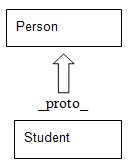{width="1.009653324584427in"
> height="1.397153324584427in"}

### Prototype chaining

In JavaScript, you create new objects from existing objects. This
process is called **prototype chaining**. It is similar to inheritance
in object-oriented systems.

**Description**

Prototype is a property of the **constructor** function. When you add
any object property to a prototype, it will add this property or method
to the objects created by the constructor function. In prototype
chaining, we create a function prototype using the properties of the
**constructor** function. Using this, all methods or properties transfer
to the **prototype** object from the **constructor** function. This
method is very easy and useful for creating the **constructor** function
to create objects. Here is an example:

> **function person(name) { this.name=name;**
>
> **}**
>
> **person.prototype= { sayHi:function() { console.log(&quot;something&quot;);
> }**
>
> **Function student(name) {**
>
> **This.name=name;**
>
> **}**
>
> **}**
>
> **Student.prototype=new Person();**
>
> **Varstd=new student(&quot;Ali&quot;);**
>
> **Std.sayHi();**

In method resolution, first JavaScript checks objects for methods. When
you use prototype chaining, it can override methods for prototypes of an
object. So, the JavaScript construction function sets methods for
objects.

### Constructor stealing

In JavaScript, constructor stealing is also called **classical
inheritance**. This method is use to inherit problems of prototype
reference values.

**Description**

In constructor stealing, we call a super constructor in a subtype
constructor. This idea is quite simple and easy. We use the **call()**
and **apply()** methods for function calling. Here is an example:

> **function super() { this.name=&lbrack;&quot;Ali&quot;&rbrack;;**
>
> **} function sub() { super.call(this); }**
>
> **varstd=new sub(); std.name.push(&quot;Ali&quot;); varstd1= new sub();
> console.log(std1.name);**

In this example, we used the **call()** method to call a super
constructor for a newly created subclass instead of a subconstructor.
This will initialize all objects in the **super()** function on
**sub()**.

> When we use prototype chaining, the **constructor** function will
> allow us to pass arguments from a super constructor to within the
> subconstructor.

### Combination inheritance

Combination inheritance is also called **pseudo-classical inheritance**.
This is a combination of constructor stealing and prototype chaining.

**Description**

In combination inheritance, prototype chaining inherits properties and
methods from a prototype, and constructor stealing inherits instances.
In this way, we can reuse methods on prototypes by allowing methods to
have their own properties. Here is an example:

> **functionSuperType(name) { this.name = name;**
>
> **this.colors = &lbrack;&apos;yellow&apos;, &apos;purple&apos;, &apos;indigo&apos;&rbrack;;**
>
> **}**
>
> **SuperType.prototype.sayName = function() {**
>
> **//console.log(this.name);**
>
> **};**
>
> **functionSubType(name, age) {**
>
> **//inherit properties**
>
> **SuperType.call(this, name); this.age = age;**
>
> **}**
>
> **//inherit methods**
>
> **SubType.prototype = new SuperType();**
>
> **SubType.prototype.sayAge = function() {**
>
> **//console.log(this.age);**
>
> **};**
>
> **varinstance1 = new SubType(&apos;John Doe&apos;, 26);**
>
> **instance1.colors.push(&apos;white&apos;);**
>
> **//console.log(instance1.colors); //&apos;yellow,purple,indigo,white&apos;**
>
> **instance1.sayName(); //&apos;John Doe&apos;; instance1.sayAge(); //26**
>
> **varinstance2 = new SubType(&apos;Kate&apos;, 21);**
>
> **//console.log(instance2.colors); //&apos;yellow,purple,indigo&apos;**
>
> **instance2.sayName(); //&apos;Kate&apos;; instance2.sayAge(); //21**

In this example, the **SuperType** constructor defines two properties:
**name** and **colors**. The **SuperType** prototype has a single method
called **sayName()**. The **SubType** constructor calls the
**SuperType** constructor, passing in the **name** argument, and defines
its own property called **age**. Additionally, the **SubType** prototype
is assigned to be an instance of **SuperType**, and then, a new method
called **sayAge()** is defined. With this code, it&apos;s then possible to
create two separate instances of **SubType** that have their own
properties, including the **colors** property, but all use the same
methods. Addressing the downsides of both prototype chaining and
constructor stealing, combination inheritance is the most frequently
used inheritance pattern in JavaScript. It also preserves the behavior
of **instanceof** and **isPrototypeOf()** to identify the composition of
objects.

### Prototypal inheritance

In prototypal inheritance, we use an object as a base for another
object.

**Description**

In prototypal inheritance, there are no classes, only objects. To create
an object, you can either create a totally new object or you can clone
an existing object. New objects can be then extended with new
properties.

Here is an example:

> **varobject=Object.create(null);**

The preceding object has no prototype and is a clone of **null**:

> **var rectangle = { area: function () {**
>
> **returnthis.width &ast; this.height;**
>
> **}**
>
> **}; varrect = Object.create(rectangle);**

In the preceding example, **rect** inherits the **area** function from
**rectangle**. Here, rectangle is an object literal, an object literal
is a way to create a clone of **Object.prototype**.

It can also be written as follows:

> **var rectangle = Object.create(Object.prototype);**
>
> **rectangle.area = function () { returnthis.width &ast; this.height; };**

We can extend the newly created object as follows:

> **rect.width=50; rect.height=100; console.log(rect.area());**

We can create a **constructor** function that will clone **rectangle**
for us and will extend it with the **height** and **width** properties:

> **var rectangle = {**
>
> **create: function (width, height) { var self = Object.create(this);
> self.height = height; self.width = width; return self;**
>
> **}, area: function () {**
>
> **returnthis.width &ast; this.height;**
>
> **}**
>
> **}; varrect = rectangle.create(50, 100); console.log(rect.area());**

### Parasitic inheritance

Parasitic inheritance is similar to prototypal inheritance.

**Description**

It simply works by creating a function that performs inheritance, object
augmentation, and finally, it returns the object after completing each
task:

> **Function abc(x) {**
>
> **Var clone=obj(abc);**
>
> **Clone.sayHi=function() {**
>
> **}; return clone; }**
>
> **Var student= {**
>
> **Name=&quot;Ali&quot;;**
>
> **};**
>
> **Varstd=new abc(student);**
>
> **Std.sayHi();**

Here, in this example, we have the **abc()** function that has one
argument, which is an object based on a new object. This object is
passed to the **object** function and saves the resulting object into a
**clone** variable. Now, the **clone** object will have a new object
property, and at the end, we return the object.

### Parasitic combination inheritance

A parasite is defined as an organism that lives inside another organism
and relies on its resources. Similarly, in this inheritance, a child
object relies on a parent object and extends its properties from it.

**Description**

The first constructor calls the subtype **prototype** and then it calls
the subtype **constructor**. This is a very efficient way of creating
new objects in JavaScript. At the end, the subtype will have all the
properties of the super type. Here is an example:

> **function super(name) { this.name=&lbrack;&quot;Ali&quot;&rbrack;;**
>
> **}**
>
> **super.prototype.sayHi=function() { console.log(&quot;something&quot;); }**
>
> **function sub(age) { this.age=age; super.call(this,name);**
>
> **}**
>
> **sub.prototype=new super(); sub.prototype.sayHi();**

The only difference between parasitic combination inheritance and
combination inheritance is that, in the former one, the base constructor
is called once, and in the latter one, the base constructor is called
twice.

### Subclasses

In every programming language, every subclass has a super class that
inherits its properties and methods from. JavaScript is not a pure
class-based programming language, but it follows some of the rules of
OOP. We make classes in JavaScript using object notations.

In JavaScript, you can only perform inheritance using the
**constructor** function or prototype. This inheritance is only done at
run time, which means dynamically. Here is an example:

> **// super class functionsuperClass() { this.bye = superBye; //method
> 1 this.hello = superHello; //method 2 }**
>
> **//sub class functionsubClass() {**
>
> **this.inheritFrom = superClass; //inherit-from method defines
> superclass**
>
> **this.inheritFrom(); //inherit from method called this.bye = subBye;
> method 1 overridden in subclass }**
>
> **functionsuperHello() { return &quot;Hello from superClass&quot;; }**
>
> **functionsuperBye() { return &quot;Bye from superClass&quot;; }**
>
> **functionsubBye() { return &quot;Bye from subClass&quot;; }**

To run the preceding code execute following method:

> **functionprintSub() { varnewClass = new subClass();
> console.log(newClass.bye()); console.log(newClass.hello());**
>
> **}**

## Built-in objects

To add flexibility in language, JavaScript supports a number of built-in
objects. The most commonly used objects are:

-   Global

-   Date

-   Math

-   RegExp (Regular Expression)

-   Array

Implementations of these built-in objects are complex and different.

### Global objects

Global objects are objects defined outside the function. Every function
can access these variables because their scope is global for all.

When you do not declare a variable and assign a value to it, then it
will automatically become global.

**Description**

When your code starts execution, functions and constants immediately
become available. A global variable does not initialize with the **new**
keyword. Basically, global objects are used to share same data to add
properties. You can store methods within global objects in your script.

Objects that you cannot access directly for accessing those object we
use global objects. We pass those object directly as arguments after
declaring the global variable. You can create a number of instances and
a number of global objects in your script.

A global object has a fixed number of properties. Multiple object
instances can access this global object. Here is an example:

> **varstudentName=&quot;Ali&quot; functionmyStd(){ }**
>
> **student=new Global(&quot;name&quot;); student.age=18; person=new
> Global(&quot;name&quot;); post(person.age);**

### Date object

Date objects in JavaScript deal with date and time objects. For example,
if we are writing a script and we need some functionality of date and
time, then we can use this built-in object simply.

#### getTime()

This function is used to get the current time with respect to the number
of milliseconds since January 1, 1970.

**Parameters**

There are no parameters passed.

**Returns**

The number of milliseconds since January 1, 1970.

##### Description

As the name states, this function is used to obtain the current time, in
the form of milliseconds. We need to create a date object first.

> **var time = new Date();**
>
> **time.getTime(); // This will output time as 1454905019871**

#### getMilliseconds()

This function is used to get the current time with respect to the number
of milliseconds.

**Parameters**

There are no parameters passed.

**Returns**

A number from 0-999.

##### Description

As the name states, this function is used to obtain the current time, in
the form of milliseconds. We need to create a date object first.

> **var time = new Date(); time.getMilliseconds();**

#### getMinutes()

This function is used to get the current time with respect to the number
of minutes.

**Parameters**

There are no parameters passed.

**Returns**

A number from 0-59.

##### Description

This function is used to obtain the current time, in the form of
minutes. We need to create a date object first.

> **var time = new Date(); time.getMinutes();**

#### getHours()

This function is used to get the current time with respect to the number
of hours.

**Parameters**

There are no parameters passed.

**Returns**

A number from 0-23 with 0 being midnight.

##### Description

This function is used to obtain the current time, in the form of hours.
We need to create a date object first.

> **var time = new Date(); time.getHours();**

#### getDate()

This function is used to get the current day.

**Parameters**

There are no parameters passed.

**Returns**

A number from 1-31.

##### Description

This function is used to obtain the current day. We need to create a
date object first.

> **var time = new Date(); time.getDate();**

#### getDay()

This function is used to get the current day in the week.

**Parameters**

There are no parameters passed.

**Returns**

A number from 0-6 with 0 being Sunday.

##### Description

This function is used to obtain the current day in the week. We need to
create a date object first.

> **var time = new Date(); time.getDay();**

#### getMonth()

This function is used to get the current month.

**Parameters**

There are no parameters passed.

**Returns**

A number from 0-11.

##### Description

This function is used to obtain the current month in the year. We need
to create a date object first.

> **var time = new Date(); time.getMonth();**

#### getFullYear()

This function is used to get the current year.

**Parameters**

There are no parameters passed.

**Returns**

The year in the YYYY format.

##### Description

This function is used to obtain the current year. We need to create a
date object first.

> **var time = new Date(); time.getYear();**

**Set date methods**

Methods are available in date objects to manipulate dates. We can also
adjust the date dynamically. Here is an example:

> **var dob=new date(); dob.setDate(19.03.1990);**

We can also set upcoming dates and the current date by using this
function, for example:

> **var dob=new date(); dob.setDate(dob.getDate + 7);**

The date set methods are:

-   **setTime()**

-   **setMilliseconds()**

-   **setMinutes()**

-   **setMinutes()**

-   **setHours()**

-   **setDate()**

-   **setDay()**

-   **setMonth()**

-   **setFullYear()**

These methods are very similar to the date get methods described in the
preceding term list.

We can also compare dates using the date object.

### Math object

In JavaScript, the math object is used to perform mathematical
operations.

This object has several mathematical functions. Here is an example:

-   **Math.E**

-   **Math.PI**

-   **Math.sqrt**

-   **Math.Ln2**

-   **Math.ln10**

The **math** object has different methods. For example, we have the
**pow** method that calculates the power of the first variable times the
second.

> **Math.pow(base, exponent);**
>
> **document.write(Math.pow(2,4)); // 16 here 2 is base and 4 is
> exponent.**

#### min()

This function is used to find out the the argument with the minimum
value.

**Parameters**

The values to be evaluated are passed as parameters.

**Returns**

The argument with the minimum value.

##### Description

As the name suggests, this function is simply used to obtain the minimum
value among all values in an argument

For example:

> **min(10, 56, 3, 26, -6, 4); //The value returned is -6**

#### max()

This function is used to find the argument with the maximum value.

**Parameters**

The values to be evaluated are passed as parameters.

**Returns**

The argument with the maximum value.

##### Description

As the name suggests, this function is simply used to obtain the maximum
value among all values in an argument.

For example:

> **max(10, 56, 3, 26, -6, 4); //The value returned is 56**

#### random()

This function is used to generate a random number between 0 and 1.

**Parameters**

No parameters.

**Returns**

A random number between 0 and 1.

##### Description

The **random()** function is useful in generating random numbers. The
value of the number will always lie between 0 and 1 (never exactly 1).
For example:

> **Math.random();**

#### round()

This function is used to round the number to its nearest integer value.

**Parameters**

The values to be evaluated are passed as parameters.

**Returns**

The rounded number.

##### Description

This method is used to create integer values after rounding them.

For example:

> **Math.round(4.3);// The value returned is 4**
>
> **Math.round(4.8);// The value returned is 5**
>
> **Math.round(4.5);// The value returned is 5**

#### ceil()

This function is used to round a number up to the nearest and highest
possible integer value.

**Parameters**

The values to be evaluated are passed as parameters.

**Returns**

The highest rounded number.

##### Description

This method is used to create integer values after rounding them to the
higher integer.

For example:

> **Math.ceil(-6.2);// The value returned is -6**
>
> **Math.ceil(6.2);// The value returned is 7**

#### floor()

This function is used to round a number down to the nearest and lowest
possible integer value.

**Parameters**

The values to be evaluated are passed as parameters.

**Returns**

The lowest rounded number.

##### Description

This method is used to create integer values after rounding them to the
lower integer.

For example:

> **Math.floor(2.3);//The value returned is 2**
>
> **Math.floor(-2.3);//The value returned is -3**

### The RegExp object

In JavaScript, for pattern matches in string, we use a regular
expression. It is a very powerful and useful tool for expression pattern
matching.

**Parameters**

The following are the parameters:

-   **Pattern**: The text/pattern of the regular expression

-   **Flags**: If specified, flags can have any combination of the
    following:

> ° **g**: Global match
>
> ° **i**: Ignore case
>
> ° **m**: Multiline; treat beginning and end characters (**\^** and
> **&dollar;**) as working over multiple lines (that is, match the beginning
> or end of each line (delimited by **&bsol;n** or **&bsol;r**), not only the
> very beginning or end of the whole input string)

**Returns**

The return type of different regular expressions is different.

**Description**

Using a regular expression, you can make a complex task simple by
writing few lines of codes. There are five methods in JavaScript:

-   **RegExp.exec(pattern)**

-   **RegExp.replace(pattern)**

-   **RegExp.split(pattern)**

-   **RegExp.match(pattern)**

#### Defining a regular expression

There are two ways of writing a regular expression in JavaScript. These
are:

-   RegExp constructor method

-   Literal syntax

> There are differences between the **RegExp** object and global object.
> They look the same but act differently.

#### RegExp constructor

This method is used to dynamically construct a string search pattern. A
regular expression in this method should be written in quotation marks.
This method has three parameters. Here is an example: **var email=new
RegExp(&quot;&bsol;d{2},&quot;g&quot;);**

In this example:

-   E-mail is a required parameter to which regular expression values
    are assigned

-   **&bsol;d** is a pattern parameter used to match regular expression

-   **g** is global, which is a flag parameter. In this function, there
    are four types of parameters (**g**, **I**, **m** ,**u**).

#### Literal syntax

In literal notation, we write a regular expression without brackets.
Here, **i** is a flag that shows to ignore case of the text whether it
is uppercase, lowercase or any other. We have more flag objects such as
the following ones:

-   **g**: Global object

-   **i**: Ignore case

-   **m**: Multi search

-   **u**: Unicode search

In regular expressions, we can have a global regular expression object,
which will have information for each match case. A simple regular
expression object has information about a particular regular expression:
**var exp=&bsol;d{2}/i**

### String object

There are four string methods for pattern matching. In these objects, a
pattern is sent with a parameter. These methods allow you to search,
match, replace, and split patterns.

These methods are represented as follows.

#### Match(pattern)

This method is used to find a matching pattern within a string. Using
the **not** (**!**) operator it can also be used to find non-matches.

The syntax is **string.Match(Expression)**.

**Parameters**

The string pattern that is to be matched.

**Returns**

It returns the result if a match is found or **0** or **null** if no
match is found.

##### Description

This runs a search for matching strings in a regular expression. If the
search is matched or successful then it will return an array of matching
results, if not then it will return **null** or **0**. It is also used
to update properties in a regular expression.

Here is an example:

> **var str=(&quot;I have 10 dollars&quot;);**
>
> **//The pattern below is used to find non-digits in a string var
> parsestring= str.match(/&bsol;D/g); // Outputs I, ,h,a,v,e, ,
> ,D,o,l,l,a,r,s**

#### Replace(pattern)

This method is used to replace a part of the string.

The syntax is **string.replace(stringSearched, stringReplacement)**.

**Parameters**

The string pattern that is to be replaced is passed as a parameter.

**Returns**

The string with the replaced value.

##### Description

This executes a search and is used for replacement of regular expression
match resulted with alternative text. This is also used for replacement
of regular expressions with specific and different **regExp**
properties.

Here is an example:

**var str1=(&quot;Apple Pie&quot;); var parsestring1=str1.replace(&quot;Pie&quot;,
&quot;Cinnamon Roll&quot;);** Here the value of **parsestring1** is **Apple
Cinnamon Roll**.

> Remember here that the search is case sensitive, so if you provide
>
> the value **parsestring1=str1.replace(&quot;piE&quot;, &quot;Cinnamon Roll&quot;);**
> then no replacement is done.

Also, only the first occurrence of the pattern is replaced. Hence:

> **var str1=(&quot;Apple Pie , Banana Pie&quot;, &quot;Strawberry PIE&quot;); var
> parsestring1=str1.replace(&quot;Pie&quot;, &quot;Cinnamon Roll&quot;);**

Here the value of **parsestring1** is **Apple Cinnamon Roll**, **Banana
Pie**, **Strawberry PIE**.

To perform a global search and replacement so that all occurrences are
replaced we use the following code:

> **var str1=(&quot;Apple Pie , Banana Pie&quot;, &quot;Strawberry PIE&quot;); var
> parsestring1=str1.replace(/Pie/g, &quot;Cinnamon Roll&quot;);**

Here the value of **parsestring1** is **Apple Cinnamon Roll**, **Banana
Cinnamon Roll**, **Strawberry PIE**.

For a global insensitive search, use the following code:

> **var str1=(&quot;Apple Pie , Banana Pie, &quot;Strawberry PIE&quot;); var
> parsestring1=str1.replace(/Pie/gi, &quot;Cinnamon Roll&quot;);**

Here the value of **parsestring1** is **Apple Cinnamon Roll**, **Banana
Cinnamon Roll**, **Strawberry Cinnamon Roll**.

#### Split(pattern)

This is use to split a string in a regular expression.

The syntax is **string.split(separator,limit)**.

**Parameters**

A separator and limit are provided as optional parameters.

**Returns**

The split string is returned.

##### Description

With this method the string is split. Every word in the string is
treated as a single element in an array. If a null string is passed as a
parameter, the method causes each letter to be split into different
characters. For example:

> **var str1 = &quot;My Car is at the garage in Queens&quot;; var parseString =
> str1.split(&quot;&quot;);**

The value of **parseString** will be:

> **M,y, ,C,a,r, ,i,s, ,a,t, ,t,h,e, ,g,a,r,a,g,e, ,i,n, ,Q,u,e,e,n,s**

Providing a limit will return a comma separated array of the words
containing only the specified number of elements. For example:

> **var str1 = &quot;My Car is at the garage in Queens&quot;; var parseString =
> str1.split(&quot; &quot;, 3);**

The value of **parseString** is **My,Car,is**.

Using a letter or letters as a separator will give the following
results:

**var str1 = &quot;My Car is at the garage in Queens&quot;; var parseString =
str1.split(&quot;a&quot;);** The value of **parseString** will be:

> **My C,r is ,t the g,r,ge in Queens**

Here is another example:

**var str1 = &quot;My Car is at the garage in Queens&quot;; var parseString =
str1.split(&quot;ar&quot;);** The value of **parseString** will be:

> **My C, is at the g,age in Queens**

#### search(pattern)

This method is used to search for a particular string.

The syntax is **string.search(stringSearched)**.

**Parameters**

The string pattern that is to be searched is passed as a parameter.

##### Returns

It returns the position of the starting letter of the string if a match
is found. If no match is found then it returns **-1**.

##### Description

It is used to find a match in a string. If a match is found it will send
an index of that match otherwise, if a match is not found, it will
return **-1**. Global flags are not supported by this method.

Here is an example:

**var str1=(&quot;I have 10 dollars in my pocket&quot;); var
parsestring=str1.search(&quot;i&quot;);** The value of **parseString** here is
**18**.

> There are additional string methods available to perform other tasks
> on strings.
>
> A detailed list of these methods can be found at [**https://msdn.**
> **microsoft.com/en-us/library/ecczf11c(v=vs.94).aspx**](https://msdn.microsoft.com/en-us/library/ecczf11c(v=vs.94).aspx).

### Array objects

An array is a collection of objects.

To create an array in JavaScript, the elements of the collection are
enclosed within square brackets and separated by commas, as seen here:

> **varcolors = &lbrack;&quot;red&quot;, &quot;yellow&quot;, &quot;blue&quot;&rbrack;**

An array can also be initialized using the **new** keyword or by
specifying their length between 0 and 232-1:

> **new array(first, second, third, ... ) new array(7) // creates an
> array of size 7**

To access array elements, we can use an index notation:

> **varlastColor = colors&lbrack;2&rbrack;; // blue**

Always remember that array elements always start with the zero index.
Hence, the third element in the preceding array has the index of **2**.

Array objects can hold all sorts of data, for example, strings, numbers,
literals, dates, and even user-defined objects.

#### .Pop()

This method is used to *pop* an element out of an array.

**Parameters**

There are no parameters for this method.

**Returns**

It returns the *popped* element of the array.

##### Description

Here an array is considered as a stack and the elements that are last in
the array are popped out first. This follows the LIFO principle.

Here is an example:

> **var sweets = &lbrack;&quot;Red Velvet&quot;, &quot;Chocolate Mousse&quot;, &quot;Strawberry**
>
> **Delight&quot;, &quot;Pineapple Sundae&quot;, &quot;Black Forest&quot;&rbrack;; var element=
> sweets.Pop();**

The value of the element here is **Black Forest**.

#### .Push()

This method is used to *push* an element into an array.

**Parameters**

There are no parameters for this method.

**Returns**

It returns the new length of the array.

##### Description

Here an array is considered as a stack and the elements that are pushed
appear at the end of the array.

Here is an example:

> **var sweets = &lbrack;&quot;Red Velvet&quot;, &quot;Chocolate Mousse&quot;, &quot;Strawberry**
>
> **Delight&quot;, &quot;Pineapple Sundae&quot;, &quot;Black Forest&quot;&rbrack;; var element=
> sweets.Push(&quot;Lemon Meringue&quot;);**

The value of the element here is **6**.

#### .ToString()

This converts the elements in an array into a string. The elements
appear as commaseparated strings.

**Parameters**

There are no parameters.

**Returns**

This returns a string containing the elements of the array.

##### Description

The **ToString()** function is used to convert an array into a string.
The elements of the array appear in the string and are separated by a
comma:

> **var sweets = &lbrack;&quot;Red Velvet&quot;, &quot;Chocolate Mousse&quot;, &quot;Strawberry**
>
> **Delight&quot;, &quot;Pineapple Sundae&quot;, &quot;Black Forest&quot;&rbrack;; var StrSweets=
> sweets.ToString()**

Here the value of **StrSweets** is:

> **Red Velvet,Chocolate Mousse,Strawberry Delight,Pineapple**
>
> **Sundae,Black Forest**

#### .ValueOf()

This method is also used to convert an array into a string.

**Parameters**

There are no parameters.

**Returns**

This returns a string containing the elements of the array.

##### Description

This is default behaviour of the array and works same as the
**ToString()** function.

> **var sweets = &lbrack;&quot;Red Velvet&quot;, &quot;Chocolate Mousse&quot;, &quot;Strawberry**
>
> **Delight&quot;, &quot;Pineapple Sundae&quot;, &quot;Black Forest&quot;&rbrack;; var StrSweets=
> sweets.ValueOf()**

Here the value of **StrSweets** is:

> **Red Velvet,Chocolate Mousse,Strawberry Delight,Pineapple**
>
> **Sundae,Black Forest**

#### .Join()

This method is used to convert an array into a string. The elements are
separated by the delimiter specified.

**Parameters**

A separator to separate the elements in the new string.

##### Returns

This returns a string containing the elements of the array separated by
the delimiter specified.

##### Description

The **Join()** function is used to convert an array into a string. The
elements of the array appear in the string and are separated by the
delimter:

> **var sweets = &lbrack;&quot;Red Velvet&quot;, &quot;Chocolate Mousse&quot;, &quot;Strawberry**
>
> **Delight&quot;, &quot;Pineapple Sundae&quot;, &quot;Black Forest&quot;&rbrack;; var StrSweets=
> sweets.Join(&ast;)**

Here the value of **StrSweets** is:

> **Red Velvet &ast; Chocolate Mousse &ast; Strawberry Delight &ast; Pineapple**
>
> **Sundae &ast; Black Forest**

#### .Splice()

Splice, as the name suggests, is used to add new elements into the
array. Unlike the **push()** method we can add elements in whichever
position we want.

##### Parameters

The following are the parameters:

-   Position

-   Number of elements to be removed

-   Elements to be added

**Returns**

The array as a string along with the new elements, if any.

##### Description

This method is used to remove and add elements in one step. We can
specify where the new element is to be added and which elements are to
be removed.

> **var sweets = &lbrack;&quot;Red Velvet&quot;, &quot;Chocolate Mousse&quot;, &quot;Strawberry**

**Delight&quot;, &quot;Pineapple Sundae&quot;, &quot;Black Forest&quot;&rbrack;; var StrSweets=
sweets.splice(2, 0, &quot;Lemon Meringue&quot;);** Here the value of
**StrSweets** is:

> **Red Velvet,Chocolate Mousse,Lemon Meringue,Strawberry**
>
> **Delight,Pineapple Sundae,Black Forest**

#### .sort()

This method is used to sort an array into alphabetical order.

**Parameters**

No parameters.

**Returns**

The sorted array is returned.

##### Description

The sort method is used to sort an array, alphabetically.

Here is an example:

> **var sweets = &lbrack;&quot;Red Velvet&quot;, &quot;Chocolate Mousse&quot;, &quot;Strawberry**
>
> **Delight&quot;, &quot;Pineapple Sundae&quot;, &quot;Black Forest&quot;&rbrack;; var StrSweets=
> sweets.Sort();**

Here the value of **StrSweets** is:

> **Black Forest,Chocolate Mousse,Pineapple Sundae,Red**
>
> **Velvet,Strawberry Delight**

#### .reverse()

As the name suggests it reverses the order of the array.

**Parameters**

No parameters.

**Returns**

The reversed array is returned.

##### Description

The reverse method is used to sort an array, alphabetically, in reverse
order.

Here is an example:

> **var sweets = &lbrack;&quot;Red Velvet&quot;, &quot;Chocolate Mousse&quot;, &quot;Strawberry**
>
> **Delight&quot;, &quot;Pineapple Sundae&quot;, &quot;Black Forest&quot;&rbrack;; var StrSweets=
> sweets.reverse();**

Here the value of **StrSweets** is:

> **Strawberry Delight,Red Velvet,Pineapple Sundae,Chocolate**
>
> **Mousse,Black Forest.slice()**

#### .slice()

As the name suggests, this method is used to slice up an array and
create a new array using a part of the original array.

##### Parameters

The index at which we want the array sliced. The index of an array
begins at **0**. So the first element has index **0**, the second
element has index **1**, and so on.

**Returns**

The sliced array containing the remaining elements is returned.

##### Description

The slice method is used to slice up an array and get the remainder of
the array as a string.

Here is an example:

> **var sweets = &lbrack;&quot;Red Velvet&quot;, &quot;Chocolate Mousse&quot;, &quot;Strawberry**
>
> **Delight&quot;, &quot;Pineapple Sundae&quot;, &quot;Black Forest&quot;&rbrack;; var StrSweets=
> sweets.slice(3);**

Here the value of **StrSweets** is:

> **Pineapple Sundae,Black Forest**

#### .concat()

This method is used to concatenate two or more arrays into a single
array.

**Parameters**

The array to be concated is passed as the parameter.

**Returns**

This method returns the concated array.

##### Description

The **Concat()** method is used to create a single array by joining two
or more arrays.

Here is an example:

> **var greenShades= &lbrack;&quot;Mint&quot;, &quot;Basil&quot;, &quot;Pine&quot;, &quot;Emerald&quot;&rbrack;; var
> BlueShades=&lbrack;&quot;Azure&quot;, &quot;Cerulean&quot;, &quot;Navy&quot;, &quot;Aegan&quot;&rbrack;; var
> VioletShades= &lbrack;&quot;Lilac&quot;, &quot;Orchid&quot;, &quot;Mauve&quot;, &quot;Wisteria&quot;&rbrack;; var
> CoolShades=greenShades.concat(BlueShades, VioletShades);**

Here the value of **CoolShades** is:

> **Mint,Basil,Pine,Emerald,Azure,Cerulean,Navy,Aegan,Lilac,Orchid,**
>
> **Mauve,Wisteria**

# Extending JavaScript and ECMAScript 6

ECMA 262 is a standard that defines the core features of the JavaScript
language. The language that is defined by this standard is called
**ECMAScript**. JavaScript is an implementation of ECMAScript. It runs
in web browsers at the client end, while Node.js runs at the server end.
ECMAScript 6 was released in June 2015. ES6 is a major update from ES5,
which was released in 2009.

A complete language specifications draft of ES6 language specifications
can be obtained from
[**https://people.mozilla.org/\~jorendorff/es6-draft.html**.](https://people.mozilla.org/~jorendorff/es6-draft.html)

## Compatibility and goals

The ES6 compatibility chart shows which features of ES6 are supported in
the current browsers. It also links all listed features to their
specification guides.

It should be noted that some of the features might not be under
compliance with their exact specifications. While working in Chrome,
don&apos;t forget to enable the Experimental JavaScript flags.

> 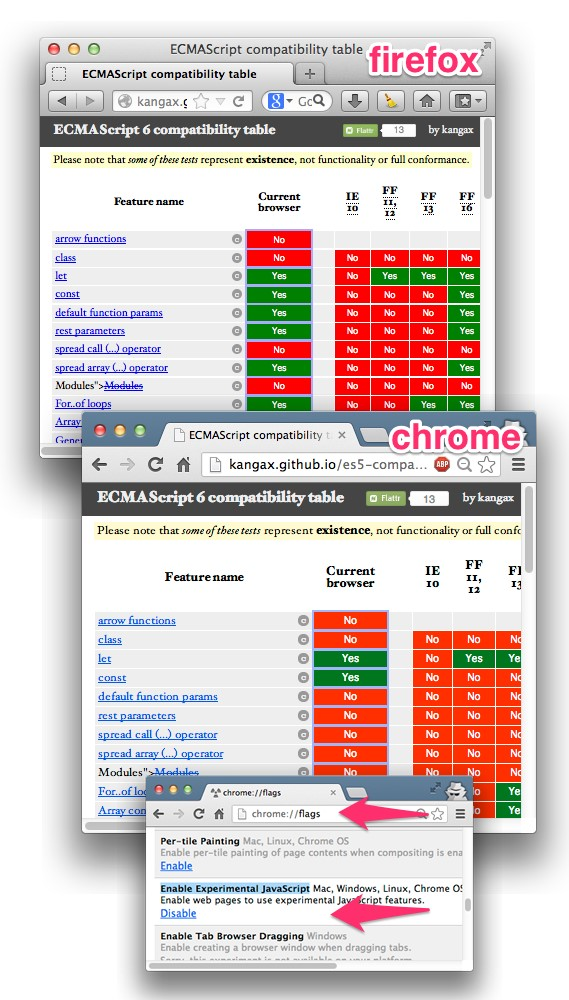{width="3.574004811898513in"
> height="6.28120406824147in"}
>
> Reference: Use ECMAScript 6 Today

ECMA6 script has the following major goals:

-   Default exports

-   Static structure of modules

-   Support for asynchronous and synchronous loading

-   Used for dependencies between modules

## JavaScript subset and extensions

Subsets are mostly defined for security purposes; scripts written using
secure language subsets can be executed safely even if its source is
untrusted, for instance, an ad server. Some of these subsets will be
described later.

As JavaScript continued to evolve and allowed explicit extensions, newer
versions were released. Many of the features were standardized. These
extensions are compatible with modern browsers such as Firefox and
Chrome. However, the implementation of non-standard extensions may
require an external compiler because these features are being updated in
major JavaScript engines now.

### JavaScript subsets

As stated earlier, for execution security of untrusted code, we use
subsets in JavaScript. For example, when we have a credit card checking
script in which a credit card number is sent to a remote server, then
for this type of information security, we use subset. By defining a
subset, we check the behavior of a program that we have strictly not
allowed. So, it means that we use subsets for a certain amount of code,
and the other part of the code is omitted.

There are two goals of a JavaScript subset:

-   The subset construct should be added to maximize coverage use of
    JavaScript constructs

-   It is used to extend analysis to accommodate changes

These subset are defined for every reason.

**The good parts**: This is a subset that is part of the language used
for the best and the worthy part of the script. The main goal of this
subset is it purifies and simplifies code, and makes the script easier
and more understandable. The good parts subset does not have an
**eval()** function. It also eliminates the **continue** and **with**
statements. It does not include function definition statements, and only
defines function using the function definition expression. Using a
function definition statement, it defines a function, and then, after
defining the function, it does not use the function definition
statement.

> In subset curly brackets, we have a body of loops and conditional
> statements. If there is a single statement in the body, then it would
> not allow the brackets to be omitted.

**Secure subsets**

There are various implementations of secure subsets. Some of them are
briefly described here.

#### ADsafe

**ADsafe** ([**http://www.adsafe.org/**)](http://www.adsafe.org/) was
one of the first presented security subjects.

It was proposed and created by Douglas Crockford. ADsafe uses tools such
**asJSLint** ([**http://www.jslint.com/**)](http://www.jslint.com/) to
verify the unsafe code. It enforces good programming practices, so the
likelihood of unsecure code executing correctly is much higher. It
blocks the script from accessing the global variables or accessing the
DOM directly. Instead, it allows the script to access the ADsafe object,
which provides access to a secure API and indirect access to the DOM
elements. ADsafe does not alter scripts and has no impact on its
functionality. It enables us to determine quickly whether the script is
safe to be placed on a page. It also works as a base that helps in the
development of other secure subsets.

#### Dojox

The **dojox.secure** tool
([**https://dojotoolkit.org/reference-guide/1.10/**
**dojox/secure.html**](https://dojotoolkit.org/reference-guide/1.10/dojox/secure.html))
is a security subset inspired from ADsafe. It is an extension of the
**Dojo** toolkit ([**http://dojotoolkit.org**](http://dojotoolkit.org/))
and was developed by Kris Zyp. It is fully packed with components that
ensure safe execution and loading of untrusted code, content, ads, and
widgets from a different domain. It provides a sandbox environment and
limited DOM elements for interaction:

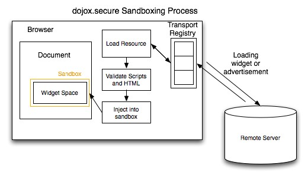{width="4.881048775153106in"
height="2.8159897200349957in"}

**Caja**
([**https://developers.google.com/caja/**)](https://developers.google.com/caja/)
is an open source secure subset powered by Google. Caja (which means
&quot;**box**&quot; in Spanish) further defines two subsets:

-   **Cajita** (which means &quot;**small box**&quot; in Spanish) is a narrow
    subset just like ADsafe and dojox.secure

-   **Valija** (which means &quot;**suitcase**&quot; in Spanish) is a broader
    subset and is much more similar to ECMAScript in strict mode (with
    the **eval()** method removed)

Caja is a compiler tool that transforms third-party content such as
HTML, CSS, and JS into secure code, which is then easy to embed in a
website.

#### FBJS

**FBJS**
([**https://github.com/facebook/fbjs**)](https://github.com/facebook/fbjs)
is a JavaScript secure subset used by Facebook. It allows untrusted code
to be executed in a secure environment. It transforms code to ensure
security. During the transformation, all top-level identifiers are
renamed by adding the module-specific prefix. Adding module specific
prefix prevents querying any global identifiers. For example, you are
developing an app having the **xyz123** ID, and there is a **foo()**
function in the code. It will eventually become **xyz123_foo()**. Even
function calls to **eval()** are redirected to a non-existent function.

#### Microsoft&apos;s web sandbox

Microsoft&apos;s **Web Sandbox**
([**http://www.websandbox.org/**](http://www.websandbox.org/)) defines a
broad secure subset of JavaScript, HTML, and CSS. Sandbox implements
host virtualization to provide security and extensibility. The untrusted
code is executed in a virtual machine instead of running directly in a
browser. A virtual machine quarantines the untrusted code, which
prevents it from interacting with the elements outside the virtual
machine. Let&apos;s take a look at the following block diagram:

> 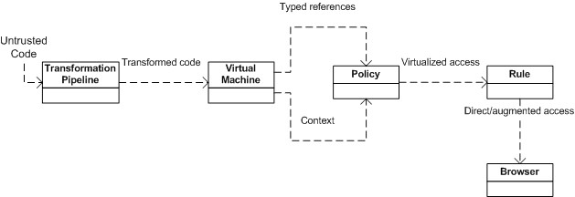{width="5.398747812773403in"
> height="1.8539424759405074in"}

### JavaScript extensions

Lots of new and useful features have been coded. They will be
standardized with the release of ES6. ES6 was set to be officially
released in June 2015. However, many of the features and extensions are
already available on Firefox and Chrome (Experimental JavaScript flag
has to be turned *on* in order to access some of the ES6 features). We
will discuss the major features in the rest of the chapter.

### Const

It works like variable keyword **var**. For declaring a constant, we use
the word **const**.

In order to use assignment we must declare constant.

> Values declared with the const can not be redeclared, redefined or
> reinitialized. JavaScript provide 8 constants through math object. One
> of them is PI. we can not reinitialize PI using const.

### Let

The **Let** keyword is used for the block scoping of variables. The
variables are declared at the start of the code instead of at the start
of functions:

> **var name = &quot;john&quot;; console.log(name);**

In the preceding example, the name **john** is the value of name logged
in console. The declarations in JavaScript are moved to the top. The
position of the variables declared or initialized in the scope of the
function does not matter, and they will be hoisted to the top by
default. JavaScript&apos;s default conduct is to move variable declarations
to the top.

Hoisting is JavaScript&apos;s default behavior to move variable declarations
to the top.

Variables in JavaScript are function scoped. This means, variables are
available throughout the function, even if they are declared in a nested
code block. Here is a short example in which we will log the output in
the console of our client, that is, Chrome, Firefox, and so on:

> **var name = &quot;john&quot;;**
>
> **(function () {**
>
> **// var name = undefined; if (!name)**
>
> **{ var name = &quot;jane&quot;; } console.log(name); // &quot;jane&quot; }());**

From the preceding example, the value of name used to log-in into the
console is **jane**.

ES6 handles this issue with let. Let is very much like **var**. The only
difference is that **let** is block scoped, and **var** is function
scoped. We can rewrite the previous example using let, as shown here:

> **var name = &quot;john&quot;;**
>
> **(function () {**
>
> **// var name = undefined; if (!name) { let name = &quot;jane&quot;;**
>
> **}**
>
> **console.log(name); // &quot;john&quot;**
>
> **}());**

Notice that although the value of name is **jane** inside the function,
using the **let** keyword sets its scope to global and the value of name
defaults to **john**. Hence, **john** is logged in the client&apos;s
console.

> If we declare a variable as a constant, assign it some value, use the
> same constant somewhere else that changes its value, then its new
> value will be ignored. Like variables, we can add constants anywhere
> in our script without breaking our code.

**Destructuring assignment**

We can assign multiple values to the variables in a function using one
command.

### For each

The iteration of property value is done using this loop. The iteration
of property name is done.

### Iterator

The object for the next method is returned. The object that is returned
has **&lowbar; iterator&lowbar;** property. The iterator is used for **iteratable**
objects.

### Generators

The generation of object is done here. A generated object is returned
whenever a function invokes the **this** method. The **yield** keyword
is used. The current execution of the function is specified by the
generated object.

### Array

The **iteratable** objects with the same values in the array are
shorthanded by the use of array.

### Generator expression

The functions are shorthanded for multiple **try-catch** expressions.
The thing that is returned is the generated object wrapped in **{}** and
not in **&lbrack;&rbrack;**. We use this for multiple values to variables in the
function.

## Scoped variables and constants

When we declare a variable, then it has a local scope and a global
scope. We can define a variable anywhere in our script. When we declare
a variable in JavaScript, we can assign a value to it at the time of
declaration or later. Here is an example:

> **&lowbar;xyz123; // variable declared without assigning a value to it
> varabc = &quot;Star&quot;; //variable declared while assigning a value to it**

In JavaScript, a variable is defined by a dollar sign the same as in
query. In JavaScript, we create variables dynamically using the **var**
keyword. Every variable has a name and a value associated with it. These
values can be of any type, such as **number**, **array**, **string**,
and so on. A variable name could be a combination of characters and
numbers. Here is an example:

> **(a==undefined){ a=5}**

A variable that is declared outside a function is a **global variable**
having a global scope. This means that it can be accessed from anywhere
within a script.

We can also declare a variable constant with the **const** keyword. A
constant variable value is constant.

Constants can be defined using the **const** keyword as shown here:

> **Const a=5;**
>
> The **const** and **let** keywords work in a similar way that they
> both are block scoped. However, in the case of **const**, values
> cannot be redeclared, redefined, or reinitialized. In short, const
> values are read-only.

Here is a working example: **const PI = 3.14159265359;
console.log(&quot;value of PI = &quot; + PI); //value of PI = 3.14159265359 PI =
3.1415; //&lt;&hyphen;&hyphen;&hyphen;&hyphen;&hyphen;&hyphen;- Can not re-assign value to PI
console.log(&quot;value of PI = &quot; + PI); //value of PI = 3.14159265359
const PI = 2.0312; //&lt;&hyphen;&hyphen;&hyphen;&hyphen;&hyphen;&hyphen;- Can not re-initialize value of PI
console.log(&quot;value of PI = &quot; + PI); //Uncaught TypeError: Identifier
&apos;PI&apos; has already been declared var PI = 9.2144; //&lt;&hyphen;&hyphen;&hyphen;&hyphen;&hyphen;&hyphen;- Can
not re-declare value of PI**

> **console.log(&quot;value of PI = &quot; + PI); //Uncaught TypeError:
> Identifier &apos;PI&apos; has already been declared.**

The **class** variables are declared in the class but not within methods
of any class, whereas the local variable exits within the methods of any
class.

## Shorthand functions

Shorthand function, also known as **expression closure**, is a technique
to use simple functions in JavaScript. It is used to omit a function&apos;s
curly brackets in the event; it returns a **true** or **false**
statement. Similarly, if you omit the **return** keyword, it would also
send you the exact same result.

The expression will be evaluated quickly after the argument list in your
script by omitting the curly brackets and the **return** keyword.

Here is an example:

> **Let student=function(a)**
>
> **A+1, yes**
>
> **Function()**
>
> **True,no**

This behaves similarly like functions. They are defined with curly
brackets and a **return** statement. This is very useful when we want to
pass a function as an argument to a function.

## Multiple catch clauses

In JavaScript, **try/catch** statements are use to handle exceptions
present in the **try** code blocks.

### The try clause

In the **try** block, the statements to be evaluated are executed.

> If you want to deliberately throw an exception, we would use the
> **throw** statement. This will abort the execution of the remaining
> statements, and the control will move to the **catch** block.

### The catch clause

After checking and encountering an error in the statements in the
**try** block, the exception block is called. If the exception
encountered is the same as the exception handled in the **catch** block,
then the control immediately shifts to the **catch** block, and the
statements within the **catch** block are executed.

The statements presented after the erroneous statement will *not* be
executed, unless there is a **return** statement in the **finally**
block.

> A good practice is to use a conditional catch clause first if we
> anticipate that any exception will occur. An unconditional catch
> clause is placed last to handle all the remaining exceptions: **try
> {**
>
> **demotrycatchfunction(); // may throw any type of exceptions**
>
> **} catch (e) {**
>
> **if (e instanceofReferenceError) {**
>
> **// statements to handle ReferenceErrorexceptions**
>
> **} else if (e instanceofSyntaxError**
>
> **) {**
>
> **// statements to handle SyntaxError exceptions**
>
> **}**
>
> **else if (e instanceofEvalError) {**
>
> **// statements to handle EvalError exceptions**
>
> **} else {**
>
> **// statements to handle any unspecified exceptions logMyError(e); //
> pass the exception object to the error handler**
>
> **}**
>
> **}**

### The finally clause

This block will execute statements present within at end, whether an
exception has occurred or not. The statements in a **finally** block
execute irrespective of whether an error occurred. The **finally** block
generally contains code that must be executed regardless of anything.
Hence, we generally release resources and close connection inside a
**finally** block. The syntax for writing a simple **try-catch-finally**
block is as follows:

> **try {**
>
> **//try code - This is the Code block to try**
>
> **}**
>
> **catch(error) {**
>
> **//catch code -- This is the Code block that handle errors**
>
> **} finally {**
>
> **//finally code - This is the Code block to be executed regardless of
> try catch results }**

We can also write this with a nested **catch** blocks like this:

> **try {**
>
> **//do something**
>
> **}**
>
> **catch (Exception e) { try {**
>
> **//do something with little likeliness of output**
>
> **}**
>
> **catch (Exception ex) { try {**
>
> **//do the minimum acceptable**
>
> **}**
>
> **catch (Exception e1) { //More try catches?**
>
> **}**
>
> **}**
>
> **}**

Here is an example showing the working of multiple **catch** clauses:

> **functionCheckEligibility(Age) { var result; try { //try block**
>
> **if (Age &lt; 16 { //condition to be tested throw new Error(&quot;Children
> below the age of 16 are not allowed.**
>
> **Parent Supervision needed!&quot;); //incase of false result, an error
> will be raised**
>
> **} result = age;**
>
> **}**
>
> **catch (e) { //catch block**
>
> **console.log(e.toString()); //error is converted to string and logged
> into the console throw e; //Uncaught Error**
>
> **}**
>
> **finally { // finally block - It will run in the end regardless of
> the try, catch results**
>
> **console.log(&quot;Age doesn&apos;t matter!&quot;); }**
>
> **return result; };**

Let&apos;s pass 14 as the argument to the function, as shown here:

> **CheckEligibility(14);**

The output will be as follows:

> **Children below the age of 16 are not allowed. Parent Supervision
> needed!**
>
> In **try-catch** statements, we must have at least one **finally** or
> **try-catch** block. **Try** doesn&apos;t necessarily need a **catch**
> clause. If a **try** statement does not contain at least one **catch**
> block, it must
>
> contain a **finally** block. The possible exception handling clauses
> with **try-catch-finally** are the **try-catch**, **try-finally**, or
> **trycatch-finally** clauses.

## E4X -- ECMAScript for XML

It is an extension in JavaScript for support of XML extension with
JavaScript. By using E4x, it provides easy access for XML document by
the DOM interface. It is a server-side technology used in **Rhino** and
**SpiderMonkey** because these are powerful extensions by all browsers.

Before E4X, it was very difficult and time consuming for reading and
writing in

XML. In JavaScript, E&dollar;X provides XML document as a XML object, which
represents XML fragments as a **xmlList**. E4X supports special kinds of
XML objects. This technique is used in client-side programming.

Here is an example:

> **varstudent=&lt;student&gt;**
>
> **&lt;studentInfo&gt;**
>
> **&lt;name&gt;Ali&lt;/name&gt;&lt;/studentInfo&gt;**
>
> **&lt;/student&gt;**

If we enter this XML into our JavaScript code, the E4X interpreter will
handle it as an XML object in your script.

## ECMAScript 6 features

ECMAScript 6, otherwise called **ECMAScript 2015**, is the most recent
form of the ECMAScript standard. ES6 is an important upgrade to the
language, and the first update to language since the release of ES5.1 in
June 2011

A few of the new features of ES6 are:

-   Arrow functions

-   Classes

-   Enhanced object literals

-   Destructuring assignment

-   Extended parameter handling

-   Generator

-   Modules

-   Proxy

We will look at all these functions in the upcoming sections.

### Arrow functions

Arrow functions are also known as **fat arrow functions**. It is a
function and is similar to what we use in C#, Java, and Coffee Script.
Statements and expression bodies are supported by arrows. The lexical of
arrows is similar to its surrounding code. This is not the case in
functions.

As the name suggests, arrow functions use a shorter syntax, an arrow
(**=&gt;**), for definition and in syntax.

For example, look at the following example:

> **// An empty arrow function returns undefined let empty =()=&gt;{};
> (()=&gt;&quot;pine&quot;)()// returns &quot;pine&quot;**
>
> **var simple = a =&gt; a &gt;20?20: a; simple(20);// 20 simple(10);// 10
> let max =(a, b)=&gt; a &gt; b ?a : b; // Easy array filtering, mapping,
> &period;..**
>
> **varsampleArray=&lbrack;7,4,1,0,3,5,11&rbrack;;**
>
> **var sum =sampleArray.reduce((a, b)=&gt; a + b);// The answer is 29 var
> even =sampleArray.filter(v =&gt; v %2==0);// The answer is &lbrack;4, 0&rbrack; var
> odd =sampleArray.filter(v =&gt; v %2!=0);// The answer is &lbrack;7, 1,**
>
> **3, 5, 11&rbrack;**
>
> **var double =sampleArray.map(v =&gt; v &ast;2);// The answer is&lbrack;14, 8, 2,
> 0, 6, 10, 22&rbrack;**

An arrow function expression or a fat arrow function are shorter in
syntax when compared with function expressions. Arrow function is used
to bind the value of this. (It does not binds its own **arguments**,
**super**, **this** or **new.target**). Arrow functions are anonymous.

The **yield** keyword is used to **pause** and **resume** a generator
function (**function&ast;** function keyword with an asterisk defines a
**generator** function that returns a **Generator** object).

### Classes

ES6 classes&apos; syntax is simpler and easier than that of area syntactical
sugar over the prototype-based object-oriented pattern. It is a
syntactical sugar. One-time declaration makes class patterns easier to
use and simplifies the use of class patterns. Classes support
constructors, instance, prototype-based inheritance, static methods, and
super calls.

Here is an example of writing a class in ES6 and ES5:

> **//ES5**
>
> **functionsomeES5Class(fname, age) { // standard way to create an
> object prototype i.e. constructor function this.fname = fname;
> this.age = age; }**
>
> **someES5Class.prototype.sayName = function() { //prototype property
> enables us to add new functions to an existing prototype
> console.log(this.fname); }**
>
> **someES5Class.prototype.sayAge = function() { //prototype property
> enables us to add new functions to an existing prototype
> console.log(this.age); }**
>
> **varmyInstance = new someES5Class(&apos;Talha&apos;, 25); //new keyword is
> used with a constructor function to create new objects from the same
> prototype**
>
> **myInstance.sayName(); //the new method can then be called as a
> regular member myInstance.sayAge();**
>
> **/&ast;Output:**
>
> **Talha**
>
> **25&ast;/**
>
> **//ES6**
>
> **classsomeES6Class { // ES6 class**
>
> **constructor(fname, age) { // a constructor is defined with default
> parameters this.fname = fname; this.age = age;**
>
> **}**
>
> **sayName() { //functions can be added to the class
> console.log(this.fname); }**
>
> **sayAge() { //functions can be added to the class
> console.log(this.age);**
>
> **}**
>
> **}**
>
> **varmyInstance = new someES6Class(&apos;Talha&apos;, 25); //new keyword is
> used to create new objects from the class**
>
> **myInstance.sayName(); //functions are the class members and can be
> called directly myInstance.sayAge();**
>
> **/&ast;Output:**
>
> **Talha**
>
> **25&ast;/**

### Enhanced object literals

Object literals is one of the most popular patterns of JavaScript. JSON
is based on object literals. The reason for its popularity is that it
provides a very quick, short, and neat way to do **key:value**
assignments, define methods, evaluate expressions, and make super calls.
ES6 has extended the object literal syntax in various ways. This makes
them more useful. Two types of extensions for object literals are
explained here.

**Property initializer shorthand**

Earlier in ECMAScript 5, object literals were a comma-separated
collection of **name:value** pairs. There was a likelihood of
duplication while property values were being initialized.

Here is an example:

> **functioncreateStudent(StudentID, name, class) { return {**
>
> **StudentID: StudentID, name: name, class: class,**
>
> **};**
>
> **}**

In the preceding example, the **createStudent()** function creates a
**student** object whose **name** and **class** properties are similar
to the function parameters. This results in duplication of **name** and
**class** properties, even though both behave differently.

To correct this, the initializer shorthand property was introduced in
ECMAScript 6. This removed all the likelihood of duplication between
property names and local variables.

For instance, **createStudent()** can be revised as follows:

> **functioncreateStudent(StudentID, name, class) { return {**
>
> **StudentID, name, class,**
>
> **};**
>
> **}**

In the event that property name will be the same as property estimation,
you can simply incorporate property name without colon and value.

If the property of an object literal has no value, the JavaScript engine
searches for a variable with a similar name in the surrounding. If the
search procedure is successful, the value is assigned to the same party
name in object literals.

**Method initializer shorthand**

With the advent of ECMAScript 6, many things improved, making the work
of a web developer simpler. The syntax of writing methods in object
literals improved to a great extent. Earlier, in ECMAScript 5, we needed
to specify a name and write the complete function definition then and
there.

Here is an example:

> **varcustomer = { name: &quot;Samantha&quot;, logName: function() {
> console.log(this.name);**
>
> **}**
>
> **};**

With ECMAScript 6, the syntax became easier to code. Colon and function
keywords have been removed. The same example can be rewritten as
follows:

> **varcustomer = { name: &quot;Samantha&quot;, logName() {**
>
> **console.log(this.name);**
>
> **}**
>
> **};**
>
> **person.logName();varobject = {**
>
> **// &lowbar;&lowbar;prototype&lowbar;&lowbar;**
>
> **&lowbar;&lowbar;prototype&lowbar;&lowbar;: theProtoTypeObj,**
>
> **// Shorthand for &apos;handler: handler&apos; handler, // Methods toString()
> {**
>
> **// Super calls**
>
> **return &quot;x &quot; + super.toString();**
>
> **},**
>
> **// Dynamic property names**
>
> **&lbrack; &apos;property&lowbar;&apos; + (() =&gt; 20)() &rbrack;: 20**
>
> **};**

### Template strings

Template strings amplify ECMAScript with syntactic sugar to build
string. This component is like string introduction highlights in Perl,
Python, and so on. You can likewise add a tag to permit redid string
development, staying away from and counteracting infusion assaults or
building complex information structures from string substance. They also
enable us to create **domain-specific languages** (**DSLs**) to deal
with content in a safe way.

Instead of adding more extending functionality to JavaScript strings,
template strings provide a total new approach for string interpolation.

**Basics**

The simplest format of a template string is as follows:
**literal&dollar;{substitution_variable}literal**

This is the most basic form of template strings which performs
substitutions.

Template strings are enclosed within backticks (**\`**) instead of
single or double quotes. Here is an example: **letbasic_string = \`Kung
Fu Panda\`;**

> **console.log(basic_string); // &quot;Kung Fu Panda&quot;
> console.log(typeofbasic_string); // &quot;string&quot;
> console.log(basic_string.length); // 13**

In this example, a **basic_string** variable contains a simple
JavaScript string. The template string syntax is only used to create the
string value, which is then assigned to **basic_string**.

If there is a need to use a backtick in string, then you can escape it
using a backslash (**\&ast;*):

> **letbasic_string = \`&bsol;\`Kung Fu&bsol;\` Panda.\`; // \`Kung Fu&apos; Panda**

**Multiline strings**

In this type of string, we can add multiple lines in a single line of
code. To insert a new line in a string, we have to include **&bsol;n**
within the string manually, as follows:

> **letmultiline_string = &quot;Kung Fu Panda, &bsol;n&bsol; Releasing in 2016&quot;;
> console.log(multiline_string);**

The output of this is:

> **Kung Fu Panda**
>
> **Releasing in 2016**

We need to be careful regarding the whitespaces, as whitespaces within
backticks are considered to be part of the string. All whitespaces
before the second line are considered to be part of the string.

### Destructuring assignment

In JavaScript, *destructuring* means pattern matching. In ES6, we can do
efficient pattern matching in objects and arrays. Earlier, this was a
long and complicated task. Here are some working examples written in a
client console.

Fetching data from objects and arrays is very common in JavaScript.
Object properties are usually stored in local variables for instant
access. Let&apos;s take a look at the following code snippet:

> **var settings = { replay: true, save: false }; // later**
>
> **varlocalReplay = options.replay, localSave = options.save;**

ES6 made this easier by introducing destructuring assignments, which
goes through an object or an array and stores specified values in the
local variables. It allows binding using pattern matching for objects
and arrays.

**Array destructuring**

All variables can be initialized and swapped at once instead of the
conventional way of creating a temporary variable:

> **var &lbrack; first, last &rbrack; = &lbrack;&quot;one&quot;, &quot;hundred&quot;&rbrack; // initialize
> console.log(first + &quot; to &quot; + last); // one to hundred**
>
> **&lbrack;first, last&rbrack; = &lbrack;last, first&rbrack; // variable swapping
> console.log(first + &quot; to &quot; + last); // hundred to one**

Multiple values from a function are returned with ease using array
destructuring. We don&apos;t have to wrap around an object. To skip
variables, you can leave the position of the array element blank:

> **function dob() {**
>
> **return &lbrack;29, &quot;November&quot;, 1990, &quot;Thursday&quot;&rbrack;;**
>
> **}**
>
> **var &lbrack;date, month, year, day&rbrack; = dob();**
>
> **console.log(&quot;My date of birth is on &quot; + date + &quot; &quot; + month); //
> My**
>
> **date of birth is on 29 November**

**Object destructuring**

Due to destructuring, variables can also be initialized from an object
that is returned from a function even with deeply nested objects.

Destructuring enables variables to be initialized from an object that is
returned by a function having deeply nested objects. Just like Array
destructuring, we can skip the ones not needed. Here&apos;s the working
snippet:

> **function dob() { return { date: 29, month: &quot;November&quot;, year: 1990,
> time: { hour: 12, // nested minute: 35, meridian: &quot;AM&quot;**
>
> **}**
>
> **};**
>
> **}**
>
> **var { date: d, month: m, time : { hour: h, meridian: p } } = dob();
> // h is the nested property while year and minute is skipped**
>
> **console.log(&quot;I was born on &quot; + d + &quot; &quot; + m + &quot; at &quot; + h + &quot;
> &quot; +**
>
> **p); // I was born on 29 November at 12 AM**

### Extended parameter handling

Functions are an important and fundamental part of any language. ES6 has
introduced a number of incremental improvements in functions. This makes
them less error prone and more powerful.

Functions allow any number of parameters to be passed irrespective of
the number of parameters in the function definition. There are three
types of these parameters that could be passed to functions:

-   Default

-   Rest

-   Spread

**Default parameter**

ES6 lets us set default parameters. A parameter with a default value is
considered optional. It binds trailing parameters to an array:

> **function multiply(x, y) { y = typeofy !== &apos;undefined&apos; ? y : 1;**
>
> **returnx&ast;y; } multiply(10);**

**Rest parameter**

Rest parameters replace the need for arguments and addresses common
cases more directly. Rest parameters are indicated by three dots
(**...**) preceding a parameter.

Here is an example showing the rest parameter:

> **//Rest Parameter function sum(...nums) { var result = 0;
> nums.forEach(function(number) { result += number;**
>
> **}); return result;**
>
> **}**
>
> **console.log(sum(1)); // 1 console.log(sum(1, 2, 3)); // 6**

The named parameter becomes an array containing the rest of the
parameters. Adding more than one named argument may cause syntax error.

**Spread operator**

Spread operator is very similar to the rest parameter, but it allows us
to split the array to individual arguments, which are then passed to the
function as separate arguments.

Here is an example showing the spread operator:

> **//Spread Operator functionsum2(a, b, c) { return a + b + c;**
>
> **} varargs = &lbrack;1, 2&rbrack;;**
>
> **console.log(sum(...args, ...args, 3)); // 6**

Here is an example showing the usage of default, rest, and spread
parameters:

> **function sum() { return ;**
>
> **}**
>
> **console.log(sum(**
>
> **(1, 2)**
>
> **//Spread Operator**
>
> **//Rest Parameter**
>
> **//Default Parameter Values //Default Parameter Values
> functioninc(num, increment = 1) { returnnum + increment;**
>
> **}**
>
> **console.log(inc(2, 2)); // 4 console.log(inc(4)); // 5**

### Bindings

The **let** keyword is a new **var**. The declaration syntax for the
**let** keyword is the same as for **var**. You can basically replace
**var** with **let** to declare a variable but keep its scope to the
current code: **functiongetCuisine(condition) {**

> **if (condition) { letcuisine = &quot;Mediterranean&quot;; // other code**
>
> **returncuisine;**
>
> **} else { // cuisine does not exist here**
>
> **return null; }**
>
> **// cuisine does not exist here**
>
> **}**

Variables defined using **const** are considered to be constants, so the
value cannot be changed once set. For this reason, every **const**
variable has to be initialized:

> **// Valid constant const ITEMS = 10;**
>
> **// Syntax error: missing initialization const ITEM;**

### Iterators and the for&period;..of operator

We use iterators to allow customization of an object&apos;s iteration
method/behavior, such as CLRIE numerable or Java Iterable. Generalize
the **for..in** operator to custom iterator-based iteration with
**for..of**. Iterators are an important feature of ECMAScript 6. When
used in combination with new array methods and new types of collections
(for example, sets and maps), iterators become even more important for
the efficient processing of data.

Fibonacci numbers, or the Fibonacci arrangement, are the numbers in the
accompanying whole number succession:

> **let fibonacci = {**
>
> **&lbrack;Symbol.iterator&rbrack;() { let x = 0, y = 1; return { next() {**
>
> **&lbrack;x, y&rbrack; = &lbrack;y, x + y&rbrack;;**
>
> **return { done: false, value: y }**
>
> **}**
>
> **}**
>
> **}**
>
> **}**
>
> **for (vari of fibonacci) {**
>
> **// truncate the sequence at 3000 if (i&gt; 3000) break;
> console.log(i);**
>
> **}**

### Generators

Custom iterators are a useful tool but it requires careful programming
so that it can maintain its internal state explicitly. ES6 introduced
generators which provide a powerful alternative. Generator allows us to
create an iteration algorithm by writing a single function. This single
function is able to maintain its own state.

A **generator** is a function that returns an iterator. The
**generator** functions are denoted by embedding an asterisk (**&ast;**)
after the function keyword. A normal function becomes a generator if it
contains a yield expression and uses **function&ast;** syntax.

> It doesn&apos;t matter whether there is space between the **function**
> keyword and the asterisk.

The **yield** keyword is utilized within the generators function to
indicate the qualities that the iterator must return when the **next()**
method is called. So, in the event that you need to return unique values
for each progressive call to **next()**:

We can convert the previous iterator example to use a generator, as
shown here:

> **let fibonacci = {**
>
> **&ast;&lbrack;Symbol.iterator&rbrack;() { let prex = 0, cury = 1 for (;;) {**
>
> **&lbrack; prex, cury &rbrack; = &lbrack; cury, prex+curv &rbrack; = &lbrack; yield cury**
>
> **}**
>
> **}**
>
> **}**
>
> **for (let ni of fibonacci) { if (ni&gt; 3000) break console.log(ni) }**

### Better Unicode support

ES6 supports Unicode, including new Unicode literal form in strings, new
**RegExp u** mode to handle code points, as well as new APIs to process
strings at the 21-bit code points level. These updates enable us to
create global apps in JavaScript. ECMAScript 6 enforces encoding of
strings in UTF.

The supported Unicode examples are as follows:

> **// same as ECMAScript 5**
>
> **&quot;**𝌆**&quot;.length == 2**
>
> **// new RegExpbehaviour, opt-in &apos;u&apos;**
>
> **&quot;**𝌆**&quot;.match(/./u)&lbrack;0&rbrack;.length == 2**
>
> **// new form**
>
> **&quot;&bsol;u{1D306}&quot;==&quot;**𝌆**&quot;==&quot;&bsol;uD834&bsol;uDF06&quot;**
>
> **// new String ops**
>
> **&quot;**𝌆**&quot;.codePointAt(0) == 0x20BB7**
>
> **// for-of iterates code points for(var c of &quot;**𝌆**&quot;) {
> console.log(c); }**

### Modules

ECMAScript 6 enables us to export and import symbols to and from modules
without polluting the global namespace. It provides added support for
modules for component definition. Runtime behavior is defined by a
host-defined default loader. It is an implicitly asynchronous model; no
code is executed until the necessary modules are available and
processed:

> **export function sum(x, y, { return x + y }**
>
> **console.log(&quot;4π = &quot; + math.sum(math.pi, math.pi, math.pi,
> math.pi)); console.log(&quot;2π = &quot; + sum(pi, pi));**

Some additional features include export default and export **&ast;**, as
shown in the following code snippet: **exportvar e = 2.71828182846;**

> **export default function(x) { returnMath.log(x);**
>
> **}**
>
> **console.log(&quot;2π = &quot; + ln(e)&ast;pi&ast;2);**

### Module loaders

Module loaders are used primarily to resolve module specifiers, loading
modules, and so on. They are responsible for downloading the required
modules and binding them asynchronously. This brings to light the
dependencies of a client script. The constructor is **Reflect.Loader**.

Module loaders support:

-   Compilation hooks

-   Nested virtualization

-   Dynamic loading

-   Global namespace isolation

-   State isolation

**Loader methods**

-   **System.module(source, options?)**: This is used to assess the
    JavaScript code in source to a module (which is delivered and
    returned non-concurrently by means of a guarantee)

-   **System.set(name, module)**: This is used for the registration of
    the module created by System.module()

-   **System.define(name, source, options?)**: This is used to assess
    the module code in source and registers the outcome

We can configure the default module loader, and new loaders can be
constructed to evaluate and load code in isolated or constrained
contexts:

> **System.import(&apos;libraries/math&apos;).then(function(mx) {
> console.log(&quot;π = &quot; + (mx.pi)); });**
>
> **// Create execution sandboxes -- new Loaders var loader = new
> Loader({ global: fixup(window)**
>
> **});**
>
> **loader.eval(&quot;console.log(&apos;live to code!&apos;);&quot;);**
>
> **// Directly manipulate module cache**
>
> **System.get(&apos;jquery&apos;);**
>
> **System.set(&apos;jquery&apos;, Module({&dollar;: &dollar;}));**

### Collections

**Collections** are used to create unique values collections of any type
in JavaScript. In a collection of values, you can also add and remove
values. There is no direct access to values in collection, and these are
of array type.

In ECMAscript 6, collections are a new efficient way to store data.
JavaScript arrays are similar to other programming language arrays with
index. By use of these arrays, you can pull double and triple data and
also stack data. There are many new types of collections in JavaScript.
Here are some examples:

-   Sets

-   Maps

-   WeakMap

-   WeakSet

**Sets**

A **set** has a unique collection of values. The unique values of a set
are also of object reference types. Values in sets cannot be duplicated.
Before you access values from a **set**, you need to check whether the
values are present or not.

We can add values in a **set** and also check the size of values in a
set. Here is an example:

> **Var students=new set();**
>
> **Students.add(10);**
>
> **Students.add(&quot;Ali&quot;);**

**Maps**

A **map** object is a **key/value** map. Any value in **map** may be
used as a key or a value. Elements can iterate in a **map** in an
insertion order, and it returns an array of a value or a key. There are
two properties of **map**:

-   **Map.length**: Returns the number of elements in a **map**

-   **Map.prototype**: The **Map.prototype** property represents the
    prototype for the **map** constructor

Here are some of the methods of the **map** object.

#### Map.prototype.clear()

The **clear()** method removes all elements from a **map** object.

Returns

It returns nothing.

Parameter

There is no input parameter.

##### Description

After using this function, everything that we have initialized on map
will be erased. The function has no parameter and returns nothing as it
wipes out everything.

Here is an example of this method:

> **varmyMap=newMap(); myMap.set(&quot;pine&quot;,&quot;apple&quot;);
> myMap.set(1,&quot;apple&quot;);**
>
> **myMap.size;// 2**
>
> **myMap.has(&quot;cone&quot;);// will return false myMap.has(&quot;pine&quot;)// will
> return true**

#### Map.prototype.delete()

The **delete()** method removes the specified element from a **Map**
object.

##### Returns

It returns **true** if a component in the map object existed and has
been evacuated. It returns false if the component does not exist.

Parameter

A key is required. The key here is basically the element to be removed.

##### Description

This is different from **map.prototype.clear()** as it clearly removes a
specific element instead of deleting every element on the map. We pass a
key (the element to be deleted), and the function returns **true** or
**false**, depending on the key.

Here is an example of this method:

> **varmyMap=newMap(); myMap.set(&quot;pine&quot;,&quot;apple&quot;);**
>
> **myMap.delete(&quot;apple&quot;);// Returns true. Successfully removed.
> myMap.has(&quot;apple&quot;);// Returns false. The &quot;apple&quot; element is no
> longer present.**

#### Map.prototype.entries()

This function is used to tell us about the key and value of elements on
map.

##### Returns

It returns a new **iterator** object that contains a key and a value for
every element on the map.

Parameter

There are no input parameters.

##### Description

This function is utilized for letting us know about the key and value of
components on map.

Here is an example of this method:

> **varmyMap=newMap(); myMap.set(&quot;0&quot;,&quot;pine&quot;);
> myMap.set(1,&quot;apple&quot;); myMap.set({},&quot;cone&quot;);
> varmapIter=myMap.entries();**
>
> **console.log(mapIter.next().value);// &lbrack;&quot;0&quot;, &quot;pine&quot;&rbrack;
> console.log(mapIter.next().value);// &lbrack;1, &quot;apple&quot;&rbrack;
> console.log(mapIter.next().value);// &lbrack;Object, &quot;cone&quot;&rbrack;**

#### Map.prototype.forEach()

The **forEach** method executes the given callback once to every
key/value pair in the map object.

Returns

It returns nothing.

##### Parameter

There are three parameters: the element **value**, element **key**, and
the **map** object being traversed.

##### Description

The **forEach** strategy executes the given callback once to every key
of the guide that really exists. It is not conjured for keys that have
been erased. Nonetheless, it is executed for values that are available;
however, they have the value defined.

Here is an example of this method:

> **functionlogMapElements(value, key, map) { console.log(&quot;m&lbrack;&quot;+ key
> +&quot;&rbrack; = &quot;+ value);**
>
> **}**
>
> **Map(&lbrack;&lbrack;&quot;foo&quot;,3&rbrack;,&lbrack;&quot;apple&quot;,{}&rbrack;,&lbrack;&quot;cone&quot;,
> undefined&rbrack;&rbrack;).forEach(logMapElements);**
>
> **// logs:**
>
> **// &quot;m&lbrack;pine&rbrack; = 3&quot;**
>
> **// &quot;m&lbrack;apple&rbrack; = &lbrack;object Object&rbrack;&quot;**
>
> **// &quot;m&lbrack;cone&rbrack; = undefined&quot;**

#### Map.prototype.get()

A specific element from the map is returned using the **get()** method.

##### Returns

It returns the key that is used as a parameter (only if it is found in
map); or else, it returns an error message.

Parameter

It requires a key that is to be returned from the map.

##### Description

We input a key that we want to find in the map, and the function returns
it. It is used when we want to get the value of an element.

Here is an example of this method:

> **varmyMap=newMap(); myMap.set(&quot;apple&quot;,&quot;pine&quot;);**
>
> **myMap.get(&quot;apple&quot;);// Returns &quot;apple&quot;. myMap.get(&quot;cone&quot;);//
> Returns undefined.**

#### Map.prototype.has()

The function returns **true** (Boolean value) if the element exists and
**false** if it does not.

##### Returns

It returns **true** if a component with the specified key exists in the
**map** object. If not found, it returns **false**.

Parameter

A key is required.

##### Description

We pass a key in the function to check whether a certain element exists
in the map or not. If the element exists, **true** is returned;
otherwise, **false** is returned.

An example of this method is shown here:

> **varmyMap=newMap(); myMap.set(&quot;apple&quot;,&quot;pine&quot;);**
>
> **myMap.has(&quot;apple&quot;);// returns true myMap.has(&quot;cone&quot;);// returns
> false**

#### Map.prototype.keys()

It returns keys for every element in the map.

Returns

It returns a new object that contains the keys of all elements on the
map.

Parameter

There is no input parameter.

##### Description

The **keys()** strategy gives back another **iterator** object that
contains the keys for every component in the **map** object in the
insertion order.

An example of this method is shown here:

> **varmyMap=newMap(); myMap.set(&quot;0&quot;,&quot;pine&quot;);
> myMap.set(1,&quot;apple&quot;); myMap.set({},&quot;cone&quot;);
> varmapIter=myMap.keys();**
>
> **console.log(mapIter.next().value);// &quot;0&quot;
> console.log(mapIter.next().value);// 1
> console.log(mapIter.next().value);// Object**

#### Map.prototype.set()

This is the procedure to add a new element on map.

Returns

It returns the **map** object.

Parameter

This is the key of the element to be added on map.

##### Description

The **set()** strategy includes another component with a predetermined
key and value to a **map** object.

An example of this method is shown here: **varmyMap=newMap();**

> **// Add new elements to the map myMap.set(&quot;apple&quot;,&quot;pine&quot;);
> myMap.set(1,&quot;pineapple&quot;);**
>
> **// Update an element in the map myMap.set(&quot;apple&quot;,&quot;custard&quot;);**

#### Map.prototype.values()

This is the method to get a new object containing values of each
element.

Returns

It returns an object that has values of all components on map.

Parameter

There is no input parameter.

##### Description

The **values()** technique gives back another **iterator** object that
contains the values for every component in the **map** object in the
insertion manner.

Here is an example of this method:

> **varmyMap = new Map();**
>
> **varkeyObj = {}, keyFunc = function () {}, keyString = &quot;This is a
> sample string&quot;;**
>
> **// setting the values**
>
> **myMap.set(keyString, &quot;value associated to &apos;This is a sample
> string&apos;&quot;);**
>
> **myMap.set(keyObj, &quot;value associated to a keyObj&quot;);
> myMap.set(keyFunc, &quot;value associated to a keyFunc&quot;); myMap.size; //
> 3**
>
> **// getting the values**
>
> **myMap.get(keyString); // &quot;value associated to &apos;This is a sample
> string&apos;&quot;**
>
> **myMap.get(keyObj); // &quot;value associated to a keyObj&quot;
> myMap.get(keyFunc); // &quot;value associated to a keyFunc&quot;**
>
> **myMap.get(&quot;a string&quot;); // &quot;value associated to &apos;This is a sample
> string&apos;&quot;**
>
> **// because keyString === &apos;a string&apos;**
>
> **myMap.get({}); // undefined, because keyObj !== {}
> myMap.get(function() {}) // undefined, because keyFunc !==**
>
> **function () {}**

**WeakMap**

It is the same as map, but there is some difference in it. It only
accepts objects as keys. Primitive data types are not allowed in
**WeakMap**. There is no garbage collection in a **WeakMap** because it
doesn&apos;t reference to an object acting like a key. As a result of these
differences, there is no method to access keys in **WeakMap**.

> Keys in **WeakMap** are not enumerable, which means that there is no
> method to give you a list of keys. There is size property available in
> **WeakMap**.

Here is an example:

> **varmyWeakMap1 = new WeakMap(), myWeakMap2 = new WeakMap(),**
>
> **varo1 = {}, o2 = function(){}, o3 = window;**
>
> **myWeakMap1.set(o1, 37); myWeakMap1.set(o2, &quot;pineapple&quot;);
> myWeakMap2.set(o1, o2); myWeakMap2.set(o3, undefined);
> myWeakMap2.set(myWeakMap1, myWeakMap2);**
>
> **myWeakMap1.get(o2); // &quot;pineapple&quot;**
>
> **myWeakMap2.get(o2); // undefined, because there is no value for o2
> on myWeakMap2**
>
> **myWeakMap2.get(o3); // undefined, because that is the set value**
>
> **myWeakMap1.has(o2); // will return true myWeakMap2.has(o2); // will
> return false myWeakMap2.has(o3); // will return true**
>
> **myWeakMap1.has(o1); // will return true**
>
> **myWeakMap1.delete(o1); myWeakMap1.has(o1); // will return false**

#### WeakMap.prototype.clear()

This is used to remove all elements from the **WeakMap**. This is
obsolete now, but is, however, still used in a few browsers.

Returns

It returns the key of the element to be removed from the **WeakMap**
object.

Parameters

This is t key of the element to be removed from the **WeakMap** object.

##### Description

Here is an example:

> **varwm = new WeakMap(); varobject = {};**
>
> **wm.set(object, &quot;pine&quot;); wm.set(window, &quot;apple&quot;);**
>
> **wm.has(object); // will return true wm.has(window); // will return
> true wm.clear();**
>
> **wm.has(object) // will return false wm.has(window) // will return
> false**

#### WeakMap.prototype.delete()

This method is used to remove a specific object from **WeakMap**.

Returns

It returns **true** if an element in the **WeakMap** object has been
removed successfully.

Parameters

This is the key of the element to remove from the **WeakMap** object.

##### Description

The **delete()** method removes the specified element from a **WeakMap**
object.

Here is an example:

> **varwm = new WeakMap(); wm.set(window, &quot;pineapple&quot;);
> wm.delete(window); // Returns true. Successfully removed.**
>
> **wm.has(window); // Returns false. The window object is no longer in
> the WeakMap.**

#### WeakMap.prototype.get()

This method is used to retrieve a specific object from **WeakMap**.

##### Returns

It returns the element associated with the specified key or is undefined
if the key can&apos;t be found in the **WeakMap** object.

Parameters

This is the key of the element to return from the **WeakMap** object.

##### Description

The key of the element to return from the **WeakMap** object.

Here is an example:

> **varwm = new WeakMap(); wm.set(window, &quot;pine&quot;);**
>
> **wm.get(window); // Returns &quot;pine&quot;. wm.get(&quot;apple&quot;); // Returns
> undefined.**

#### WeakMap.prototype.has()

This method is used to check whether the specified object exists in
**WeakMap**.

##### Returns

It returns **true** if an element with the specified key exists in the
**WeakMap** object; otherwise it returns **false**.

Parameters

It is the key of the element to test for presence in the **WeakMap**
object.

##### Description

The **has()** method returns a Boolean indicating whether an element
with the specified key exists in the **WeakMap** object or not.

Here is an example:

> **varwm = new WeakMap(); wm.set(window, &quot;pine&quot;);**
>
> **wm.has(window); // returns true wm.has(&quot;apple&quot;); // returns
> false**

#### WeakMap.prototype.set()

This method is used to add an object to a specific location.

Returns

The **WeakMap** object.

##### Parameters

-   **Key**: The key of the element to add to the **WeakMap** object

-   **Value**: The value of the element to add to the **WeakMap** object

##### Description

The **set()** method adds a new element with a specified key and value
to a **WeakMap** object.

Here is an example:

> **varwm = new WeakMap(); varobject = {};**
>
> **// Add new elements to the WeakMap**
>
> **wm.set(object, &quot;pine&quot;).set(window, &quot;apple&quot;); // chainable**
>
> **// Update an element in the WeakMap wm.set(object, &quot;cone&quot;);**

**Weakset**

This is a collection of objects that don&apos;t stop its elements from being
garbage collected. There is no looping, iteration, and learning in
**WeakSet**. It has three methods.

#### WeakSet.prototype.add(someValue)

This method appends a new object at the end of the **WeakSet**.

Returns

The **WeakSet.prototype.add(someValue)** method returns Nothing

Parameter

The object to add to the **WeakSet** collection.

##### Description

The **add()** method appends a new object to the end of a **WeakSet**
object.

An example of this method is as follows: **varmyWeakSet=newWeakSet();**

> **myWeakSet.add(window);// add the window object to the WeakSet
> created above myWeakSet.has(window);// will return true**

#### WeakSet.prototype.delete(someValue)

This method removes the specified object from **WeakSet**.

##### Returns

Returns **true** if the value is found in **WeakSet** and is deleted.
Returns **false** if the value is not found.

Parameter

The value to be deleted is sent as a parameter.

##### Description

The **delete()** strategy expels the predefined element from a
**WeakSet** object. It is used while we need to delete some element from
**WeakSet**.

An example of this method is as follows:

> **varmyWeakSet=newWeakSet(); varmyObject={}; myWeakSet.add(window);**
>
> **myWeakSet.delete(myObject);// Will return false
> myWeakSet.delete(window);// Will return true. myWeakSet.has(window);//
> Will return false.**

#### WeakSet.prototype.has(someValue)

This method will return **true** if the object exists in **WeakSet**;
otherwise, **false** is returned.

##### Returns

It returns **true** if a component with the predefined value exists in
the **WeakSet** object; otherwise, it returns **false**.

Parameter

Requires a value that is to be searched.

##### Description

The **has()** technique gives back a Boolean demonstrating whether an
item exists in **WeakSet** or not.

An example of this method is shown here:

> **varws=newWeakSet(); varobject={}; ws.add(window);**
>
> **mySet.has(window); // will return true mySet.has(object); // will
> return false**

It has only arbitrary values. References of objects are held in a weak
manner in a **WeakSet** object. They can also be garbage collectors. In
**WeakSet**, there is no list of current objects because of the garbage
collector. These objects are not enumerable.

Here is an example:

> **// Sets varmySet = new Set(); mySet.add(&quot;apple&quot;).add(&quot;candy&quot;);
> mySet.size === 2; mySet.has(&quot;hello&quot;) === false;**
>
> **// Maps varmyMap = new Map(); myMap.set(&quot;boy&quot;, 27); myMap.set(f,
> 25); myMap.get(f) == 25;**
>
> **// Weak Maps**
>
> **varmyWeakMap = new WeakMap(); myWeakMap.set(s, { extra: 99 });
> myWeakMap.size === undefined**
>
> **// Weak Sets varmyWeakSet = new WeakSet(); myWeakSet.add({ data: 99
> });**

### Proxies

Proxies enable object creation with a wide range of behaviors available
to host objects. They can be used for object virtualization,
interception, logging/profiling, and so on. Proxies provide developers
with an unprecedented control over objects and unlimited possibilities
to define new interaction patterns.

Here is an example:

> **vartargetObject = {}; varhandlerObject = { get: function (receiver,
> book) { return \`Title, &dollar;{name}!\`;**
>
> **}**
>
> **};**
>
> **varproxyObject = new Proxy(target, handler); proxyObject.world ===
> &apos;Lahore!&apos;;**
>
> **// Proxying a function object**
>
> **vartargetObject = function () { return &apos;Target, I am&apos;; };**
>
> **varhandlerObject = {**
>
> **apply: function (receiver, &period;..args) {**
>
> **return &apos;Le proxy&apos;;**
>
> **}**
>
> **};**
>
> **var p = new Proxy(target, handler); p() === &apos;Le proxy&apos;;**

### Symbols

A symbol is a unique type which can be used as an identifier for object
properties.

The symbol object is an implicit object wrapper for the symbol primitive
data type.

Here is how you can create a new primitive symbol:

> **var symb = Symbol();**

OR

> **var symb = Symbol(&apos;abc&apos;);**

The preceding code creates two new symbols. **Symbol(&apos;abc&apos;)** does not
force converts **abc** into an object but creates a new separate object.

> **Symbol(&apos;abc&apos;) === Symbol(&apos;abc&apos;); //false**

Using **Symbol()** with new keyword will throw a type error.

> **var symb = new Symbol(); // TypeError**

This prevents creation of an explicit Symbol wrapper object instead of a
new symbol value. Creating an explicit wrapper object around primitive
data types were only supported until ES5. However, existing primitive
wrapper objects like new Boolean, new **String** and new **Number** can
still be created for legacy reasons.

And if it is necessary to create Symbol wrapper object, you can use the
**Object()** function:

> **var symb = Symbol(&quot;abc&quot;); typeof symb; // &quot;symbol&quot; var symbObj =
> Object(symb); typeof symbObj; // &quot;object&quot;**

The **Object.getOwnPropertySymbols()** method returns an array of
symbols and lets you find symbol properties on a given object.

Here is an example:

> **varSomeClass = (function() { var key = Symbol(&quot;key&quot;);**
>
> **functionSomeClass(privateData) { this&lbrack;key&rbrack; = privateData; }**
>
> **SomeClass.prototype = { doStuff: function() { &period;.. this&lbrack;key&rbrack;
> &period;..**
>
> **}**
>
> **};**
>
> **returnSomeClass; })();**
>
> **var c = new SomeClass(&quot;bye&quot;) c&lbrack;&quot;key&quot;&rbrack; === undefined**
>
> The ECMAScript 6 standard uses a special notation to indicate symbols,
> prefixing the identifier with **@@**, such as **@@create**.

### Subclassable built-ins

In ECMAScript 6, built-ins such as Date, Array, and DOM elements can be
subclassed. Object construction for a function named **Ctor** now uses
two phases:

-   Call **Ctor&lbrack;@@create&rbrack;** to allocate the object and install any
    special behavior

-   Invoke constructor on new instance to initialize it

The known **@@create** symbol is available via **Symbol.create**.
Built-ins now expose their **@@create** syntax explicitly.

Here is an example:

> **// Pseudo-code of Array classSomeArray {**
>
> **constructor(&period;..args) { /&ast; &period;.. &ast;/ } static &lbrack;Symbol.create&rbrack;()
> {**
>
> **} }**
>
> **// User code of Array subclass classSomeArray extends Array {
> constructor(&period;..args) { super(&period;..args); } }**
>
> **// Two-phase &apos;new&apos;:**
>
> **// 1) Call @@create to allocate object**
>
> **// 2) Invoke constructor on new instance**
>
> **vararr = new SomeArray(); arr&lbrack;1&rbrack; = 123; arr.length == 1**

### Promises

ECMAScript 6 introduced promises. It is a library used for asynchronous
programming. It is a first-class representation of a value that may be
made available in the future. Many existing JavaScript libraries already
use promises.

Some of the methods for promises in ES6 are mentioned here.

#### Promise.All()

This method returns a promise that is resolved once all the promises in
the iterable argument have been resolved. In the case of a rejection, it
returns with the reason of the first-passed promise that was rejected.

**Returns**

The **Promise.All()** method returns nothing.

**Parameter**

An **iterable** object, such as an array.

##### Description

Promises returns result as an array of values. If any value in the array
is not a promise, then it is converted using Promise.resolve. If any of
the passed in promises rejects, then all promise are rejected and the
reason of rejection of a promise is returned. It discards all other
promise whether they have been resolved or not. If an empty array is
passed, then this method resolves immediately.

An example of this method is shown here:

> **varprom1 = 6000;**
>
> **varprom2 = new Promise(function(resolve, reject) {**
>
> **setTimeout(resolve, 100, &quot;Here&quot;); });**
>
> **Promise.all(&lbrack;prom1, prom2&rbrack;).then(function(values) {
> console.log(values); // &lbrack;6000, &quot;Here&quot;&rbrack; });**

#### Promise.prototype.catch()

This method is used only in cases where objects are rejected. It works
the same as **promise.prototype.then()**.

**Returns**

The **promise.prototype.catch()** method returns nothing.

##### Parameter

> • **One rejected**: A function called when the **promise** is
> rejected. This function has one argument, the rejection reason.

##### Description

The **catch()** technique gives back a **promise** and manages rejected
cases. It behave similar as calling **Promise.prototype.then(undefined,
onRejected)**.

An example of this method is as follows:

> **varprom1= new Promise(function(resolve, reject) { resolve(&apos;This was
> Successful!!&apos;); });**
>
> **prom1.then(function(value) {**
>
> **console.log(value); // &quot;This was Successful!!&quot; throw &apos;oh,
> no!&apos;;**
>
> **}).catch(function(e) { console.log(e); // &quot;Error found&quot;**
>
> **}).then(function() { console.log(&apos;Catch Done!&apos;);**
>
> **}, function () {**
>
> **console.log(&apos;Not fired due to the catch&apos;); });**

#### Promise.resolve(value)

This method returns a **promise** object that is resolved by the
specified value. If the value is associated to a then method, the
returned promise will move to the then method, adopting its final state.
Otherwise, the returned promise will be fulfilled with the specified
value.

**Returns**

The **promise** object that is resolved with the given value.

##### Parameter

Let&apos;s take a look at the following parameters and their use:

-   **onFulfilled**: A **function** called when the **Promise** is
    fulfilled

-   **onRejected**: A **function** called when the **promise** is
    rejected

##### Description

The **Promise.resolve(value)** system gives back a **Promise** question
that is determined with the given quality. On the off chance that the
quality is a then able (that is, has a then technique), the returned
promise will *follow* that then able, adopting its possible state.

The **then()** technique gives back a **Promise**. It takes two
contentions: callback capacities for the achievement and disappointment
instances of the **Promise**.

###### Using the then method

An example of this method is as follows:

> **varprom1=newPromise(function(resolve, reject) { resolve(&quot;This was a
> Success!&quot;);**
>
> **// or**
>
> **// reject (&quot;Error Found Try Again!&quot;);**
>
> **});**
>
> **prom1.then(function(value) { console.log(value);//This was a
> Success! },function(reason){ console.log(reason);// Error Found Try
> Again! });**

###### Chaining

As the **then()** method returns a **Promise**, you can easily chain
**then** calls:

> **varp2=newPromise(function(resolve, reject) { resolve(1); });**
>
> **p2.then(function(value) { console.log(value);// 1 return value +1;**
>
> **}).then(function(value) { console.log(value);// 2 });**
>
> **p2.then(function(value) { console.log(value);// 1 });**

You can also use chaining to implement one function with a Promise-based
API on top of another such function:

> **functionfetch_current_data() {**
>
> **returnfetch(&quot;current-data.json&quot;).then((response)=&gt; {
> if(response.headers.get(&quot;content-type&quot;)!=&quot;application/json&quot;) {
> thrownewTypeError();**
>
> **}**
>
> **var j =response.json();**
>
> **// maybe do something with j**
>
> **return j;// fulfillment value given to user of**
>
> **// fetch_current_data().then()**
>
> **});**
>
> **}**

#### Promise.reject(value)

This function returns a promise object that is rejected because of the
passed value/reason.

##### Returns

The **Promise.reject()** method returns a simple output telling the
reason for rejection.

**Parameter**

Reason why this promise is rejected.

##### Description

The static **Promise.reject()** function capacity gives back a
**Promise** that is rejected. For troubleshooting purposes and specific
mistake finding, it is helpful to make the reason an instance of error.

An example of this method is shown here:

> **Promise.reject(&quot;Testing Promise reject&quot;).then(function(reason) {**
>
> **// not called**
>
> **},function(reason) {**
>
> **console.log(reason);// &quot;Testing Promise reject&quot; });**
>
> **Promise.reject(newError(&quot;fail&quot;)).then(function(error) {**
>
> **// not called**
>
> **},function(error) {**
>
> **console.log(error);// Stacktrace });**

#### Promise.race(value)

This function returns a promise that is resolved or rejected the same
way as the promises passed in iterable, with the value or reason from
that promise.

**Returns**

The **Promise.race()** function returns a promise.

**Parameter**

An **iterable** object, such as an array.

##### Description

The **race** function gives back a **Promise** that is settled the same
route as the initially passed **Promise** to settle. It determines or
rejects, whichever happens first.

An example of this method is as follows:

> **varmyPromise1=newPromise(function(resolve, reject) {
> setTimeout(resolve,800,&quot;first&quot;);**
>
> **});**
>
> **varmyPromise2=newPromise(function(resolve, reject) {
> setTimeout(resolve,300,&quot;second&quot;); });**
>
> **Promise.race(&lbrack;myPromise1,myPromise2&rbrack;).then(function(value) {
> console.log(value);// &quot;second&quot;**
>
> **// Both resolve, but myPromise2 is faster**
>
> **});**

### Core math library APIs

ECMAScript 6 has made several new extensions to the prebuilt libraries,
including core **Math** libraries, **arrays**, **string** **helpers**,
and **Object.assign** for copying. These new methods help in speeding up
the execution process, hence resulting in enhancing the performance of
applications that may perform calculations and string manipulation. It
also improves the speed of applications that must perform many
calculations and string manipulations.

Numerous new library increases, including core Math libraries, array
conversion helpers, string helpers, and **Object.assign** for copying.
An example of using the Core Math Library APIs is as follows:

> **Number.EPSILON**
>
> **Number.isInteger(Infinity) // will return false**
>
> **Number.isNaN(&quot;NaN&quot;) // will return false**
>
> **Math.acosh(3) // 1.762747174039086**
>
> **Math.hypot(3, 4) // 5**
>
> **Math.imul(Math.pow(2, 32) - 1, Math.pow(2, 32) - 2) // 2**
>
> **&quot;Neptune&quot;.includes(&quot;cd&quot;) // This will return false**
>
> **&quot;Mars&quot;.repeat(4) // This will be &quot;MarsMarsMarsMars&quot;**
>
> **Array.from(document.querySelectorAll(&apos;&ast;&apos;)) // Returns a real
> Array**
>
> **Array.of(1, 2, 3) // Similar to new Array(&period;..), but without**
>
> **special one-arg behavior**
>
> **&lbrack;0, 0, 0&rbrack;.fill(2, 1) // &lbrack;0,2,2&rbrack;**
>
> **&lbrack;24, 14, 23, 57, 89, 75, 33&rbrack;.find(x =&gt; x == 33) // 33**
>
> **&lbrack;24, 14, 23, 57, 89, 75, 33&rbrack;.findIndex(x =&gt; x == 14) // 1**
>
> **&lbrack;1, 2, 3, 4, 5&rbrack;.copyWithin(3, 0) // &lbrack;1, 2, 3, 1, 2&rbrack;**
>
> **&lbrack;&quot;x&quot;, &quot;y&quot;, &quot;z&quot;&rbrack;.entries() // iterator &lbrack;0, &quot;x&quot;&rbrack;,
> &lbrack;1,&quot;y&quot;&rbrack;, &lbrack;2,&quot;z&quot;&rbrack;**
>
> **&lbrack;&quot;x&quot;, &quot;y&quot;, &quot;z&quot;&rbrack;.keys() // iterator 0, 1, 2**

### Binary and octal literals

ECMAScript 6 introduced binary and octal literal notations, for binary
(b) and octal (o). Both these notations are a little similar to
hexadecimal literal notation for prepending 0x or 0X to a value.

The new octal literal format begins with **0o** or **0O**, while the new
binary literal format begins with **0b** or **0B**. Each literal type
must be followed by one or more digits; 0-7 for octal and 0-1 for
binary. Here&apos;s an example:

> **// ECMAScript 6**
>
> **varvalue11 = 0o65; // 53 in decimal varvalue22 = 0b100; // 4 in
> decimal**
>
> **0b111110111 === 503 // will return true**
>
> **0o767 === 503 // will return true**

### Reflect API

The **reflect** object is a single object that contains functions
related to the reflection API. As the name suggests, it is merely a
reflection of the objects so that one can observe them closely,
regardless of who the object was created by. The **reflect** object is
not a **function** object. It does not have a **constructor** method. It
cannot be invoked as a function, because it does not have a **call**
method.

Reflect API is known to be the inverse of Proxy API.

Here is a list of methods a **reflect** object has.

#### Reflect.get(target, prop, &lbrack;receiver&rbrack;)

This method allows you to get the property of an object. This method is
similar to property accessors syntax (**object&lbrack;propertyKey&rbrack;**).

**Returns**

The **reflect** object returns the value of property.

##### Parameter

The parameters are target objects on which to get property, the name of
property, and the value.

##### Description

The static **Reflect.get()** method works like getting a property from
an object (**target&lbrack;propertyKey&rbrack;**) as a function.

An example of the get method is as follows:

> **// Object varobject={a:4,b:5}; Reflect.get(object,&quot;b&quot;);// 5**
>
> **// Array**
>
> **Reflect.get(&lbrack;&quot;first&quot;,&quot;second&quot;&rbrack;,1);// &quot;second&quot;, since array
> starts with 0 index**
>
> **// Proxy with a get handler var x ={p:9}; varobject=newProxy(x, {
> get(a,b,c){returnb +&quot;meow&quot;;}**
>
> **});**
>
> **Reflect.get(object,&quot;woof&quot;);// &quot;woofbar&quot;**

#### Reflect.set(target, prop, value, &lbrack;receiver&rbrack;)

This method allows you to set a property of an object. This method is
also similar to property accessor syntax.

##### Returns

The **Reflect.set(target, prop, value, &lbrack;receiver&rbrack;** returns a Boolean
value indicating whether property was successful or not.

**Parameter**

Parameters are target objects, name of the property, the value to set,
and the receiver.

##### Description

The static **Reflect.set()** strategy works like setting a property on
an item.

An example of this method is shown here:

> **// Object varobject={};**
>
> **Reflect.set(object,&quot;property&quot;,&quot;value&quot;);// will return true
> object.property;// &quot;value&quot;**
>
> **// Array**
>
> **vararr=&lbrack;&quot;cow&quot;,&quot;cow&quot;,&quot;cow&quot;&rbrack;;**
>
> **Reflect.set(arr,1,&quot;goat&quot;);// will return true arr&lbrack;1&rbrack;;//
> &quot;goat&quot;**
>
> **// It can truncate an array.**
>
> **Reflect.set(arr,&quot;length&quot;,1);// will return true arr;//
> &lbrack;&quot;goat&quot;&rbrack;;**
>
> **// With just one argument, propertyKey and value are &quot;undefined&quot;.
> varobject={};**
>
> **Reflect.set(object);// will return true**
>
> **Reflect.getOwnPropertyDescriptor(object,&quot;undefined&quot;);**
>
> **// { value: undefined, writable: true, enumerable: true,
> configurable: true }**

#### Reflect.has(target, prop)

This method allows you to check whether an object holds a specific
property. This method is similar to the in operator.

##### Returns

The **Reflect.has(target, prop)** returns a Boolean value indicating
whether the target has a property or not.

**Parameter**

The target object and the property key (name of property to check) is
passed.

##### Description

The static **Reflect.has()** technique works like the in operator as a
function.

An example of this method is shown here:

> **Reflect.has({a:0},&quot;a&quot;);// will return true**
>
> **Reflect.has({a:0},&quot;b&quot;);// will return false**
>
> **// returns true for properties in the prototype chain**
>
> **Reflect.has({a:0},&quot;toString&quot;);**
>
> **// Proxy with .has() handler method object=newProxy({}, {**
>
> **has(s,d){returns.startsWith(&quot;cat&quot;);}**
>
> **});**
>
> **Reflect.has(object,&quot;catastrophe&quot;);// will return true**
>
> **Reflect.has(object,&quot;camel&quot;);// will return false**

#### Reflect.apply(target, receiver, args)

This method is used to call a target function with a specified set of
arguments.

**Returns**

The **Reflect.apply(target, receiver, args)** method returns nothing.

**Parameter**

Target function to call. **thisArgument** and **ArgumentList** is passed
as parameters.

##### Description

The static **Reflect.apply()** technique calls an objective function
with specified arguments.

An example of this method is shown here:

> **Reflect.apply(Math.floor, undefined,&lbrack;3.999&rbrack;);**
>
> **// 3;**
>
> **Reflect.apply(String.fromCharCode, undefined,&lbrack;80, 97, 107, 105,**
>
> **115, 116, 97, 110&rbrack;);**
>
> **// &quot;Pakistan&quot;**
>
> **Reflect.apply(&quot;&quot;.charAt,&quot;stars&quot;,&lbrack;2&rbrack;);**
>
> **// &quot;a&quot;**

#### Reflect.construct(target, args)

This method allows you to call a **constructor** function with multiple
arguments. It is just like calling new function (...args).

**Returns**

The **Reflect.construct(target, args)** returns nothing.

##### Parameter

The target function to be called, an argument list, and the new target
(constructor to be used) are parameters.

##### Description

The **Reflect.construct** method permits you to conjure a constructor
with a variable number of contentions (which would likewise be
conceivable utilizing the spread operator consolidated with the new
operator).

An example of this method is shown here:

Using **Reflect.construct()**:

> **var d =Reflect.construct(Date,&lbrack;2015,1,5&rbrack;); dinstanceofDate;// will
> return true**

**d.getFullYear();// 2015** Using **newTarget**:

> **functionmyConstructor(){} var result
> =Reflect.construct(Array,&lbrack;&rbrack;,myConstructor);**
>
> **Reflect.getPrototypeOf(result);// myConstructor.prototype**
>
> **Array.isArray(result);// will return true**

#### Reflect.getOwnPropertyDescriptor(target, prop)

This method is just like **Object.getOwnPropertyDescriptor()**. This
method returns a property descriptor of a specific property if it exists
on an object; otherwise, undefined is returned. The only difference
between these two is the way non-object targets are handled.

##### Returns

The **Reflect.getOwnPropertyDescriptor(target, prop)** method returns a
property descriptor object.

The target object in which to look for property, and property key (name
of the property to be applied) are the parameters.

##### Description

The **Reflect.getOwnPropertyDescriptor** system gives back a property
descriptor of the given property in the event that it exists on the
object, indistinct something else undefined is returned if property does
not exists. The main contrast to **Object.getOwnPropertyDescriptor()**
is the manner by which non-object targets are taken care of.

An example of this method is shown here:

Using **Reflect.getOwnPropertyDescriptor()**:

> **Reflect.getOwnPropertyDescriptor({a:&quot;bye&quot;},&quot;a&quot;);**
>
> **// {value: &quot;bye&quot;, writable: true, enumerable: true, configurable:
> true}**
>
> **Reflect.getOwnPropertyDescriptor({x:&quot;bye&quot;},&quot;y&quot;);**
>
> **// undefined**
>
> **Reflect.getOwnPropertyDescriptor(&lbrack;&rbrack;,&quot;length&quot;);**
>
> **// {value: 0, writable: true, enumerable: false, configurable:
> false}**

Difference to **Object.getOwnPropertyDescriptor()**:

If the first argument to this method is not an object (a primitive),
then it will cause a **TypeError**. With
**Object.getOwnPropertyDescriptor**, a non-object first argument will be
coerced to an object at first:

> **Reflect.getOwnPropertyDescriptor(&quot;woof&quot;,0);**
>
> **// TypeError: &quot;woof&quot; is not non-null object**
>
> **Object.getOwnPropertyDescriptor(&quot;dummy&quot;,0);**
>
> **// { value: &quot;d&quot;, writable: false, enumerable: true, configurable:
> false }**

#### Reflect.defineProperty(target, prop, desc)

This method is similar **toObject.defineProperty()**. This method allows
us to modify the property of an object. The **Object.defineProperty()**
method returns an object or returns a type error if the property is not
defined successfully. The **Reflect.defineProperty()** method returns
**true** if the property was defined successfully. Otherwise, it returns
**false**.

##### Returns

The **Reflect.defineProperty(target, prop, desc)** method returns a
Boolean demonstrating regardless of whether the property was effectively
characterized.

**Parameter**

Target object, property key, and attributes are the parameters.

##### Description

The **Reflect.defineProperty** technique permits the exact expansion to
or change of a property on an object. For more subtle elements, see the
**Object. defineProperty**, which is comparative.
**Object.defineProperty** gives back the objects or tosses **TypeError**
if the property has not been effectively characterized.
**Reflect.defineProperty**, then again, essentially gives back a Boolean
demonstrating regardless of whether the property was effectively
characterized.

An example of this method is shown here:

Using **Reflect.defineProperty()**:

> **http://haseeb.deeurl.com/client-demos/everydayadvice/v3/={};**
>
> **Reflect.defineProperty(object,&quot;x&quot;,{value:7});// will return true
> object.x;// 7**

Checking if property definition has been successful:

With **Object.defineProperty**, which returns an object if successful or
throws a **TypeError** otherwise, you would use a **try&period;..catch** block
to catch any error that occurred while defining a property. As
**Reflect.defineProperty** returns a Boolean success status, you can
just use an **if&period;..else** block here:

> **if(Reflect.defineProperty(target, property, attributes)) {**
>
> **// will return success**
>
> **} else{**
>
> **// will return failure**
>
> **}**

#### Reflect.getPrototypeOf(target)

This method returns a prototype of the specified object. It is similar
to the **Object.**

**getPrototypeOf()** method.

##### Returns

The **Reflect.getPrototypeOf(target)** method returns the prototype of
object or null.

The target object for which we need the prototype is passed as a
parameter.

##### Description

The static **Reflect.getPrototypeOf()** method is the same technique as
**Object. getPrototypeOf()**. It gives back the model (that is, the
estimation of the inside **&lbrack;&lbrack;Prototype&rbrack;&rbrack;** property) of the
predetermined item.

An example of this method is shown here:

> **Reflect.getPrototypeOf({});// Object.prototype**
>
> **Reflect.getPrototypeOf(Object.prototype);// will return null**
>
> **Reflect.getPrototypeOf(Object.create(null));// will return null**

#### Reflect.setPrototypeOf(target, newProto)

This method sets the prototype of object to another object or to null.
This method is the same as the **Object.setPrototypeOf()** method.

##### Returns

The **Reflect.setPrototypeOf(target, newProto)** method returns a
Boolean showing regardless of whether the model was effectively set.

**Parameter**

The target object and prototype are parameters.

##### Description

The **Reflect.setPrototypeOf** method changes the prototype (that is,
the value of the internal **&lbrack;&lbrack;Prototype&rbrack;&rbrack;** property) of the
specified object.

An example of this method is shown here:

> **Reflect.setPrototypeOf({},Object.prototype);// will return true**
>
> **Reflect.setPrototypeOf({},null);// will return true
> Reflect.setPrototypeOf(Object.freeze({}),null);// will return false**
>
> **var target ={};**
>
> **varprototype=Object.create(target);**
>
> **Reflect.setPrototypeOf(target,prototype);// will return false**

#### Reflect.deleteProperty(target, prop)

This method is used to delete properties from an object. This method is
similar to the delete operator as a function.

##### Returns

The **Reflect.deleteProperty(target, prop)** method returns a Boolean
value telling us whether the property is deleted or not.

**Parameter**

The target object and the name of the property to be deleted are
parameters.

##### Description

The **Reflect.deleteProperty** method permits you to erase a property on
an object. It returns boolean value indicating if the property was
successfully removed or not, regardless of whether the property was
effectively characterized. It is almost similar to the non-strict delete
operator.

An example of this method is shown here:

> **varobject={a:11,b:12};**
>
> **Reflect.deleteProperty(object,&quot;a&quot;);// will return true object;// {
> y: 12 }**
>
> **vararr=&lbrack;11,12,13,14,15&rbrack;;**
>
> **Reflect.deleteProperty(arr,&quot;3&quot;);// will return true arr;// &lbrack;11,
> 12, 13, , 15&rbrack;**
>
> **// Returns true if no such property exists**
>
> **Reflect.deleteProperty({},&quot;bar&quot;);// will return true**
>
> **// Returns false if a property is unconfigurable**
>
> **Reflect.deleteProperty(Object.freeze({bar:1}),&quot;bar&quot;);// will
> return false**

#### Reflect.enumerate(target)

This method returns an iterator with enumerable own and inherited
properties of the target object.

##### Returns

Returns an iterator with the enumerable own and acquired properties of
the objective object.

Target object on which to get property is passed in the function.

##### Description

The **Reflect.enumerate()** method returns an iterator with the
enumerable own and inherited properties of the target object.

An example of this method is shown here: **varobject={a:98,b:99};**

> **for(var name ofReflect.enumerate(object)) { console.log(name);**
>
> **}**
>
> **// logs &quot;a&quot; and &quot;b&quot;**

#### Reflect.preventExtensions(target)

This is the same method as **Object.preventExtensions()**. It prevents
us from adding more properties (extensions) to an object.

##### Returns

Returns a Boolean demonstrating regardless of whether the objective was
effectively set to forestall expansions.

**Parameter**

Target object on which we have to prevent extensions.

##### Description

The static **Reflect.preventExtensions()** method keeps new properties
from always being added to an object (that is, counteracts future
augmentations to the item). It is like **Object.preventExtensions()**,
yet with a few contrasts.

An example of this method is as follows:

> **varblank={}; Reflect.isExtensible(blank);// === will return true**
>
> **Reflect.preventExtensions(blank);**
>
> **Reflect.isExtensible(blank);// === will return false**

#### Reflect.isExtensible(target)

This method allows us to check whether new properties can be added to an
object or whether the object is extensible or not. This method is
similar to the **Object. isExtensible()** method.

**Returns**

A Boolean value indicating whether the target is extensible or not.

**Parameter**

The target object that has to be checked for its extensibility.

##### Description

The static **Reflect.isExtensible()** technique figures out whether an
item is extensible (whether it can have new properties added to it). It
is like **Object. isExtensible()**, yet with a few contrasts.

An example of this method is shown here:

> **var blank ={}; Reflect.isExtensible(blank);**

The preceding function will return **true**.

#### Reflect.ownKeys(target)

This method returns the object&apos;s own property keys.

**Returns**

The **Reflect.ownKeys(target)** method returns an array of target
objects.

**Parameter**

Target object from where to get keys.

##### Description

The static **Reflect.set()** strategy works like setting a property on
an object.

Here is an example of this method:

> **Reflect.ownKeys({a:5,b:6,c:7});**
>
> **Reflect.ownKeys(&lbrack;&rbrack;);**
>
> **varsymbol=Symbol.for(&quot;dirt&quot;); varsymbolb=Symbol.for(&quot;sky&quot;);**
>
> **varobject={&lbrack;symbol&rbrack;:0,&quot;string&quot;:0,&quot;99&quot;:0,&quot;4&quot;:0,
> &lbrack;symbolb&rbrack;:0,&quot;100&quot;:0,&quot;-7&quot;:0,&quot;second string&quot;:0};**
>
> **Reflect.ownKeys(object);**

### Tail calls

Calls in tail position won&apos;t be able to grow the stack without any
limits. It helps in making recursive algorithms safe and secure in the
safe of unbounded inputs.

**Example**

The following function produces a factorial of any number passed to it.
There is a tail call in the end of the function which recalls the
function. Previously, we used to get a stackoverflow error, but ES6 is
safe for handling arbitrary inputs.

If the output is out of range, it will simply display infinity:

> **function factorial(n, acc) {**
>
> **&apos;use strict&apos;; if (n &lt;= 1) return acc; return factorial(n - 1, n
> &ast; acc);**
>
> **}**
>
> **console.log(factorial(5, 1)); //120 console.log(factorial(200, 1));
> //Infinity**
>
> **// Stack overflow in most implementations today,**
>
> **// but safe on arbitrary inputs in ES6
> console.log(factorial(10000000, 1));**

# Server-side JavaScript -- NodeJS

Node.js is a relatively new server platform that is built on JavaScript.
One of the main features of Node is that it is a non-blocking server.
This means that resourceintensive tasks will not tie up the server.
Node.js can then handle many concurrent connections. It can also handle
real-time communications more easily than a blocking server.

One of the main uses of Node.js is as a web server. This is a perfect
task as serving web pages usually involves reading files and connecting
to a database. It is able to serve more clients while either of these
two actions are executing. This is very different compared to a blocking
server. A blocking server would have to wait for all the resources to
return before it could respond to more requests.

> Note that this reference will only be Node.js specific; we will not
> cover any frameworks or libraries in this chapter.

The most popular frameworks are useful and should be utilized whenever
possible, but our focus will only be on functions and modules that are
included with Node.js. There will be no coverage of **Express**
(arguably, the most used Node.js framework). Most importantly, we will
cover the building blocks of Node.js that Express and its dependencies
are built on.

A great book that covers frameworks and more is *Building Scalable Apps
with Redis and Node.js* by Packt Publishing.

In this chapter, the following groups of references will be described,
accompanied with examples:

-   File and process management:

° Modules

° OS (operating system)

° Process

° File

° Path

° REPL (Read Eval Print Loop)

° Errors

-   Utilities:

° Events

° Crypto

° Buffer

° Console

° Npm (Node Package Manager)

° Stream

-   Net modules:

° createServer

° net.Server

-   HTTP:

° Server

° IncomingMessage

° ServerResponse

° clientRequest

## File and process management

We will start our overview of Node.js with the basics. This will include
loading modules, managing processes, handling files and paths, and
**REPL** (**Read Eval Print Loop**). These are things that virtually any
Node.js project will need.

### Modules

Node.js is a modular system. Much of the functionality of Node.js is
contained in modules that must be loaded at runtime. This makes the
knowledge of loading and building modules a core requirement to using
Node. Here are the references you can use for your Node modules:

-   **require()**

-   **modules.export**

#### require()

This loads the module at the given path:

> **require(path)**

##### Return value

The return value will be an object. The properties of this object will
vary, depending on what is loaded. We will cover **module.exports**
next, which is what module designers and even you can use to set the
value of this return value.

##### Description

The **require()** function is used to load the module at a path, where
the path can be a core module (a module packaged with Node.js),
directory, file, or module (a project that you or someone else has
built). As a result, it is very versatile. The **require()** function
will try to resolve the passed-in path in this order: the core module,
the directory or file if the path begins with &quot;./&quot;, &quot;/&quot;, &quot;../&quot;,
and then the module, take a look at the following description for more
information. You then need to check the require function in different
locations for all of this to work:

-   You will first look for a core module. The core modules can be
    viewed in the source of Node.js under the lib directory. We will
    cover the most prolifically used modules in this chapter.

-   Next, require would load the path as a file if the string begins
    with &quot;./&quot; ,&quot;/&quot;, or &quot;../&quot;. These are current directory, root
    directory, and parent directory, respectively.

-   If the filename is not found, require will then try appending
    **.js**, **.json**, or **.node**. This means that the **require
    (./data/models)** function and **require (./data/models,js)** will
    load the same file. If require does not find a file, then it will
    try to load the path as a directory. This means it will look for
    either an **index.js** file or the main property inside
    **package.json**. Require will then either use **index.js** or
    **package.json** to load as a file.

-   Finally, if the path does not start with &quot;./&quot;, &quot;/&quot;, or &quot;../&quot;
    and it is not a core module, require will search for a
    **node_modules** folder. The first directory will be the **current**
    directory. After that, each directory will be a parent directory,
    all the way up to the **root** directory. In addition to this,
    require will also search the paths in the **NODE_PATH** environment
    variable.

As a quick summary, here is the order that require will use:

-   Core module (no relative path)

-   File module (relative path)

-   Folder module (relative path)

-   The **node_modules** module (no relative path)

Here are some examples of how the require function is used to load core
modules, files, or modules:

> **var http = require(&apos;http&apos;); //loads a core module**

As you can see from the comment, this example will load the HTTP core
module:

> **var data = require(&apos;./data&apos;); //loads a directory**

This example shows you how to load a directory:

> **var dataModels = require(&apos;./data/models&apos;); //loads the file
> models.js**

This one will load a file:

> **var redis = require(&apos;redis&apos;); //loads a module**

Finally, this one will load a module.

Every Node.js project will use require many times, so knowing how and
where it will load is important.

Here is a simple example that demonstrates require and how it works with
**module.exports**.

Here is the file that will be loaded with require, **requireTest.js**,
and it will be loaded from a relative path:

> **module.exports = &apos;This value is from requireTest&apos;;**

Here is how to load this value in a Node.js script:

> **var requireTest = require(&apos;./requireTest&apos;);
> console.log(requireTest);**

**module.exports**

The **module.exports** property is a convenience property used in a
module to expose the functionality of the module outside the scope of
the current file.

##### Return value

The **module.exports** property is the return value from the module.
This can seem misleading though. We will not return **module.exports**.
It is the object or properties set at **module.exports** that are
available from this module.

##### Description

The **module.exports** property is the link from the current file into
the scope of the calling file. Any variables defined in the current file
will not be in the scope of file that calls it. To make the variables
available, you must either set them as the value of **module.exports**
or as properties of **module.exports**. This functionality is the
mechanism that Node.js uses with require. Exports can be set to any
type: string, integer, function, object, and many others. Functions
allow us to either pass in values or create a **constructor()**
function. Objects can be created and then used to overwrite the exports
object or can be added to the exports object as properties. We have all
of JavaScript&apos;s function- and object-creation tricks at our disposal.

> A quick note is that require will cache output. This means consecutive
> calls to the same module will return the same instance of an object.

Examples of the **constructor()** function being used are shown here:

-   This allows an object to be passed in:

> **module.exports = function Foo(bar) {do something with bar};**

-   This allows the export function to be executed: **module.exports =
    function FooConstructor() {};**

-   The **foo** property will be used in the following two examples:

> **module.exports = {foo: foo()}; module.exports.foo = foo();**

### The OS module

Here are the most important functions and properties of the **os**
module. The **os** module allows you to get information from the
operating system. This is important as we may need to know the hostname
or how many CPUs are currently available.

All the functions that we will look at now assume that **var os =
require(&apos;os&apos;)** is already in the file.

#### hostname()

This will return the hostname of the device:

> **.hostname()**

##### Description

An example of how the **os.hostname()** function is used is shown here.
In this case, it will return the hostname of the current computer used.
It will not return the domain suffix of the computer: **os.hostname();**

#### cpus()

This will return the number of CPUs of the current device:

> **.cpus()**

##### Description

We will get an array of objects that map to each CPU. The objects will
have the model, speed, and times:

-   Model and speed are the processor model and speed of the CPU,
    respectively. Note that, most of the time, model and speed will not
    be relevant to our code.

-   Times has the breakdown of how many milliseconds the CPU has spent
    in **user**, **nice**, **sys**, **idle**, and **irq**.

This information can be used, most of the time, to find out how many
CPUs the machine has. It is good to know this information, as Node.js is
single threaded and we can launch multiple processes in a cluster for
each CPU.

Here is an example of getting the number of CPUs on a computer:

> **var cpus = os.cpus().length;**

#### networkInterfaces()

This gets a list of network interfaces:

> **.networkInterfaces()**

##### Description

This will be an object that contains all the network interfaces. Each
property maps to an interface and it will have an array of all the IP
addresses (IPv4 and IPv6).

As an example, this is how you can get the object that has all the
interfaces for a computer: **var network = os.networkInterfaces();**

### The process module

Process is an object that allows us to get access to events on the
process. We can also get access to **stdin**, **stdout**, and
**stderr**. These are global objects that will be available in any file
or context.

**stdout**

The **stdout** object is a writable stream. **stdout**

#### Description

This is the stream that will connect to **stdout**. Note that streams
will be covered later in this chapter under Utilites. If we are running
Node.js as a console application, this is where we could write to
**stdout** if needed. Most streams in Node are nonblocking, but writes
to stdout and stderr are blocking.

We also can use **stdout** to find out whether Node.js is running in
TTY. We can access **process.stdout.isTTY**. This is a Boolean value.

The example here will show us how to write a message to the **stdout**
stream. By default, this will be sent to the **process.stdout.write**
console. This will write to **stdout**.

**stderr**

The **stderr** object is a writable stream. **stderr**

#### Description

This is similar to **stdout**, with the key difference being it writes
to **stderr**. This is very useful for console applications as we can
write to the console what is happening.

As an example, this writes to the **stderr** stream. By default this
will write to the console.

> **process.stderr.write(&quot;Something seems to have gone wrong.&quot;);**

**stdin**

This is a readable stream that maps to **stdin**.

> **stdin**

#### Description

This maps to the standard stream, **stdin**, in the same way **stdout**
and **stderr** map to the **stderr** streams. The difference is that the
**stdin** object is readable, while the others are writable. Anything
that is piped into this process can be read out using **process.stdin**.
To read from a readable stream, we will have to listen for two possible
events that let us know how we can retrieve data. The first is readable,
and the other is data. We will cover this more in depth when we get to
the stream section.

For instance, this example takes the data that is sent in through
**stdin** and sends it to **stdout** using the readable event:

> **process.stdin.on(&apos;readable&apos;, function() { var data =
> process.stdin.read();**
>
> **if(data !== null) process.stdout.write(data); });**

**argv**

This is all the command-line arguments passed in: **argv**

#### Description

The **argv** commands will be an array of all the arguments passed into
this script. Arguments are split by spaces. This means that
**debug=true** (which has no spaces) will be one argument, and **debug =
true** (a space between each word) will be three. This is an important
distinction to keep in mind if you want to pass values in arguments.
Arguments **0** and **1** will always be the node and the path and
filename of the current script.

Here is an example:

> **process.argv.forEach(function(val){ if(val === &apos;debug&apos;){ debug();
> } });**

**Signal events**

Signal events allow you to listen for the standard POSIX signals:

> **process.on({signal, callback});**

#### Description

All of the **POSIX** signals, except **SIGKILL** and **SIGSTOP**, can be
listened for. In addition to these signals, you can also listen for some
Windows signals. Here is the list of signals:

-   **SIGUSR1**: This is a user-defined signal. In Node.js, it is
    usually used to start the debugger.

-   **SIGTERM**: This is the signal to terminate.

-   **SIGINT**: This is the signal to interrupt. It is usually sent by
    pressing *Ctrl* + *C*.

-   **SIGPIPE**: This lets a process know when it is trying to pipe to a
    nonexistent process.

-   **SIGHUP**: This is the signal that tells a process that the
    terminal it was running in has hung up.

-   **SIGBREAK**: This is non-POSIX and is used by Windows. It should be
    used in a manner similar to **SIGINT**.

-   **SIGWINCH**: This is the signal to tell the process that the window
    has changed size.

Here is an example of listening for **SIGINT**, which recognizes that
*Ctrl* + *C* was pressed:

> **process.on(&apos;SIGINT&apos;, function(){**
>
> **//ctrl+c was pressed });**

**process.env**

This object contains the environment variables:

> **process.env**

#### Description

The **process.env** object is a simple JavaScript object that contains
all the environment variables. Each property will be a string.

A great place to put configuration settings is in the environment when
building an extensible application. The **process.env** object can then
be used to check whether the current environment is in production or
even to just store the configuration settings.

Here is an example of checking for environment and setting a value from
the environment:

> **if(process.env.NODE_ENV !== &apos;production&apos;)**
>
> **//do test stuff**

**var redisHost = process.env.REDIS_HOST; kill**

This will send a signal event to a process:

> **process.kill(pid, &lbrack;signal&rbrack;)**

#### Description

This will send any of the signal events that are defined in the signal
events section, which that we covered earlier. This is essentially
running the **POSIX** kill command.

We can use this kill command to send the current process a signal, using
**process.pid**, or to send another process that we have a reference to
the kill signal.

Here is an example of killing the specific process ID **4634**:

> **process.kill(4634, &apos;SIGTERM&apos;);**

**pid**

This gets the current **pid**:

> **process.pid**

#### Description

It is the **pid** (process ID) of the process.

This is an example of **process.kill** and **process.pid** used
together:

> **process.kill(process.pid, &apos;SIGTERM&apos;);**

**cwd**

This gets the current working directory:

> **process.cwd()**

Here is an example that set the **cwd** variable to the current working
directory of the process: **var cwd = process.cwd();**

### File functions

This section is not a true module, like the previous section on process.
This section will focus on any of the functions or modules that allow us
to read, write, or find files and directories.

#### &lowbar;&lowbar;filename

This returns a string of the current filename:

**&lowbar;&lowbar;filename**

##### Description

The **&lowbar;&lowbar;filename** command returns the current filename. This can be
different, depending on which file is being executed. A module that is
being executed will return its filename instead of the main entry point.

Here is an example of logging the current filename to the console:

**console.log(&lowbar;&lowbar;filename);**

**&lowbar;&lowbar;dirname**

This is a string of the current directory:

**&lowbar;&lowbar;dirname**

##### Description

Much like **&lowbar;&lowbar;filename**, this will return the currently executing
file&apos;s directory. The **&lowbar;&lowbar;dirname** command is used many times when a
relative path needs to be created.

> Both the **&lowbar;&lowbar;filename** and **&lowbar;&lowbar;dirname** variables are available
> in any file being executed by Node.js. They are determined per file,
> so they are correct for each file that gets executed.

This example assumes Express has been loaded as express:

> **//express is loaded**
>
> **app.use(express.static(&lowbar;&lowbar;dirname + &apos;/static&apos;));**

#### The file module

We will now look at a list of key functions in the file module. All of
these functions just run the underlying **POSIX** commands.

Each of the commands we cover will have an asynchronous and synchronous
version of each function. The synchronous function will be the same
name, with Sync appended, for example, **open** and **openSync**. In a
way, the asynchronous versions are more like Node.js, in that, they let
the event loop process without holding up execution.

Each asynchronous function will need a callback function defined as the
last parameter. This function will be in the form of **function(err,
result)**. We will cover this when we get to handling errors. The quick
takeaway is that the first parameter, **err**, will be **null** if no
error occurred, or it will have the error.

> In the current versions of Node.js, you need not use a callback
> function, but this will become an exception in v0.12.

The synchronous functions will not process anything in the event loop
until the function returns. While this seems against the Node.js
non-blocking paradigm, it makes sense in certain cases, for example,
when a specific file must be opened before anything else can process.
This means that the classic **try/catch** is needed to handle any
exceptions or errors.

In almost every circumstance, the asynchronous version is the one that
should be used.

Each example is under the assumption that the **fs** variable already
exists. Here is the code that sets the **fs** variable to the **fs**
module: **var fs = require(&apos;fs&apos;);**

**stat**

This returns **fs.Stats**, which is an object with information about the
queried file or directory:

> **fs.statstat(path, callback) fs.statSync(path)**

##### Description

The **stat** variable gets the the data that would be returned after
running **stat()** on the operating system. The **stat** object is an
instance of **fs.Stats**. This object gives us useful functions such as
**isFile()** and **isDirectory()**. In addition to this, **fs.Stats**
has many properties. We can see the modified time, access time, and file
size.

There are more functions and properties, but these are the most likely
used.

The **fs.lstat()** and **fs.fstat()** functions will both return an
**fs.Stats** object when pointed to a file. The difference is that
**lstat** will run against a link instead of following the link to the
file or directory. The **fstat** runs against a file descriptor instead
of a path.

Here is an example that loads a file named **test.txt** in the same
directory as the code file and logs the **fs.Stats** object:

> **fs.stat(&lowbar;&lowbar;dirname + &apos;&bsol;test.txt&apos;, function(err, stats){
> console.log(stats); });**

**open**

This returns a file descriptor of the path passed in:

> **fs.open(path, flags, &lbrack;mode&rbrack;, callback) fs.openSync(path, flags,
> &lbrack;mode&rbrack;)**

##### Description

This will open a file in the path passed in. There are many flags that
can be passed. They are described here:

-   **r**: Read only, errors when file does not exist

-   **r+**: Read and write, errors when file does not exist

-   **rs**: Read synchronous, here, &quot;synchronous&quot; only refers to the
    filesystem caching data and not synchronous such as **openSync**

-   **rs+**: Read and write synchronous

-   **w**: Write

-   **wx**: Write, errors when file exists

-   **w+**: Read and write, file is created or truncated

-   **a**: Append, file is created

-   **ax**: Append, errors when file exists

-   **a+**: Read and append, file is created

-   **ax+**: Read and append, errors when file exists

The flags allow you to open, read, and write a file, whether it exists
or not. This means that most of the time, a call to **fs.exists** is not
required as one of the flags will give you the answer you need.

The mode parameter is the permissions that are used if a file is
created. It defaults to **0666**.

Finally, the callback returns a file descriptor. With this, data can be
read or written using **fs.read** or **fs.write**.

This is an example of opening the file **test.txt**:

> **fs.open(&lowbar;&lowbar;dirname + &apos;&bsol;file.txt&apos;, &apos;r&apos;, function(err, fd){**
>
> **//fd is available to be read from });**

**read**

This reads from a file descriptor:

> **fs.read(fd, buffer, offset, length, position, callback)
> fs.readSync(fd, buffer, offset, length, position)**

##### Description

The **read()** function takes a lot of parameters to run. We need a file
descriptor, which we get from open, a buffer, and the size of the file.
In the example, we used **fs.stat** to get the file size.

Here is a full example of opening a file and reading from it:

> **fs.stat(&lowbar;&lowbar;dirname + &apos;/test.txt&apos;, function(error, stats) {
> fs.open(&lowbar;&lowbar;dirname + &apos;/test.txt&apos;, &apos;r&apos;, function(err, fd){ var
> buffer = new Buffer(stats.size);**
>
> **fs.read(fd, buffer, 0, stats.size, null, function(err, bytesRead,
> buffer){ console.log(buffer.toString(&apos;utf8&apos;));**
>
> **});**
>
> **});**
>
> **});**

**readFile**

This is a simplified version for reading a file:

> **fs.readFile(filename, &lbrack;options&rbrack;, callback)
> fs.readFileSync(filename, &lbrack;options&rbrack;)**

##### Description

The **readFile()** function greatly simplifies the process of reading a
file in Node.js. In the previous function, **fs.read**, we needed to set
everything up before we tried to read the file. The **readFile()**
function allows us to just pass a filename and get a buffer back of what
is in the file.

The **optional options** object takes a flag and an encoding property.
The flag property is the same as the flag from **fs.open**, so any of
them can be used. The encoding is used for the buffer that is returned
in the callback.

Here is an example that demonstrates how much easier it is to load a
file with **readFile**. The example is also using the **optional
options** parameter: **var filename = &lowbar;&lowbar;dirname + &apos;/test.txt&apos;;**

> **fs.readFile(filename, {flag: &apos;r&apos;, encoding: &apos;utf8&apos;},
> function(err, data){**
>
> **console.log(data.toString(&apos;utf8&apos;)); });**

**close**

This will close a file descriptor:

> **fs.close(fd, callback) fs.closeSync(fd)**

##### Description

It is important to close any files that we open in our scripts. If we
get a file descriptor from **fs.open**, we will need to call
**fs.close** on that file descriptor at some point.

This is an example of closing a file descriptor:

> **fs.close(fd, function(err){**
>
> **//handle err here**
>
> **});**

**write**

This writes to a file descriptor:

> **fs.write(fd, buffer, offset, length, position, callback)
> fs.writeSync(fd, buffer, offset, length, position)**

##### Description

The **write()** function takes a file descriptor and buffer to write to
a file. Much like read, we have to pass in quite a few parameters to
make this work.

In the following example, we are reading a file into a buffer and then
writing that buffer back out to another file. The offset and length are
both integers that we need to pass in. The position can be an integer,
but it can also be **null**. **Null** will start writing at the current
position in the file.

Just like read, write can be complex. Here is a full example of reading
from one file and writing to another:

> **var fs = require(&apos;fs&apos;); var filename = &lowbar;&lowbar;dirname +
> &apos;/test.txt&apos;; var writeFile = &lowbar;&lowbar;dirname + &apos;/test2.txt&apos;;**
>
> **fs.stat(filename, function(error, stats) { fs.open(filename, &apos;r&apos;,
> function(err, fd) { var buffer = new Buffer(stats.size);**
>
> **fs.read(fd, buffer, 0, stats.size, null, function(err, bytesRead,
> buffer) {**
>
> **fs.open(writeFile, &apos;w&apos;, function(err, writeFD) {**
>
> **//will create a file named test2.txt with the contents from
> test.txt**
>
> **fs.write(writeFD, buffer, 0, buffer.length, null, function(err,
> bytesWritten, writeBuffer) {
> console.log(writeBuffer.toString(&apos;utf8&apos;));**
>
> **});**
>
> **});**
>
> **});**
>
> **});**
>
> **});**

**writeFile**

This is a simplified function to write to a file:

> **fs.writeFile(filename, data, &lbrack;options&rbrack;, callback)
> fs.writeFileSync(filename, data, &lbrack;options&rbrack;)**

##### Description

Exactly like the difference between read and **readFile**, **writeFile**
is a simplified version of write. We just pass in a filename and a
string or buffer, and it will write the file.

The callback only returns an error when it occurs.

**readFile** and **writeFile** seem like the best choices in most cases,
and in fact, this is most likely true. The main thing that you give up
using these functions is control. You can only read an entire file or
write an entire file.

> With read or write, you can read any portion and write any portion of
> a file. This is an important difference to keep in mind.

Here is an example of **writeFile**:

> **var filename = &lowbar;&lowbar;dirname + &apos;/write.txt&apos;;**
>
> **var buffer = new Buffer(&apos;Write this to a file.&apos;, &apos;utf8&apos;);
> fs.writeFile(filename, buffer, {encoding: &apos;utf8&apos;, flag: &apos;w&apos;},
> function(err){ if(null !== null){ //do something**
>
> **}**
>
> **});**

**appendFile**

This function allows us to append a file:

> **fs.appendFile(filename, data, &lbrack;options&rbrack;, callback)
> fs.appendFileSync(filename, data, &lbrack;options&rbrack;)**

##### Description

**appendFile** exists because **writeFile** will only write an entire
file. So, we need another function to add to a file. This is where
giving up some control for ease comes in. If we were using a file
descriptor and write, then we could choose to start writing at the end
of the file. This is effectively appending the file:

Here is an example of **appendFile**:

> **var filename = &lowbar;&lowbar;dirname + &apos;/write.txt&apos;;**
>
> **var buffer = new Buffer(&apos;Append this to a file.&apos;, &apos;utf8&apos;);
> fs.appendFile(filename, buffer, {encoding: &apos;utf8&apos;, flag: &apos;w&apos;},
> function(err){ if(null !== null){ //do something**
>
> **}**
>
> **});**

### The path module

The **path** module is separate from the file module. Path is concerned
with fixing paths, whereas file is concerned with working with files and
directories. Many times, these modules will be used together.

The functions covered are the most used and most useful. You will most
likely need to locate paths relative to your current project, and this
is what the path module is for:

> Note that the **path** module does not check for the existence of path
> modifications. It essentially only makes changes to the string value
> of a path.

Just like the other modules, the example assumes that the path module
has been loaded: **var path = require(&apos;path&apos;);**

**normalize**

This returns a string of the path with any oddities fixed:

> **path.normalize(pathString)**

#### Description

Normalize will fix many problems associated with reading paths. A great
example of this is the difference between Windows and Unix paths. Unix
uses forward slashes, and Windows uses backslashes. Normalize will
return the correct slashes based on the system it is executed on.

In addition to this, normalize will also remove the current directory
and parent directory shortcuts, (**.** and **..** respectively). It will
also remove double slashes from a directory. It normalizes any paths
passed in.

Here is an example of using Unix slashes on a Windows system. This
example will change all the slashes to backslashes:

> **var pathString = &quot;/unix/style/path/separators&quot;;
> console.log(path.normalize(pathString));**

**join**

This returns a string of all the paths joined together:

> **path.join(&lbrack;pathString1&rbrack;,&lbrack;...&rbrack;)**

#### Description

Join makes it easy to create a path from partial paths. This seems like
something that can be done with concatenation, but it is easy to forget
about path separators. Join will make sure that the path separators will
all be in the correct spots.

Here is an example of **join**. The example will take all the parameters
and join them together with the correct slash for your system:
**console.log(path.join(&apos;path&apos;, &apos;separators&apos;, &apos;added&apos;));**

**resolve**

This returns the string of the path based on the parameters:

> **path.resolve(&lbrack;pathString&rbrack;, &lbrack;...&rbrack;)**

#### Description

This can be viewed as the cd command executed for each parameter. The
paths passed in can be relative or full paths. A relative path will add
to the returned path, and a full path will be used whole.

Here are two examples:

-   Relative paths, will return **/home/josh/test**:
    **console.log(path.resolve(&apos;/home/josh/node&apos;, &apos;..&apos;,
    &apos;test&apos;));**

-   A full path will return **/home/brian/node**:
    **console.log(path.resolve(&apos;/home/josh/node&apos;,
    &apos;/home/brian/node&apos;));**

**relative**

This returns the difference between the **to** and **from** paths:

> **path.relative(from, to)**

#### Description

The path returned can be used with **cd** to change to the new
directory.

Here is an example that will return **../../brian/node**, because you
must go up two parent folders and over to **brian/node** to get from one
to the other:

> **var from = &apos;/home/josh/node&apos;; var to = &apos;/home/brian/node&apos;;
> console.log(path.relative(from, to));**

**dirname**

This returns a string of the directory name:

> **path.dirname(pathString)**

This example will return the directory that the current file is in. If
the file was in the directory **/home/users/jjohanan/node**, then the
example will return **/home/users/jjohanan/node**:
**console.log(path.dirname(&lowbar;&lowbar;filename));**

**basename**

This returns a string of the final part of a path:
**path.basename(pathString, &lbrack;ext&rbrack;)**

#### Description

This will either return the filename or directory depending on what path
is passed in. The optional **ext** parameter will remove that portion
from the return value if it exists.

Here are two examples, one involving a file and the other a directory:

-   This will return **test**:
    **console.log(path.basename(&apos;/home/josh/test.js&apos;, &apos;.js&apos;));**

-   This will return **josh**:
    **console.log(path.basename(&apos;/home/josh&apos;));**

**extname**

This returns a string of the extension of the path. If there is no
extension, a blank string is returned:

> **path.extname(pathString)**

Here are two examples:

-   This example will return **.js**:
    **console.log(path.extname(&apos;/home/josh/test.js&apos;));**

-   This example will return a blank string:
    **console.log(path.extname(&apos;/home/josh&apos;));**

### REPL

REPL stands for **Read Eval Print Loop**. What this means is that it is
an interactive console. We can enter in a command (**Read**). The
command will be executed (**Eval**). The output of the command will will
be printed to the console (**Print**). Finally, we can do this as many
times as we want (**Loop**). REPL is great to run a few lines of code to
see what they will do.

**node**

This starts Node.js in the REPL mode:

> **node**

#### Description

The main way REPL will be used is by calling it directly. This can be
done by executing Node.js without a file to serve, by running just
**node**. Once **node** has returned with a prompt, we can add commands
and see what happens when we run them. This is perfect to test a few
lines of code.

Here is a quick example of logging in to the console; first run **node**
to get a prompt and then run the command:

> **node**
>
> **//wait for &gt; console.log(&apos;hey this REPL!&apos;);**

### Handling errors

Errors are a part of any development project. We must be able to handle
errors in a graceful way. If we do not, then we are creating bad
experiences for our users. Even worse, we could be opening up a vector
for attack. A stack trace that gets sent to an end user can give out
many details.

This will be a special section that deals more with design patterns than
with actual code reference. Node.js is an asynchronous event-driven
platform. For the major part, most people have not worked on a platform
like this and can make mistakes when handling errors. We feel that
handling errors is very important.

The core of this information comes from Joyent, one the major forces
behind **Node.js** today. You can find more information on Joyent at
[**https://www.joyent.com/developers/node/design/errors**](https://www.joyent.com/developers/node/design/errors).

**Types of errors**

Errors can be split into two types: **operational** and **programmer**
errors. Operational errors are errors that occur during the operation of
an application. A database server not being accessible is an example.
These errors can be planned for and handled gracefully.

Next is programmer errors, which are errors in the literal sense. For
example, a piece of code is malformed or an unexpected condition has
come up. These are very hard to plan for (if we had planned for them,
then they wouldn&apos;t be errors!). These will almost always break the
server, so we can come back through the logs to find what went wrong.

**Error design patterns**

Now that we know the two different types of errors, let&apos;s look at the
three ways of alerting an application that has an error. The three ways
are throwing the error, asynchronous callback, and emitting an error
event:

-   The first pattern of throwing the error is built into JavaScript.
    This pattern is great for any synchronous code. If we are doing any
    synchronous operations and an error occurs, we should throw it. When
    handling a synchronous call, we should wrap the function call in a
    **try/catch** block. Here is an example with **JSON.parse**, which
    runs synchronously and throws an error when a non-JSON string is
    passed to it:

> **try{**
>
> **JSON.parse(jsonObject);**
>
> **} catch (ex) {**
>
> **//do something with this error**
>
> **}**

-   The next pattern is using an asynchronous callback. Many built-in
    Node functions do this already. The pattern is to use a callback
    that has the signature **function(error, result)**. The first
    parameter will either have an error or be null or undefined. We can
    implement this ourselves whenever we write an asynchronous function.
    If there is an error, return it in the callback as the first
    parameter.

> When handling errors like these, we must put an error check in every
> callback function. This is important, as not doing this can silently
> swallow errors.

A good example of this is asynchronous and synchronous **filesystem**
module calls. For example, read takes a callback, and **readSync**
should be wrapped in a **try/catch** block.

Here is an example callback and check for error:

> **fs.read(path, function (err, data) { if(err !== null) //handle
> error**
>
> **})**

Finally, we can emit an error event. This is used for asynchronous
functions as well. Whether we implement a callback or event is a
personal choice, but it should be clear which one is being used. It is
also a best practice to just implement one. Many times, an event is used
when there is a long running asynchronous process. Reading data from a
network socket is an example. A socket does not always give the data in
one simple pass, so events are set up. One of those events is an error
event. To handle this, we just need to listen for that event. Here is an
example of listening for the error event of a socket:

> **socket.on(&apos;error&apos;, function(error){**
>
> **//handle error here**
>
> **})**

## Utilities

In the next group of modules, we will look at utilities. The functions
chosen here are used across many different types of applications. We
will cover everything from events and cryptology to buffers and npm.

### Events

Events are used in many built-in Node objects. This is because emitting
and listening for events is the perfect way to let another function know
when to start executing. This is especially true in the asynchronous
world of Node.js. Anytime we use the **on** function of an object, it
means that it has inherited from **EventEmitter**. All of the examples
will assume that the events variable is already created as follows:
**var events = require(&apos;events&apos;);**

**EventEmitter**

This is the parent class that can be inherited from to create a new
**EventEmitter**:

> **events.EventEmitter**

#### Description

Node.js has a fully featured event system that we can easily inherit
from and implement. We do not need any extra frameworks or custom code.
**EventEmitter** is the class to inherit from, and we will get every
function in the rest of this section available.

Here is an example of setting up a custom the **EventEmitter**
parameter:

> **var util = require(&apos;util&apos;); var events = require(&apos;events&apos;);**
>
> **function MyEventEmitter(){ events.EventEmitter.call(this); this.test
> = function (emitThis) { this.emit(&apos;testEvent&apos;, emitThis);**
>
> **}**
>
> **} util.inherits(MyEventEmitter, events.EventEmitter); var myEE = new
> MyEventEmitter(); myEE.on(&apos;testEvent&apos;, function (data) {
> console.log(data) }); myEE.test(&apos;test&apos;);**

**on**

This function adds a listener for a specific event:

> **emitter.on(event, listenerFunction) emitter.addListener(event,
> listenerFunction)**

#### Description

The **on** function has become the preferred naming convention to add
listeners to events. As an example, jQuery uses the exact same function
name for their event listeners. The **event** handler is a string name
of the event that will be emitted. The **listenerFunction** parameter is
what will be executed when the event is emitted.

The **listenerFunction** parameter can be an anonymous function or a
reference to a function. The preferred way of adding a listener is with
a reference to a function. This will allow us to remove this specific
listener at a later time.

Here is an example based on our new **MyEventEmitter** class:

> **var quickLog = function (data) { console.log(&apos;quickLog: &apos; +
> data);**
>
> **}**
>
> **myEE.on(&apos;testEvent&apos;, quickLog);**

**once**

This works just like **on**, except it only executes once and then
removes itself as a listener:

> **emitter.once(event, listenerFunction)**

**removeListener**

This is the function that is used to remove a listener from an event:

> **emitter.removeListener(event, function)**

#### Description

When we are done listening for this event, we will want to remove our
listener. This will help prevent memory leaks. If we added an anonymous
function as the listener, then we cannot remove it as we do not have a
reference to it. Using our previous example from **on**, we will remove
the listener: **myEE.removeListener(&apos;testEvent&apos;, quickLog);**

**removeAllListeners**

This function will remove every listener for all events or a specific
event:

> **emitter.removeAllListeners(&lbrack;event&rbrack;)**

#### Description

This is essentially the nuclear option to remove listeners. This is
indiscriminate with listeners. The **removeAllListeners** parameter will
even remove listeners we did not add. Use this as a last resort.

An example that removes all the listeners from this event is shown here.
If the event was left blank, it would remove all listeners for all
events: **myEE.removeAllListeners(&apos;testEvent&apos;);**

**setMaxListeners**

This function sets the number of listeners before Node.js and warns
about a possible memory leak:

> **emitter.setMaxListeners(numberOfListeners)**

Node.js has a helpful warning when the number of listeners exceeds a
threshold. The default value is **10**, so when you add the eleventh
listener, Node.js will warn:

> **(node) warning: possible EventEmitter memory leak detected. 11
> listeners added. Use emitter.setMaxListeners() to increase limit.**

As a general rule, this is true. If we keep adding listeners to an
event, there is a great chance for a memory leak. However, there will be
times when we will need more than **10** listeners on an event. This is
where we use **setMaxListeners**. If we set the max listeners to zero,
then we can add as many as we want.

Here is an example of setting the max listeners to **50**:

> **myEE.setMaxListeners(50);**

**emit**

This is how we fire off an event:

> **emitter.emit(eventName, &lbrack;argument&rbrack;, &lbrack;...&rbrack;)**

If we have extended an object to be an event emitter, then we will want
to emit some events! This is the function to do that. It will execute
all the event listeners that have attached themselves to this event
based on **eventName**.

Here is an example that shows a listener being added and then emitting
an event:

> **myEE.on(&apos;testEvent&apos;, function (data) { console.log(data) });
> myEE.emit(&apos;testEvent&apos;, &apos;Emit This!&apos;, &apos;Another Argument!&apos;);**

### Crypto

Every modern application needs cryptography. A great example of Node.js
using cryptography is with HTTPS. We will not explore the inner workings
of HTTPS as there is a module (the https module) that does this for us.
We will look at the cryptographic functions used to hash, store, and
check passwords.

In the same way as the other modules, we will require the **crypto**
module and have it available for use in our examples. Here is what we
will need: **var crypto = require(&apos;crypto&apos;);**

**createHash**

This function will return a **crypto.Hash** object:

> **crypto.createHash(algorithm)**

#### Description

The algorithms that can be used will be different for each system as it
relies on OpenSSL. We can find out the algorithms that crypto can use by
calling **crypto.getHashes()**. This will return an array of strings
that can then be passed into **createHash** as the algorithm.

The return object from this function is a **crypto.Hash** object, which
is covered in the next section.

Here is an example that creates an MD5 hash: **var md5 =
crypto.createHash(&apos;md5&apos;);**

**The hash object**

This is the object that is returned from **crypto.createHash**:

> **hash.update(data, &lbrack;encoding&rbrack;) hash.digest(&lbrack;encoding&rbrack;)**

#### Description

Once we get a reference to the Hash object that has been returned, you
will see that it has two functions. The first is update, which allows us
to add to the data that will be hashed. This can be called multiple
times. This is important if we want to hash a stream input.

The next function is digest. This will return digest based on the
algorithm the hash object was created with. The string encoding for this
function can be hex, binary, or BASE64.

Here is a full example of reading data from a file and then calculating
the MD5 hash of the file.

> **var f = file.readFileSync(&lowbar;&lowbar;dirname + &apos;/test.txt&apos;);**
>
> **var md5 = crypto.createHash(&apos;md5&apos;);**
>
> **md5.update(f); console.log(md5.digest(&apos;base64&apos;));**
>
> Do not use hashing for passwords. The next function we will cover is
> much more secure than a simple hash. A digest hash is great for
> checking if some data has changed, as the hashes will be different if
> even one bit is different. In addition to this, it can be used as a
> key or identifier. A great example is using it for a memory cache and
> using the hash as the key. If the data is the same, the key will be
> the same.

**pbkdf2**

This function will use HMAC-SHA1 multiple times to create a derived key:

> **crypto.pbkdf2(password, salt, iterations, keyLength, callback)
> crypto.pbkdf2Sync(password, salt, iterations, keyLength)**

**Return Type**

Both **pbkdf2** and **pbkdf2Sync** will return a derived key as a
buffer.

#### Description

**Pbkdf2** (**password-based key derivation function 2**) is designed
for password storage. It is better than hashing because it is difficult.
Hashing is designed to be a quick calculation. This is bad because
modern CPUs can calculate thousands upon thousands of hashes a second.
This makes cracking a hashed password easy.

Pbkdf2 fixes this using a work factor in iterations. The higher the
iterations, the longer the calculation will take. Now, instead of
calculating thousands a second, we can slow a CPU down to just a few a
second. This is a significant decrease.

These are the parameters used:

-   **password**: This is the string we want to create a derived key
    for.

-   **salt**: This is a string that is combined with the password. Doing
    this ensures that the same password will not have the same hash if
    **salt** is different.

-   **iterations**: This is the work factor that instructs the function
    how many times to repeat. This can be increased as CPUs become
    faster. Currently, at least 10,000 should create a reasonably secure
    derived key.

-   **keyLength**: This is the desired length of the returned derived
    key.

Here is an example of creating a derived key for the string **password**
and **salt**:

> **crypto.pbkdf2(&apos;password&apos;, &apos;salt&apos;, 10000, 32, function (err, key)
> { console.log(key.toString(&apos;base64&apos;)); });**

**randomBytes**

This returns cryptographically strong pseudo-random data:

> **crypto.randomBytes(length, &lbrack;callback&rbrack;)**

**Return type**

A buffer is returned.

#### Description

Random data is needed for various functions. While no data can truly be
random, there are varying levels of randomness. The **randomBytes**
parameter is random enough to use for cryptographic functions. A perfect
use of **randomBytes** is for a **salt** to be used in **pbkdf2**. The
**salt** variable is combined with the password to create a different
hash even if the passwords are the same.

This function can be executed asynchronously or synchronously. It
depends on whether there is a callback, which it would then execute
asynchronously.

Here is a function to create a random **salt** for **pbkdf2**. If you
compare this example to the previous one, you will see that this example
outputs a unique string each time, while the previous one does not:
**var random = crypto.randomBytes(256);**

> **crypto.pbkdf2(&apos;password&apos;, random.toString(&apos;base64&apos;), 10000, 32,
> function (err, key) {**
>
> **console.log(key.toString(&apos;base64&apos;)); });**

**pseudoRandomBytes**

This returns pseudo-random data:

> **crypto.pseudoRandomBytes(length, &lbrack;calback&rbrack;)
> crypto.pseudoRandomBytes(length)**

**Return Type**

A buffer is returned.

#### Description

This functions exactly like **randomBytes**, except it is not
cryptographically strong. This means that we should not use it with any
cryptographic functions such as **pbkdf2**.

We can use it for anything else that requires randomness, a filename, or
a cache key for example.

Here is a simple example of executing this function asynchronously:

> **crypto.pseudoRandomBytes(256, function (err, randomData) {
> console.log(randomData.toString(&apos;base64&apos;)); });**

### Buffer

Node.js uses buffers internally for many things. We have seen this as we
have had buffers returned for many functions. This is because anytime
raw data or binary data needs to be stored, it will be stored in a
buffer.

Buffers have a few quirks about them that we must keep in mind. First,
buffers store data, but to utilize the data held inside them, we must
encode it. We will cover the encodings and how to do this in this
section. Second, buffers cannot be resized. When they are created, we
must give a length, and that will always be the length of that buffer.
We can, of course, create a new buffer that is larger and then copy over
the data. Finally, a buffer is a global. We do not need to have **var
buffer = require(&apos;buffer&apos;)**. Also, it can be utilized in any file at
any time.

**Buffer creation**

The initialization function of a buffer is as shown in the following
code snippet:

> **new Buffer(size) new Buffer(array) new Buffer(str, &lbrack;encoding&rbrack;)**

**Return value**

This returns a buffer object.

#### Description

There are three different ways to initialize a buffer. The first
function uses an integer of the given size, the next one uses an array,
and the final method can use just a string. The encoding is optional, as
it defaults to UFT8.

This example demonstrates initializing using an array with the **hello**
string in ASCII:

> **var hello = &lbrack;72, 101, 108, 108, 111&rbrack;; var buffer = new
> Buffer(hello); console.log(buffer.toString(&apos;ascii&apos;));**

**index**

This gets the value at the specific index in the buffer:

> **buffer&lbrack;index&rbrack;**

**Return Value**

This returns the value at the index.

#### Description

This works much like an array. Here is an example of getting the first
index in the buffer:

> **var buffer = new Buffer(&apos;Hello!&apos;); console.log(buffer&lbrack;0&rbrack;);**

**toString**

This returns the buffer as a string based on the encoding:
**buffer.toString(&lbrack;encoding&rbrack;, &lbrack;start&rbrack;, &lbrack;end&rbrack;)**

**Return Value**

This returns a string.

#### Description

This is most likely the function that you will use to get the data out
of a buffer. The first parameter is encoding, which is one of the
following:

-   ASCII

-   UTF8

-   UTF16LE

-   BASE64

-   Binary

-   Hex

All the parameters are optional, so this means that they all have
default values. Encoding is defaulted to UTF8, **start** is **0**, and
**end** is the end of the buffer.

Here is an example of creating a buffer and retrieving the data out of
it. It explicitly defines each of the parameters:

> **var buffer = new Buffer(&apos;Hello this is a buffer&apos;);
> console.log(buffer.toString(&apos;utf8&apos;, 0, buffer.length));**

**toJSON**

This returns the contents of the buffer as a JavaScript object:

> **buffer.toJSON()**

**Return Value**

This returns an array with the contents of the buffer.

#### Description

This will return contents of the buffer mapped to an array. This example
is similar to the previous example, but with **toJSON**:

> **var buffer = new Buffer(&apos;Hello this is a buffer&apos;);
> console.log(buffer.toJSON());**

**isBuffer**

This is a class method that will determine whether an object is a
buffer:

> **Buffer.isBuffer(objectToTest)**

**Return Value**

This returns a Boolean value.

#### Description

Remember that this is a class method, so it can be executed without a
new instance of buffer. Here is an example of using the function:

> **var buffer = new Buffer(&apos;Hello this is a buffer&apos;);
> console.log(Buffer.isBuffer(buffer));**

**write**

The following code writes to the buffer.

> **buffer.write(stringToWrite, &lbrack;offset&rbrack;, &lbrack;length&rbrack;, &lbrack;encoding&rbrack;)**

**Return value**

This returns an integer of the number of bytes written.

#### Description

This function will write the string passed into the buffer. Much like
the other buffer functions, there are many optional parameters that have
defaults. The default offset is **0**, the length is **buffer.length --
offset**, and the encoding is UTF8.

This example writes to a buffer twice using the return value from the
first write to append the second string:

> **var buffer = new Buffer(12);**
>
> **var written = buffer.write(&apos;Buffer &apos;, 0, 7, &apos;utf8&apos;);
> console.log(written); buffer.write(&apos;time.&apos;, written);
> console.log(buffer.toString());**

**byteLength**

This function will get the length of a string in bytes based on the
encoding:

> **buffer.byteLength(string, &lbrack;encoding&rbrack;)**

**Return value**

This returns an integer of the number of bytes needed.

#### Description

Buffers cannot be resized after initializing, so we may need to know how
big a string is beforehand. This is where **byteLength** comes in.

Here is an example that determines the size of a string and then writes
it to the buffer:

> **var byteLength = Buffer.byteLength(&apos;Buffer time.&apos;, &apos;utf8&apos;); var
> buffer = new Buffer(byteLength);**
>
> **var written = buffer.write(&apos;Buffer time.&apos;, 0, buffer.length,
> &apos;utf8&apos;); console.log(buffer.toString());**

**readUInt**

This will get an unsigned integer at a certain spot in the buffer:

> **buffer.readUInt8(offset, &lbrack;noAssert&rbrack;) buffer.readUInt16LE(offset,
> &lbrack;noAssert&rbrack;) buffer.readUInt16BE(offset, &lbrack;noAssert&rbrack;)
> buffer.readUInt32LE(offset, &lbrack;noAssert&rbrack;) buffer.readUInt32BE(offset,
> &lbrack;noAssert&rbrack;)**

**Return Value**

This returns an unsigned integer of the size used, **8** for
**readUInt8**.

#### Description

Not all data stored in a buffer is exactly a byte. Sometimes, data will
need to be read in 16-bit or 32-bit chunks. In addition to this, you can
also specify whether the data is little endian or big endian, denoted by
**LE** or **BE** in the function name, respectively.

The offset is which spot in the buffer to start at. The **noAssert**
parameter will run validation if the offset size is in the buffer. By
default, it is **false**.

Here is an example of setting data and then reading the data out with
**readUInt16**:

> **var buffer = new Buffer(2); buffer&lbrack;0&rbrack; = 0x1; buffer&lbrack;1&rbrack; = 0x2;**
>
> **console.log(buffer.readUInt16LE(0));
> console.log(buffer.readUInt16BE(0));**

**writeUInt**

This writes an unsigned integer to a buffer:

> **buffer.writeUInt8(value, offset, &lbrack;noAssert&rbrack;)
> buffer.writeUInt16LE(value, offset, &lbrack;noAssert&rbrack;)
> buffer.writeUInt16BE(value, offset, &lbrack;noAssert&rbrack;)
> buffer.writeUInt32LE(value, offset, &lbrack;noAssert&rbrack;)
> buffer.writeUInt32BE(value, offset, &lbrack;noAssert&rbrack;)**

#### Description

This is the exact opposite of the **readUInt** function. Sometimes, we
need to write data that is larger than one byte in length. These
functions make it simple.

The **noAssert** parameter is optional, and it defaults to **false**.
This will not run any validation on the value or offset.

Here is an example of writing **UInt16** to the buffer:

> **var buffer = new Buffer(4); buffer.writeUInt16LE(0x0001, 0);
> buffer.writeUInt16LE(0x0002, 2); console.log(buffer);**
>
> Note that there are more read and write functions of this type for the
> buffer class. Instead of creating a very redundant section, I will
> list them. Remember that they work in the same fashion as the
> functions we have covered: **readInt8**, **readInt16LE**,
> **readInt16BE**, **readInt32LE**, **readInt32BE**, **readDoubleLE**,
> **readDoubleBE**, **readFloatLE**, and **readFloatBE**. There is a
> **write()** function that maps to each one of these as well.

### Console 

This is much like the console that is present in most modern browsers.
The console essentially maps to **stdout** and **stderr**. This isn&apos;t a
module, and each function is not very complex, so let&apos;s jump right in.

**log**

This writes to **stdout**:

> **console.log(message, &lbrack;...&rbrack;)**

#### Description

This is probably the most used console function. It is great for
debugging, and the output can be combined with piping to write to a file
for a history. The multiple parameters create a string-like function.

Here is an example of using multiple parameters:

> **console.log(&apos;Multiple parameters in %s&apos;, &apos;console.log&apos;);**

**dir**

This is an alias for **util.inspect**:

> **console.dir(object)**

#### Description

Many times, the output of **console.log** and **console.dir** will be
similar. However, when trying to look at an object, **console.dir**
should be preferred.

**time and timeEnd**

These two functions are used together to mark the start and end of a
timer:

> **console.time(label) console.timeEnd(label)**

#### Description

These two functions will always be used together. The **console.time**
parameter will start a timer that can be stopped with
**console.timeEnd** by passing the same label. When **timeEnd** is
called, it will log the elapsed time between start and end in
milliseconds.

Here is an example that uses **setTimeout**:

> **console.time(&apos;simple-timer&apos;); setTimeout(function () {**
>
> **console.timeEnd(&apos;simple-timer&apos;); }, 500);**

**trace**

This logs to the console and includes a stack trace:

> **console.trace(message, &lbrack;...&rbrack;)**

#### Description

This works much like **console.log**. The first parameter can be treated
like a formatted string, with the other parameters supplying the
additional input. The main difference is that **console.trace** will
include a stack trace when it logs to the console.

Here is a simple example:

> **console.trace(&apos;This should be the first line.&apos;);**

### npm (Node Package Manager)

npm is not a Node.js module like. We will look at some of npm&apos;s
features and uses, as almost every Node.js project will use npm.

Most modern platforms have a way of grouping together code that serves a
function or purpose called packages. Node.js uses npm to track, update,
pin, and install these packages. **init**

This initializes a node module by creating **package.json** in the
current directory: **npm init**

#### Description

An interactive console session will ask you quite a few questions and
use the answers to build a **package.json** file for you. This is a
great way to kick off a new module. This will not delete your current
the **package.json** file or any of the current properties if the
**package.json** file exists.

**package.json**

This is the file that has all the information about your project.

#### Description

This is not a function or command, but it is the most important file in
your project. It is what determines all the information about your
project. Although technically, the only properties needed are name and
version, there are many properties that can be set. If this file was
created using npm in it, you will have quite a few already filled out.
It would be tedious to list out all the possibilities. Here are just a
few of the most useful: name, version, scripts, dependencies,
devDependencies, authors, and license.

The npm docs at
[**https://www.npmjs.org/doc/files/package.json.html**](https://www.npmjs.org/doc/files/package.json.html)
go through all the settings their uses.

**install**

This is the command to install a package:

**npm install npm install &lbrack;package&rbrack; &lbrack;@version&rbrack; &lbrack;&hyphen;-save &vert;l
&hyphen;-save-dev&rbrack;**

#### Description

This is the main way to install new packages and their dependencies. If
**npm install** is called without any parameters, it will use
**package.json** and install all the dependencies.

This command also allows you to install packages by executing it with
the name of the package. This can be augmented by adding a version. If
the version is omitted, it will install the newest version. In addition
to this, you can use save flags that create a property in dependencies
or devDependcies.

This is not the entire list of what **npm install** can do, but it is
the most used list.

**update**

This will update a package to the newest version:

> **npm update &lbrack;package&rbrack;**

#### Description

This command will update all the packages or a specific package to the
newest version.

**shrinkwrap**

This will explicitly define all the dependencies for a project:

> **npm shrinkwrap**

#### Description

This is different from the basic list of dependencies in
**package.json**. Most packages have requirements of their own. When a
package is installed, npm will go out and find the newest version that
matches the dependency&apos;s specified version. This can lead to different
versions of packages installed when run at different times. This is
something that most developers want to avoid.

One way to combat this is to run **npm shrinkwrap**. It will create
**npm-shrinkwrap.json**. This file will explicitly define the versions
currently installed recursively for every package installed. This
ensures that when you run **npm install** again, you will know what
package versions will get installed.

**run**

This will run an arbitrary command:

**npm run &lbrack;script&rbrack;**

#### Description

The **package.json** file has a property named scripts. This is an
object that can have a list of commands that can be run by npm. These
scripts can be anything that runs from the command line.

There are three commands on npm that use these scripts objects. These
are **npm test**, **npm start**, and **npm stop**. These commands map to
test, start, and stop the scripts object, respectively.

Here is an example for a scripts object from **package.json** and the
way to call it from **npm**:

**package.json: &quot;scripts&quot;: {**

**&quot;hey&quot;: &quot;echo hey&quot; } npm run hey**

### Stream

Stream is an interface that is used by many internal objects. Any time
data needs to be read or written, it is most likely done through a
stream. This fits with the Node.js asynchronous paradigm. If we are
reading a large file from the filesystem, we would create a listener to
tell us when each chunk of data is ready to be read. This does not
change if that file is coming from the network, an HTTP request, or
**stdin**.

We are only going to cover using a stream, in this book. The stream
interface can be implemented with your own objects as well.

Streams can be readable, writable, or duplex (both). We will cover
readable and writable streams separately.

**Readable**

This is, of course, a stream that we can get data out of. A readable
stream can be in one of the two different modes, flowing, or
non-flowing. Which mode it is in depends on which events are listened
for.

To put a stream in the flowing mode, you will just have to listen for
the data event. Conversely, to put a stream in the non-flowing mode, you
will have to listen for the readable event and then call the
**stream.read()** function to retrieve data. The easiest way to
understand the modes is to think about the data as a lot of chunks. In
the flowing mode, every time a chunk is ready, the data event will fire,
and you can read that chunk in the callback of the data event. In the
non-flowing mode, the chunk will fire a readable event, and then, you
will have to call read to get the chunk.

Here is a list of events:

-   readable

-   data

-   end

-   close

-   error

Here are two examples, one that uses flowing and one that uses
non-flowing:

> **var fs = require(&apos;fs&apos;);**
>
> **var readable = fs.createReadStream(&apos;test.txt&apos;);**
>
> **readable.on(&apos;data&apos;, function (chunk) {
> console.log(chunk.toString());**
>
> **});**
>
> **var fs = require(&apos;fs&apos;); readable.on(&apos;readable&apos;, function () {
> var chunk;**
>
> **while (chunk = readable.read()) { console.log(chunk.toString());**
>
> **}**

#### }); read

Use with a non-flowing readable stream:

> **readable.read(&lbrack;size&rbrack;)**

##### Return value

This returns either a string, buffer, or null. A string is returned if
the encoding is set. A buffer is returned if the encoding is not set.
Finally, null is returned when there is no data in the stream.

##### Description

This reads from a stream. Most of the time, the optional parameter size
is not needed and should be avoided. Only use this with a non-flowing
stream.

Here is a simple example that reads a file:

> **readable.on(&apos;readable&apos;, function () { var chunk;**
>
> **while (chunk = readable.read()) { console.log(chunk.toString());**
>
> **}**
>
> **});**

#### setEncoding

This sets the encoding of the stream: **stream.setEncoding(encoding)**

##### Description

By default, a readable stream will output a buffer. This will set the
encoding of the buffer, so a string is returned.

Here is the opening example with **setEncoding** used:

> **readable.setEncoding(&apos;utf8&apos;); readable.on(&apos;readable&apos;, function
> () { var chunk;**
>
> **while (chunk = readable.read()) { console.log(chunk);**
>
> **}**
>
> **});**

#### resume and pause

These functions pause and resume a stream:

> **stream.pause() stream.resume()**

##### Description

Pause will stop a stream from emitting data events. If this is called on
a non-flowing stream, it will be changed into a flowing stream and be
paused. Resume will cause the stream to start emitting data events
again.

Here is an example that pauses the stream for a few seconds before
reading it:

> **readable.pause();**
>
> **readable.on(&apos;data&apos;, function (chunk) {
> console.log(chunk.toString());**
>
> **});**
>
> **setTimeout(function () { readable.resume();}, 3000);**

#### pipe

This allows you to take the output of a readable stream and send it to
the input of a writable stream:

> **readable.pipe(writable, &lbrack;options&rbrack;)**

Return Value

This returns the writable stream so that piping can be chained.

##### Description

This is exactly the same as piping output in a shell.

A great design paradigm is to pipe from a stream to another stream that
transforms the stream and then pipe that to the output. For example, you
want to send a file over the network. You would open the file as a
readable stream, pass it to a duplex stream that would compress it, and
pipe the output of the compression to a socket.

Here is a simple example of piping output to **stdout**:

> **var readable = fs.createReadStream(&apos;test.txt&apos;);
> readable.pipe(process.stdout);**

**writable**

This is the stream the data goes to. This is a little simpler as there
are really only two functions that matter: write and end.

Here are the events and details of when they fire:

-   **drain**: This fires when the internal buffer has written all the
    data

-   **finish**: This fires when the stream has been ended and all the
    data has been written

-   **error**: This fires when an error occurs

> It is important to note that a stream can be given more data than it
> can write in a timely fashion. This is especially true when writing to
> a network stream. Because of this, the events **finish** and **drain**
> to let your program know that the data has been sent.

#### write

This function writes to the stream:

> **writable.write(chunk, &lbrack;encoding&rbrack;, &lbrack;callback&rbrack;)**

Return value

This returns a Boolean value if the stream has written completely.

##### Description

This is the main function of a writable stream. Data can be a buffer or
string, encoding defaults to UTF8, and the callback is called when the
current chunk of data has been written.

Here is a simple example:

> **var fs = require(&apos;fs&apos;);**
>
> **var writable = fs.createWriteStream(&apos;WriteStream.txt&apos;);**
>
> **var hasWritten = writable.write(&apos;Write this!&apos;, &apos;utf8&apos;, function
> () { console.log(&apos;The buffer has written&apos;);**
>
> **}); end**

This will close the stream, and no more data can be written:
**writable.end(&lbrack;chunk&rbrack;, &lbrack;encoding&rbrack;, &lbrack;callback&rbrack;)**

##### Description

When you are done writing to a stream, the end function should be called
on it. All the parameters are optional, a chunk is data that you can
write before the stream ends, encoding will default to UTF8, and the
callback will be attached to the finish event.

Here is an example to end a writable stream:

> **var fs = require(&apos;fs&apos;); var writable =
> fs.createWriteStream(&apos;WriteStream.txt&apos;);**
>
> **writable.end(&apos;Last data written.&apos;, &apos;utf8&apos;, function () {**
>
> **//this runs when everything has been written.**
>
> **});**

## The net module

The **net** module in Node.js allows us to create network connections.
The connections that are created will be streams that we can write to
and read from. This section will focus on just network connections and
not HTTP. Node.js has a full HTTP module, and we will cover that in the
next section.

All the functions assume that the **net** module has been loaded like
this:

**var net = require(&apos;net&apos;); createServer**

This function will create a TCP server:

> **net.createServer(&lbrack;options&rbrack;, &lbrack;listener&rbrack;)**

**Return value**

This returns a **net.Server** object.

**Description**

This function allows us to listen for connections. The returned object
will be a **net.Server** object, and the connection listener will be
passed to a **net.Socket** object. We will cover both of these objects
shortly.

Here is a simple example that shows us how to listen and write to a
socket. Each connection will have to be manually closed:

> **var net = require(&apos;net&apos;);**
>
> **var server = net.createServer(function (connection) {**
>
> **connection.write(&apos;You connected!&apos;);**
>
> **});**
>
> **server.listen(5000, function () { console.log(&apos;Listening on port
> 5000&apos;);**
>
> **});**

### net.Server

We will now look at the **net.Server** object. All of the functions in
the next section will need to a have a **Server** object created through
**createServer**.

The **net.Server** parameter is an **EventEmitter** that will emit
events. Here is a list of the events with the event argument if there is
one:

-   Connection: **net.Socket**

-   **close**

-   Error: **Error**

-   **listening**

Here is an example that uses all of the events:

> **var net = require(&apos;net&apos;); var server = net.createServer();
> server.on(&apos;listening&apos;, function () { console.log(&apos;I am
> listening&apos;);**
>
> **});**
>
> **server.on(&apos;connection&apos;, function (socket) { console.log(socket);
> socket.end(); server.close();**
>
> **});**
>
> **server.on(&apos;error&apos;, function (err) { console.log(err);**
>
> **});**
>
> **server.on(&apos;close&apos;, function () {**
>
> **console.log(&apos;The server has stopped listening&apos;);**
>
> **});**
>
> **server.listen(5000);**

#### listen

This starts accepting connections:

> **server.listen(port, &lbrack;host&rbrack;, &lbrack;backlog&rbrack;, &lbrack;callback&rbrack;)**

##### Description

Creating a server does not get it to start listening to requests. We
will have to give the listen function at least a port. The host is
optional, as it will listen on all IPv4 addresses, and the backlog will
be the queue of connections. Finally, the callback will be called when
the server starts listening.

You may get **EADDRINUSE**. This just means that the port is already
being used by another process.

Here is an example that defines all the parameters:

**server.listen(5000, &apos;127.0.0.1&apos;, 500, function () {
console.log(&apos;Listening on port 5000&apos;); }); close**

This closes the current server: **server.close(&lbrack;callback&rbrack;)**

##### Description

This will stop the server from creating new connections. This is
important to remember because it will not close the current connections.

The callback is called when there are no more connections. **address**

This gets the port and address:

> **server.address()**

##### Description

This will give you the port and IP address where this server is
listening. **getConnections**

This gets the number of connections: **server.getConnections(callback)**

Return Value

This returns an integer.

##### Description

This does not give any information on each connection. It only returns
the number. This is a great way to see whether there are any
connections. The callback function will need to be in the form of
*function(err, connections)*.

**connect**

This easily creates a connection to the specified address:

> **net.connect(port, &lbrack;host&rbrack;, &lbrack;connectListener&rbrack;)
> net.createConnection(port, &lbrack;host&rbrack;, &lbrack;connectListener&rbrack;)**

**Return value**

This returns a **net.Socket** object.

#### Description

This function does not do anything that you cannot do with a socket. It
is a convenient function that returns a **net.Socket** object.

For the parameters, a port is required, the host will default to
localhost, and **connectListener** will be added to the connect event of
the newly formed **net.Socket** object.

Here is an example that will connect to a server we just created and
send data every second:

> **var net = require(&apos;net&apos;); var server = net.createServer();
> server.on(&apos;listening&apos;, function () { console.log(&apos;I am
> listening&apos;);**
>
> **});**
>
> **server.on(&apos;connection&apos;, function (socket) { socket.on(&apos;data&apos;,
> function (d) { console.log(&apos;from client: &apos; + d);**
>
> **});**
>
> **}); server.listen(5000);**
>
> **var client = net.connect({ port: 5000, host: &apos;localhost&apos; },
> function**
>
> **() {**
>
> **setInterval(function () { client.write(&apos;hey!&apos;);**
>
> **}, 1000);**
>
> **});**

**net.Socket**

This section will be similar to the **net.Server** section. The
**net.Socket** parameter is the object that is returned anytime a
connection is made. It can also be used to create a new connection.

It is a readable and writable stream. This is the only way to send and
receive data from a **net.Socket**.

Here is the list of events along with details of when they fire:

-   **connect**: On connection.

-   **data**: When data is received.

-   **end**: When the socket has ended.

-   **timeout**: When the socket has timed out from inactivity. The
    socket is still open at this point.

-   **drain**: When all the data in the write buffer has been sent.

-   **Error**: On error.

-   **close**: When the socket closes.

As **net.Socket** is a readable stream, there is no read function. You
will have to listen for the data event to the get the data.

Here is an example of using a socket to connect to a local server:

> **var server = net.createServer(); server.on(&apos;listening&apos;, function
> () { console.log(&apos;I am listening&apos;);**
>
> **});**
>
> **server.on(&apos;connection&apos;, function (socket) { socket.on(&apos;data&apos;,
> function (d) { console.log(&apos;from client: &apos; + d);**
>
> **});**
>
> **}); server.listen(5000);**
>
> **var client = new net.Socket(); client.on(&apos;connect&apos;, function () {
> setInterval(function () { client.write(&apos;Hey!&apos;);**
>
> **}, 1000);**
>
> **}); client.connect(5000, &apos;localhost&apos;);**

#### connect

This creates a connection:

> **socket.connect(port, &lbrack;host&rbrack;, &lbrack;listener&rbrack;)**

##### Description

This is the function that actually creates a connection. Much like
**net.connection**, the port is required, the host will default to
localhost, and the listener just maps the function to the connection
event.

Here is an example that connects locally and writes to the connection:

> **var client = new net.Socket(); client.on(&apos;connect&apos;, function () {
> setInterval(function () { client.write(&apos;Hey!&apos;);**
>
> **}, 1000);**
>
> **}); client.connect(5000, &apos;localhost&apos;);**

#### write

This sends data out on the socket:

> **socket.write(data, &lbrack;encoding&rbrack;, &lbrack;callback&rbrack;)**

##### Description

The socket is buffered because it is very easy to queue up more data
than can be sent over the network. This is done automatically by
Node.js, but you should be aware of this, as buffering will use up
memory as it is holding the data to be sent.

The encoding parameter will default to UTF8, but any of the encodings we
have discussed can be used. The callback will be called once the data
has been written over the socket.

Here is an example with all of the parameters defined:

> **var client = new net.Socket(); client.on(&apos;connect&apos;, function ()
> {**
>
> **client.write(&apos;This is the data&apos;, &apos;utf8&apos;, function(){**
>
> **console.log(&apos;Data has been sent&apos;);**
>
> **});**
>
> **}); client.connect(5000, &apos;localhost&apos;);**

#### end

This starts the closing process of the socket: **socket.end(&lbrack;data&rbrack;,
&lbrack;encoding&rbrack;)**

##### Description

This is effectively closing the socket. We cannot say for sure, but the
reason could be that the server could send some data back, although the
socket will close shortly.

You can send some data before the socket closes, and this is what the
optional parameters are for:

> **Here is an example that closes a socket.**
>
> **var client = new net.Socket(); client.on(&apos;connect&apos;, function () {
> client.end(&apos;I am closing&apos;, &apos;utf8&apos;); }); client.connect(5000,
> &apos;localhost&apos;);**

## The HTTP module

We will cover the HTTP server module. Technically, you could write your
HTTP server using the **net** module, but you do not have to.

Some of these functions are very similar to the **net** module
functions. This should make sense as HTTP, at its core, is a network
server.

All of these functions and objects are also used with the HTTPS module.
The only difference is that for the options of **createServer** and
**https.request**, you can pass certificates.

All of the following examples assume that the module has been loaded:

**var http = require(&apos;http&apos;); createServer**

This creates an HTTP server:

> **http.createServer(&lbrack;requestListener&rbrack;)**

**Return Value**

This returns an **http.Server** object.

**Description**

Much like **net.createServer**, this is required to serve anything. The
**requestListener** parameter is attached to the request event.

Here is a simple example that just logs to the console any time a
request is made:

> **var server = http.createServer(function (req, res) {
> console.log(&apos;Someone made a request!&apos;); res.end();**
>
> **});**
>
> **server.listen(8080);**

### http.Server

This is the server object that is returned from **http.createServer**.
This is the object that will respond to all requests.

We will start with the functions and look at each event separately as
the events are important to handling requests.

**listen**

This tells the server to listen on the supplied port, path, or file
descriptor:

> **server.listen(port, &lbrack;host&rbrack;, &lbrack;callback&rbrack;) server.listen(path,
> &lbrack;callback&rbrack;) server.listen(fd, &lbrack;callback&rbrack;)**

#### Description

Although this function has three different ways to execute, you will
most likely only use the network listener. In fact, the other two
listeners are difficult, if not impossible, to even execute on Windows.
Let&apos;s cover the last two quickly.

The path listener will use a local socket server, and the file
descriptor will need a handle. If this sounds foreign, it means you will
use the other method.

The network listener requires that the port be used. The host will
default to localhost if nothing is passed in. In all the functions, a
callback will be attached to the listening event.

Here is an example of listening on a network port with all the
parameters defined:

> **var server = http.createServer(); server.listen(8080, &apos;localhost&apos;,
> function(){ console.log(&apos;The server is listening&apos;); });**

**close**

This closes the server:

> **server.close(&lbrack;callback&rbrack;)**

#### Description

This will stop the server from listening. The callback will be attached
to the close event.

Here is a simple example:

> **var server = http.createServer(); server.listen(8080, &apos;localhost&apos;,
> function () { server.close(function () { console.log(&apos;Server has
> closed&apos;);**
>
> **});**
>
> **});**

**Events**

The **http.Server** parameter is an **EventEmitter** object. The events
are also where the majority of work will be done. **request**

This event fires when a request comes in:

> **server.on(&apos;request&apos;, function (req, res) { });**

##### Description

If you only listen to one event, this is the event to listen for. It has
the **request** and the server&apos;s response. The **req** attribute will
be **http.IncomingMessage**, and the **res** attribute will be
**http.ServerResponse**. We will look at both of these objects in this
section. In addition to this, **req** implements a readable stream
interface, and **res** implements a writable stream interface.

Here is an example of listening for a request:

> **server.on(&apos;request&apos;, function (req, res) {**
>
> **res.end();**

**console.log(&apos;A request was received&apos;); }); close**

This event fires when the server closes:

> **server.on(&apos;close&apos;, function () { });**

#### upgrade

This event fires when the client sends an HTTP upgrade:

> **server.on(&apos;upgrade&apos;, function (req, socket, buffer) { });**

##### Description

An upgrade request asks the web server to change protocols. If you are
implementing another protocol other than HTTP you should listen and deal
with this event. A great example of this is a **WebSocket** upgrade.

The **req** attribute is the request, the socket will be a
**net.Socket**, and **buffer** is a Buffer.

### IncomingMessage

This is the request object when listening for the request event or from
**http.clientRequest**. This is a readable stream.

**headers**

The HTTP headers from the request:

> **message.headers**

#### Description

Sometimes, you will want to make decisions based on the information in
the headers. Here is an example using headers to check for basic
authentication:

> **server.on(&apos;request&apos;, function (req, res) { if
> (req.headers.authorization !== undefined)**
>
> **//do a check here res.end();**
>
> **});**

**method**

This gets the HTTP method of the request:

> **message.method**

#### Description

This returns the method as a string in uppercase. Here is an example for
**GET**:

> **server.on(&apos;request&apos;, function (req, res) { if (req.method ===
> &apos;GET&apos;) res.write(req.method); res.end(); });**

**url**

This is the URL that was requested:

> **message.url**

#### Description

This will be a string of the URL, including any query parameters. You
can parse the string yourself or use Node&apos;s query string module and use
the **parse** function.

Here is a simple example that will serve any files in the current
directory. Remember that this is only an example and does no error
checking:

> **server.on(&apos;request&apos;, function (req, res) { var file =
> fs.createReadStream(&apos;.&apos; + req.url); file.pipe(res); });**

**data**

This is the data event from the readable stream interface.

#### Description

If you have an incoming message, most likely, you would want to know
what is in the message. As it is a readable stream, we will need to
listen for the data event to get all the data out. When the data is
exhausted, the end event will fire.

Here is an example that creates listeners for the data and end event:

> **var data = &apos;&apos;;**
>
> **response.on(&apos;data&apos;, function (chunk) { console.log(chunk); data +=
> chunk; });**
>
> **response.on(&apos;end&apos;, function () { console.log(data); });**

### ServerResponse

This is the response that the HTTP server creates for the event request.
Each request needs a response, and this is it. This implements a
writable interface.

**writeHead**

This will write the HTTP response header:

> **response.WriteHead(statusCode, &lbrack;headers&rbrack;)**

#### Description

This writes the header for the response. This needs to be called before
**response.write**. If it is not, then the server will send it for you
with the headers you have set.

**statusCode** is the HTTP status code of the response. A **header** is
an object with the name of the header as a property and the value as the
value.

Here is an example that writes the header:

> **server.on(&apos;request&apos;, function (req, res) { res.writeHead(200, {
> &apos;Content-Type&apos;: &apos;text/html&apos; }); res.end(); });**

**statusCode**

This sets the status code of the response:

> **response.statusCode**

#### Description

This is used instead of **response.writeHead**. If this is called after
**writeHead** has been executed, then it will not change the response
header. It must be called instead of it.

Here is an example that uses **statusCode**:

> **server.on(&apos;request&apos;, function (req, res) { res.statusCode = 404;
> res.end(); });**

**setHeader**

This writes a specific header:

> **response.setHeader(name, value)**

#### Description

In the same way that **statusCode** must be called instead of
**writeHead**, **setHeader** must be called instead of **writeHead**.
This can be called multiple times to set multiple headers.

Here is an example of using **statusCode** and **setHeader** together:

> **server.on(&apos;request&apos;, function (req, res) { res.statusCode = 200;**
>
> **res.setHeader(&apos;Content-Type&apos;, &apos;text/html&apos;);
> res.setHeader(&apos;Custom-Header&apos;, &apos;Custom-Value&apos;); res.end(); });**

**write**

This is the function that writes the response body:

> **response.write(chunk, &lbrack;encoding&rbrack;)**

#### Description

The **response.write** parameter is a writable stream, so this interface
can be used. A chunk can be a buffer or string. The encoding is optional
as it will default to UTF8. Here is an example that writes a simple HTML
page as the response:

> **server.on(&apos;request&apos;, function (req, res) { res.statusCode = 200;**
>
> **res.setHeader(&apos;Content-Type&apos;, &apos;text/html&apos;);
> res.write(&apos;&lt;html&gt;&lt;body&gt;&lt;h1&gt;Hello!&lt;/h1&gt;&lt;/body&gt;&lt;/html&gt;&apos;);
> res.end(); });**

**end**

This ends the response:

> **response.end(&lbrack;data&rbrack;, &lbrack;encoding&rbrack;)**

#### Description

The **response** parameter is a writable stream, so we must end the
stream when we are done writing. Data is any optional data that needs to
be written, and encoding will default to UTF8. All of the examples for
response have used **res.end**. If you do not end the response, the
browser will wait for a response from the server. **http.request**

This makes a request using HTTP:

> **http.request(options, &lbrack;callback&rbrack;)**

**Return value**

This returns an **http.ClientRequest** object.

#### Description

Node.js allows you to consume HTTP as well as serve it. The options
object has many properties that can be set. Here is a list of them:

-   **host**

-   **hostname**

-   **port**

-   **localAddress**

-   **socketPath**

-   **method**

-   **path**

-   **headers**

-   **auth**

-   **agent**

Every option is not required for each request. Most of the time, only
**hostname**, **port**, **path**, and **method** are needed to make a
request. The options parameter can also be a URL as a string.

The callback will be attached to the response event. The request object
is a writable stream so that data can be sent to the server. Here is an
example that makes a request to Packt Publishing:

**var request = http.request({ host: &apos;www.packtpub.com&apos;, port: 80,
path: &apos;/&apos;, method: &apos;GET&apos; }, function (res) { console.log(res); });
request.end(); http.get**

This is the convenience method for a **GET** request:

> **http.get(options, &lbrack;callback&rbrack;)**

**Return value**

This returns a **http.ClientRequest** object.

**Description**

This works in a manner similar to **http.request**, except it
automatically sends an empty request and calls the end function. If you
are only making a **GET** request, this can save some boilerplate code.

Here is an example that requests Packt Publishing:

> **http.get(&apos;http://www.packtpub.com&apos;, function (res) {
> console.log(res); });**

### http.clientRequest

This is the object that is returned from **http.request**.

**write**

This writes to the server in the request: **request.write(data,
&lbrack;encoding&rbrack;)**

#### Description

The **http.clientRequest** attribute is a writable stream. It is
writable as you may need to send data to the remote server, for example,
when making a **POST** request.

This works like all the other writable streams, so data can be a buffer
or string, and encoding will default to UTF8.

**end**

This ends the request:

> **request.end(&lbrack;data&rbrack;, &lbrack;encoding&rbrack;)**

#### Description

When you are writing to a stream, you must end the stream with this
function. Without doing this, the connection will stay and/or timeout.
Data is optional and can be a buffer or string, while encoding will
default to UTF8.

**response**

This is the response event. It lets you know that the remote server has
responded:

> **request.on(&apos;response&apos;, function(response){})**

#### Description

This event fires when the remote server responds. The response object in
the callback will be **http.incomingMessage**.

If no response handler is added, the server response will be discarded.
If there is a response handler, then Node.js will start to buffer the
response to memory. If you do not read it back out, you can cause the
server to crash.

Here is an example listener that reads the data from the response:

> **var request = http.request({host: &apos;www.google.com&apos;, path: &apos;/&apos;,
> port: 80, method: &apos;GET&apos;});**
>
> **request.on(&apos;response&apos;, function (response) { var data = &apos;&apos;;**
>
> **response.on(&apos;data&apos;, function (chunk) { console.log(chunk); data +=
> chunk; });**
>
> **response.on(&apos;end&apos;, function () { console.log(data);**
>
> **});**
>
> **});**
>
> Bootstrap -- The Stylish CSS

# Frontend Framework

**Bootstrap** is a frontend framework and open source tool for
developing websites and applications using HTML and CSS.

**Twitter Blueprint** was the initial name given to Bootstrap. Mark Otto
and Jacob Thornton developed Bootstrap and used Twitter as the framework
for consistency. According to Twitter developer Mark Otto:

> *&quot;A super small group of developers and I got together to design and
> build a new internal tool and saw an opportunity to do something more.
> Through that process, we saw ourselves build something much more
> substantial than another internal tool. Months later, we ended up with
> an early version of Bootstrap as a way to document and share common
> design patterns and assets within the company.&quot;*

The first official release of Bootstrap was August 19, 2011. There are
currently three

versions of Bootstrap. However, Bootstrap 4 has been announced but its
final version is yet to be released.

## Introduction to Bootstrap foundations

Bootstrap is compatible with the most recent versions of many web
browsers including Firefox, Opera, Internet Explorer, Google Chrome, and
Safari browsers.

**The HTML5 doctype**

To get started with Bootstrap, the following piece of code for HTML5
doctype must be included in every bootstrap project:

> **&lt;!DOCTYPE html&gt;**
>
> **&lt;html lang=&quot;en&quot;&gt; &period;..**
>
> **&lt;/html&gt;**

### Mobile first

Bootstrap is very mobile friendly. Mobile First styles are all included
in a library and not scattered among various files. For accurate
rendering and touch zooming, add the viewport meta tag to **&lt;head&gt;**:

> **&lt;meta name=&quot;viewport&quot; content=&quot;width=device-width, initial-
> scale=1.0&quot;&gt;**

Zooming can be disabled by setting the property user-scalable to no in
the viewport meta tag, as shown here:

> **&lt;meta name=&quot;viewport&quot; content=&quot;width=device-width, initial-
> scale=1.0, maximum-scale=1.0, user-scalable=no&quot;&gt;**

**Responsive images**

Images can be made to respond to various screen sizes using a simple
class, as follows:

> **&lt;img src=&quot;&period;..&quot; class=&quot;img-responsive&quot; alt=&quot;Responsive
> image&quot;&gt;**

**Containers**

In bootstrap, all the web page content and the grid system is wrapped
inside a main container. These containers are not nestable.

There are two types of containers, they are as follows:

-   Responsive fixed width container, for example:

> **&lt;div class=&quot;container&quot;&gt;&lt;/div&gt;**

-   Responsive full width container, for example:

> **&lt;div class=&quot;container-fluid&quot;&gt;&lt;/div&gt;**

## Getting started

It&apos;s now time to get started with your first Bootstrap project or
website. You can get Bootstrap from various sources. For a kick start,
here are a few sources for you to get your hands on Bootstrap.

**The Github project**

Bootstrap is an open source project from the creators of Twitter. You
can download it from their GitHub repository or any other command-line
interface you prefer.

**Downloading Bootstrap**

You can easily download Bootstrap from the following link:
[**https://github.com/**
**twbs/bootstrap/releases/download/v3.3.5/bootstrap-3.3.5-dist.zip**](https://github.com/twbs/bootstrap/releases/download/v3.3.5/bootstrap-3.3.5-dist.zip)

**Installing with bower**

You can install Bootstrap with **bower** using the following command:

**&dollar; bower install bootstrap**

**Installing with npm**

You can install Bootstrap with **npm** using the following command:

**&dollar; npm install bootstrap**

**Installing with composer**

You can install Bootstrap with **composer** using the following command:

**&dollar; composer require twbs/bootstrap**

## Layouts

Layouts help you to define a standard structure or the skeleton for your
websites. There are three types of layouts:

-   Fixed layouts

-   Fluid layouts

-   Responsive layouts

Fixed layouts do not change with screen size and all styles are static.
Fluid layouts make the **div** elements flow to the bottom if they
cannot be accommodated across the width of the viewing screen.
Responsive layouts keep a very close eye on and respond to the adjusting
screen sizes. These options can be used as described in the following
sections.

**Fixed layouts**

A fixed layout of a website has a wrapper (which wraps or contains all
columns) of a constant width, that is, which cannot be changed no matter
how small or how big the screen resolution is. The wrapper or the
container cannot be moved and is set to a fixed position. The reason why
many web designers prefer fixed layouts is due to ease in usage and
customization.

**Description**

In fixed layout, column widths are fixed and cannot be changed. The
syntax for declaring fixed layouts for your website is as follows:

> **&lt;body&gt;**
>
> **&lt;div class=&quot;container&quot;&gt; &lt;!&hyphen;-This line is for declaring fixed**
>
> **layouts&hyphen;-&gt;**
>
> **&lt;/div&gt;**
>
> **&lt;/body&gt;**

Everything inside the **container** class in the preceding code will be
fixed for every device in which this code is executed.

**Fluid layouts**

A fluid layout acts just like a liquid and adjusts itself according to
the screen resolution of the user at runtime. The components of such
layouts mainly contain percentage widths and thus adjust to the user&apos;s
screen effectively. Such layouts are more user friendly and make the
website look better. It also improves accessibility and interface.

**Description**

Fluid layouts adjust themselves according to the screen resolution they
receive using predefined percentage widths. The syntax for declaring
fluid layouts for your website is shown here:

> **&lt;div class=&quot;container-fluid&quot;&gt; &lt;!&hyphen;-declaration of a fluid**
>
> **container&hyphen;-&gt;**
>
> **&lt;div class=&quot;row-fluid&quot;&gt;**
>
> **&lt;div class=&quot;span3&quot;&gt; &lt;!&hyphen;-spans 3 columns &hyphen;-&gt;**
>
> **&lt;!&hyphen;-Sidebar content&hyphen;-&gt;**
>
> **&lt;/div&gt;**
>
> **&lt;div class=&quot;span5&quot;&gt; &lt;!&hyphen;-spans 5 columns &hyphen;-&gt;**
>
> **&lt;!&hyphen;-Body content&hyphen;-&gt;**
>
> **&lt;/div&gt;**
>
> **&lt;/div&gt;**
>
> **&lt;/div&gt;**

Bootstrap&apos;s grid system allows up to 12 columns across the page.

In the preceding example, **span3** combines three columns and **span5**
combines five columns, and together they complete the whole page
adjusting the layout according to the screen resolution.

**Responsive layouts**

Responsive layouts provide a design for a website depending on the
number of conditions, which include ratios, widths, display types, and
so on. Such layouts automatically adjust and adapt to any screen size,
thus providing better accessibility and optimal viewing experience to
the user.

**Description**

Responsive layouts are a growing trend among web designers as they offer
less hassles in customization and implementation.

The following example code shows how you can include responsive features
using meta tags along with a Bootstrap stylesheet:

> **&lt;meta name=&quot;viewport&quot; content=&quot;width=device-width, initial-
> scale=1.0&quot;&gt; &lt;link href=&quot;assets/css/bootstrap-responsive.css&quot;
> rel=&quot;stylesheet&quot;&gt;**

**Supported devices**

To provide effective layouts on a number of different devices, Bootstrap
can support many media queries in one file. The following table shows
the range of devices that are supported:

+-----------------+-----------------+-----------------+--------------+
| > **Label**     | > **Layout      | > **Column      | > **Gutter   |
|                 | > width**       | > width**       | > width**    |
+=================+=================+=================+==============+
| > **Large       | > 1200px and up | > 70px          | > 30px       |
| > display**     |                 |                 |              |
+-----------------+-----------------+-----------------+--------------+
| > **Default**   | > 980px and up  | > 60px          | > 20px       |
+-----------------+-----------------+-----------------+--------------+
| **Portrait      | 768px and up    | 42px            | 20px         |
| tablets**       |                 |                 |              |
+-----------------+-----------------+-----------------+--------------+
| **Phones to     | 767px and lower | Fluid columns,  |              |
| tablets**       |                 | no fixed width  |              |
|                 |                 | available       |              |
+-----------------+-----------------+-----------------+--------------+
| **Phones**      | 480px and lower | Fluid columns,  |              |
|                 |                 | no fixed width  |              |
|                 |                 | available       |              |
+-----------------+-----------------+-----------------+--------------+

Referenced from:
[**http://getbootstrap.com/css/#grid-options**](http://getbootstrap.com/css/#grid-options)

## The grid system

Use rows and columns to create a grid of a specific size and add data to
it. Here are a few guidelines to keep in mind:

-   Place rows in a **.container(fixed-width)** or
    **.container-fluid(fullwidth)** methods for accurate alignment.

-   Horizontal groups of columns can be created using rows. Insert data
    in columns, and only columns may be immediate children of rows.

Padding is used by columns for creating gutters. That cushioning is
counterbalanced in lines for the first and the last section by means of
negative edge on **.lines**. Initiate columns by specifying the number
columns. Not more than 12 columns can be initiated in a row, all extra
columns will jump on a new line. Grid classes apply to devices with
screen widths greater than or equal to the breakpoint sizes, and
overrides grid classes targeted at smaller devices.

**The grid options cheat sheet**

The following table shows some effective ways in which the Bootstrap
grid system can be used to work for multiple devices:

+-------------+-------------+-------------+-------------+-----------+
|             | > **Large   | >           | > **Small   | > **Extra |
|             | > Device    |  **Medium** | > Devices   | > small   |
|             | > (&gt;=1200  | >           | > such as   | > devices |
|             | > px)s**    | > **Devices | > Tablets   | > such as |
|             |             | > (&gt;=992   | > (         | > Phones  |
|             |             | > px)**     | &gt;=768px)** | > (\      |
|             |             |             |             | <768px)** |
+=============+=============+=============+=============+===========+
| > **Grid    | > Collapsed |             |             | > H       |
| >           | > to start, |             |             | orizontal |
|  behavior** | >           |             |             | > at all  |
|             |  horizontal |             |             | > times   |
|             | > above     |             |             |           |
|             | >           |             |             |           |
|             | breakpoints |             |             |           |
+-------------+-------------+-------------+-------------+-----------+
| > **Max     | > 1170px    | > 970px     | > 750px     | None      |
| > container |             |             |             | (auto)    |
| > width**   |             |             |             |           |
+-------------+-------------+-------------+-------------+-----------+
| **Class     | *           | *           | *           | **.       |
| prefix**    | *.col-lg-** | *.col-md-** | *.col-sm-** | col-xs-** |
+-------------+-------------+-------------+-------------+-----------+
| **&num; of     | 12          |             |             |           |
| columns**   |             |             |             |           |
+-------------+-------------+-------------+-------------+-----------+
| **Max       | 95px        | 78px        | 60px        | Auto      |
| column      |             |             |             |           |
| width**     |             |             |             |           |
+-------------+-------------+-------------+-------------+-----------+
| **Gutter    | 350px (15px |             |             |           |
| width**     | on each     |             |             |           |
|             | side of a   |             |             |           |
|             | column)     |             |             |           |
+-------------+-------------+-------------+-------------+-----------+
| *           | Yes         |             |             |           |
| *Nestable** |             |             |             |           |
+-------------+-------------+-------------+-------------+-----------+
| **Offsets** | Yes         |             |             |           |
+-------------+-------------+-------------+-------------+-----------+
| **Column    | Yes         |             |             |           |
| ordering**  |             |             |             |           |
+-------------+-------------+-------------+-------------+-----------+

source:
[**www.getbootstrap.com/css/**](http://www.getbootstrap.com/css/)

**Media queries**

Media queries help the website to adjust the styles according to the
screen size. We can use the media queries in our **LESS** files in order
to create the key breakpoints in our grid system. Observing the cheat
sheet, we can write media queries. Let&apos;s take a look at the following
code snippet:

> **/&ast; Large Device (&gt;=1200 px) &ast;/**
>
> **&commat;media (min-width: &commat;screen-lg-min) { &period;.. }**
>
> **/&ast;Medium Devices (&gt;=992 px)&ast;/**
>
> **&commat;media (min-width: &commat;screen-md-min) { &period;.. }**
>
> **/&ast; Small Devices such as Tablets (&gt;=768px) &ast;/ &commat;media (min-width:
> &commat;screen-sm-min) { &period;.. }**
>
> **/&ast; Extra small devices such as Phones (&lt;768px)&ast;/ /&ast; No media
> query as this is the default&ast;/**

We occasionally expand on these media queries to include a max width to
limit CSS to a narrower set of devices:

> **/&ast; Large Device (&gt;=1200 px) &ast;/**
>
> **&commat;media (min-width: &commat;screen-lg-min) { &period;.. }**
>
> **/&ast;Medium Devices (&gt;=992 px)&ast;/**
>
> **&commat;media (min-width: &commat;screen-md-min) and (max-width:
> &commat;screen-md-max)**
>
> **{ &period;.. }**
>
> **/&ast; Small Devices such as Tablets (&gt;=768px) &ast;/**
>
> **&commat;media (min-width: &commat;screen-sm-min) and (max-width:
> &commat;screen-sm-max)**
>
> **{ &period;.. }**
>
> **/&ast; Extra small devices such as Phones (&lt;768px)&ast;/**
>
> **&commat;media (max-width: &commat;screen-xs-max) { &period;.. }**

**Responsive column resets**

We need these types of columns because sometimes in a grid, not all the
columns end with the same alignment due to a varying amount of data in
it. However, responsive columns will ensure that everything is perfectly
aligned. Let&apos;s take a look at the following code snippet:

> **&lt;div class=&quot;row&quot;&gt;**
>
> **&lt;div class=&quot;col-xs-6 col-sm-3&quot; style=&quot;background-color:pink&quot;&gt;.
> col-xs-6 .col-sm-3&lt;/div&gt;**
>
> **&lt;div class=&quot;col-xs-6 col-sm-3&quot; style=&quot;background-
> color:brown;&quot;&gt;.col-xs-6 .col-sm-3&lt;/div&gt;&lt;/div&gt; &lt;!&hyphen;- Add the
> extra clearfix for only the required viewport &hyphen;-&gt;**
>
> **&lt;div class=&quot;clearfix visible-xs-block&quot;&gt;&lt;/div&gt;**
>
> **&lt;div class=&quot;col-xs-6 col-sm-3&quot; style=&quot;background-
> color:orange;&gt;.col-xs-6 .col-sm-3&lt;/div&gt;**
>
> **&lt;div class=&quot;col-xs-6 col-sm-3&quot; style=&quot;background-
> color:black;&gt;.col-xs-6 .col-sm-3&lt;/div&gt; &lt;/div&gt;**

**Offsetting columns**

Sometimes, we need to place a column or start a column with some free
space offset. So, we set an offset from where the column needs to begin:

> **&lt;div class=&quot;row&quot;&gt;**
>
> **&lt;div class=&quot;col-md-4&quot;&gt;.col-md-4&lt;/div&gt;**
>
> **&lt;div class=&quot;col-md-4 col-md-offset-4&quot;&gt;.col-md-4
> .col-md-offset-**
>
> **4&lt;/div&gt;**
>
> **&lt;/div&gt;**
>
> **&lt;div class=&quot;row&quot;&gt;**
>
> **&lt;div class=&quot;col-md-3 col-md-offset-3&quot;&gt;.col-md-3
> .col-md-offset-**
>
> **3&lt;/div&gt;**
>
> **&lt;div class=&quot;col-md-3 col-md-offset-3&quot;&gt;.col-md-3
> .col-md-offset-**
>
> **3&lt;/div&gt;**
>
> **&lt;/div&gt;**
>
> **&lt;div class=&quot;row&quot;&gt;**
>
> **&lt;div class=&quot;col-md-6 col-md-offset-3&quot;&gt;.col-md-6
> .col-md-offset-**
>
> **3&lt;/div&gt;**
>
> **&lt;/div&gt;**

**Nesting columns**

As the name suggests, nesting columns are an embedment of a column
within a column. Let&apos;s take a look at the following code snippet:

> **&lt;div class=&quot;row&quot;&gt;**
>
> **&lt;div class=&quot;col-md-9&quot;&gt;**
>
> **Level 1: .col-md-9**
>
> **&lt;div class=&quot;row&quot;&gt;**
>
> **&lt;div class=&quot;col-md-6&quot;&gt;**
>
> **Level 2: .col-md-6**
>
> **&lt;/div&gt;**
>
> **&lt;div class=&quot;col-md-6&quot;&gt;**
>
> **Level 2: .col-md-6**
>
> **&lt;/div&gt;**
>
> **&lt;/div&gt;**
>
> **&lt;/div&gt;**
>
> **&lt;/div&gt;**

**Column ordering**

Column ordering can also be changed by moving columns to right or left.
The following code shows how columns can be moved:

> **&lt;div class=&quot;row&quot;&gt;**
>
> **&lt;div class=&quot;col-md-9 col-md-push-3&quot;&gt;.col-md-9 .col-md-push-**
>
> **3&lt;/div&gt;**
>
> **&lt;div class=&quot;col-md-3 col-md-pull-9&quot;&gt;.col-md-3 .col-md-pull-**
>
> **9&lt;/div&gt;**
>
> **&lt;/div&gt;**

**LESS variables and mixins**

LESS mixins and variables are used to quickly instantiate a layout using
specific values given through variables and mixins.

**Mixins**

Mixins are mainly used together with grid variables to provide CSS
styles for individual elements.

### Description

Mixins, as the name suggests, are a way of including or mixing a group
of properties from one rule set into another rule set. The following
example shows the **make-row()** mixin:

> **make-row (@gutter: grid-gutter-width) { margin-left : (@gutter /
> -2); margin-right : (@gutter/ -2); &: extend( .clearfix all);**
>
> **}**

The **make-row()** mixin generates styles for the wrapper element, which
contains all the columns. It uses the value from the **&commat;gutter**
parameter to calculate the left and right margins for a row.

**Variables**

The media query point from where columns start floating, total number of
columns and gutter width are determined by variables. This information
is provided by variables in order to generate predefined grid classes
and for custom mixins as well.

### Description

Variables are used along with mixins to generate styles for individual
elements.

The following piece of code predefines some variables that are used in
mixins as default values:

> **//Number of columns in the grid.**
>
> **&commat;grid-columns: 12;**
>
> **//padding between columns. Divided in half for left and right.**
>
> **&commat;grid-gutter-width: 30px; //point at which the navbar collapses.**
>
> **&commat;grid-float-breakpoint: 768px;**

## Typography

**Typography** is the art and technique of arranging type elements to
make written language legible, readable, and appealing when displayed
with the use of headings, bold fonts, italic fonts, strong fonts, lists,
and so on.

**Headings**

In Bootstrap, all headings from **h1** to **h6** are available from
HTML. Headings are mainly used to highlight the main topics under
discussion. The heading text should be included between proper HTML
heading tags, for example, **&lt;h1&gt; Here is the heading text**
**&lt;/h1&gt;**. The heading size decreases as the heading number increases,
providing the facility to highlight the main topics and subtopics. This
technique helps in managing a proper design for the website.

Here are a few examples of how headings can be used:

> **&lt;h1&gt; This is a Bootstrap heading H1&lt;/h1&gt;**
>
> **&lt;h2&gt; This is a Bootstrap heading H2&lt;/h2&gt;**
>
> **&lt;h3&gt; This is a Bootstrap heading H3&lt;/h3&gt;**
>
> **&lt;h4&gt; This is a Bootstrap heading H4&lt;/h4&gt;**
>
> **&lt;h5&gt; This is a Bootstrap heading H5&lt;/h5&gt;**
>
> **&lt;h6&gt; This is a Bootstrap heading H6&lt;/h6&gt;**

**Body**

All the HTML tags related to typography and design must be included
within the body tags, for example, text, hyperlinks, images, tables,
lists, and so on. The following code shows a paragraph tag, which shows
the text in a paragraph:

> **&lt;p&gt;&period;..&lt;/p&gt;**

**Lead body**

The lead class helps make the text inside the tags stand out. The method
of its declaration is as stated here:

> **&lt;p class=&quot;lead&quot;&gt;&period;..&lt;/p&gt;**

**Emphasis**

Emphasis basically affiliates the size and font of the text to its
importance in a document. For example, larger text would have more
importance than smaller text or text in italics might contain a
reference from another resource.

**Small text**

The text within the **small** tags is mainly reduced to 85% of the
original size. This technique is mainly used to lessen the importance of
the text:

> **&lt;small&gt;&period;..&lt;/small&gt;**

**Bold text**

The text within the **strong** tags is made more visible by making it
larger and bolder. This helps in increasing the emphasis of the text in
the document:

> **&lt;strong&gt;&period;..&lt;/strong&gt;**

**Italics text**

The text within the **em** tags is italicized. This technique is mainly
used to denote references, among many other uses:

> **&lt;em&gt;&period;..&lt;/em&gt;**

**Alignment**

Alignment is a basic technique used to align a paragraph to the left,
right, or center of the screen, regardless of the screen resolution:

> **&lt;p class=&quot;text-left&quot;&gt;Text here will be left-aligned&lt;/p&gt;**
>
> **&lt;p class=&quot;text-center&quot;&gt; Text here will be center-aligned
> &lt;/p&gt;**
>
> **&lt;p class=&quot;text-right&quot;&gt; Text here will be right-aligned &lt;/p&gt;**

**Abbreviations**

The customized **&lt;abbr&gt;** element of HTML can be used with the
following syntax as shown in the following code snippet.

**Basic**

The **&lt;abbr&gt;** tag shows a smaller version of text and is expanded
when the mouse is hovered over it:

> **&lt;abbr title=&quot;attribute&quot;&gt;Here is an example of an attribute
> tag&lt;/abbr&gt;**

The output of this code will show the attr abbreviation.

**Initialism**

**Initialism** has the same functionality as the basic abbreviation but
with smaller text:

> **&lt;abbr title=&quot;HyperText Markup Language&quot;
> class=&quot;initialism&quot;&gt;HTML using Initialism&lt;/abbr&gt;**

**Addresses**

Address tags are used to accommodate all text related to an address. The
following example shows the format:

> **&lt;address&gt; ...**
>
> **&lt;strong&gt;Packt PublishingPublishing.&lt;/strong&gt;&lt;br&gt;**
>
> **Berwick House, &lt;br&gt;**
>
> **35 Livery St, &lt;br&gt;**
>
> **Birmingham B3 2PB,&lt;br&gt;**
>
> **United Kingdom &lt;br&gt;**
>
> **&lt;abbr title=&quot;Phone&quot;&gt;P:&lt;/abbr&gt; +44 121 265 6484**
>
> **&lt;/address&gt;**

**Blockquotes**

**Blockquotes** are mainly used for quoting text from another source.
They are used with paragraph tags for quoting a paragraph:

> **&lt;blockquotes&gt; ... &lt;/blockquotes&gt;**

## Tables

Tables are used to clearly display the contents in an organized form so
that data is easily accessible and readable.

  ------------------------------------------------------------------------
  **&num;**    **Category**         **Item**           **ItemID**
  --------- -------------------- ------------------ ----------------------
  1         Apparel              Blue Shirt         **App_BlueShirt**

  2         Apparel              White Coat         **App_WhiteCoat**

  3         Accessories          Leather Belt       **Acc_LeatherBelt**
  ------------------------------------------------------------------------

**Basic**

In the preceding table, is the basic version of a Bootstrap table with
light padding and horizontal dividers only. The syntax is as follows:

> **&lt;table class=&quot;table&quot;&gt; &period;.. &lt;/table&gt;**

**Striped rows**

The structure of striped rows is the same as that of the basic table,
its style is similar to the strips of zebra crossing, that is, lighter
and darker alternative rows:

> **&lt;table class=&quot;table table-striped&quot;&gt; &period;.. &lt;/table&gt;**

**Bordered table**

This class converts a table into equal divisions with visible
boundaries. Each division contains a single value:

> **&lt;table class=&quot;table table-bordered&quot;&gt; &period;.. &lt;/table&gt;**

**Hover rows**

This class adds the feature that highlights the row on which the mouse
hovers:

> **&lt;table class=&quot;table table-hover&quot;&gt; &period;.. &lt;/table&gt;**

**Condensed rows**

A more squeezed and smaller version of a table can be achieved by
decreasing the padding between rows:

> **&lt;table class=&quot;table table-condensed&quot;&gt; &period;.. &lt;/table&gt;**

**Contextual classes**

Contextual classes when applied to table rows or cells, give them
predefined colors. Here are a few available classes:

-   **.active**: This class applies a hover color to the table row

-   **.success**: This class applies green color to the table row

-   **.info**: This class applies blue color to the table row

-   **.warning**: This class applies yellow color to the table row

-   **.danger**: This class applies red color to the table row

We can set entire rows or individual cells to display a certain color to
denote a particular message. Here is an example of how this can be
achieved:

> **&lt;!&hyphen;- Contextual classes when applied on rows &hyphen;-&gt;**
>
> **&lt;tr class=&quot;active&quot;&gt;&period;..&lt;/tr&gt;**
>
> **&lt;tr class=&quot;success&quot;&gt;&period;..&lt;/tr&gt;**
>
> **&lt;tr class=&quot;warning&quot;&gt;&period;..&lt;/tr&gt;**
>
> **&lt;tr class=&quot;danger&quot;&gt;&period;..&lt;/tr&gt;**
>
> **&lt;!&hyphen;- Contextual classes when applied on cells (\`td\` or \`th\`)
> &hyphen;-&gt;**
>
> **&lt;tr&gt; &lt;td class=&quot;active&quot;&gt;&period;..&lt;/td&gt;**
>
> **&lt;td class=&quot;success&quot;&gt;&period;..&lt;/td&gt;**
>
> **&lt;td class=&quot;warning&quot;&gt;&period;..&lt;/td&gt;**
>
> **&lt;td class=&quot;danger&quot;&gt;&period;..&lt;/td&gt; &lt;/tr&gt;**

**Responsive tables**

Responsive tables adjust themselves to scroll horizontally on small
devices. The difference is only visible on small devices:

> **&lt;div class=&quot;table-responsive&quot;&gt;**
>
> **&lt;table class=&quot;table&quot;&gt; &period;.. &lt;/table&gt;**
>
> **&lt;/div&gt;**

## Lists

Lists are used to group data in a certain order, or it can be ungrouped
to display data in a sequential form.

Lists can be of the following types:

-   **Unordered**

-   **Ordered**

-   **Unstyled**

-   **Inline**

-   **Description**

**Unordered lists**

An unordered list is a collection of items in which the order does not
matter. Here is the syntax of an unordered list:

> **&lt;ul&gt;**
>
> **&lt;li&gt;&period;..&lt;/li&gt;**
>
> **&lt;li&gt;&period;..&lt;/li&gt;**
>
> **&lt;/ul&gt;**

**Ordered lists**

An ordered list is a collection of items where the order does matter.
Here is the syntax of an ordered list:

> **&lt;ol&gt;**
>
> **&lt;li&gt;&period;..&lt;/li&gt;**
>
> **&lt;li&gt;&period;..&lt;/li&gt;**
>
> **&lt;/ol&gt;**

**Unstyled lists**

Unstyled lists can be ordered or unordered with the removal of the left
margin and the default list style. Here is the syntax of an unstyled
list:

> **&lt;ul class=&quot;list-unstyled&quot;&gt;**
>
> **&lt;li&gt;&period;..&lt;/li&gt;**
>
> **&lt;li&gt;&period;..&lt;/li&gt;**
>
> **&lt;/ul&gt;**

**Inline lists**

Inline lists arrange all items of a list into a single line or row. Here
is the syntax of an inline list:

> **&lt;ul class=&quot;list-inline&quot;&gt;**
>
> **&lt;li&gt;&period;..&lt;/li&gt;**
>
> **&lt;li&gt;&period;..&lt;/li&gt;**
>
> **&lt;/ul&gt;**

**Description lists**

A description list contains the list items along with their
descriptions. Here is the syntax of a description list:

> **&lt;dl&gt;**
>
> **&lt;dt&gt;&period;..&lt;/dt&gt;**
>
> **&lt;dd&gt;&period;..&lt;/dd&gt;**
>
> **&lt;/dl&gt;**

**Horizontal description**

The horizontal description class does the same thing as the description
list class with the only difference being the placement of the
corresponding description of the list item in the same line. Here is the
syntax of an horizontal description list:

> **&lt;dl class=&quot;dl-horizontal&quot;&gt;**
>
> **&lt;dt&gt;&period;..&lt;/dt&gt;**
>
> **&lt;dd&gt;&period;..&lt;/dd&gt;**
>
> **&lt;/dl&gt;**

## Forms in Bootstrap

Form elements are various elements used in Bootstrap to make navigation
and GUI more appealing and satisfying. Use of various text boxes,
buttons, and so on enable better output.

There are three types of layout for forms:

-   Vertical forms

-   Inline forms

-   Horizontal forms

**Vertical forms**

Vertical forms are the default layout of bootstrap forms. The attribute
used here is **role** and the value of it is set to **form** to provide
better accessibility and automatic and default styling for the form. The
syntax for this is as follows:

> **&lt;form role=&quot;form&quot;&gt; ... &lt;/form&gt;**

**Inline forms**

Many a time, we also come across forms in which the elements of the
forms are present inline and in a single line and left aligned. Inline
forms are required to have the **form-inline** class for the
**&lt;form&gt;** element. The syntax for this as follows:

> **&lt;form class=&quot;form-inline&quot; role=&quot;form&quot;&gt; ... &lt;/form&gt;**

**Horizontal forms**

A horizontal form is the most nifty of this set and is broadly used on
web pages to collect data from website users. The appearance and
performance of this form is something that sets it apart from the other
two types of forms. This form aligns labels and groups of form controls
in a horizontal layout.

Horizontal forms are required to have the **form-horizontal** class for
the **&lt;form&gt;** element. Additionally, labels are to have the
**control-label** class for the **&lt;label&gt;** element. The syntax is as
follows:

> **&lt;form class=&quot;form-horizontal&quot; role=&quot;form&quot;&gt; ... &lt;/form&gt;**

**Inputs for forms in Bootstrap**

All different input types supported by HTML are available to use even in
Bootstrap, making it simple for someone from an HTML background to grasp
the concepts. Inputs such as textarea, password, radio button, checkbox
and many more are supported in Bootstrap.

The syntax for a simple text box as a means of input is as follows:

> **&lt;input type=&quot;text&quot; class=&quot;form-control&quot; placeholder=&quot;Text
> input&quot;**
>
> **id =&quot;txtName&quot;&gt;**

If we want the text altered to not show the actual letters being typed
in, then we can use the **input** type as **password**. The syntax for
using the **input** type as **password** is as follows:

> **&lt;input type=&quot;password&quot; class=&quot;form-control&quot; placeholder=&quot;Text
> input&quot; id=&quot;txtPassword&quot;&gt;**

**Textarea**

The textarea is an area that holds text entered by the user; it can hold
small words to large paragraphs. The syntax for textarea is as follows:

> **&lt;textarea class=&quot;form-control&quot; rows=&quot;44&quot;&gt;&lt;/textarea&gt;**

The preceding line tells the control that the textarea must span four
rows.

**Help text**

The **help** block provides block-level help text for form controls:

> **&lt;span class=&quot;help-block&quot;&gt; &lt;/span&gt;**

**Checkbox**

The **checkbox** control allocates a box to a certain group of related
options that can be selected by clicking on the box. This feature is
used when the user is required to select only from the given options.
The syntax for adding a checkbox is as follows:

> **&lt;div class=&quot;checkbox&quot;&gt; &lt;/div&gt;**

Here is the syntax to add a checkbox that is disabled:

> **&lt;div class=&quot;checkbox disabled&quot;&gt; &lt;/div&gt;**

**Select list**

The **select** class control triggers a dropdown menu that contains a
group of options from which only one can be selected at a time. Its
syntax is as follows:

> **&lt;select class=&quot;form-control&quot;&gt; ... &lt;/form&gt;**

**Radio button**

The **radio** class control does the same as the **checkbox** except
that the user can choose only one option at a time. Its syntax is as
follows:

> **&lt;div class=&quot;radio&quot;&gt; ... &lt;/div&gt;**

Here is the syntax to add a **radio** class that is disabled:

> **&lt;div class=&quot;radio disabled&quot;&gt; &lt;/div&gt;**

**Static control**

The **static** class control allows the user to insert text in a
horizontal form next to its corresponding label. Text can be added next
to a form label in a horizontal form using the
**&quot;form-control-static&quot;** class within paragraph tags. The
**form-staticcontrol** class must be used.

The following example inserts the static text---**Web Developer&apos;s
Reference Guide**:

> **&lt;p class=&quot;form-control-static&quot;&gt;Web Developer&apos;s Reference
> Guide&lt;p&gt;**

**Input focus**

The **input** class lets an input field automatically focus when the
page loads. Its syntax is as follows:

> **&lt;input class=&quot;form-control&quot; id=&quot;focusedInput&quot; type=&quot;text&quot;
> value=&quot;&period;..&quot;&gt;**

**Disabled input**

The **disabled** attribute disables input in a particular text box, it
cannot be clicked on or used. To use this, the **disabled** attribute
can be added to a **&lt;fieldset&gt;** tag to disable all of its controls.

**Validation states**

These classes give meaning to input controls when returning a message
from the server such as fields that were left empty or when an incorrect
combination is entered.

Validation states can be used by adding **.has-success**,
**.has-warning**, or **.haserror** in a class. This is shown in the
following code:

> **&lt;div class=&quot;form-group has-success&quot;&gt; ... &lt;/div&gt;**
>
> **&lt;div class=&quot;form-group has-warning&quot;&gt; ... &lt;/div&gt;**
>
> **&lt;div class=&quot;form-group has-error&quot;&gt; ... &lt;/div&gt;**

**Control sizing**

Users can easily set the height of various columns as per their
requirement.

We can easily set heights and widths using classes such as **.input-lg**
and **.col-lg-&ast;**:

> **&lt;input class=&quot;form-control input-lg&quot; type=&quot;text&quot;
> placeholder=&quot;.input-lg&quot;&gt; &lt;div class=&quot;col-xs-2&quot;&gt; ... &lt;/div&gt;**

## Images

We can add classes to an **&lt;img&gt;** element for image manipulation
using built-in CSS styles:

> **&lt;img src=&quot;&period;..&quot; alt=&quot;&period;..&quot; class=&quot;img-rounded&quot;&gt;**
>
> **&lt;img src=&quot;&period;..&quot; alt=&quot;&period;..&quot; class=&quot;img-circle&quot;&gt;**
>
> **&lt;img src=&quot;&period;..&quot; alt=&quot;&period;..&quot; class=&quot;img-thumbnail&quot;&gt;**

The preceding code will create the following images:

> 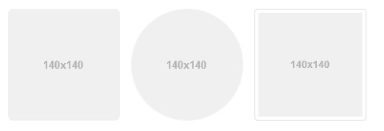{width="4.875in"
> height="1.6663024934383202in"}

### Icons (Glyphicons)

**Glyphicons** are small icons used to help the user understand the
meaning of a function. For example, an e-mail will have an envelope
icon, search would have a magnifying glass icon, and so on. Some
Glyphico[ns](http://bootstrapdocs.com/v3.0.3/docs/components/#glyphicons)
are shown in the following diagram:

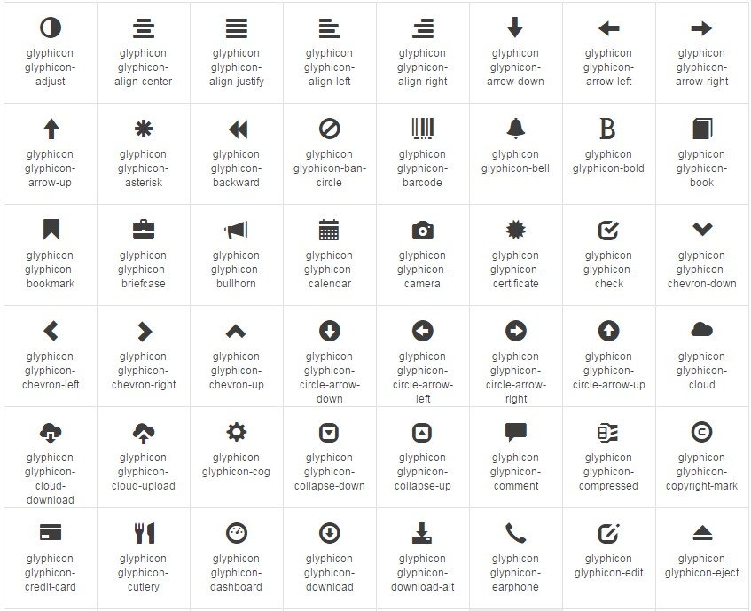{width="5.5in" height="4.470138888888889in"}

More than 250 Glyphicons in font format are present in the **Glyphicon
Halflings** set. Here is how to add Glyphicons in Bootstrap:

> **&lt;span class=&quot;glyphicon glyphicon-search&quot;&gt;&lt;/span&gt;**
>
> All the available Glyphicons can be found at [**http://getbootstrap.**
> **com/components/**](http://getbootstrap.com/components/).

## Navigation elements

Bootstrap supports multiple types of navigation element and can be used
as described in the following code:

**Tabs**

The **tab** class creates small tabs on the navigation bar, and each tab
provides a link to different pages:

> **&lt;ul class=&quot;nav nav-tabs&quot;&gt; ... &lt;/ul&gt;**

The tabs basically are links to other pages or websites; thus, the
**tab** class should be declared within the link tags, as shown in the
preceding code.

**Pills**

The **pill** class has the same functionality as the **tab** class, with
the only difference being the styling. The tabs now appear like pills:

> **&lt;ul class=&quot;nav nav-pills&quot;&gt; ... &lt;/ul&gt;**

### Justified

Adding an additional class of **nav-justified** would allow tabs or
pills to automatically adjust themselves according to the screen
resolution. The tabs or pills are given equal widths:

> **&lt;ul class=&quot;nav nav-tabs nav-justified&quot;&gt; ... &lt;/ul&gt;**

**Disabled links**

Adding a **disabled** class to a tab or pill in a navigation bar would
remove the hover state, disabling the access to the link:

> **&lt;ul class=&quot;nav nav-pills&quot;&gt; &period;..**
>
> **&lt;li class=&quot;disabled&quot;&gt;&lt;a href=&quot;#&quot;&gt;Disabled link&lt;/a&gt;&lt;/li&gt;
> &period;..**
>
> **&lt;/ul&gt;**

Remember to place the actual link in place of **&num;**.

## The navigation bar

Navigation in Bootstrap helps in navigating through the website. It
allows quick access to the links a user visits often.

**Default**

The **navbar** class is used to create a simple navigation bar by
including **.navbar** and **.navbar-default** in the navigation tab:

> **&lt;nav class=&quot;navbar navbar-default&quot; role=&quot;navigation&quot;&gt;**

To make a scalable, responsive menu bar that collapses to a dropdown
when displaying on mobile devices, use the following class to wrap the
bar:

> **&lt;div class=&quot;navbar-header&quot;&gt;**

**Forms**

You can also put forms within a navigation bar by adding the
**.navbar-form** class:

> **&lt;form class=&quot;navbar-form navbar-left&quot; role=&quot;search&quot;&gt;**

**Buttons**

Similar to the **navbar** class, **.navbar-btn** adds a button to the
bar that can perform many useful functions:

> **&lt;button type=&quot;button&quot; class=&quot;btn btn-default navbar-btn&quot;&gt;
> ...**
>
> **&lt;/button&gt;**

**Text**

By adding the **.navbar-text** class, we can also add text to the
navigation bar:

> **&lt;p class=&quot;navbar-text&quot;&gt; ... &lt;/p&gt;**

**Non-nav links**

The **navbar-link** class allows us to add standard links that are not
in the **navbar** navigation component:

> **&lt;p class=&quot;navbar-text navbar-right&quot;&gt;**
>
> **&lt;a href=&quot;#&quot; class=&quot;navbar-link&quot;&gt;&lt;/a&gt;**
>
> **&lt;/p&gt;**

**Fixed to top**

Adding the **navbar-fixed-top** class within the **&lt;nav&gt;** tabs allows
**navbar** to dynamically position itself at the top of the page. Here
is its syntax:

> **&lt;nav class=&quot;navbar navbar-default navbar-fixed-top&quot;
> role=&quot;navigation&quot;&gt;**

**Fixed to bottom**

The **navbar-fixed-bottom** class allows the navigation bar to sit right
at the bottom of the page. Here is its syntax:

> **&lt;nav class=&quot;navbar navbar-default navbar-fixed-bottom&quot;
> role=&quot;navigation&quot;&gt;**

**Static top**

The **navbar-static-top** class adds a new feature to the navigation bar
that allows the element to scroll along with the page. Here is its
syntax:

> **&lt;nav class=&quot;navbar navbar-default navbar-static-top&quot;
> role=&quot;navigation&quot;&gt;**

**Inverted navbar**

The **navbar-inverse** class only changes the color of the navigation
bar and turns it into the opposite color. For example, **navbar** gets a
black background with white text:

> **&lt;nav class=&quot;navbar navbar-inverse&quot; role=&quot;navigation&quot;&gt;**

## Panels

Panels are simple boxes that contain plain text. Panels are mostly used
in order to present important information in a visually favorable way.

**Basic**

A basic panel consists of a single box containing some text. The method
of its declaration is shown here:

> **&lt;div class=&quot;panel panel-default&quot;&gt; ... &lt;/div&gt;**

**Heading**

The **panel-heading** class adds an additional box above the basic
panel, which contains its heading or title. Both boxes are of different
colors by default. Here is the syntax:

> **&lt;div class=&quot;panel-heading&quot;&gt;This is a Panel Heading&lt;/div&gt;**

**Footer**

The **panel-footer** class adds a box beneath a basic panel which also
contains text of some sort. Here is the syntax:

> **&lt;div class=&quot;panel-footer&quot;&gt;This is a Panel Footer&lt;/div&gt;**

**Group**

Panels under the **panel-group** class are grouped together. Here is the
syntax:

> **&lt;div class=&quot;panel-group&quot;&gt;**

## Breadcrumbs

Breadcrumbs serve as a helping tool that keeps track of the path you
take to visit different pages. Using breadcrumbs, you can know the
current location of a page on a website.

Breadcrumbs are used to find out the current page&apos;s path in a
navigation hierarchy.

Here is a sample code:

> **&lt;ol class=&quot;breadcrumb&quot;&gt;**
>
> **&lt;li&gt;&lt;a href=&quot;#&quot;&gt;Home&lt;/a&gt;&lt;/li&gt;**
>
> **&lt;li&gt;&lt;a href=&quot;#&quot;&gt;Library&lt;/a&gt;&lt;/li&gt;**
>
> **&lt;li class=&quot;active&quot;&gt;Data&lt;/li&gt;**
>
> **&lt;/ol&gt;**

## Labels and badges

Labels and badges offer help tools that keep track of the progressive
factors, such as numerical indicators, counts, percentages, and so on,
by keeping counts or by showing the status of a website being loaded and
so on.

**Labels**

Labels are associated with different headings or titles which help in
keeping records of counts or give tips among other things. Labels can be
declared as follows:

> **&lt;h3&gt;This is an example Heading&lt;span class=&quot;label label-
> default&quot;&gt;This is an example label&lt;/span&gt;&lt;/h3&gt;**

**Badges**

Badges are the same as labels with the only difference being the shape.
Badges have more curved shapes than labels. They are mainly used to
notify the user of the new changes, unseen e-mails, and so on. Let&apos;s
take a look at the following code snippet:

> **&lt;a href=&quot;#&quot;&gt;Check EMailsEMails &lt;span
> class=&quot;badge&quot;&gt;4545&lt;/span&gt;&lt;/a&gt;**

## Pagination

**Pagination** is the grouping of data on various pages like a textbook
where data of same importance is usually posted on the same page for
better accessibility.

Pagination is highly scalable and provides larger click areas which are
hard to miss. Pagination can be used along with tables and is useful for
paginating search results.

**Default**

Following is a basic example of bootstrap pagination:

> **&lt;ul class=&quot;pagination&quot;&gt;**
>
> **&lt;li&gt;**
>
> **&lt;a href=&quot;#&quot; aria-label=&quot;Previous&quot;&gt;**
>
> **&lt;span aria-hidden=&quot;true&quot;&gt;&laquo;&lt;/span&gt;**
>
> **&lt;/a&gt;**
>
> **&lt;/li&gt;**
>
> **&lt;li&gt;&lt;a href=&quot;#&quot;&gt;1&lt;/a&gt;&lt;/li&gt;**
>
> **&lt;li&gt;&lt;a href=&quot;#&quot;&gt;2&lt;/a&gt;&lt;/li&gt;**
>
> **&lt;li&gt;&lt;a href=&quot;#&quot;&gt;3&lt;/a&gt;&lt;/li&gt;**
>
> **&lt;li&gt;&lt;a href=&quot;#&quot;&gt;4&lt;/a&gt;&lt;/li&gt;**
>
> **&lt;li&gt;&lt;a href=&quot;#&quot;&gt;5&lt;/a&gt;&lt;/li&gt;**
>
> **&lt;li&gt;**
>
> **&lt;a href=&quot;#&quot; aria-label=&quot;Next&quot;&gt;**
>
> **&lt;span aria-hidden=&quot;true&quot;&gt;&raquo;&lt;/span&gt;**
>
> **&lt;/a&gt;**
>
> **&lt;/li&gt;**
>
> **&lt;/ul&gt;**

Adding **.active** to **&lt;li&gt;** will highlight the current page link:

> **&lt;li class=&apos;active&apos;&gt;&lt;a href=&quot;#&quot;&gt;3&lt;/a&gt;&lt;/li&gt;**

Adding **.disabled** to **&lt;li&gt;** will disable the page link and make
it unclickable:

> **&lt;li class=&apos;disabled&apos;&gt;&lt;a href=&quot;#&quot;&gt;3&lt;/a&gt;&lt;/li&gt;**

**Pager**

The next and previous links are used in pagination for quick access.
Pagers are mainly used by simple sites such as magazines, newspapers, or
blogs, and so on. Here is the syntax:

> **&lt;ul class=&quot;pager&quot;&gt; ... &lt;/ul&gt;**

## Progress bars

A basic progress bar is a rectangular bar that fills according to the
level of progress achieved. These bars are mainly used for the purpose
of showing current progress regarding an action.

Here is the code to create progress bars:

> **&lt;div class=&quot;progress&quot;&gt;**
>
> **&lt;div class=&quot;progress-bar&quot; role=&quot;progressbar&quot; aria-
> valuenow=&quot;505&quot;**
>
> **aria-valuemin=&quot;0&quot; aria-valuemax=&quot;100&quot; style=&quot;width:505%&quot;&gt;**
>
> **&lt;/div&gt;**
>
> **&lt;/div&gt;**
>
> For more types visit: [**http://www.w3schools.com/bootstrap/**
> **bootstrap_progressbars.asp**](http://www.w3schools.com/bootstrap/bootstrap_progressbars.asp).

## Advanced Bootstrap/JavaScript plugins

Bootstrap can benefit from powerful JavaScript libraries to display
various kinds of dynamic content on web pages. Bootstrap plugins require
jQuery as a dependency. These include buttons, dropdowns, tooltips,
alerts, tabs, and more. We will now cover how to use them.

**Buttons**

Buttons in Bootstrap can be used under various combinations.

**Basic**

The **btn-group** class generates a default grey button with curved
edges that can trigger any function when clicked on by the user:

> **&lt;div class=&quot;btn-group&quot;&gt; ... &lt;/div&gt;**

**Button toolbar**

The **btn-toolbar** class groups together all buttons that are included
in the **btn-toolbar** class:

> **&lt;div class=&quot;btn-toolbar&quot; role=&quot;toolbar&quot;&gt; ... &lt;/div&gt;**

**Sizing**

The **sizing** class is used to size groups of buttons at once by just
adding **btngroup-&ast;**.

The declaration is shown here:

> **&lt;div class=&quot;btn-group btn-group-lg&quot;&gt;&period;..&lt;/div&gt; //large**
>
> **&lt;div class=&quot;btn-group&quot;&gt;&period;..&lt;/div&gt; //normal**
>
> **&lt;div class=&quot;btn-group btn-group-sm&quot;&gt;&period;..&lt;/div&gt; //small**
>
> **&lt;div class=&quot;btn-group btn-group-xs&quot;&gt;&period;..&lt;/div&gt; //extra small**

**Nesting**

Creating drop-down menus with a series of buttons can be done by placing
a **btn-group** within a **btn-group** as shown here:

> **&lt;div class=&quot;btn-group&quot; role=&quot;group&quot; aria-label=&quot;&period;..&quot;&gt;**
>
> **&lt;button type=&quot;button&quot; class=&quot;btn
> btn-default&quot;&gt;Alpha&lt;/button&gt;**
>
> **&lt;button type=&quot;button&quot; class=&quot;btn
> btn-default&quot;&gt;Beta&lt;/button&gt;**
>
> **&lt;button type=&quot;button&quot; class=&quot;btn btn-default&quot;&gt;Gamma&lt;/button**
>
> **&lt;div class=&quot;btn-group&quot; role=&quot;group&quot;&gt;**
>
> **&lt;button type=&quot;button&quot; class=&quot;btn btn-default dropdown-toggle&quot;
> data-toggle =&quot;dropdown&quot;&gt; List of Top Publishers&lt;/button&gt;**
>
> **&lt;ul class=&quot;Top Publishers&quot;&gt;**
>
> **&lt;li&gt;&lt;a href=&quot;https://www.packtpub.com/&quot;&gt; Packt**
>
> **Publishing&lt;/a&gt;&lt;/li&gt;**
>
> **&lt;li&gt;&lt;a href=&quot;http://www.oreilly.com/&quot;&gt;
> O&apos;Reilly&lt;/a&gt;&lt;/li&gt;**
>
> **&lt;/ul&gt;**
>
> **&lt;/div&gt;**
>
> **&lt;/div&gt;**

**Vertical variation**

The **btn-group-vertical** class arranges a group of buttons in a
vertical fashion. Here is the syntax:

> **&lt;div class=&quot;btn-group-vertical&quot;&gt; &period;.. &lt;/div&gt;**

### Justified link variation

The **btn-group-justified** class allows the button groups to adjust
themselves according to any screen resolution and provides equal widths
to the buttons. Here is the syntax:

> **&lt;div class=&quot;btn-group btn-group-justified&quot;&gt; &period;.. &lt;/div&gt;**

**Dropdowns**

Dropdown menus are triggered when a button is clicked on the dropdown by
the user. Dropdowns are mainly used to access additional related links.

**Single button**

The **btn btn-default dropdown-toggle** class changes a button into a
simple dropdown menu. Its declaration is shown in the following code:

> **&lt;button type=&quot;button&quot; class=&quot;btn btn-default dropdown-toggle&quot;
> data-toggle=&quot;dropdown&quot;&gt;**
>
> **&lt;span class=&quot;caret&quot;&gt;&lt;/span&gt;**
>
> **&lt;/button&gt;**

**Split button**

The **btn btn-danger** class does not change the button entirely into a
dropdown, rather it splits a button into two parts where one performs a
simple button function and the other becomes a dropdown menu:

> **&lt;div class=&quot;btn-group&quot;&gt;**
>
> **&lt;button type=&quot;button&quot; class=&quot;btn
> btn-danger&quot;&gt;Action&lt;/button&gt;**
>
> **&lt;button type=&quot;button&quot; class=&quot;btn btn-danger dropdown-toggle&quot;
> data- toggle=&quot;dropdown&quot;&gt;**
>
> **&lt;span class=&quot;caret&quot;&gt;&lt;/span&gt;**
>
> **&lt;span class=&quot;sr-only&quot;&gt;Toggle for Dropdown&lt;/span&gt;**
>
> **&lt;/button&gt;**
>
> **&lt;/div&gt;**

**Tooltips**

Tooltips are small boxes that pop up when the pointer is hovered over an
element.

To create a tooltip, add the **data-toggle=&quot;tooltip&quot;** attribute to an
element. Add the **data-toggle=&quot;tooltip&quot;** attribute to an element to
create a tooltip. To specify the text that is displayed inside a
tooltip, use the **title** attribute:

> **&lt;a href=&quot;#&quot; data-toggle=&quot;tooltip&quot;
> title=&quot;Tooltip&quot;&gt;...&lt;/a&gt;**

**Positioning**

The positioning tool is used to position a popup box of tooltips, for
example, when a box may pop up on the top or bottom or to the left or
right of an element:

Here is the syntax for positioning it at the top:

> **&lt;a href=&quot;#&quot; data-toggle=&quot;tooltip&quot; data- placement=&quot;top&quot;
> title=&quot;Tooltip&quot;&gt;Tooltip at the top&lt;/a&gt;**

Here is the syntax for positioning it at the bottom:

> **&lt;a href=&quot;#&quot; data-toggle=&quot;tooltip&quot; data- placement=&quot;bottom&quot;
> title=&quot;Tooltip&quot;&gt; Tooltip at the bottom&lt;/a&gt;**

Here is the syntax for positioning it on the left of the element:

> **&lt;a href=&quot;#&quot; data-toggle=&quot;tooltip&quot; data- placement=&quot;left&quot;
> title=&quot;Tooltip&quot;&gt;Tooltip at the left&lt;/a&gt;**

Here is the syntax for positioning it on the right of the element:

> **&lt;a href=&quot;#&quot; data-toggle=&quot;tooltip&quot; data- placement=&quot;right&quot;
> title=&quot;Tooltip&quot;&gt; Tooltip at the right&lt;/a&gt;**

Remember to place the actual link in place of **&num;**.

**Popovers**

Popovers and tooltips have the same functionalities with the only
difference that for popovers to appear, the element needs to be clicked
on by the user. They are used to present additional information
regarding the element.

**Basic creation**

Popovers can be generated using the following piece of code:

> **&lt;a href=&quot;#&quot; data-toggle=&quot;popover&quot; title=&quot;Popover Header&quot;
> data- content=&quot;Some content inside the popover&quot;&gt;Toggle
> popover&lt;/a&gt;**

**Positioning**

Popovers can be positioned on the top or bottom or to the left or right
of the element using the following code.

Here is the syntax for positioning the popovers at the top:

> **&lt;a href=&quot;#&quot; title=&quot;Header&quot; data-toggle=&quot;popover&quot; data-
> placement=&quot;top&quot; data-Content=&quot;Content&quot;&gt; Popover at the top
> &lt;/a&gt;**

Here is the syntax for positioning it at the bottom:

> **&lt;a href=&quot;#&quot; title=&quot;Header&quot; data-toggle=&quot;popover&quot; data-
> placement=&quot;bottom&quot; data-content=&quot;Content&quot;&gt; Popover at the bottom
> &lt;/a&gt;**

Here is the syntax for positioning it on the left:

> **&lt;a href=&quot;#&quot; title=&quot;Header&quot; data-toggle=&quot;popover&quot; data-
> placement=&quot;left&quot; data-content=&quot;Content&quot;&gt; Popover at the
> leftleft&lt;/a&gt;**

Here is the syntax for positioning it on the right:

> **&lt;a href=&quot;#&quot; title=&quot;Header&quot; data-toggle=&quot;popover&quot; data-
> placement=&quot;right&quot; data-content=&quot;Content&quot;&gt;PopoverPopover at the**
>
> **right &lt;/a&gt;**

Remember to place the actual link in place of **&num;**.

**Closing**

The **popover** class allows the popover to close when you click
elsewhere:

> **&lt;a href=&quot;#&quot; title=&quot;Dismissible popover&quot; data-toggle=&quot;popover&quot;
> data-trigger=&quot;focus&quot; data-content=&quot;Click anywhere in the document
> to close the popover&quot;&gt;Click here to close popover&lt;/a&gt;**

**Alerts**

Bootstrap provides the utility of displaying alert messages. The code
for its declaration is shown here. Bootstrap also allows you to assign
different colors to alert messages to signify different situations.
Bootstrap requires jQuery, and **&dollar;** in this syntax means we are
invoking jQuery. Let&apos;s take a look at the following code:

> **&lt;button type=&quot;button&quot; class=&quot;close&quot; data-dismiss=&quot;alert&quot; aria
> label=&quot;Close&quot;&gt; &lt;span aria-hidden=&quot;true&quot;&gt;&times;&lt;/span&gt;
> &lt;/button&gt;**

The syntax of an alert is as follows:

> **&dollar;().alert():**

This listens for click events on its elements having data-dismiss-alert.
The syntax is as follows:

> **&dollar;().alert(&apos;close&apos;):**

This removes an alert from the DOM. The element will fade out if it
includes the **.fade** and **.in** classes.

**Tabs**

Tabs are used in navigation bars to provide quick access to different
links or pages. Tabs need to be individually activated, as follows:

> **&lt;div class=&quot;container&quot;&gt;**
>
> **&lt;h1&gt;Alpha Zoo&lt;/h1&gt;**
>
> **&lt;ul class=&quot;nav nav-tabs&quot;&gt;**
>
> **&lt;li class=&quot;active&quot;&gt;**
>
> **&lt;li&gt;&lt;a href=&quot;#&quot;&gt;Exhibit A to Exhibit H&lt;/a&gt;&lt;/li&gt;**
>
> **&lt;li&gt;&lt;a href=&quot;#&quot;&gt;Exhibit I to Exhibit M&lt;/a&gt;&lt;/li&gt;**
>
> **&lt;li&gt;&lt;a href=&quot;#&quot;&gt;Exhibit N to Exhibit Y&lt;/a&gt;&lt;/li&gt;**
>
> **&lt;li&gt;&lt;a href=&quot;#&quot;&gt;Mini Aquarium&lt;/a&gt;&lt;/li&gt;**
>
> **&lt;li&gt;&lt;a href=&quot;#&quot;&gt;Alpha Aviary&lt;/a&gt;&lt;/li&gt;**
>
> **&lt;li&gt;&lt;a href=&quot;#&quot;&gt;Adopt an animal for just &dollar;4&lt;/a&gt;&lt;/li&gt;**
>
> **&lt;/ul&gt;**
>
> **&lt;br&gt;**
>
> **&lt;p&gt;Welcome to our Zoo! We take pride in the happy animals we
> house.&lt;/p&gt; &lt;/div&gt;**

We can use the **fade** class to fade the content of tabs after viewing
them:

> **&lt;div class=&quot;tab-content&quot;&gt;**
>
> **&lt;div role=&quot;tabpanel&quot; class=&quot;tab-pane fade in active&quot;
> id=&quot;homepage&quot;&gt;&period;..&lt;/div&gt;**
>
> **&lt;div role=&quot;tabpanel&quot; class=&quot;tab-pane fade&quot;
> id=&quot;profile&quot;&gt;&period;..&lt;/div&gt;**
>
> **&lt;div role=&quot;tabpanel&quot; class=&quot;tab-pane fade&quot;
> id=&quot;posts&quot;&gt;&period;..&lt;/div&gt;**
>
> **&lt;div role=&quot;tabpanel&quot; class=&quot;tab-pane fade&quot;
> id=&quot;settings&quot;&gt;&period;..&lt;/div&gt; &lt;/div&gt;**

**Accordions**

Many a time, we come across scenarios wherein we need to manage large
amounts of information within a single page. Placing all this content on
a single page may lead to the creation of a very long page, and
scrolling up or down may be frustrating for the person using the
website. Accordion widgets are used to solve this problem, as they are
used on websites to manage the large amount of content and navigation
lists. They are basically collapsible panels inside which information is
placed. With the Bootstrap collapse plugin, its very simple to create
accordions.

This code creates an accordion with panel components:

> **&lt;div class=&quot;panel-group&quot; id=&quot;accordion&quot;&gt; &lt;H1&gt; Welcome to
> Alpha Zoo &lt;/H1&gt;**
>
> **&lt;p&gt;Welcome to our Zoo! We take pride in the happy animals we
> house.&lt;/p&gt;**
>
> **&lt;div class=&quot;panel panel-default&quot;&gt;**
>
> **&lt;div class=&quot;panel-heading&quot;&gt; &lt;h4 class=&quot;panel-title&quot;&gt;**
>
> **&lt;a data-toggle=&quot;collapse&quot; data-parent=&quot;#accordion&quot;
> href=&quot;#collapse1&quot;&gt;**
>
> **Exhibit A to Exhibit H&lt;/a&gt;**
>
> **&lt;/h4&gt; &lt;/div&gt;**
>
> **&lt;!&hyphen;-Data for Panel 1&hyphen;-&gt;**
>
> **&lt;div id=&quot;collapse1&quot; class=&quot;panel-collapse collapse in&quot;&gt; &lt;div
> class=&quot;panel-body&quot;&gt;**
>
> **These exhibits are for animals from the tropical regions of the
> planet. Take a guided tour through Exhibit A, our largest exhibit
> housing our bengal tigers Uri and Kayla with their cubs at exhibit A
> or simply feed our talking toucan Charlie in Exhibit D. &lt;a
> href=&apos;#&apos;&gt; See more&lt;/a&gt;**
>
> **&lt;/div&gt;**
>
> **&lt;/div&gt; &lt;/div&gt;**
>
> **&lt;!&hyphen;-Data for Panel 2&hyphen;-&gt;**
>
> **&lt;div class=&quot;panel panel-default&quot;&gt;**
>
> **&lt;div class=&quot;panel-heading&quot;&gt; &lt;h4 class=&quot;panel-title&quot;&gt;**
>
> **&lt;a data-toggle=&quot;collapse&quot; data-parent=&quot;#accordion&quot;
> href=&quot;#collapse2&quot;&gt;**
>
> **Exhibit I to Exhibit M&lt;/a&gt;**
>
> **&lt;/h4&gt; &lt;/div&gt;**
>
> **&lt;div id=&quot;collapse2&quot; class=&quot;panel-collapse collapse&quot;&gt; &lt;div
> class=&quot;panel-body&quot;&gt;**
>
> **This is the second panel. The content for the second panel will go
> in here.**
>
> **&lt;/div&gt;**
>
> **&lt;/div&gt;**
>
> **&lt;/div&gt; &lt;/div&gt;**

**Modals**

Modal plugins are popup windows or boxes that are displayed at the top
of the page. A modal looks like this:

**Modal size**

The modal dialog boxes come in two sizes. Small modals can be used for
dealing with small functions, whereas large modals can be used to prompt
large datasets.

#### Small

The **modal-dialog modal-sm** class creates a small modal. Here is the
syntax:

> **&lt;div class=&quot;modal-dialog modal-sm&quot;&gt;**

#### Large

The **modal-dialog modal-lg** class creates a large modal. Here is the
syntax:

> **&lt;div class=&quot;modal-dialog modal-lg&quot;&gt;**

**Media objects**

Media objects are abstract object styles that can be used for making
blog comments or other descriptive thumbnails:

-   **.media**: This class floats a **media** object to the right or
    left of a content block

-   **.media-list**: This class forms an unordered list of items:

> **&lt;div class=&quot;media&quot;&gt;**
>
> **&lt;a class=&quot;pull-left&quot; href=&quot;#&quot;&gt;**
>
> **&lt;img class=&quot;media-object&quot; data-src=&quot;holder.js/64x64&quot;&gt;**
>
> **&lt;/a&gt;**
>
> **&lt;div class=&quot;media-body&quot;&gt;**
>
> **&lt;h4 class=&quot;media-heading&quot;&gt;This is the Main Media**
>
> **heading &lt;/h4&gt;**
>
> **&lt;/div&gt;**
>
> **&lt;div&gt;**
>
> **&lt;ul class=&quot;media-list&quot;&gt;**
>
> **&lt;li class=&quot;media&quot;&gt;**
>
> **&lt;a class=&quot;pull-left&quot; href=&quot;#&quot;&gt;**
>
> **&lt;img class=&quot;media-object&quot; data-src=&quot;holder.js/64x64&quot;&gt;**
>
> **&lt;/a&gt;**
>
> **&lt;div class=&quot;media-body&quot;&gt;**
>
> **&lt;h4 class=&quot;media-heading&quot;&gt;This is a Media heading**
>
> **&lt;/h4&gt;**
>
> **&lt;!&hyphen;- Nested media object &hyphen;-&gt;**
>
> **&lt;/div&gt;**
>
> **&lt;/li&gt;**
>
> **&lt;/ul&gt;**

**Carousels**

The carousel plugin allows you to make elements move in a circle while
viewing each element one by one.

Carousels show components by cycling through them. This can be done
using the following code, which creates a carousel of animal
photographs:

> **&lt;div id=&quot;myCarousel&quot; class=&quot;carousel slide&quot;
> data-ride=&quot;carousel&quot;&gt;**
>
> **&lt;!&hyphen;- Indicators &hyphen;-&gt;**
>
> **&lt;ol class=&quot;carousel-indicators&quot;&gt;**
>
> **&lt;li data-target=&quot;#myCarousel&quot; data-slide-to=**
>
> **&quot;0&quot; class=&quot;active&quot;&gt;&lt;/li&gt;**
>
> **&lt;li data-target=&quot;#myCarousel&quot; data-slide-to=&quot;1&quot;&gt;&lt;/li&gt; &lt;li
> data-target=&quot;#myCarousel&quot; data-slide-to=&quot;2&quot;&gt;&lt;/li&gt;**
>
> **&lt;li data-target=&quot;#myCarousel&quot; data-slide-to=&quot;3&quot;&gt;&lt;/li&gt;
> &lt;/ol&gt;**
>
> **&lt;!&hyphen;- Wrapper for slides &hyphen;-&gt;**
>
> **&lt;div class=&quot;carousel-inner&quot; role=&quot;listbox&quot;&gt; &lt;div class=&quot;item
> active&quot;&gt;**
>
> **&lt;img src=&quot;Emperor_Penguin.jpg&quot; alt=&quot;Emperor Penguin&quot;&gt;
> &lt;/div&gt;**
>
> **&lt;div class=&quot;item&quot;&gt;**
>
> **&lt;img src=&quot;bengal_tiger.jpg&quot; alt=&quot;Tiger&quot;&gt; &lt;/div&gt;**
>
> **&lt;div class=&quot;item&quot;&gt;**
>
> **&lt;img src=&quot;african_elephant.jpg&quot; alt=&quot;Elephant&quot;&gt; &lt;/div&gt;**
>
> **&lt;div class=&quot;item&quot;&gt;**
>
> **&lt;img src=&quot;australian_kiwi.jpg&quot; alt=&quot;Kiwi&quot;&gt;**
>
> **&lt;/div&gt; &lt;/div&gt;**
>
> **&lt;!&hyphen;- Left and right controls &hyphen;-&gt;**
>
> **&lt;a class=&quot;left carousel-**
>
> **control&quot; href=&quot;#myCarousel&quot; role=&quot;button&quot;
> data-slide=&quot;prev&quot;&gt;**
>
> **&lt;span class=&quot;glyphicon glyphicon-chevron-left&quot; aria-
> hidden=&quot;true&quot;&gt;&lt;/span&gt;**
>
> **&lt;span class=&quot;sr-only&quot;&gt;Previous&lt;/span&gt; &lt;/a&gt;**
>
> **&lt;a class=&quot;right carousel-**
>
> **control&quot; href=&quot;#myCarousel&quot; role=&quot;button&quot;
> data-slide=&quot;next&quot;&gt;**
>
> **&lt;span class=&quot;glyphicon glyphicon-chevron-right&quot; aria-
> hidden=&quot;true&quot;&gt;&lt;/span&gt;**
>
> **&lt;span class=&quot;sr-only&quot;&gt;Next&lt;/span&gt;**
>
> **&lt;/a&gt;**
>
> **&lt;/div&gt;**

**Typehead**

A Typehead is just another form of textbox that provides text
predictions as the user types into the text box and may look something
like this if programmed to type ahead the states of the US:

> 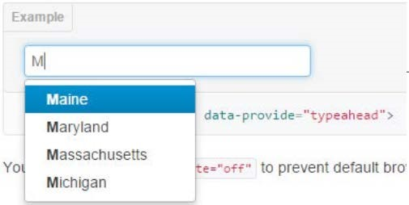{width="2.683186789151356in"
> height="1.3495636482939632in"}

**How to create typehead**

The following code shows how you can create a simple typehead textbox:

> **&lt;input type=&quot;text&quot; data-provide=&quot;typeahead&quot;&gt;**

**Usage of typehead via JavaScript**

We can call the typehead using the following code:

> **&dollar;(&apos;.typeahead&apos;).typeahead()**

For a complete implementation, visit
[**https://twitter.github.io/typeahead.js/**
**examples/**](https://twitter.github.io/typeahead.js/examples/).

**Scrollspy**

The **Scrollspy** plugin allows the navigation targets to automatically
update themselves when the user scrolls up or down.

Scrollspy can help in identifying the section of the page you have
reached while scrolling randomly and makes finding required data much
easier. The Scrollspy plugin can normally be activated in two ways,
which we will see now.

**Activating Scrollspy via a data attribute**

The data attribute allows spying on a particular element by adding
**&lt;data-spy =&quot;scroll&quot;** to the element:

> **&lt;body data-spy=&quot;scroll&quot; data-target=&quot;.navbar&quot;&gt;&period;..&lt;/body&gt;**

**Activating Scrollspy via JavaScript**

Scrollspy can also be triggered by JavaScript by selecting the element
and executing the **scrollspy()** function:

> **&dollar;(&apos;#navbar&apos;).scrollspy()**

### Affix

The **affix** plugin is used to lock an element to an area on a page.

The affix plugin can be activated using data attributes or JavaScript.
Affix plugins are used to place social icons on websites, where they are
locked in one place so that they can be accessed by the user any time.

### Activating the affix plugin via a data attribute

Use the following method to activate the **affix** tool: **&lt;div
data-spy=&quot;affix&quot; data-offset-top=&quot;200&quot;&gt;&period;..&lt;/div&gt;**

### Activating the affix plugin via JavaScript

We can also activate the **affix** tool via JavaScript manually using
the following code:

> **&dollar;(&apos;#navbar&apos;).affix()**

## Customizing Bootstrap

Since Bootstrap is a very heavy project, including all its repositories
is not actually required, and even if you do, this could put enormous
load on your website, making it sluggish and affecting user experience.
To get the Bootstrap engine suited to your specific needs, go to
[**http://getbootstrap.com/customize/**](http://getbootstrap.com/customize/)
and import a style file with the settings you need. You can also import
your existing settings file on the preceding link, add or remove options
within the GUI, and get an updated version without writing a single line
of code.

## Websites built with Bootstrap

WordPress is out there, and a lot of big websites and companies are
using it. Twitter&apos;s website itself is made with Bootstrap. Take a look
at some famous websites built with the Bootstrap framework:

> {width="4.796351706036745in"
> height="2.333339895013123in"}
>
> • [**http://www.hublot.com/en/**](http://www.hublot.com/en/)
>
> {width="5.0in" height="2.0819444444444444in"}
>
> {width="4.7483891076115485in"
> height="2.331861329833771in"}

## Bootstrap resources

The Internet is full of Bootstrap resources; here are a few:

-   [**www.wrapbootstrap.com**](http://www.wrapbootstrap.com/): You can
    buy or sell at **WrapBootstrap**. It is a huge marketplace for
    premium templates and themes.

-   [**www.bootswatch.com**](http://www.bootswatch.com/): *Bootstrap
    themes* are released under the MIT license and maintained by the
    community on GitHub. Themes are built for the latest version of
    Bootstrap.

-   [**www.startbootstrap.com**:](http://www.startbootstrap.com/)
    **Startbootstrap** is an easy way to learn and develop Bootstrap, as
    it contains thousands of starter themes and templates, even for
    Bootstrap 3.

-   [http://themes.getbootstrap.com:](http://themes.getbootstrap.com/)
    These are the official *Bootstrap themes* and templates from the
    creators of Bootstrap and include dashboards, admins, and marketing
    sites.

Here are a few more resources for Bootstrap, but there are many more.
You can surf through these sites and gain some more knowledge about the
working and intricacies of Bootstrap:

-   [**http://expo.getbootstrap.com/**](http://expo.getbootstrap.com/%20https://bootstrapbay.com/blog/built-with-bootstrap/%20http://builtwithbootstrap.com/%20http://getbootstrap.com/getting-started/#examples)

-   [**https://bootstrapbay.com/blog/built-with-bootstrap/**](http://expo.getbootstrap.com/%20https://bootstrapbay.com/blog/built-with-bootstrap/%20http://builtwithbootstrap.com/%20http://getbootstrap.com/getting-started/#examples)

-   [**http://builtwithbootstrap.com/**](http://expo.getbootstrap.com/%20https://bootstrapbay.com/blog/built-with-bootstrap/%20http://builtwithbootstrap.com/%20http://getbootstrap.com/getting-started/#examples)

-   [**http://getbootstrap.com/getting-started/#examples**](http://expo.getbootstrap.com/%20https://bootstrapbay.com/blog/built-with-bootstrap/%20http://builtwithbootstrap.com/%20http://getbootstrap.com/getting-started/#examples)

> As of now, Bootstrap version 4 alpha has been launched. All the
> JavaScript plugins have been rewritten in ECMAScript6, Completely
> shifted from LESS to SASS and IE8 support has been dropped.
>
> Here is official blog post:
> [**http://blog.getbootstrap.**](http://blog.getbootstrap.com/2015/08/19/bootstrap-4-alpha/)
>
> [**com/2015/08/19/bootstrap-4-alpha/**](http://blog.getbootstrap.com/2015/08/19/bootstrap-4-alpha/)

# jQuery -- The Popular JavaScript Library

jQuery is an open source JavaScript library. jQuery makes JavaScript
programming much simpler.

The following are the notable corporate members of the jQuery
foundation:

-   **WordPress**: ([**http://wordpress.org/**](http://wordpress.org/))

-   **IBM**: ([**http://ibm.com/**)](http://ibm.com/)

-   **NeoBux**: ([**http://www.neobux.com/**)](http://www.neobux.com/)

-   **Mozilla**:
    ([**http://www.mozilla.org/**)](http://www.mozilla.org/)

-   **Intel&apos;s Open Source Technology Center**:
    ([**http://software.intel.com/**
    **en-us/oss**](http://software.intel.com/en-us/oss))

-   **Adobe**: ([**http://adobe.com/**](http://adobe.com/))

You can find all about jQuery at their official website
([**www.jQuery.com**)](http://www.jQuery.com/).

## The evolution of JQuery

jQuery has been evolving since day one. There are two major releases
available for download. The versions 1.x and 2.x differ in a way; 1.x is
more stable and supports older browsers as well; whereas, 2.x has the
same API as 1.x but without the support for legacy browsers.

> A legacy browser is an older version of a browser that has not been
> updated to the latest available version.

If you are using jQuery for a project, you can get another version that
takes fewer resources and is faster to load.

## Getting started

To get started with developing jQuery, you can download jQuery software
by visiting [**https://jquery.com/**](https://jquery.com/). In the
following sections, we will cover a few download links.

### Installing JQuery

We can download jQuery from
[**http://jquery.com/download/**.](http://jquery.com/download/)

There are two versions of jQuery available for download: compressed and
uncompressed.

To choose your option, go to the preceding link and right-click on
**Save as** and select **My Computer** and download it.

**jQuery 1.x**

We can download the minified version from
[**http://code.jquery.com/jquery1.11.3.min.js**.](http://code.jquery.com/jquery-1.11.3.min.js)

For development, we can download the version 1.x from
[**http://code.jquery.**](http://code.jquery.com/jquery-1.11.3.js)

[**com/jquery-1.11.3.js**](http://code.jquery.com/jquery-1.11.3.js).

**jQuery 2.x**

We can download the minified version from
[**http://code.jquery.com/jquery2.1.4.min.js**.](http://code.jquery.com/jquery-2.1.4.min.js)

For development, we can download the version 2.x from
[**http://code.jquery.**
**com/jquery-2.1.4.js**](http://code.jquery.com/jquery-2.1.4.js).

## Using jQuery

jQuery is an extremely powerful JavaScript library. Here are a few
sample pieces of code to give you a head start on your next project.

If you have downloaded the jQuery library to your hard disk and plan to
use it from there, then you can include the following code in your HTML
**&lt;head&gt;** tag:

> **&lt;script src=&quot;js/jquery.min.js&quot;&gt;&lt;/script&gt;**

Here, **js** is a folder in the root directory of your project.

> To avoid longer loading time and performance issues, scripts should be
> added to the end of the **&lt;body&gt;** tag because when the browser
> loads the web page (let&apos;s say, **sample1.html**) and the scripts are
> at the end of the body tag, the browser can render the content of the
> page (the body) and only start loading scripts afterward.

Another preferred approach is to use the Google hosted libraries; these
provide faster rendering to your pages and jQuery code than using your
own hosted jQuery libraries. You can use the Google developer hosted
libraries with the following piece of code:

> **&lt;script src=&quot;https://ajax.googleapis.com/ajax/libs/
> jquery/2.1.3/jquery.min.js&quot;&gt; &lt;/script&gt;**

The jQuery syntax is used to perform any specific action on elements of
HTML.

The basic syntax is as follows:

> **&dollar;(selector).action()**

Here is the description:

-   **&dollar;**: **&dollar;** is used to access the jQuery object.

-   **(selector)**: The **query (or find)** HTML elements using familiar
    CSS-style selector syntax. For example, you can select by element
    name, type, class or id.

-   **jQuery action()**: For example, it can be events like click,
    keypress, focus and so on.

## Selectors

As the name suggests, **selector** attributes are used to select various
elements of HTML. The **selector** attributes basically support the CSS
selectors.

Selectors begin with a **&dollar;** sign followed by parentheses: **&dollar;()**

### Element selectors

Element selectors select elements using their name. For example, if a
paragraph is written in the tags **&lt;p&gt;**, you can select this
paragraph using its name, that is, **p**:

> **&dollar;(&quot;p&quot;)**

**Parameters**

The name of the element to be chosen is passed as a parameter.

**Returns**

The element selectors returns the element.

**Description**

The element selectors select elements using their name. For example, if
a paragraph is written in the tags **&lt;p&gt;**, you can select this
paragraph using its name.

### ID selectors

ID selectors select elements using their ID. Each element of the HTML
can have its own identifying ID and it can be accessed using **&num;**. For
example, to access the element with the ID text, we can use the
following syntax:

> **&dollar;(&quot;#text&quot;)**

**Parameters**

The pound sign (or number sign) or a hash sign followed by the ID name
is passed as a parameter.

**Returns**

This returns the element using the ID passed as a parameter.

**Description**

This selects elements using their ID. IDs are usually used to uniquely
identify DOM elements that are accessed through the pound symbol in
Javascript or the hash sign.

### Class selectors

Class selectors select the elements using the class name. For example, a
class named sample can be accessed by the following syntax:

> **&dollar;(&quot;.sample&quot;)**

**Parameters**

A dot/period followed by the name of the class is passed as a parameter.

**Returns**

This returns the elements using the **Class** name passed as parameter.

**Description**

This selects the elements using the class name.

## Events

JQuery makes it easier to response when user interacts with the web
page. For example, we can perform several tasks when they click
somewhere, scroll the document, hover on field or anything like that.
Whenever user interacts with the web page, an event is occurred. We can
use event handling to execute our code.

### Mouse events

These are the events that are instantiated as soon as the user activates
any of the functions related to the mouse. In the following sections, we
will cover the description of each mouse event.

#### .click()

The click event takes a DOM object and calls the function if or when it
is clicked by the user.

**Parameters**

The click event receives a callback function.

**Returns**

This returns the response generated by the function called on click.

##### Description

The **click** event uses the ID to get what the user has clicked on and
accordingly calls its respective function defined inside the body.

Here is an example of its usage.

**HTML Code**:

> **&lt;div id=&quot;clicked&quot;&gt;**
>
> **//function to be called after clicked**

**&lt;/div&gt; jQuery Code**:

> **&dollar;( &quot;#clicked&quot; ).click(function() { alert( &quot;Function for .click()
> called.&quot; ); });**

#### .dblclick()

We can attach a handler to the double-click event of an HTML element
using the **.dblclick()** jQuery method.

**Parameters**

The **dbclick** event receives a callback function.

**Returns**

This returns the response generated by the function called on **double
click**.

##### Description

The **dblclick** event uses the ID to get what the user had double
clicked on and accordingly calls its respective function.

Here is an example of its usage.

**HTML Code**:

> **&lt;div id=&quot;clicked&quot;&gt;**
>
> **// function to be called after clicked**
>
> **&lt;/div&gt;**

**jQuery Code**:

> **&dollar;( &quot;#clicked&quot; ).dblclick(function() { alert( &quot;Function for
> .dblclick() called.&quot; ); });**

#### .hover()

The **hover** event uses the ID to get what the user had his mouse on
and accordingly calls its respective function.

**Parameters**

The **hover** event receives a callback function.

**Returns**

This returns the response generated by the function called **on hover**.

##### Description

The **hover** event uses the ID to get what the user had his mouse on
and accordingly calls its respective function.

Here is an example of its usage.

**HTML Code**:

> **&lt;ul&gt;**
>
> **&lt;li&gt;Lahore&lt;/li&gt;**
>
> **&lt;li&gt;Karachi&lt;/li&gt;**
>
> **&lt;li&gt;Peshawar&lt;/li&gt;**
>
> **&lt;li&gt;Sialkot&lt;/li&gt;**

**&lt;/ul&gt; jQuery Code**:

> **&dollar;( &quot;li&quot; ).hover( function() {**
>
> **&dollar;( this ).append( &dollar;( &quot;&lt;span&gt; (&ast;)&lt;/span&gt;&quot; ) ); // &quot;this&quot;
> is used to access the current object itself**
>
> **}, function() {**
>
> **&dollar;( this ).find( &quot;span:first&quot; ).remove();**
>
> **}**
>
> **);**

#### .mousedown()

The **.mousedown** event is activated when the user left-clicks on the
mouse and highlights a specific text.

**Parameters**

The **.mousedown()** function which gets executed when the element is
clicked.

**Returns**

This returns the response generated by the function called **on click**.

##### Description

The event is activated when the user left-clicks and highlights some
specific text.

Here is an example of its usage.

**HTML Code**:

> **&lt;div id=&quot;myTarget&quot;&gt;**
>
> **Click here**

**&lt;/div&gt; jQuery Code**:

> **&dollar;( &quot;#myTarget&quot; ).mousedown(function() { alert( &quot;Function for
> .mousedown() called.&quot; ); });**

#### .mouseenter()

The event is activated when the mouse is hovered over the selected text
and a function is called accordingly.

**Parameters**

The **mouseenter** event receives a callback function.

**Returns**

This returns the response generated by the function called **on mouse
enter**.

##### Description

This event is activated when the mouse is hovered over the selected text
and a function is called accordingly. The event related to the
**mouseenter()** is fired only once, so it does not matter if you hold
the cursor over an element, the function assigned through this function
is executed only once.

Here is an example of its usage.

**HTML Code**:

> **&lt;div id=&quot;external&quot;&gt;**
>
> **External**
>
> **&lt;div id=&quot;internal&quot;&gt;**
>
> **Internal**
>
> **&lt;/div&gt;**
>
> **&lt;/div&gt;**

**&lt;div id=&quot;myLog&quot;&gt;&lt;/div&gt; jQuery Code**:

> **&dollar;( &quot;#external&quot; ).mouseenter(function() {**
>
> **&dollar;( &quot;#myLog&quot; ).append( &quot;&lt;p&gt;Function for .mouseenter()
> called.&lt;/p&gt;&quot; ); });**

#### .mouseleave()

The **.mouseleave** event is activated when the cursor is moved away
from the HTML element.

**Parameters**

The **mouseleave** event receives a callback function.

**Returns**

This returns the response generated by the function called **on
clicked**.

##### Description

The event is activated when the mouse is left. The function is called
accordingly.

Here is an example of its usage.

**HTML Code**:

> **&lt;div id=&quot;external&quot;&gt;**
>
> **External**
>
> **&lt;div id=&quot;internal&quot;&gt;**
>
> **Internal**
>
> **&lt;/div&gt;**
>
> **&lt;/div&gt;**

**&lt;div id=&quot;myLog&quot;&gt;&lt;/div&gt; jQuery Code**:

> **&dollar;( &quot;#external&quot; ).mouseleave(function() {**
>
> **&dollar;( &quot;#myLog&quot; ).append( &quot;&lt;p&gt; Function for .mouseleave()
> called.&lt;/p&gt;&quot; ); });**

#### .mousemove()

The **.mousemove** event is triggered when the mouse is being moved
within an element.

**Parameters**

The **mousemove** event receives a callback function.

**Returns**

This returns the response generated by the function called on mouse
move.

##### Description

This event is triggered when the mouse is being moved within an element.

Here is an example of its usage.

**HTML Code**:

> **&lt;div id=&quot;myTarget&quot;&gt;**
>
> **Move here**
>
> **&lt;/div&gt;**
>
> **&lt;div id=&quot;other&quot;&gt;**
>
> **Trigger the Function**
>
> **&lt;/div&gt;**
>
> **&lt;div id=&quot;myLog&quot;&gt;&lt;/div&gt;**

**jQuery Code**:

> **&dollar;( &quot;#myTarget&quot; ).mousemove(function( event ) {**
>
> **// the event keyword identifies the mousemove event in the case of
> this example**
>
> **var msg = &quot;Function for .mousemove() called at &quot;; msg +=
> event.pageX + &quot;, &quot; + event.pageY;**
>
> **&dollar;( &quot;#myLog&quot; ).append( &quot;&lt;div&gt;&quot; + msg + &quot;&lt;/div&gt;&quot; );**
>
> **});**

#### .mouseout()

The **.mouseout** event is triggered when the mouse pointer leaves the
boundaries of the element. Any HTML element can be bound to this event.

**Parameters**

The **mouseout** event receives a callback function.

##### Returns

This returns the response generated by the function called when the
mouse moves out of the targeted element.

##### Description

The **mouseout** event is triggered when the mouse pointer leaves the
element.

Here is an example of its usage.

Required HTML Code:

> **&lt;div id=&quot;external&quot;&gt;**
>
> **External**
>
> **&lt;div id=&quot;internal&quot;&gt;**
>
> **Internal**
>
> **&lt;/div&gt;**
>
> **&lt;/div&gt;**
>
> **&lt;div id=&quot;other&quot;&gt;**
>
> **Trigger the Function**
>
> **&lt;/div&gt;**
>
> **&lt;div id=&quot;myLog&quot;&gt;&lt;/div&gt;**

Required jQuery Code:

> **&dollar;( &quot;#external&quot; ).mouseout(function() {**
>
> **&dollar;( &quot;#myLog&quot; ).append( &quot;&lt;p&gt;Function for .mouseout()
> called.&lt;/p&gt;&quot;**
>
> **);**
>
> **});**

#### .toggle()

This **.toggle()** function is used to bind multiple handlers to
matching elements that are executed on alternate clicks.

##### Parameters

The parameters of the **toggle()** function are **duration**,
**easing**, and **callback**.

The **duration** parameter is optional and is used to specify the speed
of the hide and show effect. The possible values are fast, slow, and
milliseconds. The default is 400 ms.

The **easing** parameter is optional and is used to specify the
**easing()** function that is to be used for animation. The default
value is **string**.

The **callback** parameter too is optional and is used to specify the
function that is to be called once the animation is complete.

**Returns**

This returns the output of the function that is called.

##### Description

This function is used to check the visibility of an element and then
alternate between the **hide()** and **show()** methods. The callback is
always fired once the animation is complete and only once for the
element that finds a match.

Here is an example of its usage.

Required HTML Code:

> **&lt;ul&gt;**
>
> **&lt;li&gt;Mercury&lt;/li&gt;**
>
> **&lt;li&gt;Venus&lt;/li&gt;**
>
> **&lt;li&gt;Earth&lt;/li&gt;**
>
> **&lt;li&gt;Mars&lt;/li&gt;**
>
> **&lt;/ul&gt;**

Required jQuery Code:

> **&dollar;(document).ready(function() {**
>
> **&dollar;(&quot;ul&quot;).click(function() {**
>
> **&dollar;(&quot;li&quot;).toggle(&quot;slow&quot;, function() {**
>
> **});**
>
> **});**
>
> **});**

### Keyboard events

The keyboard events are triggered on **Keyboard** functions, for
example, when a button/key is pressed or released, and so on. Keyboard
events can be controlled with the following built-in jQuery functions.
The available functions are **KeyDown**, **KeyPress**, and **KeyUp**.

The only practical difference between **KeyDown** and **KeyPress** is
that **KeyPress** relays the character resulting from a **KeyPress**
event and is only called if there is one.

For example, if you press *A* on your keyboard, you&apos;ll get this
sequence of events:

-   **KeyDown**: **KeyCode=Keys.A**, **KeyData=Keys.A**,
    **Modifiers=Keys.None**

-   **KeyPress**: **KeyChar=&apos;a&apos;**

-   **KeyUp**: **KeyCode=Keys.A**

#### .keydown()

The **keydown** event is instantiated when a key is pressed by the user.

**Parameters**

The **keydown** event sends the key pressed as a parameter.

**Returns**

This returns the output of the function that is called when a key is
pushed down.

##### Description

The **keydown** event is instantiated when the user presses a key, which
calls the function to be executed.

Here is an example of its usage.

Required HTML Code:

> **&lt;form&gt;**
>
> **&lt;input id=&quot;myTarget&quot; type=&quot;text&quot; value=&quot;KeyPress&quot;&gt;**
>
> **&lt;/form&gt;**

Required jQuery Code:

> **&dollar;( &quot;#myTarget&quot; ).keydown(function() { alert( &quot;Function for
> .keydown() called.&quot; ); });**

The preceding sample code selects the **div** element with the
**myTarget** ID and triggers the alert function when a key is pressed
down.

#### .keypress()

The **keypress** event is instantiated when a key is pressed by the
user.

**Parameters**

This sends the key pressed as parameter.

**Returns**

This returns the output of the function called by the key press.

##### Description

The **keypress** event is instantiated when the user presses a key,
which calls the function to be executed.

Here is an example of its usage.

Required HTML Code:

> **&lt;form&gt;**
>
> **&lt;fieldset&gt;**
>
> **&lt;input id=&quot;myTarget&quot; type=&quot;text&quot; value=&quot;Tomato&quot;&gt;**
>
> **&lt;/fieldset&gt;**
>
> **&lt;/form&gt;**

Required jQuery Code:

> **&dollar;( &quot;#myTarget&quot; ).keypress(function() {**
>
> **console.myLog( &quot;Function for .keypress() called.&quot; );**
>
> **});**

The preceding sample code selects the **div** element with the
**myTarget** ID and triggers the alert function when a key is pressed.

#### .keyup()

The **keyup** event occurs when the key that is pressed is released by
the user.

**Parameters**

This sends the key pressed as a parameter.

**Returns**

This returns the output of the function that is called when key is
released.

##### Description

The event occurs when the key pressed is released by the user.

Here is an example of its usage.

Required HTML Code:

> **&lt;form&gt;**
>
> **&lt;input id=&quot;myTarget&quot; type=&quot;text&quot; value=&quot;Hello there&quot;&gt;**
>
> **&lt;/form&gt;**

Required jQuery Code:

> **&dollar;( &quot;#myTarget&quot; ).keyup(function() { alert( &quot;Function for
> .keyup() called.&quot; ); });**

The preceding sample code selects the **div** with the **myTarget** ID
and triggers the alert function when a key is released.

### Form events

Form events are when elements inside a form are bound to jQuery. These
events are helpful when it comes to processing data entered via forms.
These events can be used on elements inside the **&lt;form&gt;** tags. We
will now cover the description of each form event.

#### submit()

The **submit** event, as the name suggests, is fired when a form is
submitted.

Its syntax is **&dollar;(selector).submit(function)**.

**Parameters**

The parameter taken is the function that is to be run once the form is
submitted.

**Returns**

This event does not return anything.

##### Description

The **submit()** function is a form event. It is used to bind form
elements with a function that needs to be called whenever a form is
submitted.

Required HTML Code:

> **&lt;form action=&quot;&quot;&gt;**
>
> **User ID: &lt;input type=&quot;text&quot; name=&quot;UsrID&quot;
> value=&quot;KA112&quot;&gt;&lt;br&gt; Password: &lt;input type=&quot;password&quot;
> name=&quot;password&quot; value=&quot;Password&quot;&gt;&lt;br&gt;**
>
> **&lt;input type=&quot;submit&quot; value=&quot;Submit&quot;&gt;**
>
> **&lt;/form&gt;**

Required JQuery Code:

> **&dollar;(document).ready(function() {**
>
> **&dollar;(&quot;form&quot;).submit(function() { alert(&quot;Form Submitted!&quot;);**
>
> **});**
>
> **});**

#### change()

The **change** event is fired whenever the value of an element in a form
changes.

Its syntax is **&dollar;(selector).change(function)**.

##### Parameters

The parameter taken is the function that is to be run once the value of
the selected element changes.

**Returns**

This event does not return anything.

##### Description

This event is used to bind the event to a function that needs to be
called whenever a value inside a form element changes. This function
works only on the **&lt;input&gt;**, **&lt;textarea&gt;**, and **&lt;select&gt;**
elements.

Required HTML Code:

> **&lt;select name=&quot;ShadesOfGreen&quot;&gt;**
>
> **&lt;option value=&quot;Jade&quot;&gt;Jade&lt;/option&gt;**
>
> **&lt;option value=&quot;Mint&quot;&gt;Mint&lt;/option&gt;**
>
> **&lt;option value=&quot;Emerald&quot;&gt;Emerald&lt;/option&gt;**
>
> **&lt;option value=&quot;Moss&quot;&gt;Moss&lt;/option&gt;**
>
> **&lt;/select&gt;**

Required JQuery Code:

> **&dollar;(document).ready(function() {**
>
> **&dollar;(&quot;select&quot;).change(function() { alert(&quot;Option Changed&quot;);**
>
> **});**
>
> **});**

#### blur()

The **blur** event is fired whenever an element in a form loses its
focus and the user moves to the next element in the form.

Its syntax is **&dollar;(selector).blur(function)**.

**Parameters**

The parameter taken is the function that is to be run once the element
loses focus.

**Returns**

This event does not return anything.

##### Description

The **blur** event is used to call a function whenever an element loses
its focus.

Required HTML Code:

> **User ID: &lt;input type=&quot;text&quot;&gt;**
>
> **Gender: &lt;select name=&quot;Gender&quot;&gt;**
>
> **&lt;option value=&quot;Male&quot;&gt;Male&lt;/option&gt;**
>
> **&lt;option value=&quot;Female&quot;&gt;Female&lt;/option&gt;**
>
> **&lt;/select&gt;**

Required JQuery Code:

> **&dollar;(document).ready(function() { &dollar;(&quot;input&quot;).blur(function() {
> alert(&quot;User ID lost foucs&quot;);**
>
> **});**
>
> **});**

#### focus()

The **focus** event is fired whenever an element in a form gets its
focus.

Its syntax is **&dollar;(selector).focus(function)**.

**Parameters**

The parameter taken is the function that is to be run once the element
is in focus.

**Returns**

This event does not return anything.

##### Description

The **focus** event is used to call a function whenever an element is in
focus. An element is generally *in focus* when we select it with the
mouse or use the *Tab* key to navigate to it. This event is triggered
only when the specified element is in focus and not the element&apos;s
children.

The focus event is generally used with the **blur** event.

Required HTML Code:

> **User ID: &lt;input type=&quot;text&quot; name=&quot;UsrID&quot;&gt;&lt;br&gt;**
>
> **Email ID: &lt;input type=&quot;text&quot; name=&quot;emailID&quot;&gt;**

Required JQuery Code:

> **&dollar;(document).ready(function() {**
>
> **&dollar;(&quot;input&quot;).focus(function() {**
>
> **&dollar;(this).css(&quot;background-color&quot;, &quot;#cccccc&quot;);**
>
> **});**
>
> **&dollar;(&quot;input&quot;).blur(function() {**
>
> **&dollar;(this).css(&quot;background-color&quot;, &quot;#ffffff&quot;);**
>
> **});**
>
> **});**

#### focusin()

This event is fired whenever an element or its child is in focus.

Its syntax is **&dollar;(selector).focusin(function)**.

**Parameters**

The parameter taken is the function that is to be run once the element
is in focus.

**Returns**

This event does not return anything.

##### Description

The **focusin** event is used to call a function whenever an element is
in focus. This event is also called whenever a child element is in
focus.

Required HTML Code:

> **&lt;div&gt;**
>
> **Name: &lt;input type=&quot;text&quot; name=&quot;fullname&quot;&gt;&lt;br&gt;**
>
> **Email: &lt;input type=&quot;text&quot; name=&quot;email&quot;&gt;**
>
> **&lt;/div&gt;**

Required JQuery Code:

> **&dollar;(document).ready(function() {**
>
> **&dollar;(&quot;div&quot;).focusin(function() {**
>
> **&dollar;(this).css(&quot;background-color&quot;, &quot;#cccccc&quot;);**
>
> **});**
>
> **});**

#### focusout()

The **focusout** event is fired whenever an element or its child is out
of focus.

Its syntax is **&dollar;(selector).focusout(function)**.

**Parameters**

The parameter taken is the function that is to be run once the element
is in focus.

**Returns**

This event does not return anything.

##### Description

This event is fired whenever an element or its child loses its focus.
This event is generally used along with the **focusin** event.

Required HTML Code:

> **&lt;div&gt;**
>
> **Name: &lt;input type=&quot;text&quot; name=&quot;fullname&quot;&gt;&lt;br&gt;**
>
> **Email: &lt;input type=&quot;text&quot; name=&quot;email&quot;&gt;**
>
> **&lt;/div&gt;**

Required JQuery Code:

> **&dollar;(document).ready(function() {**
>
> **&dollar;(&quot;div&quot;).focusin(function() {**
>
> **&dollar;(this).css(&quot;background-color&quot;, &quot;#cccccc&quot;);**
>
> **});**
>
> **&dollar;(&quot;div&quot;).focusout(function() {**
>
> **&dollar;(this).css(&quot;background-color&quot;, &quot;#ffffff&quot;);**
>
> **});**
>
> **});**

### Document events

Document events are generally fired whenever a document is loaded. In
the following sections, we will cover the description of each document
event.

#### resize()

The **resize** event is fired whenever the user resizes the window. Its
syntax is as follows:

> **&dollar;(selector).resize(function)**

**Parameters**

The parameter taken is the function that is to be run once the window is
resized.

**Returns**

This event does not return anything.

##### Description

The **resize** event is used to call a function when the user resizes
the window.

Required HTML Code:

> **&lt;p&gt;&lt;/p&gt;**

Required JQuery Code:

> **&dollar;(document).ready(function() {**
>
> **&dollar;(window).resize(function() {**
>
> **&dollar;(&quot;p&quot;).text(&quot;Window resized!!&quot;);**
>
> **});**
>
> **});**

#### scroll()

The **scroll** event is fired whenever the user scrolls in the
(scrollable) element. We can use this event to bind it to a function.
Its syntax is as follows:

> **&dollar;(selector).scroll(function)**

##### Parameters

The parameter taken is the function that is to be run once the user
scrolls on the element.

**Returns**

This event does not return anything.

##### Description

The **scroll** event is fired whenever the user scrolls in an element.

Required HTML Code:

> **&lt;div style=&quot;border:1px solid**
>
> **black;width:200px;height:100px;overflow:scroll;&quot;&gt;Lorem ipsum dolor
> sit amet, consectetur adipiscing elit. Curabitur vehicula ultrices
> nulla vel facilisis. Curabitur elementum lorem non massa porttitor
> accumsan. Cras eu leo tincidunt, pulvinar neque et, tempus dolor. Nam
> condimentum nisl vel quam posuere, vitae malesuada nunc molestie.
> Aliquam pulvinar diam eu magna sagittis efficitur. Vestibulum tempor,
> leo accumsan maximus hendrerit, ex nisi rutrum sapien, nec ultricies
> tellus nisl ac lacus.**
>
> **Phasellus sed ligula augue.**
>
> **&lt;/div&gt;**
>
> **&lt;p&gt;&lt;/p&gt;**

Required JQuery Code:

> **&dollar;(document).ready(function() {**
>
> **&dollar;(&quot;div&quot;).scroll(function() {**
>
> **&dollar;(&quot;p&quot;).text( &quot;Text Scrolled!&quot;);**
>
> **});**
>
> **});**

## Effects and animations

Custom animations and effects can be added to various elements to
enhance your interface using varying designs and colors.

### animate()

The **animate()** function uses some built-in animations to animate
objects in and off the view.

Its syntax is as follows:

> **(selector).animate({styles},speed,easing,callback)**

#### Parameters

The animate function accepts the parameters **duration**, **easing**,
and **callback**.

The **duration** parameter is optional and is used to specify the speed
of the hide and show effect. Its possible values are fast, slow, and
milliseconds. The default is 400ms.

The **easing** parameter is optional and is used to specify the easing
function that is to be used for the animation. The default is
**string**.

The **callback** parameter too is optional and is used to specify the
function that is to be called once the animation is complete.

**Returns**

Animations return the modified object containing all the modifications.

#### Description

Custom animations and effects can be added to various elements to
enhance your interface using varying designs and colors.

### stop()

The **stop()** method stops the animation of the selected element.

Its syntax is **&dollar;(selector).stop(stopAll,goToEnd);**

**Parameters**

This takes two Booleans, which are both set to false by default, as
parameters.

**Returns**

This does not return anything.

#### Description

This function stops running the animation as soon as it is called. If
the first parameter is set to **true**, this removes all the other
animations for the element. If the second parameter is set to **true**,
it quickly finishes the current animation.

Here is an example of its usage.

Required HTML Code:

> **&lt;div id=&quot;sample&quot;&gt;**
>
> **&lt;img id=&quot;sample&quot; src=&quot;myImage.png&quot; alt=&quot;&quot; width=&quot;1&quot;
> height=&quot;2&quot;&gt;**
>
> **&lt;/div&gt;**

Required jQuery Code:

> **&dollar;( &quot;#sample&quot; ).hover(function() {**
>
> **&dollar;( this ).find( &quot;img&quot; ).stop( true, true ).fadeOut();**
>
> **}, function() {**
>
> **&dollar;( this ).find( &quot;img&quot; ).stop( true, true ).fadeIn();**
>
> **});**

The preceding sample code creates a nice fade effect without the common
problem of multiple queued animations.

### Hide, show, and toggle

Elements can be set to hide and show, where hide makes the elements
disappear from the eye of the user and show does the opposite.

#### hide()

The **hide()** function, if applied on an HTML element, hides it from
view. This can be used in generating dynamic content based on user
activity. The following is its syntax:

> **&dollar;(selector).hide(speed,callback);**

##### Parameters

This takes speed in milliseconds and the callback function as
parameters. The values taken as parameters are as follows:

-   **Fast**

-   **Slow**

-   **Time** in milliseconds

**Returns**

This does not return anything.

##### Description

This function is equivalent to setting the CSS property **display:
none** for the selected element. It also saves the original display
property for future use.

Here is an example of its usage.

Required HTML Code:

> **&lt;div id=&quot;sample&quot;&gt;**
>
> **&lt;/div&gt;**
>
> **&lt;img id=&quot;myImage&quot; src=&quot;myImage.jpeg&quot; alt=&quot;&quot; width=&quot;1&quot;
> height=&quot;2&quot;&gt;**

Required jQuery Code:

> **&dollar;( &quot;#sample&quot; ).click(function() {**
>
> **&dollar;( &quot;#myImage&quot; ).hide( &quot;slow&quot;, function() { alert( &quot;Animation
> complete.&quot; );**
>
> **});**
>
> **});**

#### show()

The **show()** function, if applied on an HTML element, makes the hidden
element visible. This can be used to control and manipulate dynamic
content based on user activity, for example, making certain form options
visible after a certain checkbox is selected. The following is its
syntax:

> **&dollar;(selector).show(speed,callback);**

##### Parameters

This takes speed in milliseconds and the callback function as
parameters. The values taken as parameters are as follows:

-   **Fast**

-   **Slow**

-   **Time** in milliseconds

##### Returns

This does not return anything.

This function removes the **display:none** property from the element and
reverts it to the original. For example, if an element has a property
**display:inline-block** and was hidden using the hide function, it will
set the display back to inline-block.

Here is an example of its usage.

Required HTML Code:

> **&lt;div id=&quot;sample&quot;&gt;**
>
> **&lt;/div&gt;**
>
> **&lt;img id=&quot;myImage&quot; src=&quot;myImage.jpeg&quot; alt=&quot;&quot; width=&quot;1&quot;
> height=&quot;2&quot;&gt;**

Required jQuery Code:

> **&dollar;( &quot;#sample&quot; ).click(function() {**
>
> **&dollar;( &quot;#myImage&quot; ).Show( &quot;slow&quot;, function() { alert( &quot;Animation
> complete.&quot; );**
>
> **});**
>
> **});**

####  toggle()

The **toggle()** function, if applied on an HTML element, toggles with
the visibility of that element:

> **&dollar;(selector).toggle(speed,callback);**

##### Parameters

This takes the speed in milliseconds and the callback function as
parameters. The values taken are as follows:

-   **Fast**

-   **Slow**

-   **Time** in milliseconds

**Returns**

This does not return anything.

##### Description

This function is used to toggle with the visibility of the elements.

> This function should not be confused with the mouse event function
> **toggle()**, which was explained previously. To ensure which
> **toggle()** function is being used. Check the parameters passed to
> the function.

Here is an example of its usage.

Required HTML Code:

> **&lt;div id=&quot;sample&quot;&gt;**
>
> **&lt;/div&gt;**
>
> **&lt;img id=&quot;myImage&quot; src=&quot;myImage.jpeg&quot; alt=&quot;&quot; width=&quot;1&quot;
> height=&quot;2&quot;&gt;**

Required jQuery Code:

> **&dollar;( &quot;#sample&quot; ).click(function() {**
>
> **&dollar;( &quot;#myImage&quot; ).Show( &quot;slow&quot;, function() { alert( &quot;Animation
> complete.&quot; );**
>
> **});**
>
> **});**

### Fade

Fade can be used to set the visibility of elements.

#### fadeIn()

The **fadeIn()** function is similar to the **show()** function in
functionality, but **fadeIn()** comes with a nice fading transition
effect.

Its syntax is **&dollar;(selector).fadeIn(speed,callback);**.

##### Parameters

This takes speed in milliseconds and the callback function as
parameters. The values taken as parameters are as follows:

-   **Fast**

-   **Slow**

-   **Time** in milliseconds

##### Returns

This does not return anything.

This works in a similar way to the **show()** function but with a fade
transition.

Here is an example of its usage.

Required HTML Code:

> **&lt;div id=&quot;sample&quot;&gt;**
>
> **Click here**
>
> **&lt;/div&gt;**
>
> **&lt;img id=&quot;myImage&quot; src=&quot;myImage.png&quot; alt=&quot;&quot; width=&quot;1&quot;
> height=&quot;2&quot;&gt;**

Required jQuery Code:

> **&dollar;( &quot;#sample&quot; ).click(function() {**
>
> **&dollar;( &quot;#myImage&quot; ).fadeIn( &quot;slow&quot;, function() {**
>
> **// Animation complete**
>
> **});**
>
> **});**

The preceding sample code selects the **div** element with the
**sample** ID and fades in the image with the **myImage** ID with slow
animation.

#### fadeOut()

The **fadeOut()** function is similar to the **hide()** function in
functionality, but it comes with a nice fading transition effect.

Its syntax is as follows: **&dollar;(selector).fadeOut(speed,callback);**

##### Parameters

This takes speed in milliseconds and the callback function as
parameters. The values taken as parameters are as follows:

-   **Fast**

-   **Slow**

-   **Time** in milliseconds

##### Returns

This does not return anything.

The **fadeOut()** function works in a similar way to the **hide()**
function but with a fade transition.

Here is an example of its usage.

Required HTML Code:

> **&lt;div id=&quot;sample&quot;&gt;**
>
> **Click here**
>
> **&lt;/div&gt;**
>
> **&lt;img id=&quot;myImage&quot; src=&quot;myImage.png&quot; alt=&quot;&quot; width=&quot;1&quot;
> height=&quot;2&quot;&gt;**

Required jQuery Code:

> **&dollar;( &quot;#sample&quot; ).click(function() {**
>
> **&dollar;( &quot;#myImage&quot; ).fadeOut( &quot;fast&quot;, function() {**
>
> **// Animation complete**
>
> **});**
>
> **});**

#### fadeToggle()

The **fadeToggle()** function automatically toggles an element&apos;s
display property from **none** to **block**, **inline**, and so on.

Here is an example of its syntax:

> **&dollar;(selector).fadeToggle(speed,callback);**

##### Parameters

This takes speed in milliseconds and the callback function as
parameters. The values taken as parameters are as follows:

-   **Fast**

-   **Slow**

-   **Time** in milliseconds

##### Returns

This does not return anything.

If an element is already hidden, **fadeToggle()** will make it visible
and vice versa.

Here is an example of its usage.

Required HTML Code:

> **&lt;div id=&quot;sample&quot;&gt;**
>
> **Click here**
>
> **&lt;/div&gt;**
>
> **&lt;img id=&quot;myImage&quot; src=&quot;myImage.png&quot; alt=&quot;&quot; width=&quot;1&quot;
> height=&quot;2&quot;&gt;**

Required jQuery Code:

> **&dollar;( &quot;#sample&quot; ).click(function() {**
>
> **&dollar;( &quot;#myImage&quot; ).fadeToggle( 2000, function() {**
>
> **// Animation complete**
>
> **});**
>
> **});**

#### fadeTo()

The **fadeTo()** function adjusts the opacity of the target element to
the given value.

Its syntax is as follows:

> **&dollar;(selector).fadeTo( duration, opacity &lbrack;, complete &rbrack; )**
>
> **&dollar;(selector).fadeTo( duration, opacity &lbrack;, easing &rbrack; &lbrack;, complete &rbrack;
> )**

##### Parameters

This takes duration in milliseconds as parameters. The values taken as
parameters are as follows:

-   **Fast**

-   **Slow**

-   **Time** in milliseconds

The other parameter is opacity for the target element. The value lies
between **0** and **1** and the final parameter is the callback
function.

##### Returns

This does not return anything.

The **fadeTo()** function is similar to the **fadeIn()** method. But the
user can specify the target opacity here. For example, set an element to
50% opacity by pacing 0.5 as the opacity.

Required HTML Code:

> **&lt;div id=&quot;sample&quot;&gt;**
>
> **Click here**
>
> **&lt;/div&gt;**
>
> **&lt;img id=&quot;myImage&quot; src=&quot;myImage.png&quot; alt=&quot;&quot; width=&quot;1&quot;
> height=&quot;2&quot;&gt;**

Required jQuery Code:

> **&dollar;( &quot;#sample&quot; ).click(function() {**
>
> **&dollar;( &quot;#myImage&quot; ).fadeTo( &quot;Fast&quot;, 0.5, function() {**
>
> **// Animation complete**
>
> **});**
>
> **});**

### Sliding

Sliding methods are used to slide the elements in up or down directions.
The **slideDown()** function will make element visible, while the
**slideUp()** function will hide the contents of the element.

#### slideDown()

The **slideDown()** function slides down the selected element with the
specified speed.

Here is an example of its syntax:

> **&dollar;(selector).slideDown(speed,callback);**

##### Parameters

This this takes speed in milliseconds and the callback function as
parameters. The values taken as parameters are as follows:

-   **Fast**

-   **Slow**

-   **Time** in milliseconds

**Returns**

This does not return anything.

##### Description

The **slideDown()** function makes a hidden element visible with a nice
sliding effect.

Here is an example of its usage.

Required HTML Code:

> **&lt;div id=&quot;sample&quot;&gt;**
>
> **Click here**
>
> **&lt;/div&gt;**
>
> **&lt;img id=&quot;myImage&quot; src=&quot;myImage.png&quot; alt=&quot;&quot; width=&quot;1&quot;
> height=&quot;2&quot;&gt;**

Required jQuery Code:

> **&dollar;( &quot;#sample&quot; ).click(function() {**
>
> **&dollar;( &quot;#myImage&quot; ).slideDown( &quot;slow&quot;, function() { // Animation
> complete.**
>
> **});**
>
> **});**

#### slideUp()

The **slideUp()** function slides up (hides) the selected element with
the specified speed.

Here is an example of its syntax:

> **&dollar;(selector).slideUp(speed,callback);**

##### Parameters

Takes speed in milliseconds and the callback function as parameters. The
values taken as parameters are as follows:

-   **Fast**

-   **Slow**

-   **Time** in milliseconds

**Returns**

This does not return anything.

##### Description

This function hides the selected element with a nice sliding effect in
the upward direction.

Here is an example of its usage.

Required HTML Code:

> **&lt;div id=&quot;sample&quot;&gt;**
>
> **Click here**
>
> **&lt;/div&gt;**
>
> **&lt;img id=&quot;myImage&quot; src=&quot;myImage.png&quot; alt=&quot;&quot; width=&quot;1&quot;
> height=&quot;2&quot;&gt;**

Required jQuery Code:

> **&dollar;( &quot;#sample&quot; ).click(function() {**
>
> **&dollar;( &quot;#myImage&quot; ).slideUp( &quot;fast&quot;, function() { // Animation
> complete.**
>
> **});**
>
> **});**

#### slideToggle()

The **slideToggle()** function toggles between **slideUp()** and
**slideDown()** for the selected element with the specified speed.

Here is an example of its syntax:

> **&dollar;(selector).slideToggle(speed,callback);**

##### Parameters

This takes speed in milliseconds and the callback function as
parameters. The values taken as parameters are as follows:

-   **Fast**

-   **Slow**

-   **Time** in milliseconds

**Returns**

This does not return anything.

##### Description

Just as **fadeToggle()** switches transitions between two states,
**slideToggle()** can slide an element up or down.

Here is an example of its usage.

Required HTML Code:

> **&lt;div id=&quot;sample&quot;&gt;**
>
> **Click here**
>
> **&lt;/div&gt;**
>
> **&lt;img id=&quot;myImage&quot; src=&quot;myImage.png&quot; alt=&quot;&quot; width=&quot;1&quot;
> height=&quot;2&quot;&gt;**

Required jQuery Code:

> **&dollar;( &quot;#sample&quot; ).click(function() {**
>
> **&dollar;( &quot;#myImage&quot; ).slideToggle( &quot;fast&quot;, function() { // Animation
> complete.**
>
> **});**
>
> **});**

## Callback

Multiple lines of statements are queued rather than being executed
simultaneously. A callback function queues the statements and executes
them one by one.

Its syntax is as follows:

> **var callbacks = &dollar;.Callbacks();**

The object created can be used to add, remove, instantiate, and disable
callbacks.

The supported functions are **callbacks.add()**, **callbacks.remove()**,
**callbacks. fire()**, and **callbacks.disable()**.

### callbacks.add()

This function is used to add all the functions in an array that are to
be called later.

**Parameters**

This takes flags as strings as its parameters.

**Returns**

This method returns the callback&apos;s object to which it is associated
with, (this).

**Description**

The **callbacks.add()** function adds the function to the callback
array.

Here is an example of its usage.

Required jQuery Code:

> **function myFunc1( value ) { console.myLog( value ); }**
>
> **function myFunc2( value ) {**
>
> **console.myLog( &quot;myFunc2 says: &quot; + value ); return false; }**
>
> **var callbacks = &dollar;.Callbacks(); callbacks.add( myFunc1 );**
>
> **// Outputs: meow! callbacks.fire( &quot;meow!&quot; ); callbacks.add(
> myFunc2 );**
>
> **// Outputs: woof!, myFunc2 says: woof! callbacks.fire( &quot;woof!&quot;
> );**

### callbacks.fire()

The **callbacks.fire()** function invokes the callbacks in a list with
any arguments that have been passed.

**Parameters**

This takes a list of arguments to pass back to the callback list.

**Returns**

This returns the callback objects onto which it is attached.

**Description**

The **callbacks.fire()** function is used to invoke the callbacks in a
list with the arguments. The preceding example could be referenced.

### callbacks.remove()

The **callbacks.remove()** function is used to remove a function from
the array.

**Parameters**

This takes flags as strings as its parameters.

**Returns**

This returns the callbacks object onto which it is attached.

**Description**

This removes the function from the callback array. The preceding example
could be referenced.

### callbacks.disable()

The **callbacks.disable()** function disables the call of the next
function in the array.

**Parameters**

This does not take any parameter.

**Returns**

This returns the callbacks object to which the object is attached.

**Description**

The execution of the next function in the array is prevented using the
**callbacks. disable()** function:

> **var sound = function( value ) { console.log( value ); }; var
> callbacks = &dollar;.Callbacks();**
>
> **// Add the above function to the list callbacks.add( sound );**
>
> **// Fire the items on the list callbacks.fire( &quot;Woof!&quot; );**
>
> **// Disable further calls being possible callbacks.disable();
> callbacks.fire( &quot;Meow&quot; );**

## Chaining

A varying amount of statements can be executed by chaining them on the
same element. Each statement will be executed one after the other.

The value returned from each chained action is a new jQuery object.
Chaining can be done by appending one action to the previous action; for
example:

> **&dollar;(&quot;#p1&quot;).css(&quot;color&quot;, &quot;blue&quot;).slideDown(100).slideUp(35);**

Here, the actions **slideUp()** and **slideDown()** are performed one
after the other. **jQuery and the document object model**

The DOM defines a standard for accessing HTML and XML documents:

> *&quot;The W3C Document Object Model (DOM) is a platform and
> language-neutral interface that allows programs and scripts to
> dynamically access and update the content, structure, and style of a
> document.&quot;*

The following are some ways of DOM manipulation in jQuery:

-   **text()**: This sets or returns the text content of the selected
    elements

-   **html()**: This sets or returns the content of the selected
    elements

-   **val()**: This sets or returns the values of form fields **jQuery
    traversing**

You can traverse through the elements in the order they are combined.
All the elements are mostly combined in the form of a tree, and we can
traverse them starting from the root.

> Elements are not *combined* per se, but they are rather structured or
> modeled within the document object.

Let&apos;s take a look at the following image:

> 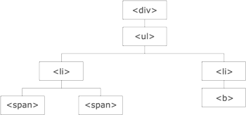{width="3.625in" height="1.71875in"}

Let&apos;s take a look at the following description:

-   The **&lt;div&gt;** element is the parent of **&lt;ul&gt;** and an ancestor
    of everything inside it

-   The **&lt;ul&gt;** element is the parent of both the **&lt;li&gt;** elements
    and a child of **&lt;div&gt;**

-   The left **&lt;li&gt;** element is the parent of **&lt;span&gt;**, child of
    **&lt;ul&gt;**, and a descendant of **&lt;div&gt;**

-   The **&lt;span&gt;** element is a child of the left **&lt;li&gt;** and a
    descendant of **&lt;ul&gt;** and **&lt;div&gt;**

-   The two **&lt;li&gt;** elements are siblings (they share the same
    parent)

-   The right **&lt;li&gt;** element is the parent of **&lt;b&gt;**, child of
    **&lt;ul&gt;**, and a descendant of **&lt;div&gt;**

-   The **&lt;b&gt;** element is a child of the right **&lt;li&gt;** and a
    descendant of **&lt;ul&gt;** and **&lt;div&gt;**

### Ancestors

An ancestor is a parent!

We will cover three useful jQuery methods for traversing up the DOM tree
in the following sections.

#### parent()

The **parent()** function returns the parent of selected element.

**Parameters**

This takes no parameter, but it is called as a function of the jQuery
object.

**Returns**

This returns the parent of the element.

##### Description

This function returns the parent of the selected element:

> **&dollar;(document).ready(function() {**
>
> **&dollar;(&quot;span&quot;).parent(); });**

**parents():**

The **parents():** function returns an array of parents of the selected
element till root.

**Parameters**

This takes no parameter but is called as a function of the jQuery
object.

**Returns**

This function returns all the parents of an element.

##### Description

The **parents():** function returns an array of parents of the selected
element till root:

> **&dollar;(document).ready(function() {**
>
> **&dollar;(&quot;span&quot;).parents();**
>
> **});**

**parentsUntil():**

> **&dollar;(selector).parentsUntil(stop,filter);**

The **parentsUntil()** method returns all ancestors between the
**selector** and **stop** element.

An ancestor element is a parent, grandparent, great-grandparent, and so
on.

##### Parameters

Stop an optional parameter that indicates where to stop the search for
matching ancestor elements. Filter an optional parameter usually an
expression to narrow down the search between selector and stop.

**Returns**

This returns all parents between the two selected elements.

##### Description

This function returns the parents between two selected elements:

> **&dollar;(document).ready(function() {**
>
> **&dollar;(&quot;span&quot;).parentsUntil(&quot;div&quot;);**
>
> **});**

### Descendants

A child of the parent is called its descendant.

In the following sections, we will cover two useful jQuery methods for
traversing down the DOM tree.

#### children()

The **children()** function returns the children of the selected
element.

**Parameters**

This takes no parameters but it is called as a function of the jQuery
object.

**Returns**

This returns an array of HTML elements that are children of the target
element.

##### Description

This function returns the children of the selected element:

> **&dollar;(document).ready(function(){**
>
> **&dollar;(&quot;div&quot;).children(); });**

#### find()

The **find()** function returns an array of children up to the child
that has no children of its own, which is also called a **leaf**.

**Parameters**

The **find()** function takes the HTML element as parameters.

**Returns**

This returns all the children of the target element.

##### Description

This function returns an array of children up to the leaf of the tree:

> **&dollar;(document).ready(function() {**
>
> **&dollar;(&quot;div&quot;).find(&quot;span&quot;);**
>
> **});**

### Siblings

Siblings are elements that share a same parent.

There are many useful jQuery methods for traversing sideways in the DOM
tree, which we cover here.

#### siblings()

> **&dollar;(selector).siblings(filter);**

The **siblings()** function returns all the siblings of the selected
element.

##### Parameters

Filter is an optional parameter usually an expression to narrow down the
search among all siblings.

**Returns**

This returns all the siblings of the element.

##### Description

This function returns all the siblings of the selected element using the
**filter** parameter:

> **&dollar;(document).ready(function() {**
>
> **&dollar;(&quot;span&quot;).siblings(&quot;div&quot;); });**

#### next()

> **&dollar;(selector).next(filter);**

Filter is an optional parameter usually an expression to narrow down the
search for next sibling.

**Parameters**

This takes no parameters, but is called as a function of the jQuery
object.

**Returns**

This returns the next siblings of the element.

##### Description

This function returns the next siblings of the selected element using
the **filter** parameter:

> **&dollar;(document).ready(function(){**
>
> **&dollar;(&quot;span&quot;).next(); });**

#### nextAll()

> **&dollar;(selector).nextAll(filter);**

The **nextAll()** function returns an array of the next siblings of the
selected element.

##### Parameters

Filter is an optional parameter usually an expression to narrow down the
search for all next sibling.

**Returns**

This returns an array of all the next siblings of the target element.

##### Description

This function returns an array of the next siblings of the selected
element using the parameter:

> **&dollar;(document).ready(function() {**
>
> **&dollar;(&quot;span&quot;).nextAll(); });**

#### nextUntil()

> **&dollar;(selector).nextUntil(stop, filter);**

The **nextUntil()** function returns an array of next siblings of the
selected element between two specified elements.

##### Parameters

Stop an optional parameter that indicates where to stop the search for
next matching sibling elements.

Filter an optional parameter usually an expression to narrow down the
search for sibling elements between selector and stop.

**Returns**

This returns all the next siblings of the element.

##### Description

This function returns an array of next siblings of the selected element
between two elements:

> **&dollar;(document).ready(function() {**
>
> **&dollar;(&quot;span&quot;).nextUntil(&apos;H4&apos;); });**

#### prev()

> **&dollar;(selector).prev(filter);**

The **prev()** function returns the previous siblings of the selected
element.

Filter is an optional parameter usually an expression to narrow down the
search for previous sibling.

**Returns**

The **prev()** function returns the previous siblings of the element.

##### Description

This function returns the previous siblings of the selected element
using the **filter** parameter:

> **&dollar;(document).ready(function() {**
>
> **&dollar;(&quot;span&quot;).prev(); });**

#### prevAll()

> **&dollar;(selector).prevAll(filter);**

The **prevAll()** function returns an array of the previous siblings of
the selected element.

##### Parameters

Filter is an optional parameter usually an expression to narrow down the
search for all previous siblings.

**Returns**

The **prevAll()** function returns the array of all the previous
siblings of the element.

##### Description

This function returns an array of the previous siblings of the selected
element using the parameter:

> **&dollar;(document).ready(function() {**
>
> **&dollar;(&quot;span&quot;).prevAll(); });**

#### prevUntil()

The **prevUntil()** function returns an array of the previous siblings
of the selected element between two elements.

This takes the element up to which the search of siblings is limited.

**Returns**

This returns an array of all the previous siblings of the element.

##### Description

This function returns an array of the previous siblings of the selected
element and the parameter:

> **&dollar;(document).ready(function() {**
>
> **&dollar;(&quot;span&quot;).prevUntil(&quot;Div&quot;);**
>
> **});**

### Filtering

The filtering method is used to locate a specific element based on its
location.

#### first()

The **first()** function outputs the first element of the selected
elements.

**Parameters**

The **first()** function takes the selected element as parameter.

##### Returns

This returns a jQuery object that stores a reference to the first item
from an array of items matching the provided selector string.

##### Description

This function outputs the first element of the selected elements. The
following example outputs the first **H1** heading inside the
**&lt;div&gt;** tag:

> **&dollar;(document).ready(function() {**
>
> **&dollar;(&quot;div H1&quot;).first(); });**

#### last()

This function returns the last element of the selected elements.

The **last()** function takes the selected element as parameter.

##### Returns

This returns a jQuery object that stores a reference to the last item
from an array of items matching the provided selector string.

##### Description

This function outputs the last element of the selected elements. The
following example outputs the last **H1** heading inside the **&lt;div&gt;**
tag:

> **&dollar;(document).ready(function() {**
>
> **&dollar;(&quot;div H1&quot;).last(); });**

#### eq()

The **eq()** function returns the element specified at the corresponding
index number, provided that we begin the numbering from **0**. Hence,
the first element will have its index number as **0**, the second
element will have the index number **1**, and so on.

**Parameters**

The **eq()** function takes the selected element and the index number as
parameters.

**Returns**

This returns the element at the specified index number.

##### Description

This function returns the element specified at the corresponding index
number. The following example returns the fifth **div** element:

> **&dollar;(document).ready(function() {**
>
> **&dollar;(&quot;div&quot;).eq(4);**

#### }); filter()

The **filter()** function is used to obtain a list of elements that
satisfy a particular condition. All the elements that satisfy the
specified condition will be returned.

The element to be searched and the condition that the element must
satisfy are taken as parameters here.

**Returns**

This returns a list of elements that satisfy a specified condition.

##### Description

The **filter()** function is useful for searching and obtaining a list
of elements that satisfy a specified condition. In the following
example, we will search and obtain a list of all the **&lt;div&gt;**
elements that have their class named as **Feedback**:

> **&dollar;(document).ready(function() {**
>
> **&dollar;(&quot;div&quot;).filter(&quot;.Feedback&quot;);**
>
> **});**
>
> The **not()** method is the reverse of the **filter()** method. If you
> want to find elements that do not satisfy the mentioned condition,
> **not()** can be used.

## Using AJAX in jQuery

**Asynchronous JavaScript and XML** (**AJAX**) was the base building
block of **Single Page Applications** (**SPAs**). This method is used to
update the content of a web page without reloading the whole page. This
method helps save precious resources and decreases the time taken for
loading a page considerably, since only parts of the page are reloaded
and not the entire page.

More than often, you have visited the Google search page for searching
answers to your questions. Have you noticed how the page displays
results as you type into the search box and provides useful suggestions
of related searches? Or the product filters on Amazon and Ebay websites.
These effects are achieved with AJAX.

### The jQuery Ajax load

The **load()** method loads data from a server and puts the returned
data into the selected element.

Its syntax is as follows:

> **&dollar;(selector).load(URL,data,callback);**

The **load()** method take the **URL**, **data**, and **callback** as
parameters.

The **callback** parameter can have the following parameters:

-   **responseTxt**: This parameter contains the resulting content when
    successful

-   **statusTxt**: This parameter contains the status of the request,
    that is, **success**, **notmodified**, **error**, **timeout**,
    **parsererror**

-   **xhr**: This parameter contains the **XMLHttpRequest** object

**Returns**

The data from the URL is placed in the selected element.

#### Description

The **load()** method loads data from a server and puts the returned
data into the selected element. The following example loads the
**Sample.txt** file into the specified **&lt;div&gt;** tag:

> **&dollar;(&quot;#div1&quot;).load(&quot;Sample.txt&quot; , function(responseTxt, statusTxt,
> xhr);**

### jQuery Ajax Get

The **Get** request gets the data from the server with an HTTP **GET**
request:

> • **GET**: This requests data from a specified resource

Its syntax is as follows:

> **&dollar;.get(URL,callback);**

**Parameters**

This takes the URL and callback as parameters. Here the **callback**
parameter is optional.

**Returns**

The **Get** request returns the data fetched from the URL.

**Description**

The **Get** request gets the data from the server with an HTTP **GET**
request:

> **&dollar;.get(&quot;Sample.html&quot;, myfunction(data)**

The required HTML file is as follows:

> **&lt;p&gt; This is the data from the Sample.html file&lt;/p&gt;**

The preceding code will fetch the data from the html file and the line
**This is the data from the Sample.html** will be displayed in an alert
box on triggering. **jQuery Ajax Post**

The **Post** request gets data from the server with an HTTP **POST**
request:

> • **POST**: This requests data from a specified resource

Its syntax is as follows:

> **&dollar;.post(URL, data, callback);**

**Parameters**

This takes **URL**, **data**, and **callback** as parameters. Here, the
**data** and **callback** parameters are optional.

**Returns**

This returns the data fetched from the URL.

**Description**

This gets data from the server with an HTTP **POST** request:

> **&dollar;.post(&quot;Sample.html&quot;, myfunction(data)**

The required HTML file is as follows:

> **&lt;p&gt; This is the data from the Sample.html file&lt;/p&gt;**

The preceding code will fetch the data from the HTML file and **This is
the data from the Sample.html** will be displayed in an alert box when
triggered.

## Miscellaneous jQuery functions

Here are a few more jQuery functions.

### noConflict()

Different scripts cannot work at the same time. Hence, in order to
remove the conflicts, we use the **noConflict()** function.

Its syntax is as follows:

> **&dollar;.noConflict()**

**Parameters**

An optional parameter for this method is **removeAll**. This parameter
is used to release the control over all jQuery variables. It&apos;s a
Boolean value. If present, it indicates that the control over all values
must be released.

**Returns**

This method does not return anything.

**Description**

The **&dollar;** symbol is used by various JavaScript libraries, which if used
alongside jQuery may cause issues. The **noConflict()** function returns
the control of the **&dollar;** symbol to the other library.

The following code shows how one event has to wait when the other event
is in process:

> **&dollar;.noConflict();**
>
> **jQuery(document).ready(function() {
> jQuery(&quot;button&quot;).click(function() {**
>
> **jQuery(&quot;p&quot;).text(&quot;jQuery is still working!&quot;);**
>
> **});**
>
> **});**

### param()

The **param()** method is used to create a serialized representation of
an object.

Its syntax is as follows:

> **&dollar;.param(object)**

**Parameters**

**Object** and **trad** are the parameters used in this function.
**Trad** is an optional parameter and is used when a traditional param
serialization is needed. This parameter is optional.

**Returns**

This returns a serialized representation of the object.

**Description**

The **param()** method is used to generate a serialized representation
of an object or an array. This is mostly used where a query string is to
be generated. The following example creates a query string for the
student object:

> **&dollar;(document).ready(function() {**
>
> **StudentObj = new Object();**
>
> **StudentObj.name = &quot;Kate&quot;;**
>
> **StudentObj.age = 21;**
>
> **StudentObj.class = &quot;Micro-Processors&quot;;**
>
> **&dollar;(&quot;button&quot;).click(function() {**
>
> **&dollar;(&quot;div&quot;).text(&dollar;.param(StudentObj));**
>
> **});**
>
> **});**

### index()

The **index()** method is used to find out the position of an element.

Its syntax is as follows: **&dollar;(selector).index()**

**Parameters**

The element whose position is to be found is taken as a parameter.

**Returns**

This method returns the index position of the first occurrence of the
specified element, which is relative to the selector or specified
element.

**Description**

The **index()** method is used to get the position of the element that
is passed as a parameter. The first occurrence of that element is
searched for and its position is returned. If the particular element is
not found, then **-1** is returned. The position numbering begins at
**0**.

The following example finds the position of the **div** element and
returns its index in an alert box:

> **&dollar;(document).ready(myfunction() {**
>
> **&dollar;(&quot;div&quot;).click(myfunction() { alert(&dollar;(this).index());**
>
> **});**
>
> **});**

### each()

The **each()** function is used to run a specific function for every
element that matches the criteria.

Its syntax is as follows:

> **&dollar;(selector).each(function(index,element))**

**Parameters**

The only parameter this takes is the **function(index, element)**. Here
the position of the selector can be specified at **index** and the
element can be specified in **element**.

**Returns**

This method does not return anything.

**Description**

The **each()** function runs the specified function for each and every
element that matches the criteria. In the following example, an alert is
created every time the **&lt;div&gt;** tag is encountered:

> **&dollar;(document).ready(function() {**
>
> **&dollar;(&quot;button&quot;).click(function() {**
>
> **&dollar;(&quot;div&quot;).each(function() { alert(&dollar;(this).text())**
>
> **});**
>
> **});**
>
> **});**

### data()

The **data()** method is used to obtain data from the selected element.
It is also used to submit data to the selected element.

Its syntax is as follows: **&dollar;(selector).data(name)**

**Parameters**

> **&dollar;(selector).data(name,value);**

To attach data to element, parameters passed are name and value. that
name is then used to retrieve the data value.

**Returns**

This returns data from the selected element.

**Description**

The **data()** function is used to attach data to or from an element. In
the following example, we first attach the data to the **&lt;div&gt;**
element:

> **&dollar;(document).ready(function() {**
>
> **&dollar;(&quot;#btnAttach&quot;).click(function() {**
>
> **&dollar;(&quot;div&quot;).data(&quot;greetingmsg&quot;, &quot;Welcome To Alpha Zoo&quot;);**
>
> **});**
>
> **&dollar;(&quot;#btnGetAttached&quot;).click(function() {
> alert(&dollar;(&quot;div&quot;).data(&quot;greetingmsg&quot;));**
>
> **});**
>
> **});**

### removeData()

The **removeData()** method is used to remove data that was previously
attached to the element with the **data()** method.

Its syntax is **&dollar;(selector).removeData(name)**.

**Parameters**

The name of the data that is to be removed is taken as a parameter.

**Returns**

This does not return anything.

**Description**

As the name suggests, the **removeData()** method is used to remove data
that was already set. The following example removes data that was set on
the **&lt;div&gt;** tag:

> **&dollar;(&quot;#btnRemoveData&quot;).click(function() {**
>
> **&dollar;(&quot;div&quot;).removeData(&quot;greetingmsg&quot;);**
>
> **alert(&quot;Message from the site&quot; +
> &dollar;(&quot;div&quot;).data(&quot;greetingmsg&quot;)); });**

## jQuery plugins

Plugins are used to create a modular part of an application using
various elements that can be used in multiple projects. Here is a simple
demonstration:

> **(function( &dollar; ) {**
>
> **&dollar;.myFunc.showLinkLocation = function() { this.filter( &quot;a&quot;
> ).append(function() { return &quot; (&quot; + this.href + &quot;)&quot;;**
>
> **}); return this;**
>
> **};**
>
> **}( jQuery ));**
>
> For more support on creating custom plugins, you can visit
> [**https://**
> **learn.jquery.com/plugins/basic-plugin-creation/**](https://learn.jquery.com/plugins/basic-plugin-creation/).

The jQuery community is huge. Developers have made some really great
jQuery plugins and extensions that you can use in your projects. All
these projects are available free of cost; however, there are some paid
options too. The following are some great jQuery plugins:

-   **NIVO Slider**: This is one of the oldest and most popular image
    gallery plugins by **Dev7Studios**. It has a built-in image cropping
    system and comes with many themes and visual transitions.

-   **nanoGALLERY**: This is another great image gallery plugin that
    comes with navigation, lightbox, lazy load, thumbnails, and many
    more goodies. It is also compatible with Bootstrap.

-   **MixItUp**: This plugin will help you make AJAX filters for your
    portfolio and galleries with smooth animations.

-   **jQuery Knob**: This is an extremely innovative jQuery plugin that
    makes touchable and clickable dials. Even if you are not using it in
    your projects, you should definitely take a look at its
    implementation.

-   **Tubular**: This plugin lets you set a YouTube video as your web
    page&apos;s background.

-   **Arc Text**: This plugin converts your text into arc shapes. You
    can use your mouse to push and pull the text to shape them in arcs.
    **jQuery resources**

If you are hungry for more jQuery goodies, head over to this great
website called **jQuery Rain** at
[**www.jqueryrain.com**](http://www.jqueryrain.com/). They have over
3500 jQuery plugins and tutorials with working demonstrations and sample
codes.

# AngularJS -- Google&apos;s In-Demand Framework

Angular is an application framework that helps you create web
applications. It builds off of HTML and JavaScript to make the creation
of dynamic applications easier. Angular extends and is a superset of
JavaScript at the same time. You can use plain old JavaScript and
Angular to build your application.

This creates a double-edged sword. On the positive side, it is much
easier to build dynamic user interfaces and keep your code maintainable
and testable. On the other side, you must learn the overall concept of
how an Angular application is built, which Angular piece goes where.
This is very different to any other JavaScript application you may have
built.

If all you have ever built is user interfaces with **jQuery**,
**BackBone**, or plain old JavaScript, then much of Angular will seem
new and different.

We will try to cover Angular in a hierarchical way. We will start at the
top with containers that hold other parts and objects and end functions
that can be used across many objects. We will also touch upon testing,
as it is a core part of how Angular is built.

Let&apos;s not waste any more time and jump right to it.

All of the examples assume that you have loaded Angular so that the
**angular** object is available.

> If you are unsure on how to load Angular, visit the official Angular
> page at [**https://angularjs.org/**](https://angularjs.org/).

## Modules (ngApp)

This is the high-level container for all the other parts of your
application. There are more functions than those listed here, but they
will be described in the section they relate to. For example, you can
use **module.controller** to create a controller, but this function will
be under the controller section. **module**

Modules are the first basic building block of an Angular application:

> **angular.module(moduleName, &lbrack;dependencies&rbrack;, &lbrack;configFunction&rbrack;)
> angular.module(moduleName)**

**Parameters**

-   **moduleName**: This is a string that will identify the module. It
    should be unique.

-   **dependencies(optional)**: This is an array of module names that
    this module is dependent on.

-   **configFunction(optional)**: This is a function that will configure
    the module. See *config* section.

**Return value**

This is an Angular module object.

**Description**

This function will either create a new module or retrieve a module. This
depends on whether we pass in an array of dependencies. If dependencies
are omitted, then a module is retrieved. Conversely, if we include an
array of modules to load (the array can also be empty), then a module
will be created.

When you have a group of objects that work together, it is a good idea
to put them into a module. Do not worry about creating too many modules.
A module should have one and only one clear function. Then, all the
objects that it needs to accomplish that function would be packaged with
it.

Here are a few examples of creating modules:

-   This creates a new module: **var firstModule = angular.
    module(&apos;firstModule&apos;, &lbrack;&rbrack;);**

-   This retrieves a module named **firstModule**: **var firstModule =
    angular.module(&apos;firstModule&apos;);**

-   This creates a module that relies on **firstModule**: **var
    secondModule = angular.module(&apos;secondModule&apos;,
    &lbrack;&apos;firstModule&apos;&rbrack;);**

### config

This allows you to configure providers:
**module.config(configFunction)**

**Parameters**

• The **configFunction** function is the function that will be executed.

**Return value**

This is an Angular module object.

**Description**

This is the function that should be used to configure providers. We will
cover providers later in this chapter, but there are a few examples in
this section. This allows for providers to be created before the module
actually executes.

The providers will be injected into this function when called. For
example, you can use **&dollar;provide** or **&dollar;routeProvider** and they will
be available. If you want to use a custom provider, it would have to be
created before **config**. The custom object will need **provider**
appended to the name for it to be available in **config**.

Here are a couple of examples using providers:

-   This example uses **&dollar;provide**. The provider will be available
    later as **firstProvider**:

> **firstModule.config(function (&dollar;provide) {**
>
> **&dollar;provide.provider(&apos;firstProvider&apos;, function () {**
>
> **this.&dollar;get = function () {**
>
> **return function () { alert(&apos;First!&apos;); }**
>
> **}**
>
> **});**
>
> **});**

-   This example creates a provider first. It is injected as
    **firstProvider** in **config** and used later:

> **firstModule.provider(&apos;first&apos;, function () { this.&dollar;get = function
> () {**
>
> **return function () { alert(&apos;First!&apos;); }**
>
> **} });**

**firstModule.config(function (firstProvider) {
console.log(firstProvider); }); run**

This function is executed after config:

> **module.run(runFunction)**

**Parameters**

• The **runFunction** function is the function that will be executed.

**Return value**

This is an Angular module object.

**Description**

The **run()** function gets executed after **config**. At this point,
all modules will be loaded. It is the first function called after the
module is initialized after **config**. What you do in this function
will depend on the module.

Here is an example that sets a scope variable. The variable will be
available in the module in later functions:

> **firstModule.run(function (&dollar;rootScope) {**
>
> **&dollar;rootScope.test = &apos;test&apos;;**
>
> **});**

## Routing (ngRoute)

The **ngRoute** module is a module that will allow you to configure
routing in your application. Routing is listening for changes to the
location and then automatically responding to those changes with a new
controller and template. It uses **ngView**, **&dollar;routeProvider**, and
**&dollar;route**.

> Your module will need to depend on **ngRoute** to use these directives
> and services. We will also need to include the Angular route
> JavaScript in our HTML.

### ngView

This works with the **&dollar;route** service as a spot for content:

> **&lt;ng-view &lbrack;onload=&apos;&apos;&rbrack; &lbrack;autoscroll=&apos;&apos;&rbrack;/&gt;**
>
> **&lt;element ng-view &lbrack;onload=&apos;&apos;&rbrack; &lbrack;autoscroll=&apos;&apos;&rbrack;/&gt;**

**Parameters**

-   **onload(Angular expression)**: This evaluates on load.

-   **autoscroll(Angular expression)**: Whether or not
    **&dollar;anchorScroll** is used with this **ngView**. By default, it is
    disabled. Otherwise, it will evaluate whether the expression is true
    or not.

**Return value**

This is a directive.

**Description**

When routing, you will need to mark a part of your application where
dynamic content can be loaded. This is what **ngView** does. When a
route is matched, it will load the new content where **ngView** is. An
example will be provided for all of **ngRoute** at the end of the
section.

### &dollar;routeProvider

This is a provider that lets you configure routes:

> **&dollar;routeProvider.when(path, route)**
>
> **&dollar;routeProvider.otherwise(route)**

**Parameters**

-   **path(string)**: This is what the location will be matched against.
    It can contain named groups by using a colon (**:group**), can
    include a star to match multiple parts (**:group&ast;**), and can be
    optional (**:group?**).

-   **route(object)**: This object tells Angular what to do when the
    route matches. The object can have these properties (not an
    inclusive list):

> ° **controller**
>
> ° **template**
>
> ° **templateUrl**
>
> ° **resolve**

**Return value**

This returns **&dollar;routeProvider**, so it is chainable.

**Description**

This is the provider that can be used to configure all of the routes. It
can be injected into **module.config**.

### &dollar;route

This is the actual service that provides which route definition has been
matched. This is an object that can be injected directly into a
controller.

**Properties**

-   **current(object)**: This object has the current variables based on
    the route that was matched. This will include **&dollar;route**,
    **loadedTemplateUrl**, **locals**, **params**, and **scope**.

-   **routes(object)**: This has all the routes configured.

**Events**

These events can be listened for the **&dollar;route** object:

-   **&dollar;routeChangeStart**: This event is fired before the actual route
    change

-   **&dollar;routeChangeSuccess**: This event is fired after a route has been
    resolved

-   **&dollar;routeChangeError**: This event is fired if any of the route
    promises are rejected

**Description**

This is a service that can be injected into each controller. The
controller can then look at the properties to get information about the
route that was matched. The routing matching will happen without your
intervention and then you can update your controller&apos;s scope when the
route is loaded.

### &dollar;routeParams

This is a service that will return the parameters of the loaded route.
This will only give you parameters after a route has resolved, so you
may need to use **&dollar;route.current.params**. This can be injected into a
controller.

Here is an example using all of the directives and services in
**ngRoute**. First, we have an HTML body tag. This will also include an
inline template named **main.html**. This template will echo out the
**&dollar;route** and **&dollar;routeParams** objects:

> **&lt;body ng-app=&quot;firstModule&quot;&gt; &lt;div ng-view&gt;&lt;/div&gt;**
>
> **&lt;a href=&quot;#/main/1&quot;&gt;Main&lt;/a&gt;**
>
> **&lt;script type=&quot;text/ng-template&quot; id=&quot;main.html&quot;&gt;**
>
> **&lt;pre&gt;&dollar;routeParams = {{&dollar;routeParams}}&lt;/pre&gt;**
>
> **&lt;pre&gt;&dollar;route = {{&dollar;route}}&lt;/pre&gt;**
>
> **&lt;/script&gt;**
>
> **&lt;/body&gt;**

Here is the script that will execute this. First is the creation of the
module, then the configuration of **&dollar;routeProvider** and, finally, the
definition of a controller for the provider to use: **var firstModule =
angular.module(&apos;firstModule&apos;, &lbrack;&apos;ngRoute&apos;&rbrack;);**

> **firstModule.config(function (&dollar;routeProvider) {**
>
> **&dollar;routeProvider.when(&apos;/main/:id&apos;, { controller:
> &apos;MainController&apos;, templateUrl: &apos;main.html&apos;**
>
> **});**
>
> **});**
>
> **firstModule.controller(&apos;MainController&apos;, function (&dollar;scope,
> &dollar;route,**
>
> **&dollar;routeParams) {**
>
> **&dollar;scope.&dollar;route = &dollar;route;**
>
> **&dollar;scope.&dollar;routeParams = &dollar;routeParams;**
>
> **});**

## Dependency injection

Angular makes use of dependency injection everywhere. Dependency
injection is when a function does not initialize the dependencies it
needs. Instead, they are injected into the function as parameters. For
example, when a module needs a route provider, it asks for one. The
module does not care how or when the route provider was created; it just
wants a reference.

You actually use the injector in everything you do in Angular. Angular
just does it for you. We will look at **&dollar;injector** and understand how
it works but, most likely, you will not need to use these functions.

### Dependency injection in Angular

We will quickly cover the common ways that objects are injected into
functions in Angular. Using a controller as an example, we will cover
the two most common methods. Both of these are using Angular&apos;s
injection behind the scenes:

-   **Defining the variables in a function**: You just have to pass the
    name of the object you need injected. Here is an example that uses
    **&dollar;scope** and a service:

> **firstModule.controller(&apos;DIController&apos;, function (&dollar;scope,
> customService) {**
>
> **//&dollar;scope and customService are available here console.log(&dollar;scope);
> console.log(customService); });**

-   **Using an array to list the dependencies**: You can get the exact
    same result using an array. The elements of the array will be the
    objects you need as strings. Finally, you will just need to have a
    function as the last element in the array. The function can even
    rename the variable if needed. Here is the same example in the array
    format:

> **firstModule.controller(&apos;DIController&apos;, &lbrack;&apos;&dollar;scope&apos;,**
>
> **&apos;customService&apos;, function (newScope, custom) {**
>
> **// newScope and custom are available here console.log(newScope);
> console.log(custom); }&rbrack;);**
>
> Only the array format is minification safe. The first function will
> not work once the source has been minified.

### injector

Use this to get an Angular injector that you can invoke:

> **angular.injector(modules)**

**Parameters**

> • The **modules(array)** array is a list of the modules you want to
> load. You must include **ng**.

**Return value**

This returns an injector object. See **&dollar;injector** section.

**Description**

You can create this object to use Angular&apos;s injector object. List out
the references you want and then invoke your function.

Here is an example that gets a reference to the **&dollar;http** service:

> **var injector = angular.injector(&lbrack;&apos;ng&apos;&rbrack;);**
>
> **var injectTest = function (&dollar;http) { console.log(&dollar;http); };
> injector.invoke(injectTest);**

### &dollar;injector

You will very rarely ever need to create an injector in Angular. It will
be provided for you. You can get a reference to the injector by
injecting it or retrieving it from a current module. Here are examples
for both:

-   You can get a reference from any element inside of the module:

> **var injector = angular.element(document.body).injector();**

-   You can have it injected into a function. Here is an example using
    **config**:

> **firstModule.config(function (&dollar;routeProvider, &dollar;injector) {
> console.log(&dollar;injector);**
>
> **});**

**Methods**

-   **annotation**: This returns an array of the objects that will be
    injected

-   **get(name)**: This returns the service with its name

-   **invoke(function)**: This will execute the function injecting the
    dependencies

-   **has(name)**: This allows you to determine whether a service exists

**Description**

Angular will do this automatically for you, but it is always good to
have an idea of what is happening. This is especially true with
something that works just like **&dollar;injector**. Each time a function
executes with dependencies, Angular will invoke the function from the
injector, sending the correct parameters if they have been created and
registered.

## Controllers

Controllers are one of the core units of any Angular application.
Controllers are used to create a small part of a module that requires
its own scope. Each module can have many controllers. Controllers should
be small and focused on one task.

Each controller should really only worry about the data and any events
that modify that data. This means a controller should not modify the
DOM, change output or input, or share state with another controller.
Each of these should use the Angular solution, directives or filters,
and services, respectively.

Controllers are created from a module reference, so they are tied to
modules. Here is an example of creating a simple controller:

> **firstModule.controller(&apos;SimpleController&apos;, &lbrack;&apos;&dollar;scope&apos;,
> function**
>
> **(&dollar;scope) {**
>
> **&dollar;scope.hey = &quot;HEY!&quot;; console.log(&dollar;scope); }&rbrack;);**

This module can then be attached to a DOM element with **ngController**:

> **&lt;div ng-controller=&quot;SimpleController&quot;&gt;**
>
> **{{ hey }}**
>
> **&lt;/div&gt;**

### ngController

This is a core part of how Angular maps to the model-view-controller
pattern.

> **&lt;element ng-controller /&gt;**

**Parameters**

> • The **ng-controller(expression)** attribute is a string that will
> tell Angular which controller is tied to this element.

**Description**

A controller needs a part of the document to attach. This directive will
bind the controller, with its scope, to this element.

If a controller has been defined in a route, then you should not add
this directive to the page. The router will take care of binding to the
correct element.

Here is an example of using **ngcontroller** to create an alias for the
controller:

> **&lt;div ng-controller=&quot;SimpleController as simple&quot;&gt;**
>
> **{{ simple.hey }}**
>
> **&lt;/div&gt;**

### &dollar;scope

This is the most important part of a controller. This is the where you
should place everything you are tracking for this controller. This
includes any functions that modify the scope.

The **&dollar;scope** controller is injected into the controller by declaring
a dependency to it (see dependency injection). There are built-in
functions and properties (see Scopes), but because it is just a
JavaScript object, you can add your own functions and properties. These
will map directly to the template in the controller.

Here is an example of a controller that defines one property, **hey**,
and a function, **changeHey**. It is important to note that there are no
references to DOM references at all in this function:

> **firstModule.controller(&apos;SimpleController&apos;, &lbrack;&apos;&dollar;scope&apos;,
> function**
>
> **(&dollar;scope) {**
>
> **&dollar;scope.hey = &quot;HEY!&quot;;**
>
> **&dollar;scope.changeHey = function () {**
>
> **&dollar;scope.hey = &dollar;scope.hey === &apos;HEY!&apos; ? &apos;OK!&apos; : &apos;HEY!&apos;;**
>
> **};**
>
> **}&rbrack;);**

Here is the template with all the data binding in the HTML document:

> **&lt;div ng-controller=&quot;SimpleController&quot;&gt;**
>
> **{{ hey }}**
>
> **&lt;input type=&quot;text&quot; ng-model=&quot;hey&quot;/&gt;**
>
> **&lt;button ng-click=&quot;changeHey()&quot;&gt;{{hey}}&lt;/button&gt;**
>
> **&lt;/div&gt;**

Angular will know what **hey** is in this element because it is scoped
to just **SimpleController**.

### Data binding and templates

A controller uses HTML as its templating language. You can bind a value
from the controller&apos;s scope just by surrounding it in double brackets
**({{ }})**. That is really all there is to it!

For some elements such as **input**, **select**, and **textarea**, you
cannot just add the value of a **scope** object to bind them. You will
have to use the **ngModel** directive.

The **&dollar;scope** section has a great example of binding scope values to
the template.

### Event binding

Angular uses directives to bind events. In the **&dollar;scope** section, the
example uses **ngClick** to listen for the click event on a button.

See the *Directives*, *Event Binding* section for a list of the most
used event directives.

## Scope

The **&dollar;scope** object that gets injected into controllers has some
functionality. In addition to this, we will look at the hierarchies and
digest cycle of scopes.

### Digest cycle

This is an important concept to understand with scopes. The digest
cycle, from a high level, is a cycle that checks to see whether any
scope variables have been changed. If they have, it then executes a
function. Take binding a scope variable to the template with
**{{variable}}**. The digest cycle will now watch this variable and,
anytime it changes, it will update the template. If the variable is
bound anywhere else, it will be updated as well. This is how Angular
&quot;magically&quot; makes values auto update.

A few things to keep in mind is that not everything in the scope is
watched. The easiest way to have it watched is to bind it. You can also
manually watch values. Also, remember that performance issues can arise
when you are watching many variables. The digest cycle goes through all
the watchers.

### &dollar;digest

This is how you can start the digest cycle:

> **scope.&dollar;digest()**

**Description**

This will manually kick off the digest cycle for the scope. In most
cases, this does not need to be called. For example, **&dollar;digest** does
not need to be called after updating a value from a click event when
handled through Angular. Angular will start the digest cycle for you. A
good rule of thumb is that if you are changing or updating a value from
an Angular event or directive in a controller, you would not need to
call **&dollar;digest**.

One case where you may need to call it is when dealing with an
asynchronous call in a custom directive.

### &dollar;watch

This allows you to watch a value or computed value in the digest cycle:

> **scope.&dollar;watch(watch, listener)**

**Parameters**

-   **watch(string or function)**: This is what you want to watch. A
    string will be evaluated as an expression. The function will have
    access to the scope through the first parameter. Using a function
    allows you to watch not only for values, but also calculated values
    of variables in the scope.

-   **listener(function)**: This function will have the
    **function(newVal, oldVal, scope)** signature. This is the function
    that will execute when the value changes.

**Return value**

This is a function to deregister the watch.

**Description**

This is how to manually add a watch to the digest cycle. There are two
main reasons to do this. The first is that you will need to run a custom
function when a value changes. The other is that you will need to watch
a combination or calculation of a value in **&dollar;scope**.

Here is an example that has a watch for a string and a function. The
basis of the example is from *Controllers*, *&dollar;scope* sections. The
first watch listens for the **hey** variable in the scope. The other one
watches to see whether the value of **hey** has three or more
characters. It will only fire when this threshold has been crossed and
not fire again until it is crossed in the opposite direction:

> **&dollar;scope.&dollar;watch(&apos;hey&apos;, function (newVal, oldVal, scope) {
> alert(&apos;Hey was changed from &apos; + oldVal + &apos; to &apos; + newVal); });**
>
> **&dollar;scope.&dollar;watch(function (scope) { return scope.hey.length &gt;= 3;**
>
> **}, function (newVal, oldVal, scope) { console.log(&apos;Hey listener&apos;);
> });**

### &dollar;apply

This is a way to manually start the digest cycle:

> **scope.&dollar;apply(func)**

**Parameters**

> • The **func(function or string)** attribute is a string, it would be
> evaluated as an expression. If it is a function, the function would be
> executed.

**Return value**

This is the return value of the function or expression.

**Description**

This will manually kick off the digest cycle. Much like **&dollar;digest**,
this should not be called for the most part, except for specific
situations. The most common situation is when a scope value has been
changed outside of Angular, for example, an asynchronous AJAX call that
has a reference to a scope value. The update happens outside of the
digest loop and Angular does not know as it did not use any Angular
methods.

This leads to a best practice to always use Angular&apos;s services and
functions. If you do so, you should never have to run **&dollar;apply**.

Another best practice is to run your function inside **&dollar;apply**.
Angular will catch any errors that are thrown and you can deal with them
the Angular way.

Here is an example that updates the scope inside **setTimeout** after 2
seconds. As the digest loop has finished, it will not see this change
unless **&dollar;apply** is called:

> **setTimeout(function () {**
>
> **&dollar;scope.&dollar;apply(function () { &dollar;scope.hey = &apos;Updated from
> setTimeout&apos;; }); }, 2000);**

### Hierarchies

Angular applications only have one root scope but many child scopes.
When a variable is referenced, it will check the current scope it is in
and then check the parent. This will happen all the way up to the root
scope. This is very similar to how JavaScript objects work with the
prototype property. You can find more about this in *Chapter 8*,
*JavaScript Object-orientated Programming*.

## Services

The role services play in an Angular application is clear, but there can
be confusion around the creation of services. This is because there are
three very similar ways to create a service in Angular. We will look at
each of these and why they should be used.

A service in Angular is an object that can be an authority on data
(meaning it is the only source of some data). A great example is the
route provider as it is the only object that provides route information.
It is a singleton that all modules utilize, a way to keep data in sync
between controllers, or all of these! A great example of a service that
you will most likely need is **&dollar;http**. It makes AJAX requests for you.
You can build a service that returns data from your API and you do not
have to worry about creating AJAX calls in each and every controller.

Another example is the **&dollar;route** and **&dollar;routeParams** services. When
you have a reference to the **&dollar;route** service, you can always find out
what route has been matched. The **&dollar;routeParams** service will let you
know the parameters.

Services should be used anytime you have the need to write the same code
more than once. You can pull it out and put it into a service. In
addition to this, services should be created for any data that will be
used by more than one controller. The controller can then ask the
service for the data. This will keep this data the same across multiple
controllers.

All of the functions listed can be called from the module or off the
**&dollar;provide** injectable object.

Factory, service, and provider will all rely on an HTML template of
this:

> **&lt;div ng-controller=&quot;SimpleController&quot;&gt;**
>
> **{{ service }}**
>
> **&lt;/div&gt;**

### Factory

This is the method to create factories: **module.factory(name,
getFunction)**

**Parameters**

-   **name(string)**: This is the name that the service will be known
    by. This can be used for dependency injection.

-   **getFunction(function or array)**: This is the function that will
    return the service. This can also be an array that lists the
    dependencies.

**Return value**

This is an Angular module object.

**Description**

The service factory is great when you need a singleton. No configuration
other than what is done in the **factory()** function is done. The
object will be the same each time it is injected.

Here is a simple example that will return the name of the service. The
example also creates a dependency on **&dollar;http**:

> **firstModule.factory(&apos;firstFactory&apos;, &lbrack;&apos;&dollar;http&apos;, function
> (&dollar;http) { var serviceName = &apos;firstFactory&apos;; return {**
>
> **getName: function(){return serviceName;}**
>
> **};**
>
> **}&rbrack;);**

### Service

Services can be initialized with **new** keyword: **module.service(name,
constructor)**

**Parameters**

-   **name(string)**: This is the name of the service

-   **constructor(function or array)**: This will be the function that
    is called as the constructor

**Return value**

This is an Angular module object.

**Description**

The key distinction between a service and a factory is that it can be
initialized with **new**. Here is an example that depends on **&dollar;http**:

> **firstModule.service(&apos;firstService&apos;, &lbrack;&apos;&dollar;http&apos;, function
> (&dollar;http) { return function (name) { var serviceName = name;**
>
> **this.getName = function () { return serviceName;**
>
> **};**
>
> **};**
>
> **}&rbrack;);**

Here is the controller that will initialize the service:

> **firstModule.controller(&apos;SimpleController&apos;, &lbrack;&apos;&dollar;scope&apos;,**
>
> **&apos;firstService&apos;, function (&dollar;scope, firstService) { var first = new
> firstService(&apos;First Service Name&apos;); var second = new
> firstService(&apos;Second Service Name&apos;);**
>
> **&dollar;scope.service = second.getName();**
>
> **}&rbrack;);**

### Provider

The function that provides the most control of the setup of a provider:

> **module.provider(name, provider)**

**Parameters**

-   **name(string)**: This is the name of the provider

-   **provider(function or array)**

**Return value**

This is an Angular module object.

**Description**

This is the final and most complex way to build a service. It must
return an object with a **&dollar;get** method. You should use this when you
must have this object ready for configuration. This is the only provider
that can be injected during the configuration phase of application
startup. The word &quot;provider&quot; will be appended to the name of this. For
example, if you named your provider **my**, it will be injected using
**myProvider**. Here is an example provider that has its name injected
during configuration. First up is the provider definition:

> **firstModule.provider(&apos;first&apos;, function () { var serviceName;**
>
> **return {**
>
> **configSet: function (name) { serviceName = name;**
>
> **},**
>
> **&dollar;get: function () { return {**
>
> **getName: function () { return serviceName; }**
>
> **};**
>
> **}**
>
> **}**
>
> **});**

Next is the configuration. Notice how it is injected using
**firstProvider**:

> **firstModule.config(&lbrack;&apos;firstProvider&apos;, function (firstProvider) {
> firstProvider.configSet(&apos;firstProvider123&apos;); }&rbrack;);**

Finally, here is the controller:

> **firstModule.controller(&apos;SimpleController&apos;, &lbrack;&apos;&dollar;scope&apos;,
> &apos;first&apos;, function (&dollar;scope, firstProvider) {**
>
> **&dollar;scope.test = firstProvider.getName();**
>
> **}&rbrack;);**

### Value

This sets a value in the module: **module.value(name, value)**

**Parameters**

-   **name(string)**: This is the name of the value

-   **value(object)**: This can be anything

**Return value**

This is an Angular module object.

**Description**

A value is something that is set and then can be injected later. Values
can only be injected into a controller or service, not during
configuration.

Here is a simple example of value:

> **firstModule.value(&apos;appTitle&apos;, &apos;First App&apos;);**

### Constant

This creates a constant variable in a module:

> **module.constant(name, value)**

**Parameters**

-   **name(string)**: This is the name of the value

-   **value(object)**: This can be anything

**Return value**

This is an Angular module object.

**Description**

This is very similar to value, except that this can be used in the
**config** function and that the value cannot be decorated.

Here is a simple example of constant:

> **firstModule.constant(&apos;appTitle&apos;, &apos;First App&apos;);**

### &dollar;http

This is the service used to make HTTP calls:

> **&dollar;http(config)**

**Parameters**

> • **config(object)**: This object has the following properties:
>
> ° **method(string)**: This is the HTTP method.
>
> ° **url(string)**: This is the URL.
>
> ° **params(string or object)**: This is the params for the request. An
> object will be mapped key to value for this.
>
> ° **data(string or object)**: This is the data to be sent in the
> request.
>
> ° **headers(object)**: This sets the headers for the request.
>
> ° **xsrfHeadername(string)**: This is the name of the header for XSRF.
>
> ° **xsrfCookieName(string)**: This is the name of the cookie for XSRF.

° **cache(Boolean)**: This is used to decide whether to cache data or
not.

> ° **responseType(string)**: This is used to decide what the request
> type will be.

**Return value**

A promise will be returned.

**Description**

If you are familiar with jQuery&apos;s AJAX function, then you are familiar
with this. This is Angular&apos;s way of making any **XMLHttpRequests**. For
most things, you will use one of the convenience methods that make using
**&dollar;http** easier.

### Convenience methods

You can use all of the HTTP methods as functions: **GET**, **POST**,
**HEAD**, **PUT**, **DELETE**, and **PATCH**. We will just look at
**GET**, **POST**, and **JSONP** closely.

> **GET**, **POST**, and **JSONP** will cover most, if not all, of many
> people&apos;s needs for **&dollar;http**. If this does not, view the **&dollar;http**
> documentation at [**https://docs.angularjs.org/api/ng/**
> **service/&dollar;http**](https://docs.angularjs.org/api/ng/service/$http).

Each function will take the URL as the first parameter and a **config**
object, which is the same **config** object that **&dollar;http()** gets.

**GET**

This is a **GET** request:

> **&dollar;http.get(url, config)**

#### Description

This executes a simple **GET** request. Here is an example of a factory
that uses **&dollar;http.get**:

Here is the factory:

> **firstModule.factory(&apos;httpService&apos;, &lbrack;&apos;&dollar;http&apos;, function (&dollar;http)
> { return { test: function () { return &dollar;http.get(&apos;test&apos;, {params:**
>
> **&apos;test&apos;}); }**
>
> **}**
>
> **}&rbrack;);**

This returns a promise that the controller can then use:

> **firstModule.controller(&apos;SimpleController&apos;, &lbrack;&apos;&dollar;scope&apos;,**
>
> **&apos;httpService&apos;, function (&dollar;scope, httpService) {
> httpService.test().success(function (data, status) {
> console.log(data);**
>
> **})**
>
> **.error(function (data, status) { console.log(&apos;An error
> occured&apos;);}); }&rbrack;);**

**POST**

This is a **POST** request:

> **&dollar;http.post(url, config)**

#### Description

This will make a **POST** request. Here is a factory that makes a
**POST** and an example that uses localhost. Remember that you must be
running a server that responds to **POST** requests for this to work:

> **firstModule.factory(&apos;httpService&apos;, &lbrack;&apos;&dollar;http&apos;, function (&dollar;http)
> { return {**
>
> **test: function () { return &dollar;http.post(&apos;http://localhost/post&apos;,**
>
> **{ data: &apos;HEY&apos; }); }**
>
> **}**
>
> **}&rbrack;);**

#### jsonp

When you have to make a cross origin request, you should use **JSONP**.
This will allow you to use the data instead of the request being blocked
based on security.

### Notable services

I will list out some useful services that can be injected, with a short
blurb about each:

-   **&dollar;anchorScroll**: This parameter allows you to scroll to the
    element in the hash

-   **&dollar;animate**: This parameter allows DOM manipulations

-   **&dollar;cacheFactory**: This allows caching

-   **&dollar;http**: See **&dollar;http**

-   **&dollar;interval**: This uses Angular&apos;s way to call **setInterval**

-   **&dollar;location**: This gets the information about **window.location**

-   **&dollar;rootScope**: This returns the root scope for the application

-   **&dollar;route**: See **Routing**

-   **&dollar;q**: This allows promises to be added in our project

-   **&dollar;timeout**: This uses Angular&apos;s way to call **setTimout**

This is not a comprehensive list as Angular has many services and can
create and include more. These are the ones that you will most likely
use in your applications.

## Promises

In JavaScript, many actions are asynchronous. A great example of this is
an AJAX request. When the request is sent, you do not know when or even
if a request will be returned. This is where promises come in.

A promise is an object that will promise to run a function once an
asynchronous event has happened. In our example, the event will be the
request returning. This could be in a few milliseconds or longer,
depending on the timeout setting.

In addition to tracking successful events, promises can be rejected.
This allows the object that was waiting for the response to do something
different.

> Visit [**https://promisesaplus.com/**](https://promisesaplus.com/) for
> the complete specification for using promises in JavaScript. Promises
> or promise-like objects are applicable in almost any JavaScript that
> you may write.

### &dollar;q

This is the service that implements promises:

> **&dollar;q.defer()**

**Return value**

This returns a deferred object.

**Description**

This is the core of building and using promises. The first thing is to
get a deferred object, which will have to resolve and reject functions.
When the action is successful, call the **resolve** function; when it
fails, call **reject**. Finally, return the promise with
**defer.promise**.

With the promise, you can call **then**, which takes two functions. The
first will be called when **resolve** is called, and the second will be
called when **reject** is called. The promise can be passed around and
have **then** called multiple times.

Anytime you are doing anything asynchronous, you should use promises.
With Angular, you should use **&dollar;q** as it is tied in with rootscope.

Here is an example where a function will succeed when the number is even
and fail when the number is odd. Then, it is executed twice, logging to
the console, whether it succeeded or failed. Note that the function is
created in the controller, but a utility function like this should be
put a service into production:

> **firstModule.controller(&apos;SimpleController&apos;, &lbrack;&apos;&dollar;scope&apos;, &apos;&dollar;q&apos;,
> function (&dollar;scope, &dollar;q) { function qTest(number) { console.log(&dollar;q);
> var defer = &dollar;q.defer();**
>
> **if (number % 2 === 0) { defer.resolve(number);**
>
> **} else {**
>
> **defer.reject(number);**
>
> **}**
>
> **return defer.promise;**
>
> **};**
>
> **qTest(2)**
>
> **.then(function (n) { console.log(&apos;succeeded!&apos;); }, function**
>
> **(n) { console.log(&apos;failed!&apos;); });**
>
> **qTest(3)**
>
> **.then(function (n) { console.log(&apos;succeeded!&apos;); }, function**
>
> **(n) { console.log(&apos;failed!&apos;); });**
>
> **}&rbrack;);**

## Expressions

Expressions are a feature of Angular. They are a subset of JavaScript
commands in addition to some Angular function. Expressions are used in
many places in Angular. For example, anytime you bind data, you can use
an expression. This makes understanding expressions important.

An expression will be evaluated to a value, to a true statement, to a
function in scope, or to a variable in scope. This makes them powerful,
but they do have some limitations.

### Expressions in JavaScript

You can use some JavaScript, but not all JavaScript in an expression.
Here are some of the things that you can and cannot do in JavaScript
using expressions:

-   You can use a string, number, Boolean, array literal, or object
    literal

-   You can use any operators, for example, **a + b**, **a && b**, or
    **a &vert;l&vert;l b**

-   You can access properties on an object or look up values in an array

-   You can make function calls

-   You cannot use flow control statements in an expression, for
    example, an **if** statement

**Context**

When an expression is evaluated in Angular, it will use the scope that
it is in. This means that you can use any object or function that is
accessible in the scope. One difference is that you will not get access
to the global **window**. For example, you will not be able to use
**window.alert** in an expression.

## Directives

Directives are what Angular uses to connect to the **Document Object
Model** (**DOM**). This allows Angular to separate the concerns of what
each part of the application should do. This means that a controller
should never touch the DOM. A controller should only work through
directives to change the DOM.

### Normalization

When using directives, Angular must parse the DOM and figure out what
directives apply to it. This is done by normalizing all the elements and
tags. Normalization will remove any &quot;;&quot; &quot;,&quot; &quot; -&quot;, or&quot; &lowbar;&quot;. It
will also remove **x-** and **data-** from the beginning of any
attributes. For example, when looking for **ngModel**, all of the
following will match:

-   **x-ng:model**

-   **data-ng_model**

-   **ng-model**

-   **ng:model**

> If you are concerned with HTML 5 validation, then you should use the
> **data-** normalization.

### Scope

Scopes inside directives can become very confusing. We will look at a
few examples of the different ways to use scope.

First up is just inheriting the scope. This means that the directive
will use whatever value the variable has in the controller&apos;s scope. In
this example, **test** will have to be set in the controller&apos;s scope:

> **firstModule.directive(&apos;firstTest&apos;, function () { return {**
>
> **template: &apos;This is the test directive. Test: {{test}}&apos;**
>
> **};**
>
> **});**

**@ binding**

The next scope modification will be to isolate the scope. You can set
the scope property of the returned Directive Definition Object (see the
next section). What you use here will change how the scope is built. An
**@** symbol will read in the value as a one-way bind into the scope. An
**=** symbol will create a two-way bind. Each of these can have the name
of the attribute used after them.

For example, to bind one way to the attribute scope-test, use:
**&commat;scopeTest**. Here is an example that does that:

> **firstModule.directive(&apos;firstTest&apos;, function () { return {
> restrict: &apos;AE&apos;, scope: {**
>
> **test: &apos;@scopeTest&apos;**
>
> **},**
>
> **template: &apos;This is the test directive. Test: {{test}}&apos;**
>
> **};**
>
> **});**

This can be used like this:

> **&lt;div first-test scope-test=&quot;Scope Test Value&quot;&gt;&lt;/div&gt;**

**= binding**

Here is the example using **=**. The controller will need to have a
variable in scope to pass to the directive. Here is the directive:

> **firstModule.directive(&apos;firstTest&apos;, function () { return {
> restrict: &apos;AE&apos;, scope: { test: &apos;=&apos;**
>
> **},**
>
> **template: &apos;This is the test directive. Test: {{test}}&apos;**
>
> **};**
>
> **});**

The directive is then used like this:

> **&lt;div first-test test=&quot;fromControllerScope&quot;&gt;&lt;/div&gt;**

Notice that the attribute used to connect the scope was called **test**.
This is because we only used **=**, instead of **=nameOfVariable**.

**& binding**

This is the final way is to pass a function in. This is done with **&**.
When creating a directive with isolated scope, you run into a problem
with letting the controller know when to take an action. For example,
when a button is clicked, the **& binding** allows the controller to
pass in the reference to a function and have the directive execute it.

Here is an example directive:

> **firstModule.directive(&apos;firstTest&apos;, function () { return {
> restrict: &apos;AE&apos;, scope: { testAction: &apos;&&apos;**
>
> **},**
>
> **template: &apos;&lt;button
> ng-click=&quot;testAction()&quot;&gt;Action!&lt;/button&gt;&apos;**
>
> **};**
>
> **});**

The template now has a button that will call **testAction** when
clicked. The **testAction** parameter that will execute is passed in
from the controller and lives in the directive&apos;s scope.

Here is the DOM of this directive:

> **&lt;div first-test
> test-action=&quot;functionFromController()&quot;&gt;&lt;/div&gt;**

Another situation comes up where you will need to pass information from
the directive to the controller, for example, the event object or a
variable from the scope. Here is an example that shows how Angular makes
the **&dollar;event** object available in functions.

Here is the directive:

> **firstModule.directive(&apos;firstTest&apos;, function () { return {
> restrict: &apos;AE&apos;, scope: { testAction: &apos;&&apos;**
>
> **},**
>
> **template: &apos;&lt;button&gt;Action!&lt;/button&gt;&apos;, link: function (&dollar;scope,
> element) { element.on(&apos;click&apos;, function (e) {**
>
> **&dollar;scope.&dollar;apply(function () {**
>
> **&dollar;scope.testAction({ &dollar;e: e, &dollar;fromDirective: &apos;From**
>
> **Directive&apos; });**
>
> **});**
>
> **});**
>
> **}**
>
> **};**
>
> **});**

The key is the **link** property. This runs after compilation of the
directive and is bound to the instance of the directive. This is
important if you have a repeating directive. Next you listen for click
using a jQuery-like API called JQLite. From here, we must call
**&dollar;apply** because we are outside of Angular and it will not pick up
any changes made here. Finally, we executed the expression that was
passed in creating two variables, **&dollar;e** and **&dollar;fromDirective**, that
will be available in the function in the controller.

Here is what the directive will look like in the DOM:

> **&lt;div first-test test-action=&quot;functionFromController(&dollar;e,**
>
> **&dollar;fromDirective)&quot;&gt;&lt;/div&gt;**

The two variables, **&dollar;e** and **&dollar;fromDirective**, need to be called
the same thing as you defined in the directive.

### Modifying DOM

Angular makes very clear separation of concerns. This helps prevent
hard-to-trace bugs from appearing. One of the separations is that
controllers should not modify the DOM. Where does one modify the DOM
then? In directives.

Directives are the only piece of your Angular application that should
have any knowledge of what elements are in the DOM. When a DOM
modification needs to be made, it should be the directive that does it.

Angular includes a jQuery-like library called jQLite. It has many of
jQuery&apos;s DOM manipulation functions. If you know jQuery, you already
know jQLite.

Here is a simple example of a directive that adds a **div** element when
a button is clicked. The example uses jQLite&apos;s **append** function:

> **firstModule.directive(&apos;firstTest&apos;, function () { return {
> restrict: &apos;AE&apos;, scope: { testAction: &apos;&&apos;**
>
> **},**
>
> **template: &apos;&lt;button&gt;Add a DIV!&lt;/button&gt;&apos;, link: function
> (&dollar;scope, element) { element.on(&apos;click&apos;, function (e) {
> element.append(&apos;&lt;div&gt;I was added!&lt;/div&gt;&apos;);**
>
> **});**
>
> **}**
>
> **};**
>
> **});**

### Event binding

In an Angular application, only directives should be listening for DOM
events, for example, the click event. This makes it very clear where the
handlers reside.

Here is an example that binds to the click event of the element and logs
to the console:

> **firstModule.directive(&apos;firstTest&apos;, function () { return {
> restrict: &apos;AE&apos;, scope: { testAction: &apos;&&apos;**
>
> **},**
>
> **template: &apos;&lt;button&gt;Add a DIV!&lt;/button&gt;&apos;, link: function
> (&dollar;scope, element) { element.on(&apos;click&apos;, function (e) {
> console.log(e);**
>
> **});**
>
> **}**
>
> **};**
>
> **});**

Additionally, directives can let a controller pass in a function and
execute it when an event happens (see **=** binding). Finally, the
directive can even pass parameters into the controller from the
directive. A great example is the event object that is returned from the
event (see **&** binding).

### Directive definition object

The directive definition object is the object that tells Angular how to
build a directive.

Here are the most used properties and a quick overview of what they do:

-   **priority**: A directive with a higher priority will be compiled
    first. This defaults to **0**.

-   **scope**: See *Directives, Scope* section for a much more in depth
    overview.

-   **controller**: This can be confusing, but controller is used to
    share logic between directives. Another directive can share the code
    in the controller by using require and listing the name of the
    required directive. That directive&apos;s controller will be injected
    into the **link** function. The function will have the following
    definition: **function(&dollar;scope, &dollar;element, &dollar;attrs, &dollar;transclude)**.

-   **require**: A string of the directive that is required. Prepending
    **?** will make this optional, **\^** will search the element and
    parents throwing an error if not found, and **?\^** will search the
    element and parents, but is optional. The function instance will be
    shared across directives.

-   **restrict**: This will restrict the ways you can define the
    directive in the DOM. Here are the options, with **E** and **A**
    being the most commonly used ones:

° E: This stands for element

° A: This stands for attribute and default

° C: This stands for class

° M: This stands for comment

-   **template**: HTML as a string or a function that returns a string
    that has the definition of **function(element, attrs)**.

-   **templateUrl**: Loads the template from this URL.

-   **link**: This is where any DOM manipulations or listeners are put.
    This function will have this definition: **function(scope, element,
    attrs, requiredController, transcludeFunction)**. If another
    directive is required, then its **controller** property would be the
    **requiredController** parameter.

**Controller vs link**

When to use the **controller** or **link** function can be very
confusing when building directives. You should view the **controller**
function as the interface that another directive can use. When a
directive is required by another directive, the controller return value
is injected into the **link** function. This will be the fourth
parameter. The object is then accessible from **link**. The **link**
function is used for any DOM manipulations or listeners.

### Key directives

Here are some of the most often used directives.

**ngApp**

This is the root of your Angular application:

> **&lt;element ng-app&gt;&lt;/element&gt;**

**Parameters**

• The **ng-app(string)** attribute is the name of the default module.

#### Description

This will set the root element of the application. This can be put on
any element, including the root HTML element.

This will automatically bootstrap Angular loading the module that is
defined in **ng-app**.

**ngModel**

This binds data from the scope to elements:

> **&lt;input ng-model &lbrack;ng-required ng-minlength ng-maxlength ng-pattern
> ng-change ng-trim&rbrack;&gt;&lt;/input&gt;**

#### Parameters

-   **ng-model(string)**: This will be a variable in the scope

-   **ng-required(boolean)**: This sets this input as required

-   **ng-minlength(int)**: This sets the minimum length

-   **ng-maxlength(int)**: This sets the maximum length

-   **ng-pattern(string)**: This is the regular expression that the
    value must match

-   **ng-change(expression)**: This is the Angular expression that will
    execute on value change

-   **ng-trim(boolean)**: This decides whether or not to trim the value

#### Description

This is used to bind variables in the controller&apos;s scope to input
elements (text, select, or textarea). This will be a two-way binding, so
any changes in the variable will update all occurrences of it.

Here is a simple example with text input:

> **&lt;input ng-model=&quot;test&quot; type=&quot;text&quot;/&gt; {{test}}**

**ngDisabled**

This can disable an element:

> **&lt;input ng-disabled&gt;&lt;/input&gt;**

#### Parameters

> • If the **ng-disabled(expression)** attribute evaluates to true, the
> input will be disabled.

#### Description

This allows you to disable an input easily through code. The expression
can bind to a scope variable or just evaluate what is in the expression.

Here is a simple example that disables a text input:

> **&lt;input ng-disabled=&quot;true&quot; type=&quot;text&quot;/&gt;**

**ngChecked**

This can make an element checked:

> **&lt;input ng-checked&gt;&lt;/input&gt;**

#### Parameters

> • The **ng-checked(expression)** attribute is the Angular expression
> that should evaluate to a JavaScript Boolean value.

#### Description

This is the Angular way to check or uncheck a checkbox based on
something in the controller.

Here is an example:

> **&lt;input ng-checked=&quot;true&quot; type=&quot;checkbox&quot;/&gt;**

**ngClass**

This sets the class of an element:

> **&lt;element ng-class&gt;&lt;/element&gt;**

**Parameters**

• The **ng-class(expression)** attribute can be a string, array, or an
object map.

#### Description

When the expression is a string or array, then the value of the string
or the values of the array will be applied as classes to the element.
These can be tied to variables in the scope, of course.

Here is an example of using a string to set the class. Here is the style
that will be applied:

> **.double { font-size: 2em; }**

Here is the code to apply it:

> **&lt;div ng-class=&quot;classString&quot;&gt;Text&lt;/div&gt;**
>
> **&lt;input type=&quot;text&quot; ng-model=&quot;classString&quot; /&gt;**

The class is tied to the value of the **classString** variable. The
input is bound so that any change will update the class on **div**. Once
you type in double, it will apply the style.

Here is an example using an object map. The object&apos;s property name is
the class that will be applied and the value must be **true**. Here is a
similar example utilizing the same class:

> **&lt;div ng-class=&quot;{double: classString}&quot;&gt;Text&lt;/div&gt;**
>
> **&lt;input type=&quot;text&quot; ng-model=&quot;classString&quot; /&gt;**

You will notice that once you type anything into the input, the class
will be applied. This is because a non-blank string will be **true**.
You can use this to apply as many classes as needed using more
properties.

**ngClassOdd and ngClassEvent**

These set the class of an odd or even element, respectively:

> **&lt;element ng-class-odd&gt;&lt;/element&gt;**
>
> **&lt;element ng-class-even&gt;&lt;/element&gt;**

#### Parameters

• The **ng-class-odd** or **ng-class-even(expression)** attributes must

> evaluate to a string or an array of strings that will become the
> class(es) for the element.

#### Description

These two directives are related and can even be applied to the same
element. If a repeated element is odd, then **ng-class-odd** will
evaluate and the same is true for **ng-class-even**.

Here is an example that will make every odd element twice the size and
every even element half the size. Here are the styles:

> **.odd { font-size: 2em; }**
>
> **.even { font-size: .5em; }**

Here are the elements. The **ul** attribute creates the data to be
repeated, and each **span** parameter statically sets the class to
either odd or even. You can use variables in scope as well:

> **&lt;ul ng-init=&quot;numbers=&lbrack;1,2,3,4&rbrack;&quot;&gt;**
>
> **&lt;li ng-repeat=&quot;number in numbers&quot;&gt;**
>
> **&lt;span ng-class-even=&quot;&apos;even&apos;&quot; ng-class-
> odd=&quot;&apos;odd&apos;&quot;&gt;{{number}}&lt;/span&gt;**
>
> **&lt;/li&gt;**
>
> **&lt;/ul&gt;**

**ngRepeat**

This is a template that can be repeated:

> **&lt;element ng-repeat&gt;&lt;/element&gt;**

#### Parameters

> • The **ng-repeat(repeat_expression)** attribute is similar to an
> expression, but it has a few syntax differences. Go to the description
> for the full explanation.

#### Description

Many times you will have data that has a similar template, but changes
for each row of data. This is where **ng-repeat** comes in. The
**ng-repeat** function will repeat the HTML that you have for each item
in the repeat expression.

The repeat expression is an expression that tells **ng-repeat** what
items are going to be looped over. Here is a rundown of some
expressions:

-   **item in collection**: This is the classic foreach statement. It
    will loop over each item in a collection (an array, for example).
    The **item** parameter will be available inside the template.

-   **(key, value) in collection**: If your data is in an object and you
    want to be able to associate the name of the property to the value,
    then you will need to do use this.

-   **item in collection track by grouping**: This allows for grouping.
    The grouping will only give you one item for each unique value of
    grouping.

-   **repeat expression &vert;l filter**: You can filter any of these
    expressions to give you a subset of the data.

Here is an example using an unordered list. Here is the controller:

> **firstModule.controller(&apos;SimpleController&apos;, &lbrack;&apos;&dollar;scope&apos;, function
> (&dollar;scope) {**
>
> **&dollar;scope.items = &lbrack;{id: 1, name: &apos;First&apos; }, {id: 2, name:**
>
> **&apos;Second&apos;}&rbrack;;**
>
> **}&rbrack;);**

Here is the HTML for the controller:

> **&lt;div ng-controller=&quot;SimpleController&quot;&gt;**
>
> **&lt;ul&gt;**
>
> **&lt;li ng-repeat=&quot;item in items track by item.id&quot;&gt;**
>
> **ID: {{item.id}}**
>
> **Name: {{item.name}}**
>
> **&lt;/li&gt;**
>
> **&lt;/ul&gt;**
>
> **&lt;/div&gt;**

**ngShow and ngHide**

These can show or hide elements, respectively:

> **&lt;element ng-show&gt;&lt;/element&gt;**
>
> **&lt;element ng-hide&gt;&lt;/element&gt;**

#### Parameters

> • The **ng-show** or **ng-hide(expression)** attributes will be
> evaluated to **true** or **false**, and the element will either by
> shown or hidden.

#### Description

These directives allow you to show or hide content based on the data in
the scope.

Here is an example that uses a counter to show or hide elements. You can
use **ng-hide** and use the opposite logic. Here is the controller:

> **firstModule.controller(&apos;SimpleController&apos;, &lbrack;&apos;&dollar;scope&apos;,
> function**
>
> **(&dollar;scope) {**
>
> **&dollar;scope.count = 0;**
>
> **&dollar;scope.increase = function () { &dollar;scope.count++; };**
>
> **}&rbrack;);**

Next is the HTML:

> **&lt;div ng-controller=&quot;SimpleController&quot;&gt;**
>
> **&lt;div ng-show=&quot;count == 0&quot;&gt;Count is zero: {{count}}&lt;/div&gt;**
>
> **&lt;div ng-show=&quot;count &gt; 0&quot;&gt;Count is greater than zero:**
>
> **{{count}}&lt;/div&gt;**
>
> **&lt;button ng-click=&quot;increase()&quot;&gt;Increase Count&lt;/button&gt;**
>
> **&lt;/div&gt;**

**ngSwitch**

This creates a switch statement:

> **&lt;element ng-switch&gt;**
>
> **&lt;element ng-switch-when&gt;&lt;/element&gt;**
>
> **&lt;element ng-switch-default&gt;&lt;/element&gt;**
>
> **&lt;/element&gt;**

#### Parameters

-   **ng-switch(expression)**: This is an expression that returns a
    value. This value will be used when evaluating **ng-switch-when**.

-   **ng-switch-when(expression)**: When the value matches this
    expression, then this element will be visible.

-   **ng-switch-default**: This element will show when
    **ng-switch-when** does not match.

#### Description

This directive works much like the JavaScript **switch** statement.
Different cases are tested against, and the one that matches is used. If
none of the cases match, then a default element is used.

Here is an example that jumps between even and odd. Here is the
controller:

> **firstModule.controller(&apos;SimpleController&apos;, &lbrack;&apos;&dollar;scope&apos;,
> function**
>
> **(&dollar;scope) {**
>
> **&dollar;scope.count = 0;**
>
> **&dollar;scope.increase = function () { &dollar;scope.count++; };**
>
> **}&rbrack;);**

Then comes the HTML:

> **&lt;div ng-controller=&quot;SimpleController&quot;&gt;**
>
> **&lt;div ng-switch=&quot;count % 2&quot;&gt;**
>
> **&lt;div ng-switch-when=&quot;0&quot;&gt;Count is Even: {{count}}&lt;/div&gt;**
>
> **&lt;div ng-switch-when=&quot;1&quot;&gt;Count is Odd: {{count}}&lt;/div&gt;**
>
> **&lt;/div&gt;**
>
> **&lt;button ng-click=&quot;increase()&quot;&gt;Increase Count&lt;/button&gt;**
>
> **&lt;/div&gt;**

**ngClick**

This is used to define the click handler:

> **&lt;element ng-click&gt;&lt;/element&gt;**

#### Parameters

> • The **ng-click(expression)** attribute is what will be evaluated
> when the element is clicked. A function can be used, and the event
> object is available using the **function(&dollar;event)** function
> definition. Any other variables in scope can be passed as well, for
> example, **&dollar;indexin** a repeater.

#### Description

This directive allows you to run JavaScript on the click of an element.
Usually, this is used with a function that is in the scope.

Here is an example that will increment a **scope** variable. First, here
are the controller&apos;s scope variables:

> **&dollar;scope.counter = 0;**
>
> **&dollar;scope.functionFromController = function (e) { &dollar;scope.counter++;**
>
> **};**

Next, this is the element with the **ng-click** directive. In this
example, you do not use the event object, but it demonstrates how to get
it to the controller function:

> **&lt;button ng-click=&quot;functionFromController(&dollar;event)&quot;&gt;Click**
>
> **Me!&lt;/button&gt;**
>
> **{{counter}}**

**ngDblclick**

This is used to define the double-click handler:

> **&lt;element ng-dblclick&gt;&lt;/element&gt;**

#### Parameters

> • The **ng-dblclick(expression)** function, a function can be used and
> the event object is available using the **function(&dollar;event)** function
> definition. Any other variables in scope can be passed as well, for
> example, **&dollar;index** in a repeater.

#### Description

This directive is very similar to **ngClick**. When the element is
double-clicked, the expression will be evaluated.

This is an example of a div that will increment a counter when
double-clicked. Here are the controller&apos;s variables:

> **&dollar;scope.counter = 0;**
>
> **&dollar;scope.functionFromController = function (e) { &dollar;scope.counter++;**
>
> **};**

Here is the element and directive:

> **&lt;div ng-dblclick=&quot;functionFromController(&dollar;event)&quot;&gt;Double
> Click**
>
> **Me!&lt;/div&gt;**
>
> **{{counter}}**

**ngMousedown, ngMouseup, ngMouseover, ngMouseenter, and ngMouseleave**

These are used to define the mouse event handlers:

> **&lt;element ng-mousedown&gt;&lt;/element&gt;**
>
> **&lt;element ng-mouseup&gt;&lt;/element&gt;**
>
> **&lt;element ng-mouseover&gt;&lt;/element&gt;**
>
> **&lt;element ng-mouseenter&gt;&lt;/element&gt;**
>
> **&lt;element ng-mouseleave&gt;&lt;/element&gt;**

#### Parameters

> • In the **ng-mouse&ast;(expression)** function, a statement or function
> can be used, and the event object is available using the
> **function(&dollar;event)** function definition. Any other variables in the
> scope can be passed as well, for example, **&dollar;index** in a repeater.

#### Description

These are grouped together as they are all related. When the mouse takes
the action (down, up, over, enter, or leave), the expression will be
evaluated.

This example is a little crazy, but it demonstrates how to use these
events. Here is the relevant portion of the controller:

> **&dollar;scope.counter = 0;**
>
> **&dollar;scope.functionFromController = function (e) { &dollar;scope.counter++;**
>
> **};**

Here are the directives:

> **&lt;div ng-mousedown=&quot;functionFromController(&dollar;event)&quot; ng-
> mouseup=&quot;functionFromController(&dollar;event)&quot;
> ng-mouseenter=&quot;functionFromController(&dollar;event)&quot; ng-
> mouseleave=&quot;functionFromController(&dollar;event)&quot;**
>
> **ng-mouseover=&quot;functionFromController(&dollar;event)&quot;&gt;Mouse Over**
>
> **Me!&lt;/div&gt;**
>
> **{{counter}}**

**ngMousemove**

This is used to define the mouse move handler:

> **&lt;element ng-mousemove&lt;/element&gt;**

#### Parameters

> • In the **ng-mousemove(expression)** function, a statement or
> function can be used, and the event object is available using the
> **function(&dollar;event)** function definition. Any other variables in the
> scope can be passed as well, for example, **&dollar;index** in a repeater.

#### Description

This fires when the mouse moves. Unless the directive is on the entire
page, the event will be limited to only the element it is applied to.

Here is an example that will display the mouse&apos;s *x* and *y*
coordinates. Here are the relevant scope variables:

> **&dollar;scope.x = 0;**
>
> **&dollar;scope.y = 0;**
>
> **&dollar;scope.functionFromController = function (e) {**
>
> **&dollar;scope.x = e.pageX;**
>
> **&dollar;scope.y = e.pageY;**
>
> **};**

Then comes the directive:

> **&lt;div ng-mousemove=&quot;functionFromController(&dollar;event)&quot;&gt;Move the
> mouse to see the x and y coordinates!&lt;/div&gt;**
>
> **{{x}}**
>
> **{{y}}**

**ngKeydown, ngKeyup, and ngKeypress**

These are used to define the key press handlers:

> **&lt;element ng-keydown&gt;&lt;/element&gt;**
>
> **&lt;element ng-keyup&gt;&lt;/element&gt;**
>
> **&lt;element ng-keypress&gt;&lt;/element&gt;**

#### Parameters

> • In the **ng-key&ast;(expression)** function, a statement or function
> can be used, and the event object is available using the
> **function(&dollar;event)** function definition. Any other variables in the
> scope can be passed as well, for example, **&dollar;index** in a repeater.

#### Description

These will fire when the key is pressed or released.

Here is an example that will retrieve the key code from the key that was
pressed down. Here are the relevant **scope** variables:

> **&dollar;scope.keyCode = 0;**
>
> **&dollar;scope.functionFromController = function (e) {**
>
> **&dollar;scope.keyCode = e.keyCode;**
>
> **};**

Next comes the directive:

> **&lt;input type=&quot;text&quot;
> ng-keydown=&quot;functionFromController(&dollar;event)&quot;/&gt; Which key:
> {{keyCode}}**

**ngSubmit**

These are used to define the submit handler:

> **&lt;form ng-submit&gt;&lt;/form&gt;**

#### Parameters

> • In the **ng-submit(expression)** function, a statement or function
> can be used, and the event object is available using the
> **function(&dollar;event)** function definition. Any other variables in the
> scope can be passed as well, for example, **&dollar;index** in a repeater.

#### Description

This directive is used to capture the **submit** event of a form. If the
form does not have an action attribute, then this will prevent the form
from reloading the current page.

Here is a simple example that logs the event object to console on
**submit**. Here is the directive:

> **&lt;form ng-submit=&quot;functionFromController(&dollar;event)&quot;&gt;&lt;input
> type=&quot;submit&quot; id=&quot;submit&quot; value=&quot;Submit&quot; /&gt;&lt;/form&gt;**

Next comes the controller code:

> **&dollar;scope.functionFromController = function (e) { console.log(e); };**

**ngFocus and ngBlur**

These are used to define the focus and blur handlers, respectively:

> **&lt;input, select, textarea, a, window ng-focus&gt;&lt;/input&gt;**
>
> **&lt;input, select, textarea, a, window ng-blurs&gt;&lt;/input&gt;**

#### Parameters

> • In the **ng-focus(expression)** function, a statement or function
> can be used, and the event object is available using the
> **function(&dollar;event)** function definition. Any other variables in the
> scope can be passed as well, for example, **&dollar;index** in a repeater.

#### Description

The **ngFocus** handler will fire when the element gains focus, and
**ngBlur** will fire when it loses focus. Here is an example with a text
input that logs the event to console:

> **&lt;input type=&quot;text&quot;
> ng-focus=&quot;functionFromController(&dollar;event)&quot;/&gt;**

Here is the controller code:

> **&dollar;scope.functionFromController = function (e) { console.log(e);**
>
> **};**

**ngCopy, ngCut, and ngPaste**

> **&lt;element ng-copy&gt;&lt;/element&gt;**
>
> **&lt;element ng-cut&gt;&lt;/element&gt;**
>
> **&lt;element ng-paste&gt;&lt;/element&gt;**

#### Parameters

> • **ng-copy**, **ng-cut**, or **ng-paste(expression)**: A statement or
> function can be used, and the event object is available using the
> **function(&dollar;event)** function definition. Any other variables in the
> scope can be passed as well, for example, **&dollar;index** in a repeater.

#### Description

These are the events that will be fired when text is either cut, copied,
or pasted. Here is an example that uses all three:

> **&lt;input type=&quot;text&quot; ng-cut=&quot;functionFromController(&dollar;event)&quot;
> ng-**
>
> **copy=&quot;functionFromController(&dollar;event)&quot; ng-
> paste=&quot;functionFromController(&dollar;event)&quot; /&gt;**

Here is the controller code:

> **&dollar;scope.functionFromController = function (e) { console.log(e); };**

## Globals

This next group of functions can be executed from anywhere in Angular
without having to inject them. They are mainly utility functions that
allow you to do things easier or do things the Angular way.

### Extend

This provides a way to combine two objects: **angular.extend(srcObject,
destObject)**

**Parameters**

-   **srcObject(object)**: The object that extends will copy the
    properties from

-   **Destobject(object)**: The object that extends will copy the
    properties to

**Return value**

This returns a reference of **destObject**.

**Description**

In JavaScript, there is no in-built way to extend an object using
another object. This function does just that.

Here is a simple example that will extend one object with the other&apos;s
property:

**var first = { first: &apos;1&apos; }; var second = { second: &apos;2&apos; }; var
extended = angular.extend(first, second); //extended will be
{first:&apos;1&apos;, second:&apos;2&apos;} noop**

This is the no operation function:

> **angular.noop()**

**Parameters**

> • The **any** or **none** functions are used as these functions does
> nothing, you can pass in no parameters or as many as you want.

**Return value**

This will return **undefined**.

**Description**

It is useful to have a function do no operation (**noop**). A great
example of this is when you have a function as a parameter that is
optional. If it is not passed in, you can run **noop** instead.

This is a simple example that demonstrates the scenario explained
earlier:

> **function test(doSomething) { var callback = cb &vert;l&vert;l angular.noop;
> callback(&apos;output&apos;);**
>
> **}**

### isUndefined

This checks to see whether something is undefined:

> **angular.isUndefined(object)**

**Parameters**

• The **object(any type)** function can be any variable.

**Return value**

This returns a Boolean value.

**Description**

This states whether or not the variable is defined.

### Copy

This makes a copy of an object:

> **angular.copy(srcObject, &lbrack;destObject&rbrack;)**

**Parameters**

-   **srcObject(any type)**: This is the source object to be copied.

-   **destObject(same type as srcObject)**: This is optional. If it is
    supplied, it would be the destination of the copy operation.

**Return value**

This function returns the copy of **srcObject**. If **destObject** is
supplied, it would be returned.

**Description**

When you need to make a copy of an object instead of modifying the
original object, use this function.

### Bind

This binds a function to an object:

> **angular.bind(self, function, &lbrack;args..&rbrack;)**

**Parameters**

-   **self(object)**: This will set **this** (the inner self-reference)
    in the function

-   **Function(function)**: This is the function that is being bound

-   **Args(any type)**: These are the arguments that will be bound to
    the function

**Return value**

This is the new bound function.

**Description**

This creates a new bound function that will execute in the context of
self. This allows you to define a function and then execute it many
times in different contexts. This is further extended by binding
arguments as well.

This is a contrived example, but demonstrates the principles. First is a
function that depends on the context to execute. It will add the first
parameter to **this** and multiply that result:

> **function addAndMultiply(toAdd, toMultiply) { return (this + toAdd)
> &ast; toMultiply; }**

Next, you will use **angular.bind** to create a new function: **var
newFunc = angular.bind(4, addAndMultiply, 1);**

This can be executed, and the return value will be 5 times the
multiplier. In **newFunc**, **this** is **4**, and **toAdd** is **1**,
so the inner parens will always be **5**. For example this will return
**10**:

> **newFunc(2);**

## Forms

Forms are a core part of sending data to a server in HTML. As a result
of this, Angular has some extra features that work with forms.

### ngModel

Each form input will need **ngModel** defined to store the value in the
scope. See *Directives*, *ngModel* for more information.

Here is a simple form that binds two text inputs:

> **&lt;form name=&quot;form&quot;&gt;**
>
> **First Name: &lt;input type=&quot;text&quot; name=&quot;firstname&quot; ng-
> model=&quot;data.firstName&quot; /&gt;**
>
> **Last Name: &lt;input type=&quot;text&quot; name=&quot;lastName&quot; ng-
> model=&quot;data.lastName&quot; /&gt;**
>
> **&lt;/form&gt;**
>
> **{{data.firstName}} {{data.lastName}}**

### CSS classes

Angular will automatically add CSS classes to the form and elements that
you can then target with CSS. Here is the list of CSS classes and when
they are applied:

-   **ng-valid**: This denotes that the form or element is valid

-   **ng-invalid**: This denotes that the form or element is invalid

-   **ng-pristine**: This denotes that the control has not been changed

-   **ng-dirty**: This denotes that the control has been changed

### Validation

Angular has features that make validation very easy. First, Angular will
use any of the HTML 5 input types. These allow the browser to do some
validation, but Angular will still track any errors.

Next, you can use any of the built-in validation directives of
**ngModel**. The list is **required**, **pattern**, **minLength**,
**maxLength**, **min**, and **max**. See *Directives*, *ngModel* for
more info about each. When an input fails validation, the value will not
be passed into the bound scope variable.

Here is an example that sets a minimum length on **firstName**:

> **&lt;form name=&quot;form&quot;&gt;**
>
> **First Name: &lt;input type=&quot;text&quot; name=&quot;firstname&quot; ng-
> minlength=&quot;10&quot; ng-model=&quot;data.firstName&quot; /&gt;**
>
> **Last Name: &lt;input type=&quot;text&quot; name=&quot;lastName&quot; ng-
> model=&quot;data.lastName&quot; /&gt;**
>
> **&lt;/form&gt;**
>
> **{{data.firstName}} {{data.lastName}}**

When a form is given a **name** attribute, it is bound to the scope as
that name. When inputs are given names in a form, they are bound to that
form. This allows you to use other directives with these values.

Here is an example that will show an error message when the text input
does not meet the minimum length of 10:

> **&lt;form name=&quot;form&quot;&gt;**
>
> **First Name: &lt;input type=&quot;text&quot; name=&quot;firstname&quot; ng-
> minlength=&quot;10&quot; ng-model=&quot;data.firstName&quot; /&gt;**
>
> **&lt;div ng-show=&quot;form.firstname.&dollar;invalid&quot;&gt;First name must be 10
> characters!&lt;/div&gt;**
>
> **Last Name: &lt;input type=&quot;text&quot; name=&quot;lastName&quot; ng-
> model=&quot;data.lastName&quot; /&gt;**
>
> **&lt;/form&gt;**
>
> **{{data.firstName}} {{data.lastName}}**

The validation message will only show when the field is invalid.

The form will have **&dollar;dirty**, **&dollar;invalid**, **&dollar;pristine**, and
**&dollar;valid** as properties that can be used in directives or in scope.
The inputs will have the same properties and additionally an **&dollar;error**
object that will have each of the failed validations as a property. In
the preceding example, this means that **form.firstname.&dollar;error.
minLength** will return **true** when the input has failed that
validation and **false** when it is valid.

**Custom validators**

When you need to create your own logic, you can build a custom
validator. You will need to create a new directive, require **ngModel**,
and pass the value through the **&dollar;parsers** object of the **ngModel**
controller when it is passed into the **link** function. Then, use
**&dollar;setValidity** based on whether or not the value passed validation.

Here is an example of a custom validator where you cannot have the value
of the input set to **josh**:

> **firstModule.directive(&apos;notJosh&apos;, function () { return { require:
> &apos;ngModel&apos;,**
>
> **link: function (scope, element, attrs, ctrl) {
> ctrl.&dollar;parsers.unshift(function (viewValue) { if
> (viewValue.toUpperCase() === &apos;JOSH&apos;) {
> ctrl.&dollar;setValidity(&apos;notJosh&apos;, false); return undefined**
>
> **} else {**
>
> **ctrl.&dollar;setValidity(&apos;notJosh&apos;, true); return viewValue;**
>
> **}**
>
> **});**
>
> **}**
>
> **}**
>
> **});**

## Testing

Testing should always be a major part of any development project.
Angular has been built from the beginning to be testable. It has clear
separation of concerns; for example, you do not need to build a full DOM
to test a controller. Angular also uses dependency injection everywhere,
which makes mocking up objects very easy.

### Unit testing with Jasmine and Karma

**Jasmine** and **Karma** are two tools that allow you to quickly and
easily test your Angular code.

**Jasmine**

This is the actual unit testing library that we will use. Jasmine is a
behavior-driven testing framework and is really easy to write.

**Karma**

Karma is the test runner that will watch your files and automatically
kick off your tests. It runs on Node.js, so you must have it installed.
You can then install Karma with **npm**:

> **install karma-jasmine**

Karma can watch your test files and rerun them whenever any of the files
change. You can also debug tests in the browser if there are any issues.
It is a great complement to Jasmine, and Google recommends both for
testing.

### ngMock

The **ngMock** handler is used to help mock up your application when
testing. When testing, you will not want to create an entire DOM to load
just one module. This is where **ngMock** can create a controller
instance for use, and we can then test it.

**Module**

This allows you to load a module:

> **module(moduleName)**

**Parameters**

• The **moduleName(string)** function take

#### Description

You do not have a root element to put **ng-app** on, so **module**
allows us to load a module to get access to its controllers, services,
and directives. You should only use this function in tests after loading
**ngMock**.

**Inject**

This gets the Angular inject services:

> **inject(toBeInjected)**

#### Parameters

> • The **toBeInjected(function)** function works much like other
> injected functions. List out the objects to be injected, and they will
> be available in the function body.

#### Description

Use inject to get access to built-in Angular services, such as
**&dollar;controller** and **&dollar;compile**, or use it to get access to a loading
module&apos;s services.

Inject can load dependencies if they are wrapped with underscores. For
example, inject would load **&dollar;compile** if it is used as
**&lowbar;&dollar;compile&lowbar;**. This is done because in a test, we will need to
create a reference to the **&dollar;compile** service, and most likely, we
would want to use **&dollar;compile** as the variable name. The underscores
allow you to inject it and use the **&dollar;compile** variable.

**&dollar;httpBackend**

This can create a mock response:

> **&dollar;httpBackend.when(requestType, url, &lbrack;requestParameters&rbrack;,**
>
> **&lbrack;headers&rbrack;)**
>
> **&dollar;httpBackend.expect(requestType, url, &lbrack;requestParameters&rbrack;,**
>
> **&lbrack;headers&rbrack;)**
>
> **&dollar;httpBackend.respond(response)**

#### Parameters

-   **requestType(string)**: This is the HTTP method of the request

-   **url(string)**: This is the URL of the request

-   **requestParameters(object)**: These are the parameters of the
    request

-   **headers(object)**: These are the headers for the request

-   **response(string, object)**: This is the response of the request

**Return value**

This returns a handler that can call **respond**.

#### Description

Making AJAX calls is a perfect example of something that should not be
done in a unit test. There are too many things out of your control for
unit testing. The **&dollar;httpBackend** handler is provided by **ngMock** so
that you can create a mock response.

The handler must match the expected method and URL at the very least.
You can also match the optional parameters and headers if you plan on
making specific requests with them.

When the request is matched, you can send back a string or object as the
response. This allows you to create a test that uses **&dollar;httpBackend**,
as you know what the response is going to be.

The difference between **expect** and **when** is that **expect** has to
be called in the test, whereas **when** does not have that requirement.

### Unit testing controllers

Here is an example of a simple unit test for a controller. First, you
must create a controller and then load it in our test:

> **var firstModule = angular.module(&apos;firstModule&apos;, &lbrack;&apos;ngMock&apos;&rbrack;);
> firstModule.controller(&apos;SimpleController&apos;, &lbrack;&apos;&dollar;scope&apos;, function**
>
> **(&dollar;scope) {**
>
> **&dollar;scope.test = &apos;HEY!&apos;;**
>
> **}&rbrack;);**

You can now create the test. In the test, you must load the
**firstModule** module, inject **&dollar;controller**, and create an instance
of **SimpleController**. Here is the test:

> **describe(&apos;SimpleController&apos;, function () { var scope = {}; var
> simpleCtrl;**
>
> **beforeEach(module(&apos;firstModule&apos;));**
>
> **it(&quot;should have a scope variable of test&quot;, inject(function**
>
> **(&dollar;controller) {**
>
> **expect(scope.test).toBe(undefined);**
>
> **simpleCtrl = &dollar;controller(&apos;SimpleController&apos;, { &dollar;scope: scope**
>
> **});**
>
> **expect(scope.test).toBe(&apos;HEY!&apos;);**
>
> **}));**
>
> **});**

### Unit testing directives

This example will show you how to test a directive. First, create the
directive:

> **firstModule.directive(&apos;simpleDirective&apos;, function () { return {
> restrict: &apos;E&apos;, scope:{ test: &apos;@&apos;**
>
> **},**
>
> **replace: true,**
>
> **template: &apos;&lt;div&gt;This is an example {{test}}.&lt;/div&gt;&apos;**
>
> **};**
>
> **});**

Next, you will need to load the module, inject **&dollar;compiler** and
**&dollar;rootscope**, compile the directive, and finally, start the digest
loop at least once to bind any values:

> **describe(&apos;simpleDirective&apos;, function () { var &dollar;compile,
> &dollar;rootScope; beforeEach(module(&apos;firstModule&apos;));**
>
> **beforeEach(inject(function (&lowbar;&dollar;compile&lowbar;, &lowbar;&dollar;rootScope&lowbar;) {**
>
> **&dollar;compile = &lowbar;&dollar;compile&lowbar;;**
>
> **&dollar;rootScope = &lowbar;&dollar;rootScope&lowbar;;**
>
> **}));**
>
> **it(&apos;should have our compiled text&apos;, function () { var element =
> &dollar;compile(&apos;&lt;simple-directive
> test=&quot;directive&quot;&gt;&lt;/simple-directive&gt;&apos;)(&dollar;rootScope);**
>
> **&dollar;rootScope.&dollar;digest();**
>
> **expect(element.html()).toContain(&apos;This is an example directive.&apos;);
> });**
>
> **});**

### Unit testing services

The final testing example will test a service. First, create a service:

> **firstModule.factory(&apos;firstFactory&apos;, &lbrack;&apos;&dollar;http&apos;, function
> (&dollar;http) { return { addOne: function () { return &dollar;http.get(&apos;/test&apos;,
> {})**
>
> **.then(function (res) { return res.data.value + 1;**
>
> **});**
>
> **}**
>
> **} }&rbrack;);**

Next, you will have to load the module, inject **&dollar;httpBackend** and the
service factory, create a response, and load the response. Notice the
use of **&dollar;httpBackend.flush()**. This will send the response to any
open requests:

> **describe(&apos;firstFactory&apos;, function () { var &dollar;httpBackend,
> testingFactory, handler;**
>
> **beforeEach(module(&apos;firstModule&apos;));**
>
> **beforeEach(inject(function (&lowbar;&dollar;httpBackend&lowbar;, firstFactory) {**
>
> **&dollar;httpBackend = &lowbar;&dollar;httpBackend&lowbar;;**
>
> **handler = &dollar;httpBackend.expect(&apos;GET&apos;, &apos;/test&apos;)**
>
> **.respond({ value: 1 }); testingFactory = firstFactory; }));**
>
> **it(&apos;should run the GET request and add one&apos;, function () {
> testingFactory.addOne() .then(function (data) {
> expect(data).toBe(2);**
>
> **});**
>
> **&dollar;httpBackend.flush();**
>
> **});**
>
> **});**

#### Symbols

**3-Dimensional** about 278 backface-visibility CSS property 280
perspective CSS property 278 perspective-origin CSS property 279

```
**::before and ::after 112**
**::first-letter 113**
**::first-line 113, 114**
**::selection 114**
**:active 100**
**:apply, scope**
> about 724, 725 parameters 724
**:checked 107**
**:default 107, 108**
**:digest, scope 723**
**:disabled 108**
**:empty 108, 109**
**:enabled 108**
**:first-child 102**
**:first-of-type 102**
**:focus 101**
**:hover 101**
**:httpBackend, ngMock**
> about 762, 763 parameters 762
**:http documentation** URL 731
**&dollar;http, services**
> about 730, 731 parameters 730, 731
**&dollar;injector, dependency injection**
> about 719, 720 methods 720
```

### Index

```
**:in-range 109**
**:invalid 110**
**:lang() 111**
**:last-child 103**
**:last-of-type 103**
**:link 99**
**:not or negation 110**
**:nth-child() 104**
**:nth-last-child 104, 105**
**:nth-last-of-type 105**
**:nth-of-type 105**
**:only-child 106**
**:only-of-type 106**
**:optional 111**
**:out-of-range 109**
**&dollar;q service 734**
**:required 111**
**&dollar;routeParams, routing (ngRoute) 717**
**&dollar;routeProvider, routing (ngRoute)** about 715, 716 parameters 716
**:route, routing (ngRoute)** about 716, 717 events 716 properties 716
**&dollar;scope, controllers 721, 722**
**:valid 110**
**:visited 100**
**&dollar;watch, scope** about 723 parameters 723, 724
**&commat;charset at-rule 315**
**.click() method 659**
**.concat() method 490**
**.dblclick() method 660**
**&lowbar;&lowbar;dirname command 564**
**&commat;document at-rule 316**
**&lowbar;&lowbar;filename command 564**
**&commat;font-face at-rule** about 317 Embedded Open Type (EOT) 318
font-family 318 font-stretch 319 font-variant 319 font-weight 319 Google
Fonts 319
```

> OpenType Font (OTF) 318 Scalable Vector Graphic (SVG) 318 src 318
>
> TrueType Font (TTF) 318 unicode-range 319 URL 317
>
> WOFF/WOFF2 318

**.hover() method 661**

**&commat;import at-rule** about 320, 321 URL 321

**.Join() method 487**

**.keydown() event 667**

**&commat;keyframes at-rule 321, 322**

**.keypress() event 668, 669**

**.keyup() event 669**

**&commat;media at-rule** about 323 media types 324

**.mousedown() method 662**

**.mouseenter() method 662, 663 .mouseleave() method 663, 664**

**.mousemove() event 664**

**.mouseout() event 665**

**&commat;namespace at-rule 324, 325**

**- operator 387**

**&hyphen;- operator 390**

**-= operator 394**

**! operator 392**

**!= operator 399**

**&ast; operator 388**

**&ast;= operator 395**

**/ operator 388**

**/= operator 395 % operator 389**

**%= operator 396**

**+ operator 386**

**++ operator 389**

**+= operator 394**

**&lt; operator 396**

**&lt;= operator 397**

**= operator 393**

**== operator 399**

**=== operator 400**

**&gt; operator 398**

**&gt;= operator 398**

**&vert;l&vert;l operator 392**

**&& Operator 391**

**&commat;page at-rule 325, 326**

**.Pop() method 484, 485**

**.Push() method 485**

**.reverse() method 488**

**.slice() method 489, 490**

**.sort() method 488**

**.Splice() method 487**

**&commat;supports at-rule** about 326 and operator 327 not operator 326 or
operator 327 **.toggle() event 666 toggle() function 680 .ToString()
method 485, 486**

**.ValueOf() method 486**

**A**

**abbr element 23 absolute length units** cm suffix 163 in suffix 163 mm
suffix 163 pc suffix 163 pt suffix 163 px suffix 163

**abstraction 434 accept attribute** about 62, 63 elements 62

**accept-charset attribute**

about 63 elements 63 **accesskey attribute 57 action attribute** about
63 elements 63

**addition operator 378 address 600 address element 13 adjacent sibling
combinator 97**

**Adobe**

> URL 655

**ADsafe**

URL 494 **a element**

> attributes 22 description 23

**Affix, Bootstrap/JavaScript plugins** about 651 activating, via data
attribute 652 activating, via JavaScript 652

**align-content CSS property**

> about 178 center 178 flex-end 178 flex-start 178 space-around 178
> space-between 178 stretch 178

**align-items CSS property**

> about 179 baseline 180 center 179 flex-end 179 flex-start 179 stretch
> 180

**align-self CSS property**

> about 180 baseline 181 center 181 flex-end 180 flex-start 180 stretch
> 181

**all CSS property 242 Alpha (a) 299 alt attribute** about 64 elements
64

**ancestors** about 693 parent() function 693 parents() function 693
parentsUntil() function 694 **AND operator 391 angle data types** deg
suffix 164 grad suffix 164 rad suffix 164 turn suffix 164 **Angular**

URL 711 **animatable CSS properties**

URL 201 **animate() function 677 animation**

> about 118 base markup and CSS 118, 119

URL 131 **animation CSS property 130 animation-delay CSS property 122
animation-direction CSS property 121 animation-duration CSS property 120
animation-fill-mode CSS property 122, 123 animation-iteration-count CSS
property 120 animation-name CSS property 119 animation-play-state CSS
property 123 animation, properties**

> Longhand style 130

Shorthand style 131 **animation-timing-function CSS property 124**

cubic-bezier() function 125, 126 ease function 124 ease-in function 124
ease-in-out function 125 ease-out function 124 linear function 125
steps() timing function 127, 128 **Apache Tomcat 334 appendFile 571
Application Programming Interface**

**(API) 336 Arc Text plugin 709 argv command 561 arithmetic expression
378 arithmetic operators**

> &hyphen; operator 387
>
> &hyphen;- operator 390
>
> &ast; operator 387
>
> / operator 388
>
> \% operator 389
>
> \+ operator 386 ++ operator 389 about 385

**array-like objects 415 array literals 355 array, methods** concat()
419 every() 419 foreach() 420 indexOf() 421 join() 420 lastIndexOf() 422
pop() 421 push() 421 reverse() 422 shift() 423 slice() 424 sort() 425
splice() 424, 425 toString() 425 unshift() 423

**array object**

> .concat() method 490
>
> .Join() method 487 .Pop() method 484
>
> .Push() method 485
>
> .reverse() method 488
>
> .slice() method 489
>
> .sort() method 488
>
> .Splice() method 487
>
> .ToString() method 485 .ValueOf() method 486 about 484

**array, properties** about 418 constructor 418 length 418 prototype 418

**array.prototype.every() method 430 array.prototype.filter() method
426, 427 array.prototype.forEach() method 428 array.prototype.indexOf()
method 429 array.prototype.lastIndexOf() method 429
array.prototype.map() method 426 array.prototype.reduce() method 427,
428 array.prototype.reduceRight() method 430 array.prototype.some()
method 430 arrays**

> about 376, 414, 498 constructor 416, 417 creating 415, 416
>
> ECMA5 array methods 426 elementd, reading 417 elements, writing 417
> extras 426 initializer 416 methods 419 multidimensional arrays 417
> properties 418 type object 415 types 414

**array, types**

> nominal type 414 structure type 414

**arrow functions 505 article element** about 10 description 11

**aside element** about 14 description 14

**asJSLint**

URL 494 **assignment operators**

> -= operator 394 &ast;= operator 394
>
> /= operator 395
>
> %= operator 395
>
> += operator 393, 394 = operator 393 about 393

**async attribute** about 64 elements 64

**Asynchronous JavaScript and XML**

**(AJAX) 335, 701 at-rules**

> &commat;charset 315
>
> &commat;document 316
>
> &commat;font-face 317
>
> &commat;import 320
>
> &commat;keyframes 321
>
> &commat;media 323
>
> &commat;namespace 324
>
> &commat;page 325 &commat;supports 326 about 315

**attr() CSS function 306 attribute (ar) 306 attribute selectors 92
audio element 37 autocomplete attribute**

> about 65 elements 65

**autofocus attribute** about 65 elements 65

**automatic (auto) CSS keyword value 328 autoplay attribute** about 66
elements 66

**autosave attribute** about 66 elements 66

**axis**

> URL 195

**B**

**BackBone 711 backface-visibility CSS property 280
background-attachment CSS property**

> about 131

URL 132 **background-blend-mode CSS property**

> about 132-134

URL 134 **background-clip CSS property**

> border-box 134 content-box 134 inherit 134 padding-box 134
>
> URL 135

**background-color CSS property 135 background-image CSS property**

> about 136 linear 136 radial 137

**background-origin CSS property**

URL 138 **background-position CSS property 138**

> length 139 percentages 139 predefined keywords 138

URL 139 **background-repeat CSS property**

> about 139

URL 140 **background-size CSS property**

auto 141 contain 141 cover 141 length value 141 percentage value 141 URL
142 **Badges 640 base element** about 6 attributes 7

**basename 574 bdo element** about 23 attributes 24

**Bennet Feelys** URL 271 **Bézier curve 124 binary and octal literals
540 binary operator 384 bind, global** about 757 parameters 757

**bindings 514 bleed CSS property 233, 234 blockquote element** about 15
attributes 15 description 16

**block statement 401 blur() CSS function 286 blur() event 671 body
element** about 9 attributes 9 description 9

**Boolean literals 355**

**Boolean type 366**

**Bootstrap** about 615 containers 616 customizing 652 downloading 617
HTML5 doctype 616

> Mobile first 616 resources 653, 654 Responsive images 616 websites
> built with 652

**Bootstrap, installing** with bower 617 with composer 617 with npm 617

**Bootstrap/JavaScript plugins** accordions 647 Affix 651 alerts 646
buttons 642 carousels 649 Dropdowns 643 media objects 649 modals 648
Popovers 645 Scrollspy 651 tabs 646 tooltips 644

Typeahead 650 **border-collapse CSS property 218 border CSS property**
about 148 border-color 149 border-style 148 border-width 148

**border-radius CSS property**

> about 156, 157 length value 157 percentage value 157, 158

**border-spacing CSS property 218 bottom CSS property**

> about 204 auto 204 length value 204 percentage value 205 **bower**

Bootstrap, installing with 617 **box model**

> about 143 width CSS property 143

**box-shadow CSS property**

> about 240, 241 color value 241 inset 241, 242 length values 241

**box-sizing CSS property**

> about 150 border-box 150 content-box 150

URL 150 **bracket notation 381 Breadcrumbs 639 break statement 411 br
element 24 brightness() CSS function 283 Browser object model (BOM) 337
buffer**

> about 584 byteLength 587 creation 584 index 585 isBuffer 586 readUInt
> 588 return value 584 toJSON 586 toString 585 write 586 writeUInt 588

**built-in objects** about 470 array object 484 date object 471 global
objects 470 math object 475 RegExp object 478 string object 480

**bullet 235 button element** about 49 attributes 50 description 50
**buttons, Bootstrap/JavaScript plugins**

> about 642 basic 642 justified link variation 643 nesting 642 sizing
> 642 toolbar 642 vertical variation 643

**byteLength 587**

**C**

**Caja**

URL 495 **Cajita 495 calc() CSS function 308, 309 callback**

> about 688 callbacks.add() 688 callbacks.disable() 690 callbacks.fire()
> 689 callbacks.remove() 690

**callbacks.add() function 688 callbacks.disable() function 690
callbacks.fire() function 689 callbacks.remove() function 690 canvas
element** attributes 54 description 54 **caption element** about 39
description 40

**caption-side CSS property 219 Cascading Style Sheet (CSS) 89 case
sensitive language 346 cass selectors 659 catch clauses**

> about 500, 501 finally clause 502, 503 try clause 500

**ceil() function 477 chaining 691 change() event 670, 671 character
code 349 character set**

> about 345, 346 case-sensitive language 346, 347 comments 353
> ISO-8859-1 346 literals 354 normalization 350 optional semicolon 359,
> 360 reserved keywords 351, 352 statements 356 Unicode escape sequence
> 348-350 UTF-8 346 whitespaces and line breaks 347, 348

**child combinator 96 children() function 694 cite attribute** about 66,
67 elements 67

**cite element 24 class**

> about 434, 506 and modules 459 and prototypes 459, 460 defining 461
> function, using 462 object literals, using 462

**class attribute 58 class selectors 93, 94 clear CSS property 243,
244** URL 244

**Client-side JavaScript** about 337

JavaScript, adding into web page 337, 338 **client-side scripting
language 337 clip-path CSS property**

about 268, 269 circle() CSS function 269, 270 ellipse() CSS function 270
inset() CSS function 270 none 271 polygon() CSS function 271 url() CSS
function 269 **Clip Path Generator**

URL 271 **clipping 255 close 568, 600, 606 closures 457 code element
25**

**CodePen**

> URL 134

**code point 349 colgroup element** about 40 attributes 40 description
40

**collections** about 519 maps 519 sets 519

> WeakMap 526

Weakset 529 **color CSS property 208 colors**

> about 299 hsl() and hsla() CSS function 299 rgb() and rgba() CSS
> function 300

**cols attribute** about 67 elements 67

**colspan attribute** about 67, 68 elements 67

**column-count CSS property 166 column-fill CSS property 167 column-gap
CSS property 168 column-rule-color CSS property 169 column-rule CSS
property 169 column-rule-style CSS property 170 column-rule-width CSS
property 170 columns CSS property 171 column-span CSS property 170
column-width CSS property 171 combination inheritance 465 combinators**

> about 94 adjacent sibling combinator 97 child combinator 96 descendant
> combinator 95 general sibling combinator 97 selector specificity 98

**command pattern 444 comments**

> about 353 HTML comment opening sequence 354 multiple-line comment 353
> one-line comments 354

**composer**

Bootstrap, installing with 617 **compound empty statements 402 concat()
419 conditional expression 378 conditional statements 356** about 403
else if statements 404 if statements 403 switch statements 406

**config, modules (ngApp)**

> about 713 parameters 713

**connect 601-603 console** about 589 dir 589 log 589 time and timeEnd
590 trace 590 **Const 496 constant**

> about 730 parameters 730

**constructor pattern** about 437 module pattern 438-440 object literal
notation 438 prototype constructors 438 simple constructors 438

**constructors 460 constructor stealing 464 content attribute** about
69, 70 elements 69

**contenteditable attribute 58 content, generated** about 114, 115
content 115 parameters 115 quotation marks 116

**content sections**

> about 14 blockquote element 15 dd element 19 div element 21
>
> dl element 18 dt element 19 figcaption element 20 figure element 20 hr
> element 15 li element 17 main element 21 ol element 16 pre element 15
> ul element 17

**continue statement 412 contrast() CSS function 284 controllers**
&dollar;scope 721 about 720 data binding and templates 722 event binding 722
ngController 721

**controls attribute** about 70 element 70

**copy, global** about 756 parameters 756 **Core JavaScript (ECMAScript)
336 core math library APIs 539 counter**

about 237 counter-increment CSS property 239 counter-reset CSS property
238 **counter-increment CSS property**

> about 239 name 239 number 240

**counter-reset CSS property 238**

> name 238 number 238

**cpus() function 559 createHash 581 createServer, HTTP module**

> about 604, 605 return value 605

**createServer, net module**

> about 598 return value 598

**Cross-Origin Resource Sharing (CORS) 4 crypto**

> about 580 createHash 580 hash object 581 pbkdf2 582 pseudoRandomBytes
> 583 randomBytes 582

<h4>CSS</h4>

> about 118 animation CSS property 130 animation-delay CSS property 122
> animation-direction CSS property 121 animation-duration CSS property
> 120 animation-fill-mode CSS property 122, 123
> animation-iteration-count CSS property 120 animation-name CSS property
> 119 animation-play-state CSS property 123 animation-timing-function
> CSS
>
> property 124
>
> classes 758 patterns, URL 301 prefixes 117 properties 117 units 158

**CSS background properties** about 131, 134, 142 background-attachment
CSS property 131 background-blend-mode CSS property 132-134

> background-clip CSS property 134 background-color CSS property 135
> background-image CSS property 136 background-origin CSS property 138
> background-position CSS property 138 background-repeat CSS property
> 139, 140 background-size CSS property 140

**CSS columns** about 166 column-count CSS property 166 column-fill CSS
property 167 column-gap CSS property 168 column-rule-color CSS property
169 column-rule CSS property 169 column-rule-style CSS property 170
column-rule-width CSS property 170 columns CSS property 171 column-span
CSS property 170 column-width CSS property 171

**CSS, prefixes declaration statements**

-moz 117 function keyword 402

-ms 117 var keyword 402, 403

-o 117 **dependency injection**

-webkit 117 &dollar;injector 719

**cubic-bezier() CSS function 310, 311** about 718 **cubic-bezier()
function 125** in Angular 718 parameters 126 injector 719

**cursor CSS property descendant combinator 95, 96** 32 keyword values
274, 276 **descendants**

about 273, 274 about 694

A URL (or URI) 274 children() function 694, 695

URL 276 find() function 695

X and Y coordinates 274 **description lists 630 custom plugins design
patterns**

URL 708 about 436

**cycle 201** behavioral design patterns 437 command pattern 444

**D** constructor pattern 437

creational design patterns 437

**^data\ 608^** facade pattern 445 **data-&ast; attribute 58, 59** factory
pattern 446

**data binding and templates, controllers 722** mediator pattern 442

**data() method 707** mixin pattern 447 **^data\ type^** observer
pattern 441

^about\ 360^ prototype pattern 443

> ^Boolean\ type\ 366^ revealing module pattern 440 ^null\ type\ 363^
> singleton pattern 441 ^number\ type\ 364^ structural design patterns
> 437

^object\ type\ 368^ **destructuring assignment 498**

> string type 367 **dfn element 25** typeof operator 361, 362 **dir
> 590** undefined type 362 **dir attribute 59**

**^date\ object^ direction CSS property 216**

^getDate()\ 472^ **directive definition object**

getDay() 473 about 741

> ^getFullYear()\ 474^ controller vs link 742 getHours() 472
> **directives**

getMilliseconds() 471 about 736

> ^getMinutes()\ 472^ directive definition object 741 ^getMonth()\ 473^
> DOM, modifying 739
>
> ^getTime()\ 471^ event binding 740 set date methods 474 key directives
> 742

**datetime attribute** normalization 736 ^about\ 68^ scopes 736

elements 68 **dirname 573**

**dd element 19**

**disabled attribute** about 68, 69 elements 68

**display and visibility properties**

> about 242 all CSS property 242 clear CSS property 243 display CSS
> property 245 filter CSS property 248 opacity CSS property 247 overflow
> CSS property 252 overflow-x CSS property 253 overflow-y CSS property
> 253 visibility CSS property 254 z-index CSS property 255

**display CSS property**

> table-related values 246

**div element 21 dl element** about 18 description 18

**DOCTYPE element** about 1 attributes 2

**document events** about 674 resize() 675 scroll() 675

**document metadata** about 3 base element 6 head element 3 link element
4 meta element 5 noscript element 8 script element 7 style element 6
title element 3

**Document Object Model**

> **(DOM) 335, 336, 736**

**Dojo**

> URL 494

**Dojox**

> URL 494

**dojox.secure tool**

URL 494 **domain-specific languages (DSLs) 509 DOM Tree 335 dot notation
381 double click 660 do while loop 409 download attribute**

> about 69 elements 69

**draggable attribute 59 drawing elements** about 54 canvas element 54
svg element 55

**dropdowns, Bootstrap/JavaScript plugins**

> about 643 single button 643 split button 644

**drop-shadow() CSS function 312 drop shadows** box-shadow CSS property
240

**dt element 19 duration units** about 165 ms suffix 166 s suffix 166

**E**

**E4X 504 each() method 706**

**ECMA5 array methods** array.prototype.every() method 429
array.prototype.filter() method 426 array.prototype.forEach() method 428
array.prototype.indexOf() method 428 array.prototype.lastIndexOf()
method 429 array.prototype.map() method 426 array.prototype.reduce()
method 427 array.prototype.reduceRight() method 430
array.prototype.some() method 430

**ECMA5 script** classes 462

**ECMAScript**

> about 334, 491 for XML 504

**ECMAScript 6** about 504 array, destructuring 511 assignment,
destructuring 510, 511 binary and octal literals 540 bindings 514, 515
classes 506 collections 519 compatibility and goals 491, 493 core math
library APIs 539 enhanced object literals 507 for&period;..of operator 515
generators 516 iterators 515 language specifications, URL 491 module
loaders 518 modules 517 object, destructuring 512 parameter, handling
512 promises 534 proxies 532 subclassable built-ins 534 symbols 532
template strings 509 Unicode support 516

**ECMAScript 2015** about 504 fat arrow functions 505

**effects and animations**

> about 676 animate() 676 stop() 677

**element() CSS function 312 elements** hide 678 show 678 toggle 678

**element selectors 658**

**else if statements 404, 405 embedded content** about 30 audio element
36 embed element 33 iframe element 32 img element 30 object element 34
param element 35 source element 37 track element 38 video element 35
**Embedded Open Type (EOT) 318**

**embed element** about 33 attributes 33 description 34

**em element** about 25 description 25

**emit function 580 empty-cells CSS property 219 encapsulation 433 end
604, 611 eq() function 700 equal To operator 399 equal value and equal
type operator 400 errors**

> design patterns 576, 577 handling 575 operational 575 programmer 575
> types 575

**European Computer Manufacturers**

**Association (ECMA) 334 evaluation expression 383 event binding** about
740 controllers 722 **EventEmitter 577 events**

> about 577, 659 emit function 580 EventEmitter 577 keyboard events 667
> mouse events 659 once function 579 on function 578 removeAllListeners
> function 579 removeListener function 579 setMaxListeners function 579

**events, http.Server**

> about 606 close 607 request 606 upgrade 607

**every() 419 exception handling statement 358 exceptions 413**

**execution context and scope**

> about 374 eval code 375 function code 375 global code 374

**EXIF Data 272 Express 553 expression closure 500 expressions** about
377, 735 arithmetic 378 conditional expression 378 context 735
evaluation expression 383 function definition expression 380 in
JavaScript 735 invocation expression 382 logical 378 object creation
expression 383 object initializer 379 primary expressions 378 property
access expression 381 string 378

**expression statement 401 extend, global** about 754, 755 parameters
754

**extname 574**

**F**

**facade pattern 445 factory pattern 446 factory, services**

> parameters 726

**fade**

> about 681 fadeIn() function 681 fadeOut() function 682 fadeTo()
> function 684, 685 fadeToggle() function 683

**fadeIn() function 681, 682 fadeOut() function 682 fadeTo() function
684 fadeToggle() function 683 fallback fonts 186**

**FBJS**

URL 495 **fieldset element** about 45 attributes 45

**figcaption element 20 figure element** about 20 description 20

**file and process management**

> about 555 errors, handling 575 functions 564, 571 modules 555 OS
> module 558 process module 559

Read Eval Print Loop (REPL) 574 **file functions**

> &lowbar;&lowbar;dirname coammand 564 &lowbar;&lowbar;filename command 564 about 564 appendFile
> 570 close 568 file module 565 open 566 read 567 readFile 568 stat
> object 565 write 569 writeFile 570

**filter**

> about 283 blur() CSS function 286 brightness() CSS function 283
> contrast() CSS function 284 grayscale() CSS function 284 hue-rotate()
> CSS function 285 invert() CSS function 285 matrix3d() CSS function 288
> matrix() CSS function 287 rotate3d() CSS function 289 rotate() CSS
> function 288 rotateX() CSS function 289 rotateY() CSS function 290
> rotateZ() CSS function 291 saturate() CSS function 286 scale3d() CSS
> function 292 scale() CSS function 291 scaleX() CSS function 292
> scaleY() CSS function 293 scaleZ() CSS function 293 sepia() CSS
> function 286 skew() CSS function 294 skewX() CSS function 294 skewY()
> CSS function 295 steps() timing function 295 transforms 287
> translate3d() CSS function 297 translate() CSS function 296
> translateX() CSS function 297 translateY() CSS function 298
> translateZ() CSS function 298

**filter CSS property** blur() 248 brightness() 249 contrast() 249
drop-shadow() 249 grayscale() 249 hue-rotate() 250 invert() 250
opacity() 250 saturate() 250 sepia() 251 url() 251

**filter() function 700, 701 filtering**

> about 699 eq() function 700 filter() function 700 first() function 699
> last() function 699

**finally clause 502, 503 find() function 695 first() function 699 Flash
Action Script 336 flex-basis property 174 flex CSS property 183
flex-direction CSS property**

> about 175 column 175 column-reverse 176 row 175 row-reverse 175
> **flex-flow CSS property 177**

**Flexible box (flexbox)** about 172 align-content CSS property 178
align-items CSS property 179 align-self CSS property 180 flex-basis
property 174 flex CSS property 183 flex-direction CSS property 175
flex-flow CSS property 177 flex-shrink property 173 flex-wrap CSS
property 176 justify-content CSS property 182 order CSS property 181
properties.lex-grow 173

**flex-shrink property 173 flex-wrap CSS property**

> about 176 nowrap 176 wrap 176 wrap-reverse 176

**floating point literals 355 floor() function 478 focus() event 672
focusin() event 673 focusout() event 674 font CSS property 194**

**Fontdeck**

URL 190 **font descriptors 318 font-family CSS property**

> about 185, 186 family name 186 family name, generic 186

**font-feature-settings CSS property 186, 187 fonts**

> about 185 font CSS property 194 font-family CSS property 185
> font-feature-settings CSS property 186 font-size-adjust CSS property
> 189 font-size CSS property 188 font-stretch CSS property 190
> font-style CSS property 191 font-variant CSS property 192
> font-variant-ligatures CSS property 192 font-weight CSS property 193
> **font-size-adjust CSS property 189, 190 font-size CSS property**
>
> about 188 absolute keywords/size 188 length 189 percentage 189
> relative size keywords 188

**font-stretch CSS property 190 font-style CSS property 191 font-variant
CSS property 192 font-variant-ligatures property 192 font-weight CSS
property** about 193 keyword values 193 numeric values 193

**footer element 13 for attribute** about 70 elements 70

**for each 498 foreach() 420 for in loop 410 for loop 407 formaction
attribute**

> about 71 elements 71

**form attribute** about 71 elements 71 **form element** attributes 44
description 45

**form events** about 669 blur() 671 change() 670 focus() 672 focusin()
673 focusout() 674 submit() 670

**forms**

> about 44, 630, 757 button element 49 CSS classes 758 fieldset element
> 45 form element 44 horizontal 631 inline 631 input 631 input element
> 47 label element 46 legend element 46 ngModel 758 optgroup element 51
> option element 52 select element 50 textarea element 53 validation
> 758, 759 vertical 631

**forms, input**

> Checkbox 632
>
> Control sizing 634 Disabled input 633 help text 632 Input focus 633
>
> Radio button 633 Select list 632
>
> Static control 633
>
> Textarea 632
>
> Validation states 633

**for&period;..of operator 515 function constructor 458 function definition
expression** about 380 function declaration 380 function expression 380

**function expression 380 functions**

> about 376, 455 arguments and parameters 456 as namespace 457 closure
> 457 defining 455 invoking 455 parameters and return values 456
> properties 458

**G**

**garbage collection** about 375 arrays 376 functions 376 objects 376
**general sibling combinator 97 generator expression 498 generators 498,
516 getConnections 600 getDate() function 472 getDay() function 473
getFullYear() function** set date methods 474, 475

**getHours() function 472 getMilliseconds function 471 getMinutes()
function 472 getMonth() function 473, 474 GET request, services 731, 732
getTime() function 471 global attributes** about 57 accesskey attribute
57 class attribute 58 contenteditable attribute 58 data-&ast; attribute 58
dir attribute 59 draggable attribute 59 id attribute 60 lang attribute
60 spellcheck attribute 61 style attribute 61 tabindex attribute 61
title attribute 62

**Global CSS keyword values** about 328 auto 328 inherit 328 initial 329
none 329 normal 329 revert 330 unset 329

**global objects 470 globals** about 754 bind 757 copy 756 extend 754
isUndefined 756 noop 755 **global scope variables 373 global variable
499 Glyphicons 635, 636**

**Google Fonts**

URL 319 **gradients**

> about 300 linear-gradient() CSS function 301 radial-gradient() CSS
> function 302 repeating-linear-gradient() CSS function 304
>
> repeating-radial-gradient() CSS function 305

**grayscale() CSS function 284, 285 greater than operator 398 greater
than or equal to operator 398 grid system** about 620 columns, nesting
622 columns, offsetting 622 columns, ordering 623 grid options, cheat
sheet 620 media queries 621 Responsive Column Resets 621

**H**

**hard hyphen 221 hash object 581 head element 3 header element** about
12 description 12

**headers 607 headings element** about 11 description 11 **height
attribute** about 72 elements 72

**height CSS property**

> about 144, 145 inherit 145 length value 145 percentage value 145

**hidden attribute 60 hide() function 678, 679 hostname() function 558
href attribute** about 72, 73 elements 72

**hreflang attribute** about 73 elements 73

**hr element** about 15 description 15

**hsl() and hsla() CSS function 299**

**HSL color wheel** URL 299 **HTML 57 HTML5 doctype 616 html element**
about 2 attributes 2 description 2 **HTML lists**

> URL 237

**http.clientRequest, HTTP module**

> about 613 end 613 response 613, 614 write 613

**http.get, HTTP module 612, 613**

**HTTP module** about 604 createServer 604 http.clientRequest 613
http.get 612 http.request 611 http.Server 605 IncomingMessage 607

ServerResponse 609 **http.request, HTTP module 611, 612 http.Server,
HTTP module**

> about 605 close 606 events 606 listen 605

**hue-rotate() CSS function 285 Hue, Saturation, and Lightness (HSL)
299**

**HyperText (HT) 22**

**HyperText Markup Language (HTML) 1 hyphens CSS property** about 220
Unicode characters 221

**I**

**IBM**

> URL 655

**id attribute 60 identifiers 322, 351, 371 ID selectors 94, 658 iframe
element** about 32 attributes 33 description 33

**if statements 403, 404 image() CSS function 313 image-orientation CSS
property 271, 272 image-rendering CSS property 271-273**

**images**

> about 634

Icons (Glyphicons) 635 **img element** about 30 attributes 31
description 31, 32

**IncomingMessage, HTTP module** about 607 data 608 headers 607 method
608 url 608

**index**

> about 585 return value 585

**index() method 705 indexOf() 422 inheritance**

about 434, 463 combination inheritance 465 constructor stealing 464
parasitic combination inheritance 468 parasitic inheritance 467
prototypal inheritance 466 prototype chaining 463, 464 subclasses 469
**inherit CSS keyword value 328**

**init 591 ISO-8859-1 346**

**initial CSS keyword value 329 isUndefined, global**

**inject, ngMock** about 756 about 761, 762 parameters 756

parameters 761 **iterator 498, 515 injector, dependency injection**

> about 719 **J** parameters 719

**inline elements ^Jasmine\ 760^**

abbr element 23 **JavaScript extensions 496**

> about 22 **JavaScript (JS)** a element 22 about 333, 334 bdo element
> 23 ^evolution\ 335^

br element 24 expressions 735

> cite element 24 external JavaScript files, loading 339 dfn element 25
> first program, prerequisites 340, 341
>
> em element 25 first program, writing 340 kbd element 26 ^history\ 334^
> mark element 26 implementations 335 q element 26 **JavaScript (JS),
> implementations** samp element 27 Browser object model (BOM) 337 s
> element 27 Client-side JavaScript 337 small element 27 Core JavaScript
> (ECMAScript) 336 span element 28 Document object model (DOM) 336
> strong element 28 external JavaScript files, loading 339 sub element
> 28 Server-side JavaScript 341 sup element 29 **JavaScript subset**
> time element 29 ^about\ 493^ var element 30 good parts 494 wbr element
> 30 secure subsets 494

**inline lists 630 Java Virtual Machine (JVM) 334 input element
^join\ 572\ ^**about 47 **^Joyent^**

attributes 47, 48 ^URL\ 575^

description 48, 49 **^jQuery^**

**install command 592** about 655, 656, 711 **~integer\ 255~** and
document object model (DOM) 691

**Intel&apos;s Open Source Technology Center** ^installing\ 656^

URL 655 jQuery 1.x 656 **internal properties 453** ^jQuery\ 2.x\ 656^
**invert() CSS function 285** ^plugins\ 708^

**invocation expression** ^resources\ 709^ about 382 ^URL\ 656^

invocation target 382 ^using\ 656,\ 657^

optional argument list 382 **^jQuery\ Ajax\ get\ 702^**

**isBuffer 586 jQuery Ajax load 701 jQuery Ajax post 703**

**jQuery, functions** about 704 data() method 707 each() method 706
index() method 705 noConflict() 704 param() method 704 removeData()
method 707

**jQuery Knob plugin 709 jQuery Rain**

URL 709 **jQuery, traversing** about 692 ancestors 693 descendants 694
filtering 699 siblings 695 **Jscript 334 jumps and labeled statements**

> about 411 break statement 411 continue statement 412 return statement
> 412 throw statement 413 try catch finally statement 414

**justify-content CSS property**

> about 182 center 182 flex-end 182 flex-start 182 space-around 183
> space-between 182

**K**

**Karma 761 kbd element** about 26 description 26

**keyboard events**

> .keydown() 667
>
> .keypress() 668 .keyup() 669 about 667

**key directives** about 742 ngApp 742 ngBlur 753 ngChecked 743 ngClass
744 ngClassOdd and ngClassEvent 745 ngClick 749 ngCopy 754 ngCut 754
ngDblclick 749 ngDisabled 743 ngFocus 753 ngKeydown 752 ngKeypress 752
ngKeyup 752 ngModel 742, 743 ngMousedown 750 ngMouseenter 750
ngMouseleave 750 ngMousemove 751 ngMouseover 750 ngMouseup 750 ngPaste
754 ngRepeat 746 ngShow and ngHide 747 ngSubmit 752, 753 ngSwitch 748

**kill command 563**

**L**

**label attribute** about 73, 74 elements 73 **label element**
attributes 46 description 46, 47

**labels 640 lang attribute 60 language syntax**

> about 344, 345 language attribute 345 type attribute 345

**last() function 700 lastIndexOf() 422 layouts**

> about 617 fixed layouts 618 fluid layouts 618 responsive layouts 619
> supported devices 619

**leading 223 left CSS property**

> about 205 auto 205 length value 205 percentage value 205

**legend element** about 46 description 46

**LESS mixins 623**

**LESS variables 624 Let keyword 497, 498 letter-spacing CSS property
227 li element** about 17 attributes 17 description 18

**linear-gradient() CSS function**

> about 301 color steps 302 direction 301

**line-height CSS property 223 link element** about 4 attributes 4
description 4

**link pseudo classes**

> :link 99

:visited 100 **list attribute** about 74 elements 74

**listen 599, 600, 605 lists**

> about 234, 629 description lists 630 horizontal description 630 inline
> lists 630 list-style CSS property 235 list-style-image CSS property
> 237 list-style-position CSS property 236 list-style-type CSS property
> 235 ordered lists 629 unordered lists 629 unstyled lists 629

**list-style CSS property 235 list-style-image CSS property 237
list-style-position CSS property**

> about 236 inside 236 outside 237

**list-style-type CSS property 235 literals**

about 354 array literals 355 Boolean literals 355 floating point
literals 355 object literals 354 string literals 356 **Livescript 334
local scope variables 372 log 589 logical expression 378 logical
operators**

> ! operator 392

&vert;l&vert;l operator 391 && Operator 391 about 390, 391 **Longhand style 130
loop attribute** about 74, 75 elements 74

**loops**

> about 407 do while loop 409 for in loop 410 for loop 407, 408 while
> loop 408

**loop statement 357**

**M**

**main element** about 21 description 21 **maps**

> Map.prototype.clear() 520
>
> Map.prototype.delete() 520
>
> Map.prototype.entries() 521
>
> Map.prototype.forEach() 521
>
> Map.prototype.get() 522
>
> Map.prototype.has() 523 Map.prototype.keys() 523, 524
>
> Map.prototype.set() 524

Map.prototype.values() 525 **margin CSS property** about 146 margins,
collapsing 147

URL 148 **mark element** about 26 description 26

**marks CSS property 234 mask-border CSS property 264 mask-border-mode
CSS property 265 mask-border-outset CSS property 267 mask-border-repeat
CSS property**

> about 268 repeat 268 round 268 space 268 stretch 268

**mask-border-slice CSS property**

> about 265 fill 266

**mask-border-source CSS property 264 mask-border-width CSS property**

> about 266 auto 267

**mask-clip CSS property 257 mask-composite CSS property 258, 259 mask
CSS property 256 mask-image CSS property 259 masking 255 mask-mode CSS
property**

> about 260 alpha masks 260 luminance masks 260

**mask-origin CSS property 260, 261 mask-position CSS property 261
mask-repeat CSS property 262 mask-size CSS property 263 mask-type CSS
property 264 Match(pattern) method 480 math object** about 475 ceil()
477 floor() 478 max() 476

> min() 475 random() 476 round() 477

**matrix3d() CSS function 288 matrix() CSS function 287** URL 287

**Matrix Resolutions**

URL 288 **max attribute** about 75 elements 75

**max() function 476 max-height CSS property** about 150 length value
151 percentage value 151

**maxlength attribute** about 75 elements 75

**max-width CSS property** about 151 length value 152 percentage value
152

**media attribute** about 76 elements 76

**media features 323 media queries 323 mediator pattern 442, 443 media
types 323, 324 meta element** about 5 attributes 5 description 5

**method attribute** about 76 elements 76

**methods 379, 458, 608 Microsoft&apos;s web sandbox**

URL 496 **min attribute** about 76, 77 elements 77

**min() function 475, 476 min-height CSS property** about 152 length
value 152 percentage value 152

**min-width CSS property** about 153 length value 153 percentage value
153

**miscellaneous attributes** about 62 accept attribute 62 accept-charset
attribute 63 action attribute 63 alt attribute 64 async attribute 64
autocomplete attribute 65 autofocus attribute 65 autoplay attribute 66
autosave attribute 66 cite attribute 66, 67 cols attribute 67 colspan
attribute 67 content attribute 69 controls attribute 70 datetime
attribute 68 disabled attribute 68 download attribute 69 for attribute
70 formaction attribute 71 form attribute 71 height attribute 72 href
attribute 72 hreflang attribute 73 list attribute 74 loop attribute 74
max attribute 75 maxlength attribute 75 media attribute 76 method
attribute 76 min attribute 76 multiple attribute 77 name attribute 77
novalidate attribute 78 pattern attribute 78 placeholder attribute 79
poster attribute 79 readonly attribute 80 rel attribute 80 required
attribute 80 reversed attribute 81

> rows attribute 81 rowspan attribute 82 scope attribute 82, 83 selected
> attribute 83 size attribute 83, 84 src attribute 84 start attribute 84
> step attribute 85 type attribute 85, 86 value attribute 86 width
> attribute 87 wrap attribute 87

**miscellaneous CSS functions** about 312 drop-shadow() CSS function 312
element() CSS function 312 image() CSS function 313 opacity() CSS
function 313 perspective() CSS function 314 rect() CSS function 314

**mixin pattern 447, 448 MixItUp plugin 709**

**Mocha 334**

**Modals plugin, Bootstrap/JavaScript plugins**

about 648 objects 649 size 648 **Modernizr 326 module.exports property,
modules**

> about 557 return value 557

**module loaders** about 518 methods 518

**module, ngMock** about 761 parameters 761

**modules**

> about 462, 517, 555 module.exports property 557 require() function 555

**modules (ngApp)** about 712 config 713 modules 712 run 714

**mouse events**

> .click() 659
>
> .dblclick() 660
>
> .hover() 661
>
> .mousedown() 662
>
> .mouseenter() 662 .mouseleave() 663
>
> .mousemove() 664
>
> .mouseout() 665
>
> .toggle() 666

**Mozilla Developer Network (MDN)** URL 118

**Mozilla foundation**

URL 342 **multidimensional arrays**

> in JavaScript 417

**multiple attribute** about 77 elements 77

**N**

**name attribute** about 77, 78 elements 77

**named accessor properties 453 named data properties 453 nanoGALLERY
708 nav element** about 10 description 10

**navigation bar** about 637 buttons 637 default 637 fixed to bottom 638
fixed to top 638 forms 637 inverted navbar 638 Non-nav link 638 static
top 638 text 637

**navigation elements** about 636 Disabled links 636

> Justified 636
>
> Pills 636

Tabs 636 **nearest neighbor algorithm 273**

**NeoBux**

URL 655 **net module** about 598 createServer 598 net.Server 599
**Netscape 334 net.Server, net module**

> about 599 address 600 close 600 connect 601 getConnections 600 listen
> 599

**net.Socket, net module**

> about 602 connect 603 end 604 write 603

**networkInterfaces() function 559 new keyword 435 nextAll() function
697 next() function 696 nextUntil() function 697 ngApp 742 ngBlur 753
ngChecked 743, 744 ngClass 744 ngClassEvent 745 ngClassOdd 745 ngClick
749 ngController** about 721 parameters 721

**ngCopy 754 ngCut 754 ngDblclick 749 ngDisabled 743 ngFocus 753 ngHide
747 ngKeydown 752 ngKeypress 752 ngKeyup 752 ngMock**

> &dollar;httpBackend 762 about 761 inject 761 module 761

**ngModel 743, 758 ngMousedown 750 ngMouseenter 750 ngMouseleave 751
ngMousemove 751 ngMouseover 750 ngMouseup 750 ngMoussedown 750 ngPaste
754 ngRepeat 746 ngShow 747 ngSubmit 752, 753 ngSwitch 748 ngView,
routing (ngRoute)**

about 715 parameters 715 **NIVO Slider 708 noConflict() 704 node 575
Node 342**

**Node.js 335, 343, 344 none CSS keyword value 329 noop, global** about
755 parameters 755

**normal CSS keyword value 329 normalization** about 736 about 350

**normalize 572 noscript element** about 8 description 8

**not equal to operator 399 novalidate attribute** about 78 elements 78

**npm (Node Package Manager)** about 591 Bootstrap, installing with 617
docs, URL 591 init 591

> install 591 package.json 591 run 593 shrinkwrap 592 update 592

**null type 363, 364 number type 364, 365**

**O**

**object, attributes**

> about 453 internal properties 453 named accessor properties 453 named
> data properties 453

**object.create() method 436 object creation expression 383 object
element** attributes 34 description 34

**object-fit CSS property**

> about 154 contain 154 cover 155 fill 155
>
> none 155 scale-down 155
>
> URL 155

**object initializer 379 object literals**

about 354, 379, 435, 507 method initializer shorthand 508, 509 property
initializer shorthand 507 **object manipulation statement 357
object-oriented programming (OOP) languages 433**

**object-position CSS property 155, 156 objects**

> about 376, 434 creating 435 methods 454, 455 properties, deleting 450
> properties, enumerating 451 properties, testing 450 property
> attributes 452 property getter and setter 449 serializing 454

**objects, creating** about 435 new keyword 435 object.create() method
436 object literal 435

**object type 369 observer pattern 442 observers/subscribers 442 ol
element** attributes 16 description 16

**once function 579 on click 662 on clicked 663 on function 578 on hover
661 on mouse enter 662 opacity() CSS function 313 opacity CSS property
247 open 566, 567 OpenType Font (OTF) 318 operators**

> about 384 arithmetic operator 385 assignment operators 393 binary
> operator 384 logical operator 390, 391 relational operators 396
> ternary operator 385 unary operator 385

**optgroup element** about 51 attributes 51 description 51

**option element** attributes 52 description 52

**order CSS property 181 ordered lists 629 OR operator 392 orphans CSS
property 224**

**OS module** about 558 cpus() function 558 hostname() function 558
networkInterfaces() function 559 **outline CSS property**

> auto 277

**overflow CSS property 252 overflow-x CSS property 253 overflow-y CSS
property 253**

**P**

**package.json 591 Pac-Man shape mask 259 padding CSS property 145, 146
page box**

> about 233 bleed CSS property 233 marks CSS property 234

**page-break-after CSS property 230 page-break-before CSS property 230,
231 page-break-inside CSS property 231 pagination** about 640 default
640 pager 641

**paging**

> about 229 page-break-after CSS property 230 page-break-before CSS
> property 230 page-break-inside CSS property 231

**panels** about 638 basic 639 footer 639 group 639 heading 639

**param element** about 35 attributes 35 description 35

**parameter handling** about 512 default parameter 513 rest parameter
513 spread operator 513

**param() method 705 parasitic combination inheritance 468 parasitic
inheritance 467 parent() function 693**

**parentsUntil() function 694 path module** about 571 basename 573
dirname 573 extname 574 join 572 normalize 571 relative 573 resolve 572

**pattern attribute** about 78 elements 78

**Pbkdf2 (password-based key derivation function 2) 582**

**p element**

> about 14 description 14

**perspective() CSS function 314 perspective CSS property**

> about 278 length value 278 normal 278

**perspective-origin CSS property**

> about 279 keyword values 279 length value 279 percentage value 279

**pid 563 pipe 596 placeholder attribute**

> about 79 elements 79

**pointer-events CSS property**

> about 276 auto 277 none 277

**polymorphism** about 433 encapsulation 433 inheritance 434 abstraction
434

**pop() 421 popovers, Bootstrap/JavaScript plugins**

> about 645 basic creation 645 closing 646 positioning 645

**position CSS property**

> about 202 absolute 202 fixed 203 relative 203 static 202 sticky 203

**position property** bottom CSS property 204 left CSS property 205
position CSS property 202 right CSS property 206 top CSS property 203
vertical-align CSS property 207

**poster attribute** about 79 elements 79

**POST request, services** about 732 jsonp 732

**pre element** about 15 description 15

**prevAll() function 698 prev() function 698 prevUntil() function 698,
699 primary expressions** about 378 boolean literal 379 null literal 379
string literal 379 undefined literal 379

**primitive and reference values 373 process.env object 562 process
module** about 559 argv command 561 cwd variable 563 kill command 563
pid 563 process.env object 562 signal events 561, 562 stderr object 560
stdin object 560 stdout object 560

**progress bars** about 641

URL 641 **promises** &dollar;q 734 about 534, 733 Promise.All() 535

> Promise.prototype.catch() 535
>
> Promise.race(value) 538
>
> Promise.reject(value) 538
>
> Promise.resolve(value) 536

URL 733 **properties**

> about 369 AccessorProperty 452 data property 452

**properties, attributes** about 452 configurable 452 enumerable 452
value 452 writable 452

**property access expression** about 381 bracket notation 381 dot
notation 381

**property accessors 449 prototypal inheritance 466 prototype chaining
464 prototype pattern 444 prototypes** and classes 460

**providers**

> about 728, 729 parameters 728

**proxies 532 pseudo classes**

> :first-child 102
>
> :first-of-type 102
>
> :last-child 103
>
> :last-of-type 103
>
> :nth-child() 104
>
> :nth-last-child 104
>
> :nth-last-of-type and :nth-of-type 105
>
> :only-child 106
>
> :only-of-type 106
>
> about 99 link pseudo classes 99 structural selectors 101 user action
> pseudo classes 100

**pseudo-classical inheritance 465 pseudo-elements**

> ::before and ::after 112
>
> ::first-letter 113
>
> ::first-line 113, 114 ::selection 114 about 112

**pseudoRandomBytes 583 push() 421**

**Q**

**q element** about 26 attributes 26 description 27

**quotation marks** about 116 parameters 116

**quotes CSS property** &lbrack;string string +&rbrack; value 225 about 225 none 225

**R**

**radial-gradient() CSS function**

> position 303 sizing 303

**radial-gradient() CSS function 303 randomBytes 583 random() function
476 read 567, 595 readable, stream** about 594 pipe 596 read 594 resume
and pause 595 setEncoding 595

**Read Eval Print Loop (REPL)** about 574 node 574 **readFile 568**

**readonly attribute** about 79, 80 elements 80 **readUInt 588 rect()
CSS function 314, 315 reference type values 373**

**Reflect API** about 540

> Reflect.apply(target, receiver, args) 543
>
> Reflect.construct(target, args) 544
>
> Reflect.defineProperty
>
> (target, prop, desc) 545, 546
>
> Reflect.deleteProperty(target, prop) 548
>
> Reflect.enumerate(target) 548, 549
>
> Reflect.getOwnPropertyDescriptor (target, prop) 544, 545
>
> Reflect.getPrototypeOf(target) 546
>
> Reflect.get(target, prop, &lbrack;receiver&rbrack;) 541
>
> Reflect.has(target, prop) 542
>
> Reflect.isExtensible(target) 550
>
> Reflect.ownKeys(target) 550
>
> Reflect.preventExtensions(target) 549
>
> Reflect.setPrototypeOf
>
> (target, newProto) 547
>
> Reflect.set(target, prop, value,
>
> &lbrack;receiver&rbrack;) 541

**RegExp object** about 478, 479 literal syntax 480 parameters 478
RegExp constructor 479 regular expression, defining 479 returns 479

**relational operators**

> != operator 399
>
> &lt; operator 396, 397
>
> &lt;= operator 397
>
> == operator 399
>
> === operator 400
>
> &gt; operator 397 &gt;= operator 398 about 396

**relative 573 relative length units** % sign 160 about 158

> ch suffix 159 em suffix 159 ex suffix 159 rem suffix 160

**rel attribute** about 80 elements 80

**remainder operator 388 removeAllListeners function 579 removeData()
method 707 removeListener function 579 repeating-linear-gradient() CSS
function 304**

**repeating-radial-gradient() CSS function 305**

**Replace(pattern) method 481 REPL (Read Eval Print Loop) 555 required
attribute** about 80, 81 elements 80

**require() function, modules**

> about 555, 556 return value 555

**reserved keywords**

> about 351 future 353 new 352 protected 352 types 352

**resize() event 675 resolution units** about 165 dpcm suffix 165 dpi
suffix 165 dppx suffix 165

**resolve 572 responsive layouts 619 resume and pause 595 return
statement 412, 413 revealing module pattern 440, 441 reverse() 423
reversed attribute** about 81 elements 81

**revert CSS keyword value 330 rgb() and rgba() CSS function 300 RGB
(Red, Green and Blue) 300**

**Rhino**

> scripting with 342, 343, 504 script, URL 343

URL 342 **right CSS property**

> about 206 auto 206 length value 206 percentage value 206

**rotate3d() CSS function 289 rotate() CSS function 288, 289 rotateX()
CSS function 289, 290 rotateY() CSS function 290 rotateZ() CSS function
291 round() function 477 routing (ngRoute)**

> &dollar;route 716
>
> &dollar;routeParams 717 &dollar;routeProvider 715 about 715 ngView 715

**rows attribute** about 81, 82 element 81

**rowspan attribute** about 82 elements 82

**run command 593 run, modules (ngApp)** about 714 parameters 714

**S**

**samp element** about 27 description 27

**saturate() CSS function 286 Scalable Vector Graphics (SVG) 55 Scalable
Vector Graphic (SVG) 318 scale3d() CSS function 292 scale() CSS function
291, 292 scaleX() CSS function 292, 293 scaleY() CSS function 293
scaleZ() CSS function 293, 294 scope**

> &dollar;apply 724
>
> &dollar;digest 723 &dollar;watch 723
>
> @ binding 737 & binding 738 = binding 737 about 722, 736 digest cycle
> 722 hierarchies 725

**scope attribute** about 82 elements 82

**scoped variables and constants 499, 500 ScriptEase 336 script
element** about 7 attributes 7 description 8

**scroll() event 675**

**Scrollspy, Bootstrap/JavaScript plugins** about 651 activating, via
data attribute 651 activating, via JavaScript 651

**search(pattern) method 483 section element** about 9 description 10

**secure subsets**

> ADsafe 494
>
> Dojox 494, 495
>
> FBJS 495

Microsofts web sandbox 496 **selected attribute** about 83 elements 83

**select element** about 50 attributes 50 description 51

**selectors**

> about 90, 657 attribute selectors 92 class selectors 93, 94, 659
> element selectors 658 ID selectors 94, 658 simple selector 90
>
> type selectors 90 universal selector 91

**s element** about 27 description 27

**semantic content sections** about 9 address element 13 aside element
14 body element 9 footer element 13 header element 12 headings element
11 nav element 10 p element 14 section element 9

**sepia() CSS function 286**

**ServerResponse, HTTP module** about 609 end 611 setHeader 610
statusCode 609 write 610 writeHead 609

**Server-side JavaScript** about 341, 342 client side 342 Node.js 343,
344 Rhino, scripting with 342, 343 server side 342

**services** &dollar;http 730 about 725-727 constant 730 convenience methods
731 factory 726 notable services 733 parameters 727 provider 728 value
729

**setEncoding 595 setHeader 610 setMaxListeners function 579 shift() 423
shorthand functions 500 shorthand style 131**

**show() function 679, 680 shrinkwrap 592 siblings**

> about 695 nextAll() function 696 next() function 696 nextUntil()
> function 697 prevAll() function 698 prev() function 697 prevUntil()
> function 698 siblings() function 695

**siblings() function 695 signal events 562 Single Page Applications
(SPAs) 701 singleton pattern 441 size attribute** about 83, 84 elements
83

**skew() CSS function 294 skewX() CSS function 294, 295**

**skewY() CSS function 295 slice() 424 slideDown() function 685
slideToggle() function 687 slideUp() function 686, 687 sliding**

> about 685 slideDown() 685 slideToggle() 687 slideUp() 686, 687

**small element** about 27 description 28

**smudge effect 214 soft hyphen 221 source element** about 37 attributes
38 description 38

**span element** about 28 description 28

**spellcheck attribute 61 SpiderMonkey 504**

**splice() 424 Split(pattern) method 482, 483 src attribute** about 84
elements 84 **start attribute** about 84, 85 **Statbootstrap 654
statements**

> about 356, 400 compound empty statements 401 conditional statements
> 356, 403 declaration statements 402 exception handling statements 358
> expression statements 401 jumps and labeled statements 411 loops 407
> loop statement 357 object manipulation statements 357

**stat object 566 statusCode 610 stderr object 560 stdin object 561
stdout object 560 step attribute** about 85 elements 85

**steps() timing function 127, 295, 296**

> about 128, 129 parameters 128

**stop() method 677 stream**

> about 593 readable 593 writable 596

**strict mode 334 string expression 378**

**string literals 356 string methods**

URL 484 **string object**

> about 480 Match(pattern) 480 Replace(pattern) 481 search(pattern) 483
>
> Split(pattern) 482

**string type 367, 368**

**strong element** about 28 description 28

**style attribute 61 style element 6 Subclassable built-ins 534 sub
element** about 28 description 29

**submit() event 670 Sun Microsystems 334 svg element 55 switch
statements 406 symbols 532**

**T**

**tabindex attribute 61, 62 table element 39 table-layout CSS property
217 tables**

> about 39, 217, 627 basic version 627 border-collapse CSS property 218
> bordered table 627 border-spacing CSS property 218 caption element 39
> caption-side CSS property 219 colgroup element 40 condensed rows 628
> contextual classes 628 empty-cells CSS property 219 hover rows 627
> responsive tables 628 striped rows 627 table element 39 table-layout
> CSS property 217 tbody element 40 td element 43 tfoot element 41 thead
> element 41 th element 43 tr element 42

**tab-size CSS property** about 229 length value 229 numeric value 229
**Tail calls** about 551 example 551

**tbody element** about 40 description 40

**td element** about 43 attributes 43 description 43

**template strings** about 509 basic strings 509 multiline strings 510

**ternary operator 385 testing**

> about 760 ngMock handler 761 unit testing controllers 763 unit testing
> directives 763, 764 unit testing services 764, 765 unit testing, with
> Jasmine 760 unit testing, with Karma 761

**text**

> about 207 color CSS property 208 text-align CSS property 208
> text-decoration-color CSS property 210 text-decoration CSS property
> 209 text-decoration-line CSS property 210 text-decoration-style CSS
> property 211 text-indent CSS property 211 text-overflow CSS property
> 211 text-rendering CSS property 212 text-transform CSS property 214
> text-underline-position CSS property 215

**text-align CSS property 208 textarea element** attributes 53
description 54

**text-decoration-color CSS property 210 text-decoration CSS property
209 text-decoration-line CSS property 210 text-decoration-style CSS
property 211 text-indent CSS property 211 text-overflow CSS property**

> about 211 clip 212 ellipsis 212

**text-rendering CSS property**

> about 212, 213 auto 213 geometricPrecision 213 optimizeLegibility 213
> optimizeSpeed 213

**text-shadow CSS property 214 text-transform CSS property 214, 215
text-underline-position CSS property**

> about 215 auto 215 left 215 right 215 under 216

**tfoot element** about 41 description 42

**thead element 41 th element** attributes 43 description 44

**throw statement 413, 414 time and timeEnd 590 time element 29 timing
function**

> URL 128

**title attribute 62 title element** about 3 description 4

**toJSON 586 tooltips, Bootstrap/JavaScript plugins**

> about 644 positioning tool 644, 645

**top CSS property**

> about 203, 204 auto 204 length value 204 percentage value 204

**toString 585, 586 trace 590**

**track element** attributes 38 description 39

**transform**

> about 195 transform CSS property 195 transform-origin CSS property 197
> transform-style CSS property 198 transition CSS property 199

**transform CSS property** about 195 matrix() function 196 perspective()
function 196 rotate() function 196 scale() function 195 skew() function
196 skewX() and skewY() function 196 translate() function 196
translateX() and translateY() function 196

**transition**

> transition CSS property 199 transition-delay CSS property 200
> transition-duration CSS property 201 transition-property CSS property
> 201 transition-timing-function CSS property 202

**translate3d() CSS function 297 translate() CSS function 296
translateX() CSS function 297 translateY() CSS function 298 translateZ()
CSS function 298 tr element 42 TrueType Font (TTF) 318 try catch finally
statement 414 try clause 501 Tubular plugin 709**

**Twitter Blueprint 615**

**Typeahead, Bootstrap/JavaScript plugins** about 650 creating 651
using, via JavaScript 651

**type attribute** about 85, 86 elements 86

**typeof operator 361, 362 type selectors 90 Typography**

> abbreviations 626 abbreviations, basic 626 abbreviations, initialism
> 626 about 624 addresses 626 alignment 626 Blockquotes 627 body 625
> bold text 625 emphasis 625 headings 624
>
> italics text 625 lead body 625 small text 625

**U**

**ul element 17 unary operator 385 undefined type 362, 363 Unicode
escape sequence 348, 350**

**Unicode standard** URL 350 **Uniform Resource Locator (URL) 309
units**

> about 158 absolute length units 162 angle data types 164 CSS column
> 166 duration units 165 relative length units 158, 159 resolution units
> 165 viewport-relative length units 161

**universal selector 91 unordered lists 629 unset CSS keyword value 329
unshift() 423 unstyled lists 629 update command 592 url 608 url() CSS
function 309, 310 user action pseudo classes**

> :active 100
>
> :focus 101 :hover 101 about 100 **User Agent (UA) 323 user interface**

about 273 cursor CSS property 273 outline CSS property 277
pointer-events CSS property 276 **UTF-8 346 utilities** about 577 buffer
584 console 589 crypto 580 events 577 npm (Node Package Manager) 591
stream 593

**V**

**validation**

about 758 custom validators 759 **Valija 495 value attribute** about 86,
87 elements 86

**values**

> about 306, 729 attr() CSS function 306 calc() CSS function 308
> cubic-bezier() CSS function 310 parameters 729 responsive table 307
> url() CSS function 309

**var element 30 variable 369, 371 variable scope**

> about 372 execution context and scope 374 global scope variables 372
> local scope variables 372 primitive and reference values 373 primitive
> type values 373 reference type values 373

**vertical-align CSS property 207 video element** about 35 attributes 35

**viewport-relative length units**

> about 161 vh suffix 161 vmax suffix 162 vmin suffix 161, 162 vw suffix
> 161

**visibility CSS property 254**

**W**

**wbr element**

> description 30

**WeakMap**

> about 526 WeakMap.prototype.clear() 526
>
> WeakMap.prototype.delete() 527
>
> WeakMap.prototype.get() 528
>
> WeakMap.prototype.has() 528
>
> WeakMap.prototype.set() 529

**Weakset**

> about 529
>
> WeakSet.prototype.add(someValue) 529
>
> WeakSet.prototype.delete(someValue) 530
>
> WeakSet.prototype.has
>
> (someValue) 530, 531

**Web Open Font Format (WOFF) 318 while loop 408 white-space CSS
property**

> about 228 normal 228 nowrap 228 preformatted (pre) 228 pre-line 229
> pre-wrap 228

**whitespaces and line breaks 347, 348 widows CSS property 226 width
attribute** about 87 elements 87

**width CSS property** auto 144 fit-content 144 length value 143
max-content 144 min-content 144 percentage value 143 URL 144

**WOFF2 318 word-break CSS property**

about 221 break-all 222 keep-all 222 normal 221 **WordPress**

URL 655 **words and paragraphs** about 220 hyphens CSS property 220
letter-spacing CSS property 227 line-height CSS property 223 orphans CSS
property 224 quotes CSS property 225 tab-size CSS property 229
white-space CSS property 228 widows CSS property 226 word-break CSS
property 221 word-spacing CSS property 222 word-wrap CSS property 223
writing-mode CSS property 226

**word-spacing CSS property**

> about 222 length value 222 normal 222 percentage value 222

**word-wrap CSS property 223 wrap attribute** about 87, 88 elements 87
**WrapBootstrap 653 write 569, 587, 603, 611 writeable, stream** about
596 write function 597

**writeFile 570 write function 597 writeHead 609 writeUInt 588, 589
writing-mode CSS property**

> about 226, 227 horizontal-tb 227 vertical-lr 227 vertical-rl 227

**Z**

**z-index CSS property 255**
